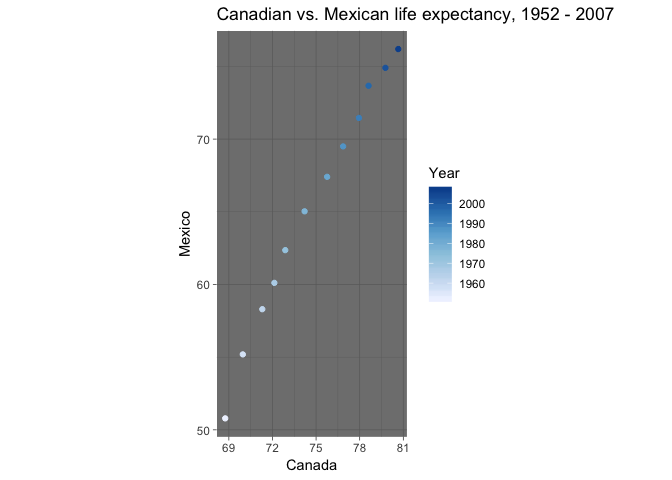

Exploring reshaping and joins with dplyr and gapminder
================
Mielle Michaux
October 2, 2018

-   [Getting started](#getting-started)
-   [Reshape data](#reshape-data)
    -   [Reshaping life expectancy by country](#reshaping-life-expectancy-by-country)
    -   [Issues with the United States, need to change column name to have no spaces?](#issues-with-the-united-states-need-to-change-column-name-to-have-no-spaces)
-   [Joins](#joins)
    -   [Getting started with mapping](#getting-started-with-mapping)
    -   [Mapping North American life expectancy](#mapping-north-american-life-expectancy)
    -   [Renaming "gapminder" to join with "world"](#renaming-gapminder-to-join-with-world)
    -   [Joining and plotting life expectancy](#joining-and-plotting-life-expectancy)
    -   [World map of life expectancy](#world-map-of-life-expectancy)
    -   [Exploring which type of join to use](#exploring-which-type-of-join-to-use)
-   [Special thanks to](#special-thanks-to)

Getting started
---------------

``` r
suppressPackageStartupMessages(library(tidyverse))
suppressPackageStartupMessages(library(ggplot2))
suppressPackageStartupMessages(library(gapminder))
suppressPackageStartupMessages(library(kableExtra))
suppressPackageStartupMessages(library(maps))
suppressPackageStartupMessages(library(RColorBrewer)) # for some nice colors

suppressPackageStartupMessages(library(mapdata)) #library of some useable maps, won't be applying in this tutorial however
```

Reshape data
------------

#### Reshaping life expectancy by country

> Objective: Make a tibble with one row per year and columns for life expectancy for two or more countries. Use knitr::kable() to make this table look pretty in your rendered homework. Take advantage of this new data shape to scatterplot life expectancy for one country against that of another.

I found it hard to conceptualize how my new tibble should be structured, so I created a table to model the structure of gapminder, and then another to model what my new table should look like.

**Gapminder:**

| country  | year | lifeExp |
|----------|------|---------|
| country1 | year | lifeExp |
| country2 | year | lifeExp |
| country3 | year | lifeExp |

**New table:**

| year | country1 | country2 |
|------|----------|----------|
| 1952 | lifeExp  | lifeExp  |
| 1957 | lifeExp  | lifeExp  |
| 1962 | lifeExp  | lifeExp  |

#### Issues with the United States, need to change column name to have no spaces?

To make our North America table, I'm going to select the variables that I want (year, country, and life expectancy), filter for the desired countries, and use spread() to change the structure.

To display, I've used knitr::kable.

``` r
north <- gapminder %>% 
  select(year, country, lifeExp) %>% 
  filter(country %in% c("Canada", "United States", "Mexico")) %>% 
  spread(key = "country", value = "lifeExp")

north %>% 
  kable(caption = "North American life expectancy, 1952 - 2007", digits = 1) %>% 
  kable_styling(bootstrap_options = "striped", full_width = FALSE) %>% 
  add_header_above(c(" " = 1, "Country" = 3))
```

<table class="table table-striped" style="width: auto !important; margin-left: auto; margin-right: auto;">
<caption>
North American life expectancy, 1952 - 2007
</caption>
<thead>
<tr>
<th style="border-bottom:hidden" colspan="1">
</th>
<th style="border-bottom:hidden; padding-bottom:0; padding-left:3px;padding-right:3px;text-align: center; " colspan="3">
Country

</th>
</tr>
<tr>
<th style="text-align:right;">
year
</th>
<th style="text-align:right;">
Canada
</th>
<th style="text-align:right;">
Mexico
</th>
<th style="text-align:right;">
United States
</th>
</tr>
</thead>
<tbody>
<tr>
<td style="text-align:right;">
1952
</td>
<td style="text-align:right;">
68.8
</td>
<td style="text-align:right;">
50.8
</td>
<td style="text-align:right;">
68.4
</td>
</tr>
<tr>
<td style="text-align:right;">
1957
</td>
<td style="text-align:right;">
70.0
</td>
<td style="text-align:right;">
55.2
</td>
<td style="text-align:right;">
69.5
</td>
</tr>
<tr>
<td style="text-align:right;">
1962
</td>
<td style="text-align:right;">
71.3
</td>
<td style="text-align:right;">
58.3
</td>
<td style="text-align:right;">
70.2
</td>
</tr>
<tr>
<td style="text-align:right;">
1967
</td>
<td style="text-align:right;">
72.1
</td>
<td style="text-align:right;">
60.1
</td>
<td style="text-align:right;">
70.8
</td>
</tr>
<tr>
<td style="text-align:right;">
1972
</td>
<td style="text-align:right;">
72.9
</td>
<td style="text-align:right;">
62.4
</td>
<td style="text-align:right;">
71.3
</td>
</tr>
<tr>
<td style="text-align:right;">
1977
</td>
<td style="text-align:right;">
74.2
</td>
<td style="text-align:right;">
65.0
</td>
<td style="text-align:right;">
73.4
</td>
</tr>
<tr>
<td style="text-align:right;">
1982
</td>
<td style="text-align:right;">
75.8
</td>
<td style="text-align:right;">
67.4
</td>
<td style="text-align:right;">
74.7
</td>
</tr>
<tr>
<td style="text-align:right;">
1987
</td>
<td style="text-align:right;">
76.9
</td>
<td style="text-align:right;">
69.5
</td>
<td style="text-align:right;">
75.0
</td>
</tr>
<tr>
<td style="text-align:right;">
1992
</td>
<td style="text-align:right;">
78.0
</td>
<td style="text-align:right;">
71.5
</td>
<td style="text-align:right;">
76.1
</td>
</tr>
<tr>
<td style="text-align:right;">
1997
</td>
<td style="text-align:right;">
78.6
</td>
<td style="text-align:right;">
73.7
</td>
<td style="text-align:right;">
76.8
</td>
</tr>
<tr>
<td style="text-align:right;">
2002
</td>
<td style="text-align:right;">
79.8
</td>
<td style="text-align:right;">
74.9
</td>
<td style="text-align:right;">
77.3
</td>
</tr>
<tr>
<td style="text-align:right;">
2007
</td>
<td style="text-align:right;">
80.7
</td>
<td style="text-align:right;">
76.2
</td>
<td style="text-align:right;">
78.2
</td>
</tr>
</tbody>
</table>
Now, I can plot the life expectancy of two countries against each other to compare changeo over time. I've set the ratio of the x and y scales to 1 to allow for a more accuate comparison of change over time. With R's default ratio, the two countries appear to have an increase that is fairly similar.

``` r
ggplot(north, aes(Canada, Mexico, color = year)) +
  geom_point() + 
  ggtitle("Canadian vs. Mexican life expectancy, 1952 - 2007") +
  coord_fixed(1) + #ratio of x to y 
  scale_color_distiller(palette = "Blues", direction = 1, "Year") +
  theme_dark()
```



Looks like while Canadian life expectancy is generally higher, Mexico's increased much more dramatically.

Joins
-----

> Prompt: create a second data frame, complementary to Gapminder. Join this with (part of) Gapminder using a dplyr join function and make some observations about the process and result. Explore the different types of joins.

As a geographer, I spend quite a bit of time thinking, learning, and teaching about how to make maps. Not all data comes with geographic information, so a big part of my job is often figuring out a way to attach geographic data (think latitude and longitude coordinates) to a set of attribute data (like population or life expectancy). This seemed like a great way to explore using joins in R.

To start off, let's make tables to visualize how we will need the data frame to be structured in order to create a map from it. This is a bit over-simplified, but it's a good place to begin.

**Gapminder**

| country  | year | lifeExp |
|----------|------|---------|
| country1 | year | lifeExp |
| country2 | year | lifeExp |
| country3 | year | lifeExp |

**Map data**

| latitude | longitude | country  | year | LifeExp |
|----------|-----------|----------|------|---------|
| latitude | longitude | country1 | year | lifeExp |
| latitude | longitude | country2 | year | lifeExp |
| latitude | longitude | country3 | year | lifeExp |

#### Getting started with mapping

I'm going to look at the "maps" package help file to see what maps are available.

``` r
help(package = "maps")
```

From this, I've selected the "world" option, which is a fairly low resolution world map. Ideally I would use other packages to find something specifically tailored to North America, but I'm keeping it simple for now.

I'm just going to use glimpse() to check that the "world" data to make sure it has the spatial information I'm looking for.

``` r
world <- map_data("world")

glimpse(world)
```

    ## Observations: 99,338
    ## Variables: 6
    ## $ long      <dbl> -69.89912, -69.89571, -69.94219, -70.00415, -70.0661...
    ## $ lat       <dbl> 12.45200, 12.42300, 12.43853, 12.50049, 12.54697, 12...
    ## $ group     <dbl> 1, 1, 1, 1, 1, 1, 1, 1, 1, 1, 2, 2, 2, 2, 2, 2, 2, 2...
    ## $ order     <int> 1, 2, 3, 4, 5, 6, 7, 8, 9, 10, 12, 13, 14, 15, 16, 1...
    ## $ region    <chr> "Aruba", "Aruba", "Aruba", "Aruba", "Aruba", "Aruba"...
    ## $ subregion <chr> NA, NA, NA, NA, NA, NA, NA, NA, NA, NA, NA, NA, NA, ...

Yep, the world dataset includes geographic coordinates (latitude and longitude). Importantly, it also contains country names in the "region" column that we'll be able to join with country names in the gapminder data.

Now, I'm going to plot the world data in ggplot2 to create a blank world map.

``` r
world <- map_data("world")
ggplot() + geom_polygon(data = world, aes(x=long, y = lat, group = group)) + 
  coord_fixed(1.1) # set ratio of x to y
```

 Yes, looks like this will work for my purpose.

ggplot2 uses a set of points and information on which order to connect those points in order to draw each country. I'm going to color the map by "region" (country) to make sure that these many points will be treated as a single entity when I try to map life expectancy.

``` r
world <- map_data("world")
ggplot() + geom_polygon(data = world, aes(x=long, y = lat, group = group, fill = region), color = "white") + 
  coord_fixed(1.1) +
  guides(fill=FALSE) #supress legend
```


Looks like this will work!

#### Mapping North American life expectancy

Let's create a map of life expectancy for North America for the year 2007.

First, we need to use dplyr to create a data frame with North American life expectancy in 2007.

``` r
north07 <-gapminder %>%
  filter(year == 2007) %>%
  filter(country %in% c("Canada", "United States", "Mexico")) 

north07
```

    ## # A tibble: 3 x 6
    ##   country       continent  year lifeExp       pop gdpPercap
    ##   <fct>         <fct>     <int>   <dbl>     <int>     <dbl>
    ## 1 Canada        Americas   2007    80.7  33390141    36319.
    ## 2 Mexico        Americas   2007    76.2 108700891    11978.
    ## 3 United States Americas   2007    78.2 301139947    42952.

You'll notice that the north07 data frame lacks any spatial attributes (like latitude and longitude coordinates) to actually locate each country on the map.

To fix this, we'll need to join gapminder data with the geographic dataset, "world". Before we do that, let's make sure that the country names we need are the same in "world" as they are in "gapminder".

``` r
#maybe select only those starting with "u"
unique(world$region)
```

    ##   [1] "Aruba"                              
    ##   [2] "Afghanistan"                        
    ##   [3] "Angola"                             
    ##   [4] "Anguilla"                           
    ##   [5] "Albania"                            
    ##   [6] "Finland"                            
    ##   [7] "Andorra"                            
    ##   [8] "United Arab Emirates"               
    ##   [9] "Argentina"                          
    ##  [10] "Armenia"                            
    ##  [11] "American Samoa"                     
    ##  [12] "Antarctica"                         
    ##  [13] "Australia"                          
    ##  [14] "French Southern and Antarctic Lands"
    ##  [15] "Antigua"                            
    ##  [16] "Barbuda"                            
    ##  [17] "Austria"                            
    ##  [18] "Azerbaijan"                         
    ##  [19] "Burundi"                            
    ##  [20] "Belgium"                            
    ##  [21] "Benin"                              
    ##  [22] "Burkina Faso"                       
    ##  [23] "Bangladesh"                         
    ##  [24] "Bulgaria"                           
    ##  [25] "Bahrain"                            
    ##  [26] "Bahamas"                            
    ##  [27] "Bosnia and Herzegovina"             
    ##  [28] "Saint Barthelemy"                   
    ##  [29] "Belarus"                            
    ##  [30] "Belize"                             
    ##  [31] "Bermuda"                            
    ##  [32] "Bolivia"                            
    ##  [33] "Brazil"                             
    ##  [34] "Barbados"                           
    ##  [35] "Brunei"                             
    ##  [36] "Bhutan"                             
    ##  [37] "Botswana"                           
    ##  [38] "Central African Republic"           
    ##  [39] "Canada"                             
    ##  [40] "Switzerland"                        
    ##  [41] "Chile"                              
    ##  [42] "China"                              
    ##  [43] "Ivory Coast"                        
    ##  [44] "Cameroon"                           
    ##  [45] "Democratic Republic of the Congo"   
    ##  [46] "Republic of Congo"                  
    ##  [47] "Cook Islands"                       
    ##  [48] "Colombia"                           
    ##  [49] "Comoros"                            
    ##  [50] "Cape Verde"                         
    ##  [51] "Costa Rica"                         
    ##  [52] "Cuba"                               
    ##  [53] "Curacao"                            
    ##  [54] "Cayman Islands"                     
    ##  [55] "Cyprus"                             
    ##  [56] "Czech Republic"                     
    ##  [57] "Germany"                            
    ##  [58] "Djibouti"                           
    ##  [59] "Dominica"                           
    ##  [60] "Denmark"                            
    ##  [61] "Dominican Republic"                 
    ##  [62] "Algeria"                            
    ##  [63] "Ecuador"                            
    ##  [64] "Egypt"                              
    ##  [65] "Eritrea"                            
    ##  [66] "Canary Islands"                     
    ##  [67] "Spain"                              
    ##  [68] "Estonia"                            
    ##  [69] "Ethiopia"                           
    ##  [70] "Fiji"                               
    ##  [71] "Falkland Islands"                   
    ##  [72] "Reunion"                            
    ##  [73] "Mayotte"                            
    ##  [74] "French Guiana"                      
    ##  [75] "Martinique"                         
    ##  [76] "Guadeloupe"                         
    ##  [77] "France"                             
    ##  [78] "Faroe Islands"                      
    ##  [79] "Micronesia"                         
    ##  [80] "Gabon"                              
    ##  [81] "UK"                                 
    ##  [82] "Georgia"                            
    ##  [83] "Guernsey"                           
    ##  [84] "Ghana"                              
    ##  [85] "Guinea"                             
    ##  [86] "Gambia"                             
    ##  [87] "Guinea-Bissau"                      
    ##  [88] "Equatorial Guinea"                  
    ##  [89] "Greece"                             
    ##  [90] "Grenada"                            
    ##  [91] "Greenland"                          
    ##  [92] "Guatemala"                          
    ##  [93] "Guam"                               
    ##  [94] "Guyana"                             
    ##  [95] "Heard Island"                       
    ##  [96] "Honduras"                           
    ##  [97] "Croatia"                            
    ##  [98] "Haiti"                              
    ##  [99] "Hungary"                            
    ## [100] "Indonesia"                          
    ## [101] "Isle of Man"                        
    ## [102] "India"                              
    ## [103] "Cocos Islands"                      
    ## [104] "Christmas Island"                   
    ## [105] "Chagos Archipelago"                 
    ## [106] "Ireland"                            
    ## [107] "Iran"                               
    ## [108] "Iraq"                               
    ## [109] "Iceland"                            
    ## [110] "Israel"                             
    ## [111] "Italy"                              
    ## [112] "San Marino"                         
    ## [113] "Jamaica"                            
    ## [114] "Jersey"                             
    ## [115] "Jordan"                             
    ## [116] "Japan"                              
    ## [117] "Siachen Glacier"                    
    ## [118] "Kazakhstan"                         
    ## [119] "Kenya"                              
    ## [120] "Kyrgyzstan"                         
    ## [121] "Cambodia"                           
    ## [122] "Kiribati"                           
    ## [123] "Nevis"                              
    ## [124] "Saint Kitts"                        
    ## [125] "South Korea"                        
    ## [126] "Kosovo"                             
    ## [127] "Kuwait"                             
    ## [128] "Laos"                               
    ## [129] "Lebanon"                            
    ## [130] "Liberia"                            
    ## [131] "Libya"                              
    ## [132] "Saint Lucia"                        
    ## [133] "Liechtenstein"                      
    ## [134] "Sri Lanka"                          
    ## [135] "Lesotho"                            
    ## [136] "Lithuania"                          
    ## [137] "Luxembourg"                         
    ## [138] "Latvia"                             
    ## [139] "Saint Martin"                       
    ## [140] "Morocco"                            
    ## [141] "Monaco"                             
    ## [142] "Moldova"                            
    ## [143] "Madagascar"                         
    ## [144] "Maldives"                           
    ## [145] "Mexico"                             
    ## [146] "Marshall Islands"                   
    ## [147] "Macedonia"                          
    ## [148] "Mali"                               
    ## [149] "Malta"                              
    ## [150] "Myanmar"                            
    ## [151] "Montenegro"                         
    ## [152] "Mongolia"                           
    ## [153] "Northern Mariana Islands"           
    ## [154] "Mozambique"                         
    ## [155] "Mauritania"                         
    ## [156] "Montserrat"                         
    ## [157] "Mauritius"                          
    ## [158] "Malawi"                             
    ## [159] "Malaysia"                           
    ## [160] "Namibia"                            
    ## [161] "New Caledonia"                      
    ## [162] "Niger"                              
    ## [163] "Norfolk Island"                     
    ## [164] "Nigeria"                            
    ## [165] "Nicaragua"                          
    ## [166] "Niue"                               
    ## [167] "Bonaire"                            
    ## [168] "Sint Eustatius"                     
    ## [169] "Saba"                               
    ## [170] "Netherlands"                        
    ## [171] "Norway"                             
    ## [172] "Nepal"                              
    ## [173] "Nauru"                              
    ## [174] "New Zealand"                        
    ## [175] "Oman"                               
    ## [176] "Pakistan"                           
    ## [177] "Panama"                             
    ## [178] "Pitcairn Islands"                   
    ## [179] "Peru"                               
    ## [180] "Philippines"                        
    ## [181] "Palau"                              
    ## [182] "Papua New Guinea"                   
    ## [183] "Poland"                             
    ## [184] "Puerto Rico"                        
    ## [185] "North Korea"                        
    ## [186] "Madeira Islands"                    
    ## [187] "Azores"                             
    ## [188] "Portugal"                           
    ## [189] "Paraguay"                           
    ## [190] "Palestine"                          
    ## [191] "French Polynesia"                   
    ## [192] "Qatar"                              
    ## [193] "Romania"                            
    ## [194] "Russia"                             
    ## [195] "Rwanda"                             
    ## [196] "Western Sahara"                     
    ## [197] "Saudi Arabia"                       
    ## [198] "Sudan"                              
    ## [199] "South Sudan"                        
    ## [200] "Senegal"                            
    ## [201] "Singapore"                          
    ## [202] "South Sandwich Islands"             
    ## [203] "South Georgia"                      
    ## [204] "Saint Helena"                       
    ## [205] "Ascension Island"                   
    ## [206] "Solomon Islands"                    
    ## [207] "Sierra Leone"                       
    ## [208] "El Salvador"                        
    ## [209] "Somalia"                            
    ## [210] "Saint Pierre and Miquelon"          
    ## [211] "Serbia"                             
    ## [212] "Sao Tome and Principe"              
    ## [213] "Suriname"                           
    ## [214] "Slovakia"                           
    ## [215] "Slovenia"                           
    ## [216] "Sweden"                             
    ## [217] "Swaziland"                          
    ## [218] "Sint Maarten"                       
    ## [219] "Seychelles"                         
    ## [220] "Syria"                              
    ## [221] "Turks and Caicos Islands"           
    ## [222] "Chad"                               
    ## [223] "Togo"                               
    ## [224] "Thailand"                           
    ## [225] "Tajikistan"                         
    ## [226] "Turkmenistan"                       
    ## [227] "Timor-Leste"                        
    ## [228] "Tonga"                              
    ## [229] "Trinidad"                           
    ## [230] "Tobago"                             
    ## [231] "Tunisia"                            
    ## [232] "Turkey"                             
    ## [233] "Taiwan"                             
    ## [234] "Tanzania"                           
    ## [235] "Uganda"                             
    ## [236] "Ukraine"                            
    ## [237] "Uruguay"                            
    ## [238] "USA"                                
    ## [239] "Uzbekistan"                         
    ## [240] "Vatican"                            
    ## [241] "Grenadines"                         
    ## [242] "Saint Vincent"                      
    ## [243] "Venezuela"                          
    ## [244] "Virgin Islands"                     
    ## [245] "Vietnam"                            
    ## [246] "Vanuatu"                            
    ## [247] "Wallis and Futuna"                  
    ## [248] "Samoa"                              
    ## [249] "Yemen"                              
    ## [250] "South Africa"                       
    ## [251] "Zambia"                             
    ## [252] "Zimbabwe"

In line 237, we can see that the "world" data uses Canada, USA, and Mexico. Because gapminder uses "United States", we will have to change the country name in our North America data order to join the data correctly. I will also retitle the "country" column to "region", as that's what it's called in the "world" data.

#### Renaming "gapminder" to join with "world"

``` r
north <- north07 %>% 
  rename(region = country) %>% 
  mutate(region = as.character(region)) %>% #change "region" from factor to character 
  mutate(region = ifelse(region == "United States", "USA", region))

north %>% 
  kable(caption = "North American population, 2007", digits = 1) %>% 
  kable_styling(bootstrap_options = "striped", full_width = FALSE)
```

<table class="table table-striped" style="width: auto !important; margin-left: auto; margin-right: auto;">
<caption>
North American population, 2007
</caption>
<thead>
<tr>
<th style="text-align:left;">
region
</th>
<th style="text-align:left;">
continent
</th>
<th style="text-align:right;">
year
</th>
<th style="text-align:right;">
lifeExp
</th>
<th style="text-align:right;">
pop
</th>
<th style="text-align:right;">
gdpPercap
</th>
</tr>
</thead>
<tbody>
<tr>
<td style="text-align:left;">
Canada
</td>
<td style="text-align:left;">
Americas
</td>
<td style="text-align:right;">
2007
</td>
<td style="text-align:right;">
80.7
</td>
<td style="text-align:right;">
33390141
</td>
<td style="text-align:right;">
36319.2
</td>
</tr>
<tr>
<td style="text-align:left;">
Mexico
</td>
<td style="text-align:left;">
Americas
</td>
<td style="text-align:right;">
2007
</td>
<td style="text-align:right;">
76.2
</td>
<td style="text-align:right;">
108700891
</td>
<td style="text-align:right;">
11977.6
</td>
</tr>
<tr>
<td style="text-align:left;">
USA
</td>
<td style="text-align:left;">
Americas
</td>
<td style="text-align:right;">
2007
</td>
<td style="text-align:right;">
78.2
</td>
<td style="text-align:right;">
301139947
</td>
<td style="text-align:right;">
42951.7
</td>
</tr>
</tbody>
</table>
Now that we've successfully prepared our North America data frame, let's join it to the world data and start mapping!

#### Joining and plotting life expectancy

``` r
northgeog <- right_join(world, north, by = "region")
```

This data set is huge (18,341 rows!), so let's check to make sure all the countries we need are represented.

``` r
unique(northgeog$region)
```

    ## [1] "Canada" "Mexico" "USA"

Yep, looks like we have only the countries we want to map.

Let's draw this as a rough plot to see how it looks.

``` r
ggplot() + 
  geom_polygon(data = northgeog, aes(x=long, y = lat, group = group, fill = lifeExp)) +
  coord_fixed(1.1) # ratio of x to y
```


Pretty good! This data appears unprojected, so Northern Canada is pretty distorted. We'll take care of that next.

``` r
ggplot() + 
  geom_polygon(data = northgeog, aes(x=long, y = lat, group = group, fill = lifeExp)) +
  coord_fixed(1.5) +
  coord_map("albers", lat0 = 20, lat1 = 60) + # set projection
  scale_fill_distiller(palette = 2, direction = 1, "Life\nexpectancy") +
  theme_void() +
  ggtitle("North American life expectancy, 2007") 
```

    ## Coordinate system already present. Adding new coordinate system, which will replace the existing one.


The projection I'm using isn't quite suited for this map, but it's less distorted than the unprojected map above. If this exercise were about maps, and not joins, I would spend more time on this!

Real quick, here is another projection option: mollweide.

``` r
ggplot() + 
  geom_polygon(data = northgeog, aes(x=long, y = lat, group = group, fill = lifeExp)) +
  coord_fixed(1.1) +
  coord_map("mollweide")
```

    ## Coordinate system already present. Adding new coordinate system, which will replace the existing one.


``` r
# no winkel-triple or robinson available 
```

#### World map of life expectancy

Now that I've made the North America map, I want to try using the same join workflow to create a world map of the same data.

First, by filtering to the 2007 dataset and renaming "country" to "region" to facilitate the join.

``` r
worldlife <-gapminder %>%
  filter(year == 2007) %>% 
  rename(region = country)
```

``` r
worldlifegeog <- right_join(world, worldlife, by = "region")
```

    ## Warning: Column `region` joining character vector and factor, coercing into
    ## character vector

``` r
ggplot() + 
  geom_polygon(data = worldlifegeog, aes(x=long, y = lat, group = group, fill = lifeExp)) +
  coord_fixed(1.1)
```


Clearly, this is missing a few countries. If I were to do this properly, I would need to select all the countries that don't have a consistent name in the "world" and "gapminder" datasets and rename them to match -- like I did with the US in the North America maps. For now, we'll have to learn to live without the DRC, Britain, Russia and the United States (to name a few).

#### Exploring which type of join to use

I tried a semi-join of world and the North America data, but it only selected the rows that corresponded to Canada, the US, and Mexico in the world data. This data frame is way too big to show.

``` r
semiwn <- semi_join(world, north)
```

    ## Joining, by = "region"

``` r
glimpse(semiwn)
```

    ## Observations: 18,341
    ## Variables: 6
    ## $ long      <dbl> -59.78760, -59.92227, -60.03775, -60.11426, -60.1174...
    ## $ lat       <dbl> 43.93960, 43.90391, 43.90664, 43.93911, 43.95337, 43...
    ## $ group     <dbl> 245, 245, 245, 245, 245, 245, 245, 245, 245, 246, 24...
    ## $ order     <int> 14759, 14760, 14761, 14762, 14763, 14764, 14765, 147...
    ## $ region    <chr> "Canada", "Canada", "Canada", "Canada", "Canada", "C...
    ## $ subregion <chr> "Sable Island", "Sable Island", "Sable Island", "Sab...

I made sure that this semi-join only included North America.

``` r
unique(semiwn$region)
```

    ## [1] "Canada" "Mexico" "USA"

I can also the the same semi-join, but with North America and world data instead. This produces a table with just one row per country-- essentially, recreating the "north07" data frame I used to make the "north" data frame in the first place!

``` r
semi_join(north, world) %>% 
  kable(caption = "", digits = 1) %>% 
  kable_styling(bootstrap_options = "striped", full_width = FALSE)
```

    ## Joining, by = "region"

<table class="table table-striped" style="width: auto !important; margin-left: auto; margin-right: auto;">
<caption>
</caption>
<thead>
<tr>
<th style="text-align:left;">
region
</th>
<th style="text-align:left;">
continent
</th>
<th style="text-align:right;">
year
</th>
<th style="text-align:right;">
lifeExp
</th>
<th style="text-align:right;">
pop
</th>
<th style="text-align:right;">
gdpPercap
</th>
</tr>
</thead>
<tbody>
<tr>
<td style="text-align:left;">
Canada
</td>
<td style="text-align:left;">
Americas
</td>
<td style="text-align:right;">
2007
</td>
<td style="text-align:right;">
80.7
</td>
<td style="text-align:right;">
33390141
</td>
<td style="text-align:right;">
36319.2
</td>
</tr>
<tr>
<td style="text-align:left;">
Mexico
</td>
<td style="text-align:left;">
Americas
</td>
<td style="text-align:right;">
2007
</td>
<td style="text-align:right;">
76.2
</td>
<td style="text-align:right;">
108700891
</td>
<td style="text-align:right;">
11977.6
</td>
</tr>
<tr>
<td style="text-align:left;">
USA
</td>
<td style="text-align:left;">
Americas
</td>
<td style="text-align:right;">
2007
</td>
<td style="text-align:right;">
78.2
</td>
<td style="text-align:right;">
301139947
</td>
<td style="text-align:right;">
42951.7
</td>
</tr>
</tbody>
</table>
Inner\_join produces the same results as the right join we used to merge the geographic and attribute data, so I probably could have used this to make the map as well.

``` r
inner_join(world, north, by = "region")
```

    ##             long      lat group order region
    ## 1      -59.78760 43.93960   245 14759 Canada
    ## 2      -59.92227 43.90391   245 14760 Canada
    ## 3      -60.03775 43.90664   245 14761 Canada
    ## 4      -60.11426 43.93911   245 14762 Canada
    ## 5      -60.11748 43.95337   245 14763 Canada
    ## 6      -59.93604 43.93960   245 14764 Canada
    ## 7      -59.86636 43.94717   245 14765 Canada
    ## 8      -59.72715 44.00283   245 14766 Canada
    ## 9      -59.78760 43.93960   245 14767 Canada
    ## 10     -66.27377 44.29229   246 14769 Canada
    ## 11     -66.32412 44.25732   246 14770 Canada
    ## 12     -66.31191 44.29160   246 14771 Canada
    ## 13     -66.25049 44.37901   246 14772 Canada
    ## 14     -66.21035 44.39204   246 14773 Canada
    ## 15     -66.27377 44.29229   246 14774 Canada
    ## 16     -66.76250 44.68179   247 14776 Canada
    ## 17     -66.89707 44.62891   247 14777 Canada
    ## 18     -66.84473 44.76392   247 14778 Canada
    ## 19     -66.80215 44.80537   247 14779 Canada
    ## 20     -66.74541 44.79141   247 14780 Canada
    ## 21     -66.75337 44.70981   247 14781 Canada
    ## 22     -66.76250 44.68179   247 14782 Canada
    ## 23     -60.96157 45.48994   248 14784 Canada
    ## 24     -61.00288 45.48174   248 14785 Canada
    ## 25     -61.01250 45.49604   248 14786 Canada
    ## 26     -61.07617 45.53730   248 14787 Canada
    ## 27     -61.08174 45.55781   248 14788 Canada
    ## 28     -61.02598 45.57734   248 14789 Canada
    ## 29     -60.91245 45.56729   248 14790 Canada
    ## 30     -60.95303 45.51553   248 14791 Canada
    ## 31     -60.96157 45.48994   248 14792 Canada
    ## 32     -73.69531 45.58550   249 14794 Canada
    ## 33     -73.81592 45.56489   249 14795 Canada
    ## 34     -73.85772 45.57358   249 14796 Canada
    ## 35     -73.72466 45.67183   249 14797 Canada
    ## 36     -73.57236 45.69448   249 14798 Canada
    ## 37     -73.69531 45.58550   249 14799 Canada
    ## 38     -73.56651 45.46909   250 14801 Canada
    ## 39     -73.64355 45.44912   250 14802 Canada
    ## 40     -73.77534 45.46763   250 14803 Canada
    ## 41     -73.92021 45.44194   250 14804 Canada
    ## 42     -73.96055 45.44141   250 14805 Canada
    ## 43     -73.85293 45.51572   250 14806 Canada
    ## 44     -73.68745 45.56142   250 14807 Canada
    ## 45     -73.52246 45.70117   250 14808 Canada
    ## 46     -73.47607 45.70474   250 14809 Canada
    ## 47     -73.53886 45.54644   250 14810 Canada
    ## 48     -73.55166 45.48985   250 14811 Canada
    ## 49     -73.56651 45.46909   250 14812 Canada
    ## 50     -71.02573 46.87295   251 14814 Canada
    ## 51     -71.11665 46.86485   251 14815 Canada
    ## 52     -71.09497 46.89956   251 14816 Canada
    ## 53     -70.97085 46.96143   251 14817 Canada
    ## 54     -70.87964 46.99609   251 14818 Canada
    ## 55     -70.82578 46.99536   251 14819 Canada
    ## 56     -70.91348 46.91953   251 14820 Canada
    ## 57     -71.02573 46.87295   251 14821 Canada
    ## 58     -61.10518 45.94473   252 14823 Canada
    ## 59     -61.07134 45.93711   252 14824 Canada
    ## 60     -60.93657 45.98555   252 14825 Canada
    ## 61     -60.86524 45.98350   252 14826 Canada
    ## 62     -60.86840 45.94863   252 14827 Canada
    ## 63     -60.98428 45.91069   252 14828 Canada
    ## 64     -61.03755 45.88223   252 14829 Canada
    ## 65     -60.97060 45.85581   252 14830 Canada
    ## 66     -60.97153 45.83799   252 14831 Canada
    ## 67     -61.05195 45.79502   252 14832 Canada
    ## 68     -61.09209 45.74839   252 14833 Canada
    ## 69     -61.05904 45.70337   252 14834 Canada
    ## 70     -60.93037 45.74771   252 14835 Canada
    ## 71     -60.87759 45.74810   252 14836 Canada
    ## 72     -60.80610 45.73809   252 14837 Canada
    ## 73     -60.73789 45.75142   252 14838 Canada
    ## 74     -60.69907 45.77334   252 14839 Canada
    ## 75     -60.47236 45.94653   252 14840 Canada
    ## 76     -60.46059 45.96870   252 14841 Canada
    ## 77     -60.70488 45.93291   252 14842 Canada
    ## 78     -60.73330 45.95659   252 14843 Canada
    ## 79     -60.57319 46.06143   252 14844 Canada
    ## 80     -60.58575 46.11665   252 14845 Canada
    ## 81     -60.50493 46.20386   252 14846 Canada
    ## 82     -60.43086 46.25562   252 14847 Canada
    ## 83     -60.37651 46.28457   252 14848 Canada
    ## 84     -60.29795 46.31123   252 14849 Canada
    ## 85     -60.24385 46.27011   252 14850 Canada
    ## 86     -60.22646 46.19556   252 14851 Canada
    ## 87     -60.09248 46.20601   252 14852 Canada
    ## 88     -59.96143 46.19097   252 14853 Canada
    ## 89     -59.86504 46.15952   252 14854 Canada
    ## 90     -59.85000 46.14141   252 14855 Canada
    ## 91     -59.84878 46.11294   252 14856 Canada
    ## 92     -59.88091 46.06162   252 14857 Canada
    ## 93     -59.93404 46.01944   252 14858 Canada
    ## 94     -59.82803 45.96514   252 14859 Canada
    ## 95     -59.84219 45.94155   252 14860 Canada
    ## 96     -60.01582 45.88047   252 14861 Canada
    ## 97     -60.11446 45.81890   252 14862 Canada
    ## 98     -60.20508 45.74302   252 14863 Canada
    ## 99     -60.38609 45.65464   252 14864 Canada
    ## 100    -60.67295 45.59082   252 14865 Canada
    ## 101    -60.76372 45.59082   252 14866 Canada
    ## 102    -60.87158 45.61069   252 14867 Canada
    ## 103    -60.97861 45.60615   252 14868 Canada
    ## 104    -61.08369 45.58237   252 14869 Canada
    ## 105    -61.18642 45.58501   252 14870 Canada
    ## 106    -61.23633 45.57251   252 14871 Canada
    ## 107    -61.28369 45.57388   252 14872 Canada
    ## 108    -61.32344 45.59849   252 14873 Canada
    ## 109    -61.40835 45.66909   252 14874 Canada
    ## 110    -61.44981 45.71621   252 14875 Canada
    ## 111    -61.49532 45.94146   252 14876 Canada
    ## 112    -61.48062 46.05976   252 14877 Canada
    ## 113    -61.40864 46.17036   252 14878 Canada
    ## 114    -61.30220 46.24385   252 14879 Canada
    ## 115    -61.24053 46.30254   252 14880 Canada
    ## 116    -60.98252 46.65049   252 14881 Canada
    ## 117    -60.93198 46.72944   252 14882 Canada
    ## 118    -60.87017 46.79678   252 14883 Canada
    ## 119    -60.75967 46.86338   252 14884 Canada
    ## 120    -60.61665 46.97578   252 14885 Canada
    ## 121    -60.57104 46.99883   252 14886 Canada
    ## 122    -60.48906 47.00972   252 14887 Canada
    ## 123    -60.40820 47.00351   252 14888 Canada
    ## 124    -60.43135 46.96294   252 14889 Canada
    ## 125    -60.42544 46.92319   252 14890 Canada
    ## 126    -60.33174 46.76782   252 14891 Canada
    ## 127    -60.33291 46.73701   252 14892 Canada
    ## 128    -60.38408 46.61333   252 14893 Canada
    ## 129    -60.48243 46.41352   252 14894 Canada
    ## 130    -60.50772 46.30337   252 14895 Canada
    ## 131    -60.49453 46.27026   252 14896 Canada
    ## 132    -60.53442 46.21455   252 14897 Canada
    ## 133    -60.57686 46.17217   252 14898 Canada
    ## 134    -60.74483 46.09267   252 14899 Canada
    ## 135    -60.83057 46.07412   252 14900 Canada
    ## 136    -60.91221 46.04458   252 14901 Canada
    ## 137    -61.10518 45.94473   252 14902 Canada
    ## 138    -63.81128 46.46870   253 14904 Canada
    ## 139    -63.78423 46.45464   253 14905 Canada
    ## 140    -63.73701 46.48052   253 14906 Canada
    ## 141    -63.68145 46.56192   253 14907 Canada
    ## 142    -63.53437 46.54063   253 14908 Canada
    ## 143    -63.45649 46.50391   253 14909 Canada
    ## 144    -63.41314 46.51201   253 14910 Canada
    ## 145    -63.36865 46.50826   253 14911 Canada
    ## 146    -63.28608 46.46021   253 14912 Canada
    ## 147    -63.12939 46.42222   253 14913 Canada
    ## 148    -62.96402 46.42773   253 14914 Canada
    ## 149    -62.71201 46.45029   253 14915 Canada
    ## 150    -62.68193 46.45942   253 14916 Canada
    ## 151    -62.42309 46.47827   253 14917 Canada
    ## 152    -62.16357 46.48721   253 14918 Canada
    ## 153    -62.07427 46.46572   253 14919 Canada
    ## 154    -62.04087 46.44570   253 14920 Canada
    ## 155    -62.02373 46.42158   253 14921 Canada
    ## 156    -62.17178 46.35537   253 14922 Canada
    ## 157    -62.31997 46.27832   253 14923 Canada
    ## 158    -62.52607 46.20288   253 14924 Canada
    ## 159    -62.55200 46.16592   253 14925 Canada
    ## 160    -62.53921 46.09795   253 14926 Canada
    ## 161    -62.54326 46.02866   253 14927 Canada
    ## 162    -62.50259 46.02295   253 14928 Canada
    ## 163    -62.47808 45.99971   253 14929 Canada
    ## 164    -62.53135 45.97729   253 14930 Canada
    ## 165    -62.74316 45.96689   253 14931 Canada
    ## 166    -62.80488 45.97319   253 14932 Canada
    ## 167    -62.87836 46.00137   253 14933 Canada
    ## 168    -62.90351 46.06826   253 14934 Canada
    ## 169    -62.99463 46.05845   253 14935 Canada
    ## 170    -63.02207 46.06660   253 14936 Canada
    ## 171    -62.89454 46.12358   253 14937 Canada
    ## 172    -62.95264 46.19516   253 14938 Canada
    ## 173    -63.01504 46.18994   253 14939 Canada
    ## 174    -63.05635 46.22393   253 14940 Canada
    ## 175    -63.05293 46.26982   253 14941 Canada
    ## 176    -62.99511 46.29214   253 14942 Canada
    ## 177    -62.97847 46.31636   253 14943 Canada
    ## 178    -63.05689 46.29536   253 14944 Canada
    ## 179    -63.11699 46.25283   253 14945 Canada
    ## 180    -63.19473 46.23672   253 14946 Canada
    ## 181    -63.27080 46.20000   253 14947 Canada
    ## 182    -63.15278 46.18833   253 14948 Canada
    ## 183    -63.21347 46.15986   253 14949 Canada
    ## 184    -63.27662 46.15327   253 14950 Canada
    ## 185    -63.56890 46.20923   253 14951 Canada
    ## 186    -63.64102 46.23047   253 14952 Canada
    ## 187    -63.73178 46.28906   253 14953 Canada
    ## 188    -63.80054 46.36733   253 14954 Canada
    ## 189    -63.76323 46.37036   253 14955 Canada
    ## 190    -63.75053 46.38438   253 14956 Canada
    ## 191    -63.75864 46.39761   253 14957 Canada
    ## 192    -63.86055 46.40815   253 14958 Canada
    ## 193    -64.01972 46.40483   253 14959 Canada
    ## 194    -64.11084 46.42544   253 14960 Canada
    ## 195    -64.10654 46.56211   253 14961 Canada
    ## 196    -64.13604 46.59971   253 14962 Canada
    ## 197    -64.23564 46.63145   253 14963 Canada
    ## 198    -64.38804 46.64087   253 14964 Canada
    ## 199    -64.40312 46.69160   253 14965 Canada
    ## 200    -64.35459 46.76924   253 14966 Canada
    ## 201    -64.27998 46.83574   253 14967 Canada
    ## 202    -64.22324 46.90127   253 14968 Canada
    ## 203    -64.15694 46.95488   253 14969 Canada
    ## 204    -63.99355 47.06157   253 14970 Canada
    ## 205    -63.99727 46.98174   253 14971 Canada
    ## 206    -63.98149 46.91299   253 14972 Canada
    ## 207    -64.08789 46.77544   253 14973 Canada
    ## 208    -63.90302 46.63911   253 14974 Canada
    ## 209    -63.87930 46.60899   253 14975 Canada
    ## 210    -63.86372 46.57236   253 14976 Canada
    ## 211    -63.87564 46.53867   253 14977 Canada
    ## 212    -63.90557 46.50879   253 14978 Canada
    ## 213    -63.83360 46.49390   253 14979 Canada
    ## 214    -63.81128 46.46870   253 14980 Canada
    ## 215    -61.91412 47.28452   254 14982 Canada
    ## 216    -61.87871 47.26553   254 14983 Canada
    ## 217    -61.81548 47.26758   254 14984 Canada
    ## 218    -61.77256 47.25982   254 14985 Canada
    ## 219    -61.83374 47.22261   254 14986 Canada
    ## 220    -61.95083 47.21899   254 14987 Canada
    ## 221    -62.00830 47.23428   254 14988 Canada
    ## 222    -61.92471 47.42514   254 14989 Canada
    ## 223    -61.82730 47.46909   254 14990 Canada
    ## 224    -61.62783 47.59385   254 14991 Canada
    ## 225    -61.54805 47.63179   254 14992 Canada
    ## 226    -61.47407 47.64678   254 14993 Canada
    ## 227    -61.39550 47.63765   254 14994 Canada
    ## 228    -61.47553 47.56396   254 14995 Canada
    ## 229    -61.58223 47.56001   254 14996 Canada
    ## 230    -61.68408 47.49873   254 14997 Canada
    ## 231    -61.75088 47.43081   254 14998 Canada
    ## 232    -61.83125 47.39204   254 14999 Canada
    ## 233    -61.88662 47.34463   254 15000 Canada
    ## 234    -61.91412 47.28452   254 15001 Canada
    ## 235    -54.22715 47.44136   255 15003 Canada
    ## 236    -54.27607 47.40654   255 15004 Canada
    ## 237    -54.32598 47.40810   255 15005 Canada
    ## 238    -54.32011 47.43853   255 15006 Canada
    ## 239    -54.25869 47.49766   255 15007 Canada
    ## 240    -54.22739 47.53999   255 15008 Canada
    ## 241    -54.22627 47.56553   255 15009 Canada
    ## 242    -54.21494 47.58511   255 15010 Canada
    ## 243    -54.16836 47.60708   255 15011 Canada
    ## 244    -54.12817 47.64683   255 15012 Canada
    ## 245    -54.14756 47.57310   255 15013 Canada
    ## 246    -54.22715 47.44136   255 15014 Canada
    ## 247    -64.50860 47.88672   256 15016 Canada
    ## 248    -64.53389 47.81377   256 15017 Canada
    ## 249    -64.62128 47.75190   256 15018 Canada
    ## 250    -64.66464 47.74761   256 15019 Canada
    ## 251    -64.68457 47.75361   256 15020 Canada
    ## 252    -64.66050 47.79356   256 15021 Canada
    ## 253    -64.66328 47.86304   256 15022 Canada
    ## 254    -64.59111 47.87246   256 15023 Canada
    ## 255    -64.56484 47.86626   256 15024 Canada
    ## 256    -64.50860 47.88672   256 15025 Canada
    ## 257    -64.47607 47.95889   257 15027 Canada
    ## 258    -64.59131 47.90723   257 15028 Canada
    ## 259    -64.54073 47.98496   257 15029 Canada
    ## 260    -64.51958 48.00508   257 15030 Canada
    ## 261    -64.50020 48.01377   257 15031 Canada
    ## 262    -64.48125 48.00694   257 15032 Canada
    ## 263    -64.47607 47.95889   257 15033 Canada
    ## 264   -123.43539 48.75444   258 15035 Canada
    ## 265   -123.47725 48.72876   258 15036 Canada
    ## 266   -123.49961 48.73218   258 15037 Canada
    ## 267   -123.51752 48.75015   258 15038 Canada
    ## 268   -123.58233 48.92578   258 15039 Canada
    ## 269   -123.55470 48.92207   258 15040 Canada
    ## 270   -123.46786 48.86739   258 15041 Canada
    ## 271   -123.48755 48.84570   258 15042 Canada
    ## 272   -123.42274 48.79336   258 15043 Canada
    ## 273   -123.40679 48.75605   258 15044 Canada
    ## 274   -123.43539 48.75444   258 15045 Canada
    ## 275   -123.37237 48.88613   259 15047 Canada
    ## 276   -123.38481 48.87519   259 15048 Canada
    ## 277   -123.54102 48.94595   259 15049 Canada
    ## 278   -123.64560 49.03862   259 15050 Canada
    ## 279   -123.68926 49.09512   259 15051 Canada
    ## 280   -123.48232 48.95469   259 15052 Canada
    ## 281   -123.37793 48.90825   259 15053 Canada
    ## 282   -123.37237 48.88613   259 15054 Canada
    ## 283    -74.70889 45.00386   260 15056 Canada
    ## 284    -74.56631 45.04160   260 15057 Canada
    ## 285    -74.26904 45.18828   260 15058 Canada
    ## 286    -74.04980 45.24141   260 15059 Canada
    ## 287    -73.76465 45.39546   260 15060 Canada
    ## 288    -73.55811 45.42510   260 15061 Canada
    ## 289    -73.51880 45.45898   260 15062 Canada
    ## 290    -73.48418 45.58677   260 15063 Canada
    ## 291    -73.46529 45.63232   260 15064 Canada
    ## 292    -73.36885 45.75781   260 15065 Canada
    ## 293    -73.25303 45.86367   260 15066 Canada
    ## 294    -73.15957 46.01006   260 15067 Canada
    ## 295    -72.98994 46.10361   260 15068 Canada
    ## 296    -72.73345 46.18184   260 15069 Canada
    ## 297    -72.49619 46.35269   260 15070 Canada
    ## 298    -72.36617 46.40479   260 15071 Canada
    ## 299    -72.24014 46.44209   260 15072 Canada
    ## 300    -72.18720 46.51152   260 15073 Canada
    ## 301    -72.10928 46.55122   260 15074 Canada
    ## 302    -71.90093 46.63194   260 15075 Canada
    ## 303    -71.67129 46.65376   260 15076 Canada
    ## 304    -71.43921 46.72075   260 15077 Canada
    ## 305    -71.26118 46.75625   260 15078 Canada
    ## 306    -71.15200 46.81909   260 15079 Canada
    ## 307    -70.99326 46.85220   260 15080 Canada
    ## 308    -70.51949 47.03252   260 15081 Canada
    ## 309    -70.38808 47.11694   260 15082 Canada
    ## 310    -70.21777 47.28984   260 15083 Canada
    ## 311    -70.06958 47.37778   260 15084 Canada
    ## 312    -70.01714 47.47144   260 15085 Canada
    ## 313    -69.80225 47.62344   260 15086 Canada
    ## 314    -69.58105 47.82368   260 15087 Canada
    ## 315    -69.47104 47.96729   260 15088 Canada
    ## 316    -69.30634 48.04702   260 15089 Canada
    ## 317    -68.98706 48.27500   260 15090 Canada
    ## 318    -68.81567 48.36601   260 15091 Canada
    ## 319    -68.74605 48.37642   260 15092 Canada
    ## 320    -68.55200 48.45732   260 15093 Canada
    ## 321    -68.43150 48.54170   260 15094 Canada
    ## 322    -68.23819 48.62642   260 15095 Canada
    ## 323    -67.88902 48.73091   260 15096 Canada
    ## 324    -67.56089 48.85596   260 15097 Canada
    ## 325    -67.11749 48.96416   260 15098 Canada
    ## 326    -66.59809 49.12637   260 15099 Canada
    ## 327    -66.17818 49.21313   260 15100 Canada
    ## 328    -65.88281 49.22568   260 15101 Canada
    ## 329    -65.52339 49.26616   260 15102 Canada
    ## 330    -65.39614 49.26206   260 15103 Canada
    ## 331    -64.83633 49.19175   260 15104 Canada
    ## 332    -64.56773 49.10479   260 15105 Canada
    ## 333    -64.26182 48.92188   260 15106 Canada
    ## 334    -64.21621 48.87363   260 15107 Canada
    ## 335    -64.20879 48.80620   260 15108 Canada
    ## 336    -64.37075 48.83896   260 15109 Canada
    ## 337    -64.51372 48.84111   260 15110 Canada
    ## 338    -64.41455 48.80362   260 15111 Canada
    ## 339    -64.24609 48.69111   260 15112 Canada
    ## 340    -64.25376 48.55039   260 15113 Canada
    ## 341    -64.34883 48.42319   260 15114 Canada
    ## 342    -64.63315 48.36050   260 15115 Canada
    ## 343    -64.70576 48.31060   260 15116 Canada
    ## 344    -64.76450 48.22807   260 15117 Canada
    ## 345    -64.82207 48.19648   260 15118 Canada
    ## 346    -64.95992 48.15986   260 15119 Canada
    ## 347    -65.03609 48.10625   260 15120 Canada
    ## 348    -65.25942 48.02124   260 15121 Canada
    ## 349    -65.36002 48.01114   260 15122 Canada
    ## 350    -65.47588 48.03149   260 15123 Canada
    ## 351    -65.75469 48.11167   260 15124 Canada
    ## 352    -65.92670 48.18887   260 15125 Canada
    ## 353    -66.01255 48.14668   260 15126 Canada
    ## 354    -66.08311 48.10269   260 15127 Canada
    ## 355    -66.24863 48.11733   260 15128 Canada
    ## 356    -66.32426 48.09790   260 15129 Canada
    ## 357    -66.44897 48.11963   260 15130 Canada
    ## 358    -66.70439 48.02246   260 15131 Canada
    ## 359    -66.63154 48.01108   260 15132 Canada
    ## 360    -66.42881 48.06694   260 15133 Canada
    ## 361    -66.35962 48.06064   260 15134 Canada
    ## 362    -66.21021 47.98857   260 15135 Canada
    ## 363    -65.84942 47.91103   260 15136 Canada
    ## 364    -65.75571 47.85977   260 15137 Canada
    ## 365    -65.66646 47.69614   260 15138 Canada
    ## 366    -65.60722 47.67002   260 15139 Canada
    ## 367    -65.48350 47.68701   260 15140 Canada
    ## 368    -65.34395 47.76792   260 15141 Canada
    ## 369    -65.22818 47.81128   260 15142 Canada
    ## 370    -65.00166 47.84683   260 15143 Canada
    ## 371    -65.04639 47.79302   260 15144 Canada
    ## 372    -64.87398 47.79722   260 15145 Canada
    ## 373    -64.70322 47.72485   260 15146 Canada
    ## 374    -64.76630 47.67349   260 15147 Canada
    ## 375    -64.85215 47.56987   260 15148 Canada
    ## 376    -64.91221 47.36865   260 15149 Canada
    ## 377    -65.08613 47.23379   260 15150 Canada
    ## 378    -65.31889 47.10122   260 15151 Canada
    ## 379    -65.26020 47.06924   260 15152 Canada
    ## 380    -65.19209 47.04956   260 15153 Canada
    ## 381    -65.04238 47.08882   260 15154 Canada
    ## 382    -64.94243 47.08618   260 15155 Canada
    ## 383    -64.83140 47.06079   260 15156 Canada
    ## 384    -64.86587 46.95781   260 15157 Canada
    ## 385    -64.90576 46.88794   260 15158 Canada
    ## 386    -64.88252 46.82285   260 15159 Canada
    ## 387    -64.81670 46.69868   260 15160 Canada
    ## 388    -64.72588 46.67144   260 15161 Canada
    ## 389    -64.68950 46.51230   260 15162 Canada
    ## 390    -64.64136 46.42558   260 15163 Canada
    ## 391    -64.64785 46.35596   260 15164 Canada
    ## 392    -64.55684 46.31142   260 15165 Canada
    ## 393    -64.54150 46.24033   260 15166 Canada
    ## 394    -64.21181 46.22021   260 15167 Canada
    ## 395    -64.14502 46.19287   260 15168 Canada
    ## 396    -63.91592 46.16582   260 15169 Canada
    ## 397    -63.87266 46.14619   260 15170 Canada
    ## 398    -63.83194 46.10718   260 15171 Canada
    ## 399    -64.05640 46.02134   260 15172 Canada
    ## 400    -63.87471 45.95923   260 15173 Canada
    ## 401    -63.70288 45.85801   260 15174 Canada
    ## 402    -63.56768 45.87793   260 15175 Canada
    ## 403    -63.50923 45.87471   260 15176 Canada
    ## 404    -63.35801 45.81128   260 15177 Canada
    ## 405    -63.31591 45.77988   260 15178 Canada
    ## 406    -63.29277 45.75195   260 15179 Canada
    ## 407    -63.21689 45.75796   260 15180 Canada
    ## 408    -63.10791 45.78242   260 15181 Canada
    ## 409    -62.91079 45.77637   260 15182 Canada
    ## 410    -62.70069 45.74057   260 15183 Canada
    ## 411    -62.71836 45.68599   260 15184 Canada
    ## 412    -62.75010 45.64824   260 15185 Canada
    ## 413    -62.58564 45.66069   260 15186 Canada
    ## 414    -62.48306 45.62183   260 15187 Canada
    ## 415    -62.44727 45.64053   260 15188 Canada
    ## 416    -62.42188 45.66465   260 15189 Canada
    ## 417    -62.21772 45.73086   260 15190 Canada
    ## 418    -61.95552 45.86816   260 15191 Canada
    ## 419    -61.92358 45.85117   260 15192 Canada
    ## 420    -61.91162 45.79912   260 15193 Canada
    ## 421    -61.87725 45.71421   260 15194 Canada
    ## 422    -61.77651 45.65561   260 15195 Canada
    ## 423    -61.65688 45.64219   260 15196 Canada
    ## 424    -61.49228 45.68701   260 15197 Canada
    ## 425    -61.42764 45.64829   260 15198 Canada
    ## 426    -61.35049 45.57368   260 15199 Canada
    ## 427    -61.27705 45.47602   260 15200 Canada
    ## 428    -61.28198 45.44106   260 15201 Canada
    ## 429    -61.37612 45.41059   260 15202 Canada
    ## 430    -61.46099 45.36670   260 15203 Canada
    ## 431    -61.10674 45.34863   260 15204 Canada
    ## 432    -61.07080 45.33018   260 15205 Canada
    ## 433    -61.03154 45.29175   260 15206 Canada
    ## 434    -61.06768 45.25283   260 15207 Canada
    ## 435    -61.10107 45.23345   260 15208 Canada
    ## 436    -61.16533 45.25610   260 15209 Canada
    ## 437    -61.28379 45.23550   260 15210 Canada
    ## 438    -61.38725 45.18506   260 15211 Canada
    ## 439    -61.49790 45.15703   260 15212 Canada
    ## 440    -61.56875 45.15381   260 15213 Canada
    ## 441    -61.64741 45.13052   260 15214 Canada
    ## 442    -61.71923 45.09448   260 15215 Canada
    ## 443    -61.79390 45.08442   260 15216 Canada
    ## 444    -62.02681 44.99448   260 15217 Canada
    ## 445    -62.26499 44.93647   260 15218 Canada
    ## 446    -62.51402 44.84365   260 15219 Canada
    ## 447    -62.76807 44.78511   260 15220 Canada
    ## 448    -63.03183 44.71480   260 15221 Canada
    ## 449    -63.08921 44.70854   260 15222 Canada
    ## 450    -63.15571 44.71133   260 15223 Canada
    ## 451    -63.30630 44.64258   260 15224 Canada
    ## 452    -63.38081 44.65191   260 15225 Canada
    ## 453    -63.45684 44.63994   260 15226 Canada
    ## 454    -63.54434 44.65508   260 15227 Canada
    ## 455    -63.60400 44.68320   260 15228 Canada
    ## 456    -63.55825 44.61060   260 15229 Canada
    ## 457    -63.54482 44.54375   260 15230 Canada
    ## 458    -63.56768 44.51445   260 15231 Canada
    ## 459    -63.60976 44.47998   260 15232 Canada
    ## 460    -63.76114 44.48643   260 15233 Canada
    ## 461    -63.82065 44.51065   260 15234 Canada
    ## 462    -63.89131 44.54634   260 15235 Canada
    ## 463    -63.92368 44.60386   260 15236 Canada
    ## 464    -63.99971 44.64492   260 15237 Canada
    ## 465    -64.04492 44.58789   260 15238 Canada
    ## 466    -64.04462 44.54541   260 15239 Canada
    ## 467    -64.10088 44.48745   260 15240 Canada
    ## 468    -64.16699 44.58667   260 15241 Canada
    ## 469    -64.28608 44.55034   260 15242 Canada
    ## 470    -64.33852 44.44487   260 15243 Canada
    ## 471    -64.31226 44.41475   260 15244 Canada
    ## 472    -64.27569 44.33408   260 15245 Canada
    ## 473    -64.33457 44.29199   260 15246 Canada
    ## 474    -64.37822 44.30357   260 15247 Canada
    ## 475    -64.46880 44.18516   260 15248 Canada
    ## 476    -64.57847 44.14204   260 15249 Canada
    ## 477    -64.69160 44.02134   260 15250 Canada
    ## 478    -64.82563 43.92934   260 15251 Canada
    ## 479    -64.86235 43.86787   260 15252 Canada
    ## 480    -65.08682 43.72720   260 15253 Canada
    ## 481    -65.17207 43.73140   260 15254 Canada
    ## 482    -65.23491 43.72676   260 15255 Canada
    ## 483    -65.32959 43.66811   260 15256 Canada
    ## 484    -65.34429 43.54961   260 15257 Canada
    ## 485    -65.38609 43.56528   260 15258 Canada
    ## 486    -65.42851 43.56143   260 15259 Canada
    ## 487    -65.45044 43.52422   260 15260 Canada
    ## 488    -65.48169 43.51807   260 15261 Canada
    ## 489    -65.56445 43.55327   260 15262 Canada
    ## 490    -65.66191 43.53403   260 15263 Canada
    ## 491    -65.73813 43.56075   260 15264 Canada
    ## 492    -65.83530 43.73438   260 15265 Canada
    ## 493    -65.88692 43.79522   260 15266 Canada
    ## 494    -65.97842 43.81484   260 15267 Canada
    ## 495    -66.00214 43.77813   260 15268 Canada
    ## 496    -66.03764 43.74219   260 15269 Canada
    ## 497    -66.12573 43.81382   260 15270 Canada
    ## 498    -66.19253 44.07969   260 15271 Canada
    ## 499    -66.19306 44.14385   260 15272 Canada
    ## 500    -66.09956 44.36748   260 15273 Canada
    ## 501    -65.86801 44.56880   260 15274 Canada
    ## 502    -65.94195 44.57553   260 15275 Canada
    ## 503    -66.14639 44.43594   260 15276 Canada
    ## 504    -66.12530 44.46973   260 15277 Canada
    ## 505    -66.09062 44.50493   260 15278 Canada
    ## 506    -66.02168 44.56172   260 15279 Canada
    ## 507    -65.91705 44.61509   260 15280 Canada
    ## 508    -65.77769 44.64619   260 15281 Canada
    ## 509    -65.68184 44.65093   260 15282 Canada
    ## 510    -65.61577 44.68042   260 15283 Canada
    ## 511    -65.52002 44.73267   260 15284 Canada
    ## 512    -65.50224 44.76040   260 15285 Canada
    ## 513    -65.58716 44.72852   260 15286 Canada
    ## 514    -65.72822 44.69712   260 15287 Canada
    ## 515    -65.69204 44.73828   260 15288 Canada
    ## 516    -65.65674 44.76030   260 15289 Canada
    ## 517    -64.90293 45.12080   260 15290 Canada
    ## 518    -64.75127 45.18023   260 15291 Canada
    ## 519    -64.44882 45.25605   260 15292 Canada
    ## 520    -64.40689 45.30571   260 15293 Canada
    ## 521    -64.44814 45.33745   260 15294 Canada
    ## 522    -64.33076 45.30933   260 15295 Canada
    ## 523    -64.34043 45.26821   260 15296 Canada
    ## 524    -64.35884 45.23823   260 15297 Canada
    ## 525    -64.36572 45.18726   260 15298 Canada
    ## 526    -64.35425 45.13823   260 15299 Canada
    ## 527    -64.23502 45.11431   260 15300 Canada
    ## 528    -64.13550 45.02304   260 15301 Canada
    ## 529    -64.18272 45.14702   260 15302 Canada
    ## 530    -64.09316 45.21709   260 15303 Canada
    ## 531    -63.74834 45.31089   260 15304 Canada
    ## 532    -63.46025 45.32109   260 15305 Canada
    ## 533    -63.36802 45.36480   260 15306 Canada
    ## 534    -63.61446 45.39414   260 15307 Canada
    ## 535    -63.90644 45.37817   260 15308 Canada
    ## 536    -64.08716 45.41089   260 15309 Canada
    ## 537    -64.33643 45.38955   260 15310 Canada
    ## 538    -64.60020 45.41006   260 15311 Canada
    ## 539    -64.68111 45.38296   260 15312 Canada
    ## 540    -64.74668 45.32436   260 15313 Canada
    ## 541    -64.83193 45.35024   260 15314 Canada
    ## 542    -64.87315 45.35459   260 15315 Canada
    ## 543    -64.91289 45.37481   260 15316 Canada
    ## 544    -64.82739 45.47554   260 15317 Canada
    ## 545    -64.56006 45.62549   260 15318 Canada
    ## 546    -64.39707 45.75586   260 15319 Canada
    ## 547    -64.35113 45.78320   260 15320 Canada
    ## 548    -64.31464 45.83569   260 15321 Canada
    ## 549    -64.40405 45.82690   260 15322 Canada
    ## 550    -64.48222 45.80635   260 15323 Canada
    ## 551    -64.53632 45.86660   260 15324 Canada
    ## 552    -64.63271 45.94663   260 15325 Canada
    ## 553    -64.64204 45.91333   260 15326 Canada
    ## 554    -64.59365 45.81367   260 15327 Canada
    ## 555    -64.77852 45.63843   260 15328 Canada
    ## 556    -64.89790 45.62598   260 15329 Canada
    ## 557    -65.05728 45.54424   260 15330 Canada
    ## 558    -65.28233 45.47309   260 15331 Canada
    ## 559    -65.54502 45.33730   260 15332 Canada
    ## 560    -65.88447 45.22290   260 15333 Canada
    ## 561    -65.95561 45.22246   260 15334 Canada
    ## 562    -66.10976 45.31660   260 15335 Canada
    ## 563    -66.06665 45.35947   260 15336 Canada
    ## 564    -66.02657 45.41758   260 15337 Canada
    ## 565    -66.06490 45.40083   260 15338 Canada
    ## 566    -66.08974 45.37563   260 15339 Canada
    ## 567    -66.18272 45.33521   260 15340 Canada
    ## 568    -66.10732 45.25693   260 15341 Canada
    ## 569    -66.14375 45.22758   260 15342 Canada
    ## 570    -66.25156 45.18901   260 15343 Canada
    ## 571    -66.35195 45.13321   260 15344 Canada
    ## 572    -66.43984 45.09590   260 15345 Canada
    ## 573    -66.51094 45.14336   260 15346 Canada
    ## 574    -66.70718 45.08340   260 15347 Canada
    ## 575    -66.87246 45.06728   260 15348 Canada
    ## 576    -66.90820 45.09766   260 15349 Canada
    ## 577    -66.91870 45.14561   260 15350 Canada
    ## 578    -66.97656 45.15718   260 15351 Canada
    ## 579    -67.08408 45.14394   260 15352 Canada
    ## 580    -67.12486 45.16943   260 15353 Canada
    ## 581    -67.17100 45.18198   260 15354 Canada
    ## 582    -67.21323 45.19253   260 15355 Canada
    ## 583    -67.24961 45.20078   260 15356 Canada
    ## 584    -67.27071 45.18672   260 15357 Canada
    ## 585    -67.29067 45.16792   260 15358 Canada
    ## 586    -67.31528 45.15381   260 15359 Canada
    ## 587    -67.36694 45.17378   260 15360 Canada
    ## 588    -67.39981 45.21016   260 15361 Canada
    ## 589    -67.45258 45.24766   260 15362 Canada
    ## 590    -67.47256 45.27588   260 15363 Canada
    ## 591    -67.46196 45.30869   260 15364 Canada
    ## 592    -67.43853 45.34038   260 15365 Canada
    ## 593    -67.42793 45.37793   260 15366 Canada
    ## 594    -67.45376 45.42124   260 15367 Canada
    ## 595    -67.47725 45.44590   260 15368 Canada
    ## 596    -67.49365 45.47407   260 15369 Canada
    ## 597    -67.48779 45.50103   260 15370 Canada
    ## 598    -67.45493 45.51397   260 15371 Canada
    ## 599    -67.42442 45.53042   260 15372 Canada
    ## 600    -67.41386 45.56557   260 15373 Canada
    ## 601    -67.43267 45.60312   260 15374 Canada
    ## 602    -67.48662 45.61841   260 15375 Canada
    ## 603    -67.53120 45.61255   260 15376 Canada
    ## 604    -67.59575 45.62075   260 15377 Canada
    ## 605    -67.65791 45.64419   260 15378 Canada
    ## 606    -67.69897 45.67119   260 15379 Canada
    ## 607    -67.73066 45.68648   260 15380 Canada
    ## 608    -67.75532 45.68648   260 15381 Canada
    ## 609    -67.78467 45.70171   260 15382 Canada
    ## 610    -67.80225 45.72754   260 15383 Canada
    ## 611    -67.79990 45.76978   260 15384 Canada
    ## 612    -67.79169 45.79556   260 15385 Canada
    ## 613    -67.77529 45.81787   260 15386 Canada
    ## 614    -67.77412 45.84253   260 15387 Canada
    ## 615    -67.78115 45.86016   260 15388 Canada
    ## 616    -67.78228 45.87417   260 15389 Canada
    ## 617    -67.77763 45.89180   260 15390 Canada
    ## 618    -67.76704 45.92700   260 15391 Canada
    ## 619    -67.78467 45.95278   260 15392 Canada
    ## 620    -67.78647 46.04214   260 15393 Canada
    ## 621    -67.78994 46.20933   260 15394 Canada
    ## 622    -67.79253 46.33740   260 15395 Canada
    ## 623    -67.79580 46.49839   260 15396 Canada
    ## 624    -67.79771 46.61562   260 15397 Canada
    ## 625    -67.80035 46.77988   260 15398 Canada
    ## 626    -67.80283 46.93574   260 15399 Canada
    ## 627    -67.80679 47.08281   260 15400 Canada
    ## 628    -67.93487 47.16763   260 15401 Canada
    ## 629    -68.09677 47.27485   260 15402 Canada
    ## 630    -68.23550 47.34595   260 15403 Canada
    ## 631    -68.31089 47.35449   260 15404 Canada
    ## 632    -68.35801 47.34453   260 15405 Canada
    ## 633    -68.37690 47.31616   260 15406 Canada
    ## 634    -68.48037 47.28579   260 15407 Canada
    ## 635    -68.66856 47.25347   260 15408 Canada
    ## 636    -68.82871 47.20332   260 15409 Canada
    ## 637    -68.88741 47.20283   260 15410 Canada
    ## 638    -68.93721 47.21123   260 15411 Canada
    ## 639    -69.00313 47.23643   260 15412 Canada
    ## 640    -69.04858 47.27363   260 15413 Canada
    ## 641    -69.06425 47.33813   260 15414 Canada
    ## 642    -69.05019 47.42661   260 15415 Canada
    ## 643    -69.14629 47.44477   260 15416 Canada
    ## 644    -69.24287 47.46299   260 15417 Canada
    ## 645    -69.30215 47.40200   260 15418 Canada
    ## 646    -69.35889 47.35064   260 15419 Canada
    ## 647    -69.47149 47.23867   260 15420 Canada
    ## 648    -69.62978 47.08135   260 15421 Canada
    ## 649    -69.71753 46.99487   260 15422 Canada
    ## 650    -69.87173 46.84292   260 15423 Canada
    ## 651    -70.00772 46.70893   260 15424 Canada
    ## 652    -70.03824 46.57144   260 15425 Canada
    ## 653    -70.06718 46.44107   260 15426 Canada
    ## 654    -70.17969 46.34185   260 15427 Canada
    ## 655    -70.24829 46.25088   260 15428 Canada
    ## 656    -70.27890 46.15000   260 15429 Canada
    ## 657    -70.30449 46.05737   260 15430 Canada
    ## 658    -70.30644 45.97983   260 15431 Canada
    ## 659    -70.28716 45.93916   260 15432 Canada
    ## 660    -70.29624 45.90611   260 15433 Canada
    ## 661    -70.33345 45.86807   260 15434 Canada
    ## 662    -70.40787 45.80190   260 15435 Canada
    ## 663    -70.42110 45.73823   260 15436 Canada
    ## 664    -70.46661 45.70684   260 15437 Canada
    ## 665    -70.59638 45.64399   260 15438 Canada
    ## 666    -70.70225 45.55137   260 15439 Canada
    ## 667    -70.70742 45.49892   260 15440 Canada
    ## 668    -70.69214 45.45537   260 15441 Canada
    ## 669    -70.68980 45.42832   260 15442 Canada
    ## 670    -70.71094 45.40947   260 15443 Canada
    ## 671    -70.75332 45.41069   260 15444 Canada
    ## 672    -70.79917 45.40479   260 15445 Canada
    ## 673    -70.83779 45.36616   260 15446 Canada
    ## 674    -70.83681 45.31069   260 15447 Canada
    ## 675    -70.86504 45.27070   260 15448 Canada
    ## 676    -70.89799 45.26245   260 15449 Canada
    ## 677    -70.92622 45.29072   260 15450 Canada
    ## 678    -70.96015 45.33311   260 15451 Canada
    ## 679    -70.99991 45.33726   260 15452 Canada
    ## 680    -71.06026 45.30913   260 15453 Canada
    ## 681    -71.13467 45.26284   260 15454 Canada
    ## 682    -71.20161 45.26035   260 15455 Canada
    ## 683    -71.32729 45.29008   260 15456 Canada
    ## 684    -71.41904 45.20034   260 15457 Canada
    ## 685    -71.51753 45.00757   260 15458 Canada
    ## 686    -71.93364 45.00708   260 15459 Canada
    ## 687    -72.34975 45.00659   260 15460 Canada
    ## 688    -72.76592 45.00610   260 15461 Canada
    ## 689    -73.18204 45.00562   260 15462 Canada
    ## 690    -73.59814 45.00518   260 15463 Canada
    ## 691    -74.01426 45.00469   260 15464 Canada
    ## 692    -74.43037 45.00420   260 15465 Canada
    ## 693    -74.66323 45.00391   260 15466 Canada
    ## 694    -74.70889 45.00386   260 15467 Canada
    ## 695   -126.09209 49.35400   261 15469 Canada
    ## 696   -126.06401 49.26362   261 15470 Canada
    ## 697   -126.18681 49.27813   261 15471 Canada
    ## 698   -126.22964 49.29565   261 15472 Canada
    ## 699   -126.23145 49.33906   261 15473 Canada
    ## 700   -126.20855 49.37978   261 15474 Canada
    ## 701   -126.11528 49.36504   261 15475 Canada
    ## 702   -126.09209 49.35400   261 15476 Canada
    ## 703    -54.55439 49.58887   262 15478 Canada
    ## 704    -54.70869 49.53066   262 15479 Canada
    ## 705    -54.74385 49.50776   262 15480 Canada
    ## 706    -54.78653 49.49614   262 15481 Canada
    ## 707    -54.81851 49.51445   262 15482 Canada
    ## 708    -54.86357 49.57607   262 15483 Canada
    ## 709    -54.85542 49.59658   262 15484 Canada
    ## 710    -54.81308 49.59937   262 15485 Canada
    ## 711    -54.78877 49.59121   262 15486 Canada
    ## 712    -54.78262 49.57207   262 15487 Canada
    ## 713    -54.76406 49.56235   262 15488 Canada
    ## 714    -54.73310 49.56216   262 15489 Canada
    ## 715    -54.61875 49.62207   262 15490 Canada
    ## 716    -54.55918 49.63149   262 15491 Canada
    ## 717    -54.53769 49.61997   262 15492 Canada
    ## 718    -54.55439 49.58887   262 15493 Canada
    ## 719    -54.09370 49.74443   263 15495 Canada
    ## 720    -54.01992 49.67949   263 15496 Canada
    ## 721    -53.98067 49.66196   263 15497 Canada
    ## 722    -54.23838 49.59165   263 15498 Canada
    ## 723    -54.26924 49.58701   263 15499 Canada
    ## 724    -54.28613 49.59536   263 15500 Canada
    ## 725    -54.28877 49.66084   263 15501 Canada
    ## 726    -54.27763 49.71148   263 15502 Canada
    ## 727    -54.25898 49.71899   263 15503 Canada
    ## 728    -54.19936 49.68853   263 15504 Canada
    ## 729    -54.13770 49.75117   263 15505 Canada
    ## 730    -54.09370 49.74443   263 15506 Canada
    ## 731   -124.15366 49.53115   264 15508 Canada
    ## 732   -124.13979 49.51035   264 15509 Canada
    ## 733   -124.36231 49.58818   264 15510 Canada
    ## 734   -124.45722 49.63423   264 15511 Canada
    ## 735   -124.49394 49.66748   264 15512 Canada
    ## 736   -124.51781 49.68633   264 15513 Canada
    ## 737   -124.63095 49.73569   264 15514 Canada
    ## 738   -124.64986 49.75835   264 15515 Canada
    ## 739   -124.62329 49.77510   264 15516 Canada
    ## 740   -124.54717 49.76494   264 15517 Canada
    ## 741   -124.42149 49.72778   264 15518 Canada
    ## 742   -124.30913 49.66729   264 15519 Canada
    ## 743   -124.15366 49.53115   264 15520 Canada
    ## 744   -126.64121 49.60581   265 15522 Canada
    ## 745   -126.68042 49.60137   265 15523 Canada
    ## 746   -126.74341 49.61348   265 15524 Canada
    ## 747   -126.81421 49.64209   265 15525 Canada
    ## 748   -126.93858 49.71846   265 15526 Canada
    ## 749   -126.95126 49.73569   265 15527 Canada
    ## 750   -126.94003 49.75049   265 15528 Canada
    ## 751   -126.90488 49.76279   265 15529 Canada
    ## 752   -126.89687 49.78291   265 15530 Canada
    ## 753   -126.92583 49.83775   265 15531 Canada
    ## 754   -126.82608 49.87236   265 15532 Canada
    ## 755   -126.73814 49.84365   265 15533 Canada
    ## 756   -126.69815 49.80849   265 15534 Canada
    ## 757   -126.64990 49.74580   265 15535 Canada
    ## 758   -126.62817 49.67515   265 15536 Canada
    ## 759   -126.62578 49.62680   265 15537 Canada
    ## 760   -126.64121 49.60581   265 15538 Canada
    ## 761    -61.80112 49.09390   266 15540 Canada
    ## 762    -62.21953 49.07910   266 15541 Canada
    ## 763    -62.55264 49.14087   266 15542 Canada
    ## 764    -62.79961 49.17070   266 15543 Canada
    ## 765    -63.04150 49.22495   266 15544 Canada
    ## 766    -63.56586 49.39931   266 15545 Canada
    ## 767    -63.62588 49.45992   266 15546 Canada
    ## 768    -63.67622 49.53432   266 15547 Canada
    ## 769    -63.77661 49.60200   266 15548 Canada
    ## 770    -63.88491 49.65771   266 15549 Canada
    ## 771    -64.44004 49.82773   266 15550 Canada
    ## 772    -64.48520 49.88696   266 15551 Canada
    ## 773    -64.37295 49.92593   266 15552 Canada
    ## 774    -64.24375 49.94439   266 15553 Canada
    ## 775    -64.13145 49.94165   266 15554 Canada
    ## 776    -63.76016 49.87524   266 15555 Canada
    ## 777    -63.29199 49.81684   266 15556 Canada
    ## 778    -63.08882 49.77271   266 15557 Canada
    ## 779    -62.85854 49.70547   266 15558 Canada
    ## 780    -62.63345 49.62393   266 15559 Canada
    ## 781    -62.13301 49.40708   266 15560 Canada
    ## 782    -62.04307 49.38979   266 15561 Canada
    ## 783    -61.81714 49.28354   266 15562 Canada
    ## 784    -61.73584 49.20376   266 15563 Canada
    ## 785    -61.69614 49.13902   266 15564 Canada
    ## 786    -61.74551 49.10576   266 15565 Canada
    ## 787    -61.80112 49.09390   266 15566 Canada
    ## 788   -124.97774 50.02959   267 15568 Canada
    ## 789   -125.00156 50.02075   267 15569 Canada
    ## 790   -125.02597 50.13408   267 15570 Canada
    ## 791   -124.99566 50.17519   267 15571 Canada
    ## 792   -124.98701 50.19585   267 15572 Canada
    ## 793   -124.99082 50.21714   267 15573 Canada
    ## 794   -124.93785 50.16592   267 15574 Canada
    ## 795   -124.91640 50.13154   267 15575 Canada
    ## 796   -124.90747 50.08398   267 15576 Canada
    ## 797   -124.90845 50.07129   267 15577 Canada
    ## 798   -124.97774 50.02959   267 15578 Canada
    ## 799   -125.18413 50.09712   268 15580 Canada
    ## 800   -125.19511 50.04433   268 15581 Canada
    ## 801   -125.25957 50.13003   268 15582 Canada
    ## 802   -125.35845 50.31152   268 15583 Canada
    ## 803   -125.34531 50.35395   268 15584 Canada
    ## 804   -125.30117 50.41406   268 15585 Canada
    ## 805   -125.26094 50.41782   268 15586 Canada
    ## 806   -125.19600 50.38974   268 15587 Canada
    ## 807   -125.13950 50.33969   268 15588 Canada
    ## 808   -125.12647 50.32026   268 15589 Canada
    ## 809   -125.09140 50.26777   268 15590 Canada
    ## 810   -125.07403 50.22065   268 15591 Canada
    ## 811   -125.11298 50.16348   268 15592 Canada
    ## 812   -125.18413 50.09712   268 15593 Canada
    ## 813    -55.53613 50.71968   269 15595 Canada
    ## 814    -55.56968 50.70869   269 15596 Canada
    ## 815    -55.60078 50.70903   269 15597 Canada
    ## 816    -55.62934 50.72080   269 15598 Canada
    ## 817    -55.63388 50.74018   269 15599 Canada
    ## 818    -55.60449 50.78072   269 15600 Canada
    ## 819    -55.52720 50.80122   269 15601 Canada
    ## 820    -55.46929 50.79639   269 15602 Canada
    ## 821    -55.47276 50.77593   269 15603 Canada
    ## 822    -55.50381 50.74214   269 15604 Canada
    ## 823    -55.53613 50.71968   269 15605 Canada
    ## 824   -127.19731 50.64038   270 15607 Canada
    ## 825   -126.70093 50.51553   270 15608 Canada
    ## 826   -126.20387 50.45386   270 15609 Canada
    ## 827   -125.83916 50.38081   270 15610 Canada
    ## 828   -125.61524 50.35854   270 15611 Canada
    ## 829   -125.53432 50.34248   270 15612 Canada
    ## 830   -125.48208 50.31680   270 15613 Canada
    ## 831   -125.42046 50.25464   270 15614 Canada
    ## 832   -125.31396 50.10669   270 15615 Canada
    ## 833   -125.23320 50.01221   270 15616 Canada
    ## 834   -125.06641 49.84819   270 15617 Canada
    ## 835   -124.93466 49.73164   270 15618 Canada
    ## 836   -124.90464 49.68535   270 15619 Canada
    ## 837   -124.93243 49.67046   270 15620 Canada
    ## 838   -124.93066 49.64317   270 15621 Canada
    ## 839   -124.83061 49.53008   270 15622 Canada
    ## 840   -124.64287 49.42866   270 15623 Canada
    ## 841   -124.49595 49.38027   270 15624 Canada
    ## 842   -124.18588 49.30059   270 15625 Canada
    ## 843   -123.99580 49.22402   270 15626 Canada
    ## 844   -123.93716 49.17080   270 15627 Canada
    ## 845   -123.85450 49.11919   270 15628 Canada
    ## 846   -123.82002 49.08350   270 15629 Canada
    ## 847   -123.75229 48.95122   270 15630 Canada
    ## 848   -123.62656 48.82402   270 15631 Canada
    ## 849   -123.49702 48.58208   270 15632 Canada
    ## 850   -123.47285 48.60229   270 15633 Canada
    ## 851   -123.45796 48.67442   270 15634 Canada
    ## 852   -123.44306 48.69048   270 15635 Canada
    ## 853   -123.41548 48.69819   270 15636 Canada
    ## 854   -123.38989 48.67021   270 15637 Canada
    ## 855   -123.36630 48.60645   270 15638 Canada
    ## 856   -123.28379 48.45517   270 15639 Canada
    ## 857   -123.31065 48.41103   270 15640 Canada
    ## 858   -123.33452 48.40649   270 15641 Canada
    ## 859   -123.44590 48.42725   270 15642 Canada
    ## 860   -123.48457 48.40010   270 15643 Canada
    ## 861   -123.53647 48.34497   270 15644 Canada
    ## 862   -123.57315 48.32280   270 15645 Canada
    ## 863   -123.59462 48.33354   270 15646 Canada
    ## 864   -123.91694 48.38657   270 15647 Canada
    ## 865   -124.11523 48.43643   270 15648 Canada
    ## 866   -124.37621 48.51523   270 15649 Canada
    ## 867   -124.68941 48.59732   270 15650 Canada
    ## 868   -124.86826 48.65361   270 15651 Canada
    ## 869   -125.01724 48.71148   270 15652 Canada
    ## 870   -125.12070 48.76079   270 15653 Canada
    ## 871   -125.14028 48.80264   270 15654 Canada
    ## 872   -125.13569 48.82241   270 15655 Canada
    ## 873   -124.93476 48.95635   270 15656 Canada
    ## 874   -124.84966 49.02827   270 15657 Canada
    ## 875   -124.81703 49.08330   270 15658 Canada
    ## 876   -124.80025 49.14155   270 15659 Canada
    ## 877   -124.81265 49.21265   270 15660 Canada
    ## 878   -124.82075 49.20713   270 15661 Canada
    ## 879   -124.83871 49.13906   270 15662 Canada
    ## 880   -124.86832 49.07851   270 15663 Canada
    ## 881   -124.90445 49.03101   270 15664 Canada
    ## 882   -124.92735 49.01421   270 15665 Canada
    ## 883   -125.16821 48.99102   270 15666 Canada
    ## 884   -125.36274 48.99824   270 15667 Canada
    ## 885   -125.46030 48.94106   270 15668 Canada
    ## 886   -125.48946 48.93379   270 15669 Canada
    ## 887   -125.54311 48.95284   270 15670 Canada
    ## 888   -125.66049 49.02915   270 15671 Canada
    ## 889   -125.82852 49.09185   270 15672 Canada
    ## 890   -125.81196 49.10723   270 15673 Canada
    ## 891   -125.70229 49.13921   270 15674 Canada
    ## 892   -125.64424 49.18579   270 15675 Canada
    ## 893   -125.65463 49.19321   270 15676 Canada
    ## 894   -125.69370 49.19038   270 15677 Canada
    ## 895   -125.72803 49.19985   270 15678 Canada
    ## 896   -125.79639 49.26020   270 15679 Canada
    ## 897   -125.83544 49.27666   270 15680 Canada
    ## 898   -125.91837 49.24951   270 15681 Canada
    ## 899   -125.95167 49.24805   270 15682 Canada
    ## 900   -125.98383 49.28789   270 15683 Canada
    ## 901   -125.93769 49.37978   270 15684 Canada
    ## 902   -125.93539 49.40146   270 15685 Canada
    ## 903   -126.02031 49.36802   270 15686 Canada
    ## 904   -126.04834 49.37900   270 15687 Canada
    ## 905   -126.07490 49.40879   270 15688 Canada
    ## 906   -126.09985 49.42129   270 15689 Canada
    ## 907   -126.16885 49.41518   270 15690 Canada
    ## 908   -126.24360 49.44267   270 15691 Canada
    ## 909   -126.26972 49.43188   270 15692 Canada
    ## 910   -126.27964 49.39219   270 15693 Canada
    ## 911   -126.30449 49.38203   270 15694 Canada
    ## 912   -126.41860 49.44902   270 15695 Canada
    ## 913   -126.44453 49.45112   270 15696 Canada
    ## 914   -126.49986 49.39995   270 15697 Canada
    ## 915   -126.51914 49.39678   270 15698 Canada
    ## 916   -126.54853 49.41895   270 15699 Canada
    ## 917   -126.56372 49.54326   270 15700 Canada
    ## 918   -126.55748 49.57861   270 15701 Canada
    ## 919   -126.54189 49.59048   270 15702 Canada
    ## 920   -126.44277 49.61929   270 15703 Canada
    ## 921   -126.15781 49.65015   270 15704 Canada
    ## 922   -126.13409 49.67231   270 15705 Canada
    ## 923   -126.34756 49.66084   270 15706 Canada
    ## 924   -126.40317 49.67773   270 15707 Canada
    ## 925   -126.46280 49.72021   270 15708 Canada
    ## 926   -126.52524 49.71958   270 15709 Canada
    ## 927   -126.55826 49.73340   270 15710 Canada
    ## 928   -126.59287 49.76411   270 15711 Canada
    ## 929   -126.68311 49.87646   270 15712 Canada
    ## 930   -126.74462 49.90493   270 15713 Canada
    ## 931   -126.84937 49.92280   270 15714 Canada
    ## 932   -126.90332 49.94414   270 15715 Canada
    ## 933   -126.92607 49.93472   270 15716 Canada
    ## 934   -126.94794 49.90269   270 15717 Canada
    ## 935   -126.97710 49.88281   270 15718 Canada
    ## 936   -127.04873 49.87154   270 15719 Canada
    ## 937   -127.11430 49.87974   270 15720 Canada
    ## 938   -127.16553 49.91045   270 15721 Canada
    ## 939   -127.19589 49.94917   270 15722 Canada
    ## 940   -127.20752 49.99243   270 15723 Canada
    ## 941   -127.17911 50.05029   270 15724 Canada
    ## 942   -127.17964 50.07314   270 15725 Canada
    ## 943   -127.19233 50.09990   270 15726 Canada
    ## 944   -127.21568 50.12149   270 15727 Canada
    ## 945   -127.24980 50.13799   270 15728 Canada
    ## 946   -127.26840 50.12935   270 15729 Canada
    ## 947   -127.27153 50.09556   270 15730 Canada
    ## 948   -127.29004 50.07085   270 15731 Canada
    ## 949   -127.34941 50.05195   270 15732 Canada
    ## 950   -127.39790 50.08501   270 15733 Canada
    ## 951   -127.42979 50.13086   270 15734 Canada
    ## 952   -127.46713 50.16343   270 15735 Canada
    ## 953   -127.67486 50.16333   270 15736 Canada
    ## 954   -127.77046 50.12114   270 15737 Canada
    ## 955   -127.81631 50.11773   270 15738 Canada
    ## 956   -127.86391 50.12774   270 15739 Canada
    ## 957   -127.87300 50.15010   270 15740 Canada
    ## 958   -127.82818 50.21143   270 15741 Canada
    ## 959   -127.83916 50.29321   270 15742 Canada
    ## 960   -127.85083 50.31372   270 15743 Canada
    ## 961   -127.94669 50.32622   270 15744 Canada
    ## 962   -127.96294 50.34600   270 15745 Canada
    ## 963   -127.90587 50.44522   270 15746 Canada
    ## 964   -127.87402 50.46397   270 15747 Canada
    ## 965   -127.83154 50.47104   270 15748 Canada
    ## 966   -127.64140 50.47910   270 15749 Canada
    ## 967   -127.57812 50.46494   270 15750 Canada
    ## 968   -127.48652 50.40464   270 15751 Canada
    ## 969   -127.48936 50.42735   270 15752 Canada
    ## 970   -127.52402 50.49575   270 15753 Canada
    ## 971   -127.52900 50.53677   270 15754 Canada
    ## 972   -127.46592 50.58311   270 15755 Canada
    ## 973   -127.52621 50.59668   270 15756 Canada
    ## 974   -127.75146 50.60738   270 15757 Canada
    ## 975   -127.74971 50.57774   270 15758 Canada
    ## 976   -127.73115 50.53574   270 15759 Canada
    ## 977   -127.86469 50.49888   270 15760 Canada
    ## 978   -127.96368 50.49263   270 15761 Canada
    ## 979   -128.05835 50.49849   270 15762 Canada
    ## 980   -128.13565 50.52056   270 15763 Canada
    ## 981   -128.26743 50.60928   270 15764 Canada
    ## 982   -128.34990 50.69658   270 15765 Canada
    ## 983   -128.34604 50.74424   270 15766 Canada
    ## 984   -128.30083 50.79414   270 15767 Canada
    ## 985   -128.24156 50.82817   270 15768 Canada
    ## 986   -128.10132 50.85776   270 15769 Canada
    ## 987   -127.91806 50.86055   270 15770 Canada
    ## 988   -127.71304 50.82076   270 15771 Canada
    ## 989   -127.19731 50.64038   270 15772 Canada
    ## 990    -55.45874 51.53652   271 15774 Canada
    ## 991    -55.53242 51.43696   271 15775 Canada
    ## 992    -55.58340 51.38857   271 15776 Canada
    ## 993    -55.63076 51.37290   271 15777 Canada
    ## 994    -55.73071 51.35869   271 15778 Canada
    ## 995    -55.94116 51.34302   271 15779 Canada
    ## 996    -56.03111 51.32837   271 15780 Canada
    ## 997    -56.04395 51.26186   271 15781 Canada
    ## 998    -56.03067 51.22690   271 15782 Canada
    ## 999    -55.99990 51.19927   271 15783 Canada
    ## 1000   -55.96084 51.19141   271 15784 Canada
    ## 1001   -55.87354 51.20791   271 15785 Canada
    ## 1002   -55.84111 51.20508   271 15786 Canada
    ## 1003   -55.81509 51.19116   271 15787 Canada
    ## 1004   -55.79551 51.16616   271 15788 Canada
    ## 1005   -55.78535 51.13145   271 15789 Canada
    ## 1006   -55.78472 51.08706   271 15790 Canada
    ## 1007   -55.80000 51.03330   271 15791 Canada
    ## 1008   -55.87139 50.90738   271 15792 Canada
    ## 1009   -55.96201 50.83770   271 15793 Canada
    ## 1010   -56.07812 50.78096   271 15794 Canada
    ## 1011   -56.10654 50.75928   271 15795 Canada
    ## 1012   -56.12119 50.73379   271 15796 Canada
    ## 1013   -56.13564 50.65097   271 15797 Canada
    ## 1014   -56.19576 50.58477   271 15798 Canada
    ## 1015   -56.38242 50.41699   271 15799 Canada
    ## 1016   -56.45435 50.38003   271 15800 Canada
    ## 1017   -56.45478 50.35049   271 15801 Canada
    ## 1018   -56.48394 50.27085   271 15802 Canada
    ## 1019   -56.53936 50.20674   271 15803 Canada
    ## 1020   -56.69400 50.05967   271 15804 Canada
    ## 1021   -56.73232 50.00771   271 15805 Canada
    ## 1022   -56.74956 49.96655   271 15806 Canada
    ## 1023   -56.74717 49.90850   271 15807 Canada
    ## 1024   -56.75410 49.88291   271 15808 Canada
    ## 1025   -56.78950 49.83374   271 15809 Canada
    ## 1026   -56.83887 49.78775   271 15810 Canada
    ## 1027   -56.84863 49.76533   271 15811 Canada
    ## 1028   -56.82920 49.72461   271 15812 Canada
    ## 1029   -56.80923 49.71040   271 15813 Canada
    ## 1030   -56.80688 49.67334   271 15814 Canada
    ## 1031   -56.82217 49.61348   271 15815 Canada
    ## 1032   -56.75679 49.65161   271 15816 Canada
    ## 1033   -56.61064 49.78769   271 15817 Canada
    ## 1034   -56.50093 49.86963   271 15818 Canada
    ## 1035   -56.42759 49.89741   271 15819 Canada
    ## 1036   -56.37642 49.93369   271 15820 Canada
    ## 1037   -56.32183 50.01377   271 15821 Canada
    ## 1038   -56.24707 50.09009   271 15822 Canada
    ## 1039   -56.17939 50.11499   271 15823 Canada
    ## 1040   -56.14839 50.10034   271 15824 Canada
    ## 1041   -56.12217 50.06284   271 15825 Canada
    ## 1042   -56.12744 50.01514   271 15826 Canada
    ## 1043   -56.16416 49.95728   271 15827 Canada
    ## 1044   -56.16128 49.94014   271 15828 Canada
    ## 1045   -56.07500 49.98262   271 15829 Canada
    ## 1046   -55.92700 50.01777   271 15830 Canada
    ## 1047   -55.87334 50.01313   271 15831 Canada
    ## 1048   -55.76474 49.96045   271 15832 Canada
    ## 1049   -55.67447 49.96655   271 15833 Canada
    ## 1050   -55.53003 49.99717   271 15834 Canada
    ## 1051   -55.50293 49.98315   271 15835 Canada
    ## 1052   -55.52700 49.93677   271 15836 Canada
    ## 1053   -55.58369 49.89238   271 15837 Canada
    ## 1054   -55.71763 49.82900   271 15838 Canada
    ## 1055   -56.03999 49.70469   271 15839 Canada
    ## 1056   -56.14019 49.61914   271 15840 Canada
    ## 1057   -56.12119 49.62173   271 15841 Canada
    ## 1058   -56.05161 49.65840   271 15842 Canada
    ## 1059   -55.97852 49.67812   271 15843 Canada
    ## 1060   -55.90186 49.68086   271 15844 Canada
    ## 1061   -55.86982 49.67017   271 15845 Canada
    ## 1062   -55.88232 49.64595   271 15846 Canada
    ## 1063   -55.89204 49.58028   271 15847 Canada
    ## 1064   -56.08730 49.45195   271 15848 Canada
    ## 1065   -56.04121 49.45684   271 15849 Canada
    ## 1066   -55.81524 49.51528   271 15850 Canada
    ## 1067   -55.67812 49.43462   271 15851 Canada
    ## 1068   -55.48975 49.46250   271 15852 Canada
    ## 1069   -55.37593 49.48975   271 15853 Canada
    ## 1070   -55.37915 49.47290   271 15854 Canada
    ## 1071   -55.35449 49.43769   271 15855 Canada
    ## 1072   -55.35537 49.38086   271 15856 Canada
    ## 1073   -55.34385 49.37290   271 15857 Canada
    ## 1074   -55.28994 49.39194   271 15858 Canada
    ## 1075   -55.28018 49.41274   271 15859 Canada
    ## 1076   -55.28301 49.51382   271 15860 Canada
    ## 1077   -55.26636 49.52393   271 15861 Canada
    ## 1078   -55.22954 49.50816   271 15862 Canada
    ## 1079   -55.20703 49.48203   271 15863 Canada
    ## 1080   -55.20029 49.40850   271 15864 Canada
    ## 1081   -55.22500 49.33467   271 15865 Canada
    ## 1082   -55.25932 49.26699   271 15866 Canada
    ## 1083   -55.34248 49.16811   271 15867 Canada
    ## 1084   -55.33193 49.12559   271 15868 Canada
    ## 1085   -55.35318 49.07944   271 15869 Canada
    ## 1086   -55.33476 49.07788   271 15870 Canada
    ## 1087   -55.25234 49.12090   271 15871 Canada
    ## 1088   -55.24736 49.13857   271 15872 Canada
    ## 1089   -55.25381 49.17964   271 15873 Canada
    ## 1090   -55.24453 49.19981   271 15874 Canada
    ## 1091   -55.17612 49.24443   271 15875 Canada
    ## 1092   -55.06318 49.29736   271 15876 Canada
    ## 1093   -55.02617 49.30537   271 15877 Canada
    ## 1094   -55.01040 49.29302   271 15878 Canada
    ## 1095   -55.01592 49.26035   271 15879 Canada
    ## 1096   -54.98262 49.26812   271 15880 Canada
    ## 1097   -54.91055 49.31626   271 15881 Canada
    ## 1098   -54.84365 49.34541   271 15882 Canada
    ## 1099   -54.78188 49.35547   271 15883 Canada
    ## 1100   -54.71762 49.38858   271 15884 Canada
    ## 1101   -54.65088 49.44453   271 15885 Canada
    ## 1102   -54.57905 49.49082   271 15886 Canada
    ## 1103   -54.50220 49.52734   271 15887 Canada
    ## 1104   -54.46919 49.52979   271 15888 Canada
    ## 1105   -54.48061 49.46933   271 15889 Canada
    ## 1106   -54.46543 49.40054   271 15890 Canada
    ## 1107   -54.46348 49.34175   271 15891 Canada
    ## 1108   -54.44824 49.32944   271 15892 Canada
    ## 1109   -54.38906 49.39214   271 15893 Canada
    ## 1110   -54.35615 49.41504   271 15894 Canada
    ## 1111   -54.31675 49.42412   271 15895 Canada
    ## 1112   -54.27080 49.41929   271 15896 Canada
    ## 1113   -53.95771 49.44185   271 15897 Canada
    ## 1114   -53.86245 49.42632   271 15898 Canada
    ## 1115   -53.75498 49.38530   271 15899 Canada
    ## 1116   -53.61943 49.32163   271 15900 Canada
    ## 1117   -53.56958 49.26416   271 15901 Canada
    ## 1118   -53.56006 49.19170   271 15902 Canada
    ## 1119   -53.57344 49.14121   271 15903 Canada
    ## 1120   -53.67114 49.07754   271 15904 Canada
    ## 1121   -53.75806 49.03540   271 15905 Canada
    ## 1122   -53.80933 48.99341   271 15906 Canada
    ## 1123   -53.82490 48.95137   271 15907 Canada
    ## 1124   -53.84521 48.92544   271 15908 Canada
    ## 1125   -53.90322 48.88916   271 15909 Canada
    ## 1126   -54.16128 48.78770   271 15910 Canada
    ## 1127   -54.09951 48.78477   271 15911 Canada
    ## 1128   -53.95068 48.80679   271 15912 Canada
    ## 1129   -53.85288 48.81133   271 15913 Canada
    ## 1130   -53.84775 48.79668   271 15914 Canada
    ## 1131   -53.88681 48.76782   271 15915 Canada
    ## 1132   -53.96152 48.73887   271 15916 Canada
    ## 1133   -53.96958 48.72490   271 15917 Canada
    ## 1134   -53.96601 48.70669   271 15918 Canada
    ## 1135   -53.88613 48.68467   271 15919 Canada
    ## 1136   -53.78408 48.69541   271 15920 Canada
    ## 1137   -53.69804 48.67983   271 15921 Canada
    ## 1138   -53.70635 48.65552   271 15922 Canada
    ## 1139   -53.77461 48.57632   271 15923 Canada
    ## 1140   -53.79463 48.52637   271 15924 Canada
    ## 1141   -53.88555 48.48457   271 15925 Canada
    ## 1142   -54.06778 48.41885   271 15926 Canada
    ## 1143   -54.11445 48.39360   271 15927 Canada
    ## 1144   -54.10425 48.38838   271 15928 Canada
    ## 1145   -53.93701 48.43662   271 15929 Canada
    ## 1146   -53.85274 48.44883   271 15930 Canada
    ## 1147   -53.79932 48.44922   271 15931 Canada
    ## 1148   -53.73886 48.49580   271 15932 Canada
    ## 1149   -53.64443 48.51123   271 15933 Canada
    ## 1150   -53.55205 48.48178   271 15934 Canada
    ## 1151   -53.41133 48.56216   271 15935 Canada
    ## 1152   -53.36108 48.57261   271 15936 Canada
    ## 1153   -53.27544 48.56333   271 15937 Canada
    ## 1154   -53.22026 48.57788   271 15938 Canada
    ## 1155   -53.12734 48.63257   271 15939 Canada
    ## 1156   -53.05727 48.65903   271 15940 Canada
    ## 1157   -53.04268 48.65664   271 15941 Canada
    ## 1158   -53.02759 48.63472   271 15942 Canada
    ## 1159   -53.02075 48.57163   271 15943 Canada
    ## 1160   -53.03730 48.51587   271 15944 Canada
    ## 1161   -53.06020 48.48032   271 15945 Canada
    ## 1162   -53.13574 48.40186   271 15946 Canada
    ## 1163   -53.18213 48.37436   271 15947 Canada
    ## 1164   -53.22510 48.36401   271 15948 Canada
    ## 1165   -53.30117 48.36816   271 15949 Canada
    ## 1166   -53.33433 48.35596   271 15950 Canada
    ## 1167   -53.40552 48.29433   271 15951 Canada
    ## 1168   -53.53120 48.23189   271 15952 Canada
    ## 1169   -53.60976 48.20771   271 15953 Canada
    ## 1170   -53.56021 48.17383   271 15954 Canada
    ## 1171   -53.54185 48.10845   271 15955 Canada
    ## 1172   -53.56943 48.08809   271 15956 Canada
    ## 1173   -53.70430 48.06792   271 15957 Canada
    ## 1174   -53.71016 48.05684   271 15958 Canada
    ## 1175   -53.75820 48.04238   271 15959 Canada
    ## 1176   -53.86958 48.01968   271 15960 Canada
    ## 1177   -53.79356 48.00972   271 15961 Canada
    ## 1178   -53.65303 48.02573   271 15962 Canada
    ## 1179   -53.63823 48.01465   271 15963 Canada
    ## 1180   -53.65762 47.96865   271 15964 Canada
    ## 1181   -53.69502 47.92119   271 15965 Canada
    ## 1182   -53.86167 47.79927   271 15966 Canada
    ## 1183   -53.86367 47.78701   271 15967 Canada
    ## 1184   -53.83774 47.72725   271 15968 Canada
    ## 1185   -53.80537 47.68203   271 15969 Canada
    ## 1186   -53.76514 47.65010   271 15970 Canada
    ## 1187   -53.67236 47.64824   271 15971 Canada
    ## 1188   -53.60376 47.66231   271 15972 Canada
    ## 1189   -53.50376 47.74385   271 15973 Canada
    ## 1190   -53.28271 47.99785   271 15974 Canada
    ## 1191   -53.08545 48.06850   271 15975 Canada
    ## 1192   -52.92099 48.14707   271 15976 Canada
    ## 1193   -52.88330 48.13115   271 15977 Canada
    ## 1194   -52.86602 48.11299   271 15978 Canada
    ## 1195   -52.87202 48.09395   271 15979 Canada
    ## 1196   -52.95498 48.02930   271 15980 Canada
    ## 1197   -52.99824 47.97593   271 15981 Canada
    ## 1198   -53.11084 47.81192   271 15982 Canada
    ## 1199   -53.15386 47.73457   271 15983 Canada
    ## 1200   -53.17554 47.65298   271 15984 Canada
    ## 1201   -53.16983 47.51211   271 15985 Canada
    ## 1202   -53.15767 47.48779   271 15986 Canada
    ## 1203   -53.12246 47.45513   271 15987 Canada
    ## 1204   -53.05684 47.48310   271 15988 Canada
    ## 1205   -52.94502 47.55283   271 15989 Canada
    ## 1206   -52.87320 47.61943   271 15990 Canada
    ## 1207   -52.81694 47.72788   271 15991 Canada
    ## 1208   -52.78242 47.76944   271 15992 Canada
    ## 1209   -52.74492 47.76895   271 15993 Canada
    ## 1210   -52.71143 47.74532   271 15994 Canada
    ## 1211   -52.70327 47.69302   271 15995 Canada
    ## 1212   -52.67217 47.62178   271 15996 Canada
    ## 1213   -52.65366 47.54942   271 15997 Canada
    ## 1214   -52.66851 47.46983   271 15998 Canada
    ## 1215   -52.68364 47.42632   271 15999 Canada
    ## 1216   -52.91240 47.10322   271 16000 Canada
    ## 1217   -52.88813 47.04585   271 16001 Canada
    ## 1218   -52.88208 47.01109   271 16002 Canada
    ## 1219   -52.88921 46.97412   271 16003 Canada
    ## 1220   -52.96172 46.81944   271 16004 Canada
    ## 1221   -53.03194 46.72275   271 16005 Canada
    ## 1222   -53.06977 46.68125   271 16006 Canada
    ## 1223   -53.11484 46.65581   271 16007 Canada
    ## 1224   -53.16699 46.64648   271 16008 Canada
    ## 1225   -53.21367 46.66050   271 16009 Canada
    ## 1226   -53.25488 46.69771   271 16010 Canada
    ## 1227   -53.29131 46.71704   271 16011 Canada
    ## 1228   -53.32305 46.71836   271 16012 Canada
    ## 1229   -53.38174 46.71143   271 16013 Canada
    ## 1230   -53.53613 46.63252   271 16014 Canada
    ## 1231   -53.56777 46.62827   271 16015 Canada
    ## 1232   -53.58979 46.63887   271 16016 Canada
    ## 1233   -53.61636 46.68027   271 16017 Canada
    ## 1234   -53.59517 46.88848   271 16018 Canada
    ## 1235   -53.58135 46.95728   271 16019 Canada
    ## 1236   -53.61216 47.01035   271 16020 Canada
    ## 1237   -53.57964 47.09941   271 16021 Canada
    ## 1238   -53.57846 47.13325   271 16022 Canada
    ## 1239   -53.59736 47.14600   271 16023 Canada
    ## 1240   -53.63638 47.13770   271 16024 Canada
    ## 1241   -53.69536 47.09292   271 16025 Canada
    ## 1242   -53.77431 47.01182   271 16026 Canada
    ## 1243   -53.86001 46.93945   271 16027 Canada
    ## 1244   -54.00957 46.83960   271 16028 Canada
    ## 1245   -54.07602 46.81997   271 16029 Canada
    ## 1246   -54.10239 46.82490   271 16030 Canada
    ## 1247   -54.13281 46.83858   271 16031 Canada
    ## 1248   -54.17373 46.88037   271 16032 Canada
    ## 1249   -54.17329 46.91719   271 16033 Canada
    ## 1250   -54.15522 46.96748   271 16034 Canada
    ## 1251   -54.09268 47.08623   271 16035 Canada
    ## 1252   -53.97051 47.26196   271 16036 Canada
    ## 1253   -53.86909 47.38701   271 16037 Canada
    ## 1254   -53.84951 47.44033   271 16038 Canada
    ## 1255   -53.87788 47.46357   271 16039 Canada
    ## 1256   -53.90083 47.50933   271 16040 Canada
    ## 1257   -53.93975 47.64468   271 16041 Canada
    ## 1258   -53.98901 47.75620   271 16042 Canada
    ## 1259   -54.04727 47.80561   271 16043 Canada
    ## 1260   -54.19184 47.85981   271 16044 Canada
    ## 1261   -54.21841 47.84673   271 16045 Canada
    ## 1262   -54.23389 47.77168   271 16046 Canada
    ## 1263   -54.40469 47.55591   271 16047 Canada
    ## 1264   -54.43447 47.46230   271 16048 Canada
    ## 1265   -54.45591 47.42759   271 16049 Canada
    ## 1266   -54.48814 47.40386   271 16050 Canada
    ## 1267   -54.56255 47.37519   271 16051 Canada
    ## 1268   -54.54239 47.42510   271 16052 Canada
    ## 1269   -54.46323 47.53623   271 16053 Canada
    ## 1270   -54.47392 47.54707   271 16054 Canada
    ## 1271   -54.57451 47.45776   271 16055 Canada
    ## 1272   -54.65117 47.40820   271 16056 Canada
    ## 1273   -54.74467 47.39546   271 16057 Canada
    ## 1274   -54.80151 47.39863   271 16058 Canada
    ## 1275   -54.85664 47.38501   271 16059 Canada
    ## 1276   -55.09043 47.17393   271 16060 Canada
    ## 1277   -55.09922 47.10356   271 16061 Canada
    ## 1278   -55.13965 47.04595   271 16062 Canada
    ## 1279   -55.25493 46.94175   271 16063 Canada
    ## 1280   -55.31572 46.90571   271 16064 Canada
    ## 1281   -55.40127 46.89927   271 16065 Canada
    ## 1282   -55.47930 46.91729   271 16066 Canada
    ## 1283   -55.53071 46.91402   271 16067 Canada
    ## 1284   -55.65234 46.88145   271 16068 Canada
    ## 1285   -55.78852 46.86723   271 16069 Canada
    ## 1286   -55.84473 46.87383   271 16070 Canada
    ## 1287   -55.88062 46.88721   271 16071 Canada
    ## 1288   -55.94990 46.92768   271 16072 Canada
    ## 1289   -55.95820 46.95640   271 16073 Canada
    ## 1290   -55.95449 46.97324   271 16074 Canada
    ## 1291   -55.91924 47.01690   271 16075 Canada
    ## 1292   -55.83838 47.07163   271 16076 Canada
    ## 1293   -55.77183 47.09209   271 16077 Canada
    ## 1294   -55.61006 47.11963   271 16078 Canada
    ## 1295   -55.49150 47.16064   271 16079 Canada
    ## 1296   -55.40122 47.22148   271 16080 Canada
    ## 1297   -55.36089 47.25859   271 16081 Canada
    ## 1298   -55.19082 47.44897   271 16082 Canada
    ## 1299   -54.97564 47.51616   271 16083 Canada
    ## 1300   -54.86953 47.57090   271 16084 Canada
    ## 1301   -54.79536 47.64033   271 16085 Canada
    ## 1302   -54.78462 47.66475   271 16086 Canada
    ## 1303   -54.89102 47.62949   271 16087 Canada
    ## 1304   -54.94595 47.62085   271 16088 Canada
    ## 1305   -55.03501 47.63388   271 16089 Canada
    ## 1306   -55.07456 47.65757   271 16090 Canada
    ## 1307   -55.19658 47.65005   271 16091 Canada
    ## 1308   -55.36631 47.66108   271 16092 Canada
    ## 1309   -55.39077 47.64287   271 16093 Canada
    ## 1310   -55.41270 47.55039   271 16094 Canada
    ## 1311   -55.43467 47.50127   271 16095 Canada
    ## 1312   -55.46064 47.48477   271 16096 Canada
    ## 1313   -55.49863 47.47505   271 16097 Canada
    ## 1314   -55.57612 47.46524   271 16098 Canada
    ## 1315   -55.77471 47.49829   271 16099 Canada
    ## 1316   -55.81138 47.51636   271 16100 Canada
    ## 1317   -55.86206 47.53008   271 16101 Canada
    ## 1318   -56.08135 47.49995   271 16102 Canada
    ## 1319   -56.12725 47.50283   271 16103 Canada
    ## 1320   -56.08369 47.52451   271 16104 Canada
    ## 1321   -55.86709 47.59233   271 16105 Canada
    ## 1322   -55.84438 47.78784   271 16106 Canada
    ## 1323   -55.85791 47.81919   271 16107 Canada
    ## 1324   -55.91846 47.79190   271 16108 Canada
    ## 1325   -56.02012 47.76372   271 16109 Canada
    ## 1326   -56.08965 47.77188   271 16110 Canada
    ## 1327   -56.12143 47.78916   271 16111 Canada
    ## 1328   -56.15059 47.77451   271 16112 Canada
    ## 1329   -56.22129 47.67139   271 16113 Canada
    ## 1330   -56.26299 47.65845   271 16114 Canada
    ## 1331   -56.32578 47.65449   271 16115 Canada
    ## 1332   -56.45957 47.61694   271 16116 Canada
    ## 1333   -56.72231 47.59229   271 16117 Canada
    ## 1334   -56.77412 47.56499   271 16118 Canada
    ## 1335   -56.95249 47.57446   271 16119 Canada
    ## 1336   -57.47344 47.63110   271 16120 Canada
    ## 1337   -57.65982 47.62539   271 16121 Canada
    ## 1338   -57.88408 47.66001   271 16122 Canada
    ## 1339   -57.92554 47.67490   271 16123 Canada
    ## 1340   -58.23931 47.66885   271 16124 Canada
    ## 1341   -58.33320 47.67685   271 16125 Canada
    ## 1342   -58.32695 47.71987   271 16126 Canada
    ## 1343   -58.33686 47.73086   271 16127 Canada
    ## 1344   -58.42803 47.68340   271 16128 Canada
    ## 1345   -58.50889 47.65259   271 16129 Canada
    ## 1346   -58.61313 47.62622   271 16130 Canada
    ## 1347   -58.94117 47.58047   271 16131 Canada
    ## 1348   -59.11695 47.57070   271 16132 Canada
    ## 1349   -59.21928 47.60254   271 16133 Canada
    ## 1350   -59.25977 47.63418   271 16134 Canada
    ## 1351   -59.32066 47.73691   271 16135 Canada
    ## 1352   -59.36240 47.86568   271 16136 Canada
    ## 1353   -59.36206 47.88897   271 16137 Canada
    ## 1354   -59.34087 47.93364   271 16138 Canada
    ## 1355   -59.27207 47.99556   271 16139 Canada
    ## 1356   -58.96084 48.15937   271 16140 Canada
    ## 1357   -58.71060 48.32505   271 16141 Canada
    ## 1358   -58.60498 48.41133   271 16142 Canada
    ## 1359   -58.50264 48.44204   271 16143 Canada
    ## 1360   -58.33554 48.51367   271 16144 Canada
    ## 1361   -58.33023 48.52212   271 16145 Canada
    ## 1362   -58.49224 48.51304   271 16146 Canada
    ## 1363   -58.60615 48.53286   271 16147 Canada
    ## 1364   -58.72256 48.54072   271 16148 Canada
    ## 1365   -58.94380 48.52178   271 16149 Canada
    ## 1366   -59.16679 48.52178   271 16150 Canada
    ## 1367   -59.16768 48.55849   271 16151 Canada
    ## 1368   -59.06343 48.62769   271 16152 Canada
    ## 1369   -58.84180 48.74643   271 16153 Canada
    ## 1370   -58.81919 48.74683   271 16154 Canada
    ## 1371   -58.88711 48.69155   271 16155 Canada
    ## 1372   -58.90645 48.65020   271 16156 Canada
    ## 1373   -58.87725 48.62271   271 16157 Canada
    ## 1374   -58.84341 48.60532   271 16158 Canada
    ## 1375   -58.71645 48.59805   271 16159 Canada
    ## 1376   -58.68736 48.62207   271 16160 Canada
    ## 1377   -58.64160 48.74941   271 16161 Canada
    ## 1378   -58.54561 48.89687   271 16162 Canada
    ## 1379   -58.49375 49.00322   271 16163 Canada
    ## 1380   -58.40366 49.08432   271 16164 Canada
    ## 1381   -58.35869 49.09653   271 16165 Canada
    ## 1382   -58.31875 49.08135   271 16166 Canada
    ## 1383   -58.18613 49.06192   271 16167 Canada
    ## 1384   -58.04966 48.98755   271 16168 Canada
    ## 1385   -58.00557 48.98125   271 16169 Canada
    ## 1386   -57.99052 48.98794   271 16170 Canada
    ## 1387   -58.04058 49.00977   271 16171 Canada
    ## 1388   -58.08184 49.04473   271 16172 Canada
    ## 1389   -58.09893 49.07744   271 16173 Canada
    ## 1390   -58.04908 49.17998   271 16174 Canada
    ## 1391   -57.99068 49.20947   271 16175 Canada
    ## 1392   -57.98008 49.22964   271 16176 Canada
    ## 1393   -58.09687 49.23008   271 16177 Canada
    ## 1394   -58.19092 49.25874   271 16178 Canada
    ## 1395   -58.21889 49.30513   271 16179 Canada
    ## 1396   -58.21338 49.38667   271 16180 Canada
    ## 1397   -58.18271 49.43540   271 16181 Canada
    ## 1398   -58.10743 49.49971   271 16182 Canada
    ## 1399   -58.01582 49.54248   271 16183 Canada
    ## 1400   -57.96123 49.53154   271 16184 Canada
    ## 1401   -57.85605 49.47383   271 16185 Canada
    ## 1402   -57.79131 49.48999   271 16186 Canada
    ## 1403   -57.79883 49.50854   271 16187 Canada
    ## 1404   -57.89746 49.60039   271 16188 Canada
    ## 1405   -57.92905 49.66841   271 16189 Canada
    ## 1406   -57.92617 49.70083   271 16190 Canada
    ## 1407   -57.71250 50.02490   271 16191 Canada
    ## 1408   -57.60796 50.19878   271 16192 Canada
    ## 1409   -57.46553 50.46367   271 16193 Canada
    ## 1410   -57.43262 50.50581   271 16194 Canada
    ## 1411   -57.36045 50.58393   271 16195 Canada
    ## 1412   -57.33057 50.60518   271 16196 Canada
    ## 1413   -57.23740 50.60537   271 16197 Canada
    ## 1414   -57.17959 50.61485   271 16198 Canada
    ## 1415   -57.26416 50.64937   271 16199 Canada
    ## 1416   -57.29443 50.67339   271 16200 Canada
    ## 1417   -57.29800 50.69873   271 16201 Canada
    ## 1418   -57.27490 50.72530   271 16202 Canada
    ## 1419   -57.24214 50.74492   271 16203 Canada
    ## 1420   -57.13164 50.78740   271 16204 Canada
    ## 1421   -57.05327 50.85733   271 16205 Canada
    ## 1422   -57.00566 50.93965   271 16206 Canada
    ## 1423   -57.01274 50.96772   271 16207 Canada
    ## 1424   -57.03730 50.99566   271 16208 Canada
    ## 1425   -57.03594 51.01084   271 16209 Canada
    ## 1426   -56.97636 51.02798   271 16210 Canada
    ## 1427   -56.82515 51.12573   271 16211 Canada
    ## 1428   -56.80547 51.14449   271 16212 Canada
    ## 1429   -56.75019 51.27490   271 16213 Canada
    ## 1430   -56.68242 51.33276   271 16214 Canada
    ## 1431   -56.61905 51.36245   271 16215 Canada
    ## 1432   -56.51797 51.39931   271 16216 Canada
    ## 1433   -56.20737 51.48862   271 16217 Canada
    ## 1434   -56.02559 51.56836   271 16218 Canada
    ## 1435   -55.90210 51.56392   271 16219 Canada
    ## 1436   -55.86582 51.50830   271 16220 Canada
    ## 1437   -55.69043 51.47134   271 16221 Canada
    ## 1438   -55.65957 51.51104   271 16222 Canada
    ## 1439   -55.70063 51.55943   271 16223 Canada
    ## 1440   -55.66641 51.57891   271 16224 Canada
    ## 1441   -55.52163 51.59639   271 16225 Canada
    ## 1442   -55.49643 51.58984   271 16226 Canada
    ## 1443   -55.45322 51.56231   271 16227 Canada
    ## 1444   -55.45874 51.53652   271 16228 Canada
    ## 1445  -127.92466 51.47388   272 16230 Canada
    ## 1446  -127.94126 51.45718   272 16231 Canada
    ## 1447  -127.98125 51.45723   272 16232 Canada
    ## 1448  -128.04453 51.47402   272 16233 Canada
    ## 1449  -128.09180 51.51113   272 16234 Canada
    ## 1450  -128.14877 51.62671   272 16235 Canada
    ## 1451  -128.14238 51.64658   272 16236 Canada
    ## 1452  -128.12276 51.66679   272 16237 Canada
    ## 1453  -128.03174 51.70840   272 16238 Canada
    ## 1454  -127.99869 51.70381   272 16239 Canada
    ## 1455  -127.98682 51.67358   272 16240 Canada
    ## 1456  -127.93252 51.60547   272 16241 Canada
    ## 1457  -127.91636 51.58545   272 16242 Canada
    ## 1458  -127.91631 51.50620   272 16243 Canada
    ## 1459  -127.92466 51.47388   272 16244 Canada
    ## 1460   -55.36123 51.88965   273 16246 Canada
    ## 1461   -55.40889 51.88882   273 16247 Canada
    ## 1462   -55.41963 51.90005   273 16248 Canada
    ## 1463   -55.39980 51.93848   273 16249 Canada
    ## 1464   -55.34649 51.98286   273 16250 Canada
    ## 1465   -55.27407 51.99517   273 16251 Canada
    ## 1466   -55.29355 51.92998   273 16252 Canada
    ## 1467   -55.36123 51.88965   273 16253 Canada
    ## 1468   -79.38428 51.95195   274 16255 Canada
    ## 1469   -79.42558 51.94487   274 16256 Canada
    ## 1470   -79.52061 51.95293   274 16257 Canada
    ## 1471   -79.59687 51.97803   274 16258 Canada
    ## 1472   -79.64375 52.01006   274 16259 Canada
    ## 1473   -79.33486 52.09814   274 16260 Canada
    ## 1474   -79.27129 52.08682   274 16261 Canada
    ## 1475   -79.27021 52.07109   274 16262 Canada
    ## 1476   -79.31660 52.02393   274 16263 Canada
    ## 1477   -79.32895 51.99228   274 16264 Canada
    ## 1478   -79.35151 51.96831   274 16265 Canada
    ## 1479   -79.38428 51.95195   274 16266 Canada
    ## 1480  -131.02930 51.96162   275 16268 Canada
    ## 1481  -131.04726 51.95972   275 16269 Canada
    ## 1482  -131.08052 51.98042   275 16270 Canada
    ## 1483  -131.10342 52.01387   275 16271 Canada
    ## 1484  -131.11734 52.10102   275 16272 Canada
    ## 1485  -131.10713 52.13657   275 16273 Canada
    ## 1486  -131.09808 52.15063   275 16274 Canada
    ## 1487  -131.01065 52.09526   275 16275 Canada
    ## 1488  -131.02930 51.96162   275 16276 Canada
    ## 1489  -128.36874 52.40088   276 16278 Canada
    ## 1490  -128.44540 52.38750   276 16279 Canada
    ## 1491  -128.41988 52.44111   276 16280 Canada
    ## 1492  -128.41251 52.47285   276 16281 Canada
    ## 1493  -128.42627 52.50274   276 16282 Canada
    ## 1494  -128.43594 52.56035   276 16283 Canada
    ## 1495  -128.43979 52.69639   276 16284 Canada
    ## 1496  -128.36490 52.78188   276 16285 Canada
    ## 1497  -128.24727 52.78437   276 16286 Canada
    ## 1498  -128.24844 52.74121   276 16287 Canada
    ## 1499  -128.29816 52.54824   276 16288 Canada
    ## 1500  -128.32378 52.45898   276 16289 Canada
    ## 1501  -128.34355 52.42607   276 16290 Canada
    ## 1502  -128.36874 52.40088   276 16291 Canada
    ## 1503  -128.93687 52.51001   277 16293 Canada
    ## 1504  -128.96870 52.46426   277 16294 Canada
    ## 1505  -129.10234 52.57437   277 16295 Canada
    ## 1506  -129.15102 52.60532   277 16296 Canada
    ## 1507  -129.25049 52.72217   277 16297 Canada
    ## 1508  -129.26778 52.77237   277 16298 Canada
    ## 1509  -129.26353 52.80078   277 16299 Canada
    ## 1510  -129.24594 52.81123   277 16300 Canada
    ## 1511  -129.21504 52.80386   277 16301 Canada
    ## 1512  -129.18619 52.79126   277 16302 Canada
    ## 1513  -128.99400 52.66172   277 16303 Canada
    ## 1514  -128.94034 52.60073   277 16304 Canada
    ## 1515  -128.93687 52.51001   277 16305 Canada
    ## 1516  -129.31372 52.99219   278 16307 Canada
    ## 1517  -129.32872 52.98423   278 16308 Canada
    ## 1518  -129.37003 52.99761   278 16309 Canada
    ## 1519  -129.40973 53.02373   278 16310 Canada
    ## 1520  -129.47778 53.09776   278 16311 Canada
    ## 1521  -129.50014 53.12891   278 16312 Canada
    ## 1522  -129.51474 53.17939   278 16313 Canada
    ## 1523  -129.50107 53.18833   278 16314 Canada
    ## 1524  -129.47144 53.18301   278 16315 Canada
    ## 1525  -129.45073 53.17471   278 16316 Canada
    ## 1526  -129.34351 53.05278   278 16317 Canada
    ## 1527  -129.31372 52.99219   278 16318 Canada
    ## 1528   -80.73169 52.74726   279 16320 Canada
    ## 1529   -80.80235 52.73399   279 16321 Canada
    ## 1530   -81.00986 52.76064   279 16322 Canada
    ## 1531   -81.09659 52.77988   279 16323 Canada
    ## 1532   -81.35225 52.85200   279 16324 Canada
    ## 1533   -81.83906 52.95791   279 16325 Canada
    ## 1534   -82.00503 53.01050   279 16326 Canada
    ## 1535   -82.03926 53.04990   279 16327 Canada
    ## 1536   -81.95113 53.13223   279 16328 Canada
    ## 1537   -81.90137 53.16557   279 16329 Canada
    ## 1538   -81.84731 53.18628   279 16330 Canada
    ## 1539   -81.33536 53.22427   279 16331 Canada
    ## 1540   -81.13560 53.20581   279 16332 Canada
    ## 1541   -80.90039 53.03716   279 16333 Canada
    ## 1542   -80.76534 52.92324   279 16334 Canada
    ## 1543   -80.71045 52.83159   279 16335 Canada
    ## 1544   -80.70953 52.78740   279 16336 Canada
    ## 1545   -80.73169 52.74726   279 16337 Canada
    ## 1546  -131.75371 53.19556   280 16339 Canada
    ## 1547  -131.65234 53.10298   280 16340 Canada
    ## 1548  -131.62218 53.02007   280 16341 Canada
    ## 1549  -131.63467 52.92217   280 16342 Canada
    ## 1550  -131.79526 52.88506   280 16343 Canada
    ## 1551  -131.87968 52.91465   280 16344 Canada
    ## 1552  -131.91637 52.90913   280 16345 Canada
    ## 1553  -131.97179 52.87983   280 16346 Canada
    ## 1554  -131.90439 52.86670   280 16347 Canada
    ## 1555  -131.81006 52.81870   280 16348 Canada
    ## 1556  -131.72729 52.75639   280 16349 Canada
    ## 1557  -131.61060 52.74521   280 16350 Canada
    ## 1558  -131.45523 52.70171   280 16351 Canada
    ## 1559  -131.57280 52.62334   280 16352 Canada
    ## 1560  -131.59058 52.57822   280 16353 Canada
    ## 1561  -131.44391 52.45332   280 16354 Canada
    ## 1562  -131.42998 52.42212   280 16355 Canada
    ## 1563  -131.38301 52.41572   280 16356 Canada
    ## 1564  -131.27362 52.42583   280 16357 Canada
    ## 1565  -131.25972 52.41592   280 16358 Canada
    ## 1566  -131.25996 52.39004   280 16359 Canada
    ## 1567  -131.32706 52.31753   280 16360 Canada
    ## 1568  -131.31992 52.30307   280 16361 Canada
    ## 1569  -131.25917 52.29165   280 16362 Canada
    ## 1570  -131.14262 52.29111   280 16363 Canada
    ## 1571  -131.11617 52.21909   280 16364 Canada
    ## 1572  -131.22154 52.15361   280 16365 Canada
    ## 1573  -131.42188 52.23799   280 16366 Canada
    ## 1574  -131.51112 52.32207   280 16367 Canada
    ## 1575  -131.56207 52.39995   280 16368 Canada
    ## 1576  -131.62369 52.44400   280 16369 Canada
    ## 1577  -131.80968 52.54170   280 16370 Canada
    ## 1578  -132.09224 52.75278   280 16371 Canada
    ## 1579  -132.16508 52.78330   280 16372 Canada
    ## 1580  -132.23857 52.86680   280 16373 Canada
    ## 1581  -132.25996 52.90698   280 16374 Canada
    ## 1582  -132.25810 52.93389   280 16375 Canada
    ## 1583  -132.22954 52.94809   280 16376 Canada
    ## 1584  -132.14493 52.95747   280 16377 Canada
    ## 1585  -132.14375 52.99932   280 16378 Canada
    ## 1586  -132.46870 53.07187   280 16379 Canada
    ## 1587  -132.50484 53.08672   280 16380 Canada
    ## 1588  -132.54677 53.13750   280 16381 Canada
    ## 1589  -132.52422 53.14492   280 16382 Canada
    ## 1590  -132.34541 53.13609   280 16383 Canada
    ## 1591  -132.15390 53.16050   280 16384 Canada
    ## 1592  -132.03595 53.17915   280 16385 Canada
    ## 1593  -131.98950 53.20195   280 16386 Canada
    ## 1594  -131.89311 53.23145   280 16387 Canada
    ## 1595  -131.85347 53.22974   280 16388 Canada
    ## 1596  -131.75371 53.19556   280 16389 Canada
    ## 1597  -128.55244 52.93974   281 16391 Canada
    ## 1598  -128.50655 52.62070   281 16392 Canada
    ## 1599  -128.50992 52.51860   281 16393 Canada
    ## 1600  -128.57681 52.45181   281 16394 Canada
    ## 1601  -128.62402 52.33989   281 16395 Canada
    ## 1602  -128.67896 52.28965   281 16396 Canada
    ## 1603  -128.73091 52.35654   281 16397 Canada
    ## 1604  -128.73553 52.46772   281 16398 Canada
    ## 1605  -128.74942 52.55606   281 16399 Canada
    ## 1606  -128.76645 52.59839   281 16400 Canada
    ## 1607  -128.74634 52.76338   281 16401 Canada
    ## 1608  -128.76962 52.75122   281 16402 Canada
    ## 1609  -128.83121 52.67881   281 16403 Canada
    ## 1610  -128.89981 52.67383   281 16404 Canada
    ## 1611  -129.02284 52.75596   281 16405 Canada
    ## 1612  -129.08472 52.82246   281 16406 Canada
    ## 1613  -129.09488 52.89185   281 16407 Canada
    ## 1614  -129.17592 52.96494   281 16408 Canada
    ## 1615  -129.18433 52.99067   281 16409 Canada
    ## 1616  -129.17769 53.01792   281 16410 Canada
    ## 1617  -129.11108 53.09068   281 16411 Canada
    ## 1618  -129.08409 53.13970   281 16412 Canada
    ## 1619  -129.06035 53.24062   281 16413 Canada
    ## 1620  -129.03325 53.27993   281 16414 Canada
    ## 1621  -128.97021 53.27436   281 16415 Canada
    ## 1622  -128.85773 53.22857   281 16416 Canada
    ## 1623  -128.74037 53.17886   281 16417 Canada
    ## 1624  -128.63266 53.11250   281 16418 Canada
    ## 1625  -128.55244 52.93974   281 16419 Canada
    ## 1626  -129.16772 53.11787   282 16421 Canada
    ## 1627  -129.17325 53.11074   282 16422 Canada
    ## 1628  -129.27686 53.11094   282 16423 Canada
    ## 1629  -129.30571 53.12114   282 16424 Canada
    ## 1630  -129.32388 53.14214   282 16425 Canada
    ## 1631  -129.33124 53.17398   282 16426 Canada
    ## 1632  -129.31436 53.21230   282 16427 Canada
    ## 1633  -129.25308 53.28550   282 16428 Canada
    ## 1634  -129.25116 53.31670   282 16429 Canada
    ## 1635  -129.23819 53.33008   282 16430 Canada
    ## 1636  -129.19522 53.29321   282 16431 Canada
    ## 1637  -129.17700 53.25913   282 16432 Canada
    ## 1638  -129.16772 53.11787   282 16433 Canada
    ## 1639   -79.93823 53.30415   283 16435 Canada
    ## 1640   -79.93931 53.27427   283 16436 Canada
    ## 1641   -80.00410 53.28008   283 16437 Canada
    ## 1642   -80.03935 53.29717   283 16438 Canada
    ## 1643   -80.06787 53.32407   283 16439 Canada
    ## 1644   -80.07402 53.34429   283 16440 Canada
    ## 1645   -80.04971 53.36445   283 16441 Canada
    ## 1646   -79.97456 53.35225   283 16442 Canada
    ## 1647   -79.93823 53.30415   283 16443 Canada
    ## 1648  -129.84859 53.16792   284 16445 Canada
    ## 1649  -129.86856 53.16450   284 16446 Canada
    ## 1650  -129.93437 53.17666   284 16447 Canada
    ## 1651  -130.15141 53.34570   284 16448 Canada
    ## 1652  -130.30566 53.40737   284 16449 Canada
    ## 1653  -130.41074 53.49082   284 16450 Canada
    ## 1654  -130.51758 53.54424   284 16451 Canada
    ## 1655  -130.45200 53.63115   284 16452 Canada
    ## 1656  -130.39482 53.62041   284 16453 Canada
    ## 1657  -130.19502 53.54966   284 16454 Canada
    ## 1658  -130.03540 53.48110   284 16455 Canada
    ## 1659  -129.94473 53.43638   284 16456 Canada
    ## 1660  -129.75484 53.24477   284 16457 Canada
    ## 1661  -129.76895 53.21729   284 16458 Canada
    ## 1662  -129.84859 53.16792   284 16459 Canada
    ## 1663  -130.23628 53.95855   285 16461 Canada
    ## 1664  -130.26724 53.92261   285 16462 Canada
    ## 1665  -130.33755 53.86626   285 16463 Canada
    ## 1666  -130.38423 53.84394   285 16464 Canada
    ## 1667  -130.40723 53.85552   285 16465 Canada
    ## 1668  -130.47026 53.86177   285 16466 Canada
    ## 1669  -130.53749 53.91787   285 16467 Canada
    ## 1670  -130.58984 53.94028   285 16468 Canada
    ## 1671  -130.62460 53.94141   285 16469 Canada
    ## 1672  -130.64185 53.92114   285 16470 Canada
    ## 1673  -130.64629 53.89404   285 16471 Canada
    ## 1674  -130.63789 53.86001   285 16472 Canada
    ## 1675  -130.64371 53.84453   285 16473 Canada
    ## 1676  -130.66357 53.84756   285 16474 Canada
    ## 1677  -130.68344 53.86348   285 16475 Canada
    ## 1678  -130.70317 53.89224   285 16476 Canada
    ## 1679  -130.70728 53.92149   285 16477 Canada
    ## 1680  -130.69569 53.95127   285 16478 Canada
    ## 1681  -130.64693 53.99126   285 16479 Canada
    ## 1682  -130.49463 54.07417   285 16480 Canada
    ## 1683  -130.44800 54.08901   285 16481 Canada
    ## 1684  -130.39731 54.08569   285 16482 Canada
    ## 1685  -130.31587 54.04692   285 16483 Canada
    ## 1686  -130.29848 54.03564   285 16484 Canada
    ## 1687  -130.23628 53.95855   285 16485 Canada
    ## 1688  -132.65552 54.12749   286 16487 Canada
    ## 1689  -132.56407 54.06865   286 16488 Canada
    ## 1690  -132.34444 54.10605   286 16489 Canada
    ## 1691  -132.30338 54.09888   286 16490 Canada
    ## 1692  -132.26163 54.07632   286 16491 Canada
    ## 1693  -132.21593 54.02842   286 16492 Canada
    ## 1694  -132.16611 53.95523   286 16493 Canada
    ## 1695  -132.15514 53.87519   286 16494 Canada
    ## 1696  -132.17511 53.84653   286 16495 Canada
    ## 1697  -132.21449 53.81475   286 16496 Canada
    ## 1698  -132.56488 53.68764   286 16497 Canada
    ## 1699  -132.57413 53.67539   286 16498 Canada
    ## 1700  -132.56714 53.66397   286 16499 Canada
    ## 1701  -132.53467 53.65171   286 16500 Canada
    ## 1702  -132.46440 53.65332   286 16501 Canada
    ## 1703  -132.18697 53.68481   286 16502 Canada
    ## 1704  -132.17168 53.70684   286 16503 Canada
    ## 1705  -132.15225 53.80698   286 16504 Canada
    ## 1706  -132.11401 53.86016   286 16505 Canada
    ## 1707  -132.11060 53.90030   286 16506 Canada
    ## 1708  -132.13588 53.99585   286 16507 Canada
    ## 1709  -132.13441 54.03428   286 16508 Canada
    ## 1710  -131.94083 54.04199   286 16509 Canada
    ## 1711  -131.81963 54.07734   286 16510 Canada
    ## 1712  -131.69595 54.14317   286 16511 Canada
    ## 1713  -131.66763 54.14136   286 16512 Canada
    ## 1714  -131.68541 54.02280   286 16513 Canada
    ## 1715  -131.70253 53.98638   286 16514 Canada
    ## 1716  -131.82115 53.84150   286 16515 Canada
    ## 1717  -131.88916 53.71396   286 16516 Canada
    ## 1718  -131.92232 53.58789   286 16517 Canada
    ## 1719  -131.92809 53.37920   286 16518 Canada
    ## 1720  -131.95743 53.30869   286 16519 Canada
    ## 1721  -132.01132 53.26519   286 16520 Canada
    ## 1722  -132.34726 53.18921   286 16521 Canada
    ## 1723  -132.52046 53.19404   286 16522 Canada
    ## 1724  -132.67480 53.26318   286 16523 Canada
    ## 1725  -132.74751 53.31050   286 16524 Canada
    ## 1726  -132.69258 53.36787   286 16525 Canada
    ## 1727  -132.65479 53.37056   286 16526 Canada
    ## 1728  -132.54623 53.35928   286 16527 Canada
    ## 1729  -132.46240 53.33789   286 16528 Canada
    ## 1730  -132.42500 53.33696   286 16529 Canada
    ## 1731  -132.43135 53.35044   286 16530 Canada
    ## 1732  -132.67017 53.45859   286 16531 Canada
    ## 1733  -132.84502 53.50772   286 16532 Canada
    ## 1734  -132.89799 53.56269   286 16533 Canada
    ## 1735  -132.89957 53.60537   286 16534 Canada
    ## 1736  -132.91338 53.62920   286 16535 Canada
    ## 1737  -133.05225 53.77813   286 16536 Canada
    ## 1738  -133.07948 53.83701   286 16537 Canada
    ## 1739  -133.09766 53.92026   286 16538 Canada
    ## 1740  -133.09795 54.00562   286 16539 Canada
    ## 1741  -133.06387 54.14404   286 16540 Canada
    ## 1742  -133.04839 54.15894   286 16541 Canada
    ## 1743  -132.99146 54.15781   286 16542 Canada
    ## 1744  -132.89307 54.14077   286 16543 Canada
    ## 1745  -132.65552 54.12749   286 16544 Canada
    ## 1746  -130.92714 54.47905   287 16546 Canada
    ## 1747  -130.95030 54.47778   287 16547 Canada
    ## 1748  -130.95903 54.49868   287 16548 Canada
    ## 1749  -130.95348 54.54185   287 16549 Canada
    ## 1750  -130.92178 54.61489   287 16550 Canada
    ## 1751  -130.90683 54.63179   287 16551 Canada
    ## 1752  -130.77704 54.61890   287 16552 Canada
    ## 1753  -130.75800 54.61377   287 16553 Canada
    ## 1754  -130.75342 54.59970   287 16554 Canada
    ## 1755  -130.76338 54.57671   287 16555 Canada
    ## 1756  -130.80513 54.54380   287 16556 Canada
    ## 1757  -130.92714 54.47905   287 16557 Canada
    ## 1758  -130.57533 54.76968   288 16559 Canada
    ## 1759  -130.49327 54.83418   288 16560 Canada
    ## 1760  -130.31255 54.94595   288 16561 Canada
    ## 1761  -130.21407 55.02588   288 16562 Canada
    ## 1762  -130.20390 54.94702   288 16563 Canada
    ## 1763  -130.34943 54.81455   288 16564 Canada
    ## 1764  -130.53551 54.74873   288 16565 Canada
    ## 1765  -130.57533 54.76968   288 16566 Canada
    ## 1766   -60.99448 56.03931   289 16568 Canada
    ## 1767   -60.98272 56.01514   289 16569 Canada
    ## 1768   -61.13701 56.03257   289 16570 Canada
    ## 1769   -61.19131 56.04785   289 16571 Canada
    ## 1770   -61.19585 56.06392   289 16572 Canada
    ## 1771   -61.18818 56.08896   289 16573 Canada
    ## 1772   -61.15757 56.11836   289 16574 Canada
    ## 1773   -61.08692 56.14082   289 16575 Canada
    ## 1774   -61.04854 56.12925   289 16576 Canada
    ## 1775   -60.96640 56.09883   289 16577 Canada
    ## 1776   -60.95537 56.08042   289 16578 Canada
    ## 1777   -60.99448 56.03931   289 16579 Canada
    ## 1778   -78.82652 56.14531   290 16581 Canada
    ## 1779   -78.87729 56.13144   290 16582 Canada
    ## 1780   -78.91382 56.13281   290 16583 Canada
    ## 1781   -78.90703 56.16636   290 16584 Canada
    ## 1782   -78.85688 56.23208   290 16585 Canada
    ## 1783   -78.82841 56.28984   290 16586 Canada
    ## 1784   -78.82159 56.33965   290 16587 Canada
    ## 1785   -78.79942 56.38330   290 16588 Canada
    ## 1786   -78.76186 56.42070   290 16589 Canada
    ## 1787   -78.72452 56.43921   290 16590 Canada
    ## 1788   -78.66875 56.43862   290 16591 Canada
    ## 1789   -78.65717 56.31738   290 16592 Canada
    ## 1790   -78.67281 56.26050   290 16593 Canada
    ## 1791   -78.71016 56.21289   290 16594 Canada
    ## 1792   -78.76138 56.17451   290 16595 Canada
    ## 1793   -78.82652 56.14531   290 16596 Canada
    ## 1794   -79.97758 56.20703   291 16598 Canada
    ## 1795   -80.02862 56.19941   291 16599 Canada
    ## 1796   -80.08887 56.21387   291 16600 Canada
    ## 1797   -80.05747 56.28735   291 16601 Canada
    ## 1798   -80.00508 56.31792   291 16602 Canada
    ## 1799   -79.87447 56.34843   291 16603 Canada
    ## 1800   -79.85215 56.36719   291 16604 Canada
    ## 1801   -79.81040 56.37651   291 16605 Canada
    ## 1802   -79.74918 56.37651   291 16606 Canada
    ## 1803   -79.68101 56.40395   291 16607 Canada
    ## 1804   -79.60586 56.45884   291 16608 Canada
    ## 1805   -79.57973 56.46636   291 16609 Canada
    ## 1806   -79.63257 56.38652   291 16610 Canada
    ## 1807   -79.68794 56.32681   291 16611 Canada
    ## 1808   -79.97758 56.20703   291 16612 Canada
    ## 1809   -78.93559 56.26606   292 16614 Canada
    ## 1810   -79.01797 56.16499   292 16615 Canada
    ## 1811   -79.08389 56.06787   292 16616 Canada
    ## 1812   -79.17549 55.88506   292 16617 Canada
    ## 1813   -79.22783 55.87852   292 16618 Canada
    ## 1814   -79.27364 55.92246   292 16619 Canada
    ## 1815   -79.14228 56.13643   292 16620 Canada
    ## 1816   -79.13608 56.16026   292 16621 Canada
    ## 1817   -79.14228 56.18071   292 16622 Canada
    ## 1818   -79.18213 56.21216   292 16623 Canada
    ## 1819   -79.22182 56.17598   292 16624 Canada
    ## 1820   -79.40742 55.93486   292 16625 Canada
    ## 1821   -79.45532 55.89619   292 16626 Canada
    ## 1822   -79.49512 55.87476   292 16627 Canada
    ## 1823   -79.52676 55.87066   292 16628 Canada
    ## 1824   -79.60571 55.87568   292 16629 Canada
    ## 1825   -79.76475 55.80679   292 16630 Canada
    ## 1826   -79.49746 56.09316   292 16631 Canada
    ## 1827   -79.49468 56.11499   292 16632 Canada
    ## 1828   -79.54472 56.12837   292 16633 Canada
    ## 1829   -79.56455 56.12094   292 16634 Canada
    ## 1830   -79.78111 55.94058   292 16635 Canada
    ## 1831   -79.90459 55.87105   292 16636 Canada
    ## 1832   -79.98750 55.89214   292 16637 Canada
    ## 1833   -80.00826 55.91103   292 16638 Canada
    ## 1834   -80.00079 55.93208   292 16639 Canada
    ## 1835   -79.79004 56.11416   292 16640 Canada
    ## 1836   -79.59634 56.24448   292 16641 Canada
    ## 1837   -79.51529 56.32652   292 16642 Canada
    ## 1838   -79.48237 56.40381   292 16643 Canada
    ## 1839   -79.46792 56.46035   292 16644 Canada
    ## 1840   -79.46894 56.52261   292 16645 Canada
    ## 1841   -79.45889 56.53975   292 16646 Canada
    ## 1842   -79.44765 56.53657   292 16647 Canada
    ## 1843   -79.43530 56.51303   292 16648 Canada
    ## 1844   -79.43203 56.44746   292 16649 Canada
    ## 1845   -79.47627 56.31284   292 16650 Canada
    ## 1846   -79.51182 56.24658   292 16651 Canada
    ## 1847   -79.55420 56.19199   292 16652 Canada
    ## 1848   -79.53633 56.18008   292 16653 Canada
    ## 1849   -79.45831 56.21108   292 16654 Canada
    ## 1850   -79.39263 56.27647   292 16655 Canada
    ## 1851   -79.33936 56.37632   292 16656 Canada
    ## 1852   -79.30532 56.46309   292 16657 Canada
    ## 1853   -79.27242 56.60044   292 16658 Canada
    ## 1854   -79.26114 56.59565   292 16659 Canada
    ## 1855   -79.24575 56.56826   292 16660 Canada
    ## 1856   -79.21045 56.54893   292 16661 Canada
    ## 1857   -79.15518 56.53760   292 16662 Canada
    ## 1858   -79.12354 56.51997   292 16663 Canada
    ## 1859   -79.10024 56.47393   292 16664 Canada
    ## 1860   -79.07774 56.45361   292 16665 Canada
    ## 1861   -78.99497 56.43642   292 16666 Canada
    ## 1862   -78.96318 56.42173   292 16667 Canada
    ## 1863   -78.94034 56.37144   292 16668 Canada
    ## 1864   -78.94243 56.34492   292 16669 Canada
    ## 1865   -78.93121 56.32793   292 16670 Canada
    ## 1866   -78.90664 56.32041   292 16671 Canada
    ## 1867   -78.93559 56.26606   292 16672 Canada
    ## 1868   -79.51817 56.65669   293 16674 Canada
    ## 1869   -79.55347 56.64385   293 16675 Canada
    ## 1870   -79.57739 56.64492   293 16676 Canada
    ## 1871   -79.55074 56.73349   293 16677 Canada
    ## 1872   -79.58173 56.76485   293 16678 Canada
    ## 1873   -79.58355 56.78096   293 16679 Canada
    ## 1874   -79.57012 56.79570   293 16680 Canada
    ## 1875   -79.55288 56.79873   293 16681 Canada
    ## 1876   -79.51123 56.77143   293 16682 Canada
    ## 1877   -79.49107 56.74268   293 16683 Canada
    ## 1878   -79.48218 56.71441   293 16684 Canada
    ## 1879   -79.48457 56.68652   293 16685 Canada
    ## 1880   -79.49653 56.66729   293 16686 Canada
    ## 1881   -79.51817 56.65669   293 16687 Canada
    ## 1882   -79.86700 56.77456   294 16689 Canada
    ## 1883   -79.89449 56.75713   294 16690 Canada
    ## 1884   -79.94366 56.77676   294 16691 Canada
    ## 1885   -79.94570 56.82690   294 16692 Canada
    ## 1886   -79.89815 56.86528   294 16693 Canada
    ## 1887   -79.86054 56.86353   294 16694 Canada
    ## 1888   -79.82666 56.84312   294 16695 Canada
    ## 1889   -79.83501 56.81602   294 16696 Canada
    ## 1890   -79.86700 56.77456   294 16697 Canada
    ## 1891   -61.74361 57.55459   295 16699 Canada
    ## 1892   -61.65952 57.52495   295 16700 Canada
    ## 1893   -61.63750 57.41607   295 16701 Canada
    ## 1894   -61.79526 57.42246   295 16702 Canada
    ## 1895   -61.97549 57.49541   295 16703 Canada
    ## 1896   -62.01123 57.54849   295 16704 Canada
    ## 1897   -62.00723 57.55761   295 16705 Canada
    ## 1898   -61.98330 57.56675   295 16706 Canada
    ## 1899   -61.93750 57.55410   295 16707 Canada
    ## 1900   -61.89306 57.57315   295 16708 Canada
    ## 1901   -61.84834 57.57935   295 16709 Canada
    ## 1902   -61.74361 57.55459   295 16710 Canada
    ## 1903   -79.71651 57.51553   296 16712 Canada
    ## 1904   -79.73222 57.50752   296 16713 Canada
    ## 1905   -79.77519 57.51445   296 16714 Canada
    ## 1906   -79.79204 57.44859   296 16715 Canada
    ## 1907   -79.80845 57.44243   296 16716 Canada
    ## 1908   -79.83823 57.48301   296 16717 Canada
    ## 1909   -79.81592 57.51773   296 16718 Canada
    ## 1910   -79.81914 57.54160   296 16719 Canada
    ## 1911   -79.81084 57.55927   296 16720 Canada
    ## 1912   -79.76788 57.59873   296 16721 Canada
    ## 1913   -79.74258 57.60796   296 16722 Canada
    ## 1914   -79.72671 57.60459   296 16723 Canada
    ## 1915   -79.71348 57.55503   296 16724 Canada
    ## 1916   -79.71651 57.51553   296 16725 Canada
    ## 1917   -69.16006 59.04024   297 16727 Canada
    ## 1918   -69.22086 58.96758   297 16728 Canada
    ## 1919   -69.30171 58.97661   297 16729 Canada
    ## 1920   -69.33081 58.96162   297 16730 Canada
    ## 1921   -69.35283 58.96074   297 16731 Canada
    ## 1922   -69.31631 59.02895   297 16732 Canada
    ## 1923   -69.31152 59.07481   297 16733 Canada
    ## 1924   -69.32998 59.12124   297 16734 Canada
    ## 1925   -69.30322 59.14487   297 16735 Canada
    ## 1926   -69.19517 59.14614   297 16736 Canada
    ## 1927   -69.19380 59.09277   297 16737 Canada
    ## 1928   -69.18066 59.07271   297 16738 Canada
    ## 1929   -69.15517 59.06358   297 16739 Canada
    ## 1930   -69.16006 59.04024   297 16740 Canada
    ## 1931   -80.28526 59.62412   298 16742 Canada
    ## 1932   -80.31724 59.62104   298 16743 Canada
    ## 1933   -80.32465 59.63320   298 16744 Canada
    ## 1934   -80.29897 59.67417   298 16745 Canada
    ## 1935   -80.25665 59.67915   298 16746 Canada
    ## 1936   -80.20996 59.72461   298 16747 Canada
    ## 1937   -80.16724 59.70889   298 16748 Canada
    ## 1938   -80.18305 59.68350   298 16749 Canada
    ## 1939   -80.24053 59.64492   298 16750 Canada
    ## 1940   -80.28526 59.62412   298 16751 Canada
    ## 1941   -80.06421 59.77080   299 16753 Canada
    ## 1942   -80.16709 59.76387   299 16754 Canada
    ## 1943   -80.12222 59.82320   299 16755 Canada
    ## 1944   -80.08364 59.85186   299 16756 Canada
    ## 1945   -80.04116 59.87017   299 16757 Canada
    ## 1946   -79.95586 59.87696   299 16758 Canada
    ## 1947   -79.89863 59.85313   299 16759 Canada
    ## 1948   -79.94961 59.80991   299 16760 Canada
    ## 1949   -80.06421 59.77080   299 16761 Canada
    ## 1950   -64.40703 60.36709   300 16763 Canada
    ## 1951   -64.44194 60.29785   300 16764 Canada
    ## 1952   -64.55820 60.32324   300 16765 Canada
    ## 1953   -64.73794 60.37563   300 16766 Canada
    ## 1954   -64.80899 60.41040   300 16767 Canada
    ## 1955   -64.83379 60.44844   300 16768 Canada
    ## 1956   -64.83643 60.50102   300 16769 Canada
    ## 1957   -64.78257 60.50962   300 16770 Canada
    ## 1958   -64.64629 60.51460   300 16771 Canada
    ## 1959   -64.53252 60.44140   300 16772 Canada
    ## 1960   -64.49980 60.43022   300 16773 Canada
    ## 1961   -64.40703 60.36709   300 16774 Canada
    ## 1962   -68.23379 60.24092   301 16776 Canada
    ## 1963   -68.32413 60.23291   301 16777 Canada
    ## 1964   -68.36523 60.25405   301 16778 Canada
    ## 1965   -68.36787 60.31474   301 16779 Canada
    ## 1966   -68.33828 60.36060   301 16780 Canada
    ## 1967   -68.23476 60.45557   301 16781 Canada
    ## 1968   -68.14189 60.56201   301 16782 Canada
    ## 1969   -68.08759 60.58784   301 16783 Canada
    ## 1970   -67.97803 60.57041   301 16784 Canada
    ## 1971   -67.91421 60.53984   301 16785 Canada
    ## 1972   -67.84756 60.48882   301 16786 Canada
    ## 1973   -67.81885 60.44951   301 16787 Canada
    ## 1974   -67.84424 60.39165   301 16788 Canada
    ## 1975   -67.92232 60.33989   301 16789 Canada
    ## 1976   -68.01231 60.30464   301 16790 Canada
    ## 1977   -68.23379 60.24092   301 16791 Canada
    ## 1978   -78.53165 60.72857   302 16793 Canada
    ## 1979   -78.66890 60.71689   302 16794 Canada
    ## 1980   -78.66910 60.73135   302 16795 Canada
    ## 1981   -78.61201 60.77231   302 16796 Canada
    ## 1982   -78.39956 60.80811   302 16797 Canada
    ## 1983   -78.24170 60.81865   302 16798 Canada
    ## 1984   -78.27886 60.78389   302 16799 Canada
    ## 1985   -78.37246 60.75640   302 16800 Canada
    ## 1986   -78.53165 60.72857   302 16801 Canada
    ## 1987   -64.83262 61.36607   303 16803 Canada
    ## 1988   -64.85683 61.35444   303 16804 Canada
    ## 1989   -64.87978 61.35708   303 16805 Canada
    ## 1990   -64.95425 61.41040   303 16806 Canada
    ## 1991   -65.05440 61.43203   303 16807 Canada
    ## 1992   -65.09151 61.45298   303 16808 Canada
    ## 1993   -65.39390 61.56284   303 16809 Canada
    ## 1994   -65.42680 61.61104   303 16810 Canada
    ## 1995   -65.43213 61.64951   303 16811 Canada
    ## 1996   -65.33164 61.66826   303 16812 Canada
    ## 1997   -65.12979 61.68569   303 16813 Canada
    ## 1998   -64.95444 61.68510   303 16814 Canada
    ## 1999   -64.78965 61.66221   303 16815 Canada
    ## 2000   -64.75635 61.63765   303 16816 Canada
    ## 2001   -64.66959 61.59302   303 16817 Canada
    ## 2002   -64.69097 61.53936   303 16818 Canada
    ## 2003   -64.69639 61.47149   303 16819 Canada
    ## 2004   -64.73232 61.43843   303 16820 Canada
    ## 2005   -64.78760 61.41328   303 16821 Canada
    ## 2006   -64.83262 61.36607   303 16822 Canada
    ## 2007   -93.04395 61.84409   304 16824 Canada
    ## 2008   -93.08482 61.84170   304 16825 Canada
    ## 2009   -93.17656 61.89272   304 16826 Canada
    ## 2010   -93.19668 61.91855   304 16827 Canada
    ## 2011   -93.07578 61.93501   304 16828 Canada
    ## 2012   -92.99302 61.88970   304 16829 Canada
    ## 2013   -92.99995 61.86748   304 16830 Canada
    ## 2014   -93.04395 61.84409   304 16831 Canada
    ## 2015   -65.03056 61.87906   305 16833 Canada
    ## 2016   -65.00806 61.87027   305 16834 Canada
    ## 2017   -64.98106 61.88061   305 16835 Canada
    ## 2018   -64.96055 61.87168   305 16836 Canada
    ## 2019   -64.94668 61.84336   305 16837 Canada
    ## 2020   -64.92354 61.82373   305 16838 Canada
    ## 2021   -64.86514 61.79815   305 16839 Canada
    ## 2022   -64.84551 61.77988   305 16840 Canada
    ## 2023   -64.84708 61.76152   305 16841 Canada
    ## 2024   -64.89658 61.73330   305 16842 Canada
    ## 2025   -64.92773 61.73252   305 16843 Canada
    ## 2026   -65.16592 61.79765   305 16844 Canada
    ## 2027   -65.23027 61.86401   305 16845 Canada
    ## 2028   -65.23535 61.89771   305 16846 Canada
    ## 2029   -65.21055 61.92837   305 16847 Canada
    ## 2030   -65.17393 61.94321   305 16848 Canada
    ## 2031   -65.12563 61.94223   305 16849 Canada
    ## 2032   -65.06836 61.92603   305 16850 Canada
    ## 2033   -65.03056 61.87906   305 16851 Canada
    ## 2034   -79.54531 62.41172   306 16853 Canada
    ## 2035   -79.46621 62.38452   306 16854 Canada
    ## 2036   -79.33604 62.29370   306 16855 Canada
    ## 2037   -79.28648 62.24765   306 16856 Canada
    ## 2038   -79.27203 62.18598   306 16857 Canada
    ## 2039   -79.30645 62.10352   306 16858 Canada
    ## 2040   -79.32393 62.02607   306 16859 Canada
    ## 2041   -79.37226 61.96777   306 16860 Canada
    ## 2042   -79.46216 61.89410   306 16861 Canada
    ## 2043   -79.54185 61.80801   306 16862 Canada
    ## 2044   -79.61133 61.70962   306 16863 Canada
    ## 2045   -79.66875 61.64443   306 16864 Canada
    ## 2046   -79.71426 61.61255   306 16865 Canada
    ## 2047   -79.76333 61.59595   306 16866 Canada
    ## 2048   -79.81612 61.59463   306 16867 Canada
    ## 2049   -79.89634 61.63013   306 16868 Canada
    ## 2050   -80.00415 61.70253   306 16869 Canada
    ## 2051   -80.09200 61.74683   306 16870 Canada
    ## 2052   -80.20493 61.77724   306 16871 Canada
    ## 2053   -80.26519 61.81821   306 16872 Canada
    ## 2054   -80.27617 61.85859   306 16873 Canada
    ## 2055   -80.27984 61.98950   306 16874 Canada
    ## 2056   -80.27510 62.05464   306 16875 Canada
    ## 2057   -80.26006 62.10904   306 16876 Canada
    ## 2058   -80.23467 62.15269   306 16877 Canada
    ## 2059   -80.17857 62.21279   306 16878 Canada
    ## 2060   -80.02158 62.34297   306 16879 Canada
    ## 2061   -79.92676 62.39287   306 16880 Canada
    ## 2062   -79.86806 62.40434   306 16881 Canada
    ## 2063   -79.71255 62.39502   306 16882 Canada
    ## 2064   -79.64956 62.39829   306 16883 Canada
    ## 2065   -79.59766 62.41323   306 16884 Canada
    ## 2066   -79.54531 62.41172   306 16885 Canada
    ## 2067   -64.82383 62.55874   307 16887 Canada
    ## 2068   -64.63184 62.54800   307 16888 Canada
    ## 2069   -64.51533 62.55181   307 16889 Canada
    ## 2070   -64.46504 62.53593   307 16890 Canada
    ## 2071   -64.41807 62.48740   307 16891 Canada
    ## 2072   -64.47832 62.41787   307 16892 Canada
    ## 2073   -64.54649 62.39141   307 16893 Canada
    ## 2074   -64.65742 62.38359   307 16894 Canada
    ## 2075   -64.83730 62.40625   307 16895 Canada
    ## 2076   -64.90122 62.42104   307 16896 Canada
    ## 2077   -64.95649 62.45835   307 16897 Canada
    ## 2078   -64.93076 62.48501   307 16898 Canada
    ## 2079   -64.84194 62.49414   307 16899 Canada
    ## 2080   -64.82710 62.50498   307 16900 Canada
    ## 2081   -64.84985 62.52544   307 16901 Canada
    ## 2082   -64.84878 62.54331   307 16902 Canada
    ## 2083   -64.82383 62.55874   307 16903 Canada
    ## 2084   -74.00044 62.61841   308 16905 Canada
    ## 2085   -74.05357 62.60966   308 16906 Canada
    ## 2086   -74.25352 62.62197   308 16907 Canada
    ## 2087   -74.49951 62.66880   308 16908 Canada
    ## 2088   -74.62646 62.71274   308 16909 Canada
    ## 2089   -74.61997 62.72632   308 16910 Canada
    ## 2090   -74.56421 62.73330   308 16911 Canada
    ## 2091   -74.50093 62.72651   308 16912 Canada
    ## 2092   -74.39478 62.69580   308 16913 Canada
    ## 2093   -74.10893 62.68032   308 16914 Canada
    ## 2094   -74.01680 62.66270   308 16915 Canada
    ## 2095   -73.98818 62.63609   308 16916 Canada
    ## 2096   -74.00044 62.61841   308 16917 Canada
    ## 2097   -70.33706 62.54873   309 16919 Canada
    ## 2098   -70.40635 62.54482   309 16920 Canada
    ## 2099   -70.54150 62.55234   309 16921 Canada
    ## 2100   -70.68657 62.57319   309 16922 Canada
    ## 2101   -70.76607 62.59687   309 16923 Canada
    ## 2102   -70.83755 62.64809   309 16924 Canada
    ## 2103   -70.85126 62.70435   309 16925 Canada
    ## 2104   -70.98614 62.78779   309 16926 Canada
    ## 2105   -71.13691 62.81592   309 16927 Canada
    ## 2106   -71.22012 62.87393   309 16928 Canada
    ## 2107   -71.13486 62.87798   309 16929 Canada
    ## 2108   -71.01367 62.86533   309 16930 Canada
    ## 2109   -70.83463 62.84009   309 16931 Canada
    ## 2110   -70.67432 62.80703   309 16932 Canada
    ## 2111   -70.44263 62.73379   309 16933 Canada
    ## 2112   -70.36679 62.66582   309 16934 Canada
    ## 2113   -70.29150 62.61596   309 16935 Canada
    ## 2114   -70.26885 62.57808   309 16936 Canada
    ## 2115   -70.28857 62.56158   309 16937 Canada
    ## 2116   -70.33706 62.54873   309 16938 Canada
    ## 2117   -82.00049 62.95420   310 16940 Canada
    ## 2118   -81.96055 62.92622   310 16941 Canada
    ## 2119   -81.94859 62.88404   310 16942 Canada
    ## 2120   -81.96440 62.82764   310 16943 Canada
    ## 2121   -81.99019 62.77632   310 16944 Canada
    ## 2122   -82.02583 62.73008   310 16945 Canada
    ## 2123   -82.11372 62.65224   310 16946 Canada
    ## 2124   -82.38804 62.51914   310 16947 Canada
    ## 2125   -82.49097 62.44658   310 16948 Canada
    ## 2126   -82.56826 62.40322   310 16949 Canada
    ## 2127   -83.01582 62.20991   310 16950 Canada
    ## 2128   -83.07138 62.20039   310 16951 Canada
    ## 2129   -83.12968 62.20411   310 16952 Canada
    ## 2130   -83.25239 62.23296   310 16953 Canada
    ## 2131   -83.37681 62.23813   310 16954 Canada
    ## 2132   -83.69888 62.16026   310 16955 Canada
    ## 2133   -83.71440 62.17359   310 16956 Canada
    ## 2134   -83.72861 62.25718   310 16957 Canada
    ## 2135   -83.76094 62.30352   310 16958 Canada
    ## 2136   -83.90312 62.40249   310 16959 Canada
    ## 2137   -83.91241 62.42554   310 16960 Canada
    ## 2138   -83.91050 62.45415   310 16961 Canada
    ## 2139   -83.89927 62.47646   310 16962 Canada
    ## 2140   -83.73906 62.56885   310 16963 Canada
    ## 2141   -83.37641 62.90493   310 16964 Canada
    ## 2142   -83.28945 62.92158   310 16965 Canada
    ## 2143   -83.11094 62.88413   310 16966 Canada
    ## 2144   -83.02627 62.87207   310 16967 Canada
    ## 2145   -82.96577 62.87393   310 16968 Canada
    ## 2146   -82.70644 62.94453   310 16969 Canada
    ## 2147   -82.45972 62.93618   310 16970 Canada
    ## 2148   -82.23476 62.97744   310 16971 Canada
    ## 2149   -82.12925 62.97768   310 16972 Canada
    ## 2150   -82.04761 62.97056   310 16973 Canada
    ## 2151   -82.00049 62.95420   310 16974 Canada
    ## 2152   -77.87671 63.47056   311 16976 Canada
    ## 2153   -77.79209 63.42783   311 16977 Canada
    ## 2154   -77.70370 63.43086   311 16978 Canada
    ## 2155   -77.65479 63.39600   311 16979 Canada
    ## 2156   -77.53848 63.28706   311 16980 Canada
    ## 2157   -77.52730 63.26894   311 16981 Canada
    ## 2158   -77.53271 63.23365   311 16982 Canada
    ## 2159   -77.59390 63.18843   311 16983 Canada
    ## 2160   -77.65767 63.16460   311 16984 Canada
    ## 2161   -77.79146 63.12959   311 16985 Canada
    ## 2162   -77.94243 63.11440   311 16986 Canada
    ## 2163   -78.02441 63.13887   311 16987 Canada
    ## 2164   -78.25596 63.23984   311 16988 Canada
    ## 2165   -78.46875 63.35791   311 16989 Canada
    ## 2166   -78.53677 63.42373   311 16990 Canada
    ## 2167   -78.50732 63.45113   311 16991 Canada
    ## 2168   -78.41728 63.46997   311 16992 Canada
    ## 2169   -78.23491 63.48955   311 16993 Canada
    ## 2170   -77.93394 63.47895   311 16994 Canada
    ## 2171   -77.87671 63.47056   311 16995 Canada
    ## 2172   -76.67759 63.39394   312 16997 Canada
    ## 2173   -76.78316 63.38403   312 16998 Canada
    ## 2174   -76.92188 63.40635   312 16999 Canada
    ## 2175   -77.05723 63.44975   312 17000 Canada
    ## 2176   -77.36475 63.58833   312 17001 Canada
    ## 2177   -77.13369 63.68203   312 17002 Canada
    ## 2178   -76.76362 63.57359   312 17003 Canada
    ## 2179   -76.65244 63.50357   312 17004 Canada
    ## 2180   -76.67759 63.39394   312 17005 Canada
    ## 2181   -77.64209 63.99189   313 17007 Canada
    ## 2182   -77.71407 63.94571   313 17008 Canada
    ## 2183   -77.92881 63.96201   313 17009 Canada
    ## 2184   -77.95791 63.97602   313 17010 Canada
    ## 2185   -77.96597 63.99292   313 17011 Canada
    ## 2186   -77.93134 64.01479   313 17012 Canada
    ## 2187   -77.71079 64.03564   313 17013 Canada
    ## 2188   -77.61729 64.03721   313 17014 Canada
    ## 2189   -77.56939 64.03042   313 17015 Canada
    ## 2190   -77.56362 64.02206   313 17016 Canada
    ## 2191   -77.64209 63.99189   313 17017 Canada
    ## 2192   -84.91962 65.26109   314 17019 Canada
    ## 2193   -84.88511 65.24898   314 17020 Canada
    ## 2194   -84.84209 65.25591   314 17021 Canada
    ## 2195   -84.77129 65.30527   314 17022 Canada
    ## 2196   -84.61250 65.44732   314 17023 Canada
    ## 2197   -84.56792 65.46064   314 17024 Canada
    ## 2198   -84.50113 65.45845   314 17025 Canada
    ## 2199   -84.26641 65.36724   314 17026 Canada
    ## 2200   -84.17998 65.31631   314 17027 Canada
    ## 2201   -84.13350 65.24546   314 17028 Canada
    ## 2202   -84.08486 65.21782   314 17029 Canada
    ## 2203   -83.90010 65.18124   314 17030 Canada
    ## 2204   -83.72256 65.16899   314 17031 Canada
    ## 2205   -83.49077 65.13179   314 17032 Canada
    ## 2206   -83.40713 65.10390   314 17033 Canada
    ## 2207   -83.22227 64.96796   314 17034 Canada
    ## 2208   -83.20098 64.95967   314 17035 Canada
    ## 2209   -82.99058 64.90411   314 17036 Canada
    ## 2210   -82.66763 64.78032   314 17037 Canada
    ## 2211   -82.58579 64.76192   314 17038 Canada
    ## 2212   -82.27168 64.72115   314 17039 Canada
    ## 2213   -82.15888 64.69067   314 17040 Canada
    ## 2214   -82.05000 64.64429   314 17041 Canada
    ## 2215   -81.92890 64.55943   314 17042 Canada
    ## 2216   -81.78721 64.42598   314 17043 Canada
    ## 2217   -81.67612 64.21265   314 17044 Canada
    ## 2218   -81.66738 64.17051   314 17045 Canada
    ## 2219   -81.68091 64.14556   314 17046 Canada
    ## 2220   -81.72095 64.11890   314 17047 Canada
    ## 2221   -81.90263 64.03125   314 17048 Canada
    ## 2222   -81.88711 64.01640   314 17049 Canada
    ## 2223   -81.71611 64.02187   314 17050 Canada
    ## 2224   -81.33565 64.07578   314 17051 Canada
    ## 2225   -81.10405 64.03711   314 17052 Canada
    ## 2226   -81.02358 64.03106   314 17053 Canada
    ## 2227   -81.00503 64.03330   314 17054 Canada
    ## 2228   -80.92114 64.10049   314 17055 Canada
    ## 2229   -80.82896 64.08994   314 17056 Canada
    ## 2230   -80.69429 64.02476   314 17057 Canada
    ## 2231   -80.60757 63.97207   314 17058 Canada
    ## 2232   -80.56885 63.93194   314 17059 Canada
    ## 2233   -80.57920 63.90923   314 17060 Canada
    ## 2234   -80.66827 63.90147   314 17061 Canada
    ## 2235   -80.45058 63.86294   314 17062 Canada
    ## 2236   -80.26133 63.80195   314 17063 Canada
    ## 2237   -80.30205 63.76221   314 17064 Canada
    ## 2238   -80.50405 63.67378   314 17065 Canada
    ## 2239   -80.71176 63.59639   314 17066 Canada
    ## 2240   -80.95351 63.48028   314 17067 Canada
    ## 2241   -81.01386 63.46255   314 17068 Canada
    ## 2242   -81.04639 63.46157   314 17069 Canada
    ## 2243   -81.17969 63.48320   314 17070 Canada
    ## 2244   -81.37173 63.53809   314 17071 Canada
    ## 2245   -81.96333 63.66445   314 17072 Canada
    ## 2246   -82.14600 63.69116   314 17073 Canada
    ## 2247   -82.37813 63.70679   314 17074 Canada
    ## 2248   -82.41172 63.73653   314 17075 Canada
    ## 2249   -82.46709 63.92695   314 17076 Canada
    ## 2250   -82.57148 63.96069   314 17077 Canada
    ## 2251   -82.92969 64.00043   314 17078 Canada
    ## 2252   -83.03388 64.02324   314 17079 Canada
    ## 2253   -83.03867 64.06142   314 17080 Canada
    ## 2254   -83.01616 64.12700   314 17081 Canada
    ## 2255   -83.06513 64.15903   314 17082 Canada
    ## 2256   -83.18555 64.15752   314 17083 Canada
    ## 2257   -83.30396 64.14380   314 17084 Canada
    ## 2258   -83.49434 64.09922   314 17085 Canada
    ## 2259   -83.58360 64.05811   314 17086 Canada
    ## 2260   -83.61709 64.01343   314 17087 Canada
    ## 2261   -83.63799 63.91782   314 17088 Canada
    ## 2262   -83.66162 63.87261   314 17089 Canada
    ## 2263   -83.72827 63.81338   314 17090 Canada
    ## 2264   -84.02212 63.65986   314 17091 Canada
    ## 2265   -84.14160 63.61372   314 17092 Canada
    ## 2266   -84.26045 63.60049   314 17093 Canada
    ## 2267   -84.30762 63.58579   314 17094 Canada
    ## 2268   -84.38750 63.52910   314 17095 Canada
    ## 2269   -84.50620 63.39004   314 17096 Canada
    ## 2270   -84.55460 63.35000   314 17097 Canada
    ## 2271   -84.63291 63.30923   314 17098 Canada
    ## 2272   -84.79556 63.24692   314 17099 Canada
    ## 2273   -84.96152 63.19722   314 17100 Canada
    ## 2274   -85.23814 63.13931   314 17101 Canada
    ## 2275   -85.39263 63.11968   314 17102 Canada
    ## 2276   -85.49551 63.13911   314 17103 Canada
    ## 2277   -85.56611 63.27090   314 17104 Canada
    ## 2278   -85.71416 63.65796   314 17105 Canada
    ## 2279   -85.73872 63.68413   314 17106 Canada
    ## 2280   -85.76894 63.70034   314 17107 Canada
    ## 2281   -85.80469 63.70654   314 17108 Canada
    ## 2282   -86.30157 63.65679   314 17109 Canada
    ## 2283   -86.57568 63.66231   314 17110 Canada
    ## 2284   -86.84687 63.57529   314 17111 Canada
    ## 2285   -86.91524 63.56899   314 17112 Canada
    ## 2286   -87.05293 63.57178   314 17113 Canada
    ## 2287   -87.15190 63.58565   314 17114 Canada
    ## 2288   -87.17715 63.59512   314 17115 Canada
    ## 2289   -87.19385 63.63282   314 17116 Canada
    ## 2290   -87.18891 63.67227   314 17117 Canada
    ## 2291   -87.15440 63.71489   314 17118 Canada
    ## 2292   -87.03194 63.83042   314 17119 Canada
    ## 2293   -86.93203 63.90166   314 17120 Canada
    ## 2294   -86.88604 63.92373   314 17121 Canada
    ## 2295   -86.42173 64.05156   314 17122 Canada
    ## 2296   -86.30859 64.09366   314 17123 Canada
    ## 2297   -86.25210 64.13686   314 17124 Canada
    ## 2298   -86.25220 64.18125   314 17125 Canada
    ## 2299   -86.27417 64.23804   314 17126 Canada
    ## 2300   -86.35449 64.37651   314 17127 Canada
    ## 2301   -86.37490 64.50298   314 17128 Canada
    ## 2302   -86.37427 64.56582   314 17129 Canada
    ## 2303   -86.34385 64.66235   314 17130 Canada
    ## 2304   -86.22763 64.89634   314 17131 Canada
    ## 2305   -86.18828 65.01030   314 17132 Canada
    ## 2306   -86.11421 65.41728   314 17133 Canada
    ## 2307   -86.07461 65.53384   314 17134 Canada
    ## 2308   -86.01709 65.64028   314 17135 Canada
    ## 2309   -85.96167 65.70425   314 17136 Canada
    ## 2310   -85.81396 65.83193   314 17137 Canada
    ## 2311   -85.69907 65.88315   314 17138 Canada
    ## 2312   -85.55469 65.91866   314 17139 Canada
    ## 2313   -85.52305 65.91455   314 17140 Canada
    ## 2314   -85.49551 65.89970   314 17141 Canada
    ## 2315   -85.44243 65.84556   314 17142 Canada
    ## 2316   -85.24112 65.79551   314 17143 Canada
    ## 2317   -85.17622 65.74687   314 17144 Canada
    ## 2318   -85.13037 65.69292   314 17145 Canada
    ## 2319   -85.10537 65.62270   314 17146 Canada
    ## 2320   -85.13033 65.59209   314 17147 Canada
    ## 2321   -85.22632 65.54575   314 17148 Canada
    ## 2322   -85.24277 65.52622   314 17149 Canada
    ## 2323   -85.23994 65.51031   314 17150 Canada
    ## 2324   -85.05605 65.43740   314 17151 Canada
    ## 2325   -84.91962 65.26109   314 17152 Canada
    ## 2326   -84.67476 65.57500   315 17154 Canada
    ## 2327   -84.72700 65.56372   315 17155 Canada
    ## 2328   -84.78291 65.57007   315 17156 Canada
    ## 2329   -84.83028 65.59898   315 17157 Canada
    ## 2330   -84.86894 65.65054   315 17158 Canada
    ## 2331   -84.93115 65.68916   315 17159 Canada
    ## 2332   -85.07198 65.73735   315 17160 Canada
    ## 2333   -85.09634 65.75620   315 17161 Canada
    ## 2334   -85.13628 65.82085   315 17162 Canada
    ## 2335   -85.14404 65.88535   315 17163 Canada
    ## 2336   -85.17416 65.94375   315 17164 Canada
    ## 2337   -85.17568 65.97241   315 17165 Canada
    ## 2338   -85.14961 66.01538   315 17166 Canada
    ## 2339   -85.03139 66.02548   315 17167 Canada
    ## 2340   -84.93858 66.00854   315 17168 Canada
    ## 2341   -84.91982 65.99702   315 17169 Canada
    ## 2342   -84.88945 65.97208   315 17170 Canada
    ## 2343   -84.86953 65.94150   315 17171 Canada
    ## 2344   -84.75738 65.85894   315 17172 Canada
    ## 2345   -84.69175 65.79316   315 17173 Canada
    ## 2346   -84.60264 65.65737   315 17174 Canada
    ## 2347   -84.60225 65.63149   315 17175 Canada
    ## 2348   -84.62627 65.60406   315 17176 Canada
    ## 2349   -84.67476 65.57500   315 17177 Canada
    ## 2350   -83.72598 65.79673   316 17179 Canada
    ## 2351   -83.59751 65.75747   316 17180 Canada
    ## 2352   -83.46944 65.73520   316 17181 Canada
    ## 2353   -83.26318 65.72329   316 17182 Canada
    ## 2354   -83.23373 65.71504   316 17183 Canada
    ## 2355   -83.23393 65.69659   316 17184 Canada
    ## 2356   -83.26367 65.66782   316 17185 Canada
    ## 2357   -83.33242 65.63106   316 17186 Canada
    ## 2358   -83.38145 65.62998   316 17187 Canada
    ## 2359   -83.49541 65.65596   316 17188 Canada
    ## 2360   -83.53711 65.66919   316 17189 Canada
    ## 2361   -83.58321 65.69863   316 17190 Canada
    ## 2362   -83.60654 65.70136   316 17191 Canada
    ## 2363   -83.63638 65.69151   316 17192 Canada
    ## 2364   -83.64438 65.67852   316 17193 Canada
    ## 2365   -83.63067 65.66235   316 17194 Canada
    ## 2366   -83.64951 65.65776   316 17195 Canada
    ## 2367   -83.78755 65.66889   316 17196 Canada
    ## 2368   -83.80923 65.67832   316 17197 Canada
    ## 2369   -83.79819 65.71001   316 17198 Canada
    ## 2370   -83.70190 65.75620   316 17199 Canada
    ## 2371   -83.78652 65.77041   316 17200 Canada
    ## 2372   -83.81358 65.78750   316 17201 Canada
    ## 2373   -83.93896 65.75845   316 17202 Canada
    ## 2374   -84.00850 65.75151   316 17203 Canada
    ## 2375   -84.11826 65.77177   316 17204 Canada
    ## 2376   -84.12994 65.87744   316 17205 Canada
    ## 2377   -84.14321 65.91597   316 17206 Canada
    ## 2378   -84.19321 65.94214   316 17207 Canada
    ## 2379   -84.22295 65.96978   316 17208 Canada
    ## 2380   -84.27090 65.99062   316 17209 Canada
    ## 2381   -84.37012 66.01182   316 17210 Canada
    ## 2382   -84.45058 66.06441   316 17211 Canada
    ## 2383   -84.46738 66.08828   316 17212 Canada
    ## 2384   -84.45634 66.10625   316 17213 Canada
    ## 2385   -84.40718 66.13100   316 17214 Canada
    ## 2386   -84.12226 66.07784   316 17215 Canada
    ## 2387   -83.95039 66.02750   316 17216 Canada
    ## 2388   -83.78696 65.96577   316 17217 Canada
    ## 2389   -83.70136 65.92011   316 17218 Canada
    ## 2390   -83.69366 65.89038   316 17219 Canada
    ## 2391   -83.71489 65.86074   316 17220 Canada
    ## 2392   -83.76514 65.83115   316 17221 Canada
    ## 2393   -83.72598 65.79673   316 17222 Canada
    ## 2394   -83.12348 66.28281   317 17224 Canada
    ## 2395   -83.02388 66.27065   317 17225 Canada
    ## 2396   -82.94814 66.27193   317 17226 Canada
    ## 2397   -82.93135 66.25732   317 17227 Canada
    ## 2398   -83.01084 66.20844   317 17228 Canada
    ## 2399   -83.05986 66.19926   317 17229 Canada
    ## 2400   -83.14790 66.23423   317 17230 Canada
    ## 2401   -83.21391 66.27705   317 17231 Canada
    ## 2402   -83.23257 66.30298   317 17232 Canada
    ## 2403   -83.23784 66.33154   317 17233 Canada
    ## 2404   -83.22227 66.33648   317 17234 Canada
    ## 2405   -83.12348 66.28281   317 17235 Canada
    ## 2406  -108.09272 67.00517   318 17237 Canada
    ## 2407  -107.96645 66.99726   318 17238 Canada
    ## 2408  -107.80552 66.99858   318 17239 Canada
    ## 2409  -107.83334 66.92134   318 17240 Canada
    ## 2410  -107.89516 66.87187   318 17241 Canada
    ## 2411  -107.94395 66.85781   318 17242 Canada
    ## 2412  -107.96513 66.88486   318 17243 Canada
    ## 2413  -108.05972 66.94688   318 17244 Canada
    ## 2414  -108.09272 67.00517   318 17245 Canada
    ## 2415   -62.68154 67.05630   319 17247 Canada
    ## 2416   -62.80542 67.02881   319 17248 Canada
    ## 2417   -62.87163 67.06259   319 17249 Canada
    ## 2418   -62.82510 67.07211   319 17250 Canada
    ## 2419   -62.75698 67.11255   319 17251 Canada
    ## 2420   -62.66440 67.14824   319 17252 Canada
    ## 2421   -62.62529 67.17696   319 17253 Canada
    ## 2422   -62.46973 67.19004   319 17254 Canada
    ## 2423   -62.41680 67.18848   319 17255 Canada
    ## 2424   -62.39634 67.17832   319 17256 Canada
    ## 2425   -62.48462 67.13423   319 17257 Canada
    ## 2426   -62.68154 67.05630   319 17258 Canada
    ## 2427  -107.89985 67.40181   320 17260 Canada
    ## 2428  -107.95025 67.31821   320 17261 Canada
    ## 2429  -107.96954 67.32603   320 17262 Canada
    ## 2430  -108.00396 67.36591   320 17263 Canada
    ## 2431  -108.07334 67.38506   320 17264 Canada
    ## 2432  -108.15224 67.42944   320 17265 Canada
    ## 2433  -108.15112 67.52481   320 17266 Canada
    ## 2434  -108.12085 67.56817   320 17267 Canada
    ## 2435  -108.12753 67.62856   320 17268 Canada
    ## 2436  -108.04897 67.66489   320 17269 Canada
    ## 2437  -107.99087 67.62212   320 17270 Canada
    ## 2438  -107.97490 67.54936   320 17271 Canada
    ## 2439  -107.98936 67.51357   320 17272 Canada
    ## 2440  -107.93179 67.47646   320 17273 Canada
    ## 2441  -107.90517 67.46704   320 17274 Canada
    ## 2442  -107.89097 67.43721   320 17275 Canada
    ## 2443  -107.89985 67.40181   320 17276 Canada
    ## 2444  -109.16640 67.98238   321 17278 Canada
    ## 2445  -109.05391 67.97188   321 17279 Canada
    ## 2446  -108.97050 67.97974   321 17280 Canada
    ## 2447  -108.90962 67.93941   321 17281 Canada
    ## 2448  -108.88603 67.89854   321 17282 Canada
    ## 2449  -108.89385 67.88447   321 17283 Canada
    ## 2450  -108.92017 67.87881   321 17284 Canada
    ## 2451  -109.09624 67.92403   321 17285 Canada
    ## 2452  -109.16152 67.95171   321 17286 Canada
    ## 2453  -109.18359 67.97500   321 17287 Canada
    ## 2454  -109.16640 67.98238   321 17288 Canada
    ## 2455   -73.62173 67.78384   322 17290 Canada
    ## 2456   -74.10909 67.78252   322 17291 Canada
    ## 2457   -74.37408 67.78960   322 17292 Canada
    ## 2458   -74.48071 67.80488   322 17293 Canada
    ## 2459   -74.57339 67.82866   322 17294 Canada
    ## 2460   -74.67861 67.90556   322 17295 Canada
    ## 2461   -74.74599 67.98482   322 17296 Canada
    ## 2462   -74.74927 68.01846   322 17297 Canada
    ## 2463   -74.73145 68.04878   322 17298 Canada
    ## 2464   -74.70654 68.06709   322 17299 Canada
    ## 2465   -74.37939 68.09345   322 17300 Canada
    ## 2466   -74.11137 68.06059   322 17301 Canada
    ## 2467   -73.88071 68.02192   322 17302 Canada
    ## 2468   -73.58403 68.01533   322 17303 Canada
    ## 2469   -73.49375 68.00063   322 17304 Canada
    ## 2470   -73.45923 67.98990   322 17305 Canada
    ## 2471   -73.43526 67.97002   322 17306 Canada
    ## 2472   -73.40157 67.87872   322 17307 Canada
    ## 2473   -73.39819 67.82993   322 17308 Canada
    ## 2474   -73.40718 67.79306   322 17309 Canada
    ## 2475   -73.62173 67.78384   322 17310 Canada
    ## 2476  -109.32315 67.99088   323 17312 Canada
    ## 2477  -109.36084 67.98760   323 17313 Canada
    ## 2478  -109.49796 68.04702   323 17314 Canada
    ## 2479  -109.46914 68.09800   323 17315 Canada
    ## 2480  -109.34170 68.04585   323 17316 Canada
    ## 2481  -109.32354 68.01333   323 17317 Canada
    ## 2482  -109.32315 67.99088   323 17318 Canada
    ## 2483   -86.59556 67.73594   324 17320 Canada
    ## 2484   -86.63818 67.73486   324 17321 Canada
    ## 2485   -86.70596 67.75015   324 17322 Canada
    ## 2486   -86.86108 67.81050   324 17323 Canada
    ## 2487   -86.89252 67.83657   324 17324 Canada
    ## 2488   -86.90830 67.86704   324 17325 Canada
    ## 2489   -86.90845 67.90195   324 17326 Canada
    ## 2490   -86.89458 67.93809   324 17327 Canada
    ## 2491   -86.84707 68.01025   324 17328 Canada
    ## 2492   -86.93774 68.06757   324 17329 Canada
    ## 2493   -86.95982 68.10024   324 17330 Canada
    ## 2494   -86.94917 68.11870   324 17331 Canada
    ## 2495   -86.89868 68.16289   324 17332 Canada
    ## 2496   -86.88486 68.19053   324 17333 Canada
    ## 2497   -86.83398 68.22969   324 17334 Canada
    ## 2498   -86.70210 68.30561   324 17335 Canada
    ## 2499   -86.56992 68.28770   324 17336 Canada
    ## 2500   -86.45195 68.22549   324 17337 Canada
    ## 2501   -86.42114 68.18345   324 17338 Canada
    ## 2502   -86.43032 68.13872   324 17339 Canada
    ## 2503   -86.42002 68.07393   324 17340 Canada
    ## 2504   -86.39033 67.98892   324 17341 Canada
    ## 2505   -86.38242 67.92730   324 17342 Canada
    ## 2506   -86.39644 67.88897   324 17343 Canada
    ## 2507   -86.44692 67.81699   324 17344 Canada
    ## 2508   -86.48965 67.78360   324 17345 Canada
    ## 2509   -86.54604 67.75220   324 17346 Canada
    ## 2510   -86.59556 67.73594   324 17347 Canada
    ## 2511   -75.67588 68.32251   325 17349 Canada
    ## 2512   -75.15381 68.23403   325 17350 Canada
    ## 2513   -75.10313 68.20190   325 17351 Canada
    ## 2514   -75.07812 68.17314   325 17352 Canada
    ## 2515   -75.06348 68.14121   325 17353 Canada
    ## 2516   -75.06236 68.07539   325 17354 Canada
    ## 2517   -75.07285 68.04903   325 17355 Canada
    ## 2518   -75.12388 67.98525   325 17356 Canada
    ## 2519   -75.12734 67.96523   325 17357 Canada
    ## 2520   -75.08638 67.75141   325 17358 Canada
    ## 2521   -75.09052 67.63477   325 17359 Canada
    ## 2522   -75.12730 67.53731   325 17360 Canada
    ## 2523   -75.20195 67.45918   325 17361 Canada
    ## 2524   -75.31450 67.40044   325 17362 Canada
    ## 2525   -75.40010 67.36670   325 17363 Canada
    ## 2526   -75.78008 67.28355   325 17364 Canada
    ## 2527   -76.04897 67.26201   325 17365 Canada
    ## 2528   -76.33276 67.25810   325 17366 Canada
    ## 2529   -76.69395 67.23584   325 17367 Canada
    ## 2530   -76.85883 67.24048   325 17368 Canada
    ## 2531   -76.94419 67.25030   325 17369 Canada
    ## 2532   -77.00488 67.26694   325 17370 Canada
    ## 2533   -77.07593 67.31963   325 17371 Canada
    ## 2534   -77.15708 67.40836   325 17372 Canada
    ## 2535   -77.22421 67.50820   325 17373 Canada
    ## 2536   -77.30440 67.68510   325 17374 Canada
    ## 2537   -77.30591 67.70610   325 17375 Canada
    ## 2538   -77.22857 67.85010   325 17376 Canada
    ## 2539   -77.12589 67.94707   325 17377 Canada
    ## 2540   -76.94473 68.09097   325 17378 Canada
    ## 2541   -76.74023 68.23125   325 17379 Canada
    ## 2542   -76.68823 68.25439   325 17380 Canada
    ## 2543   -76.59580 68.27895   325 17381 Canada
    ## 2544   -76.36445 68.31870   325 17382 Canada
    ## 2545   -76.17281 68.30879   325 17383 Canada
    ## 2546   -76.08828 68.31382   325 17384 Canada
    ## 2547   -75.98276 68.33233   325 17385 Canada
    ## 2548   -75.86650 68.33681   325 17386 Canada
    ## 2549   -75.67588 68.32251   325 17387 Canada
    ## 2550   -78.98272 68.19282   326 17389 Canada
    ## 2551   -79.06406 68.18179   326 17390 Canada
    ## 2552   -79.17403 68.23496   326 17391 Canada
    ## 2553   -79.17475 68.26446   326 17392 Canada
    ## 2554   -79.15347 68.33526   326 17393 Canada
    ## 2555   -78.95259 68.35303   326 17394 Canada
    ## 2556   -78.86870 68.31030   326 17395 Canada
    ## 2557   -78.82851 68.26817   326 17396 Canada
    ## 2558   -78.98272 68.19282   326 17397 Canada
    ## 2559  -104.54067 68.40591   327 17399 Canada
    ## 2560  -104.59599 68.40220   327 17400 Canada
    ## 2561  -104.69946 68.41827   327 17401 Canada
    ## 2562  -104.85112 68.45395   327 17402 Canada
    ## 2563  -104.96523 68.49175   327 17403 Canada
    ## 2564  -105.04175 68.53154   327 17404 Canada
    ## 2565  -105.05137 68.55904   327 17405 Canada
    ## 2566  -104.99400 68.57422   327 17406 Canada
    ## 2567  -104.90727 68.58179   327 17407 Canada
    ## 2568  -104.70039 68.57671   327 17408 Canada
    ## 2569  -104.60201 68.56152   327 17409 Canada
    ## 2570  -104.47212 68.50352   327 17410 Canada
    ## 2571  -104.44453 68.47070   327 17411 Canada
    ## 2572  -104.44048 68.44952   327 17412 Canada
    ## 2573  -104.45713 68.43115   327 17413 Canada
    ## 2574  -104.54067 68.40591   327 17414 Canada
    ## 2575   -74.88086 68.34868   328 17416 Canada
    ## 2576   -74.95933 68.34224   328 17417 Canada
    ## 2577   -75.07251 68.40415   328 17418 Canada
    ## 2578   -75.31016 68.47446   328 17419 Canada
    ## 2579   -75.40024 68.52548   328 17420 Canada
    ## 2580   -75.40342 68.55015   328 17421 Canada
    ## 2581   -75.39619 68.58882   328 17422 Canada
    ## 2582   -75.37017 68.63609   328 17423 Canada
    ## 2583   -75.28740 68.68774   328 17424 Canada
    ## 2584   -75.19975 68.69610   328 17425 Canada
    ## 2585   -75.07471 68.68472   328 17426 Canada
    ## 2586   -74.98364 68.64761   328 17427 Canada
    ## 2587   -74.88477 68.54463   328 17428 Canada
    ## 2588   -74.81895 68.49444   328 17429 Canada
    ## 2589   -74.79824 68.45796   328 17430 Canada
    ## 2590   -74.83096 68.44072   328 17431 Canada
    ## 2591   -74.82793 68.42377   328 17432 Canada
    ## 2592   -74.81289 68.41333   328 17433 Canada
    ## 2593   -74.81856 68.39409   328 17434 Canada
    ## 2594   -74.84497 68.36597   328 17435 Canada
    ## 2595   -74.88086 68.34868   328 17436 Canada
    ## 2596  -101.84590 68.58633   329 17438 Canada
    ## 2597  -101.88721 68.58496   329 17439 Canada
    ## 2598  -101.94463 68.60283   329 17440 Canada
    ## 2599  -102.26636 68.66367   329 17441 Canada
    ## 2600  -102.30815 68.68198   329 17442 Canada
    ## 2601  -102.27051 68.70757   329 17443 Canada
    ## 2602  -102.15332 68.74048   329 17444 Canada
    ## 2603  -102.07436 68.77402   329 17445 Canada
    ## 2604  -102.01337 68.82539   329 17446 Canada
    ## 2605  -101.82837 68.79897   329 17447 Canada
    ## 2606  -101.75933 68.77461   329 17448 Canada
    ## 2607  -101.73296 68.75342   329 17449 Canada
    ## 2608  -101.72163 68.72412   329 17450 Canada
    ## 2609  -101.73203 68.65215   329 17451 Canada
    ## 2610  -101.79428 68.63686   329 17452 Canada
    ## 2611  -101.84590 68.58633   329 17453 Canada
    ## 2612  -100.21723 68.80669   330 17455 Canada
    ## 2613  -100.24878 68.77505   330 17456 Canada
    ## 2614  -100.28794 68.76607   330 17457 Canada
    ## 2615  -100.36572 68.72881   330 17458 Canada
    ## 2616  -100.39732 68.72382   330 17459 Canada
    ## 2617  -100.44257 68.74756   330 17460 Canada
    ## 2618  -100.48066 68.78618   330 17461 Canada
    ## 2619  -100.49693 68.79224   330 17462 Canada
    ## 2620  -100.52104 68.79067   330 17463 Canada
    ## 2621  -100.57339 68.76607   330 17464 Canada
    ## 2622  -100.59653 68.76640   330 17465 Canada
    ## 2623  -100.61597 68.78291   330 17466 Canada
    ## 2624  -100.62540 68.81592   330 17467 Canada
    ## 2625  -100.62466 68.86528   330 17468 Canada
    ## 2626  -100.59990 68.94135   330 17469 Canada
    ## 2627  -100.59834 68.96909   330 17470 Canada
    ## 2628  -100.61157 68.99018   330 17471 Canada
    ## 2629  -100.60063 69.00942   330 17472 Canada
    ## 2630  -100.56548 69.02681   330 17473 Canada
    ## 2631  -100.52031 69.03506   330 17474 Canada
    ## 2632  -100.41396 69.02808   330 17475 Canada
    ## 2633  -100.32993 68.99756   330 17476 Canada
    ## 2634  -100.28896 68.95766   330 17477 Canada
    ## 2635  -100.20689 68.92617   330 17478 Canada
    ## 2636  -100.17847 68.90391   330 17479 Canada
    ## 2637  -100.21723 68.80669   330 17480 Canada
    ## 2638   -99.99468 69.01352   331 17482 Canada
    ## 2639  -100.01802 68.95400   331 17483 Canada
    ## 2640  -100.14131 68.96992   331 17484 Canada
    ## 2641  -100.19571 68.99146   331 17485 Canada
    ## 2642  -100.24200 69.04038   331 17486 Canada
    ## 2643  -100.24736 69.05278   331 17487 Canada
    ## 2644  -100.23706 69.07148   331 17488 Canada
    ## 2645  -100.18697 69.11401   331 17489 Canada
    ## 2646  -100.15313 69.12949   331 17490 Canada
    ## 2647  -100.07280 69.11147   331 17491 Canada
    ## 2648  -100.03535 69.08657   331 17492 Canada
    ## 2649  -100.00562 69.04712   331 17493 Canada
    ## 2650   -99.99468 69.01352   331 17494 Canada
    ## 2651   -90.49258 69.22109   332 17496 Canada
    ## 2652   -90.57442 69.20943   332 17497 Canada
    ## 2653   -90.62579 69.25092   332 17498 Canada
    ## 2654   -90.66743 69.25947   332 17499 Canada
    ## 2655   -90.68589 69.28716   332 17500 Canada
    ## 2656   -90.77158 69.29258   332 17501 Canada
    ## 2657   -90.76567 69.33599   332 17502 Canada
    ## 2658   -90.74239 69.35733   332 17503 Canada
    ## 2659   -90.66279 69.37417   332 17504 Canada
    ## 2660   -90.59971 69.36783   332 17505 Canada
    ## 2661   -90.53985 69.32461   332 17506 Canada
    ## 2662   -90.51065 69.29043   332 17507 Canada
    ## 2663   -90.48535 69.24663   332 17508 Canada
    ## 2664   -90.49258 69.22109   332 17509 Canada
    ## 2665   -79.21065 68.84546   333 17511 Canada
    ## 2666   -79.27973 68.83872   333 17512 Canada
    ## 2667   -79.36137 68.85767   333 17513 Canada
    ## 2668   -79.39048 68.89018   333 17514 Canada
    ## 2669   -79.40576 68.92305   333 17515 Canada
    ## 2670   -79.39116 68.93994   333 17516 Canada
    ## 2671   -79.35474 68.95591   333 17517 Canada
    ## 2672   -79.30522 68.99233   333 17518 Canada
    ## 2673   -79.24268 69.04926   333 17519 Canada
    ## 2674   -79.14497 69.08746   333 17520 Canada
    ## 2675   -78.93047 69.12290   333 17521 Canada
    ## 2676   -78.90000 69.13540   333 17522 Canada
    ## 2677   -78.80410 69.23511   333 17523 Canada
    ## 2678   -78.77183 69.25220   333 17524 Canada
    ## 2679   -78.66201 69.26235   333 17525 Canada
    ## 2680   -78.65019 69.27519   333 17526 Canada
    ## 2681   -78.68906 69.29975   333 17527 Canada
    ## 2682   -78.68906 69.32510   333 17528 Canada
    ## 2683   -78.65019 69.35122   333 17529 Canada
    ## 2684   -78.59668 69.37061   333 17530 Canada
    ## 2685   -78.45791 69.38950   333 17531 Canada
    ## 2686   -78.33257 69.38603   333 17532 Canada
    ## 2687   -78.30049 69.37872   333 17533 Canada
    ## 2688   -78.27246 69.36124   333 17534 Canada
    ## 2689   -78.23408 69.31460   333 17535 Canada
    ## 2690   -78.22896 69.30400   333 17536 Canada
    ## 2691   -78.28701 69.26270   333 17537 Canada
    ## 2692   -78.43896 69.19917   333 17538 Canada
    ## 2693   -78.53291 69.14604   333 17539 Canada
    ## 2694   -78.55176 69.12866   333 17540 Canada
    ## 2695   -78.56030 69.10625   333 17541 Canada
    ## 2696   -78.59566 69.07905   333 17542 Canada
    ## 2697   -78.70537 69.01367   333 17543 Canada
    ## 2698   -78.77920 68.95049   333 17544 Canada
    ## 2699   -78.85268 68.91567   333 17545 Canada
    ## 2700   -79.05361 68.88291   333 17546 Canada
    ## 2701   -79.21065 68.84546   333 17547 Canada
    ## 2702   -90.19981 69.41909   334 17549 Canada
    ## 2703   -90.17739 69.35708   334 17550 Canada
    ## 2704   -90.26729 69.27290   334 17551 Canada
    ## 2705   -90.29546 69.25781   334 17552 Canada
    ## 2706   -90.33028 69.25220   334 17553 Canada
    ## 2707   -90.36407 69.26260   334 17554 Canada
    ## 2708   -90.46469 69.32870   334 17555 Canada
    ## 2709   -90.49204 69.36987   334 17556 Canada
    ## 2710   -90.45512 69.39048   334 17557 Canada
    ## 2711   -90.37725 69.41621   334 17558 Canada
    ## 2712   -90.32207 69.42871   334 17559 Canada
    ## 2713   -90.25283 69.41792   334 17560 Canada
    ## 2714   -90.22856 69.43604   334 17561 Canada
    ## 2715   -90.19981 69.41909   334 17562 Canada
    ## 2716   -76.99536 69.14375   335 17564 Canada
    ## 2717   -77.12164 69.13213   335 17565 Canada
    ## 2718   -77.21503 69.13808   335 17566 Canada
    ## 2719   -77.27559 69.16167   335 17567 Canada
    ## 2720   -77.32192 69.19360   335 17568 Canada
    ## 2721   -77.37939 69.27402   335 17569 Canada
    ## 2722   -77.35806 69.31152   335 17570 Canada
    ## 2723   -77.35152 69.37866   335 17571 Canada
    ## 2724   -77.34092 69.40386   335 17572 Canada
    ## 2725   -77.31870 69.41631   335 17573 Canada
    ## 2726   -77.18755 69.44009   335 17574 Canada
    ## 2727   -77.10918 69.43740   335 17575 Canada
    ## 2728   -76.99409 69.41177   335 17576 Canada
    ## 2729   -76.74570 69.40401   335 17577 Canada
    ## 2730   -76.68408 69.38042   335 17578 Canada
    ## 2731   -76.66885 69.36617   335 17579 Canada
    ## 2732   -76.67002 69.34859   335 17580 Canada
    ## 2733   -76.68745 69.32768   335 17581 Canada
    ## 2734   -76.81030 69.26675   335 17582 Canada
    ## 2735   -76.86934 69.22485   335 17583 Canada
    ## 2736   -76.91123 69.17466   335 17584 Canada
    ## 2737   -76.99536 69.14375   335 17585 Canada
    ## 2738  -101.17173 69.39707   336 17587 Canada
    ## 2739  -101.25352 69.38848   336 17588 Canada
    ## 2740  -101.26850 69.39058   336 17589 Canada
    ## 2741  -101.26152 69.41782   336 17590 Canada
    ## 2742  -101.26763 69.43150   336 17591 Canada
    ## 2743  -101.28950 69.44126   336 17592 Canada
    ## 2744  -101.21777 69.46294   336 17593 Canada
    ## 2745  -101.20733 69.47984   336 17594 Canada
    ## 2746  -101.23013 69.49282   336 17595 Canada
    ## 2747  -101.32847 69.51743   336 17596 Canada
    ## 2748  -101.35650 69.53970   336 17597 Canada
    ## 2749  -101.35132 69.55923   336 17598 Canada
    ## 2750  -101.31289 69.57608   336 17599 Canada
    ## 2751  -101.24487 69.57354   336 17600 Canada
    ## 2752  -101.09834 69.54077   336 17601 Canada
    ## 2753  -101.03115 69.49546   336 17602 Canada
    ## 2754  -101.00063 69.46191   336 17603 Canada
    ## 2755  -101.04917 69.45693   336 17604 Canada
    ## 2756  -101.08687 69.44336   336 17605 Canada
    ## 2757  -101.12695 69.41470   336 17606 Canada
    ## 2758  -101.17173 69.39707   336 17607 Canada
    ## 2759   -95.51367 69.57363   337 17609 Canada
    ## 2760   -95.38091 69.50659   337 17610 Canada
    ## 2761   -95.38208 69.47408   337 17611 Canada
    ## 2762   -95.39941 69.41978   337 17612 Canada
    ## 2763   -95.43745 69.37846   337 17613 Canada
    ## 2764   -95.49624 69.35010   337 17614 Canada
    ## 2765   -95.57852 69.33584   337 17615 Canada
    ## 2766   -95.68437 69.33569   337 17616 Canada
    ## 2767   -95.73013 69.34756   337 17617 Canada
    ## 2768   -95.69589 69.38955   337 17618 Canada
    ## 2769   -95.67017 69.40200   337 17619 Canada
    ## 2770   -95.66582 69.43896   337 17620 Canada
    ## 2771   -95.68282 69.50029   337 17621 Canada
    ## 2772   -95.70410 69.53804   337 17622 Canada
    ## 2773   -95.76363 69.55962   337 17623 Canada
    ## 2774   -95.80621 69.56050   337 17624 Canada
    ## 2775   -95.81777 69.54057   337 17625 Canada
    ## 2776   -95.79834 69.49980   337 17626 Canada
    ## 2777   -95.81182 69.44702   337 17627 Canada
    ## 2778   -95.85820 69.38223   337 17628 Canada
    ## 2779   -95.89346 69.35176   337 17629 Canada
    ## 2780   -95.95605 69.36714   337 17630 Canada
    ## 2781   -95.98594 69.39189   337 17631 Canada
    ## 2782   -95.97793 69.43271   337 17632 Canada
    ## 2783   -95.99477 69.46967   337 17633 Canada
    ## 2784   -95.97886 69.50884   337 17634 Canada
    ## 2785   -95.93623 69.56704   337 17635 Canada
    ## 2786   -95.87583 69.60601   337 17636 Canada
    ## 2787   -95.79775 69.62573   337 17637 Canada
    ## 2788   -95.70664 69.62432   337 17638 Canada
    ## 2789   -95.60249 69.60181   337 17639 Canada
    ## 2790   -95.51367 69.57363   337 17640 Canada
    ## 2791  -139.04312 69.57690   338 17642 Canada
    ## 2792  -139.12573 69.53931   338 17643 Canada
    ## 2793  -139.25699 69.57856   338 17644 Canada
    ## 2794  -139.29141 69.59785   338 17645 Canada
    ## 2795  -139.13960 69.64961   338 17646 Canada
    ## 2796  -139.07265 69.64766   338 17647 Canada
    ## 2797  -138.93153 69.61694   338 17648 Canada
    ## 2798  -138.87885 69.58970   338 17649 Canada
    ## 2799  -139.04312 69.57690   338 17650 Canada
    ## 2800   -67.91470 69.54097   339 17652 Canada
    ## 2801   -67.94028 69.53487   339 17653 Canada
    ## 2802   -68.20234 69.58042   339 17654 Canada
    ## 2803   -68.22138 69.61675   339 17655 Canada
    ## 2804   -68.09326 69.65703   339 17656 Canada
    ## 2805   -67.98911 69.67876   339 17657 Canada
    ## 2806   -67.90884 69.68184   339 17658 Canada
    ## 2807   -67.82910 69.67500   339 17659 Canada
    ## 2808   -67.75459 69.63144   339 17660 Canada
    ## 2809   -67.84492 69.59174   339 17661 Canada
    ## 2810   -67.91470 69.54097   339 17662 Canada
    ## 2811   -78.02910 69.71490   340 17664 Canada
    ## 2812   -77.97783 69.66489   340 17665 Canada
    ## 2813   -77.96915 69.63896   340 17666 Canada
    ## 2814   -78.03999 69.60840   340 17667 Canada
    ## 2815   -78.30722 69.55181   340 17668 Canada
    ## 2816   -78.47007 69.50253   340 17669 Canada
    ## 2817   -78.55239 69.49155   340 17670 Canada
    ## 2818   -78.66206 69.50264   340 17671 Canada
    ## 2819   -78.79531 69.47974   340 17672 Canada
    ## 2820   -78.84820 69.48281   340 17673 Canada
    ## 2821   -78.78931 69.52314   340 17674 Canada
    ## 2822   -78.57857 69.63882   340 17675 Canada
    ## 2823   -78.40186 69.65063   340 17676 Canada
    ## 2824   -78.34419 69.67480   340 17677 Canada
    ## 2825   -78.29551 69.66714   340 17678 Canada
    ## 2826   -78.26733 69.68716   340 17679 Canada
    ## 2827   -78.26245 69.71685   340 17680 Canada
    ## 2828   -78.20074 69.73950   340 17681 Canada
    ## 2829   -78.14521 69.73921   340 17682 Canada
    ## 2830   -78.02910 69.71490   340 17683 Canada
    ## 2831   -79.43066 69.78780   341 17685 Canada
    ## 2832   -79.39028 69.73042   341 17686 Canada
    ## 2833   -79.36499 69.71236   341 17687 Canada
    ## 2834   -79.40244 69.68516   341 17688 Canada
    ## 2835   -79.55283 69.63086   341 17689 Canada
    ## 2836   -79.88169 69.60869   341 17690 Canada
    ## 2837   -80.04751 69.63432   341 17691 Canada
    ## 2838   -79.97114 69.55634   341 17692 Canada
    ## 2839   -79.95450 69.52348   341 17693 Canada
    ## 2840   -79.97784 69.50967   341 17694 Canada
    ## 2841   -80.04688 69.51387   341 17695 Canada
    ## 2842   -80.16148 69.53593   341 17696 Canada
    ## 2843   -80.22734 69.56240   341 17697 Canada
    ## 2844   -80.24448 69.59316   341 17698 Canada
    ## 2845   -80.26865 69.60001   341 17699 Canada
    ## 2846   -80.29971 69.58286   341 17700 Canada
    ## 2847   -80.32959 69.58677   341 17701 Canada
    ## 2848   -80.39785 69.63261   341 17702 Canada
    ## 2849   -80.44804 69.64970   341 17703 Canada
    ## 2850   -80.77822 69.67700   341 17704 Canada
    ## 2851   -80.79477 69.68926   341 17705 Canada
    ## 2852   -80.77754 69.71035   341 17706 Canada
    ## 2853   -80.72662 69.74043   341 17707 Canada
    ## 2854   -80.65254 69.75059   341 17708 Canada
    ## 2855   -80.46592 69.73711   341 17709 Canada
    ## 2856   -80.45068 69.74477   341 17710 Canada
    ## 2857   -80.43833 69.78271   341 17711 Canada
    ## 2858   -80.42422 69.79761   341 17712 Canada
    ## 2859   -80.29492 69.79379   341 17713 Canada
    ## 2860   -80.21368 69.80195   341 17714 Canada
    ## 2861   -80.16885 69.78242   341 17715 Canada
    ## 2862   -80.12461 69.73726   341 17716 Canada
    ## 2863   -80.06177 69.74551   341 17717 Canada
    ## 2864   -79.97085 69.73896   341 17718 Canada
    ## 2865   -79.86958 69.75552   341 17719 Canada
    ## 2866   -79.71484 69.79570   341 17720 Canada
    ## 2867   -79.59399 69.81049   341 17721 Canada
    ## 2868   -79.43066 69.78780   341 17722 Canada
    ## 2869   -97.43945 69.64268   342 17724 Canada
    ## 2870   -97.40864 69.63076   342 17725 Canada
    ## 2871   -97.35069 69.64087   342 17726 Canada
    ## 2872   -97.30576 69.67349   342 17727 Canada
    ## 2873   -97.27847 69.67963   342 17728 Canada
    ## 2874   -97.23608 69.67349   342 17729 Canada
    ## 2875   -97.09634 69.61499   342 17730 Canada
    ## 2876   -96.98906 69.55361   342 17731 Canada
    ## 2877   -96.87520 69.51001   342 17732 Canada
    ## 2878   -96.69453 69.47109   342 17733 Canada
    ## 2879   -96.29995 69.34438   342 17734 Canada
    ## 2880   -96.18374 69.25869   342 17735 Canada
    ## 2881   -96.06099 69.12544   342 17736 Canada
    ## 2882   -95.95136 69.02374   342 17737 Canada
    ## 2883   -95.85488 68.95357   342 17738 Canada
    ## 2884   -95.75137 68.89765   342 17739 Canada
    ## 2885   -95.58550 68.83511   342 17740 Canada
    ## 2886   -95.43755 68.88062   342 17741 Canada
    ## 2887   -95.37418 68.89214   342 17742 Canada
    ## 2888   -95.31953 68.87320   342 17743 Canada
    ## 2889   -95.26777 68.82607   342 17744 Canada
    ## 2890   -95.29517 68.80503   342 17745 Canada
    ## 2891   -95.35947 68.77837   342 17746 Canada
    ## 2892   -95.46558 68.74727   342 17747 Canada
    ## 2893   -95.61420 68.74502   342 17748 Canada
    ## 2894   -95.68565 68.73584   342 17749 Canada
    ## 2895   -95.80215 68.68647   342 17750 Canada
    ## 2896   -95.89462 68.62725   342 17751 Canada
    ## 2897   -96.02402 68.60728   342 17752 Canada
    ## 2898   -96.26763 68.50791   342 17753 Canada
    ## 2899   -96.40157 68.47070   342 17754 Canada
    ## 2900   -96.59882 68.46084   342 17755 Canada
    ## 2901   -97.00840 68.53867   342 17756 Canada
    ## 2902   -97.26367 68.52773   342 17757 Canada
    ## 2903   -97.47202 68.54370   342 17758 Canada
    ## 2904   -97.70478 68.62593   342 17759 Canada
    ## 2905   -97.88535 68.67246   342 17760 Canada
    ## 2906   -98.23506 68.73936   342 17761 Canada
    ## 2907   -98.25796 68.74927   342 17762 Canada
    ## 2908   -98.27305 68.77187   342 17763 Canada
    ## 2909   -98.28018 68.80717   342 17764 Canada
    ## 2910   -98.29604 68.83076   342 17765 Canada
    ## 2911   -98.32056 68.84273   342 17766 Canada
    ## 2912   -98.37558 68.84171   342 17767 Canada
    ## 2913   -98.43184 68.81836   342 17768 Canada
    ## 2914   -98.53965 68.79824   342 17769 Canada
    ## 2915   -98.70381 68.80278   342 17770 Canada
    ## 2916   -98.77525 68.81674   342 17771 Canada
    ## 2917   -98.82964 68.83862   342 17772 Canada
    ## 2918   -98.85913 68.86436   342 17773 Canada
    ## 2919   -98.86372 68.89380   342 17774 Canada
    ## 2920   -98.87886 68.91646   342 17775 Canada
    ## 2921   -98.90450 68.93242   342 17776 Canada
    ## 2922   -98.96401 68.93286   342 17777 Canada
    ## 2923   -99.05737 68.91767   342 17778 Canada
    ## 2924   -99.09385 68.89888   342 17779 Canada
    ## 2925   -99.07339 68.87656   342 17780 Canada
    ## 2926   -99.09062 68.86333   342 17781 Canada
    ## 2927   -99.25400 68.86318   342 17782 Canada
    ## 2928   -99.31797 68.87627   342 17783 Canada
    ## 2929   -99.44086 68.91767   342 17784 Canada
    ## 2930   -99.49467 68.95957   342 17785 Canada
    ## 2931   -99.56406 69.03413   342 17786 Canada
    ## 2932   -99.55737 69.05430   342 17787 Canada
    ## 2933   -99.51328 69.09961   342 17788 Canada
    ## 2934   -99.45571 69.13120   342 17789 Canada
    ## 2935   -99.08545 69.14976   342 17790 Canada
    ## 2936   -98.91220 69.16758   342 17791 Canada
    ## 2937   -98.72363 69.21914   342 17792 Canada
    ## 2938   -98.50351 69.30830   342 17793 Canada
    ## 2939   -98.45596 69.33467   342 17794 Canada
    ## 2940   -98.45039 69.35406   342 17795 Canada
    ## 2941   -98.46661 69.37500   342 17796 Canada
    ## 2942   -98.53535 69.42632   342 17797 Canada
    ## 2943   -98.55854 69.46143   342 17798 Canada
    ## 2944   -98.53672 69.47803   342 17799 Canada
    ## 2945   -98.44839 69.47954   342 17800 Canada
    ## 2946   -98.49487 69.49937   342 17801 Canada
    ## 2947   -98.53437 69.52744   342 17802 Canada
    ## 2948   -98.54824 69.54498   342 17803 Canada
    ## 2949   -98.54600 69.57290   342 17804 Canada
    ## 2950   -98.47583 69.57906   342 17805 Canada
    ## 2951   -98.38935 69.56504   342 17806 Canada
    ## 2952   -98.22231 69.48452   342 17807 Canada
    ## 2953   -98.15576 69.46885   342 17808 Canada
    ## 2954   -98.04135 69.45663   342 17809 Canada
    ## 2955   -98.16299 69.51221   342 17810 Canada
    ## 2956   -98.28882 69.62901   342 17811 Canada
    ## 2957   -98.30450 69.66929   342 17812 Canada
    ## 2958   -98.30122 69.69170   342 17813 Canada
    ## 2959   -98.26821 69.75444   342 17814 Canada
    ## 2960   -98.23867 69.78003   342 17815 Canada
    ## 2961   -98.20049 69.79697   342 17816 Canada
    ## 2962   -98.08076 69.83305   342 17817 Canada
    ## 2963   -97.88897 69.85825   342 17818 Canada
    ## 2964   -97.79072 69.86162   342 17819 Canada
    ## 2965   -97.69122 69.84126   342 17820 Canada
    ## 2966   -97.60435 69.80220   342 17821 Canada
    ## 2967   -97.41138 69.73848   342 17822 Canada
    ## 2968   -97.38257 69.71240   342 17823 Canada
    ## 2969   -97.38569 69.70024   342 17824 Canada
    ## 2970   -97.46015 69.68272   342 17825 Canada
    ## 2971   -97.46944 69.66679   342 17826 Canada
    ## 2972   -97.43945 69.64268   342 17827 Canada
    ## 2973   -86.91304 70.11323   343 17829 Canada
    ## 2974   -86.79878 70.10527   343 17830 Canada
    ## 2975   -86.69122 70.11504   343 17831 Canada
    ## 2976   -86.61274 70.10571   343 17832 Canada
    ## 2977   -86.56338 70.07725   343 17833 Canada
    ## 2978   -86.53091 70.04765   343 17834 Canada
    ## 2979   -86.51524 70.01704   343 17835 Canada
    ## 2980   -86.55767 69.99532   343 17836 Canada
    ## 2981   -86.73432 69.97632   343 17837 Canada
    ## 2982   -86.85493 69.98575   343 17838 Canada
    ## 2983   -86.98399 70.01113   343 17839 Canada
    ## 2984   -87.04380 69.99986   343 17840 Canada
    ## 2985   -87.19082 70.01855   343 17841 Canada
    ## 2986   -87.26392 70.04395   343 17842 Canada
    ## 2987   -87.32324 70.08012   343 17843 Canada
    ## 2988   -87.32314 70.10225   343 17844 Canada
    ## 2989   -87.16811 70.12724   343 17845 Canada
    ## 2990   -87.10728 70.14668   343 17846 Canada
    ## 2991   -86.91304 70.11323   343 17847 Canada
    ## 2992  -100.30835 70.49580   344 17849 Canada
    ## 2993  -100.32124 70.48769   344 17850 Canada
    ## 2994  -100.53725 70.52500   344 17851 Canada
    ## 2995  -100.62065 70.54693   344 17852 Canada
    ## 2996  -100.64776 70.56313   344 17853 Canada
    ## 2997  -100.66694 70.59624   344 17854 Canada
    ## 2998  -100.67832 70.64619   344 17855 Canada
    ## 2999  -100.63531 70.67031   344 17856 Canada
    ## 3000  -100.53794 70.66861   344 17857 Canada
    ## 3001  -100.43394 70.64941   344 17858 Canada
    ## 3002  -100.27612 70.59463   344 17859 Canada
    ## 3003  -100.32110 70.57837   344 17860 Canada
    ## 3004  -100.32324 70.54243   344 17861 Canada
    ## 3005  -100.30551 70.50840   344 17862 Canada
    ## 3006  -100.30835 70.49580   344 17863 Canada
    ## 3007   -74.70889 45.00386   345 17865 Canada
    ## 3008   -74.76245 44.99907   345 17866 Canada
    ## 3009   -74.85664 45.00391   345 17867 Canada
    ## 3010   -74.99614 44.97012   345 17868 Canada
    ## 3011   -75.17939 44.89936   345 17869 Canada
    ## 3012   -75.40128 44.77227   345 17870 Canada
    ## 3013   -75.79195 44.49707   345 17871 Canada
    ## 3014   -75.81934 44.46802   345 17872 Canada
    ## 3015   -75.87593 44.41699   345 17873 Canada
    ## 3016   -76.02022 44.36260   345 17874 Canada
    ## 3017   -76.15117 44.30396   345 17875 Canada
    ## 3018   -76.18579 44.24224   345 17876 Canada
    ## 3019   -76.24854 44.21411   345 17877 Canada
    ## 3020   -76.46460 44.05762   345 17878 Canada
    ## 3021   -76.58614 43.92432   345 17879 Canada
    ## 3022   -76.69649 43.78482   345 17880 Canada
    ## 3023   -76.81997 43.62881   345 17881 Canada
    ## 3024   -77.07333 43.62686   345 17882 Canada
    ## 3025   -77.26670 43.62749   345 17883 Canada
    ## 3026   -77.59653 43.62861   345 17884 Canada
    ## 3027   -77.87925 43.62954   345 17885 Canada
    ## 3028   -78.21480 43.63066   345 17886 Canada
    ## 3029   -78.45825 43.63149   345 17887 Canada
    ## 3030   -78.72041 43.62495   345 17888 Canada
    ## 3031   -78.84556 43.58335   345 17889 Canada
    ## 3032   -79.00249 43.52715   345 17890 Canada
    ## 3033   -79.17188 43.46655   345 17891 Canada
    ## 3034   -79.08306 43.33140   345 17892 Canada
    ## 3035   -79.05923 43.27808   345 17893 Canada
    ## 3036   -79.06606 43.10610   345 17894 Canada
    ## 3037   -79.04800 43.08731   345 17895 Canada
    ## 3038   -79.02905 43.06177   345 17896 Canada
    ## 3039   -79.02617 43.01733   345 17897 Canada
    ## 3040   -79.01167 42.99702   345 17898 Canada
    ## 3041   -78.98077 42.98061   345 17899 Canada
    ## 3042   -78.94600 42.96133   345 17900 Canada
    ## 3043   -78.92085 42.93520   345 17901 Canada
    ## 3044   -78.91509 42.90913   345 17902 Canada
    ## 3045   -78.93925 42.86372   345 17903 Canada
    ## 3046   -79.03671 42.80235   345 17904 Canada
    ## 3047   -79.17373 42.74854   345 17905 Canada
    ## 3048   -79.44624 42.65147   345 17906 Canada
    ## 3049   -79.76202 42.53896   345 17907 Canada
    ## 3050   -80.03574 42.44145   345 17908 Canada
    ## 3051   -80.24756 42.36601   345 17909 Canada
    ## 3052   -80.68262 42.29976   345 17910 Canada
    ## 3053   -81.02822 42.24717   345 17911 Canada
    ## 3054   -81.27764 42.20918   345 17912 Canada
    ## 3055   -81.50732 42.10347   345 17913 Canada
    ## 3056   -81.76093 41.98682   345 17914 Canada
    ## 3057   -81.97417 41.88872   345 17915 Canada
    ## 3058   -82.21333 41.77871   345 17916 Canada
    ## 3059   -82.43906 41.67485   345 17917 Canada
    ## 3060   -82.69004 41.67519   345 17918 Canada
    ## 3061   -82.86621 41.75303   345 17919 Canada
    ## 3062   -83.02998 41.83296   345 17920 Canada
    ## 3063   -83.14194 41.97588   345 17921 Canada
    ## 3064   -83.14966 42.14194   345 17922 Canada
    ## 3065   -83.10952 42.25068   345 17923 Canada
    ## 3066   -83.07314 42.30029   345 17924 Canada
    ## 3067   -83.00371 42.33174   345 17925 Canada
    ## 3068   -82.86777 42.38520   345 17926 Canada
    ## 3069   -82.74419 42.49346   345 17927 Canada
    ## 3070   -82.64512 42.55806   345 17928 Canada
    ## 3071   -82.54532 42.62471   345 17929 Canada
    ## 3072   -82.48833 42.73950   345 17930 Canada
    ## 3073   -82.41724 43.01738   345 17931 Canada
    ## 3074   -82.40820 43.07265   345 17932 Canada
    ## 3075   -82.30479 43.26323   345 17933 Canada
    ## 3076   -82.19038 43.47407   345 17934 Canada
    ## 3077   -82.13784 43.57090   345 17935 Canada
    ## 3078   -82.19658 43.82222   345 17936 Canada
    ## 3079   -82.24077 44.01534   345 17937 Canada
    ## 3080   -82.28125 44.19223   345 17938 Canada
    ## 3081   -82.32681 44.39156   345 17939 Canada
    ## 3082   -82.36826 44.57300   345 17940 Canada
    ## 3083   -82.40737 44.74395   345 17941 Canada
    ## 3084   -82.44659 44.91553   345 17942 Canada
    ## 3085   -82.48506 45.08374   345 17943 Canada
    ## 3086   -82.51524 45.20440   345 17944 Canada
    ## 3087   -82.55107 45.34736   345 17945 Canada
    ## 3088   -82.76040 45.44771   345 17946 Canada
    ## 3089   -82.91933 45.51797   345 17947 Canada
    ## 3090   -83.17929 45.63276   345 17948 Canada
    ## 3091   -83.39732 45.72905   345 17949 Canada
    ## 3092   -83.59267 45.81714   345 17950 Canada
    ## 3093   -83.46948 45.99468   345 17951 Canada
    ## 3094   -83.48013 46.02373   345 17952 Canada
    ## 3095   -83.52476 46.05869   345 17953 Canada
    ## 3096   -83.61597 46.11685   345 17954 Canada
    ## 3097   -83.66928 46.12275   345 17955 Canada
    ## 3098   -83.76318 46.10908   345 17956 Canada
    ## 3099   -83.91303 46.07290   345 17957 Canada
    ## 3100   -83.97778 46.08491   345 17958 Canada
    ## 3101   -84.02920 46.14702   345 17959 Canada
    ## 3102   -84.08838 46.22652   345 17960 Canada
    ## 3103   -84.10777 46.28862   345 17961 Canada
    ## 3104   -84.11519 46.37080   345 17962 Canada
    ## 3105   -84.15048 46.44477   345 17963 Canada
    ## 3106   -84.12812 46.48359   345 17964 Canada
    ## 3107   -84.12319 46.50293   345 17965 Canada
    ## 3108   -84.12519 46.52724   345 17966 Canada
    ## 3109   -84.14946 46.54277   345 17967 Canada
    ## 3110   -84.19219 46.54956   345 17968 Canada
    ## 3111   -84.33672 46.51851   345 17969 Canada
    ## 3112   -84.40170 46.51562   345 17970 Canada
    ## 3113   -84.44048 46.49815   345 17971 Canada
    ## 3114   -84.50156 46.46187   345 17972 Canada
    ## 3115   -84.56177 46.45737   345 17973 Canada
    ## 3116   -84.66577 46.54326   345 17974 Canada
    ## 3117   -84.77940 46.63730   345 17975 Canada
    ## 3118   -84.82705 46.76685   345 17976 Canada
    ## 3119   -84.87598 46.89990   345 17977 Canada
    ## 3120   -85.07007 46.97993   345 17978 Canada
    ## 3121   -85.26411 47.05996   345 17979 Canada
    ## 3122   -85.45820 47.13994   345 17980 Canada
    ## 3123   -85.65224 47.21997   345 17981 Canada
    ## 3124   -85.84634 47.30000   345 17982 Canada
    ## 3125   -86.04037 47.38003   345 17983 Canada
    ## 3126   -86.23447 47.46006   345 17984 Canada
    ## 3127   -86.42857 47.54009   345 17985 Canada
    ## 3128   -86.49555 47.56660   345 17986 Canada
    ## 3129   -86.67217 47.63643   345 17987 Canada
    ## 3130   -86.92183 47.73521   345 17988 Canada
    ## 3131   -87.20801 47.84849   345 17989 Canada
    ## 3132   -87.49424 47.96177   345 17990 Canada
    ## 3133   -87.74390 48.06055   345 17991 Canada
    ## 3134   -87.92051 48.13037   345 17992 Canada
    ## 3135   -87.98745 48.15688   345 17993 Canada
    ## 3136   -88.16064 48.22539   345 17994 Canada
    ## 3137   -88.37817 48.30308   345 17995 Canada
    ## 3138   -88.61176 48.26401   345 17996 Canada
    ## 3139   -88.89868 48.15571   345 17997 Canada
    ## 3140   -89.06260 48.09380   345 17998 Canada
    ## 3141   -89.18565 48.04741   345 17999 Canada
    ## 3142   -89.27319 48.01997   345 18000 Canada
    ## 3143   -89.45567 47.99624   345 18001 Canada
    ## 3144   -89.55058 47.99990   345 18002 Canada
    ## 3145   -89.77539 48.01533   345 18003 Canada
    ## 3146   -89.90102 47.99546   345 18004 Canada
    ## 3147   -89.99365 48.01533   345 18005 Canada
    ## 3148   -90.03994 48.07817   345 18006 Canada
    ## 3149   -90.09180 48.11811   345 18007 Canada
    ## 3150   -90.32012 48.09917   345 18008 Canada
    ## 3151   -90.60708 48.11260   345 18009 Canada
    ## 3152   -90.74438 48.10459   345 18010 Canada
    ## 3153   -90.79732 48.13105   345 18011 Canada
    ## 3154   -90.84033 48.20053   345 18012 Canada
    ## 3155   -90.91607 48.20913   345 18013 Canada
    ## 3156   -91.04346 48.19370   345 18014 Canada
    ## 3157   -91.22065 48.10459   345 18015 Canada
    ## 3158   -91.38721 48.05855   345 18016 Canada
    ## 3159   -91.51831 48.05830   345 18017 Canada
    ## 3160   -91.64732 48.10459   345 18018 Canada
    ## 3161   -91.85840 48.19756   345 18019 Canada
    ## 3162   -92.00517 48.30185   345 18020 Canada
    ## 3163   -92.17178 48.33838   345 18021 Canada
    ## 3164   -92.29868 48.32891   345 18022 Canada
    ## 3165   -92.34844 48.27661   345 18023 Canada
    ## 3166   -92.41460 48.27661   345 18024 Canada
    ## 3167   -92.46088 48.36587   345 18025 Canada
    ## 3168   -92.50058 48.43535   345 18026 Canada
    ## 3169   -92.58325 48.46509   345 18027 Canada
    ## 3170   -92.73267 48.53184   345 18028 Canada
    ## 3171   -92.83672 48.56778   345 18029 Canada
    ## 3172   -92.99625 48.61182   345 18030 Canada
    ## 3173   -93.05171 48.61987   345 18031 Canada
    ## 3174   -93.15522 48.62534   345 18032 Canada
    ## 3175   -93.25797 48.62886   345 18033 Canada
    ## 3176   -93.37788 48.61655   345 18034 Canada
    ## 3177   -93.46362 48.56128   345 18035 Canada
    ## 3178   -93.56425 48.53691   345 18036 Canada
    ## 3179   -93.70772 48.52544   345 18037 Canada
    ## 3180   -93.80357 48.54893   345 18038 Canada
    ## 3181   -93.85162 48.60728   345 18039 Canada
    ## 3182   -94.05518 48.65903   345 18040 Canada
    ## 3183   -94.41416 48.70410   345 18041 Canada
    ## 3184   -94.62090 48.74263   345 18042 Canada
    ## 3185   -94.67534 48.77441   345 18043 Canada
    ## 3186   -94.70508 48.80850   345 18044 Canada
    ## 3187   -94.71255 48.86299   345 18045 Canada
    ## 3188   -94.71279 48.86343   345 18046 Canada
    ## 3189   -94.80347 49.00293   345 18047 Canada
    ## 3190   -94.84258 49.11919   345 18048 Canada
    ## 3191   -94.86040 49.25859   345 18049 Canada
    ## 3192   -94.85435 49.30459   345 18050 Canada
    ## 3193   -94.87480 49.31904   345 18051 Canada
    ## 3194   -94.93935 49.34941   345 18052 Canada
    ## 3195   -95.15527 49.36967   345 18053 Canada
    ## 3196   -95.15825 49.20308   345 18054 Canada
    ## 3197   -95.16206 48.99175   345 18055 Canada
    ## 3198   -95.39790 48.99316   345 18056 Canada
    ## 3199   -95.82432 48.99316   345 18057 Canada
    ## 3200   -96.25069 48.99316   345 18058 Canada
    ## 3201   -96.67706 48.99316   345 18059 Canada
    ## 3202   -97.10347 48.99316   345 18060 Canada
    ## 3203   -97.52984 48.99316   345 18061 Canada
    ## 3204   -97.95620 48.99316   345 18062 Canada
    ## 3205   -98.38262 48.99316   345 18063 Canada
    ## 3206   -98.80898 48.99316   345 18064 Canada
    ## 3207   -99.23535 48.99311   345 18065 Canada
    ## 3208   -99.66172 48.99311   345 18066 Canada
    ## 3209  -100.08813 48.99311   345 18067 Canada
    ## 3210  -100.51450 48.99311   345 18068 Canada
    ## 3211  -100.94087 48.99311   345 18069 Canada
    ## 3212  -101.36729 48.99311   345 18070 Canada
    ## 3213  -101.79365 48.99311   345 18071 Canada
    ## 3214  -102.22002 48.99311   345 18072 Canada
    ## 3215  -102.64643 48.99311   345 18073 Canada
    ## 3216  -103.07280 48.99311   345 18074 Canada
    ## 3217  -103.49917 48.99311   345 18075 Canada
    ## 3218  -103.92558 48.99311   345 18076 Canada
    ## 3219  -104.35195 48.99311   345 18077 Canada
    ## 3220  -104.77832 48.99311   345 18078 Canada
    ## 3221  -105.20469 48.99311   345 18079 Canada
    ## 3222  -105.63110 48.99311   345 18080 Canada
    ## 3223  -106.05747 48.99311   345 18081 Canada
    ## 3224  -106.48384 48.99311   345 18082 Canada
    ## 3225  -106.91026 48.99311   345 18083 Canada
    ## 3226  -107.33662 48.99311   345 18084 Canada
    ## 3227  -107.76299 48.99311   345 18085 Canada
    ## 3228  -108.18941 48.99311   345 18086 Canada
    ## 3229  -108.61577 48.99311   345 18087 Canada
    ## 3230  -109.04214 48.99311   345 18088 Canada
    ## 3231  -109.46855 48.99306   345 18089 Canada
    ## 3232  -109.89492 48.99306   345 18090 Canada
    ## 3233  -110.32129 48.99306   345 18091 Canada
    ## 3234  -110.74766 48.99306   345 18092 Canada
    ## 3235  -111.17407 48.99306   345 18093 Canada
    ## 3236  -111.60044 48.99306   345 18094 Canada
    ## 3237  -112.02681 48.99306   345 18095 Canada
    ## 3238  -112.45322 48.99306   345 18096 Canada
    ## 3239  -112.87959 48.99306   345 18097 Canada
    ## 3240  -113.30595 48.99306   345 18098 Canada
    ## 3241  -113.73238 48.99306   345 18099 Canada
    ## 3242  -114.15874 48.99306   345 18100 Canada
    ## 3243  -114.58511 48.99306   345 18101 Canada
    ## 3244  -115.01152 48.99306   345 18102 Canada
    ## 3245  -115.43789 48.99306   345 18103 Canada
    ## 3246  -115.86426 48.99306   345 18104 Canada
    ## 3247  -116.29063 48.99306   345 18105 Canada
    ## 3248  -116.71705 48.99306   345 18106 Canada
    ## 3249  -117.14341 48.99306   345 18107 Canada
    ## 3250  -117.56978 48.99306   345 18108 Canada
    ## 3251  -117.99619 48.99306   345 18109 Canada
    ## 3252  -118.42255 48.99306   345 18110 Canada
    ## 3253  -118.84892 48.99306   345 18111 Canada
    ## 3254  -119.27534 48.99306   345 18112 Canada
    ## 3255  -119.70171 48.99302   345 18113 Canada
    ## 3256  -120.12807 48.99302   345 18114 Canada
    ## 3257  -120.55449 48.99302   345 18115 Canada
    ## 3258  -120.98086 48.99302   345 18116 Canada
    ## 3259  -121.40723 48.99302   345 18117 Canada
    ## 3260  -121.83360 48.99302   345 18118 Canada
    ## 3261  -122.26000 48.99302   345 18119 Canada
    ## 3262  -122.68637 48.99302   345 18120 Canada
    ## 3263  -122.78877 48.99302   345 18121 Canada
    ## 3264  -122.82671 49.02842   345 18122 Canada
    ## 3265  -122.92417 49.07466   345 18123 Canada
    ## 3266  -122.96269 49.07461   345 18124 Canada
    ## 3267  -123.00230 49.06089   345 18125 Canada
    ## 3268  -123.02725 49.03852   345 18126 Canada
    ## 3269  -123.04922 48.99302   345 18127 Canada
    ## 3270  -123.06328 48.97774   345 18128 Canada
    ## 3271  -123.07729 48.98022   345 18129 Canada
    ## 3272  -123.08643 48.99302   345 18130 Canada
    ## 3273  -123.11763 49.05635   345 18131 Canada
    ## 3274  -123.10932 49.08462   345 18132 Canada
    ## 3275  -123.07729 49.11836   345 18133 Canada
    ## 3276  -123.07954 49.13062   345 18134 Canada
    ## 3277  -123.15014 49.12104   345 18135 Canada
    ## 3278  -123.18188 49.12949   345 18136 Canada
    ## 3279  -123.19634 49.14771   345 18137 Canada
    ## 3280  -123.19107 49.21953   345 18138 Canada
    ## 3281  -123.22944 49.26050   345 18139 Canada
    ## 3282  -123.18394 49.27774   345 18140 Canada
    ## 3283  -123.06729 49.29155   345 18141 Canada
    ## 3284  -122.94765 49.29326   345 18142 Canada
    ## 3285  -122.91299 49.32319   345 18143 Canada
    ## 3286  -122.87910 49.39893   345 18144 Canada
    ## 3287  -122.96445 49.32935   345 18145 Canada
    ## 3288  -123.01553 49.32217   345 18146 Canada
    ## 3289  -123.17426 49.34819   345 18147 Canada
    ## 3290  -123.27676 49.34395   345 18148 Canada
    ## 3291  -123.29053 49.35947   345 18149 Canada
    ## 3292  -123.28628 49.37495   345 18150 Canada
    ## 3293  -123.26407 49.39048   345 18151 Canada
    ## 3294  -123.24770 49.44302   345 18152 Canada
    ## 3295  -123.22299 49.59048   345 18153 Canada
    ## 3296  -123.19067 49.64429   345 18154 Canada
    ## 3297  -123.17960 49.67353   345 18155 Canada
    ## 3298  -123.18750 49.68032   345 18156 Canada
    ## 3299  -123.32500 49.57769   345 18157 Canada
    ## 3300  -123.33667 49.54512   345 18158 Canada
    ## 3301  -123.32241 49.51699   345 18159 Canada
    ## 3302  -123.33565 49.45918   345 18160 Canada
    ## 3303  -123.39898 49.44189   345 18161 Canada
    ## 3304  -123.43697 49.45132   345 18162 Canada
    ## 3305  -123.50821 49.40244   345 18163 Canada
    ## 3306  -123.53057 49.39732   345 18164 Canada
    ## 3307  -123.85894 49.48286   345 18165 Canada
    ## 3308  -123.89185 49.49473   345 18166 Canada
    ## 3309  -123.94839 49.53472   345 18167 Canada
    ## 3310  -124.02861 49.60288   345 18168 Canada
    ## 3311  -124.05380 49.66172   345 18169 Canada
    ## 3312  -124.02402 49.71133   345 18170 Canada
    ## 3313  -123.99263 49.73618   345 18171 Canada
    ## 3314  -123.95952 49.73618   345 18172 Canada
    ## 3315  -123.92276 49.71753   345 18173 Canada
    ## 3316  -123.84712 49.63667   345 18174 Canada
    ## 3317  -123.81719 49.58657   345 18175 Canada
    ## 3318  -123.73907 49.59356   345 18176 Canada
    ## 3319  -123.61275 49.65757   345 18177 Canada
    ## 3320  -123.58247 49.68125   345 18178 Canada
    ## 3321  -123.70831 49.65693   345 18179 Canada
    ## 3322  -123.76270 49.65850   345 18180 Canada
    ## 3323  -123.81801 49.68515   345 18181 Canada
    ## 3324  -123.87441 49.73682   345 18182 Canada
    ## 3325  -123.90381 49.79546   345 18183 Canada
    ## 3326  -123.90425 49.98115   345 18184 Canada
    ## 3327  -123.88496 50.01704   345 18185 Canada
    ## 3328  -123.82383 50.04370   345 18186 Canada
    ## 3329  -123.78467 50.08799   345 18187 Canada
    ## 3330  -123.78770 50.10674   345 18188 Canada
    ## 3331  -123.82544 50.14424   345 18189 Canada
    ## 3332  -123.88013 50.17363   345 18190 Canada
    ## 3333  -123.93359 50.18828   345 18191 Canada
    ## 3334  -123.94590 50.18394   345 18192 Canada
    ## 3335  -123.86304 50.10258   345 18193 Canada
    ## 3336  -123.86573 50.07207   345 18194 Canada
    ## 3337  -123.95741 49.99277   345 18195 Canada
    ## 3338  -123.97139 49.96953   345 18196 Canada
    ## 3339  -123.97211 49.89204   345 18197 Canada
    ## 3340  -123.98492 49.87558   345 18198 Canada
    ## 3341  -124.05879 49.85366   345 18199 Canada
    ## 3342  -124.14160 49.79268   345 18200 Canada
    ## 3343  -124.28125 49.77212   345 18201 Canada
    ## 3344  -124.41259 49.77813   345 18202 Canada
    ## 3345  -124.48326 49.80820   345 18203 Canada
    ## 3346  -124.70229 49.95767   345 18204 Canada
    ## 3347  -124.78238 50.02012   345 18205 Canada
    ## 3348  -124.78428 50.07280   345 18206 Canada
    ## 3349  -124.93417 50.25806   345 18207 Canada
    ## 3350  -124.93335 50.29790   345 18208 Canada
    ## 3351  -124.98559 50.35561   345 18209 Canada
    ## 3352  -125.04361 50.36377   345 18210 Canada
    ## 3353  -125.05669 50.41865   345 18211 Canada
    ## 3354  -124.93681 50.53740   345 18212 Canada
    ## 3355  -124.86265 50.63731   345 18213 Canada
    ## 3356  -124.85425 50.66865   345 18214 Canada
    ## 3357  -124.85752 50.71733   345 18215 Canada
    ## 3358  -124.87543 50.82563   345 18216 Canada
    ## 3359  -124.85986 50.87241   345 18217 Canada
    ## 3360  -124.93360 50.81060   345 18218 Canada
    ## 3361  -124.94926 50.76470   345 18219 Canada
    ## 3362  -124.93106 50.71841   345 18220 Canada
    ## 3363  -124.94254 50.66567   345 18221 Canada
    ## 3364  -124.98540 50.59194   345 18222 Canada
    ## 3365  -125.05878 50.51387   345 18223 Canada
    ## 3366  -125.20987 50.47632   345 18224 Canada
    ## 3367  -125.47631 50.49717   345 18225 Canada
    ## 3368  -125.50717 50.50727   345 18226 Canada
    ## 3369  -125.52598 50.53413   345 18227 Canada
    ## 3370  -125.53935 50.64902   345 18228 Canada
    ## 3371  -125.55557 50.63486   345 18229 Canada
    ## 3372  -125.58584 50.57364   345 18230 Canada
    ## 3373  -125.61015 50.48604   345 18231 Canada
    ## 3374  -125.64130 50.46621   345 18232 Canada
    ## 3375  -125.69756 50.46455   345 18233 Canada
    ## 3376  -125.74121 50.47857   345 18234 Canada
    ## 3377  -125.77242 50.50821   345 18235 Canada
    ## 3378  -125.83960 50.51065   345 18236 Canada
    ## 3379  -125.96504 50.48735   345 18237 Canada
    ## 3380  -126.02412 50.49673   345 18238 Canada
    ## 3381  -126.09434 50.49761   345 18239 Canada
    ## 3382  -126.23656 50.52329   345 18240 Canada
    ## 3383  -126.40450 50.52988   345 18241 Canada
    ## 3384  -126.44996 50.54971   345 18242 Canada
    ## 3385  -126.44746 50.58775   345 18243 Canada
    ## 3386  -126.41612 50.60698   345 18244 Canada
    ## 3387  -126.23891 50.62383   345 18245 Canada
    ## 3388  -126.06723 50.66431   345 18246 Canada
    ## 3389  -125.89761 50.68438   345 18247 Canada
    ## 3390  -125.90410 50.70493   345 18248 Canada
    ## 3391  -125.98071 50.71138   345 18249 Canada
    ## 3392  -126.37032 50.66675   345 18250 Canada
    ## 3393  -126.49297 50.67212   345 18251 Canada
    ## 3394  -126.51435 50.67940   345 18252 Canada
    ## 3395  -126.51733 50.72446   345 18253 Canada
    ## 3396  -126.47222 50.76729   345 18254 Canada
    ## 3397  -126.39712 50.80708   345 18255 Canada
    ## 3398  -126.37460 50.83735   345 18256 Canada
    ## 3399  -126.41821 50.85019   345 18257 Canada
    ## 3400  -126.48817 50.84185   345 18258 Canada
    ## 3401  -126.52178 50.86607   345 18259 Canada
    ## 3402  -126.48463 50.96050   345 18260 Canada
    ## 3403  -126.51733 51.05684   345 18261 Canada
    ## 3404  -126.56289 50.96548   345 18262 Canada
    ## 3405  -126.63179 50.91513   345 18263 Canada
    ## 3406  -126.96040 50.89370   345 18264 Canada
    ## 3407  -127.01406 50.86679   345 18265 Canada
    ## 3408  -127.05757 50.86753   345 18266 Canada
    ## 3409  -127.26747 50.91607   345 18267 Canada
    ## 3410  -127.35693 50.94556   345 18268 Canada
    ## 3411  -127.44121 50.98940   345 18269 Canada
    ## 3412  -127.59087 51.08755   345 18270 Canada
    ## 3413  -127.70811 51.15117   345 18271 Canada
    ## 3414  -127.71430 51.26865   345 18272 Canada
    ## 3415  -127.68916 51.34346   345 18273 Canada
    ## 3416  -127.63271 51.42730   345 18274 Canada
    ## 3417  -127.41968 51.60806   345 18275 Canada
    ## 3418  -127.34658 51.64238   345 18276 Canada
    ## 3419  -127.28065 51.65410   345 18277 Canada
    ## 3420  -126.96812 51.66992   345 18278 Canada
    ## 3421  -126.73540 51.69263   345 18279 Canada
    ## 3422  -126.69146 51.70342   345 18280 Canada
    ## 3423  -127.03409 51.71670   345 18281 Canada
    ## 3424  -127.33873 51.70737   345 18282 Canada
    ## 3425  -127.44273 51.67896   345 18283 Canada
    ## 3426  -127.57574 51.56294   345 18284 Canada
    ## 3427  -127.60957 51.51406   345 18285 Canada
    ## 3428  -127.64487 51.47847   345 18286 Canada
    ## 3429  -127.66871 51.47759   345 18287 Canada
    ## 3430  -127.71406 51.49019   345 18288 Canada
    ## 3431  -127.72871 51.50552   345 18289 Canada
    ## 3432  -127.74751 51.54356   345 18290 Canada
    ## 3433  -127.81895 51.60390   345 18291 Canada
    ## 3434  -127.85054 51.67319   345 18292 Canada
    ## 3435  -127.86915 51.77525   345 18293 Canada
    ## 3436  -127.86323 51.82080   345 18294 Canada
    ## 3437  -127.82998 51.87900   345 18295 Canada
    ## 3438  -127.72764 51.99321   345 18296 Canada
    ## 3439  -127.85880 51.99028   345 18297 Canada
    ## 3440  -127.84332 52.08648   345 18298 Canada
    ## 3441  -127.79536 52.19102   345 18299 Canada
    ## 3442  -127.67334 52.25293   345 18300 Canada
    ## 3443  -127.54971 52.29761   345 18301 Canada
    ## 3444  -127.43794 52.35615   345 18302 Canada
    ## 3445  -127.24223 52.39512   345 18303 Canada
    ## 3446  -127.17574 52.31484   345 18304 Canada
    ## 3447  -127.00796 52.29068   345 18305 Canada
    ## 3448  -126.95947 52.25454   345 18306 Canada
    ## 3449  -126.89999 52.18833   345 18307 Canada
    ## 3450  -126.82631 52.12514   345 18308 Canada
    ## 3451  -126.73857 52.06494   345 18309 Canada
    ## 3452  -126.71397 52.06069   345 18310 Canada
    ## 3453  -126.75264 52.11235   345 18311 Canada
    ## 3454  -126.89522 52.22549   345 18312 Canada
    ## 3455  -126.90142 52.26533   345 18313 Canada
    ## 3456  -126.93818 52.30859   345 18314 Canada
    ## 3457  -127.12704 52.37094   345 18315 Canada
    ## 3458  -127.16060 52.39487   345 18316 Canada
    ## 3459  -127.19399 52.45766   345 18317 Canada
    ## 3460  -127.20826 52.49824   345 18318 Canada
    ## 3461  -127.18711 52.53770   345 18319 Canada
    ## 3462  -126.99521 52.65791   345 18320 Canada
    ## 3463  -126.95132 52.72124   345 18321 Canada
    ## 3464  -126.95137 52.75103   345 18322 Canada
    ## 3465  -126.96640 52.78467   345 18323 Canada
    ## 3466  -127.00826 52.84258   345 18324 Canada
    ## 3467  -127.01933 52.84248   345 18325 Canada
    ## 3468  -127.00640 52.75459   345 18326 Canada
    ## 3469  -127.01323 52.71997   345 18327 Canada
    ## 3470  -127.03487 52.68174   345 18328 Canada
    ## 3471  -127.06622 52.65269   345 18329 Canada
    ## 3472  -127.10707 52.63281   345 18330 Canada
    ## 3473  -127.51923 52.35928   345 18331 Canada
    ## 3474  -127.56030 52.34321   345 18332 Canada
    ## 3475  -127.71338 52.31850   345 18333 Canada
    ## 3476  -127.79189 52.28936   345 18334 Canada
    ## 3477  -127.83433 52.25098   345 18335 Canada
    ## 3478  -127.90219 52.15088   345 18336 Canada
    ## 3479  -127.99541 51.95054   345 18337 Canada
    ## 3480  -128.10225 51.78843   345 18338 Canada
    ## 3481  -128.19356 51.99829   345 18339 Canada
    ## 3482  -128.35762 52.15889   345 18340 Canada
    ## 3483  -128.03749 52.31816   345 18341 Canada
    ## 3484  -128.02914 52.34248   345 18342 Canada
    ## 3485  -128.06030 52.42754   345 18343 Canada
    ## 3486  -128.05156 52.45332   345 18344 Canada
    ## 3487  -128.02130 52.49067   345 18345 Canada
    ## 3488  -127.94023 52.54517   345 18346 Canada
    ## 3489  -127.94336 52.55074   345 18347 Canada
    ## 3490  -128.03824 52.53115   345 18348 Canada
    ## 3491  -128.18399 52.40791   345 18349 Canada
    ## 3492  -128.24097 52.36826   345 18350 Canada
    ## 3493  -128.27153 52.36299   345 18351 Canada
    ## 3494  -128.27515 52.43550   345 18352 Canada
    ## 3495  -128.19678 52.62329   345 18353 Canada
    ## 3496  -128.13237 52.80581   345 18354 Canada
    ## 3497  -128.10880 52.85806   345 18355 Canada
    ## 3498  -128.05327 52.91069   345 18356 Canada
    ## 3499  -128.10596 52.90688   345 18357 Canada
    ## 3500  -128.36505 52.82578   345 18358 Canada
    ## 3501  -128.45195 52.87661   345 18359 Canada
    ## 3502  -128.52470 53.14067   345 18360 Canada
    ## 3503  -128.65234 53.24385   345 18361 Canada
    ## 3504  -128.86856 53.32812   345 18362 Canada
    ## 3505  -129.08090 53.36729   345 18363 Canada
    ## 3506  -129.12953 53.44229   345 18364 Canada
    ## 3507  -129.17159 53.53360   345 18365 Canada
    ## 3508  -129.11446 53.64111   345 18366 Canada
    ## 3509  -129.02144 53.69214   345 18367 Canada
    ## 3510  -128.93559 53.71519   345 18368 Canada
    ## 3511  -128.85460 53.70454   345 18369 Canada
    ## 3512  -128.85043 53.66518   345 18370 Canada
    ## 3513  -128.90561 53.55933   345 18371 Canada
    ## 3514  -128.83305 53.54942   345 18372 Canada
    ## 3515  -128.54214 53.42065   345 18373 Canada
    ## 3516  -128.47862 53.41031   345 18374 Canada
    ## 3517  -128.35805 53.45982   345 18375 Canada
    ## 3518  -128.29106 53.45786   345 18376 Canada
    ## 3519  -128.13271 53.41777   345 18377 Canada
    ## 3520  -128.07921 53.36943   345 18378 Canada
    ## 3521  -127.92783 53.27471   345 18379 Canada
    ## 3522  -127.95004 53.32983   345 18380 Canada
    ## 3523  -128.11514 53.44595   345 18381 Canada
    ## 3524  -128.20723 53.48320   345 18382 Canada
    ## 3525  -128.36914 53.49038   345 18383 Canada
    ## 3526  -128.46964 53.47090   345 18384 Canada
    ## 3527  -128.51176 53.47656   345 18385 Canada
    ## 3528  -128.60034 53.50610   345 18386 Canada
    ## 3529  -128.67554 53.55459   345 18387 Canada
    ## 3530  -128.75079 53.66084   345 18388 Canada
    ## 3531  -128.76788 53.71021   345 18389 Canada
    ## 3532  -128.76367 53.74688   345 18390 Canada
    ## 3533  -128.74596 53.78017   345 18391 Canada
    ## 3534  -128.71475 53.81001   345 18392 Canada
    ## 3535  -128.65288 53.83164   345 18393 Canada
    ## 3536  -128.56044 53.84507   345 18394 Canada
    ## 3537  -128.53212 53.85810   345 18395 Canada
    ## 3538  -128.65088 53.91885   345 18396 Canada
    ## 3539  -128.70477 53.91860   345 18397 Canada
    ## 3540  -128.89020 53.82979   345 18398 Canada
    ## 3541  -128.92783 53.82280   345 18399 Canada
    ## 3542  -128.94400 53.84004   345 18400 Canada
    ## 3543  -128.95938 53.84146   345 18401 Canada
    ## 3544  -129.01396 53.79746   345 18402 Canada
    ## 3545  -129.05640 53.77779   345 18403 Canada
    ## 3546  -129.20811 53.64160   345 18404 Canada
    ## 3547  -129.23174 53.57642   345 18405 Canada
    ## 3548  -129.24034 53.47905   345 18406 Canada
    ## 3549  -129.25786 53.41797   345 18407 Canada
    ## 3550  -129.28429 53.39316   345 18408 Canada
    ## 3551  -129.46240 53.34658   345 18409 Canada
    ## 3552  -129.56372 53.25146   345 18410 Canada
    ## 3553  -129.68672 53.33355   345 18411 Canada
    ## 3554  -129.82178 53.41275   345 18412 Canada
    ## 3555  -129.91187 53.55137   345 18413 Canada
    ## 3556  -130.07437 53.57563   345 18414 Canada
    ## 3557  -130.26328 53.65415   345 18415 Canada
    ## 3558  -130.33525 53.72393   345 18416 Canada
    ## 3559  -130.23285 53.86743   345 18417 Canada
    ## 3560  -130.08594 53.97578   345 18418 Canada
    ## 3561  -130.06352 54.10566   345 18419 Canada
    ## 3562  -130.04330 54.13354   345 18420 Canada
    ## 3563  -129.79077 54.16577   345 18421 Canada
    ## 3564  -129.62602 54.23027   345 18422 Canada
    ## 3565  -129.79497 54.23613   345 18423 Canada
    ## 3566  -129.89844 54.22637   345 18424 Canada
    ## 3567  -130.08423 54.18140   345 18425 Canada
    ## 3568  -130.29033 54.27036   345 18426 Canada
    ## 3569  -130.39677 54.35166   345 18427 Canada
    ## 3570  -130.43028 54.42100   345 18428 Canada
    ## 3571  -130.39346 54.47964   345 18429 Canada
    ## 3572  -130.38863 54.53935   345 18430 Canada
    ## 3573  -130.37003 54.62002   345 18431 Canada
    ## 3574  -130.35048 54.65532   345 18432 Canada
    ## 3575  -130.30722 54.70029   345 18433 Canada
    ## 3576  -130.21895 54.73027   345 18434 Canada
    ## 3577  -130.14087 54.82275   345 18435 Canada
    ## 3578  -130.10864 54.88726   345 18436 Canada
    ## 3579  -129.94853 55.08105   345 18437 Canada
    ## 3580  -129.89014 55.16465   345 18438 Canada
    ## 3581  -129.78076 55.28047   345 18439 Canada
    ## 3582  -129.56064 55.46255   345 18440 Canada
    ## 3583  -129.63013 55.45225   345 18441 Canada
    ## 3584  -129.66664 55.43667   345 18442 Canada
    ## 3585  -129.70132 55.43857   345 18443 Canada
    ## 3586  -129.73418 55.45801   345 18444 Canada
    ## 3587  -129.76547 55.49824   345 18445 Canada
    ## 3588  -129.79517 55.55957   345 18446 Canada
    ## 3589  -129.81190 55.53262   345 18447 Canada
    ## 3590  -129.81563 55.41758   345 18448 Canada
    ## 3591  -129.83774 55.31909   345 18449 Canada
    ## 3592  -129.87715 55.25063   345 18450 Canada
    ## 3593  -129.98521 55.11147   345 18451 Canada
    ## 3594  -130.04848 55.05727   345 18452 Canada
    ## 3595  -130.09180 55.10776   345 18453 Canada
    ## 3596  -130.05840 55.19477   345 18454 Canada
    ## 3597  -129.99585 55.26406   345 18455 Canada
    ## 3598  -129.98515 55.35884   345 18456 Canada
    ## 3599  -130.04404 55.47192   345 18457 Canada
    ## 3600  -130.07999 55.56289   345 18458 Canada
    ## 3601  -130.09297 55.63184   345 18459 Canada
    ## 3602  -130.09468 55.69477   345 18460 Canada
    ## 3603  -130.08510 55.75171   345 18461 Canada
    ## 3604  -130.06035 55.81372   345 18462 Canada
    ## 3605  -130.02031 55.88076   345 18463 Canada
    ## 3606  -130.02510 55.88823   345 18464 Canada
    ## 3607  -130.01405 55.95053   345 18465 Canada
    ## 3608  -130.02290 56.01450   345 18466 Canada
    ## 3609  -130.05595 56.06524   345 18467 Canada
    ## 3610  -130.09785 56.10928   345 18468 Canada
    ## 3611  -130.21471 56.08281   345 18469 Canada
    ## 3612  -130.41313 56.12251   345 18470 Canada
    ## 3613  -130.47710 56.23057   345 18471 Canada
    ## 3614  -130.64908 56.26367   345 18472 Canada
    ## 3615  -130.74170 56.34082   345 18473 Canada
    ## 3616  -130.93022 56.37862   345 18474 Canada
    ## 3617  -131.08292 56.40483   345 18475 Canada
    ## 3618  -131.19942 56.44922   345 18476 Canada
    ## 3619  -131.33580 56.50122   345 18477 Canada
    ## 3620  -131.47188 56.55674   345 18478 Canada
    ## 3621  -131.57510 56.59883   345 18479 Canada
    ## 3622  -131.65152 56.59610   345 18480 Canada
    ## 3623  -131.82426 56.58999   345 18481 Canada
    ## 3624  -131.83310 56.68481   345 18482 Canada
    ## 3625  -131.88599 56.74214   345 18483 Canada
    ## 3626  -131.86617 56.79282   345 18484 Canada
    ## 3627  -131.96251 56.81870   345 18485 Canada
    ## 3628  -132.10429 56.85678   345 18486 Canada
    ## 3629  -132.06290 56.95337   345 18487 Canada
    ## 3630  -132.03154 57.02657   345 18488 Canada
    ## 3631  -132.15703 57.04819   345 18489 Canada
    ## 3632  -132.33798 57.07944   345 18490 Canada
    ## 3633  -132.27940 57.14536   345 18491 Canada
    ## 3634  -132.23218 57.19854   345 18492 Canada
    ## 3635  -132.30167 57.27632   345 18493 Canada
    ## 3636  -132.44247 57.40673   345 18494 Canada
    ## 3637  -132.55049 57.49990   345 18495 Canada
    ## 3638  -132.69151 57.64511   345 18496 Canada
    ## 3639  -132.81552 57.77271   345 18497 Canada
    ## 3640  -132.91685 57.87700   345 18498 Canada
    ## 3641  -133.00142 57.94898   345 18499 Canada
    ## 3642  -133.12041 58.07773   345 18500 Canada
    ## 3643  -133.27530 58.22285   345 18501 Canada
    ## 3644  -133.42256 58.33706   345 18502 Canada
    ## 3645  -133.40112 58.41089   345 18503 Canada
    ## 3646  -133.54639 58.50347   345 18504 Canada
    ## 3647  -133.67392 58.59717   345 18505 Canada
    ## 3648  -133.82076 58.70503   345 18506 Canada
    ## 3649  -133.96571 58.75786   345 18507 Canada
    ## 3650  -134.06920 58.79551   345 18508 Canada
    ## 3651  -134.21851 58.84990   345 18509 Canada
    ## 3652  -134.29697 58.89848   345 18510 Canada
    ## 3653  -134.32965 58.93970   345 18511 Canada
    ## 3654  -134.36353 58.96875   345 18512 Canada
    ## 3655  -134.39307 59.00918   345 18513 Canada
    ## 3656  -134.41020 59.05625   345 18514 Canada
    ## 3657  -134.44077 59.08535   345 18515 Canada
    ## 3658  -134.62198 59.15532   345 18516 Canada
    ## 3659  -134.67725 59.19926   345 18517 Canada
    ## 3660  -134.80238 59.25000   345 18518 Canada
    ## 3661  -134.90723 59.27119   345 18519 Canada
    ## 3662  -134.94374 59.28828   345 18520 Canada
    ## 3663  -135.07129 59.44146   345 18521 Canada
    ## 3664  -135.05083 59.49604   345 18522 Canada
    ## 3665  -135.03667 59.55069   345 18523 Canada
    ## 3666  -135.05103 59.57866   345 18524 Canada
    ## 3667  -135.26079 59.69502   345 18525 Canada
    ## 3668  -135.36787 59.74331   345 18526 Canada
    ## 3669  -135.47592 59.79326   345 18527 Canada
    ## 3670  -135.70259 59.72876   345 18528 Canada
    ## 3671  -135.93468 59.66264   345 18529 Canada
    ## 3672  -136.09717 59.63838   345 18530 Canada
    ## 3673  -136.32182 59.60484   345 18531 Canada
    ## 3674  -136.24713 59.53291   345 18532 Canada
    ## 3675  -136.27798 59.48032   345 18533 Canada
    ## 3676  -136.34785 59.45605   345 18534 Canada
    ## 3677  -136.46635 59.45908   345 18535 Canada
    ## 3678  -136.46674 59.27993   345 18536 Canada
    ## 3679  -136.57875 59.15224   345 18537 Canada
    ## 3680  -136.81328 59.15005   345 18538 Canada
    ## 3681  -136.93932 59.10610   345 18539 Canada
    ## 3682  -137.12622 59.04097   345 18540 Canada
    ## 3683  -137.27754 58.98819   345 18541 Canada
    ## 3684  -137.43857 58.90313   345 18542 Canada
    ## 3685  -137.52090 58.91538   345 18543 Canada
    ## 3686  -137.48418 58.99121   345 18544 Canada
    ## 3687  -137.54370 59.11943   345 18545 Canada
    ## 3688  -137.59331 59.22627   345 18546 Canada
    ## 3689  -137.69662 59.28115   345 18547 Canada
    ## 3690  -137.87054 59.37358   345 18548 Canada
    ## 3691  -138.00111 59.44292   345 18549 Canada
    ## 3692  -138.18744 59.54194   345 18550 Canada
    ## 3693  -138.31763 59.61113   345 18551 Canada
    ## 3694  -138.45361 59.68340   345 18552 Canada
    ## 3695  -138.63228 59.77827   345 18553 Canada
    ## 3696  -138.70547 59.90132   345 18554 Canada
    ## 3697  -138.86876 59.94575   345 18555 Canada
    ## 3698  -139.04346 59.99326   345 18556 Canada
    ## 3699  -139.18515 60.08360   345 18557 Canada
    ## 3700  -139.13696 60.17270   345 18558 Canada
    ## 3701  -139.07925 60.27945   345 18559 Canada
    ## 3702  -139.07925 60.34370   345 18560 Canada
    ## 3703  -139.23476 60.33975   345 18561 Canada
    ## 3704  -139.46797 60.33369   345 18562 Canada
    ## 3705  -139.67632 60.32832   345 18563 Canada
    ## 3706  -139.83066 60.25288   345 18564 Canada
    ## 3707  -139.97330 60.18316   345 18565 Canada
    ## 3708  -140.19693 60.23750   345 18566 Canada
    ## 3709  -140.45282 60.29971   345 18567 Canada
    ## 3710  -140.52545 60.21836   345 18568 Canada
    ## 3711  -140.76274 60.25913   345 18569 Canada
    ## 3712  -141.00215 60.30024   345 18570 Canada
    ## 3713  -141.00215 60.59243   345 18571 Canada
    ## 3714  -141.00215 60.88467   345 18572 Canada
    ## 3715  -141.00215 61.17686   345 18573 Canada
    ## 3716  -141.00215 61.46904   345 18574 Canada
    ## 3717  -141.00215 61.76128   345 18575 Canada
    ## 3718  -141.00215 62.05346   345 18576 Canada
    ## 3719  -141.00215 62.34570   345 18577 Canada
    ## 3720  -141.00215 62.63789   345 18578 Canada
    ## 3721  -141.00215 62.93008   345 18579 Canada
    ## 3722  -141.00215 63.22227   345 18580 Canada
    ## 3723  -141.00215 63.51445   345 18581 Canada
    ## 3724  -141.00215 63.80669   345 18582 Canada
    ## 3725  -141.00215 64.09888   345 18583 Canada
    ## 3726  -141.00215 64.39111   345 18584 Canada
    ## 3727  -141.00215 64.68330   345 18585 Canada
    ## 3728  -141.00215 64.97553   345 18586 Canada
    ## 3729  -141.00215 65.26772   345 18587 Canada
    ## 3730  -141.00215 65.55991   345 18588 Canada
    ## 3731  -141.00215 65.85215   345 18589 Canada
    ## 3732  -141.00215 66.14434   345 18590 Canada
    ## 3733  -141.00215 66.43652   345 18591 Canada
    ## 3734  -141.00215 66.72876   345 18592 Canada
    ## 3735  -141.00215 67.02094   345 18593 Canada
    ## 3736  -141.00215 67.31313   345 18594 Canada
    ## 3737  -141.00215 67.60537   345 18595 Canada
    ## 3738  -141.00215 67.89756   345 18596 Canada
    ## 3739  -141.00215 68.18974   345 18597 Canada
    ## 3740  -141.00215 68.48199   345 18598 Canada
    ## 3741  -141.00215 68.77417   345 18599 Canada
    ## 3742  -141.00215 69.06636   345 18600 Canada
    ## 3743  -141.00215 69.35860   345 18601 Canada
    ## 3744  -141.00215 69.65078   345 18602 Canada
    ## 3745  -140.86002 69.63525   345 18603 Canada
    ## 3746  -140.40512 69.60249   345 18604 Canada
    ## 3747  -139.97661 69.62173   345 18605 Canada
    ## 3748  -139.18153 69.51553   345 18606 Canada
    ## 3749  -138.68988 69.31680   345 18607 Canada
    ## 3750  -138.29102 69.21904   345 18608 Canada
    ## 3751  -138.12836 69.15195   345 18609 Canada
    ## 3752  -137.86943 69.09282   345 18610 Canada
    ## 3753  -137.25996 68.96411   345 18611 Canada
    ## 3754  -137.07040 68.95087   345 18612 Canada
    ## 3755  -136.71733 68.88916   345 18613 Canada
    ## 3756  -136.49869 68.89732   345 18614 Canada
    ## 3757  -136.12236 68.88223   345 18615 Canada
    ## 3758  -135.86665 68.83262   345 18616 Canada
    ## 3759  -135.36217 68.69643   345 18617 Canada
    ## 3760  -135.25883 68.68433   345 18618 Canada
    ## 3761  -135.23120 68.69428   345 18619 Canada
    ## 3762  -135.40694 68.82896   345 18620 Canada
    ## 3763  -135.43457 68.84200   345 18621 Canada
    ## 3764  -135.63800 68.89223   345 18622 Canada
    ## 3765  -135.87631 68.91699   345 18623 Canada
    ## 3766  -135.89473 68.92671   345 18624 Canada
    ## 3767  -135.93901 68.97417   345 18625 Canada
    ## 3768  -135.92476 68.99263   345 18626 Canada
    ## 3769  -135.87286 69.00102   345 18627 Canada
    ## 3770  -135.69522 69.00063   345 18628 Canada
    ## 3771  -135.59000 69.00825   345 18629 Canada
    ## 3772  -135.57555 69.02695   345 18630 Canada
    ## 3773  -135.65128 69.03130   345 18631 Canada
    ## 3774  -135.74263 69.04942   345 18632 Canada
    ## 3775  -135.84970 69.08139   345 18633 Canada
    ## 3776  -135.91020 69.11147   345 18634 Canada
    ## 3777  -135.69147 69.31118   345 18635 Canada
    ## 3778  -135.61493 69.29102   345 18636 Canada
    ## 3779  -135.49956 69.33716   345 18637 Canada
    ## 3780  -135.29283 69.30786   345 18638 Canada
    ## 3781  -135.25499 69.32383   345 18639 Canada
    ## 3782  -135.22978 69.42520   345 18640 Canada
    ## 3783  -135.19902 69.44961   345 18641 Canada
    ## 3784  -135.14082 69.46783   345 18642 Canada
    ## 3785  -134.85287 69.48589   345 18643 Canada
    ## 3786  -134.49384 69.46792   345 18644 Canada
    ## 3787  -134.45683 69.47763   345 18645 Canada
    ## 3788  -134.49121 69.54531   345 18646 Canada
    ## 3789  -134.49536 69.57192   345 18647 Canada
    ## 3790  -134.47368 69.63281   345 18648 Canada
    ## 3791  -134.45146 69.66547   345 18649 Canada
    ## 3792  -134.40894 69.68179   345 18650 Canada
    ## 3793  -134.24203 69.66885   345 18651 Canada
    ## 3794  -134.18990 69.63882   345 18652 Canada
    ## 3795  -134.13403 69.58726   345 18653 Canada
    ## 3796  -134.07748 69.55786   345 18654 Canada
    ## 3797  -133.89996 69.52822   345 18655 Canada
    ## 3798  -133.87978 69.50771   345 18656 Canada
    ## 3799  -133.94745 69.42950   345 18657 Canada
    ## 3800  -134.01840 69.38848   345 18658 Canada
    ## 3801  -134.16504 69.28057   345 18659 Canada
    ## 3802  -134.17432 69.25283   345 18660 Canada
    ## 3803  -133.94804 69.30132   345 18661 Canada
    ## 3804  -133.69405 69.36841   345 18662 Canada
    ## 3805  -133.47592 69.40537   345 18663 Canada
    ## 3806  -133.29366 69.41216   345 18664 Canada
    ## 3807  -133.16313 69.43388   345 18665 Canada
    ## 3808  -133.08441 69.47065   345 18666 Canada
    ## 3809  -133.02827 69.50826   345 18667 Canada
    ## 3810  -132.91533 69.62964   345 18668 Canada
    ## 3811  -132.84033 69.65068   345 18669 Canada
    ## 3812  -132.52681 69.64326   345 18670 Canada
    ## 3813  -132.45235 69.64693   345 18671 Canada
    ## 3814  -132.40390 69.65874   345 18672 Canada
    ## 3815  -132.41273 69.67407   345 18673 Canada
    ## 3816  -132.47894 69.69287   345 18674 Canada
    ## 3817  -132.56836 69.69814   345 18675 Canada
    ## 3818  -132.57062 69.70669   345 18676 Canada
    ## 3819  -132.53755 69.72656   345 18677 Canada
    ## 3820  -132.48846 69.73808   345 18678 Canada
    ## 3821  -132.33398 69.75180   345 18679 Canada
    ## 3822  -132.23242 69.70815   345 18680 Canada
    ## 3823  -132.16342 69.70499   345 18681 Canada
    ## 3824  -131.93413 69.75346   345 18682 Canada
    ## 3825  -131.58183 69.88213   345 18683 Canada
    ## 3826  -131.44092 69.91792   345 18684 Canada
    ## 3827  -131.31895 69.92417   345 18685 Canada
    ## 3828  -131.21587 69.90079   345 18686 Canada
    ## 3829  -131.13638 69.90688   345 18687 Canada
    ## 3830  -131.03185 69.97949   345 18688 Canada
    ## 3831  -130.99063 70.01811   345 18689 Canada
    ## 3832  -130.92618 70.05161   345 18690 Canada
    ## 3833  -130.66548 70.12704   345 18691 Canada
    ## 3834  -130.49844 70.14317   345 18692 Canada
    ## 3835  -130.39638 70.12925   345 18693 Canada
    ## 3836  -130.27496 70.09800   345 18694 Canada
    ## 3837  -130.17496 70.08589   345 18695 Canada
    ## 3838  -130.04330 70.09507   345 18696 Canada
    ## 3839  -129.94498 70.09092   345 18697 Canada
    ## 3840  -129.89804 70.10616   345 18698 Canada
    ## 3841  -129.73007 70.19209   345 18699 Canada
    ## 3842  -129.67563 70.19296   345 18700 Canada
    ## 3843  -129.62300 70.16763   345 18701 Canada
    ## 3844  -129.53844 70.10518   345 18702 Canada
    ## 3845  -129.53818 70.07392   345 18703 Canada
    ## 3846  -129.64828 69.99775   345 18704 Canada
    ## 3847  -130.45885 69.77998   345 18705 Canada
    ## 3848  -130.70856 69.68599   345 18706 Canada
    ## 3849  -130.83208 69.65146   345 18707 Canada
    ## 3850  -130.96011 69.63203   345 18708 Canada
    ## 3851  -131.20796 69.61578   345 18709 Canada
    ## 3852  -131.30635 69.59663   345 18710 Canada
    ## 3853  -131.47295 69.57949   345 18711 Canada
    ## 3854  -131.86279 69.54936   345 18712 Canada
    ## 3855  -131.93779 69.53471   345 18713 Canada
    ## 3856  -131.98877 69.51762   345 18714 Canada
    ## 3857  -132.12875 69.40234   345 18715 Canada
    ## 3858  -132.19682 69.36469   345 18716 Canada
    ## 3859  -132.33076 69.30796   345 18717 Canada
    ## 3860  -132.48120 69.27315   345 18718 Canada
    ## 3861  -132.68672 69.25986   345 18719 Canada
    ## 3862  -132.81747 69.20576   345 18720 Canada
    ## 3863  -132.96797 69.10141   345 18721 Canada
    ## 3864  -133.08946 69.02876   345 18722 Canada
    ## 3865  -133.22823 68.96714   345 18723 Canada
    ## 3866  -133.37895 68.88667   345 18724 Canada
    ## 3867  -133.41830 68.84428   345 18725 Canada
    ## 3868  -133.37340 68.78848   345 18726 Canada
    ## 3869  -133.34839 68.76987   345 18727 Canada
    ## 3870  -133.19682 68.73985   345 18728 Canada
    ## 3871  -133.13803 68.74658   345 18729 Canada
    ## 3872  -133.19218 68.77651   345 18730 Canada
    ## 3873  -133.31953 68.81973   345 18731 Canada
    ## 3874  -133.33667 68.83525   345 18732 Canada
    ## 3875  -133.30402 68.84741   345 18733 Canada
    ## 3876  -132.70599 68.81490   345 18734 Canada
    ## 3877  -132.57764 68.84780   345 18735 Canada
    ## 3878  -132.53267 68.87563   345 18736 Canada
    ## 3879  -132.54224 68.88995   345 18737 Canada
    ## 3880  -132.70435 68.89590   345 18738 Canada
    ## 3881  -132.73911 68.92246   345 18739 Canada
    ## 3882  -132.76469 68.97246   345 18740 Canada
    ## 3883  -132.77013 69.01215   345 18741 Canada
    ## 3884  -132.75546 69.04160   345 18742 Canada
    ## 3885  -132.71895 69.07920   345 18743 Canada
    ## 3886  -132.54517 69.14062   345 18744 Canada
    ## 3887  -132.35806 69.16694   345 18745 Canada
    ## 3888  -132.21396 69.20166   345 18746 Canada
    ## 3889  -132.13438 69.23447   345 18747 Canada
    ## 3890  -131.91963 69.29053   345 18748 Canada
    ## 3891  -131.83340 69.33599   345 18749 Canada
    ## 3892  -131.78691 69.37128   345 18750 Canada
    ## 3893  -131.78105 69.38887   345 18751 Canada
    ## 3894  -131.82016 69.40161   345 18752 Canada
    ## 3895  -131.78838 69.43198   345 18753 Canada
    ## 3896  -131.63179 69.45908   345 18754 Canada
    ## 3897  -131.56294 69.46138   345 18755 Canada
    ## 3898  -131.34293 69.43540   345 18756 Canada
    ## 3899  -131.30302 69.41509   345 18757 Canada
    ## 3900  -131.32471 69.36118   345 18758 Canada
    ## 3901  -131.29390 69.36372   345 18759 Canada
    ## 3902  -131.20903 69.43218   345 18760 Canada
    ## 3903  -131.16173 69.45498   345 18761 Canada
    ## 3904  -131.11284 69.45947   345 18762 Canada
    ## 3905  -131.06342 69.45068   345 18763 Canada
    ## 3906  -131.01343 69.42871   345 18764 Canada
    ## 3907  -130.98628 69.36289   345 18765 Canada
    ## 3908  -130.98198 69.25327   345 18766 Canada
    ## 3909  -130.97066 69.20908   345 18767 Canada
    ## 3910  -130.91431 69.28487   345 18768 Canada
    ## 3911  -130.87505 69.32002   345 18769 Canada
    ## 3912  -130.66071 69.48130   345 18770 Canada
    ## 3913  -130.51596 69.56968   345 18771 Canada
    ## 3914  -130.35361 69.65582   345 18772 Canada
    ## 3915  -130.11763 69.72007   345 18773 Canada
    ## 3916  -129.57211 69.82671   345 18774 Canada
    ## 3917  -129.26485 69.85542   345 18775 Canada
    ## 3918  -129.10913 69.88194   345 18776 Canada
    ## 3919  -129.03291 69.90498   345 18777 Canada
    ## 3920  -128.98433 69.93345   345 18778 Canada
    ## 3921  -128.89893 69.96616   345 18779 Canada
    ## 3922  -128.88368 69.96348   345 18780 Canada
    ## 3923  -128.91681 69.89487   345 18781 Canada
    ## 3924  -128.93861 69.87500   345 18782 Canada
    ## 3925  -129.13834 69.83252   345 18783 Canada
    ## 3926  -129.15791 69.80010   345 18784 Canada
    ## 3927  -129.13623 69.75005   345 18785 Canada
    ## 3928  -129.10172 69.71704   345 18786 Canada
    ## 3929  -129.05435 69.70107   345 18787 Canada
    ## 3930  -128.97144 69.71240   345 18788 Canada
    ## 3931  -128.85303 69.75102   345 18789 Canada
    ## 3932  -128.70552 69.81016   345 18790 Canada
    ## 3933  -128.38672 69.96016   345 18791 Canada
    ## 3934  -128.35919 69.98759   345 18792 Canada
    ## 3935  -128.27861 70.10811   345 18793 Canada
    ## 3936  -128.09586 70.16133   345 18794 Canada
    ## 3937  -127.76495 70.22188   345 18795 Canada
    ## 3938  -127.68379 70.26035   345 18796 Canada
    ## 3939  -127.97401 70.29292   345 18797 Canada
    ## 3940  -128.03418 70.31533   345 18798 Canada
    ## 3941  -128.04366 70.32876   345 18799 Canada
    ## 3942  -127.98892 70.36314   345 18800 Canada
    ## 3943  -128.12148 70.39737   345 18801 Canada
    ## 3944  -128.17010 70.41846   345 18802 Canada
    ## 3945  -128.16806 70.47979   345 18803 Canada
    ## 3946  -128.12730 70.52383   345 18804 Canada
    ## 3947  -128.04048 70.56641   345 18805 Canada
    ## 3948  -127.99101 70.57383   345 18806 Canada
    ## 3949  -127.86162 70.54907   345 18807 Canada
    ## 3950  -127.75283 70.51714   345 18808 Canada
    ## 3951  -127.37685 70.36875   345 18809 Canada
    ## 3952  -127.22598 70.29614   345 18810 Canada
    ## 3953  -127.13848 70.23936   345 18811 Canada
    ## 3954  -126.92681 70.06171   345 18812 Canada
    ## 3955  -126.83350 69.95908   345 18813 Canada
    ## 3956  -126.75870 69.85337   345 18814 Canada
    ## 3957  -126.68491 69.77710   345 18815 Canada
    ## 3958  -126.61216 69.73032   345 18816 Canada
    ## 3959  -126.25044 69.54527   345 18817 Canada
    ## 3960  -126.06382 69.46709   345 18818 Canada
    ## 3961  -125.90742 69.41856   345 18819 Canada
    ## 3962  -125.72778 69.37998   345 18820 Canada
    ## 3963  -125.52496 69.35156   345 18821 Canada
    ## 3964  -125.38677 69.34922   345 18822 Canada
    ## 3965  -125.17188 69.42798   345 18823 Canada
    ## 3966  -125.16685 69.47978   345 18824 Canada
    ## 3967  -125.26157 69.56616   345 18825 Canada
    ## 3968  -125.35693 69.62598   345 18826 Canada
    ## 3969  -125.34551 69.66245   345 18827 Canada
    ## 3970  -125.21939 69.73238   345 18828 Canada
    ## 3971  -125.22788 69.75674   345 18829 Canada
    ## 3972  -125.20118 69.82880   345 18830 Canada
    ## 3973  -125.11401 69.81504   345 18831 Canada
    ## 3974  -125.07959 69.81783   345 18832 Canada
    ## 3975  -125.03101 69.84428   345 18833 Canada
    ## 3976  -124.96825 69.89439   345 18834 Canada
    ## 3977  -124.88916 69.93579   345 18835 Canada
    ## 3978  -124.79365 69.96851   345 18836 Canada
    ## 3979  -124.76793 69.99004   345 18837 Canada
    ## 3980  -124.86259 70.00552   345 18838 Canada
    ## 3981  -124.92002 70.00557   345 18839 Canada
    ## 3982  -124.96260 70.01260   345 18840 Canada
    ## 3983  -124.99039 70.02661   345 18841 Canada
    ## 3984  -124.95244 70.04175   345 18842 Canada
    ## 3985  -124.74511 70.08018   345 18843 Canada
    ## 3986  -124.70634 70.11700   345 18844 Canada
    ## 3987  -124.63994 70.14146   345 18845 Canada
    ## 3988  -124.55503 70.15122   345 18846 Canada
    ## 3989  -124.50259 70.14111   345 18847 Canada
    ## 3990  -124.44447 70.11060   345 18848 Canada
    ## 3991  -124.44150 70.06191   345 18849 Canada
    ## 3992  -124.46719 69.98257   345 18850 Canada
    ## 3993  -124.47192 69.91851   345 18851 Canada
    ## 3994  -124.40694 69.76743   345 18852 Canada
    ## 3995  -124.34937 69.73453   345 18853 Canada
    ## 3996  -124.12460 69.68999   345 18854 Canada
    ## 3997  -124.13847 69.65318   345 18855 Canada
    ## 3998  -124.39838 69.49385   345 18856 Canada
    ## 3999  -124.45390 69.45483   345 18857 Canada
    ## 4000  -124.48135 69.42514   345 18858 Canada
    ## 4001  -124.47207 69.40005   345 18859 Canada
    ## 4002  -124.42617 69.37944   345 18860 Canada
    ## 4003  -124.33809 69.36485   345 18861 Canada
    ## 4004  -124.11172 69.35889   345 18862 Canada
    ## 4005  -124.04966 69.37285   345 18863 Canada
    ## 4006  -123.60913 69.37744   345 18864 Canada
    ## 4007  -123.52843 69.38935   345 18865 Canada
    ## 4008  -123.46045 69.42002   345 18866 Canada
    ## 4009  -123.36148 69.49663   345 18867 Canada
    ## 4010  -123.24898 69.52002   345 18868 Canada
    ## 4011  -123.21368 69.54150   345 18869 Canada
    ## 4012  -123.14449 69.63248   345 18870 Canada
    ## 4013  -123.11040 69.73814   345 18871 Canada
    ## 4014  -123.07661 69.78247   345 18872 Canada
    ## 4015  -123.02578 69.81001   345 18873 Canada
    ## 4016  -122.95668 69.81885   345 18874 Canada
    ## 4017  -122.78539 69.80845   345 18875 Canada
    ## 4018  -122.70488 69.81738   345 18876 Canada
    ## 4019  -122.38750 69.80845   345 18877 Canada
    ## 4020  -122.07007 69.81616   345 18878 Canada
    ## 4021  -121.74185 69.79751   345 18879 Canada
    ## 4022  -121.53110 69.77578   345 18880 Canada
    ## 4023  -121.33624 69.74155   345 18881 Canada
    ## 4024  -120.96245 69.66040   345 18882 Canada
    ## 4025  -120.81465 69.61684   345 18883 Canada
    ## 4026  -120.29253 69.42056   345 18884 Canada
    ## 4027  -120.13999 69.38056   345 18885 Canada
    ## 4028  -119.85283 69.34233   345 18886 Canada
    ## 4029  -118.86871 69.25718   345 18887 Canada
    ## 4030  -118.74487 69.23428   345 18888 Canada
    ## 4031  -118.48560 69.14487   345 18889 Canada
    ## 4032  -118.30698 69.09273   345 18890 Canada
    ## 4033  -118.09521 69.04292   345 18891 Canada
    ## 4034  -117.83032 68.99990   345 18892 Canada
    ## 4035  -117.31129 68.93491   345 18893 Canada
    ## 4036  -117.22694 68.91343   345 18894 Canada
    ## 4037  -117.13174 68.90713   345 18895 Canada
    ## 4038  -117.02573 68.91597   345 18896 Canada
    ## 4039  -116.54995 68.87881   345 18897 Canada
    ## 4040  -116.42456 68.88062   345 18898 Canada
    ## 4041  -116.33408 68.87363   345 18899 Canada
    ## 4042  -116.22270 68.84682   345 18900 Canada
    ## 4043  -116.05948 68.83701   345 18901 Canada
    ## 4044  -116.06524 68.85542   345 18902 Canada
    ## 4045  -116.25161 68.95791   345 18903 Canada
    ## 4046  -116.24342 68.97407   345 18904 Canada
    ## 4047  -116.16675 68.97534   345 18905 Canada
    ## 4048  -115.93608 68.95811   345 18906 Canada
    ## 4049  -115.88326 68.98730   345 18907 Canada
    ## 4050  -115.80635 68.98662   345 18908 Canada
    ## 4051  -115.63116 68.97256   345 18909 Canada
    ## 4052  -115.44228 68.94092   345 18910 Canada
    ## 4053  -115.23984 68.89185   345 18911 Canada
    ## 4054  -114.99375 68.85005   345 18912 Canada
    ## 4055  -114.62016 68.74609   345 18913 Canada
    ## 4056  -114.41386 68.65957   345 18914 Canada
    ## 4057  -114.21816 68.55206   345 18915 Canada
    ## 4058  -114.11084 68.47735   345 18916 Canada
    ## 4059  -114.09204 68.43540   345 18917 Canada
    ## 4060  -114.05112 68.41465   345 18918 Canada
    ## 4061  -113.98818 68.41499   345 18919 Canada
    ## 4062  -113.96440 68.39907   345 18920 Canada
    ## 4063  -114.02080 68.30650   345 18921 Canada
    ## 4064  -114.05322 68.28339   345 18922 Canada
    ## 4065  -114.09595 68.26680   345 18923 Canada
    ## 4066  -114.27476 68.24785   345 18924 Canada
    ## 4067  -114.76528 68.27021   345 18925 Canada
    ## 4068  -114.85220 68.19527   345 18926 Canada
    ## 4069  -115.12704 68.13203   345 18927 Canada
    ## 4070  -115.17593 68.10439   345 18928 Canada
    ## 4071  -115.18677 68.08418   345 18929 Canada
    ## 4072  -115.16708 68.01855   345 18930 Canada
    ## 4073  -115.20185 67.99844   345 18931 Canada
    ## 4074  -115.42685 67.92353   345 18932 Canada
    ## 4075  -115.43447 67.90234   345 18933 Canada
    ## 4076  -115.28847 67.87168   345 18934 Canada
    ## 4077  -115.13321 67.81919   345 18935 Canada
    ## 4078  -115.01118 67.80640   345 18936 Canada
    ## 4079  -114.85674 67.81358   345 18937 Canada
    ## 4080  -114.66290 67.79521   345 18938 Canada
    ## 4081  -114.42940 67.75122   345 18939 Canada
    ## 4082  -114.26704 67.73116   345 18940 Canada
    ## 4083  -114.17573 67.73501   345 18941 Canada
    ## 4084  -114.05107 67.72691   345 18942 Canada
    ## 4085  -113.89321 67.70689   345 18943 Canada
    ## 4086  -113.68194 67.69995   345 18944 Canada
    ## 4087  -113.21499 67.70176   345 18945 Canada
    ## 4088  -113.07495 67.68667   345 18946 Canada
    ## 4089  -112.87944 67.67988   345 18947 Canada
    ## 4090  -112.50303 67.68194   345 18948 Canada
    ## 4091  -112.43516 67.68476   345 18949 Canada
    ## 4092  -112.31455 67.71957   345 18950 Canada
    ## 4093  -112.23672 67.73111   345 18951 Canada
    ## 4094  -112.10132 67.73174   345 18952 Canada
    ## 4095  -111.71088 67.75732   345 18953 Canada
    ## 4096  -111.57573 67.75684   345 18954 Canada
    ## 4097  -111.45068 67.77617   345 18955 Canada
    ## 4098  -111.29082 67.81523   345 18956 Canada
    ## 4099  -111.19218 67.82256   345 18957 Canada
    ## 4100  -111.15479 67.79824   345 18958 Canada
    ## 4101  -111.08740 67.78764   345 18959 Canada
    ## 4102  -110.99004 67.79082   345 18960 Canada
    ## 4103  -110.80488 67.83232   345 18961 Canada
    ## 4104  -110.37197 67.95420   345 18962 Canada
    ## 4105  -110.21626 67.95400   345 18963 Canada
    ## 4106  -110.10195 67.99224   345 18964 Canada
    ## 4107  -110.07393 67.99292   345 18965 Canada
    ## 4108  -110.04248 67.97720   345 18966 Canada
    ## 4109  -109.93652 67.88789   345 18967 Canada
    ## 4110  -109.90424 67.87354   345 18968 Canada
    ## 4111  -109.83134 67.86582   345 18969 Canada
    ## 4112  -109.76015 67.82011   345 18970 Canada
    ## 4113  -109.68604 67.75176   345 18971 Canada
    ## 4114  -109.63037 67.73272   345 18972 Canada
    ## 4115  -109.22431 67.72979   345 18973 Canada
    ## 4116  -109.08125 67.71074   345 18974 Canada
    ## 4117  -109.03803 67.69116   345 18975 Canada
    ## 4118  -108.99448 67.63711   345 18976 Canada
    ## 4119  -108.96767 67.53237   345 18977 Canada
    ## 4120  -108.94991 67.49395   345 18978 Canada
    ## 4121  -108.89097 67.43809   345 18979 Canada
    ## 4122  -108.85200 67.42197   345 18980 Canada
    ## 4123  -108.81519 67.43750   345 18981 Canada
    ## 4124  -108.71513 67.58281   345 18982 Canada
    ## 4125  -108.68022 67.60620   345 18983 Canada
    ## 4126  -108.61333 67.59805   345 18984 Canada
    ## 4127  -108.59292 67.59087   345 18985 Canada
    ## 4128  -108.49150 67.48330   345 18986 Canada
    ## 4129  -108.34697 67.40342   345 18987 Canada
    ## 4130  -107.98872 67.25639   345 18988 Canada
    ## 4131  -107.93052 67.20249   345 18989 Canada
    ## 4132  -107.90918 67.16254   345 18990 Canada
    ## 4133  -107.92944 67.12681   345 18991 Canada
    ## 4134  -107.99131 67.09517   345 18992 Canada
    ## 4135  -108.08842 67.06977   345 18993 Canada
    ## 4136  -108.22080 67.05059   345 18994 Canada
    ## 4137  -108.34433 67.05752   345 18995 Canada
    ## 4138  -108.45908 67.09043   345 18996 Canada
    ## 4139  -108.49605 67.09229   345 18997 Canada
    ## 4140  -108.45528 67.06299   345 18998 Canada
    ## 4141  -108.21816 66.94125   345 18999 Canada
    ## 4142  -108.15766 66.89262   345 19000 Canada
    ## 4143  -108.10146 66.86035   345 19001 Canada
    ## 4144  -108.04961 66.84434   345 19002 Canada
    ## 4145  -108.00175 66.81802   345 19003 Canada
    ## 4146  -107.95795 66.78130   345 19004 Canada
    ## 4147  -107.76094 66.68369   345 19005 Canada
    ## 4148  -107.70489 66.63711   345 19006 Canada
    ## 4149  -107.48032 66.49180   345 19007 Canada
    ## 4150  -107.37368 66.43467   345 19008 Canada
    ## 4151  -107.29136 66.40181   345 19009 Canada
    ## 4152  -107.25948 66.39854   345 19010 Canada
    ## 4153  -107.27808 66.42490   345 19011 Canada
    ## 4154  -107.56445 66.61850   345 19012 Canada
    ## 4155  -107.71035 66.74004   345 19013 Canada
    ## 4156  -107.73086 66.76919   345 19014 Canada
    ## 4157  -107.74023 66.81377   345 19015 Canada
    ## 4158  -107.74599 66.96147   345 19016 Canada
    ## 4159  -107.72510 66.98413   345 19017 Canada
    ## 4160  -107.62617 67.00313   345 19018 Canada
    ## 4161  -107.49922 66.93618   345 19019 Canada
    ## 4162  -107.45127 66.92676   345 19020 Canada
    ## 4163  -107.41885 66.93071   345 19021 Canada
    ## 4164  -107.40210 66.94800   345 19022 Canada
    ## 4165  -107.32919 66.93198   345 19023 Canada
    ## 4166  -107.20020 66.88257   345 19024 Canada
    ## 4167  -107.15649 66.88174   345 19025 Canada
    ## 4168  -107.25375 66.97637   345 19026 Canada
    ## 4169  -107.32334 67.02255   345 19027 Canada
    ## 4170  -107.34785 67.05479   345 19028 Canada
    ## 4171  -107.28316 67.10327   345 19029 Canada
    ## 4172  -107.31846 67.12778   345 19030 Canada
    ## 4173  -107.48237 67.19913   345 19031 Canada
    ## 4174  -107.56748 67.27305   345 19032 Canada
    ## 4175  -107.64404 67.38477   345 19033 Canada
    ## 4176  -107.65092 67.42822   345 19034 Canada
    ## 4177  -107.63838 67.47421   345 19035 Canada
    ## 4178  -107.64990 67.51128   345 19036 Canada
    ## 4179  -107.75303 67.58687   345 19037 Canada
    ## 4180  -107.86509 67.63921   345 19038 Canada
    ## 4181  -107.95405 67.70000   345 19039 Canada
    ## 4182  -107.97212 67.73203   345 19040 Canada
    ## 4183  -107.95840 67.81860   345 19041 Canada
    ## 4184  -107.89091 67.85635   345 19042 Canada
    ## 4185  -107.76308 67.90683   345 19043 Canada
    ## 4186  -107.72861 67.95884   345 19044 Canada
    ## 4187  -107.78745 68.01250   345 19045 Canada
    ## 4188  -107.79829 68.03691   345 19046 Canada
    ## 4189  -107.76103 68.03218   345 19047 Canada
    ## 4190  -107.50938 68.05914   345 19048 Canada
    ## 4191  -107.44619 68.04966   345 19049 Canada
    ## 4192  -107.35112 68.06118   345 19050 Canada
    ## 4193  -107.22412 68.09380   345 19051 Canada
    ## 4194  -107.12480 68.10844   345 19052 Canada
    ## 4195  -106.99365 68.10630   345 19053 Canada
    ## 4196  -106.92256 68.11416   345 19054 Canada
    ## 4197  -106.83565 68.12862   345 19055 Canada
    ## 4198  -106.79073 68.14482   345 19056 Canada
    ## 4199  -106.71099 68.20679   345 19057 Canada
    ## 4200  -106.66841 68.21602   345 19058 Canada
    ## 4201  -106.53487 68.20927   345 19059 Canada
    ## 4202  -106.45947 68.19566   345 19060 Canada
    ## 4203  -106.42426 68.20058   345 19061 Canada
    ## 4204  -106.42949 68.28848   345 19062 Canada
    ## 4205  -106.40440 68.31934   345 19063 Canada
    ## 4206  -106.27124 68.38320   345 19064 Canada
    ## 4207  -106.13213 68.38989   345 19065 Canada
    ## 4208  -106.03931 68.40733   345 19066 Canada
    ## 4209  -105.93306 68.44312   345 19067 Canada
    ## 4210  -105.85693 68.47514   345 19068 Canada
    ## 4211  -105.78120 68.52657   345 19069 Canada
    ## 4212  -105.75019 68.59229   345 19070 Canada
    ## 4213  -105.77431 68.61114   345 19071 Canada
    ## 4214  -105.93223 68.63652   345 19072 Canada
    ## 4215  -106.02715 68.62334   345 19073 Canada
    ## 4216  -106.23730 68.57656   345 19074 Canada
    ## 4217  -106.45805 68.51646   345 19075 Canada
    ## 4218  -106.54330 68.46059   345 19076 Canada
    ## 4219  -106.56665 68.38896   345 19077 Canada
    ## 4220  -106.60850 68.35738   345 19078 Canada
    ## 4221  -106.78042 68.38731   345 19079 Canada
    ## 4222  -106.85371 68.38682   345 19080 Canada
    ## 4223  -106.94580 68.37437   345 19081 Canada
    ## 4224  -107.04331 68.34682   345 19082 Canada
    ## 4225  -107.14619 68.30420   345 19083 Canada
    ## 4226  -107.29815 68.29643   345 19084 Canada
    ## 4227  -107.49911 68.32354   345 19085 Canada
    ## 4228  -107.61934 68.33105   345 19086 Canada
    ## 4229  -107.74150 68.28574   345 19087 Canada
    ## 4230  -107.73423 68.25205   345 19088 Canada
    ## 4231  -107.67764 68.20293   345 19089 Canada
    ## 4232  -107.73418 68.17373   345 19090 Canada
    ## 4233  -108.02719 68.16294   345 19091 Canada
    ## 4234  -108.10458 68.16929   345 19092 Canada
    ## 4235  -108.26103 68.14990   345 19093 Canada
    ## 4236  -108.32281 68.15410   345 19094 Canada
    ## 4237  -108.36792 68.17754   345 19095 Canada
    ## 4238  -108.68658 68.27734   345 19096 Canada
    ## 4239  -108.71812 68.29746   345 19097 Canada
    ## 4240  -108.64092 68.37851   345 19098 Canada
    ## 4241  -108.34576 68.59780   345 19099 Canada
    ## 4242  -108.31348 68.61079   345 19100 Canada
    ## 4243  -107.76636 68.64893   345 19101 Canada
    ## 4244  -107.43594 68.68887   345 19102 Canada
    ## 4245  -106.83066 68.80947   345 19103 Canada
    ## 4246  -106.71348 68.81948   345 19104 Canada
    ## 4247  -106.32427 68.89947   345 19105 Canada
    ## 4248  -106.16445 68.91988   345 19106 Canada
    ## 4249  -106.01568 68.90606   345 19107 Canada
    ## 4250  -105.79795 68.86479   345 19108 Canada
    ## 4251  -105.68559 68.82817   345 19109 Canada
    ## 4252  -105.60606 68.78242   345 19110 Canada
    ## 4253  -105.53984 68.71865   345 19111 Canada
    ## 4254  -105.45693 68.57808   345 19112 Canada
    ## 4255  -105.42861 68.45825   345 19113 Canada
    ## 4256  -105.37744 68.41382   345 19114 Canada
    ## 4257  -105.19498 68.33038   345 19115 Canada
    ## 4258  -105.10132 68.29800   345 19116 Canada
    ## 4259  -105.04360 68.28789   345 19117 Canada
    ## 4260  -104.99380 68.30743   345 19118 Canada
    ## 4261  -104.95982 68.31055   345 19119 Canada
    ## 4262  -104.93671 68.30302   345 19120 Canada
    ## 4263  -104.91196 68.25049   345 19121 Canada
    ## 4264  -104.87944 68.24526   345 19122 Canada
    ## 4265  -104.76963 68.25175   345 19123 Canada
    ## 4266  -104.65318 68.23008   345 19124 Canada
    ## 4267  -104.63638 68.21392   345 19125 Canada
    ## 4268  -104.66113 68.14878   345 19126 Canada
    ## 4269  -104.62817 68.12148   345 19127 Canada
    ## 4270  -104.48682 68.06319   345 19128 Canada
    ## 4271  -104.35074 68.04121   345 19129 Canada
    ## 4272  -104.19355 68.03120   345 19130 Canada
    ## 4273  -103.90156 68.04107   345 19131 Canada
    ## 4274  -103.65723 68.06909   345 19132 Canada
    ## 4275  -103.47412 68.11504   345 19133 Canada
    ## 4276  -103.32324 68.06382   345 19134 Canada
    ## 4277  -103.02178 67.94023   345 19135 Canada
    ## 4278  -102.84155 67.85273   345 19136 Canada
    ## 4279  -102.69199 67.81157   345 19137 Canada
    ## 4280  -102.38911 67.76221   345 19138 Canada
    ## 4281  -102.32036 67.73564   345 19139 Canada
    ## 4282  -102.20976 67.73272   345 19140 Canada
    ## 4283  -102.05723 67.75332   345 19141 Canada
    ## 4284  -101.88364 67.74532   345 19142 Canada
    ## 4285  -101.68887 67.70864   345 19143 Canada
    ## 4286  -101.55499 67.69316   345 19144 Canada
    ## 4287  -101.09639 67.76235   345 19145 Canada
    ## 4288  -101.02641 67.76567   345 19146 Canada
    ## 4289  -100.85562 67.79898   345 19147 Canada
    ## 4290  -100.74561 67.80908   345 19148 Canada
    ## 4291  -100.61611 67.80825   345 19149 Canada
    ## 4292  -100.51963 67.81841   345 19150 Canada
    ## 4293  -100.45611 67.83945   345 19151 Canada
    ## 4294  -100.21294 67.83857   345 19152 Canada
    ## 4295   -99.77295 67.81484   345 19153 Canada
    ## 4296   -99.47227 67.78408   345 19154 Canada
    ## 4297   -99.29356 67.74532   345 19155 Canada
    ## 4298   -99.14687 67.72363   345 19156 Canada
    ## 4299   -99.03217 67.71885   345 19157 Canada
    ## 4300   -98.92046 67.72578   345 19158 Canada
    ## 4301   -98.81172 67.74443   345 19159 Canada
    ## 4302   -98.69727 67.77974   345 19160 Canada
    ## 4303   -98.45278 67.79790   345 19161 Canada
    ## 4304   -98.41211 67.80718   345 19162 Canada
    ## 4305   -98.41714 67.82646   345 19163 Canada
    ## 4306   -98.46783 67.85581   345 19164 Canada
    ## 4307   -98.60649 67.91142   345 19165 Canada
    ## 4308   -98.70356 67.96572   345 19166 Canada
    ## 4309   -98.72221 68.00020   345 19167 Canada
    ## 4310   -98.72007 68.04199   345 19168 Canada
    ## 4311   -98.68984 68.06612   345 19169 Canada
    ## 4312   -98.63155 68.07256   345 19170 Canada
    ## 4313   -98.53984 68.04663   345 19171 Canada
    ## 4314   -98.41479 67.98843   345 19172 Canada
    ## 4315   -98.06255 67.76968   345 19173 Canada
    ## 4316   -97.97764 67.73862   345 19174 Canada
    ## 4317   -97.93076 67.71079   345 19175 Canada
    ## 4318   -97.60742 67.63106   345 19176 Canada
    ## 4319   -97.45493 67.61700   345 19177 Canada
    ## 4320   -97.27427 67.66626   345 19178 Canada
    ## 4321   -97.19444 67.69692   345 19179 Canada
    ## 4322   -97.15542 67.72642   345 19180 Canada
    ## 4323   -97.15718 67.75484   345 19181 Canada
    ## 4324   -97.13985 67.79624   345 19182 Canada
    ## 4325   -97.15806 67.82193   345 19183 Canada
    ## 4326   -97.20654 67.85508   345 19184 Canada
    ## 4327   -97.33613 67.90137   345 19185 Canada
    ## 4328   -97.54663 67.96075   345 19186 Canada
    ## 4329   -97.73911 67.97817   345 19187 Canada
    ## 4330   -97.91333 67.95357   345 19188 Canada
    ## 4331   -98.11050 67.90303   345 19189 Canada
    ## 4332   -98.19253 67.92300   345 19190 Canada
    ## 4333   -98.43838 68.06470   345 19191 Canada
    ## 4334   -98.50030 68.11768   345 19192 Canada
    ## 4335   -98.50024 68.13228   345 19193 Canada
    ## 4336   -98.38608 68.11533   345 19194 Canada
    ## 4337   -98.38086 68.13247   345 19195 Canada
    ## 4338   -98.44917 68.20078   345 19196 Canada
    ## 4339   -98.49126 68.22363   345 19197 Canada
    ## 4340   -98.63300 68.33115   345 19198 Canada
    ## 4341   -98.65049 68.36353   345 19199 Canada
    ## 4342   -98.56226 68.37085   345 19200 Canada
    ## 4343   -98.52222 68.38340   345 19201 Canada
    ## 4344   -98.46856 68.38213   345 19202 Canada
    ## 4345   -98.21856 68.31743   345 19203 Canada
    ## 4346   -98.09052 68.34634   345 19204 Canada
    ## 4347   -97.79424 68.38760   345 19205 Canada
    ## 4348   -97.91103 68.44952   345 19206 Canada
    ## 4349   -97.93887 68.51045   345 19207 Canada
    ## 4350   -97.92509 68.52368   345 19208 Canada
    ## 4351   -97.82857 68.53277   345 19209 Canada
    ## 4352   -97.63955 68.48199   345 19210 Canada
    ## 4353   -97.54804 68.47495   345 19211 Canada
    ## 4354   -97.48110 68.49516   345 19212 Canada
    ## 4355   -97.41035 68.49653   345 19213 Canada
    ## 4356   -97.33579 68.47915   345 19214 Canada
    ## 4357   -97.26591 68.45293   345 19215 Canada
    ## 4358   -97.13599 68.37798   345 19216 Canada
    ## 4359   -97.07178 68.33286   345 19217 Canada
    ## 4360   -96.99956 68.26494   345 19218 Canada
    ## 4361   -96.97671 68.25542   345 19219 Canada
    ## 4362   -96.62817 68.25030   345 19220 Canada
    ## 4363   -96.43066 68.31059   345 19221 Canada
    ## 4364   -96.43496 68.29009   345 19222 Canada
    ## 4365   -96.48022 68.24282   345 19223 Canada
    ## 4366   -96.72514 68.06123   345 19224 Canada
    ## 4367   -96.72207 68.03877   345 19225 Canada
    ## 4368   -96.59219 68.04844   345 19226 Canada
    ## 4369   -96.53130 68.06313   345 19227 Canada
    ## 4370   -96.49371 68.08496   345 19228 Canada
    ## 4371   -96.46118 68.13584   345 19229 Canada
    ## 4372   -96.43935 68.15088   345 19230 Canada
    ## 4373   -96.07558 68.23652   345 19231 Canada
    ## 4374   -95.97031 68.24912   345 19232 Canada
    ## 4375   -96.03603 68.15776   345 19233 Canada
    ## 4376   -96.17134 67.83169   345 19234 Canada
    ## 4377   -96.19883 67.71782   345 19235 Canada
    ## 4378   -96.22846 67.67920   345 19236 Canada
    ## 4379   -96.37138 67.55386   345 19237 Canada
    ## 4380   -96.36914 67.50977   345 19238 Canada
    ## 4381   -96.21284 67.40430   345 19239 Canada
    ## 4382   -96.18501 67.37559   345 19240 Canada
    ## 4383   -96.16924 67.28897   345 19241 Canada
    ## 4384   -96.14146 67.27183   345 19242 Canada
    ## 4385   -96.01260 67.27090   345 19243 Canada
    ## 4386   -95.87910 67.29849   345 19244 Canada
    ## 4387   -95.71992 67.31680   345 19245 Canada
    ## 4388   -95.69517 67.29873   345 19246 Canada
    ## 4389   -95.78252 67.19379   345 19247 Canada
    ## 4390   -95.77769 67.18462   345 19248 Canada
    ## 4391   -95.62642 67.21158   345 19249 Canada
    ## 4392   -95.55703 67.21529   345 19250 Canada
    ## 4393   -95.52871 67.20918   345 19251 Canada
    ## 4394   -95.41592 67.15557   345 19252 Canada
    ## 4395   -95.40459 67.11558   345 19253 Canada
    ## 4396   -95.40698 67.05611   345 19254 Canada
    ## 4397   -95.41890 67.01323   345 19255 Canada
    ## 4398   -95.45699 66.98945   345 19256 Canada
    ## 4399   -95.50224 66.97988   345 19257 Canada
    ## 4400   -95.55937 66.97275   345 19258 Canada
    ## 4401   -95.61065 66.97568   345 19259 Canada
    ## 4402   -95.76865 66.96670   345 19260 Canada
    ## 4403   -95.86182 66.97817   345 19261 Canada
    ## 4404   -95.95406 67.01089   345 19262 Canada
    ## 4405   -96.01953 67.01875   345 19263 Canada
    ## 4406   -96.09546 66.99355   345 19264 Canada
    ## 4407   -96.21558 66.99771   345 19265 Canada
    ## 4408   -96.35044 67.07002   345 19266 Canada
    ## 4409   -96.40425 67.06323   345 19267 Canada
    ## 4410   -96.42256 67.05176   345 19268 Canada
    ## 4411   -96.42027 67.03619   345 19269 Canada
    ## 4412   -96.35952 66.98940   345 19270 Canada
    ## 4413   -95.88530 66.74136   345 19271 Canada
    ## 4414   -95.81328 66.69014   345 19272 Canada
    ## 4415   -95.79736 66.61655   345 19273 Canada
    ## 4416   -95.78755 66.61680   345 19274 Canada
    ## 4417   -95.74316 66.69043   345 19275 Canada
    ## 4418   -95.77212 66.72607   345 19276 Canada
    ## 4419   -96.01611 66.87046   345 19277 Canada
    ## 4420   -96.04536 66.92314   345 19278 Canada
    ## 4421   -96.03687 66.93750   345 19279 Canada
    ## 4422   -95.97236 66.95225   345 19280 Canada
    ## 4423   -95.62505 66.91626   345 19281 Canada
    ## 4424   -95.49038 66.92412   345 19282 Canada
    ## 4425   -95.39966 66.94946   345 19283 Canada
    ## 4426   -95.35410 66.98071   345 19284 Canada
    ## 4427   -95.32110 67.15250   345 19285 Canada
    ## 4428   -95.25874 67.26255   345 19286 Canada
    ## 4429   -95.29561 67.36103   345 19287 Canada
    ## 4430   -95.38955 67.51782   345 19288 Canada
    ## 4431   -95.46338 67.61021   345 19289 Canada
    ## 4432   -95.63369 67.70386   345 19290 Canada
    ## 4433   -95.65049 67.73745   345 19291 Canada
    ## 4434   -95.46069 68.02139   345 19292 Canada
    ## 4435   -95.42651 68.04526   345 19293 Canada
    ## 4436   -95.38409 68.05556   345 19294 Canada
    ## 4437   -95.23471 68.05972   345 19295 Canada
    ## 4438   -95.12589 68.08330   345 19296 Canada
    ## 4439   -94.95522 68.05029   345 19297 Canada
    ## 4440   -94.86104 68.04165   345 19298 Canada
    ## 4441   -94.74444 68.07090   345 19299 Canada
    ## 4442   -94.48531 68.19009   345 19300 Canada
    ## 4443   -94.38383 68.22700   345 19301 Canada
    ## 4444   -94.25478 68.29682   345 19302 Canada
    ## 4445   -94.09814 68.39941   345 19303 Canada
    ## 4446   -93.92773 68.47383   345 19304 Canada
    ## 4447   -93.65171 68.54311   345 19305 Canada
    ## 4448   -93.48301 68.59888   345 19306 Canada
    ## 4449   -93.44893 68.61890   345 19307 Canada
    ## 4450   -93.60581 68.62368   345 19308 Canada
    ## 4451   -93.64394 68.63311   345 19309 Canada
    ## 4452   -93.67618 68.68599   345 19310 Canada
    ## 4453   -93.65987 68.78374   345 19311 Canada
    ## 4454   -93.66280 68.83819   345 19312 Canada
    ## 4455   -93.68145 68.88726   345 19313 Canada
    ## 4456   -93.71577 68.93105   345 19314 Canada
    ## 4457   -93.76572 68.96958   345 19315 Canada
    ## 4458   -93.81133 68.99268   345 19316 Canada
    ## 4459   -93.85244 69.00034   345 19317 Canada
    ## 4460   -93.88071 68.99683   345 19318 Canada
    ## 4461   -93.89610 68.98218   345 19319 Canada
    ## 4462   -93.93809 68.88906   345 19320 Canada
    ## 4463   -93.99155 68.82060   345 19321 Canada
    ## 4464   -94.06490 68.78477   345 19322 Canada
    ## 4465   -94.21694 68.76054   345 19323 Canada
    ## 4466   -94.47832 68.74277   345 19324 Canada
    ## 4467   -94.58677 68.77554   345 19325 Canada
    ## 4468   -94.60044 68.80322   345 19326 Canada
    ## 4469   -94.56255 68.91167   345 19327 Canada
    ## 4470   -94.47563 68.95816   345 19328 Canada
    ## 4471   -94.23662 69.04976   345 19329 Canada
    ## 4472   -94.08364 69.12310   345 19330 Canada
    ## 4473   -94.08115 69.13583   345 19331 Canada
    ## 4474   -94.22182 69.13638   345 19332 Canada
    ## 4475   -94.25537 69.15147   345 19333 Canada
    ## 4476   -94.28497 69.24160   345 19334 Canada
    ## 4477   -94.27676 69.27524   345 19335 Canada
    ## 4478   -94.25474 69.31377   345 19336 Canada
    ## 4479   -94.15635 69.34174   345 19337 Canada
    ## 4480   -93.85439 69.37637   345 19338 Canada
    ## 4481   -93.61948 69.41699   345 19339 Canada
    ## 4482   -93.61265 69.40283   345 19340 Canada
    ## 4483   -93.80097 69.28091   345 19341 Canada
    ## 4484   -93.82047 69.25263   345 19342 Canada
    ## 4485   -93.74854 69.22613   345 19343 Canada
    ## 4486   -93.56748 69.29688   345 19344 Canada
    ## 4487   -93.45058 69.35518   345 19345 Canada
    ## 4488   -93.43095 69.37505   345 19346 Canada
    ## 4489   -93.53706 69.38232   345 19347 Canada
    ## 4490   -93.54287 69.40644   345 19348 Canada
    ## 4491   -93.52242 69.45068   345 19349 Canada
    ## 4492   -93.53227 69.48090   345 19350 Canada
    ## 4493   -93.64980 69.51904   345 19351 Canada
    ## 4494   -93.79439 69.49785   345 19352 Canada
    ## 4495   -93.91508 69.45767   345 19353 Canada
    ## 4496   -94.01529 69.44672   345 19354 Canada
    ## 4497   -94.16318 69.44595   345 19355 Canada
    ## 4498   -94.27081 69.45513   345 19356 Canada
    ## 4499   -94.33813 69.47427   345 19357 Canada
    ## 4500   -94.41919 69.51704   345 19358 Canada
    ## 4501   -94.51392 69.58345   345 19359 Canada
    ## 4502   -94.63383 69.64966   345 19360 Canada
    ## 4503   -94.67627 69.65688   345 19361 Canada
    ## 4504   -94.71270 69.64941   345 19362 Canada
    ## 4505   -94.78925 69.58545   345 19363 Canada
    ## 4506   -94.82251 69.57778   345 19364 Canada
    ## 4507   -95.29209 69.66738   345 19365 Canada
    ## 4508   -95.49126 69.71763   345 19366 Canada
    ## 4509   -95.58759 69.75571   345 19367 Canada
    ## 4510   -95.70743 69.77822   345 19368 Canada
    ## 4511   -95.85068 69.78511   345 19369 Canada
    ## 4512   -95.96494 69.80279   345 19370 Canada
    ## 4513   -96.05014 69.83115   345 19371 Canada
    ## 4514   -96.11909 69.87187   345 19372 Canada
    ## 4515   -96.17178 69.92495   345 19373 Canada
    ## 4516   -96.26939 69.99180   345 19374 Canada
    ## 4517   -96.49239 70.12490   345 19375 Canada
    ## 4518   -96.55137 70.21030   345 19376 Canada
    ## 4519   -96.55957 70.24302   345 19377 Canada
    ## 4520   -96.54561 70.32725   345 19378 Canada
    ## 4521   -96.33657 70.47016   345 19379 Canada
    ## 4522   -96.29771 70.51138   345 19380 Canada
    ## 4523   -96.22642 70.54170   345 19381 Canada
    ## 4524   -96.12276 70.56123   345 19382 Canada
    ## 4525   -96.04814 70.56709   345 19383 Canada
    ## 4526   -95.87861 70.54897   345 19384 Canada
    ## 4527   -95.98017 70.59322   345 19385 Canada
    ## 4528   -95.98819 70.61684   345 19386 Canada
    ## 4529   -95.88633 70.69429   345 19387 Canada
    ## 4530   -95.90639 70.69775   345 19388 Canada
    ## 4531   -96.18642 70.63828   345 19389 Canada
    ## 4532   -96.25800 70.64228   345 19390 Canada
    ## 4533   -96.35889 70.67866   345 19391 Canada
    ## 4534   -96.54893 70.80874   345 19392 Canada
    ## 4535   -96.55108 70.88975   345 19393 Canada
    ## 4536   -96.49130 71.00234   345 19394 Canada
    ## 4537   -96.47041 71.06973   345 19395 Canada
    ## 4538   -96.52476 71.12705   345 19396 Canada
    ## 4539   -96.50445 71.14316   345 19397 Canada
    ## 4540   -96.44546 71.15923   345 19398 Canada
    ## 4541   -96.42075 71.17647   345 19399 Canada
    ## 4542   -96.44658 71.23989   345 19400 Canada
    ## 4543   -96.40566 71.27363   345 19401 Canada
    ## 4544   -96.27134 71.33911   345 19402 Canada
    ## 4545   -96.13965 71.39639   345 19403 Canada
    ## 4546   -96.06201 71.41387   345 19404 Canada
    ## 4547   -95.99444 71.41064   345 19405 Canada
    ## 4548   -95.92407 71.39307   345 19406 Canada
    ## 4549   -95.85088 71.36108   345 19407 Canada
    ## 4550   -95.72539 71.32817   345 19408 Canada
    ## 4551   -95.63257 71.31880   345 19409 Canada
    ## 4552   -95.56425 71.33677   345 19410 Canada
    ## 4553   -95.44751 71.46006   345 19411 Canada
    ## 4554   -95.40625 71.49165   345 19412 Canada
    ## 4555   -95.44541 71.50537   345 19413 Canada
    ## 4556   -95.67422 71.50406   345 19414 Canada
    ## 4557   -95.77339 71.51426   345 19415 Canada
    ## 4558   -95.83037 71.52608   345 19416 Canada
    ## 4559   -95.87231 71.57314   345 19417 Canada
    ## 4560   -95.83775 71.59824   345 19418 Canada
    ## 4561   -95.61592 71.68540   345 19419 Canada
    ## 4562   -95.51167 71.77680   345 19420 Canada
    ## 4563   -95.20122 71.90371   345 19421 Canada
    ## 4564   -94.88696 71.96338   345 19422 Canada
    ## 4565   -94.73486 71.98296   345 19423 Canada
    ## 4566   -94.61113 71.98687   345 19424 Canada
    ## 4567   -94.55708 71.97896   345 19425 Canada
    ## 4568   -94.49107 71.91553   345 19426 Canada
    ## 4569   -94.47881 71.84859   345 19427 Canada
    ## 4570   -94.30835 71.76489   345 19428 Canada
    ## 4571   -94.17124 71.75845   345 19429 Canada
    ## 4572   -94.08598 71.77114   345 19430 Canada
    ## 4573   -93.81020 71.76626   345 19431 Canada
    ## 4574   -93.74628 71.74283   345 19432 Canada
    ## 4575   -93.75088 71.71665   345 19433 Canada
    ## 4576   -93.78164 71.67432   345 19434 Canada
    ## 4577   -93.76284 71.63804   345 19435 Canada
    ## 4578   -93.57588 71.56870   345 19436 Canada
    ## 4579   -93.40747 71.52070   345 19437 Canada
    ## 4580   -93.25635 71.46084   345 19438 Canada
    ## 4581   -93.03130 71.33569   345 19439 Canada
    ## 4582   -92.98257 71.30035   345 19440 Canada
    ## 4583   -92.94868 71.26211   345 19441 Canada
    ## 4584   -92.89018 71.12236   345 19442 Canada
    ## 4585   -92.88272 71.06934   345 19443 Canada
    ## 4586   -92.90420 70.91606   345 19444 Canada
    ## 4587   -92.92197 70.88711   345 19445 Canada
    ## 4588   -92.98145 70.85224   345 19446 Canada
    ## 4589   -92.96089 70.83813   345 19447 Canada
    ## 4590   -92.78301 70.79814   345 19448 Canada
    ## 4591   -92.64170 70.71880   345 19449 Canada
    ## 4592   -92.56747 70.69321   345 19450 Canada
    ## 4593   -92.38848 70.65044   345 19451 Canada
    ## 4594   -92.35581 70.63428   345 19452 Canada
    ## 4595   -92.31538 70.60752   345 19453 Canada
    ## 4596   -92.21445 70.49292   345 19454 Canada
    ## 4597   -92.04912 70.38965   345 19455 Canada
    ## 4598   -92.03721 70.36738   345 19456 Canada
    ## 4599   -92.07261 70.31875   345 19457 Canada
    ## 4600   -92.04736 70.30332   345 19458 Canada
    ## 4601   -91.98354 70.28555   345 19459 Canada
    ## 4602   -91.92622 70.29478   345 19460 Canada
    ## 4603   -91.87554 70.33115   345 19461 Canada
    ## 4604   -91.82041 70.34165   345 19462 Canada
    ## 4605   -91.76084 70.32627   345 19463 Canada
    ## 4606   -91.71562 70.29922   345 19464 Canada
    ## 4607   -91.65405 70.23296   345 19465 Canada
    ## 4608   -91.56406 70.17828   345 19466 Canada
    ## 4609   -91.57163 70.16158   345 19467 Canada
    ## 4610   -91.61611 70.14785   345 19468 Canada
    ## 4611   -91.85859 70.13267   345 19469 Canada
    ## 4612   -91.99497 70.14321   345 19470 Canada
    ## 4613   -92.12104 70.16992   345 19471 Canada
    ## 4614   -92.20864 70.19751   345 19472 Canada
    ## 4615   -92.29033 70.23985   345 19473 Canada
    ## 4616   -92.32050 70.23535   345 19474 Canada
    ## 4617   -92.36328 70.20083   345 19475 Canada
    ## 4618   -92.45469 70.15044   345 19476 Canada
    ## 4619   -92.51186 70.10386   345 19477 Canada
    ## 4620   -92.44575 70.08316   345 19478 Canada
    ## 4621   -92.12700 70.08453   345 19479 Canada
    ## 4622   -92.05772 70.07143   345 19480 Canada
    ## 4623   -91.97671 70.03867   345 19481 Canada
    ## 4624   -92.06905 69.98399   345 19482 Canada
    ## 4625   -92.28476 69.89214   345 19483 Canada
    ## 4626   -92.75093 69.71392   345 19484 Canada
    ## 4627   -92.88779 69.66821   345 19485 Canada
    ## 4628   -92.85455 69.65488   345 19486 Canada
    ## 4629   -92.80264 69.65146   345 19487 Canada
    ## 4630   -92.64282 69.65928   345 19488 Canada
    ## 4631   -92.49346 69.68320   345 19489 Canada
    ## 4632   -92.31168 69.67290   345 19490 Canada
    ## 4633   -92.23077 69.65337   345 19491 Canada
    ## 4634   -92.25830 69.63432   345 19492 Canada
    ## 4635   -92.20908 69.60332   345 19493 Canada
    ## 4636   -91.91196 69.53125   345 19494 Canada
    ## 4637   -91.72412 69.54561   345 19495 Canada
    ## 4638   -91.53238 69.61504   345 19496 Canada
    ## 4639   -91.38423 69.64946   345 19497 Canada
    ## 4640   -91.20181 69.64478   345 19498 Canada
    ## 4641   -91.15088 69.63716   345 19499 Canada
    ## 4642   -91.17031 69.62031   345 19500 Canada
    ## 4643   -91.30502 69.58130   345 19501 Canada
    ## 4644   -91.42686 69.53794   345 19502 Canada
    ## 4645   -91.43994 69.52568   345 19503 Canada
    ## 4646   -91.28813 69.54321   345 19504 Canada
    ## 4647   -90.95020 69.51548   345 19505 Canada
    ## 4648   -90.78574 69.50860   345 19506 Canada
    ## 4649   -90.66665 69.51553   345 19507 Canada
    ## 4650   -90.55493 69.50449   345 19508 Canada
    ## 4651   -90.45054 69.47544   345 19509 Canada
    ## 4652   -90.41558 69.45698   345 19510 Canada
    ## 4653   -90.51328 69.44511   345 19511 Canada
    ## 4654   -90.60557 69.44531   345 19512 Canada
    ## 4655   -90.68398 69.42773   345 19513 Canada
    ## 4656   -90.74854 69.39248   345 19514 Canada
    ## 4657   -90.79458 69.34673   345 19515 Canada
    ## 4658   -90.82212 69.29048   345 19516 Canada
    ## 4659   -90.89229 69.26728   345 19517 Canada
    ## 4660   -91.00498 69.27710   345 19518 Canada
    ## 4661   -91.04922 69.29302   345 19519 Canada
    ## 4662   -91.02485 69.31523   345 19520 Canada
    ## 4663   -91.05777 69.31841   345 19521 Canada
    ## 4664   -91.14785 69.30259   345 19522 Canada
    ## 4665   -91.21797 69.30210   345 19523 Canada
    ## 4666   -91.23721 69.28555   345 19524 Canada
    ## 4667   -90.74477 69.10590   345 19525 Canada
    ## 4668   -90.58730 68.94688   345 19526 Canada
    ## 4669   -90.47900 68.88116   345 19527 Canada
    ## 4670   -90.46836 68.86377   345 19528 Canada
    ## 4671   -90.53896 68.81958   345 19529 Canada
    ## 4672   -90.54253 68.78599   345 19530 Canada
    ## 4673   -90.51015 68.68887   345 19531 Canada
    ## 4674   -90.52525 68.61128   345 19532 Canada
    ## 4675   -90.57364 68.47471   345 19533 Canada
    ## 4676   -90.52832 68.43223   345 19534 Canada
    ## 4677   -90.42304 68.39473   345 19535 Canada
    ## 4678   -90.36005 68.34673   345 19536 Canada
    ## 4679   -90.31724 68.33032   345 19537 Canada
    ## 4680   -90.28526 68.29166   345 19538 Canada
    ## 4681   -90.24776 68.26743   345 19539 Canada
    ## 4682   -90.20479 68.25747   345 19540 Canada
    ## 4683   -90.17441 68.27021   345 19541 Canada
    ## 4684   -90.15684 68.30552   345 19542 Canada
    ## 4685   -90.11641 68.33858   345 19543 Canada
    ## 4686   -90.00533 68.39805   345 19544 Canada
    ## 4687   -89.89771 68.49078   345 19545 Canada
    ## 4688   -89.87949 68.52153   345 19546 Canada
    ## 4689   -89.89658 68.59439   345 19547 Canada
    ## 4690   -89.88423 68.62559   345 19548 Canada
    ## 4691   -89.78310 68.73594   345 19549 Canada
    ## 4692   -89.75083 68.81245   345 19550 Canada
    ## 4693   -89.72016 68.93159   345 19551 Canada
    ## 4694   -89.66660 69.01460   345 19552 Canada
    ## 4695   -89.55200 69.08492   345 19553 Canada
    ## 4696   -89.35191 69.22700   345 19554 Canada
    ## 4697   -89.27954 69.25547   345 19555 Canada
    ## 4698   -89.19849 69.26949   345 19556 Canada
    ## 4699   -89.05674 69.26611   345 19557 Canada
    ## 4700   -88.95351 69.22041   345 19558 Canada
    ## 4701   -88.81454 69.13589   345 19559 Canada
    ## 4702   -88.63774 69.05884   345 19560 Canada
    ## 4703   -88.31553 68.95444   345 19561 Canada
    ## 4704   -88.22354 68.91504   345 19562 Canada
    ## 4705   -88.04136 68.81171   345 19563 Canada
    ## 4706   -87.96436 68.70928   345 19564 Canada
    ## 4707   -87.91152 68.56470   345 19565 Canada
    ## 4708   -87.86597 68.47764   345 19566 Canada
    ## 4709   -87.82774 68.44810   345 19567 Canada
    ## 4710   -87.81030 68.40415   345 19568 Canada
    ## 4711   -87.81358 68.34570   345 19569 Canada
    ## 4712   -87.82793 68.29995   345 19570 Canada
    ## 4713   -87.85327 68.26689   345 19571 Canada
    ## 4714   -87.89268 68.24815   345 19572 Canada
    ## 4715   -87.99097 68.24204   345 19573 Canada
    ## 4716   -88.11114 68.25117   345 19574 Canada
    ## 4717   -88.14581 68.26601   345 19575 Canada
    ## 4718   -88.20908 68.33486   345 19576 Canada
    ## 4719   -88.23525 68.33906   345 19577 Canada
    ## 4720   -88.34698 68.28828   345 19578 Canada
    ## 4721   -88.36069 68.25986   345 19579 Canada
    ## 4722   -88.31963 68.16577   345 19580 Canada
    ## 4723   -88.32510 67.98877   345 19581 Canada
    ## 4724   -88.31382 67.95034   345 19582 Canada
    ## 4725   -88.19590 67.76582   345 19583 Canada
    ## 4726   -87.99716 67.62568   345 19584 Canada
    ## 4727   -87.49912 67.35532   345 19585 Canada
    ## 4728   -87.47080 67.32461   345 19586 Canada
    ## 4729   -87.41792 67.21416   345 19587 Canada
    ## 4730   -87.39194 67.19106   345 19588 Canada
    ## 4731   -87.35938 67.17725   345 19589 Canada
    ## 4732   -87.32027 67.17285   345 19590 Canada
    ## 4733   -87.26626 67.18384   345 19591 Canada
    ## 4734   -87.08321 67.26778   345 19592 Canada
    ## 4735   -86.92393 67.35625   345 19593 Canada
    ## 4736   -86.81279 67.40239   345 19594 Canada
    ## 4737   -86.74985 67.40611   345 19595 Canada
    ## 4738   -86.68203 67.42231   345 19596 Canada
    ## 4739   -86.60938 67.45083   345 19597 Canada
    ## 4740   -86.56079 67.48213   345 19598 Canada
    ## 4741   -86.53643 67.51616   345 19599 Canada
    ## 4742   -86.50351 67.64947   345 19600 Canada
    ## 4743   -86.47553 67.71313   345 19601 Canada
    ## 4744   -86.39805 67.80009   345 19602 Canada
    ## 4745   -86.36967 67.82481   345 19603 Canada
    ## 4746   -85.98447 68.04536   345 19604 Canada
    ## 4747   -85.95259 68.07246   345 19605 Canada
    ## 4748   -85.78887 68.32803   345 19606 Canada
    ## 4749   -85.73111 68.44501   345 19607 Canada
    ## 4750   -85.72280 68.51548   345 19608 Canada
    ## 4751   -85.74487 68.57827   345 19609 Canada
    ## 4752   -85.73384 68.63013   345 19610 Canada
    ## 4753   -85.68980 68.67094   345 19611 Canada
    ## 4754   -85.64316 68.69971   345 19612 Canada
    ## 4755   -85.56245 68.72881   345 19613 Canada
    ## 4756   -85.51778 68.76982   345 19614 Canada
    ## 4757   -85.49107 68.77397   345 19615 Canada
    ## 4758   -85.42505 68.77427   345 19616 Canada
    ## 4759   -85.33808 68.74629   345 19617 Canada
    ## 4760   -85.27509 68.74136   345 19618 Canada
    ## 4761   -84.86758 68.77334   345 19619 Canada
    ## 4762   -84.86748 68.79038   345 19620 Canada
    ## 4763   -85.10664 68.84405   345 19621 Canada
    ## 4764   -85.10435 68.87095   345 19622 Canada
    ## 4765   -85.08340 68.90791   345 19623 Canada
    ## 4766   -85.00830 68.94922   345 19624 Canada
    ## 4767   -84.91607 68.96226   345 19625 Canada
    ## 4768   -84.89531 68.98853   345 19626 Canada
    ## 4769   -84.89272 69.02100   345 19627 Canada
    ## 4770   -84.86221 69.07397   345 19628 Canada
    ## 4771   -84.89004 69.09277   345 19629 Canada
    ## 4772   -85.11353 69.16587   345 19630 Canada
    ## 4773   -85.24262 69.16274   345 19631 Canada
    ## 4774   -85.27548 69.17232   345 19632 Canada
    ## 4775   -85.38677 69.23188   345 19633 Canada
    ## 4776   -85.42754 69.31841   345 19634 Canada
    ## 4777   -85.43193 69.35386   345 19635 Canada
    ## 4778   -85.41640 69.41089   345 19636 Canada
    ## 4779   -85.40224 69.42676   345 19637 Canada
    ## 4780   -85.40918 69.45249   345 19638 Canada
    ## 4781   -85.43720 69.48824   345 19639 Canada
    ## 4782   -85.43950 69.51992   345 19640 Canada
    ## 4783   -85.41597 69.54775   345 19641 Canada
    ## 4784   -85.43013 69.58067   345 19642 Canada
    ## 4785   -85.48203 69.61875   345 19643 Canada
    ## 4786   -85.50244 69.65152   345 19644 Canada
    ## 4787   -85.44790 69.74815   345 19645 Canada
    ## 4788   -85.44610 69.77779   345 19646 Canada
    ## 4789   -85.49746 69.81904   345 19647 Canada
    ## 4790   -85.53481 69.83506   345 19648 Canada
    ## 4791   -85.50737 69.84526   345 19649 Canada
    ## 4792   -85.41514 69.84951   345 19650 Canada
    ## 4793   -85.30498 69.83613   345 19651 Canada
    ## 4794   -85.17681 69.80513   345 19652 Canada
    ## 4795   -85.01982 69.80479   345 19653 Canada
    ## 4796   -84.83398 69.83506   345 19654 Canada
    ## 4797   -84.64512 69.84971   345 19655 Canada
    ## 4798   -84.31880 69.84370   345 19656 Canada
    ## 4799   -84.24165 69.83501   345 19657 Canada
    ## 4800   -83.91718 69.74536   345 19658 Canada
    ## 4801   -83.66533 69.69971   345 19659 Canada
    ## 4802   -83.55171 69.70395   345 19660 Canada
    ## 4803   -82.99136 69.68588   345 19661 Canada
    ## 4804   -82.74561 69.69512   345 19662 Canada
    ## 4805   -82.61835 69.69106   345 19663 Canada
    ## 4806   -82.37417 69.64180   345 19664 Canada
    ## 4807   -82.39024 69.60088   345 19665 Canada
    ## 4808   -82.49570 69.53223   345 19666 Canada
    ## 4809   -82.63330 69.51812   345 19667 Canada
    ## 4810   -82.75483 69.49438   345 19668 Canada
    ## 4811   -82.64204 69.45840   345 19669 Canada
    ## 4812   -82.30987 69.41001   345 19670 Canada
    ## 4813   -82.23183 69.33257   345 19671 Canada
    ## 4814   -82.20816 69.29702   345 19672 Canada
    ## 4815   -82.24677 69.26499   345 19673 Canada
    ## 4816   -82.22754 69.24888   345 19674 Canada
    ## 4817   -82.15054 69.24888   345 19675 Canada
    ## 4818   -81.95181 69.27608   345 19676 Canada
    ## 4819   -81.73218 69.25810   345 19677 Canada
    ## 4820   -81.41230 69.19814   345 19678 Canada
    ## 4821   -81.37783 69.18565   345 19679 Canada
    ## 4822   -81.32159 69.13892   345 19680 Canada
    ## 4823   -81.32866 69.11993   345 19681 Canada
    ## 4824   -81.61143 69.00302   345 19682 Canada
    ## 4825   -81.75835 68.95673   345 19683 Canada
    ## 4826   -81.95166 68.90908   345 19684 Canada
    ## 4827   -81.95791 68.88364   345 19685 Canada
    ## 4828   -81.68691 68.87895   345 19686 Canada
    ## 4829   -81.47602 68.86557   345 19687 Canada
    ## 4830   -81.38091 68.85005   345 19688 Canada
    ## 4831   -81.33130 68.82798   345 19689 Canada
    ## 4832   -81.26353 68.78061   345 19690 Canada
    ## 4833   -81.25249 68.74316   345 19691 Canada
    ## 4834   -81.25913 68.69243   345 19692 Canada
    ## 4835   -81.28155 68.65723   345 19693 Canada
    ## 4836   -81.52686 68.55595   345 19694 Canada
    ## 4837   -81.63950 68.52437   345 19695 Canada
    ## 4838   -81.83140 68.48687   345 19696 Canada
    ## 4839   -81.91484 68.45879   345 19697 Canada
    ## 4840   -82.00649 68.46265   345 19698 Canada
    ## 4841   -82.10635 68.49854   345 19699 Canada
    ## 4842   -82.21016 68.50625   345 19700 Canada
    ## 4843   -82.39722 68.47758   345 19701 Canada
    ## 4844   -82.49873 68.47861   345 19702 Canada
    ## 4845   -82.54864 68.46861   345 19703 Canada
    ## 4846   -82.55269 68.44649   345 19704 Canada
    ## 4847   -82.46416 68.38242   345 19705 Canada
    ## 4848   -82.41299 68.35718   345 19706 Canada
    ## 4849   -82.39288 68.33833   345 19707 Canada
    ## 4850   -82.43066 68.30659   345 19708 Canada
    ## 4851   -82.42271 68.29659   345 19709 Canada
    ## 4852   -82.39253 68.28526   345 19710 Canada
    ## 4853   -82.22241 68.14526   345 19711 Canada
    ## 4854   -82.18658 68.13442   345 19712 Canada
    ## 4855   -82.15131 68.13969   345 19713 Canada
    ## 4856   -82.07764 68.17969   345 19714 Canada
    ## 4857   -82.03388 68.19595   345 19715 Canada
    ## 4858   -82.01250 68.19390   345 19716 Canada
    ## 4859   -82.01338 68.17339   345 19717 Canada
    ## 4860   -82.09190 68.05146   345 19718 Canada
    ## 4861   -82.10214 68.01890   345 19719 Canada
    ## 4862   -82.10049 67.98984   345 19720 Canada
    ## 4863   -82.06255 67.92817   345 19721 Canada
    ## 4864   -81.97646 67.86201   345 19722 Canada
    ## 4865   -81.86934 67.80249   345 19723 Canada
    ## 4866   -81.70860 67.72237   345 19724 Canada
    ## 4867   -81.49277 67.63691   345 19725 Canada
    ## 4868   -81.41230 67.59536   345 19726 Canada
    ## 4869   -81.29434 67.49741   345 19727 Canada
    ## 4870   -81.27012 67.45992   345 19728 Canada
    ## 4871   -81.30107 67.35698   345 19729 Canada
    ## 4872   -81.38721 67.18857   345 19730 Canada
    ## 4873   -81.44273 67.09287   345 19731 Canada
    ## 4874   -81.46758 67.06988   345 19732 Canada
    ## 4875   -81.63007 67.00201   345 19733 Canada
    ## 4876   -81.72237 66.98608   345 19734 Canada
    ## 4877   -81.87446 66.98794   345 19735 Canada
    ## 4878   -81.92554 66.97470   345 19736 Canada
    ## 4879   -82.00508 66.92041   345 19737 Canada
    ## 4880   -82.11318 66.82510   345 19738 Canada
    ## 4881   -82.19834 66.76465   345 19739 Canada
    ## 4882   -82.26054 66.73911   345 19740 Canada
    ## 4883   -82.37476 66.70943   345 19741 Canada
    ## 4884   -82.55367 66.62138   345 19742 Canada
    ## 4885   -82.64150 66.58750   345 19743 Canada
    ## 4886   -82.94888 66.55083   345 19744 Canada
    ## 4887   -83.19878 66.43150   345 19745 Canada
    ## 4888   -83.29839 66.39214   345 19746 Canada
    ## 4889   -83.40645 66.37125   345 19747 Canada
    ## 4890   -83.52310 66.36875   345 19748 Canada
    ## 4891   -83.59028 66.38784   345 19749 Canada
    ## 4892   -83.62837 66.46069   345 19750 Canada
    ## 4893   -83.65108 66.48462   345 19751 Canada
    ## 4894   -83.73921 66.53438   345 19752 Canada
    ## 4895   -83.92021 66.67905   345 19753 Canada
    ## 4896   -83.99805 66.72852   345 19754 Canada
    ## 4897   -84.05000 66.73950   345 19755 Canada
    ## 4898   -84.15445 66.73169   345 19756 Canada
    ## 4899   -84.20801 66.73633   345 19757 Canada
    ## 4900   -84.32437 66.78178   345 19758 Canada
    ## 4901   -84.36626 66.81113   345 19759 Canada
    ## 4902   -84.36108 66.82256   345 19760 Canada
    ## 4903   -84.27256 66.83920   345 19761 Canada
    ## 4904   -84.31036 66.86275   345 19762 Canada
    ## 4905   -84.46606 66.92744   345 19763 Canada
    ## 4906   -84.53067 66.96133   345 19764 Canada
    ## 4907   -84.53848 66.97281   345 19765 Canada
    ## 4908   -84.69257 67.01660   345 19766 Canada
    ## 4909   -84.84575 67.02871   345 19767 Canada
    ## 4910   -85.04004 66.95605   345 19768 Canada
    ## 4911   -85.11372 66.90694   345 19769 Canada
    ## 4912   -85.11128 66.89091   345 19770 Canada
    ## 4913   -85.01826 66.87207   345 19771 Canada
    ## 4914   -84.97797 66.88126   345 19772 Canada
    ## 4915   -84.89902 66.92657   345 19773 Canada
    ## 4916   -84.85738 66.94067   345 19774 Canada
    ## 4917   -84.73775 66.93359   345 19775 Canada
    ## 4918   -84.63858 66.90234   345 19776 Canada
    ## 4919   -84.60254 66.87514   345 19777 Canada
    ## 4920   -84.58950 66.85664   345 19778 Canada
    ## 4921   -84.31895 66.71181   345 19779 Canada
    ## 4922   -84.22305 66.68246   345 19780 Canada
    ## 4923   -84.18311 66.64785   345 19781 Canada
    ## 4924   -84.15273 66.59023   345 19782 Canada
    ## 4925   -84.09424 66.52622   345 19783 Canada
    ## 4926   -83.96421 66.42056   345 19784 Canada
    ## 4927   -83.82584 66.28999   345 19785 Canada
    ## 4928   -83.79755 66.23848   345 19786 Canada
    ## 4929   -83.86904 66.21358   345 19787 Canada
    ## 4930   -83.90508 66.21176   345 19788 Canada
    ## 4931   -84.01167 66.23120   345 19789 Canada
    ## 4932   -84.29307 66.29179   345 19790 Canada
    ## 4933   -84.32426 66.29067   345 19791 Canada
    ## 4934   -84.39844 66.25874   345 19792 Canada
    ## 4935   -84.45937 66.18623   345 19793 Canada
    ## 4936   -84.47842 66.17929   345 19794 Canada
    ## 4937   -84.62808 66.20772   345 19795 Canada
    ## 4938   -84.90839 66.27134   345 19796 Canada
    ## 4939   -85.09619 66.32535   345 19797 Canada
    ## 4940   -85.19150 66.36968   345 19798 Canada
    ## 4941   -85.30684 66.44033   345 19799 Canada
    ## 4942   -85.44224 66.53735   345 19800 Canada
    ## 4943   -85.60386 66.56826   345 19801 Canada
    ## 4944   -85.79175 66.53296   345 19802 Canada
    ## 4945   -86.06323 66.52036   345 19803 Canada
    ## 4946   -86.63320 66.53135   345 19804 Canada
    ## 4947   -86.70815 66.52304   345 19805 Canada
    ## 4948   -86.73711 66.51089   345 19806 Canada
    ## 4949   -86.68862 66.45747   345 19807 Canada
    ## 4950   -86.70015 66.44277   345 19808 Canada
    ## 4951   -86.73838 66.43286   345 19809 Canada
    ## 4952   -86.74697 66.41708   345 19810 Canada
    ## 4953   -86.68510 66.36040   345 19811 Canada
    ## 4954   -86.58476 66.32192   345 19812 Canada
    ## 4955   -86.30103 66.26992   345 19813 Canada
    ## 4956   -86.11308 66.22530   345 19814 Canada
    ## 4957   -86.00083 66.18681   345 19815 Canada
    ## 4958   -85.96426 66.15445   345 19816 Canada
    ## 4959   -85.95874 66.11904   345 19817 Canada
    ## 4960   -86.01226 66.04849   345 19818 Canada
    ## 4961   -86.04287 66.02256   345 19819 Canada
    ## 4962   -86.70195 65.67056   345 19820 Canada
    ## 4963   -86.95317 65.52827   345 19821 Canada
    ## 4964   -87.08110 65.44082   345 19822 Canada
    ## 4965   -87.19380 65.38306   345 19823 Canada
    ## 4966   -87.29146 65.35484   345 19824 Canada
    ## 4967   -87.45288 65.33896   345 19825 Canada
    ## 4968   -87.67813 65.33535   345 19826 Canada
    ## 4969   -87.96997 65.34893   345 19827 Canada
    ## 4970   -88.12099 65.39458   345 19828 Canada
    ## 4971   -88.39487 65.51621   345 19829 Canada
    ## 4972   -88.58672 65.58765   345 19830 Canada
    ## 4973   -88.67246 65.61157   345 19831 Canada
    ## 4974   -88.74394 65.67876   345 19832 Canada
    ## 4975   -88.80849 65.69165   345 19833 Canada
    ## 4976   -88.94614 65.70303   345 19834 Canada
    ## 4977   -89.08775 65.73897   345 19835 Canada
    ## 4978   -89.42036 65.86079   345 19836 Canada
    ## 4979   -89.59267 65.90932   345 19837 Canada
    ## 4980   -89.74942 65.93604   345 19838 Canada
    ## 4981   -89.89048 65.94082   345 19839 Canada
    ## 4982   -89.94399 65.93359   345 19840 Canada
    ## 4983   -89.84775 65.87226   345 19841 Canada
    ## 4984   -89.88969 65.86855   345 19842 Canada
    ## 4985   -90.00381 65.88257   345 19843 Canada
    ## 4986   -90.11660 65.88242   345 19844 Canada
    ## 4987   -90.31626 65.92637   345 19845 Canada
    ## 4988   -90.51328 65.92050   345 19846 Canada
    ## 4989   -90.65547 65.92934   345 19847 Canada
    ## 4990   -90.82573 65.95386   345 19848 Canada
    ## 4991   -91.00952 65.96572   345 19849 Canada
    ## 4992   -91.30547 65.96455   345 19850 Canada
    ## 4993   -91.41152 65.95937   345 19851 Canada
    ## 4994   -91.42725 65.94790   345 19852 Canada
    ## 4995   -91.28516 65.89443   345 19853 Canada
    ## 4996   -91.04111 65.82983   345 19854 Canada
    ## 4997   -91.07363 65.88555   345 19855 Canada
    ## 4998   -91.06494 65.89990   345 19856 Canada
    ## 4999   -90.98344 65.91924   345 19857 Canada
    ## 5000   -90.59682 65.88482   345 19858 Canada
    ## 5001   -90.15864 65.81270   345 19859 Canada
    ## 5002   -90.04756 65.80562   345 19860 Canada
    ## 5003   -89.92407 65.78027   345 19861 Canada
    ## 5004   -89.78799 65.73672   345 19862 Canada
    ## 5005   -89.60039 65.64776   345 19863 Canada
    ## 5006   -89.24175 65.44639   345 19864 Canada
    ## 5007   -89.12656 65.39561   345 19865 Canada
    ## 5008   -88.97403 65.34829   345 19866 Canada
    ## 5009   -88.19780 65.27988   345 19867 Canada
    ## 5010   -87.92954 65.28033   345 19868 Canada
    ## 5011   -87.39194 65.26054   345 19869 Canada
    ## 5012   -87.10800 65.22480   345 19870 Canada
    ## 5013   -87.02754 65.19810   345 19871 Canada
    ## 5014   -87.00269 65.10860   345 19872 Canada
    ## 5015   -87.02852 65.06362   345 19873 Canada
    ## 5016   -87.18291 64.92681   345 19874 Canada
    ## 5017   -87.28052 64.82617   345 19875 Canada
    ## 5018   -87.88501 64.40044   345 19876 Canada
    ## 5019   -87.96358 64.30249   345 19877 Canada
    ## 5020   -87.99756 64.24395   345 19878 Canada
    ## 5021   -88.10561 64.18330   345 19879 Canada
    ## 5022   -88.37895 64.08926   345 19880 Canada
    ## 5023   -88.65303 64.00938   345 19881 Canada
    ## 5024   -88.81773 63.99223   345 19882 Canada
    ## 5025   -88.96440 64.01123   345 19883 Canada
    ## 5026   -89.05962 64.03442   345 19884 Canada
    ## 5027   -89.20063 64.11377   345 19885 Canada
    ## 5028   -89.20942 64.10542   345 19886 Canada
    ## 5029   -89.10767 63.98110   345 19887 Canada
    ## 5030   -89.13155 63.96851   345 19888 Canada
    ## 5031   -89.21455 63.98413   345 19889 Canada
    ## 5032   -89.40352 64.03999   345 19890 Canada
    ## 5033   -89.46474 64.02969   345 19891 Canada
    ## 5034   -89.50093 64.01450   345 19892 Canada
    ## 5035   -89.55132 64.01479   345 19893 Canada
    ## 5036   -89.61582 64.03061   345 19894 Canada
    ## 5037   -89.73272 64.07696   345 19895 Canada
    ## 5038   -89.76382 64.09951   345 19896 Canada
    ## 5039   -89.79209 64.16826   345 19897 Canada
    ## 5040   -89.81133 64.18057   345 19898 Canada
    ## 5041   -90.04166 64.14087   345 19899 Canada
    ## 5042   -90.08003 64.12774   345 19900 Canada
    ## 5043   -89.98560 64.10020   345 19901 Canada
    ## 5044   -89.95357 64.08062   345 19902 Canada
    ## 5045   -89.86060 63.97881   345 19903 Canada
    ## 5046   -89.85571 63.95698   345 19904 Canada
    ## 5047   -89.92188 63.94355   345 19905 Canada
    ## 5048   -90.14189 63.98198   345 19906 Canada
    ## 5049   -90.16816 63.97876   345 19907 Canada
    ## 5050   -90.05962 63.87749   345 19908 Canada
    ## 5051   -90.01797 63.82935   345 19909 Canada
    ## 5052   -90.01343 63.80429   345 19910 Canada
    ## 5053   -90.15473 63.68965   345 19911 Canada
    ## 5054   -90.24532 63.64189   345 19912 Canada
    ## 5055   -90.36884 63.62441   345 19913 Canada
    ## 5056   -90.44624 63.63618   345 19914 Canada
    ## 5057   -90.53349 63.66543   345 19915 Canada
    ## 5058   -90.59639 63.66128   345 19916 Canada
    ## 5059   -90.63501 63.62378   345 19917 Canada
    ## 5060   -90.70684 63.59692   345 19918 Canada
    ## 5061   -90.81191 63.58091   345 19919 Canada
    ## 5062   -90.94566 63.58784   345 19920 Canada
    ## 5063   -91.10806 63.61782   345 19921 Canada
    ## 5064   -91.53882 63.72558   345 19922 Canada
    ## 5065   -91.67465 63.74223   345 19923 Canada
    ## 5066   -91.92603 63.75708   345 19924 Canada
    ## 5067   -91.95600 63.77232   345 19925 Canada
    ## 5068   -91.95380 63.78682   345 19926 Canada
    ## 5069   -91.91943 63.80059   345 19927 Canada
    ## 5070   -91.92891 63.81245   345 19928 Canada
    ## 5071   -91.98222 63.82241   345 19929 Canada
    ## 5072   -92.03760 63.81304   345 19930 Canada
    ## 5073   -92.09488 63.78442   345 19931 Canada
    ## 5074   -92.19521 63.77597   345 19932 Canada
    ## 5075   -92.33842 63.78765   345 19933 Canada
    ## 5076   -92.55009 63.82954   345 19934 Canada
    ## 5077   -92.97021 63.93764   345 19935 Canada
    ## 5078   -93.42969 64.02881   345 19936 Canada
    ## 5079   -93.69633 64.14717   345 19937 Canada
    ## 5080   -93.59673 64.04058   345 19938 Canada
    ## 5081   -93.60488 64.00449   345 19939 Canada
    ## 5082   -93.65582 63.97280   345 19940 Canada
    ## 5083   -93.66416 63.94140   345 19941 Canada
    ## 5084   -93.55981 63.86528   345 19942 Canada
    ## 5085   -93.41557 63.83799   345 19943 Canada
    ## 5086   -93.27022 63.84087   345 19944 Canada
    ## 5087   -93.26621 63.85332   345 19945 Canada
    ## 5088   -93.32686 63.87227   345 19946 Canada
    ## 5089   -93.38028 63.90005   345 19947 Canada
    ## 5090   -93.40586 63.94121   345 19948 Canada
    ## 5091   -93.37852 63.94849   345 19949 Canada
    ## 5092   -93.25044 63.92690   345 19950 Canada
    ## 5093   -93.16592 63.90176   345 19951 Canada
    ## 5094   -92.52925 63.76123   345 19952 Canada
    ## 5095   -92.33921 63.73491   345 19953 Canada
    ## 5096   -92.19648 63.70781   345 19954 Canada
    ## 5097   -92.15689 63.69170   345 19955 Canada
    ## 5098   -92.20502 63.65679   345 19956 Canada
    ## 5099   -92.46104 63.56943   345 19957 Canada
    ## 5100   -92.46509 63.55508   345 19958 Canada
    ## 5101   -92.28955 63.56299   345 19959 Canada
    ## 5102   -92.07661 63.64000   345 19960 Canada
    ## 5103   -91.95684 63.67563   345 19961 Canada
    ## 5104   -91.84184 63.69756   345 19962 Canada
    ## 5105   -91.68604 63.65972   345 19963 Canada
    ## 5106   -91.48930 63.56221   345 19964 Canada
    ## 5107   -91.33008 63.50683   345 19965 Canada
    ## 5108   -91.10308 63.47588   345 19966 Canada
    ## 5109   -90.97007 63.44277   345 19967 Canada
    ## 5110   -90.74658 63.35156   345 19968 Canada
    ## 5111   -90.71128 63.30405   345 19969 Canada
    ## 5112   -90.69073 63.11055   345 19970 Canada
    ## 5113   -90.69859 63.06387   345 19971 Canada
    ## 5114   -90.72764 63.01748   345 19972 Canada
    ## 5115   -90.77788 62.97163   345 19973 Canada
    ## 5116   -90.87119 62.94595   345 19974 Canada
    ## 5117   -91.00771 62.94043   345 19975 Canada
    ## 5118   -91.11489 62.92158   345 19976 Canada
    ## 5119   -91.34946 62.81890   345 19977 Canada
    ## 5120   -91.44897 62.80405   345 19978 Canada
    ## 5121   -91.86963 62.83471   345 19979 Canada
    ## 5122   -92.03423 62.86343   345 19980 Canada
    ## 5123   -92.11006 62.86172   345 19981 Canada
    ## 5124   -92.15210 62.83907   345 19982 Canada
    ## 5125   -92.19614 62.82881   345 19983 Canada
    ## 5126   -92.36128 62.81939   345 19984 Canada
    ## 5127   -92.38814 62.80088   345 19985 Canada
    ## 5128   -92.37773 62.77241   345 19986 Canada
    ## 5129   -92.34526 62.73384   345 19987 Canada
    ## 5130   -92.30518 62.71167   345 19988 Canada
    ## 5131   -92.24316 62.68364   345 19989 Canada
    ## 5132   -92.14912 62.66528   345 19990 Canada
    ## 5133   -91.95586 62.64478   345 19991 Canada
    ## 5134   -91.93584 62.59239   345 19992 Canada
    ## 5135   -91.94444 62.57549   345 19993 Canada
    ## 5136   -92.00786 62.54052   345 19994 Canada
    ## 5137   -92.08115 62.54409   345 19995 Canada
    ## 5138   -92.20723 62.58535   345 19996 Canada
    ## 5139   -92.26953 62.58696   345 19997 Canada
    ## 5140   -92.32407 62.56460   345 19998 Canada
    ## 5141   -92.40000 62.55722   345 19999 Canada
    ## 5142   -92.49737 62.56485   345 20000 Canada
    ## 5143   -92.55141 62.54673   345 20001 Canada
    ## 5144   -92.56220 62.50288   345 20002 Canada
    ## 5145   -92.59497 62.47007   345 20003 Canada
    ## 5146   -92.70742 62.41821   345 20004 Canada
    ## 5147   -92.76797 62.37998   345 20005 Canada
    ## 5148   -92.76597 62.34995   345 20006 Canada
    ## 5149   -92.70146 62.32822   345 20007 Canada
    ## 5150   -92.62744 62.27905   345 20008 Canada
    ## 5151   -92.54404 62.20229   345 20009 Canada
    ## 5152   -92.52798 62.16841   345 20010 Canada
    ## 5153   -92.57920 62.17734   345 20011 Canada
    ## 5154   -92.64809 62.20776   345 20012 Canada
    ## 5155   -92.73476 62.25972   345 20013 Canada
    ## 5156   -92.86582 62.30620   345 20014 Canada
    ## 5157   -93.15444 62.36685   345 20015 Canada
    ## 5158   -93.20537 62.36494   345 20016 Canada
    ## 5159   -93.17925 62.34956   345 20017 Canada
    ## 5160   -92.98779 62.28593   345 20018 Canada
    ## 5161   -92.91445 62.24497   345 20019 Canada
    ## 5162   -92.90552 62.21513   345 20020 Canada
    ## 5163   -93.06587 62.14976   345 20021 Canada
    ## 5164   -93.07026 62.12783   345 20022 Canada
    ## 5165   -93.02773 62.10865   345 20023 Canada
    ## 5166   -93.01626 62.09267   345 20024 Canada
    ## 5167   -93.07339 62.06055   345 20025 Canada
    ## 5168   -93.16748 62.03364   345 20026 Canada
    ## 5169   -93.34976 62.02979   345 20027 Canada
    ## 5170   -93.36636 62.01455   345 20028 Canada
    ## 5171   -93.29688 61.98159   345 20029 Canada
    ## 5172   -93.27344 61.96109   345 20030 Canada
    ## 5173   -93.33306 61.93291   345 20031 Canada
    ## 5174   -93.37202 61.92896   345 20032 Canada
    ## 5175   -93.58179 61.94204   345 20033 Canada
    ## 5176   -93.52671 61.87163   345 20034 Canada
    ## 5177   -93.49424 61.84693   345 20035 Canada
    ## 5178   -93.42993 61.81211   345 20036 Canada
    ## 5179   -93.31441 61.77979   345 20037 Canada
    ## 5180   -93.31201 61.76728   345 20038 Canada
    ## 5181   -93.35234 61.73955   345 20039 Canada
    ## 5182   -93.42060 61.70581   345 20040 Canada
    ## 5183   -93.70967 61.60254   345 20041 Canada
    ## 5184   -93.91274 61.48144   345 20042 Canada
    ## 5185   -93.94087 61.44365   345 20043 Canada
    ## 5186   -93.88926 61.36407   345 20044 Canada
    ## 5187   -93.88882 61.34405   345 20045 Canada
    ## 5188   -93.94199 61.30801   345 20046 Canada
    ## 5189   -94.06074 61.31783   345 20047 Canada
    ## 5190   -94.08344 61.30366   345 20048 Canada
    ## 5191   -94.05522 61.26616   345 20049 Canada
    ## 5192   -94.04995 61.21128   345 20050 Canada
    ## 5193   -94.06778 61.13887   345 20051 Canada
    ## 5194   -94.15405 61.02544   345 20052 Canada
    ## 5195   -94.30869 60.87099   345 20053 Canada
    ## 5196   -94.42719 60.73072   345 20054 Canada
    ## 5197   -94.50938 60.60454   345 20055 Canada
    ## 5198   -94.56889 60.54199   345 20056 Canada
    ## 5199   -94.67876 60.53769   345 20057 Canada
    ## 5200   -94.76172 60.49825   345 20058 Canada
    ## 5201   -94.70527 60.47754   345 20059 Canada
    ## 5202   -94.67065 60.45332   345 20060 Canada
    ## 5203   -94.64678 60.41640   345 20061 Canada
    ## 5204   -94.67041 60.30107   345 20062 Canada
    ## 5205   -94.74160 60.10737   345 20063 Canada
    ## 5206   -94.78579 59.95332   345 20064 Canada
    ## 5207   -94.77666 59.47813   345 20065 Canada
    ## 5208   -94.78828 59.26787   345 20066 Canada
    ## 5209   -94.81953 59.15132   345 20067 Canada
    ## 5210   -94.87026 59.08799   345 20068 Canada
    ## 5211   -94.95733 59.06885   345 20069 Canada
    ## 5212   -94.84658 59.05034   345 20070 Canada
    ## 5213   -94.77617 59.02061   345 20071 Canada
    ## 5214   -94.74374 58.97544   345 20072 Canada
    ## 5215   -94.71338 58.90332   345 20073 Canada
    ## 5216   -94.67339 58.87012   345 20074 Canada
    ## 5217   -94.62373 58.87573   345 20075 Canada
    ## 5218   -94.57920 58.86846   345 20076 Canada
    ## 5219   -94.53970 58.84839   345 20077 Canada
    ## 5220   -94.41924 58.74551   345 20078 Canada
    ## 5221   -94.28706 58.71601   345 20079 Canada
    ## 5222   -94.28081 58.65894   345 20080 Canada
    ## 5223   -94.33262 58.33911   345 20081 Canada
    ## 5224   -94.33223 58.29737   345 20082 Canada
    ## 5225   -94.27217 58.37803   345 20083 Canada
    ## 5226   -94.20894 58.62637   345 20084 Canada
    ## 5227   -94.12320 58.73672   345 20085 Canada
    ## 5228   -94.05576 58.76001   345 20086 Canada
    ## 5229   -93.78003 58.77256   345 20087 Canada
    ## 5230   -93.48618 58.74448   345 20088 Canada
    ## 5231   -93.37505 58.74101   345 20089 Canada
    ## 5232   -93.27812 58.75639   345 20090 Canada
    ## 5233   -93.17876 58.72563   345 20091 Canada
    ## 5234   -93.15459 58.69458   345 20092 Canada
    ## 5235   -93.12652 58.56440   345 20093 Canada
    ## 5236   -93.10020 58.48985   345 20094 Canada
    ## 5237   -92.92515 58.22451   345 20095 Canada
    ## 5238   -92.84175 58.07587   345 20096 Canada
    ## 5239   -92.73985 57.84404   345 20097 Canada
    ## 5240   -92.70166 57.77779   345 20098 Canada
    ## 5241   -92.48965 57.46861   345 20099 Canada
    ## 5242   -92.44942 57.38486   345 20100 Canada
    ## 5243   -92.43282 57.32031   345 20101 Canada
    ## 5244   -92.43980 57.27505   345 20102 Canada
    ## 5245   -92.47837 57.20527   345 20103 Canada
    ## 5246   -92.54848 57.11094   345 20104 Canada
    ## 5247   -92.61411 57.03901   345 20105 Canada
    ## 5248   -92.67525 56.98955   345 20106 Canada
    ## 5249   -92.73798 56.95264   345 20107 Canada
    ## 5250   -92.80240 56.92832   345 20108 Canada
    ## 5251   -92.79815 56.92197   345 20109 Canada
    ## 5252   -92.72530 56.93354   345 20110 Canada
    ## 5253   -92.65098 56.95830   345 20111 Canada
    ## 5254   -92.51030 57.02232   345 20112 Canada
    ## 5255   -92.45630 57.03672   345 20113 Canada
    ## 5256   -92.30337 57.04585   345 20114 Canada
    ## 5257   -92.29829 57.02275   345 20115 Canada
    ## 5258   -92.37212 56.97515   345 20116 Canada
    ## 5259   -92.35571 56.97060   345 20117 Canada
    ## 5260   -92.24902 57.00898   345 20118 Canada
    ## 5261   -92.01801 57.06377   345 20119 Canada
    ## 5262   -91.11128 57.24121   345 20120 Canada
    ## 5263   -90.89746 57.25693   345 20121 Canada
    ## 5264   -90.59219 57.22446   345 20122 Canada
    ## 5265   -90.34483 57.14907   345 20123 Canada
    ## 5266   -90.07520 57.05190   345 20124 Canada
    ## 5267   -89.79082 56.98135   345 20125 Canada
    ## 5268   -89.34234 56.91543   345 20126 Canada
    ## 5269   -89.21157 56.88384   345 20127 Canada
    ## 5270   -88.94849 56.85132   345 20128 Canada
    ## 5271   -88.82647 56.81426   345 20129 Canada
    ## 5272   -88.67989 56.72505   345 20130 Canada
    ## 5273   -88.44707 56.60869   345 20131 Canada
    ## 5274   -88.27134 56.53569   345 20132 Canada
    ## 5275   -88.07510 56.46729   345 20133 Canada
    ## 5276   -87.87812 56.34160   345 20134 Canada
    ## 5277   -87.56089 56.05635   345 20135 Canada
    ## 5278   -87.48242 56.02129   345 20136 Canada
    ## 5279   -87.28687 55.97466   345 20137 Canada
    ## 5280   -86.91938 55.91455   345 20138 Canada
    ## 5281   -86.37695 55.77324   345 20139 Canada
    ## 5282   -86.13867 55.71787   345 20140 Canada
    ## 5283   -85.98447 55.69590   345 20141 Canada
    ## 5284   -85.83052 55.65693   345 20142 Canada
    ## 5285   -85.67666 55.60107   345 20143 Canada
    ## 5286   -85.55933 55.54018   345 20144 Canada
    ## 5287   -85.47846 55.47427   345 20145 Canada
    ## 5288   -85.40727 55.43115   345 20146 Canada
    ## 5289   -85.28271 55.38330   345 20147 Canada
    ## 5290   -85.21802 55.34897   345 20148 Canada
    ## 5291   -85.21201 55.29746   345 20149 Canada
    ## 5292   -85.36201 55.09546   345 20150 Canada
    ## 5293   -85.36528 55.07930   345 20151 Canada
    ## 5294   -85.21358 55.22437   345 20152 Canada
    ## 5295   -85.12885 55.26621   345 20153 Canada
    ## 5296   -85.06094 55.28564   345 20154 Canada
    ## 5297   -84.91992 55.28335   345 20155 Canada
    ## 5298   -84.70576 55.25923   345 20156 Canada
    ## 5299   -84.51797 55.25889   345 20157 Canada
    ## 5300   -84.35650 55.28252   345 20158 Canada
    ## 5301   -84.21894 55.29311   345 20159 Canada
    ## 5302   -84.10537 55.29082   345 20160 Canada
    ## 5303   -84.02300 55.29780   345 20161 Canada
    ## 5304   -83.97178 55.31416   345 20162 Canada
    ## 5305   -83.91060 55.31465   345 20163 Canada
    ## 5306   -83.66767 55.26450   345 20164 Canada
    ## 5307   -83.56948 55.26182   345 20165 Canada
    ## 5308   -83.21436 55.21460   345 20166 Canada
    ## 5309   -82.98628 55.23140   345 20167 Canada
    ## 5310   -82.94702 55.22222   345 20168 Canada
    ## 5311   -82.86777 55.16069   345 20169 Canada
    ## 5312   -82.80068 55.15591   345 20170 Canada
    ## 5313   -82.68750 55.16553   345 20171 Canada
    ## 5314   -82.57745 55.14873   345 20172 Canada
    ## 5315   -82.39326 55.06782   345 20173 Canada
    ## 5316   -82.30825 54.99815   345 20174 Canada
    ## 5317   -82.22661 54.85591   345 20175 Canada
    ## 5318   -82.21938 54.81348   345 20176 Canada
    ## 5319   -82.37061 54.48350   345 20177 Canada
    ## 5320   -82.41807 54.35581   345 20178 Canada
    ## 5321   -82.42417 54.24458   345 20179 Canada
    ## 5322   -82.39414 54.18047   345 20180 Canada
    ## 5323   -82.26358 54.07300   345 20181 Canada
    ## 5324   -82.23989 54.04483   345 20182 Canada
    ## 5325   -82.16265 53.88570   345 20183 Canada
    ## 5326   -82.14146 53.81763   345 20184 Canada
    ## 5327   -82.15000 53.73955   345 20185 Canada
    ## 5328   -82.19062 53.61094   345 20186 Canada
    ## 5329   -82.18037 53.51284   345 20187 Canada
    ## 5330   -82.14619 53.36460   345 20188 Canada
    ## 5331   -82.15918 53.26416   345 20189 Canada
    ## 5332   -82.21924 53.21147   345 20190 Canada
    ## 5333   -82.25991 53.15981   345 20191 Canada
    ## 5334   -82.29160 53.06611   345 20192 Canada
    ## 5335   -82.29155 53.03071   345 20193 Canada
    ## 5336   -82.26045 52.96113   345 20194 Canada
    ## 5337   -82.20268 52.92168   345 20195 Canada
    ## 5338   -82.10796 52.87739   345 20196 Canada
    ## 5339   -82.02002 52.81162   345 20197 Canada
    ## 5340   -81.85928 52.65141   345 20198 Canada
    ## 5341   -81.74233 52.56362   345 20199 Canada
    ## 5342   -81.59942 52.43262   345 20200 Canada
    ## 5343   -81.57168 52.36729   345 20201 Canada
    ## 5344   -81.61153 52.32407   345 20202 Canada
    ## 5345   -81.66123 52.29390   345 20203 Canada
    ## 5346   -81.77637 52.25361   345 20204 Canada
    ## 5347   -81.82788 52.22422   345 20205 Canada
    ## 5348   -81.81455 52.21719   345 20206 Canada
    ## 5349   -81.64800 52.23906   345 20207 Canada
    ## 5350   -81.54951 52.23677   345 20208 Canada
    ## 5351   -81.46622 52.20449   345 20209 Canada
    ## 5352   -81.39809 52.14223   345 20210 Canada
    ## 5353   -81.28506 52.08921   345 20211 Canada
    ## 5354   -81.12720 52.04541   345 20212 Canada
    ## 5355   -80.96851 51.97222   345 20213 Canada
    ## 5356   -80.70551 51.79834   345 20214 Canada
    ## 5357   -80.65796 51.75835   345 20215 Canada
    ## 5358   -80.58804 51.66724   345 20216 Canada
    ## 5359   -80.49585 51.52510   345 20217 Canada
    ## 5360   -80.44761 51.43222   345 20218 Canada
    ## 5361   -80.44331 51.38857   345 20219 Canada
    ## 5362   -80.49551 51.34468   345 20220 Canada
    ## 5363   -80.67271 51.26475   345 20221 Canada
    ## 5364   -80.85123 51.12500   345 20222 Canada
    ## 5365   -80.79497 51.13184   345 20223 Canada
    ## 5366   -80.67725 51.19087   345 20224 Canada
    ## 5367   -80.47832 51.30733   345 20225 Canada
    ## 5368   -80.36797 51.32988   345 20226 Canada
    ## 5369   -80.26567 51.31636   345 20227 Canada
    ## 5370   -80.10356 51.28286   345 20228 Canada
    ## 5371   -79.96040 51.23515   345 20229 Canada
    ## 5372   -79.83623 51.17334   345 20230 Canada
    ## 5373   -79.65151 51.00781   345 20231 Canada
    ## 5374   -79.45615 50.87559   345 20232 Canada
    ## 5375   -79.34790 50.76265   345 20233 Canada
    ## 5376   -79.38071 50.83452   345 20234 Canada
    ## 5377   -79.45264 50.91729   345 20235 Canada
    ## 5378   -79.63618 51.04903   345 20236 Canada
    ## 5379   -79.71445 51.11758   345 20237 Canada
    ## 5380   -79.73139 51.15049   345 20238 Canada
    ## 5381   -79.73745 51.18628   345 20239 Canada
    ## 5382   -79.72324 51.25166   345 20240 Canada
    ## 5383   -79.68882 51.34658   345 20241 Canada
    ## 5384   -79.64297 51.41352   345 20242 Canada
    ## 5385   -79.58574 51.45244   345 20243 Canada
    ## 5386   -79.54746 51.49385   345 20244 Canada
    ## 5387   -79.52802 51.53769   345 20245 Canada
    ## 5388   -79.49756 51.56992   345 20246 Canada
    ## 5389   -79.33867 51.62817   345 20247 Canada
    ## 5390   -79.29697 51.62280   345 20248 Canada
    ## 5391   -79.26426 51.55200   345 20249 Canada
    ## 5392   -79.22612 51.53730   345 20250 Canada
    ## 5393   -79.15273 51.52622   345 20251 Canada
    ## 5394   -79.09087 51.50171   345 20252 Canada
    ## 5395   -79.04053 51.46377   345 20253 Canada
    ## 5396   -79.00503 51.42534   345 20254 Canada
    ## 5397   -78.98433 51.38638   345 20255 Canada
    ## 5398   -78.93691 51.25913   345 20256 Canada
    ## 5399   -78.90318 51.20029   345 20257 Canada
    ## 5400   -78.89751 51.27168   345 20258 Canada
    ## 5401   -78.85801 51.38394   345 20259 Canada
    ## 5402   -78.82744 51.42998   345 20260 Canada
    ## 5403   -78.73135 51.49746   345 20261 Canada
    ## 5404   -78.73643 51.52661   345 20262 Canada
    ## 5405   -78.77632 51.56577   345 20263 Canada
    ## 5406   -78.97774 51.73379   345 20264 Canada
    ## 5407   -78.98164 51.77456   345 20265 Canada
    ## 5408   -78.92789 51.79883   345 20266 Canada
    ## 5409   -78.89111 51.84512   345 20267 Canada
    ## 5410   -78.87124 51.91343   345 20268 Canada
    ## 5411   -78.82822 51.96299   345 20269 Canada
    ## 5412   -78.70200 52.03271   345 20270 Canada
    ## 5413   -78.59332 52.13970   345 20271 Canada
    ## 5414   -78.53735 52.21328   345 20272 Canada
    ## 5415   -78.49165 52.25210   345 20273 Canada
    ## 5416   -78.44810 52.26138   345 20274 Canada
    ## 5417   -78.51308 52.29111   345 20275 Canada
    ## 5418   -78.52608 52.31070   345 20276 Canada
    ## 5419   -78.52911 52.39917   345 20277 Canada
    ## 5420   -78.55708 52.49190   345 20278 Canada
    ## 5421   -78.60059 52.53511   345 20279 Canada
    ## 5422   -78.72378 52.62774   345 20280 Canada
    ## 5423   -78.74414 52.65537   345 20281 Canada
    ## 5424   -78.76577 52.76006   345 20282 Canada
    ## 5425   -78.75361 52.81240   345 20283 Canada
    ## 5426   -78.72168 52.85645   345 20284 Canada
    ## 5427   -78.73984 52.89898   345 20285 Canada
    ## 5428   -78.85410 52.97607   345 20286 Canada
    ## 5429   -78.89824 53.04336   345 20287 Canada
    ## 5430   -78.94712 53.20620   345 20288 Canada
    ## 5431   -78.99204 53.41035   345 20289 Canada
    ## 5432   -79.04311 53.56050   345 20290 Canada
    ## 5433   -79.10034 53.65664   345 20291 Canada
    ## 5434   -79.11313 53.71719   345 20292 Canada
    ## 5435   -79.08144 53.74229   345 20293 Canada
    ## 5436   -79.04034 53.81797   345 20294 Canada
    ## 5437   -79.00317 53.83657   345 20295 Canada
    ## 5438   -78.94570 53.83159   345 20296 Canada
    ## 5439   -78.94438 53.84023   345 20297 Canada
    ## 5440   -79.03203 53.88105   345 20298 Canada
    ## 5441   -79.07515 53.93237   345 20299 Canada
    ## 5442   -79.07329 53.95142   345 20300 Canada
    ## 5443   -78.99604 54.00249   345 20301 Canada
    ## 5444   -79.00991 54.02398   345 20302 Canada
    ## 5445   -79.06714 54.05195   345 20303 Canada
    ## 5446   -79.24180 54.09888   345 20304 Canada
    ## 5447   -79.17881 54.11694   345 20305 Canada
    ## 5448   -79.13882 54.15723   345 20306 Canada
    ## 5449   -79.14673 54.16924   345 20307 Canada
    ## 5450   -79.21597 54.18570   345 20308 Canada
    ## 5451   -79.29565 54.21685   345 20309 Canada
    ## 5452   -79.35615 54.26338   345 20310 Canada
    ## 5453   -79.43056 54.33662   345 20311 Canada
    ## 5454   -79.47598 54.39478   345 20312 Canada
    ## 5455   -79.52065 54.49155   345 20313 Canada
    ## 5456   -79.59795 54.60166   345 20314 Canada
    ## 5457   -79.63174 54.62910   345 20315 Canada
    ## 5458   -79.67041 54.64683   345 20316 Canada
    ## 5459   -79.71397 54.65498   345 20317 Canada
    ## 5460   -79.71235 54.67183   345 20318 Canada
    ## 5461   -79.66553 54.69746   345 20319 Canada
    ## 5462   -78.90923 54.88150   345 20320 Canada
    ## 5463   -78.84624 54.90801   345 20321 Canada
    ## 5464   -78.47505 55.01104   345 20322 Canada
    ## 5465   -78.30361 55.06855   345 20323 Canada
    ## 5466   -78.12886 55.15132   345 20324 Canada
    ## 5467   -77.89111 55.23643   345 20325 Canada
    ## 5468   -77.77530 55.29126   345 20326 Canada
    ## 5469   -77.70215 55.34419   345 20327 Canada
    ## 5470   -77.32495 55.55552   345 20328 Canada
    ## 5471   -77.16508 55.66352   345 20329 Canada
    ## 5472   -77.07256 55.75630   345 20330 Canada
    ## 5473   -76.93809 55.86724   345 20331 Canada
    ## 5474   -76.76182 55.99643   345 20332 Canada
    ## 5475   -76.65049 56.10723   345 20333 Canada
    ## 5476   -76.60406 56.19956   345 20334 Canada
    ## 5477   -76.54639 56.35879   345 20335 Canada
    ## 5478   -76.52983 56.49995   345 20336 Canada
    ## 5479   -76.51963 56.70698   345 20337 Canada
    ## 5480   -76.52558 56.89180   345 20338 Canada
    ## 5481   -76.57285 57.18120   345 20339 Canada
    ## 5482   -76.60142 57.27227   345 20340 Canada
    ## 5483   -76.65542 57.38057   345 20341 Canada
    ## 5484   -76.78628 57.59858   345 20342 Canada
    ## 5485   -76.80981 57.65796   345 20343 Canada
    ## 5486   -76.89091 57.75811   345 20344 Canada
    ## 5487   -77.15679 58.01890   345 20345 Canada
    ## 5488   -77.48916 58.19532   345 20346 Canada
    ## 5489   -77.55244 58.23960   345 20347 Canada
    ## 5490   -77.68408 58.29136   345 20348 Canada
    ## 5491   -77.88412 58.35073   345 20349 Canada
    ## 5492   -78.01357 58.39917   345 20350 Canada
    ## 5493   -78.35171 58.58066   345 20351 Canada
    ## 5494   -78.46299 58.60244   345 20352 Canada
    ## 5495   -78.50591 58.64912   345 20353 Canada
    ## 5496   -78.51509 58.68238   345 20354 Canada
    ## 5497   -78.50230 58.76909   345 20355 Canada
    ## 5498   -78.48262 58.82910   345 20356 Canada
    ## 5499   -78.45869 58.87329   345 20357 Canada
    ## 5500   -78.43052 58.90176   345 20358 Canada
    ## 5501   -78.24443 59.03506   345 20359 Canada
    ## 5502   -78.14024 59.14175   345 20360 Canada
    ## 5503   -78.06767 59.20019   345 20361 Canada
    ## 5504   -77.98765 59.24551   345 20362 Canada
    ## 5505   -77.84282 59.30503   345 20363 Canada
    ## 5506   -77.76070 59.38003   345 20364 Canada
    ## 5507   -77.77944 59.41040   345 20365 Canada
    ## 5508   -77.84467 59.44350   345 20366 Canada
    ## 5509   -77.85903 59.47578   345 20367 Canada
    ## 5510   -77.74902 59.55816   345 20368 Canada
    ## 5511   -77.73350 59.58096   345 20369 Canada
    ## 5512   -77.74751 59.65850   345 20370 Canada
    ## 5513   -77.72617 59.67588   345 20371 Canada
    ## 5514   -77.59043 59.68052   345 20372 Canada
    ## 5515   -77.39668 59.56924   345 20373 Canada
    ## 5516   -77.34907 59.57895   345 20374 Canada
    ## 5517   -77.41103 59.60962   345 20375 Canada
    ## 5518   -77.48530 59.68457   345 20376 Canada
    ## 5519   -77.47456 59.71568   345 20377 Canada
    ## 5520   -77.33164 59.79663   345 20378 Canada
    ## 5521   -77.32764 59.83340   345 20379 Canada
    ## 5522   -77.36841 59.88437   345 20380 Canada
    ## 5523   -77.37295 59.92509   345 20381 Canada
    ## 5524   -77.28922 60.02202   345 20382 Canada
    ## 5525   -77.31182 60.04238   345 20383 Canada
    ## 5526   -77.54716 60.06113   345 20384 Canada
    ## 5527   -77.58588 60.08818   345 20385 Canada
    ## 5528   -77.57217 60.10098   345 20386 Canada
    ## 5529   -77.46138 60.13350   345 20387 Canada
    ## 5530   -77.45288 60.14580   345 20388 Canada
    ## 5531   -77.64863 60.36250   345 20389 Canada
    ## 5532   -77.68144 60.42710   345 20390 Canada
    ## 5533   -77.59814 60.50674   345 20391 Canada
    ## 5534   -77.50356 60.54272   345 20392 Canada
    ## 5535   -77.51558 60.56319   345 20393 Canada
    ## 5536   -77.63945 60.56689   345 20394 Canada
    ## 5537   -77.71499 60.57778   345 20395 Canada
    ## 5538   -77.79082 60.63985   345 20396 Canada
    ## 5539   -77.76123 60.67905   345 20397 Canada
    ## 5540   -77.73422 60.69698   345 20398 Canada
    ## 5541   -77.66064 60.78951   345 20399 Canada
    ## 5542   -77.58955 60.80859   345 20400 Canada
    ## 5543   -77.60303 60.82520   345 20401 Canada
    ## 5544   -77.87154 60.78584   345 20402 Canada
    ## 5545   -77.99815 60.81821   345 20403 Canada
    ## 5546   -78.12246 60.80962   345 20404 Canada
    ## 5547   -78.18135 60.81914   345 20405 Canada
    ## 5548   -78.15967 60.85220   345 20406 Canada
    ## 5549   -77.93418 61.00264   345 20407 Canada
    ## 5550   -77.83013 61.08403   345 20408 Canada
    ## 5551   -77.76504 61.15752   345 20409 Canada
    ## 5552   -77.73061 61.20640   345 20410 Canada
    ## 5553   -77.72681 61.23066   345 20411 Canada
    ## 5554   -77.74961 61.39302   345 20412 Canada
    ## 5555   -77.73618 61.43736   345 20413 Canada
    ## 5556   -77.64887 61.47866   345 20414 Canada
    ## 5557   -77.51436 61.55630   345 20415 Canada
    ## 5558   -77.69843 61.62641   345 20416 Canada
    ## 5559   -77.81377 61.69477   345 20417 Canada
    ## 5560   -77.88989 61.72871   345 20418 Canada
    ## 5561   -77.94756 61.76186   345 20419 Canada
    ## 5562   -78.02139 61.83208   345 20420 Canada
    ## 5563   -78.07749 61.92339   345 20421 Canada
    ## 5564   -78.13716 62.10738   345 20422 Canada
    ## 5565   -78.14697 62.20869   345 20423 Canada
    ## 5566   -78.13339 62.28228   345 20424 Canada
    ## 5567   -78.10860 62.31811   345 20425 Canada
    ## 5568   -78.06812 62.35542   345 20426 Canada
    ## 5569   -77.89990 62.42656   345 20427 Canada
    ## 5570   -77.60395 62.53140   345 20428 Canada
    ## 5571   -77.37241 62.57251   345 20429 Canada
    ## 5572   -77.20528 62.54995   345 20430 Canada
    ## 5573   -76.87939 62.52539   345 20431 Canada
    ## 5574   -76.61636 62.46567   345 20432 Canada
    ## 5575   -75.81689 62.31586   345 20433 Canada
    ## 5576   -75.67554 62.24951   345 20434 Canada
    ## 5577   -75.80923 62.19341   345 20435 Canada
    ## 5578   -75.78984 62.17959   345 20436 Canada
    ## 5579   -75.48882 62.28643   345 20437 Canada
    ## 5580   -75.40923 62.30708   345 20438 Canada
    ## 5581   -75.34121 62.31211   345 20439 Canada
    ## 5582   -75.11401 62.27075   345 20440 Canada
    ## 5583   -75.02276 62.26445   345 20441 Canada
    ## 5584   -74.90756 62.23003   345 20442 Canada
    ## 5585   -74.63257 62.11567   345 20443 Canada
    ## 5586   -74.61289 62.12519   345 20444 Canada
    ## 5587   -74.68990 62.18345   345 20445 Canada
    ## 5588   -74.64580 62.21113   345 20446 Canada
    ## 5589   -74.42920 62.27182   345 20447 Canada
    ## 5590   -74.20547 62.32138   345 20448 Canada
    ## 5591   -74.04649 62.37002   345 20449 Canada
    ## 5592   -73.87783 62.43438   345 20450 Canada
    ## 5593   -73.76397 62.46875   345 20451 Canada
    ## 5594   -73.70508 62.47314   345 20452 Canada
    ## 5595   -73.62998 62.45420   345 20453 Canada
    ## 5596   -73.42838 62.36885   345 20454 Canada
    ## 5597   -73.29897 62.32505   345 20455 Canada
    ## 5598   -73.19517 62.27915   345 20456 Canada
    ## 5599   -73.04936 62.19824   345 20457 Canada
    ## 5600   -72.99238 62.18042   345 20458 Canada
    ## 5601   -72.88184 62.12539   345 20459 Canada
    ## 5602   -72.73495 62.13110   345 20460 Canada
    ## 5603   -72.68696 62.12456   345 20461 Canada
    ## 5604   -72.67080 62.11387   345 20462 Canada
    ## 5605   -72.64600 62.07661   345 20463 Canada
    ## 5606   -72.63310 62.05278   345 20464 Canada
    ## 5607   -72.63213 62.02724   345 20465 Canada
    ## 5608   -72.66602 61.95532   345 20466 Canada
    ## 5609   -72.77163 61.84043   345 20467 Canada
    ## 5610   -72.72739 61.83862   345 20468 Canada
    ## 5611   -72.66064 61.86323   345 20469 Canada
    ## 5612   -72.57388 61.90713   345 20470 Canada
    ## 5613   -72.50557 61.92266   345 20471 Canada
    ## 5614   -72.36075 61.88779   345 20472 Canada
    ## 5615   -72.22612 61.83159   345 20473 Canada
    ## 5616   -72.17847 61.80181   345 20474 Canada
    ## 5617   -72.12612 61.75322   345 20475 Canada
    ## 5618   -72.08144 61.72827   345 20476 Canada
    ## 5619   -72.04004 61.68027   345 20477 Canada
    ## 5620   -72.04297 61.66470   345 20478 Canada
    ## 5621   -72.08203 61.64141   345 20479 Canada
    ## 5622   -72.24707 61.60205   345 20480 Canada
    ## 5623   -72.21587 61.58726   345 20481 Canada
    ## 5624   -72.02309 61.61196   345 20482 Canada
    ## 5625   -71.96440 61.63628   345 20483 Canada
    ## 5626   -71.92226 61.67695   345 20484 Canada
    ## 5627   -71.86612 61.68853   345 20485 Canada
    ## 5628   -71.63828 61.61718   345 20486 Canada
    ## 5629   -71.60479 61.59238   345 20487 Canada
    ## 5630   -71.61943 61.57290   345 20488 Canada
    ## 5631   -71.65620 61.55093   345 20489 Canada
    ## 5632   -71.75576 61.52676   345 20490 Canada
    ## 5633   -71.84102 61.46601   345 20491 Canada
    ## 5634   -71.85439 61.43979   345 20492 Canada
    ## 5635   -71.79366 61.42119   345 20493 Canada
    ## 5636   -71.64531 61.41314   345 20494 Canada
    ## 5637   -71.64644 61.39873   345 20495 Canada
    ## 5638   -71.73213 61.37207   345 20496 Canada
    ## 5639   -71.74346 61.33726   345 20497 Canada
    ## 5640   -71.55151 61.21328   345 20498 Canada
    ## 5641   -71.42271 61.15894   345 20499 Canada
    ## 5642   -71.34843 61.14898   345 20500 Canada
    ## 5643   -71.17515 61.14653   345 20501 Canada
    ## 5644   -71.03496 61.12553   345 20502 Canada
    ## 5645   -70.72324 61.05518   345 20503 Canada
    ## 5646   -70.54077 61.04248   345 20504 Canada
    ## 5647   -70.38364 61.06397   345 20505 Canada
    ## 5648   -70.27930 61.06865   345 20506 Canada
    ## 5649   -70.18721 61.04053   345 20507 Canada
    ## 5650   -70.15796 61.02066   345 20508 Canada
    ## 5651   -70.14413 60.98110   345 20509 Canada
    ## 5652   -70.14590 60.92183   345 20510 Canada
    ## 5653   -70.09531 60.88028   345 20511 Canada
    ## 5654   -69.99243 60.85649   345 20512 Canada
    ## 5655   -69.90923 60.86011   345 20513 Canada
    ## 5656   -69.80045 60.90669   345 20514 Canada
    ## 5657   -69.70840 60.91465   345 20515 Canada
    ## 5658   -69.67759 60.94956   345 20516 Canada
    ## 5659   -69.65044 61.01416   345 20517 Canada
    ## 5660   -69.62363 61.04951   345 20518 Canada
    ## 5661   -69.55698 61.05967   345 20519 Canada
    ## 5662   -69.50332 61.04043   345 20520 Canada
    ## 5663   -69.47192 61.01094   345 20521 Canada
    ## 5664   -69.41436 60.92246   345 20522 Canada
    ## 5665   -69.39834 60.88286   345 20523 Canada
    ## 5666   -69.40473 60.84678   345 20524 Canada
    ## 5667   -69.43345 60.81425   345 20525 Canada
    ## 5668   -69.48994 60.77959   345 20526 Canada
    ## 5669   -69.57422 60.74272   345 20527 Canada
    ## 5670   -69.64048 60.68980   345 20528 Canada
    ## 5671   -69.72139 60.56743   345 20529 Canada
    ## 5672   -69.75127 60.48745   345 20530 Canada
    ## 5673   -69.75948 60.44024   345 20531 Canada
    ## 5674   -69.75591 60.38852   345 20532 Canada
    ## 5675   -69.74058 60.33228   345 20533 Canada
    ## 5676   -69.70850 60.28594   345 20534 Canada
    ## 5677   -69.63310 60.22036   345 20535 Canada
    ## 5678   -69.62876 60.19858   345 20536 Canada
    ## 5679   -69.62315 60.14546   345 20537 Canada
    ## 5680   -69.62978 60.12212   345 20538 Canada
    ## 5681   -69.67373 60.07588   345 20539 Canada
    ## 5682   -69.79565 60.02973   345 20540 Canada
    ## 5683   -69.96284 60.01782   345 20541 Canada
    ## 5684   -70.50932 60.01519   345 20542 Canada
    ## 5685   -70.65484 60.02622   345 20543 Canada
    ## 5686   -70.61973 59.98428   345 20544 Canada
    ## 5687   -70.46665 59.97085   345 20545 Canada
    ## 5688   -70.32686 59.97139   345 20546 Canada
    ## 5689   -69.80566 59.94487   345 20547 Canada
    ## 5690   -69.73394 59.91802   345 20548 Canada
    ## 5691   -69.67343 59.87075   345 20549 Canada
    ## 5692   -69.63023 59.82183   345 20550 Canada
    ## 5693   -69.58740 59.72231   345 20551 Canada
    ## 5694   -69.57940 59.67509   345 20552 Canada
    ## 5695   -69.60235 59.62270   345 20553 Canada
    ## 5696   -69.65620 59.56509   345 20554 Canada
    ## 5697   -69.69238 59.48843   345 20555 Canada
    ## 5698   -69.71089 59.39253   345 20556 Canada
    ## 5699   -69.68188 59.34175   345 20557 Canada
    ## 5700   -69.40000 59.33780   345 20558 Canada
    ## 5701   -69.34404 59.30308   345 20559 Canada
    ## 5702   -69.35044 59.27720   345 20560 Canada
    ## 5703   -69.45049 59.18003   345 20561 Canada
    ## 5704   -69.45976 59.15244   345 20562 Canada
    ## 5705   -69.41412 59.08687   345 20563 Canada
    ## 5706   -69.42031 59.06821   345 20564 Canada
    ## 5707   -69.44809 59.04917   345 20565 Canada
    ## 5708   -69.47466 59.00000   345 20566 Canada
    ## 5709   -69.50010 58.92065   345 20567 Canada
    ## 5710   -69.53164 58.86924   345 20568 Canada
    ## 5711   -69.60821 58.82949   345 20569 Canada
    ## 5712   -69.64839 58.82080   345 20570 Canada
    ## 5713   -69.67735 58.83135   345 20571 Canada
    ## 5714   -69.75303 58.93960   345 20572 Canada
    ## 5715   -69.78418 58.95572   345 20573 Canada
    ## 5716   -69.81367 58.94556   345 20574 Canada
    ## 5717   -69.82851 58.92876   345 20575 Canada
    ## 5718   -69.82861 58.90537   345 20576 Canada
    ## 5719   -69.84160 58.88116   345 20577 Canada
    ## 5720   -69.86758 58.85615   345 20578 Canada
    ## 5721   -69.97915 58.81636   345 20579 Canada
    ## 5722   -70.15997 58.78941   345 20580 Canada
    ## 5723   -70.15435 58.76060   345 20581 Canada
    ## 5724   -70.03301 58.74517   345 20582 Canada
    ## 5725   -69.87856 58.69697   345 20583 Canada
    ## 5726   -69.78989 58.68931   345 20584 Canada
    ## 5727   -69.65054 58.72827   345 20585 Canada
    ## 5728   -69.38184 58.85073   345 20586 Canada
    ## 5729   -69.27110 58.88393   345 20587 Canada
    ## 5730   -69.17348 58.89663   345 20588 Canada
    ## 5731   -69.06362 58.89824   345 20589 Canada
    ## 5732   -68.94151 58.88892   345 20590 Canada
    ## 5733   -68.69820 58.90454   345 20591 Canada
    ## 5734   -68.63730 58.89287   345 20592 Canada
    ## 5735   -68.56290 58.86592   345 20593 Canada
    ## 5736   -68.47490 58.82349   345 20594 Canada
    ## 5737   -68.41431 58.78271   345 20595 Canada
    ## 5738   -68.38115 58.74351   345 20596 Canada
    ## 5739   -68.32647 58.59541   345 20597 Canada
    ## 5740   -68.25298 58.55664   345 20598 Canada
    ## 5741   -68.23515 58.52817   345 20599 Canada
    ## 5742   -68.22939 58.48457   345 20600 Canada
    ## 5743   -68.23389 58.39922   345 20601 Canada
    ## 5744   -68.31470 58.22691   345 20602 Canada
    ## 5745   -68.35654 58.16323   345 20603 Canada
    ## 5746   -68.46816 58.07632   345 20604 Canada
    ## 5747   -68.59687 58.03687   345 20605 Canada
    ## 5748   -68.82578 57.99986   345 20606 Canada
    ## 5749   -68.94531 57.96880   345 20607 Canada
    ## 5750   -69.03545 57.92603   345 20608 Canada
    ## 5751   -69.04082 57.90249   345 20609 Canada
    ## 5752   -68.78095 57.97583   345 20610 Canada
    ## 5753   -68.49507 58.01167   345 20611 Canada
    ## 5754   -68.41357 58.05176   345 20612 Canada
    ## 5755   -68.35185 58.09072   345 20613 Canada
    ## 5756   -68.28912 58.17769   345 20614 Canada
    ## 5757   -68.17554 58.40259   345 20615 Canada
    ## 5758   -68.11104 58.47334   345 20616 Canada
    ## 5759   -68.02105 58.48531   345 20617 Canada
    ## 5760   -67.98116 58.46123   345 20618 Canada
    ## 5761   -67.88779 58.32939   345 20619 Canada
    ## 5762   -67.88828 58.29575   345 20620 Canada
    ## 5763   -67.91142 58.26724   345 20621 Canada
    ## 5764   -68.06387 58.13897   345 20622 Canada
    ## 5765   -68.00899 58.15205   345 20623 Canada
    ## 5766   -67.85586 58.27261   345 20624 Canada
    ## 5767   -67.82334 58.31025   345 20625 Canada
    ## 5768   -67.80523 58.36547   345 20626 Canada
    ## 5769   -67.75595 58.40459   345 20627 Canada
    ## 5770   -67.73706 58.38545   345 20628 Canada
    ## 5771   -67.68970 58.24380   345 20629 Canada
    ## 5772   -67.68819 58.14024   345 20630 Canada
    ## 5773   -67.68056 58.10703   345 20631 Canada
    ## 5774   -67.69766 58.00874   345 20632 Canada
    ## 5775   -67.67827 57.99111   345 20633 Canada
    ## 5776   -67.63223 58.07612   345 20634 Canada
    ## 5777   -67.61719 58.14033   345 20635 Canada
    ## 5778   -67.59634 58.18613   345 20636 Canada
    ## 5779   -67.56963 58.21348   345 20637 Canada
    ## 5780   -67.38198 58.30000   345 20638 Canada
    ## 5781   -67.16284 58.37036   345 20639 Canada
    ## 5782   -67.01943 58.43291   345 20640 Canada
    ## 5783   -66.90039 58.46279   345 20641 Canada
    ## 5784   -66.72217 58.49102   345 20642 Canada
    ## 5785   -66.60791 58.54893   345 20643 Canada
    ## 5786   -66.55772 58.63662   345 20644 Canada
    ## 5787   -66.51504 58.69732   345 20645 Canada
    ## 5788   -66.47998 58.73091   345 20646 Canada
    ## 5789   -66.36240 58.79116   345 20647 Canada
    ## 5790   -66.29854 58.79453   345 20648 Canada
    ## 5791   -66.23740 58.77227   345 20649 Canada
    ## 5792   -66.16821 58.72710   345 20650 Canada
    ## 5793   -66.09092 58.65903   345 20651 Canada
    ## 5794   -66.04463 58.60562   345 20652 Canada
    ## 5795   -66.02954 58.56680   345 20653 Canada
    ## 5796   -66.01704 58.43081   345 20654 Canada
    ## 5797   -66.00240 58.43120   345 20655 Canada
    ## 5798   -65.93125 58.53506   345 20656 Canada
    ## 5799   -65.92290 58.57197   345 20657 Canada
    ## 5800   -65.92793 58.61094   345 20658 Canada
    ## 5801   -65.94965 58.64985   345 20659 Canada
    ## 5802   -66.02129 58.73476   345 20660 Canada
    ## 5803   -66.04936 58.78789   345 20661 Canada
    ## 5804   -66.04307 58.82065   345 20662 Canada
    ## 5805   -65.96704 58.83921   345 20663 Canada
    ## 5806   -65.85484 58.84663   345 20664 Canada
    ## 5807   -65.83594 58.86050   345 20665 Canada
    ## 5808   -65.91841 58.89561   345 20666 Canada
    ## 5809   -65.92070 58.91465   345 20667 Canada
    ## 5810   -65.84141 58.97705   345 20668 Canada
    ## 5811   -65.79482 58.98046   345 20669 Canada
    ## 5812   -65.70357 58.97060   345 20670 Canada
    ## 5813   -65.72192 59.00259   345 20671 Canada
    ## 5814   -65.72099 59.02378   345 20672 Canada
    ## 5815   -65.69527 59.03204   345 20673 Canada
    ## 5816   -65.54399 59.01186   345 20674 Canada
    ## 5817   -65.52632 59.03623   345 20675 Canada
    ## 5818   -65.39624 59.03843   345 20676 Canada
    ## 5819   -65.38354 59.06021   345 20677 Canada
    ## 5820   -65.49599 59.09130   345 20678 Canada
    ## 5821   -65.60625 59.11074   345 20679 Canada
    ## 5822   -65.63985 59.12773   345 20680 Canada
    ## 5823   -65.66563 59.15279   345 20681 Canada
    ## 5824   -65.70000 59.21333   345 20682 Canada
    ## 5825   -65.69170 59.22939   345 20683 Canada
    ## 5826   -65.66074 59.22969   345 20684 Canada
    ## 5827   -65.60713 59.21313   345 20685 Canada
    ## 5828   -65.57803 59.24497   345 20686 Canada
    ## 5829   -65.54531 59.31973   345 20687 Canada
    ## 5830   -65.51279 59.35039   345 20688 Canada
    ## 5831   -65.41172 59.31499   345 20689 Canada
    ## 5832   -65.40728 59.33023   345 20690 Canada
    ## 5833   -65.48936 59.44775   345 20691 Canada
    ## 5834   -65.47510 59.47031   345 20692 Canada
    ## 5835   -65.34971 59.47881   345 20693 Canada
    ## 5836   -65.27378 59.46416   345 20694 Canada
    ## 5837   -65.07431 59.37803   345 20695 Canada
    ## 5838   -65.03824 59.38789   345 20696 Canada
    ## 5839   -65.06885 59.41147   345 20697 Canada
    ## 5840   -65.17094 59.46225   345 20698 Canada
    ## 5841   -65.26318 59.49546   345 20699 Canada
    ## 5842   -65.34550 59.51104   345 20700 Canada
    ## 5843   -65.40742 59.53935   345 20701 Canada
    ## 5844   -65.47520 59.61679   345 20702 Canada
    ## 5845   -65.48647 59.64869   345 20703 Canada
    ## 5846   -65.48086 59.69023   345 20704 Canada
    ## 5847   -65.43340 59.77651   345 20705 Canada
    ## 5848   -65.40615 59.79521   345 20706 Canada
    ## 5849   -65.35791 59.80909   345 20707 Canada
    ## 5850   -65.28876 59.81807   345 20708 Canada
    ## 5851   -65.21226 59.80952   345 20709 Canada
    ## 5852   -65.05449 59.75278   345 20710 Canada
    ## 5853   -65.02818 59.77071   345 20711 Canada
    ## 5854   -65.11328 59.80161   345 20712 Canada
    ## 5855   -65.15923 59.83013   345 20713 Canada
    ## 5856   -65.18140 59.86665   345 20714 Canada
    ## 5857   -65.17172 59.90800   345 20715 Canada
    ## 5858   -65.10488 59.99341   345 20716 Canada
    ## 5859   -65.07339 60.06220   345 20717 Canada
    ## 5860   -64.93125 60.25200   345 20718 Canada
    ## 5861   -64.88955 60.28652   345 20719 Canada
    ## 5862   -64.84502 60.30830   345 20720 Canada
    ## 5863   -64.81734 60.33105   345 20721 Canada
    ## 5864   -64.70586 60.33614   345 20722 Canada
    ## 5865   -64.49941 60.26826   345 20723 Canada
    ## 5866   -64.43633 60.22812   345 20724 Canada
    ## 5867   -64.41958 60.17138   345 20725 Canada
    ## 5868   -64.52773 60.09453   345 20726 Canada
    ## 5869   -64.71328 60.03716   345 20727 Canada
    ## 5870   -64.76846 60.01211   345 20728 Canada
    ## 5871   -64.73257 59.99755   345 20729 Canada
    ## 5872   -64.55918 60.04341   345 20730 Canada
    ## 5873   -64.40771 60.06479   345 20731 Canada
    ## 5874   -64.28349 60.06406   345 20732 Canada
    ## 5875   -64.18286 59.97295   345 20733 Canada
    ## 5876   -64.16880 59.84653   345 20734 Canada
    ## 5877   -64.22632 59.74121   345 20735 Canada
    ## 5878   -64.15069 59.79360   345 20736 Canada
    ## 5879   -64.05605 59.82256   345 20737 Canada
    ## 5880   -63.97871 59.75371   345 20738 Canada
    ## 5881   -63.96948 59.69761   345 20739 Canada
    ## 5882   -63.92881 59.64492   345 20740 Canada
    ## 5883   -63.84126 59.57441   345 20741 Canada
    ## 5884   -63.75019 59.51260   345 20742 Canada
    ## 5885   -63.85039 59.44780   345 20743 Canada
    ## 5886   -63.97070 59.40908   345 20744 Canada
    ## 5887   -63.94546 59.38018   345 20745 Canada
    ## 5888   -63.78086 59.34927   345 20746 Canada
    ## 5889   -63.75859 59.31865   345 20747 Canada
    ## 5890   -63.77588 59.27715   345 20748 Canada
    ## 5891   -63.75200 59.27734   345 20749 Canada
    ## 5892   -63.63750 59.34145   345 20750 Canada
    ## 5893   -63.53989 59.33286   345 20751 Canada
    ## 5894   -63.41514 59.19439   345 20752 Canada
    ## 5895   -63.50620 59.11518   345 20753 Canada
    ## 5896   -63.64550 59.07890   345 20754 Canada
    ## 5897   -63.75639 59.06347   345 20755 Canada
    ## 5898   -63.91050 59.06558   345 20756 Canada
    ## 5899   -63.97114 59.05381   345 20757 Canada
    ## 5900   -63.94101 59.02739   345 20758 Canada
    ## 5901   -63.79365 59.02700   345 20759 Canada
    ## 5902   -63.56787 59.04702   345 20760 Canada
    ## 5903   -63.39898 59.07964   345 20761 Canada
    ## 5904   -63.32554 59.08159   345 20762 Canada
    ## 5905   -63.24844 59.06831   345 20763 Canada
    ## 5906   -63.22251 59.05717   345 20764 Canada
    ## 5907   -63.30371 59.03442   345 20765 Canada
    ## 5908   -63.30986 59.02647   345 20766 Canada
    ## 5909   -63.27944 59.00318   345 20767 Canada
    ## 5910   -63.21641 58.92797   345 20768 Canada
    ## 5911   -63.22192 58.91104   345 20769 Canada
    ## 5912   -63.28213 58.86739   345 20770 Canada
    ## 5913   -63.18535 58.85776   345 20771 Canada
    ## 5914   -63.05030 58.87817   345 20772 Canada
    ## 5915   -63.00835 58.85542   345 20773 Canada
    ## 5916   -62.92607 58.76504   345 20774 Canada
    ## 5917   -62.87388 58.67246   345 20775 Canada
    ## 5918   -63.10234 58.54575   345 20776 Canada
    ## 5919   -63.21865 58.51953   345 20777 Canada
    ## 5920   -63.38994 58.45254   345 20778 Canada
    ## 5921   -63.43793 58.39883   345 20779 Canada
    ## 5922   -63.53706 58.32993   345 20780 Canada
    ## 5923   -63.47363 58.33066   345 20781 Canada
    ## 5924   -63.29648 58.44121   345 20782 Canada
    ## 5925   -63.20996 58.46695   345 20783 Canada
    ## 5926   -63.14551 58.46045   345 20784 Canada
    ## 5927   -63.11953 58.44175   345 20785 Canada
    ## 5928   -63.13213 58.41084   345 20786 Canada
    ## 5929   -63.07568 58.41479   345 20787 Canada
    ## 5930   -62.83740 58.47940   345 20788 Canada
    ## 5931   -62.73730 58.49219   345 20789 Canada
    ## 5932   -62.60786 58.49639   345 20790 Canada
    ## 5933   -62.59385 58.47402   345 20791 Canada
    ## 5934   -62.67431 58.31919   345 20792 Canada
    ## 5935   -62.81206 58.20039   345 20793 Canada
    ## 5936   -63.06279 58.12710   345 20794 Canada
    ## 5937   -63.15166 58.08418   345 20795 Canada
    ## 5938   -63.26153 58.01470   345 20796 Canada
    ## 5939   -63.22002 58.00215   345 20797 Canada
    ## 5940   -62.98091 58.09332   345 20798 Canada
    ## 5941   -62.81753 58.12925   345 20799 Canada
    ## 5942   -62.58809 58.15810   345 20800 Canada
    ## 5943   -62.48623 58.15405   345 20801 Canada
    ## 5944   -62.30566 57.97227   345 20802 Canada
    ## 5945   -62.20152 57.95464   345 20803 Canada
    ## 5946   -62.11743 57.96412   345 20804 Canada
    ## 5947   -61.95864 57.91177   345 20805 Canada
    ## 5948   -61.89907 57.86132   345 20806 Canada
    ## 5949   -61.91406 57.82505   345 20807 Canada
    ## 5950   -61.96777 57.80332   345 20808 Canada
    ## 5951   -61.99492 57.76943   345 20809 Canada
    ## 5952   -61.93125 57.66856   345 20810 Canada
    ## 5953   -61.96797 57.61192   345 20811 Canada
    ## 5954   -62.08398 57.56191   345 20812 Canada
    ## 5955   -62.16689 57.53657   345 20813 Canada
    ## 5956   -62.25362 57.52876   345 20814 Canada
    ## 5957   -62.33858 57.48452   345 20815 Canada
    ## 5958   -62.37715 57.47798   345 20816 Canada
    ## 5959   -62.49556 57.48921   345 20817 Canada
    ## 5960   -62.45498 57.46196   345 20818 Canada
    ## 5961   -62.39648 57.44820   345 20819 Canada
    ## 5962   -62.30322 57.44067   345 20820 Canada
    ## 5963   -62.19424 57.45459   345 20821 Canada
    ## 5964   -62.08809 57.45283   345 20822 Canada
    ## 5965   -61.92114 57.42080   345 20823 Canada
    ## 5966   -61.85107 57.38130   345 20824 Canada
    ## 5967   -61.84980 57.37041   345 20825 Canada
    ## 5968   -61.88584 57.34785   345 20826 Canada
    ## 5969   -61.93887 57.27437   345 20827 Canada
    ## 5970   -61.97744 57.24795   345 20828 Canada
    ## 5971   -61.94453 57.22813   345 20829 Canada
    ## 5972   -61.86084 57.19756   345 20830 Canada
    ## 5973   -61.79834 57.18623   345 20831 Canada
    ## 5974   -61.71631 57.19619   345 20832 Canada
    ## 5975   -61.62852 57.18315   345 20833 Canada
    ## 5976   -61.33374 57.01059   345 20834 Canada
    ## 5977   -61.34575 56.92158   345 20835 Canada
    ## 5978   -61.39048 56.85298   345 20836 Canada
    ## 5979   -61.37280 56.77583   345 20837 Canada
    ## 5980   -61.37163 56.68081   345 20838 Canada
    ## 5981   -61.53169 56.65459   345 20839 Canada
    ## 5982   -62.06250 56.69907   345 20840 Canada
    ## 5983   -62.36612 56.76699   345 20841 Canada
    ## 5984   -62.38174 56.78770   345 20842 Canada
    ## 5985   -62.29580 56.83281   345 20843 Canada
    ## 5986   -62.37202 56.83618   345 20844 Canada
    ## 5987   -62.46021 56.81846   345 20845 Canada
    ## 5988   -62.49727 56.80171   345 20846 Canada
    ## 5989   -62.39551 56.73003   345 20847 Canada
    ## 5990   -62.11650 56.66685   345 20848 Canada
    ## 5991   -61.99160 56.59082   345 20849 Canada
    ## 5992   -61.85493 56.58428   345 20850 Canada
    ## 5993   -61.81338 56.57051   345 20851 Canada
    ## 5994   -61.73774 56.52602   345 20852 Canada
    ## 5995   -61.76006 56.51074   345 20853 Canada
    ## 5996   -61.89941 56.50542   345 20854 Canada
    ## 5997   -62.00967 56.45386   345 20855 Canada
    ## 5998   -61.94043 56.42358   345 20856 Canada
    ## 5999   -61.69248 56.39707   345 20857 Canada
    ## 6000   -61.51460 56.39033   345 20858 Canada
    ## 6001   -61.42529 56.36065   345 20859 Canada
    ## 6002   -61.49868 56.32759   345 20860 Canada
    ## 6003   -61.70713 56.28872   345 20861 Canada
    ## 6004   -61.71309 56.23096   345 20862 Canada
    ## 6005   -61.55860 56.20781   345 20863 Canada
    ## 6006   -61.42109 56.22183   345 20864 Canada
    ## 6007   -61.36469 56.21601   345 20865 Canada
    ## 6008   -61.32442 56.07622   345 20866 Canada
    ## 6009   -61.30112 56.04717   345 20867 Canada
    ## 6010   -61.44893 56.02236   345 20868 Canada
    ## 6011   -61.44951 55.99570   345 20869 Canada
    ## 6012   -61.35127 55.97368   345 20870 Canada
    ## 6013   -61.18789 55.95537   345 20871 Canada
    ## 6014   -61.13389 55.93027   345 20872 Canada
    ## 6015   -61.12300 55.88857   345 20873 Canada
    ## 6016   -61.08936 55.86636   345 20874 Canada
    ## 6017   -60.99575 55.86235   345 20875 Canada
    ## 6018   -60.89267 55.91421   345 20876 Canada
    ## 6019   -60.83184 55.95786   345 20877 Canada
    ## 6020   -60.74326 55.94146   345 20878 Canada
    ## 6021   -60.73663 55.88696   345 20879 Canada
    ## 6022   -60.63095 55.82500   345 20880 Canada
    ## 6023   -60.59258 55.81485   345 20881 Canada
    ## 6024   -60.56211 55.72700   345 20882 Canada
    ## 6025   -60.47583 55.80513   345 20883 Canada
    ## 6026   -60.41260 55.78857   345 20884 Canada
    ## 6027   -60.34101 55.78467   345 20885 Canada
    ## 6028   -60.36543 55.70908   345 20886 Canada
    ## 6029   -60.40830 55.64956   345 20887 Canada
    ## 6030   -60.35196 55.61235   345 20888 Canada
    ## 6031   -60.30830 55.55698   345 20889 Canada
    ## 6032   -60.19238 55.48091   345 20890 Canada
    ## 6033   -60.22403 55.44439   345 20891 Canada
    ## 6034   -60.36094 55.36631   345 20892 Canada
    ## 6035   -60.43311 55.24277   345 20893 Canada
    ## 6036   -60.45010 55.19995   345 20894 Canada
    ## 6037   -60.52051 55.12901   345 20895 Canada
    ## 6038   -60.61714 55.06020   345 20896 Canada
    ## 6039   -60.55655 55.06748   345 20897 Canada
    ## 6040   -60.34077 55.19395   345 20898 Canada
    ## 6041   -60.21255 55.23643   345 20899 Canada
    ## 6042   -59.93032 55.25942   345 20900 Canada
    ## 6043   -59.86211 55.29487   345 20901 Canada
    ## 6044   -59.75879 55.30957   345 20902 Canada
    ## 6045   -59.69550 55.26914   345 20903 Canada
    ## 6046   -59.68906 55.19633   345 20904 Canada
    ## 6047   -59.60547 55.17334   345 20905 Canada
    ## 6048   -59.51767 55.19736   345 20906 Canada
    ## 6049   -59.43789 55.17593   345 20907 Canada
    ## 6050   -59.48584 55.13018   345 20908 Canada
    ## 6051   -59.74170 54.94258   345 20909 Canada
    ## 6052   -59.81641 54.86724   345 20910 Canada
    ## 6053   -59.83779 54.81396   345 20911 Canada
    ## 6054   -59.74990 54.88701   345 20912 Canada
    ## 6055   -59.42857 55.05552   345 20913 Canada
    ## 6056   -59.39419 55.08071   345 20914 Canada
    ## 6057   -59.32417 55.15283   345 20915 Canada
    ## 6058   -59.25957 55.19995   345 20916 Canada
    ## 6059   -59.08633 55.18325   345 20917 Canada
    ## 6060   -58.99712 55.14946   345 20918 Canada
    ## 6061   -58.95581 55.05508   345 20919 Canada
    ## 6062   -58.88579 54.95225   345 20920 Canada
    ## 6063   -58.78018 54.83838   345 20921 Canada
    ## 6064   -58.49990 54.78311   345 20922 Canada
    ## 6065   -58.39814 54.77412   345 20923 Canada
    ## 6066   -58.22285 54.81269   345 20924 Canada
    ## 6067   -58.19526 54.86592   345 20925 Canada
    ## 6068   -58.05849 54.88223   345 20926 Canada
    ## 6069   -57.96245 54.87573   345 20927 Canada
    ## 6070   -57.92930 54.77314   345 20928 Canada
    ## 6071   -57.82685 54.71865   345 20929 Canada
    ## 6072   -57.72490 54.67373   345 20930 Canada
    ## 6073   -57.62661 54.65034   345 20931 Canada
    ## 6074   -57.48301 54.64029   345 20932 Canada
    ## 6075   -57.40449 54.59087   345 20933 Canada
    ## 6076   -57.40444 54.57041   345 20934 Canada
    ## 6077   -57.48535 54.51748   345 20935 Canada
    ## 6078   -57.56323 54.44043   345 20936 Canada
    ## 6079   -57.69926 54.38657   345 20937 Canada
    ## 6080   -57.88911 54.38408   345 20938 Canada
    ## 6081   -58.15137 54.35044   345 20939 Canada
    ## 6082   -58.16191 54.31997   345 20940 Canada
    ## 6083   -58.21973 54.28647   345 20941 Canada
    ## 6084   -58.35913 54.25332   345 20942 Canada
    ## 6085   -58.43520 54.22813   345 20943 Canada
    ## 6086   -58.55840 54.10298   345 20944 Canada
    ## 6087   -58.63321 54.04956   345 20945 Canada
    ## 6088   -58.71944 54.03941   345 20946 Canada
    ## 6089   -58.84082 54.04448   345 20947 Canada
    ## 6090   -58.92022 54.03311   345 20948 Canada
    ## 6091   -58.97847 54.01025   345 20949 Canada
    ## 6092   -59.01264 53.97627   345 20950 Canada
    ## 6093   -59.03882 53.96362   345 20951 Canada
    ## 6094   -59.20142 53.92910   345 20952 Canada
    ## 6095   -59.49654 53.83418   345 20953 Canada
    ## 6096   -59.65269 53.83125   345 20954 Canada
    ## 6097   -59.74946 53.84229   345 20955 Canada
    ## 6098   -59.82304 53.83442   345 20956 Canada
    ## 6099   -59.87334 53.80776   345 20957 Canada
    ## 6100   -60.01416 53.76157   345 20958 Canada
    ## 6101   -60.05654 53.73335   345 20959 Canada
    ## 6102   -60.08135 53.70102   345 20960 Canada
    ## 6103   -60.10049 53.63423   345 20961 Canada
    ## 6104   -60.11728 53.61011   345 20962 Canada
    ## 6105   -60.14492 53.59614   345 20963 Canada
    ## 6106   -60.26333 53.61006   345 20964 Canada
    ## 6107   -60.39541 53.65332   345 20965 Canada
    ## 6108   -60.36953 53.60747   345 20966 Canada
    ## 6109   -60.16025 53.52998   345 20967 Canada
    ## 6110   -60.10030 53.48696   345 20968 Canada
    ## 6111   -60.15713 53.44981   345 20969 Canada
    ## 6112   -60.29028 53.39146   345 20970 Canada
    ## 6113   -60.30576 53.36011   345 20971 Canada
    ## 6114   -60.25117 53.34356   345 20972 Canada
    ## 6115   -60.27271 53.31709   345 20973 Canada
    ## 6116   -60.34570 53.28901   345 20974 Canada
    ## 6117   -60.33750 53.27744   345 20975 Canada
    ## 6118   -60.32949 53.26611   345 20976 Canada
    ## 6119   -60.14834 53.30654   345 20977 Canada
    ## 6120   -59.98711 53.39282   345 20978 Canada
    ## 6121   -59.88174 53.48008   345 20979 Canada
    ## 6122   -59.82906 53.50454   345 20980 Canada
    ## 6123   -59.62110 53.53682   345 20981 Canada
    ## 6124   -59.49815 53.57476   345 20982 Canada
    ## 6125   -59.32226 53.64375   345 20983 Canada
    ## 6126   -59.12939 53.74395   345 20984 Canada
    ## 6127   -58.91958 53.87529   345 20985 Canada
    ## 6128   -58.65205 53.97788   345 20986 Canada
    ## 6129   -58.32671 54.05180   345 20987 Canada
    ## 6130   -58.08809 54.08950   345 20988 Canada
    ## 6131   -57.93599 54.09116   345 20989 Canada
    ## 6132   -57.92827 54.10357   345 20990 Canada
    ## 6133   -58.06485 54.12676   345 20991 Canada
    ## 6134   -58.17744 54.13130   345 20992 Canada
    ## 6135   -58.31748 54.11445   345 20993 Canada
    ## 6136   -58.36079 54.15450   345 20994 Canada
    ## 6137   -58.35615 54.17192   345 20995 Canada
    ## 6138   -58.30996 54.20166   345 20996 Canada
    ## 6139   -58.19209 54.22818   345 20997 Canada
    ## 6140   -57.61494 54.19111   345 20998 Canada
    ## 6141   -57.41607 54.16274   345 20999 Canada
    ## 6142   -57.19888 53.92436   345 21000 Canada
    ## 6143   -57.14898 53.84771   345 21001 Canada
    ## 6144   -57.13496 53.79184   345 21002 Canada
    ## 6145   -57.15693 53.75689   345 21003 Canada
    ## 6146   -57.24399 53.71548   345 21004 Canada
    ## 6147   -57.48946 53.63310   345 21005 Canada
    ## 6148   -57.52407 53.61142   345 21006 Canada
    ## 6149   -57.52734 53.59990   345 21007 Canada
    ## 6150   -57.42021 53.58325   345 21008 Canada
    ## 6151   -57.38613 53.56055   345 21009 Canada
    ## 6152   -57.33174 53.46909   345 21010 Canada
    ## 6153   -57.22139 53.52852   345 21011 Canada
    ## 6154   -57.01216 53.67261   345 21012 Canada
    ## 6155   -56.84087 53.73945   345 21013 Canada
    ## 6156   -56.69658 53.75767   345 21014 Canada
    ## 6157   -56.52431 53.76646   345 21015 Canada
    ## 6158   -56.46499 53.76504   345 21016 Canada
    ## 6159   -56.44434 53.71831   345 21017 Canada
    ## 6160   -56.35400 53.62447   345 21018 Canada
    ## 6161   -56.27022 53.60010   345 21019 Canada
    ## 6162   -56.11016 53.58760   345 21020 Canada
    ## 6163   -55.96611 53.47114   345 21021 Canada
    ## 6164   -55.91123 53.39082   345 21022 Canada
    ## 6165   -55.85938 53.34390   345 21023 Canada
    ## 6166   -55.86338 53.31226   345 21024 Canada
    ## 6167   -55.85478 53.28584   345 21025 Canada
    ## 6168   -55.81689 53.24575   345 21026 Canada
    ## 6169   -55.79795 53.21196   345 21027 Canada
    ## 6170   -55.80820 53.13467   345 21028 Canada
    ## 6171   -55.89233 53.00044   345 21029 Canada
    ## 6172   -55.82988 52.87842   345 21030 Canada
    ## 6173   -55.85791 52.82339   345 21031 Canada
    ## 6174   -55.87251 52.73569   345 21032 Canada
    ## 6175   -55.81865 52.67715   345 21033 Canada
    ## 6176   -55.80283 52.64317   345 21034 Canada
    ## 6177   -55.84844 52.62334   345 21035 Canada
    ## 6178   -56.16699 52.57476   345 21036 Canada
    ## 6179   -56.29239 52.57378   345 21037 Canada
    ## 6180   -56.32490 52.54453   345 21038 Canada
    ## 6181   -56.22842 52.53599   345 21039 Canada
    ## 6182   -56.05259 52.53740   345 21040 Canada
    ## 6183   -55.84018 52.50761   345 21041 Canada
    ## 6184   -55.74648 52.47456   345 21042 Canada
    ## 6185   -55.70596 52.42827   345 21043 Canada
    ## 6186   -55.71621 52.39150   345 21044 Canada
    ## 6187   -55.77715 52.36426   345 21045 Canada
    ## 6188   -55.89668 52.36958   345 21046 Canada
    ## 6189   -56.01172 52.39449   345 21047 Canada
    ## 6190   -56.00464 52.37041   345 21048 Canada
    ## 6191   -55.83364 52.31040   345 21049 Canada
    ## 6192   -55.78350 52.27993   345 21050 Canada
    ## 6193   -55.69106 52.24160   345 21051 Canada
    ## 6194   -55.67280 52.19014   345 21052 Canada
    ## 6195   -55.69521 52.13779   345 21053 Canada
    ## 6196   -56.01748 51.92929   345 21054 Canada
    ## 6197   -56.28257 51.79707   345 21055 Canada
    ## 6198   -56.54858 51.68100   345 21056 Canada
    ## 6199   -56.97598 51.45766   345 21057 Canada
    ## 6200   -57.01826 51.44678   345 21058 Canada
    ## 6201   -57.09560 51.44253   345 21059 Canada
    ## 6202   -57.29922 51.47827   345 21060 Canada
    ## 6203   -57.46167 51.46909   345 21061 Canada
    ## 6204   -57.76958 51.42593   345 21062 Canada
    ## 6205   -57.85376 51.39951   345 21063 Canada
    ## 6206   -58.02266 51.32207   345 21064 Canada
    ## 6207   -58.08941 51.31099   345 21065 Canada
    ## 6208   -58.27046 51.29522   345 21066 Canada
    ## 6209   -58.44229 51.30591   345 21067 Canada
    ## 6210   -58.51035 51.29507   345 21068 Canada
    ## 6211   -58.59326 51.25713   345 21069 Canada
    ## 6212   -58.61474 51.23706   345 21070 Canada
    ## 6213   -58.63760 51.17168   345 21071 Canada
    ## 6214   -59.05493 50.87910   345 21072 Canada
    ## 6215   -59.16538 50.77988   345 21073 Canada
    ## 6216   -59.37803 50.67544   345 21074 Canada
    ## 6217   -59.61192 50.49209   345 21075 Canada
    ## 6218   -59.81533 50.41826   345 21076 Canada
    ## 6219   -59.88633 50.31641   345 21077 Canada
    ## 6220   -60.08017 50.25459   345 21078 Canada
    ## 6221   -60.43808 50.23886   345 21079 Canada
    ## 6222   -60.60820 50.22114   345 21080 Canada
    ## 6223   -60.80723 50.24981   345 21081 Canada
    ## 6224   -60.95630 50.20542   345 21082 Canada
    ## 6225   -61.18072 50.19151   345 21083 Canada
    ## 6226   -61.28975 50.20195   345 21084 Canada
    ## 6227   -61.72486 50.10405   345 21085 Canada
    ## 6228   -61.83535 50.19697   345 21086 Canada
    ## 6229   -61.91953 50.23286   345 21087 Canada
    ## 6230   -62.16523 50.23892   345 21088 Canada
    ## 6231   -62.36167 50.27729   345 21089 Canada
    ## 6232   -62.54092 50.28452   345 21090 Canada
    ## 6233   -62.71543 50.30166   345 21091 Canada
    ## 6234   -62.83023 50.30146   345 21092 Canada
    ## 6235   -62.94976 50.29136   345 21093 Canada
    ## 6236   -63.13565 50.29380   345 21094 Canada
    ## 6237   -63.23862 50.24258   345 21095 Canada
    ## 6238   -63.58667 50.25820   345 21096 Canada
    ## 6239   -63.73359 50.30464   345 21097 Canada
    ## 6240   -63.85396 50.31436   345 21098 Canada
    ## 6241   -64.01582 50.30396   345 21099 Canada
    ## 6242   -64.17041 50.26944   345 21100 Canada
    ## 6243   -64.50893 50.30894   345 21101 Canada
    ## 6244   -64.86787 50.27549   345 21102 Canada
    ## 6245   -65.18091 50.29790   345 21103 Canada
    ## 6246   -65.26861 50.32002   345 21104 Canada
    ## 6247   -65.76245 50.25928   345 21105 Canada
    ## 6248   -65.95538 50.29414   345 21106 Canada
    ## 6249   -66.12553 50.20103   345 21107 Canada
    ## 6250   -66.24219 50.22036   345 21108 Canada
    ## 6251   -66.36884 50.20664   345 21109 Canada
    ## 6252   -66.41109 50.22427   345 21110 Canada
    ## 6253   -66.49551 50.21186   345 21111 Canada
    ## 6254   -66.55005 50.16118   345 21112 Canada
    ## 6255   -66.62173 50.15542   345 21113 Canada
    ## 6256   -66.74087 50.06553   345 21114 Canada
    ## 6257   -66.94116 49.99370   345 21115 Canada
    ## 6258   -67.23438 49.60176   345 21116 Canada
    ## 6259   -67.26192 49.45117   345 21117 Canada
    ## 6260   -67.37202 49.34844   345 21118 Canada
    ## 6261   -67.46924 49.33462   345 21119 Canada
    ## 6262   -67.54926 49.33228   345 21120 Canada
    ## 6263   -68.05625 49.25679   345 21121 Canada
    ## 6264   -68.28194 49.19717   345 21122 Canada
    ## 6265   -68.22060 49.14966   345 21123 Canada
    ## 6266   -68.29453 49.11436   345 21124 Canada
    ## 6267   -68.41441 49.09951   345 21125 Canada
    ## 6268   -68.54385 49.05615   345 21126 Canada
    ## 6269   -68.62788 49.00718   345 21127 Canada
    ## 6270   -68.66904 48.93950   345 21128 Canada
    ## 6271   -68.92905 48.82895   345 21129 Canada
    ## 6272   -69.23077 48.57363   345 21130 Canada
    ## 6273   -69.37495 48.38643   345 21131 Canada
    ## 6274   -69.55009 48.25078   345 21132 Canada
    ## 6275   -69.67388 48.19917   345 21133 Canada
    ## 6276   -69.76191 48.19116   345 21134 Canada
    ## 6277   -69.85171 48.20737   345 21135 Canada
    ## 6278   -70.00102 48.27095   345 21136 Canada
    ## 6279   -70.11064 48.27798   345 21137 Canada
    ## 6280   -70.38369 48.36650   345 21138 Canada
    ## 6281   -71.01826 48.45562   345 21139 Canada
    ## 6282   -70.92261 48.42231   345 21140 Canada
    ## 6283   -70.83877 48.36738   345 21141 Canada
    ## 6284   -70.67110 48.35322   345 21142 Canada
    ## 6285   -70.50063 48.35434   345 21143 Canada
    ## 6286   -70.14531 48.24356   345 21144 Canada
    ## 6287   -69.97119 48.20576   345 21145 Canada
    ## 6288   -69.86552 48.17226   345 21146 Canada
    ## 6289   -69.77500 48.09809   345 21147 Canada
    ## 6290   -69.83984 47.95259   345 21148 Canada
    ## 6291   -69.90556 47.83223   345 21149 Canada
    ## 6292   -69.99443 47.73989   345 21150 Canada
    ## 6293   -70.30009 47.50303   345 21151 Canada
    ## 6294   -70.44804 47.42344   345 21152 Canada
    ## 6295   -70.70586 47.13979   345 21153 Canada
    ## 6296   -70.97271 47.00669   345 21154 Canada
    ## 6297   -71.11562 46.92495   345 21155 Canada
    ## 6298   -71.26777 46.79595   345 21156 Canada
    ## 6299   -71.62476 46.69839   345 21157 Canada
    ## 6300   -71.75728 46.67358   345 21158 Canada
    ## 6301   -71.87959 46.68682   345 21159 Canada
    ## 6302   -72.02847 46.60742   345 21160 Canada
    ## 6303   -72.20464 46.55889   345 21161 Canada
    ## 6304   -72.25664 46.48506   345 21162 Canada
    ## 6305   -72.68012 46.28730   345 21163 Canada
    ## 6306   -72.84267 46.26240   345 21164 Canada
    ## 6307   -72.98101 46.20972   345 21165 Canada
    ## 6308   -73.02192 46.12027   345 21166 Canada
    ## 6309   -73.14541 46.06631   345 21167 Canada
    ## 6310   -73.17969 46.02500   345 21168 Canada
    ## 6311   -73.28355 45.89986   345 21169 Canada
    ## 6312   -73.47662 45.73823   345 21170 Canada
    ## 6313   -73.71187 45.71118   345 21171 Canada
    ## 6314   -73.79785 45.65493   345 21172 Canada
    ## 6315   -73.89742 45.56416   345 21173 Canada
    ## 6316   -74.03784 45.50186   345 21174 Canada
    ## 6317   -74.31509 45.53106   345 21175 Canada
    ## 6318   -74.24765 45.49287   345 21176 Canada
    ## 6319   -73.99961 45.43335   345 21177 Canada
    ## 6320   -73.97383 45.34512   345 21178 Canada
    ## 6321   -74.09809 45.32402   345 21179 Canada
    ## 6322   -74.35830 45.20639   345 21180 Canada
    ## 6323   -74.70889 45.00386   345 21181 Canada
    ## 6324   -96.78233 72.93662   346 21183 Canada
    ## 6325   -96.94380 72.92671   346 21184 Canada
    ## 6326   -97.09277 72.99693   346 21185 Canada
    ## 6327   -97.09766 73.06240   346 21186 Canada
    ## 6328   -97.08770 73.09849   346 21187 Canada
    ## 6329   -97.06924 73.13017   346 21188 Canada
    ## 6330   -97.01499 73.15727   346 21189 Canada
    ## 6331   -96.86240 73.18882   346 21190 Canada
    ## 6332   -96.79317 73.16548   346 21191 Canada
    ## 6333   -96.76777 73.13731   346 21192 Canada
    ## 6334   -96.74443 73.12627   346 21193 Canada
    ## 6335   -96.64600 73.10191   346 21194 Canada
    ## 6336   -96.59849 73.07383   346 21195 Canada
    ## 6337   -96.60352 73.04155   346 21196 Canada
    ## 6338   -96.63540 72.99243   346 21197 Canada
    ## 6339   -96.67060 72.96094   346 21198 Canada
    ## 6340   -96.70923 72.94698   346 21199 Canada
    ## 6341   -96.78233 72.93662   346 21200 Canada
    ## 6342  -114.52154 72.59292   347 21202 Canada
    ## 6343  -114.45811 72.58037   347 21203 Canada
    ## 6344  -114.34244 72.59077   347 21204 Canada
    ## 6345  -114.17446 72.62407   347 21205 Canada
    ## 6346  -113.95781 72.65147   347 21206 Canada
    ## 6347  -113.69244 72.67281   347 21207 Canada
    ## 6348  -113.62217 72.64683   347 21208 Canada
    ## 6349  -113.57807 72.65210   347 21209 Canada
    ## 6350  -113.50005 72.69444   347 21210 Canada
    ## 6351  -113.48614 72.72227   347 21211 Canada
    ## 6352  -113.49590 72.75366   347 21212 Canada
    ## 6353  -113.49141 72.82207   347 21213 Canada
    ## 6354  -113.44985 72.86324   347 21214 Canada
    ## 6355  -113.29238 72.94980   347 21215 Canada
    ## 6356  -113.20801 72.98101   347 21216 Canada
    ## 6357  -113.07353 72.99526   347 21217 Canada
    ## 6358  -112.75362 72.98604   347 21218 Canada
    ## 6359  -112.45376 72.93662   347 21219 Canada
    ## 6360  -112.04810 72.88804   347 21220 Canada
    ## 6361  -111.45542 72.76592   347 21221 Canada
    ## 6362  -111.26972 72.71372   347 21222 Canada
    ## 6363  -111.25039 72.66856   347 21223 Canada
    ## 6364  -111.35551 72.57212   347 21224 Canada
    ## 6365  -111.61089 72.43560   347 21225 Canada
    ## 6366  -111.81602 72.38633   347 21226 Canada
    ## 6367  -111.89516 72.35610   347 21227 Canada
    ## 6368  -111.76162 72.33526   347 21228 Canada
    ## 6369  -111.67509 72.30015   347 21229 Canada
    ## 6370  -111.54356 72.35093   347 21230 Canada
    ## 6371  -111.44736 72.40771   347 21231 Canada
    ## 6372  -111.31118 72.45483   347 21232 Canada
    ## 6373  -111.26479 72.45903   347 21233 Canada
    ## 6374  -111.25342 72.44907   347 21234 Canada
    ## 6375  -111.27715 72.42485   347 21235 Canada
    ## 6376  -111.28725 72.40112   347 21236 Canada
    ## 6377  -111.28374 72.37798   347 21237 Canada
    ## 6378  -111.26807 72.36387   347 21238 Canada
    ## 6379  -111.18462 72.35664   347 21239 Canada
    ## 6380  -111.13989 72.36533   347 21240 Canada
    ## 6381  -110.95898 72.43198   347 21241 Canada
    ## 6382  -110.78154 72.53388   347 21242 Canada
    ## 6383  -110.51255 72.59971   347 21243 Canada
    ## 6384  -110.43931 72.63335   347 21244 Canada
    ## 6385  -110.20513 72.66128   347 21245 Canada
    ## 6386  -110.20795 72.68105   347 21246 Canada
    ## 6387  -110.19717 72.75888   347 21247 Canada
    ## 6388  -110.27910 72.79204   347 21248 Canada
    ## 6389  -110.55361 72.86143   347 21249 Canada
    ## 6390  -110.68941 72.94453   347 21250 Canada
    ## 6391  -110.66084 73.00821   347 21251 Canada
    ## 6392  -110.50928 72.99892   347 21252 Canada
    ## 6393  -110.09463 72.99214   347 21253 Canada
    ## 6394  -110.00845 72.98364   347 21254 Canada
    ## 6395  -109.60996 72.87568   347 21255 Canada
    ## 6396  -109.46909 72.80845   347 21256 Canada
    ## 6397  -109.35712 72.77505   347 21257 Canada
    ## 6398  -109.12193 72.72641   347 21258 Canada
    ## 6399  -109.04302 72.68687   347 21259 Canada
    ## 6400  -108.98740 72.67080   347 21260 Canada
    ## 6401  -108.96816 72.65410   347 21261 Canada
    ## 6402  -108.98540 72.63682   347 21262 Canada
    ## 6403  -108.99443 72.59600   347 21263 Canada
    ## 6404  -108.95078 72.58286   347 21264 Canada
    ## 6405  -108.79785 72.56753   347 21265 Canada
    ## 6406  -108.75497 72.55108   347 21266 Canada
    ## 6407  -108.69830 72.49927   347 21267 Canada
    ## 6408  -108.62773 72.41201   347 21268 Canada
    ## 6409  -108.56635 72.31733   347 21269 Canada
    ## 6410  -108.46958 72.13877   347 21270 Canada
    ## 6411  -108.27641 71.90039   347 21271 Canada
    ## 6412  -108.21040 71.75117   347 21272 Canada
    ## 6413  -108.18823 71.72379   347 21273 Canada
    ## 6414  -108.14468 71.70493   347 21274 Canada
    ## 6415  -108.02080 71.67749   347 21275 Canada
    ## 6416  -107.92534 71.63867   347 21276 Canada
    ## 6417  -107.81284 71.62617   347 21277 Canada
    ## 6418  -107.78545 71.62969   347 21278 Canada
    ## 6419  -107.75747 71.66303   347 21279 Canada
    ## 6420  -107.68726 71.71611   347 21280 Canada
    ## 6421  -107.34692 71.81924   347 21281 Canada
    ## 6422  -107.32930 71.83525   347 21282 Canada
    ## 6423  -107.36943 71.85899   347 21283 Canada
    ## 6424  -107.38179 71.87514   347 21284 Canada
    ## 6425  -107.37685 71.88608   347 21285 Canada
    ## 6426  -107.30601 71.89468   347 21286 Canada
    ## 6427  -107.54263 72.02534   347 21287 Canada
    ## 6428  -107.69585 72.14931   347 21288 Canada
    ## 6429  -107.79404 72.30264   347 21289 Canada
    ## 6430  -107.80903 72.34746   347 21290 Canada
    ## 6431  -107.82373 72.44278   347 21291 Canada
    ## 6432  -107.85561 72.46782   347 21292 Canada
    ## 6433  -107.90982 72.49077   347 21293 Canada
    ## 6434  -107.93252 72.52041   347 21294 Canada
    ## 6435  -107.92368 72.55664   347 21295 Canada
    ## 6436  -107.93437 72.58775   347 21296 Canada
    ## 6437  -107.99717 72.65269   347 21297 Canada
    ## 6438  -108.23824 73.10581   347 21298 Canada
    ## 6439  -108.23740 73.14990   347 21299 Canada
    ## 6440  -108.20415 73.18306   347 21300 Canada
    ## 6441  -108.11831 73.20206   347 21301 Canada
    ## 6442  -107.97993 73.20674   347 21302 Canada
    ## 6443  -107.93618 73.21714   347 21303 Canada
    ## 6444  -107.98706 73.23310   347 21304 Canada
    ## 6445  -108.07749 73.28139   347 21305 Canada
    ## 6446  -108.08940 73.30371   347 21306 Canada
    ## 6447  -108.02905 73.34873   347 21307 Canada
    ## 6448  -107.72002 73.32906   347 21308 Canada
    ## 6449  -107.49629 73.28838   347 21309 Canada
    ## 6450  -107.11348 73.19214   347 21310 Canada
    ## 6451  -107.07442 73.19741   347 21311 Canada
    ## 6452  -107.03252 73.24531   347 21312 Canada
    ## 6453  -106.95078 73.27602   347 21313 Canada
    ## 6454  -106.82837 73.26591   347 21314 Canada
    ## 6455  -106.48213 73.19619   347 21315 Canada
    ## 6456  -106.08164 73.07192   347 21316 Canada
    ## 6457  -105.81270 73.01064   347 21317 Canada
    ## 6458  -105.62417 72.92749   347 21318 Canada
    ## 6459  -105.49595 72.84898   347 21319 Canada
    ## 6460  -105.41514 72.78833   347 21320 Canada
    ## 6461  -105.41167 72.76465   347 21321 Canada
    ## 6462  -105.43008 72.74038   347 21322 Canada
    ## 6463  -105.41108 72.70874   347 21323 Canada
    ## 6464  -105.35454 72.66973   347 21324 Canada
    ## 6465  -105.32319 72.63481   347 21325 Canada
    ## 6466  -105.29755 72.56045   347 21326 Canada
    ## 6467  -105.24693 72.46358   347 21327 Canada
    ## 6468  -105.23409 72.41508   347 21328 Canada
    ## 6469  -104.87832 71.97998   347 21329 Canada
    ## 6470  -104.81030 71.90318   347 21330 Canada
    ## 6471  -104.76699 71.86758   347 21331 Canada
    ## 6472  -104.51831 71.69922   347 21332 Canada
    ## 6473  -104.38594 71.57695   347 21333 Canada
    ## 6474  -104.37315 71.49512   347 21334 Canada
    ## 6475  -104.35537 71.47168   347 21335 Canada
    ## 6476  -104.34956 71.43398   347 21336 Canada
    ## 6477  -104.35581 71.38208   347 21337 Canada
    ## 6478  -104.38486 71.33755   347 21338 Canada
    ## 6479  -104.43681 71.30029   347 21339 Canada
    ## 6480  -104.48706 71.24790   347 21340 Canada
    ## 6481  -104.56309 71.13242   347 21341 Canada
    ## 6482  -104.56958 71.10405   347 21342 Canada
    ## 6483  -104.51479 71.06426   347 21343 Canada
    ## 6484  -104.16685 70.92720   347 21344 Canada
    ## 6485  -103.95346 70.76264   347 21345 Canada
    ## 6486  -103.85347 70.73379   347 21346 Canada
    ## 6487  -103.58457 70.63086   347 21347 Canada
    ## 6488  -103.29468 70.57246   347 21348 Canada
    ## 6489  -103.19717 70.54732   347 21349 Canada
    ## 6490  -103.10498 70.51025   347 21350 Canada
    ## 6491  -103.07720 70.50883   347 21351 Canada
    ## 6492  -103.02119 70.51582   347 21352 Canada
    ## 6493  -103.00517 70.52593   347 21353 Canada
    ## 6494  -103.00122 70.54096   347 21354 Canada
    ## 6495  -103.08281 70.61909   347 21355 Canada
    ## 6496  -103.08857 70.64970   347 21356 Canada
    ## 6497  -103.04956 70.65508   347 21357 Canada
    ## 6498  -102.75049 70.52187   347 21358 Canada
    ## 6499  -102.58916 70.46884   347 21359 Canada
    ## 6500  -102.36875 70.41323   347 21360 Canada
    ## 6501  -101.98985 70.28506   347 21361 Canada
    ## 6502  -101.93720 70.27456   347 21362 Canada
    ## 6503  -101.73222 70.28638   347 21363 Canada
    ## 6504  -101.67632 70.27827   347 21364 Canada
    ## 6505  -101.64117 70.26558   347 21365 Canada
    ## 6506  -101.62681 70.24834   347 21366 Canada
    ## 6507  -101.61845 70.17242   347 21367 Canada
    ## 6508  -101.56240 70.13501   347 21368 Canada
    ## 6509  -101.23916 70.15097   347 21369 Canada
    ## 6510  -101.14854 70.14761   347 21370 Canada
    ## 6511  -101.09077 70.13570   347 21371 Canada
    ## 6512  -101.04268 70.11079   347 21372 Canada
    ## 6513  -100.97334 70.02950   347 21373 Canada
    ## 6514  -100.90909 69.86919   347 21374 Canada
    ## 6515  -100.90571 69.81172   347 21375 Canada
    ## 6516  -100.93510 69.71533   347 21376 Canada
    ## 6517  -100.98238 69.67989   347 21377 Canada
    ## 6518  -101.04370 69.66870   347 21378 Canada
    ## 6519  -101.21621 69.67963   347 21379 Canada
    ## 6520  -101.33726 69.71026   347 21380 Canada
    ## 6521  -101.40010 69.74927   347 21381 Canada
    ## 6522  -101.45673 69.83389   347 21382 Canada
    ## 6523  -101.48384 69.85020   347 21383 Canada
    ## 6524  -101.50840 69.83315   347 21384 Canada
    ## 6525  -101.56509 69.75566   347 21385 Canada
    ## 6526  -101.60249 69.72129   347 21386 Canada
    ## 6527  -101.64765 69.69853   347 21387 Canada
    ## 6528  -101.73359 69.70415   347 21388 Canada
    ## 6529  -101.86026 69.73808   347 21389 Canada
    ## 6530  -102.09795 69.82461   347 21390 Canada
    ## 6531  -102.18213 69.84595   347 21391 Canada
    ## 6532  -102.23433 69.84224   347 21392 Canada
    ## 6533  -102.34810 69.81299   347 21393 Canada
    ## 6534  -102.52349 69.75820   347 21394 Canada
    ## 6535  -102.59589 69.71792   347 21395 Canada
    ## 6536  -102.56524 69.69219   347 21396 Canada
    ## 6537  -102.54492 69.65981   347 21397 Canada
    ## 6538  -102.53486 69.62080   347 21398 Canada
    ## 6539  -102.54092 69.59209   347 21399 Canada
    ## 6540  -102.56313 69.57359   347 21400 Canada
    ## 6541  -102.62109 69.55151   347 21401 Canada
    ## 6542  -102.74361 69.54775   347 21402 Canada
    ## 6543  -102.91978 69.56465   347 21403 Canada
    ## 6544  -103.05918 69.59467   347 21404 Canada
    ## 6545  -103.30322 69.67432   347 21405 Canada
    ## 6546  -103.35928 69.68536   347 21406 Canada
    ## 6547  -103.43477 69.66768   347 21407 Canada
    ## 6548  -103.46490 69.64448   347 21408 Canada
    ## 6549  -103.41802 69.61142   347 21409 Canada
    ## 6550  -103.29404 69.56845   347 21410 Canada
    ## 6551  -103.14243 69.49726   347 21411 Canada
    ## 6552  -103.10185 69.48335   347 21412 Canada
    ## 6553  -103.06274 69.48492   347 21413 Canada
    ## 6554  -103.04893 69.47178   347 21414 Canada
    ## 6555  -103.03183 69.43349   347 21415 Canada
    ## 6556  -103.03979 69.36758   347 21416 Canada
    ## 6557  -103.11269 69.23598   347 21417 Canada
    ## 6558  -103.12022 69.20459   347 21418 Canada
    ## 6559  -103.09033 69.21201   347 21419 Canada
    ## 6560  -102.88408 69.34131   347 21420 Canada
    ## 6561  -102.77744 69.37759   347 21421 Canada
    ## 6562  -102.54649 69.43447   347 21422 Canada
    ## 6563  -102.44678 69.47632   347 21423 Canada
    ## 6564  -102.15141 69.48769   347 21424 Canada
    ## 6565  -102.04595 69.46484   347 21425 Canada
    ## 6566  -101.97822 69.42509   347 21426 Canada
    ## 6567  -101.97554 69.40703   347 21427 Canada
    ## 6568  -102.05288 69.36045   347 21428 Canada
    ## 6569  -102.06689 69.33711   347 21429 Canada
    ## 6570  -102.07090 69.30762   347 21430 Canada
    ## 6571  -102.06402 69.28115   347 21431 Canada
    ## 6572  -102.04609 69.25767   347 21432 Canada
    ## 6573  -101.99297 69.23604   347 21433 Canada
    ## 6574  -101.89912 69.24551   347 21434 Canada
    ## 6575  -101.87285 69.23994   347 21435 Canada
    ## 6576  -101.82251 69.21709   347 21436 Canada
    ## 6577  -101.78926 69.18164   347 21437 Canada
    ## 6578  -101.78780 69.13227   347 21438 Canada
    ## 6579  -101.85713 69.02397   347 21439 Canada
    ## 6580  -101.98057 68.98853   347 21440 Canada
    ## 6581  -102.35879 68.92285   347 21441 Canada
    ## 6582  -102.48843 68.88892   347 21442 Canada
    ## 6583  -102.73833 68.86499   347 21443 Canada
    ## 6584  -102.83486 68.83325   347 21444 Canada
    ## 6585  -102.89507 68.82364   347 21445 Canada
    ## 6586  -103.16225 68.82871   347 21446 Canada
    ## 6587  -103.46822 68.80854   347 21447 Canada
    ## 6588  -103.82037 68.84800   347 21448 Canada
    ## 6589  -104.06734 68.86557   347 21449 Canada
    ## 6590  -104.35269 68.92817   347 21450 Canada
    ## 6591  -104.46015 68.91240   347 21451 Canada
    ## 6592  -104.57143 68.87212   347 21452 Canada
    ## 6593  -105.10586 68.92041   347 21453 Canada
    ## 6594  -105.16929 68.95537   347 21454 Canada
    ## 6595  -105.14834 68.97812   347 21455 Canada
    ## 6596  -105.02163 69.05249   347 21456 Canada
    ## 6597  -105.01357 69.06807   347 21457 Canada
    ## 6598  -105.01958 69.08125   347 21458 Canada
    ## 6599  -105.26235 69.09399   347 21459 Canada
    ## 6600  -105.53300 69.13354   347 21460 Canada
    ## 6601  -105.80498 69.15318   347 21461 Canada
    ## 6602  -106.00840 69.14761   347 21462 Canada
    ## 6603  -106.14087 69.16201   347 21463 Canada
    ## 6604  -106.27017 69.19458   347 21464 Canada
    ## 6605  -106.34116 69.22437   347 21465 Canada
    ## 6606  -106.35396 69.25122   347 21466 Canada
    ## 6607  -106.35571 69.28062   347 21467 Canada
    ## 6608  -106.34424 69.33965   347 21468 Canada
    ## 6609  -106.36138 69.38106   347 21469 Canada
    ## 6610  -106.41997 69.41377   347 21470 Canada
    ## 6611  -106.53979 69.44307   347 21471 Canada
    ## 6612  -106.65908 69.43960   347 21472 Canada
    ## 6613  -106.75996 69.40713   347 21473 Canada
    ## 6614  -106.85581 69.34731   347 21474 Canada
    ## 6615  -107.03345 69.18076   347 21475 Canada
    ## 6616  -107.12251 69.15230   347 21476 Canada
    ## 6617  -107.35337 69.03169   347 21477 Canada
    ## 6618  -107.43990 69.00215   347 21478 Canada
    ## 6619  -107.86338 68.95435   347 21479 Canada
    ## 6620  -108.36499 68.93476   347 21480 Canada
    ## 6621  -108.55254 68.89741   347 21481 Canada
    ## 6622  -108.73042 68.82744   347 21482 Canada
    ## 6623  -108.94589 68.75981   347 21483 Canada
    ## 6624  -109.47212 68.67671   347 21484 Canada
    ## 6625  -109.95855 68.63027   347 21485 Canada
    ## 6626  -110.46763 68.61001   347 21486 Canada
    ## 6627  -110.84810 68.57842   347 21487 Canada
    ## 6628  -110.95723 68.59419   347 21488 Canada
    ## 6629  -111.12759 68.58833   347 21489 Canada
    ## 6630  -111.31094 68.54204   347 21490 Canada
    ## 6631  -111.51807 68.53306   347 21491 Canada
    ## 6632  -112.30493 68.51621   347 21492 Canada
    ## 6633  -112.66621 68.48525   347 21493 Canada
    ## 6634  -112.86426 68.47710   347 21494 Canada
    ## 6635  -113.01953 68.48135   347 21495 Canada
    ## 6636  -113.12773 68.49414   347 21496 Canada
    ## 6637  -113.23139 68.53540   347 21497 Canada
    ## 6638  -113.33808 68.59878   347 21498 Canada
    ## 6639  -113.55483 68.76758   347 21499 Canada
    ## 6640  -113.61684 68.83848   347 21500 Canada
    ## 6641  -113.59253 68.95986   347 21501 Canada
    ## 6642  -113.60854 69.03017   347 21502 Canada
    ## 6643  -113.68066 69.18198   347 21503 Canada
    ## 6644  -113.69414 69.19502   347 21504 Canada
    ## 6645  -114.07343 69.25131   347 21505 Canada
    ## 6646  -114.32294 69.26914   347 21506 Canada
    ## 6647  -114.69907 69.27276   347 21507 Canada
    ## 6648  -115.15903 69.26474   347 21508 Canada
    ## 6649  -115.61811 69.28296   347 21509 Canada
    ## 6650  -115.86075 69.30357   347 21510 Canada
    ## 6651  -116.10156 69.33716   347 21511 Canada
    ## 6652  -116.51348 69.42461   347 21512 Canada
    ## 6653  -116.53681 69.43355   347 21513 Canada
    ## 6654  -116.56880 69.46269   347 21514 Canada
    ## 6655  -116.60947 69.51201   347 21515 Canada
    ## 6656  -116.71201 69.57622   347 21516 Canada
    ## 6657  -116.99278 69.71939   347 21517 Canada
    ## 6658  -117.10400 69.80424   347 21518 Canada
    ## 6659  -117.12196 69.82587   347 21519 Canada
    ## 6660  -117.14863 69.88814   347 21520 Canada
    ## 6661  -117.18404 69.99107   347 21521 Canada
    ## 6662  -117.19540 70.05405   347 21522 Canada
    ## 6663  -117.16274 70.09248   347 21523 Canada
    ## 6664  -117.13545 70.10014   347 21524 Canada
    ## 6665  -116.55380 70.17505   347 21525 Canada
    ## 6666  -115.52910 70.25713   347 21526 Canada
    ## 6667  -114.59234 70.31245   347 21527 Canada
    ## 6668  -114.16699 70.30746   347 21528 Canada
    ## 6669  -113.91660 70.28154   347 21529 Canada
    ## 6670  -113.66553 70.26968   347 21530 Canada
    ## 6671  -113.21074 70.26382   347 21531 Canada
    ## 6672  -112.63789 70.22524   347 21532 Canada
    ## 6673  -112.52276 70.22856   347 21533 Canada
    ## 6674  -112.26597 70.25469   347 21534 Canada
    ## 6675  -112.18965 70.27558   347 21535 Canada
    ## 6676  -111.78369 70.27290   347 21536 Canada
    ## 6677  -111.70488 70.28574   347 21537 Canada
    ## 6678  -111.63257 70.30884   347 21538 Canada
    ## 6679  -111.72583 70.35205   347 21539 Canada
    ## 6680  -112.11416 70.44688   347 21540 Canada
    ## 6681  -113.14551 70.61636   347 21541 Canada
    ## 6682  -113.39702 70.65239   347 21542 Canada
    ## 6683  -113.75727 70.69072   347 21543 Canada
    ## 6684  -113.96606 70.69620   347 21544 Canada
    ## 6685  -114.23218 70.67427   347 21545 Canada
    ## 6686  -114.33140 70.67525   347 21546 Canada
    ## 6687  -114.59262 70.64223   347 21547 Canada
    ## 6688  -114.84072 70.62139   347 21548 Canada
    ## 6689  -115.31123 70.60117   347 21549 Canada
    ## 6690  -115.99091 70.58628   347 21550 Canada
    ## 6691  -116.08609 70.59068   347 21551 Canada
    ## 6692  -116.22588 70.61640   347 21552 Canada
    ## 6693  -116.32730 70.62373   347 21553 Canada
    ## 6694  -116.99253 70.60367   347 21554 Canada
    ## 6695  -117.58706 70.62954   347 21555 Canada
    ## 6696  -118.26405 70.88833   347 21556 Canada
    ## 6697  -118.37651 70.96772   347 21557 Canada
    ## 6698  -118.35253 71.00005   347 21558 Canada
    ## 6699  -118.26910 71.03472   347 21559 Canada
    ## 6700  -117.93385 71.13467   347 21560 Canada
    ## 6701  -117.81406 71.15845   347 21561 Canada
    ## 6702  -117.31396 71.21211   347 21562 Canada
    ## 6703  -116.81528 71.27695   347 21563 Canada
    ## 6704  -116.42153 71.33798   347 21564 Canada
    ## 6705  -116.22823 71.35918   347 21565 Canada
    ## 6706  -116.04208 71.36167   347 21566 Canada
    ## 6707  -115.89165 71.38179   347 21567 Canada
    ## 6708  -115.92227 71.40108   347 21568 Canada
    ## 6709  -116.04531 71.42310   347 21569 Canada
    ## 6710  -116.04395 71.45430   347 21570 Canada
    ## 6711  -115.98027 71.46929   347 21571 Canada
    ## 6712  -115.73374 71.48511   347 21572 Canada
    ## 6713  -115.47188 71.46582   347 21573 Canada
    ## 6714  -115.34102 71.47241   347 21574 Canada
    ## 6715  -115.30341 71.49370   347 21575 Canada
    ## 6716  -115.33814 71.51089   347 21576 Canada
    ## 6717  -115.58668 71.54639   347 21577 Canada
    ## 6718  -116.78028 71.44419   347 21578 Canada
    ## 6719  -117.33710 71.43462   347 21579 Canada
    ## 6720  -117.72334 71.39067   347 21580 Canada
    ## 6721  -117.93565 71.39209   347 21581 Canada
    ## 6722  -118.18819 71.43594   347 21582 Canada
    ## 6723  -118.22187 71.44907   347 21583 Canada
    ## 6724  -118.22646 71.46709   347 21584 Canada
    ## 6725  -118.14834 71.52573   347 21585 Canada
    ## 6726  -117.87843 71.56084   347 21586 Canada
    ## 6727  -117.74234 71.65932   347 21587 Canada
    ## 6728  -117.88760 71.66103   347 21588 Canada
    ## 6729  -118.37154 71.63994   347 21589 Canada
    ## 6730  -118.58302 71.64902   347 21590 Canada
    ## 6731  -118.86841 71.68677   347 21591 Canada
    ## 6732  -118.95210 71.73174   347 21592 Canada
    ## 6733  -118.98770 71.76426   347 21593 Canada
    ## 6734  -118.99375 71.80302   347 21594 Canada
    ## 6735  -118.98418 71.91309   347 21595 Canada
    ## 6736  -118.95982 71.97221   347 21596 Canada
    ## 6737  -118.94463 71.98555   347 21597 Canada
    ## 6738  -118.58984 72.16748   347 21598 Canada
    ## 6739  -118.36865 72.20547   347 21599 Canada
    ## 6740  -118.21347 72.26289   347 21600 Canada
    ## 6741  -118.20747 72.28691   347 21601 Canada
    ## 6742  -118.24590 72.31104   347 21602 Canada
    ## 6743  -118.39048 72.36953   347 21603 Canada
    ## 6744  -118.44864 72.39922   347 21604 Canada
    ## 6745  -118.48130 72.42769   347 21605 Canada
    ## 6746  -118.45659 72.47251   347 21606 Canada
    ## 6747  -118.37451 72.53388   347 21607 Canada
    ## 6748  -118.13311 72.63281   347 21608 Canada
    ## 6749  -117.55171 72.83111   347 21609 Canada
    ## 6750  -117.25644 72.91441   347 21610 Canada
    ## 6751  -116.97167 72.95933   347 21611 Canada
    ## 6752  -116.57324 73.05493   347 21612 Canada
    ## 6753  -115.55220 73.21347   347 21613 Canada
    ## 6754  -114.63824 73.37266   347 21614 Canada
    ## 6755  -114.30190 73.33071   347 21615 Canada
    ## 6756  -114.20640 73.29780   347 21616 Canada
    ## 6757  -114.16396 73.26982   347 21617 Canada
    ## 6758  -114.12705 73.23071   347 21618 Canada
    ## 6759  -114.09546 73.18027   347 21619 Canada
    ## 6760  -114.05170 73.07100   347 21620 Canada
    ## 6761  -114.04614 73.01460   347 21621 Canada
    ## 6762  -114.05376 72.95806   347 21622 Canada
    ## 6763  -114.07475 72.90683   347 21623 Canada
    ## 6764  -114.10918 72.86098   347 21624 Canada
    ## 6765  -114.17768 72.80508   347 21625 Canada
    ## 6766  -114.28032 72.73906   347 21626 Canada
    ## 6767  -114.49785 72.62588   347 21627 Canada
    ## 6768  -114.52154 72.59292   347 21628 Canada
    ## 6769  -105.28892 72.91992   348 21630 Canada
    ## 6770  -105.33936 72.91489   348 21631 Canada
    ## 6771  -105.43408 72.93799   348 21632 Canada
    ## 6772  -105.57300 72.98930   348 21633 Canada
    ## 6773  -105.80015 73.09331   348 21634 Canada
    ## 6774  -106.07104 73.19639   348 21635 Canada
    ## 6775  -106.11264 73.25810   348 21636 Canada
    ## 6776  -106.18003 73.30410   348 21637 Canada
    ## 6777  -106.52573 73.41338   348 21638 Canada
    ## 6778  -106.75039 73.45772   348 21639 Canada
    ## 6779  -106.92154 73.47983   348 21640 Canada
    ## 6780  -106.94965 73.51035   348 21641 Canada
    ## 6781  -106.83101 73.59908   348 21642 Canada
    ## 6782  -106.69482 73.66992   348 21643 Canada
    ## 6783  -106.61397 73.69560   348 21644 Canada
    ## 6784  -106.36211 73.71860   348 21645 Canada
    ## 6785  -105.51231 73.76577   348 21646 Canada
    ## 6786  -105.31797 73.76714   348 21647 Canada
    ## 6787  -105.11446 73.74443   348 21648 Canada
    ## 6788  -104.83467 73.64726   348 21649 Canada
    ## 6789  -104.71826 73.63628   348 21650 Canada
    ## 6790  -104.64878 73.61440   348 21651 Canada
    ## 6791  -104.58749 73.57808   348 21652 Canada
    ## 6792  -104.55508 73.54111   348 21653 Canada
    ## 6793  -104.55235 73.46558   348 21654 Canada
    ## 6794  -104.58286 73.35391   348 21655 Canada
    ## 6795  -104.62173 73.31113   348 21656 Canada
    ## 6796  -104.79102 73.16763   348 21657 Canada
    ## 6797  -104.96865 73.08868   348 21658 Canada
    ## 6798  -105.00259 73.03755   348 21659 Canada
    ## 6799  -105.07462 72.99702   348 21660 Canada
    ## 6800  -105.20064 72.94731   348 21661 Canada
    ## 6801  -105.28892 72.91992   348 21662 Canada
    ## 6802   -79.53731 73.65450   349 21664 Canada
    ## 6803   -79.36680 73.64136   349 21665 Canada
    ## 6804   -78.28652 73.66582   349 21666 Canada
    ## 6805   -78.06294 73.64765   349 21667 Canada
    ## 6806   -77.38213 73.53667   349 21668 Canada
    ## 6807   -77.20654 73.49957   349 21669 Canada
    ## 6808   -77.11977 73.45049   349 21670 Canada
    ## 6809   -77.04150 73.37305   349 21671 Canada
    ## 6810   -77.00533 73.35606   349 21672 Canada
    ## 6811   -76.75869 73.31001   349 21673 Canada
    ## 6812   -76.65727 73.25420   349 21674 Canada
    ## 6813   -76.62158 73.22534   349 21675 Canada
    ## 6814   -76.56977 73.15928   349 21676 Canada
    ## 6815   -76.45845 73.12183   349 21677 Canada
    ## 6816   -76.33115 73.10049   349 21678 Canada
    ## 6817   -76.28955 73.08100   349 21679 Canada
    ## 6818   -76.30957 72.99790   349 21680 Canada
    ## 6819   -76.25527 72.95923   349 21681 Canada
    ## 6820   -76.13506 72.91240   349 21682 Canada
    ## 6821   -76.08999 72.88120   349 21683 Canada
    ## 6822   -76.18340 72.84306   349 21684 Canada
    ## 6823   -76.40054 72.82066   349 21685 Canada
    ## 6824   -77.01357 72.84399   349 21686 Canada
    ## 6825   -77.83594 72.89683   349 21687 Canada
    ## 6826   -78.31421 72.88184   349 21688 Canada
    ## 6827   -78.55405 72.85772   349 21689 Canada
    ## 6828   -79.13419 72.77163   349 21690 Canada
    ## 6829   -79.31934 72.75771   349 21691 Canada
    ## 6830   -79.50054 72.75595   349 21692 Canada
    ## 6831   -79.82070 72.82632   349 21693 Canada
    ## 6832   -79.93687 72.86362   349 21694 Canada
    ## 6833   -79.97530 72.89248   349 21695 Canada
    ## 6834   -80.05161 72.97700   349 21696 Canada
    ## 6835   -80.11445 73.07822   349 21697 Canada
    ## 6836   -80.14644 73.16132   349 21698 Canada
    ## 6837   -80.18330 73.22466   349 21699 Canada
    ## 6838   -80.29272 73.24561   349 21700 Canada
    ## 6839   -80.61792 73.27080   349 21701 Canada
    ## 6840   -80.72685 73.30547   349 21702 Canada
    ## 6841   -80.77642 73.33418   349 21703 Canada
    ## 6842   -80.82417 73.38066   349 21704 Canada
    ## 6843   -80.82294 73.42896   349 21705 Canada
    ## 6844   -80.79800 73.47153   349 21706 Canada
    ## 6845   -80.77695 73.48198   349 21707 Canada
    ## 6846   -80.73584 73.48310   349 21708 Canada
    ## 6847   -80.82700 73.53467   349 21709 Canada
    ## 6848   -80.85850 73.59141   349 21710 Canada
    ## 6849   -80.86075 73.67056   349 21711 Canada
    ## 6850   -80.84888 73.72124   349 21712 Canada
    ## 6851   -80.82285 73.74345   349 21713 Canada
    ## 6852   -80.76275 73.75777   349 21714 Canada
    ## 6853   -80.62139 73.76733   349 21715 Canada
    ## 6854   -80.41230 73.76543   349 21716 Canada
    ## 6855   -80.12026 73.70708   349 21717 Canada
    ## 6856   -79.88936 73.70152   349 21718 Canada
    ## 6857   -79.53731 73.65450   349 21719 Canada
    ## 6858   -86.58936 71.01080   350 21721 Canada
    ## 6859   -86.54966 70.98877   350 21722 Canada
    ## 6860   -86.32129 71.01680   350 21723 Canada
    ## 6861   -86.12715 71.04897   350 21724 Canada
    ## 6862   -85.82455 71.12573   350 21725 Canada
    ## 6863   -85.64385 71.15244   350 21726 Canada
    ## 6864   -85.09487 71.15195   350 21727 Canada
    ## 6865   -85.00156 71.13745   350 21728 Canada
    ## 6866   -85.04277 71.09160   350 21729 Canada
    ## 6867   -85.06577 71.07861   350 21730 Canada
    ## 6868   -85.04766 71.05869   350 21731 Canada
    ## 6869   -84.98847 71.03174   350 21732 Canada
    ## 6870   -84.87032 71.00180   350 21733 Canada
    ## 6871   -84.82373 71.02861   350 21734 Canada
    ## 6872   -84.78960 71.09326   350 21735 Canada
    ## 6873   -84.70860 71.35869   350 21736 Canada
    ## 6874   -84.67432 71.43877   350 21737 Canada
    ## 6875   -84.65810 71.51460   350 21738 Canada
    ## 6876   -84.65997 71.58614   350 21739 Canada
    ## 6877   -84.69942 71.63145   350 21740 Canada
    ## 6878   -84.84013 71.65865   350 21741 Canada
    ## 6879   -85.03223 71.65405   350 21742 Canada
    ## 6880   -85.13091 71.66123   350 21743 Canada
    ## 6881   -85.25049 71.67529   350 21744 Canada
    ## 6882   -85.33906 71.69727   350 21745 Canada
    ## 6883   -85.39668 71.72705   350 21746 Canada
    ## 6884   -85.51152 71.81655   350 21747 Canada
    ## 6885   -85.59619 71.86640   350 21748 Canada
    ## 6886   -85.81333 71.95644   350 21749 Canada
    ## 6887   -85.91162 71.98653   350 21750 Canada
    ## 6888   -85.86211 72.02197   350 21751 Canada
    ## 6889   -85.66479 72.06279   350 21752 Canada
    ## 6890   -85.54580 72.10156   350 21753 Canada
    ## 6891   -85.40591 72.21484   350 21754 Canada
    ## 6892   -85.32188 72.23315   350 21755 Canada
    ## 6893   -85.01875 72.21816   350 21756 Canada
    ## 6894   -84.60850 72.12949   350 21757 Canada
    ## 6895   -84.35166 72.05264   350 21758 Canada
    ## 6896   -84.28374 72.04448   350 21759 Canada
    ## 6897   -84.28232 72.05845   350 21760 Canada
    ## 6898   -84.34746 72.09444   350 21761 Canada
    ## 6899   -84.64297 72.18955   350 21762 Canada
    ## 6900   -84.77753 72.25879   350 21763 Canada
    ## 6901   -84.84200 72.30815   350 21764 Canada
    ## 6902   -84.81104 72.32954   350 21765 Canada
    ## 6903   -84.64468 72.35142   350 21766 Canada
    ## 6904   -84.62305 72.37656   350 21767 Canada
    ## 6905   -84.84941 72.40625   350 21768 Canada
    ## 6906   -84.96416 72.40561   350 21769 Canada
    ## 6907   -85.05684 72.38438   350 21770 Canada
    ## 6908   -85.15639 72.38291   350 21771 Canada
    ## 6909   -85.34111 72.42153   350 21772 Canada
    ## 6910   -85.39131 72.44399   350 21773 Canada
    ## 6911   -85.49776 72.51059   350 21774 Canada
    ## 6912   -85.55371 72.56860   350 21775 Canada
    ## 6913   -85.61558 72.60464   350 21776 Canada
    ## 6914   -85.63789 72.63320   350 21777 Canada
    ## 6915   -85.64990 72.72217   350 21778 Canada
    ## 6916   -85.64453 72.77446   350 21779 Canada
    ## 6917   -85.61943 72.81919   350 21780 Canada
    ## 6918   -85.57461 72.85640   350 21781 Canada
    ## 6919   -85.45479 72.92515   350 21782 Canada
    ## 6920   -85.38760 72.94502   350 21783 Canada
    ## 6921   -85.26212 72.95400   350 21784 Canada
    ## 6922   -84.98956 72.91987   350 21785 Canada
    ## 6923   -84.25664 72.79673   350 21786 Canada
    ## 6924   -84.27427 72.83643   350 21787 Canada
    ## 6925   -85.09404 73.00264   350 21788 Canada
    ## 6926   -85.38389 73.04541   350 21789 Canada
    ## 6927   -85.45473 73.10547   350 21790 Canada
    ## 6928   -85.01841 73.33549   350 21791 Canada
    ## 6929   -84.61607 73.38955   350 21792 Canada
    ## 6930   -84.41606 73.45649   350 21793 Canada
    ## 6931   -84.08897 73.45937   350 21794 Canada
    ## 6932   -83.78189 73.41690   350 21795 Canada
    ## 6933   -83.77651 73.42847   350 21796 Canada
    ## 6934   -83.91499 73.50840   350 21797 Canada
    ## 6935   -83.90405 73.52832   350 21798 Canada
    ## 6936   -83.72984 73.57587   350 21799 Canada
    ## 6937   -83.41035 73.63168   350 21800 Canada
    ## 6938   -83.02045 73.67603   350 21801 Canada
    ## 6939   -82.94321 73.69912   350 21802 Canada
    ## 6940   -82.84331 73.71543   350 21803 Canada
    ## 6941   -82.65962 73.72959   350 21804 Canada
    ## 6942   -82.20278 73.73647   350 21805 Canada
    ## 6943   -81.94614 73.72984   350 21806 Canada
    ## 6944   -81.60537 73.69600   350 21807 Canada
    ## 6945   -81.40615 73.63452   350 21808 Canada
    ## 6946   -81.34409 73.59776   350 21809 Canada
    ## 6947   -81.23833 73.47955   350 21810 Canada
    ## 6948   -81.15176 73.31401   350 21811 Canada
    ## 6949   -81.02515 73.24522   350 21812 Canada
    ## 6950   -80.82173 73.20718   350 21813 Canada
    ## 6951   -80.68115 73.16582   350 21814 Canada
    ## 6952   -80.60346 73.12119   350 21815 Canada
    ## 6953   -80.58276 73.06494   350 21816 Canada
    ## 6954   -80.61914 72.99717   350 21817 Canada
    ## 6955   -80.59190 72.92769   350 21818 Canada
    ## 6956   -80.50093 72.85659   350 21819 Canada
    ## 6957   -80.43081 72.81625   350 21820 Canada
    ## 6958   -80.27725 72.77016   350 21821 Canada
    ## 6959   -80.27471 72.74556   350 21822 Canada
    ## 6960   -80.32265 72.71748   350 21823 Canada
    ## 6961   -80.42432 72.67891   350 21824 Canada
    ## 6962   -80.67510 72.55864   350 21825 Canada
    ## 6963   -80.99873 72.42622   350 21826 Canada
    ## 6964   -81.22934 72.31172   350 21827 Canada
    ## 6965   -81.24058 72.27793   350 21828 Canada
    ## 6966   -80.76080 72.45718   350 21829 Canada
    ## 6967   -80.61148 72.45083   350 21830 Canada
    ## 6968   -80.60469 72.42578   350 21831 Canada
    ## 6969   -80.70244 72.33828   350 21832 Canada
    ## 6970   -80.82149 72.26025   350 21833 Canada
    ## 6971   -80.94121 72.21015   350 21834 Canada
    ## 6972   -80.91933 72.19126   350 21835 Canada
    ## 6973   -80.69141 72.10346   350 21836 Canada
    ## 6974   -80.73325 72.08901   350 21837 Canada
    ## 6975   -80.84326 72.09619   350 21838 Canada
    ## 6976   -80.88838 72.08828   350 21839 Canada
    ## 6977   -80.92110 72.07231   350 21840 Canada
    ## 6978   -80.94141 72.04824   350 21841 Canada
    ## 6979   -80.94267 72.01435   350 21842 Canada
    ## 6980   -80.92505 71.97070   350 21843 Canada
    ## 6981   -80.92680 71.93809   350 21844 Canada
    ## 6982   -80.94790 71.91655   350 21845 Canada
    ## 6983   -80.92515 71.90766   350 21846 Canada
    ## 6984   -80.85845 71.91143   350 21847 Canada
    ## 6985   -80.80225 71.92920   350 21848 Canada
    ## 6986   -80.70542 71.98813   350 21849 Canada
    ## 6987   -80.38614 72.14878   350 21850 Canada
    ## 6988   -80.18193 72.20879   350 21851 Canada
    ## 6989   -80.11611 72.21406   350 21852 Canada
    ## 6990   -79.92832 72.17495   350 21853 Canada
    ## 6991   -79.88438 72.17720   350 21854 Canada
    ## 6992   -80.09092 72.30088   350 21855 Canada
    ## 6993   -80.10894 72.33218   350 21856 Canada
    ## 6994   -80.06699 72.37832   350 21857 Canada
    ## 6995   -80.04180 72.39424   350 21858 Canada
    ## 6996   -79.92671 72.42817   350 21859 Canada
    ## 6997   -79.83130 72.44629   350 21860 Canada
    ## 6998   -79.77788 72.43872   350 21861 Canada
    ## 6999   -79.69331 72.37593   350 21862 Canada
    ## 7000   -79.65385 72.33218   350 21863 Canada
    ## 7001   -79.58369 72.31465   350 21864 Canada
    ## 7002   -79.42744 72.33730   350 21865 Canada
    ## 7003   -79.32334 72.39082   350 21866 Canada
    ## 7004   -79.19438 72.35571   350 21867 Canada
    ## 7005   -79.00024 72.27202   350 21868 Canada
    ## 7006   -79.01797 72.18823   350 21869 Canada
    ## 7007   -79.01778 72.10435   350 21870 Canada
    ## 7008   -79.00781 72.04292   350 21871 Canada
    ## 7009   -78.77592 71.93037   350 21872 Canada
    ## 7010   -78.61446 71.88100   350 21873 Canada
    ## 7011   -78.58511 71.88062   350 21874 Canada
    ## 7012   -78.58887 71.89751   350 21875 Canada
    ## 7013   -78.62256 71.93496   350 21876 Canada
    ## 7014   -78.71114 71.97241   350 21877 Canada
    ## 7015   -78.79082 72.03027   350 21878 Canada
    ## 7016   -78.86275 72.10083   350 21879 Canada
    ## 7017   -78.82011 72.26543   350 21880 Canada
    ## 7018   -78.69927 72.35142   350 21881 Canada
    ## 7019   -78.58247 72.32935   350 21882 Canada
    ## 7020   -78.42881 72.27979   350 21883 Canada
    ## 7021   -78.30747 72.27515   350 21884 Canada
    ## 7022   -78.11636 72.28032   350 21885 Canada
    ## 7023   -77.72602 72.17998   350 21886 Canada
    ## 7024   -77.51651 72.17779   350 21887 Canada
    ## 7025   -77.53574 72.21875   350 21888 Canada
    ## 7026   -77.69448 72.23843   350 21889 Canada
    ## 7027   -77.92618 72.29385   350 21890 Canada
    ## 7028   -78.28721 72.35982   350 21891 Canada
    ## 7029   -78.45308 72.43521   350 21892 Canada
    ## 7030   -78.48428 72.47061   350 21893 Canada
    ## 7031   -78.47949 72.50874   350 21894 Canada
    ## 7032   -78.45884 72.54234   350 21895 Canada
    ## 7033   -78.42242 72.57153   350 21896 Canada
    ## 7034   -78.35025 72.60020   350 21897 Canada
    ## 7035   -78.00103 72.68760   350 21898 Canada
    ## 7036   -77.75322 72.72475   350 21899 Canada
    ## 7037   -77.56680 72.73686   350 21900 Canada
    ## 7038   -77.25537 72.73589   350 21901 Canada
    ## 7039   -76.89350 72.72066   350 21902 Canada
    ## 7040   -76.69795 72.69507   350 21903 Canada
    ## 7041   -76.47324 72.63335   350 21904 Canada
    ## 7042   -76.18877 72.57221   350 21905 Canada
    ## 7043   -76.08730 72.56133   350 21906 Canada
    ## 7044   -75.96875 72.56274   350 21907 Canada
    ## 7045   -75.83321 72.57651   350 21908 Canada
    ## 7046   -75.70429 72.57153   350 21909 Canada
    ## 7047   -75.29424 72.48086   350 21910 Canada
    ## 7048   -75.18579 72.43423   350 21911 Canada
    ## 7049   -75.12006 72.37773   350 21912 Canada
    ## 7050   -75.07148 72.32285   350 21913 Canada
    ## 7051   -75.03985 72.26958   350 21914 Canada
    ## 7052   -75.05269 72.22637   350 21915 Canada
    ## 7053   -75.39414 72.03979   350 21916 Canada
    ## 7054   -75.54277 72.00796   350 21917 Canada
    ## 7055   -75.64096 71.93716   350 21918 Canada
    ## 7056   -75.78741 71.80308   350 21919 Canada
    ## 7057   -75.91129 71.73129   350 21920 Canada
    ## 7058   -75.92281 71.71724   350 21921 Canada
    ## 7059   -75.89682 71.71372   350 21922 Canada
    ## 7060   -75.82207 71.74590   350 21923 Canada
    ## 7061   -75.69336 71.83858   350 21924 Canada
    ## 7062   -75.59990 71.91846   350 21925 Canada
    ## 7063   -75.42837 71.98438   350 21926 Canada
    ## 7064   -75.14765 72.06299   350 21927 Canada
    ## 7065   -74.90318 72.10049   350 21928 Canada
    ## 7066   -74.69492 72.09692   350 21929 Canada
    ## 7067   -74.51968 72.08565   350 21930 Canada
    ## 7068   -74.37744 72.06656   350 21931 Canada
    ## 7069   -74.29297 72.05058   350 21932 Canada
    ## 7070   -74.26636 72.03770   350 21933 Canada
    ## 7071   -74.20933 71.97867   350 21934 Canada
    ## 7072   -74.21260 71.93867   350 21935 Canada
    ## 7073   -74.24824 71.89365   350 21936 Canada
    ## 7074   -74.31572 71.84267   350 21937 Canada
    ## 7075   -74.62148 71.78628   350 21938 Canada
    ## 7076   -74.78906 71.74199   350 21939 Canada
    ## 7077   -74.89297 71.72554   350 21940 Canada
    ## 7078   -75.20479 71.70913   350 21941 Canada
    ## 7079   -75.19106 71.69160   350 21942 Canada
    ## 7080   -74.95947 71.66748   350 21943 Canada
    ## 7081   -74.70078 71.67559   350 21944 Canada
    ## 7082   -74.70737 71.64692   350 21945 Canada
    ## 7083   -74.82896 71.57089   350 21946 Canada
    ## 7084   -74.86831 71.50474   350 21947 Canada
    ## 7085   -74.83447 71.45059   350 21948 Canada
    ## 7086   -74.84073 71.40659   350 21949 Canada
    ## 7087   -74.93130 71.31406   350 21950 Canada
    ## 7088   -75.03535 71.23052   350 21951 Canada
    ## 7089   -74.99619 71.21812   350 21952 Canada
    ## 7090   -74.75893 71.33813   350 21953 Canada
    ## 7091   -74.69531 71.46944   350 21954 Canada
    ## 7092   -74.59956 71.58486   350 21955 Canada
    ## 7093   -74.48808 71.64839   350 21956 Canada
    ## 7094   -74.40410 71.67251   350 21957 Canada
    ## 7095   -74.13906 71.68223   350 21958 Canada
    ## 7096   -73.99209 71.74961   350 21959 Canada
    ## 7097   -73.86661 71.77105   350 21960 Canada
    ## 7098   -73.81406 71.77144   350 21961 Canada
    ## 7099   -73.70723 71.74634   350 21962 Canada
    ## 7100   -73.71358 71.71988   350 21963 Canada
    ## 7101   -73.86861 71.59937   350 21964 Canada
    ## 7102   -74.19727 71.40415   350 21965 Canada
    ## 7103   -74.06332 71.42647   350 21966 Canada
    ## 7104   -73.97251 71.47285   350 21967 Canada
    ## 7105   -73.85088 71.51914   350 21968 Canada
    ## 7106   -73.71284 71.58759   350 21969 Canada
    ## 7107   -73.62168 71.52554   350 21970 Canada
    ## 7108   -73.48159 71.47925   350 21971 Canada
    ## 7109   -73.39780 71.37344   350 21972 Canada
    ## 7110   -73.26241 71.32246   350 21973 Canada
    ## 7111   -73.18061 71.28286   350 21974 Canada
    ## 7112   -73.19218 71.34985   350 21975 Canada
    ## 7113   -73.31045 71.48428   350 21976 Canada
    ## 7114   -73.27822 71.53799   350 21977 Canada
    ## 7115   -73.18681 71.56489   350 21978 Canada
    ## 7116   -72.90195 71.67778   350 21979 Canada
    ## 7117   -72.70303 71.64014   350 21980 Canada
    ## 7118   -72.58061 71.60679   350 21981 Canada
    ## 7119   -72.51929 71.61562   350 21982 Canada
    ## 7120   -72.36460 71.61098   350 21983 Canada
    ## 7121   -72.11650 71.59277   350 21984 Canada
    ## 7122   -71.87519 71.56123   350 21985 Canada
    ## 7123   -71.64067 71.51626   350 21986 Canada
    ## 7124   -71.45992 71.46372   350 21987 Canada
    ## 7125   -71.33296 71.40347   350 21988 Canada
    ## 7126   -71.25606 71.36182   350 21989 Canada
    ## 7127   -71.22939 71.33877   350 21990 Canada
    ## 7128   -71.18652 71.27872   350 21991 Canada
    ## 7129   -71.21938 71.23882   350 21992 Canada
    ## 7130   -71.39658 71.14687   350 21993 Canada
    ## 7131   -71.49502 71.10513   350 21994 Canada
    ## 7132   -71.59306 71.08637   350 21995 Canada
    ## 7133   -71.85615 71.10478   350 21996 Canada
    ## 7134   -71.93793 71.09428   350 21997 Canada
    ## 7135   -72.02387 71.06533   350 21998 Canada
    ## 7136   -72.29770 70.93881   350 21999 Canada
    ## 7137   -72.44912 70.88408   350 22000 Canada
    ## 7138   -72.59805 70.84922   350 22001 Canada
    ## 7139   -72.63271 70.83076   350 22002 Canada
    ## 7140   -72.31255 70.83252   350 22003 Canada
    ## 7141   -72.22392 70.87016   350 22004 Canada
    ## 7142   -72.15000 70.94067   350 22005 Canada
    ## 7143   -72.00918 71.01343   350 22006 Canada
    ## 7144   -71.74253 71.04688   350 22007 Canada
    ## 7145   -71.37085 70.97514   350 22008 Canada
    ## 7146   -71.18623 70.97803   350 22009 Canada
    ## 7147   -71.04536 71.05000   350 22010 Canada
    ## 7148   -70.88804 71.09902   350 22011 Canada
    ## 7149   -70.82608 71.10873   350 22012 Canada
    ## 7150   -70.79248 71.10332   350 22013 Canada
    ## 7151   -70.67266 71.05220   350 22014 Canada
    ## 7152   -70.63647 71.00659   350 22015 Canada
    ## 7153   -70.63911 70.90244   350 22016 Canada
    ## 7154   -70.65523 70.87090   350 22017 Canada
    ## 7155   -70.76172 70.79224   350 22018 Canada
    ## 7156   -71.02177 70.67412   350 22019 Canada
    ## 7157   -71.19180 70.62978   350 22020 Canada
    ## 7158   -71.38047 70.60596   350 22021 Canada
    ## 7159   -71.58594 70.56586   350 22022 Canada
    ## 7160   -71.65845 70.53355   350 22023 Canada
    ## 7161   -71.72939 70.48769   350 22024 Canada
    ## 7162   -71.80014 70.45703   350 22025 Canada
    ## 7163   -71.89018 70.43154   350 22026 Canada
    ## 7164   -71.77236 70.39419   350 22027 Canada
    ## 7165   -71.72724 70.39522   350 22028 Canada
    ## 7166   -71.68369 70.41758   350 22029 Canada
    ## 7167   -71.56499 70.50567   350 22030 Canada
    ## 7168   -71.47666 70.54404   350 22031 Canada
    ## 7169   -71.42666 70.55210   350 22032 Canada
    ## 7170   -71.37510 70.54844   350 22033 Canada
    ## 7171   -71.32485 70.53115   350 22034 Canada
    ## 7172   -71.27588 70.50029   350 22035 Canada
    ## 7173   -71.27959 70.42519   350 22036 Canada
    ## 7174   -71.42944 70.12778   350 22037 Canada
    ## 7175   -71.40513 70.12866   350 22038 Canada
    ## 7176   -71.31308 70.20933   350 22039 Canada
    ## 7177   -71.04527 70.51904   350 22040 Canada
    ## 7178   -70.97978 70.58105   350 22041 Canada
    ## 7179   -70.85053 70.64360   350 22042 Canada
    ## 7180   -70.56094 70.73828   350 22043 Canada
    ## 7181   -70.33726 70.78784   350 22044 Canada
    ## 7182   -70.08472 70.82954   350 22045 Canada
    ## 7183   -69.94981 70.84502   350 22046 Canada
    ## 7184   -69.79570 70.83457   350 22047 Canada
    ## 7185   -69.69551 70.78589   350 22048 Canada
    ## 7186   -69.56010 70.77715   350 22049 Canada
    ## 7187   -69.39536 70.78925   350 22050 Canada
    ## 7188   -69.28906 70.78345   350 22051 Canada
    ## 7189   -69.16870 70.76416   350 22052 Canada
    ## 7190   -69.06573 70.72808   350 22053 Canada
    ## 7191   -68.89072 70.68711   350 22054 Canada
    ## 7192   -68.49575 70.61026   350 22055 Canada
    ## 7193   -68.44668 70.59409   350 22056 Canada
    ## 7194   -68.40083 70.56499   350 22057 Canada
    ## 7195   -68.35825 70.52290   350 22058 Canada
    ## 7196   -68.36353 70.48125   350 22059 Canada
    ## 7197   -68.41665 70.43999   350 22060 Canada
    ## 7198   -68.48257 70.41485   350 22061 Canada
    ## 7199   -68.56133 70.40566   350 22062 Canada
    ## 7200   -68.64282 70.38320   350 22063 Canada
    ## 7201   -68.79366 70.32441   350 22064 Canada
    ## 7202   -68.84292 70.31445   350 22065 Canada
    ## 7203   -69.07944 70.28916   350 22066 Canada
    ## 7204   -69.29873 70.27681   350 22067 Canada
    ## 7205   -69.43570 70.25313   350 22068 Canada
    ## 7206   -69.69897 70.18931   350 22069 Canada
    ## 7207   -70.06142 70.07085   350 22070 Canada
    ## 7208   -70.05772 70.04263   350 22071 Canada
    ## 7209   -69.91309 70.02905   350 22072 Canada
    ## 7210   -69.79585 70.04692   350 22073 Canada
    ## 7211   -69.63457 70.12876   350 22074 Canada
    ## 7212   -69.48301 70.16006   350 22075 Canada
    ## 7213   -69.24619 70.18510   350 22076 Canada
    ## 7214   -68.91856 70.20699   350 22077 Canada
    ## 7215   -68.77822 70.20357   350 22078 Canada
    ## 7216   -68.75293 70.19917   350 22079 Canada
    ## 7217   -68.73462 70.17983   350 22080 Canada
    ## 7218   -68.72330 70.14565   350 22081 Canada
    ## 7219   -68.77695 70.10103   350 22082 Canada
    ## 7220   -68.83911 70.07993   350 22083 Canada
    ## 7221   -69.00830 69.97896   350 22084 Canada
    ## 7222   -68.89702 69.95274   350 22085 Canada
    ## 7223   -68.74404 69.94141   350 22086 Canada
    ## 7224   -68.65674 69.96846   350 22087 Canada
    ## 7225   -68.57784 70.03047   350 22088 Canada
    ## 7226   -68.48935 70.06484   350 22089 Canada
    ## 7227   -68.39126 70.07162   350 22090 Canada
    ## 7228   -68.30508 70.08740   350 22091 Canada
    ## 7229   -68.23067 70.11221   350 22092 Canada
    ## 7230   -68.21045 70.12842   350 22093 Canada
    ## 7231   -68.31860 70.16060   350 22094 Canada
    ## 7232   -68.32719 70.18018   350 22095 Canada
    ## 7233   -68.28310 70.22827   350 22096 Canada
    ## 7234   -68.20351 70.28149   350 22097 Canada
    ## 7235   -68.12065 70.31460   350 22098 Canada
    ## 7236   -68.05908 70.31724   350 22099 Canada
    ## 7237   -67.85532 70.28178   350 22100 Canada
    ## 7238   -67.71602 70.21983   350 22101 Canada
    ## 7239   -67.36367 70.03442   350 22102 Canada
    ## 7240   -67.31841 69.99844   350 22103 Canada
    ## 7241   -67.19590 69.86069   350 22104 Canada
    ## 7242   -67.17265 69.79947   350 22105 Canada
    ## 7243   -67.19277 69.75684   350 22106 Canada
    ## 7244   -67.22163 69.73071   350 22107 Canada
    ## 7245   -67.25928 69.72129   350 22108 Canada
    ## 7246   -67.33672 69.72099   350 22109 Canada
    ## 7247   -67.80620 69.77739   350 22110 Canada
    ## 7248   -68.02042 69.77007   350 22111 Canada
    ## 7249   -68.11397 69.75430   350 22112 Canada
    ## 7250   -68.18945 69.73061   350 22113 Canada
    ## 7251   -68.24810 69.70078   350 22114 Canada
    ## 7252   -68.28979 69.66470   350 22115 Canada
    ## 7253   -68.37207 69.64439   350 22116 Canada
    ## 7254   -68.66992 69.64365   350 22117 Canada
    ## 7255   -68.83711 69.62354   350 22118 Canada
    ## 7256   -69.12451 69.57452   350 22119 Canada
    ## 7257   -69.22768 69.54741   350 22120 Canada
    ## 7258   -69.25079 69.51192   350 22121 Canada
    ## 7259   -69.07491 69.51812   350 22122 Canada
    ## 7260   -68.78526 69.56421   350 22123 Canada
    ## 7261   -68.51304 69.57729   350 22124 Canada
    ## 7262   -68.05816 69.47588   350 22125 Canada
    ## 7263   -67.90826 69.46011   350 22126 Canada
    ## 7264   -67.82485 69.47470   350 22127 Canada
    ## 7265   -67.72451 69.47925   350 22128 Canada
    ## 7266   -67.36094 69.47251   350 22129 Canada
    ## 7267   -67.23696 69.46011   350 22130 Canada
    ## 7268   -67.05268 69.42119   350 22131 Canada
    ## 7269   -66.77085 69.33667   350 22132 Canada
    ## 7270   -66.71675 69.31187   350 22133 Canada
    ## 7271   -66.68526 69.28574   350 22134 Canada
    ## 7272   -66.67627 69.25845   350 22135 Canada
    ## 7273   -66.67930 69.19106   350 22136 Canada
    ## 7274   -66.70743 69.16821   350 22137 Canada
    ## 7275   -66.80289 69.15273   350 22138 Canada
    ## 7276   -67.20801 69.17065   350 22139 Canada
    ## 7277   -67.33164 69.18472   350 22140 Canada
    ## 7278   -67.48380 69.16699   350 22141 Canada
    ## 7279   -67.60722 69.17319   350 22142 Canada
    ## 7280   -67.76504 69.20025   350 22143 Canada
    ## 7281   -67.93848 69.24815   350 22144 Canada
    ## 7282   -68.19820 69.20268   350 22145 Canada
    ## 7283   -68.40630 69.23222   350 22146 Canada
    ## 7284   -68.61890 69.20600   350 22147 Canada
    ## 7285   -69.04063 69.09800   350 22148 Canada
    ## 7286   -68.99345 69.07935   350 22149 Canada
    ## 7287   -68.41553 69.17207   350 22150 Canada
    ## 7288   -68.30396 69.16641   350 22151 Canada
    ## 7289   -68.12128 69.13262   350 22152 Canada
    ## 7290   -67.83262 69.06596   350 22153 Canada
    ## 7291   -67.75171 69.03867   350 22154 Canada
    ## 7292   -67.75102 68.93384   350 22155 Canada
    ## 7293   -67.79512 68.86333   350 22156 Canada
    ## 7294   -67.88320 68.78399   350 22157 Canada
    ## 7295   -68.01562 68.79468   350 22158 Canada
    ## 7296   -68.32422 68.84405   350 22159 Canada
    ## 7297   -68.45039 68.85083   350 22160 Canada
    ## 7298   -68.54277 68.84277   350 22161 Canada
    ## 7299   -68.66670 68.81133   350 22162 Canada
    ## 7300   -68.72530 68.81021   350 22163 Canada
    ## 7301   -69.21884 68.87280   350 22164 Canada
    ## 7302   -69.32979 68.87579   350 22165 Canada
    ## 7303   -69.34267 68.86938   350 22166 Canada
    ## 7304   -69.31909 68.85698   350 22167 Canada
    ## 7305   -68.87144 68.75996   350 22168 Canada
    ## 7306   -68.54063 68.74937   350 22169 Canada
    ## 7307   -68.33320 68.73257   350 22170 Canada
    ## 7308   -68.21040 68.70298   350 22171 Canada
    ## 7309   -68.15249 68.68105   350 22172 Canada
    ## 7310   -68.14835 68.61611   350 22173 Canada
    ## 7311   -68.03794 68.55074   350 22174 Canada
    ## 7312   -67.93848 68.52417   350 22175 Canada
    ## 7313   -67.87505 68.52295   350 22176 Canada
    ## 7314   -67.76601 68.54702   350 22177 Canada
    ## 7315   -67.65595 68.55074   350 22178 Canada
    ## 7316   -67.56694 68.53398   350 22179 Canada
    ## 7317   -67.45551 68.49789   350 22180 Canada
    ## 7318   -67.32070 68.48779   350 22181 Canada
    ## 7319   -67.20249 68.46587   350 22182 Canada
    ## 7320   -67.11118 68.46147   350 22183 Canada
    ## 7321   -66.85420 68.47163   350 22184 Canada
    ## 7322   -66.74272 68.45776   350 22185 Canada
    ## 7323   -66.71391 68.44570   350 22186 Canada
    ## 7324   -66.76240 68.42466   350 22187 Canada
    ## 7325   -66.99726 68.37417   350 22188 Canada
    ## 7326   -67.03296 68.32608   350 22189 Canada
    ## 7327   -66.90039 68.26353   350 22190 Canada
    ## 7328   -66.83096 68.21563   350 22191 Canada
    ## 7329   -66.83432 68.17989   350 22192 Canada
    ## 7330   -66.90513 68.09849   350 22193 Canada
    ## 7331   -66.92310 68.06573   350 22194 Canada
    ## 7332   -66.89980 68.06309   350 22195 Canada
    ## 7333   -66.72900 68.12901   350 22196 Canada
    ## 7334   -66.70235 68.12056   350 22197 Canada
    ## 7335   -66.68457 68.02925   350 22198 Canada
    ## 7336   -66.66270 68.03442   350 22199 Canada
    ## 7337   -66.60547 68.11001   350 22200 Canada
    ## 7338   -66.63095 68.21065   350 22201 Canada
    ## 7339   -66.53076 68.25034   350 22202 Canada
    ## 7340   -66.21240 68.28042   350 22203 Canada
    ## 7341   -66.26631 68.12271   350 22204 Canada
    ## 7342   -66.27470 68.04077   350 22205 Canada
    ## 7343   -66.41387 67.90430   350 22206 Canada
    ## 7344   -66.52998 67.86030   350 22207 Canada
    ## 7345   -66.52647 67.85117   350 22208 Canada
    ## 7346   -66.44395 67.83384   350 22209 Canada
    ## 7347   -66.39238 67.83193   350 22210 Canada
    ## 7348   -66.34296 67.85327   350 22211 Canada
    ## 7349   -66.22520 67.95874   350 22212 Canada
    ## 7350   -65.98584 68.06855   350 22213 Canada
    ## 7351   -65.94238 68.07095   350 22214 Canada
    ## 7352   -65.94399 68.03120   350 22215 Canada
    ## 7353   -65.97490 67.95743   350 22216 Canada
    ## 7354   -65.86436 67.92285   350 22217 Canada
    ## 7355   -65.75893 67.95708   350 22218 Canada
    ## 7356   -65.70171 67.98667   350 22219 Canada
    ## 7357   -65.56934 67.98232   350 22220 Canada
    ## 7358   -65.50908 67.96826   350 22221 Canada
    ## 7359   -65.49111 67.93569   350 22222 Canada
    ## 7360   -65.55200 67.79937   350 22223 Canada
    ## 7361   -65.54087 67.76562   350 22224 Canada
    ## 7362   -65.40127 67.67485   350 22225 Canada
    ## 7363   -65.38711 67.68027   350 22226 Canada
    ## 7364   -65.41348 67.72407   350 22227 Canada
    ## 7365   -65.44224 67.83232   350 22228 Canada
    ## 7366   -65.41533 67.87925   350 22229 Canada
    ## 7367   -65.30035 67.93950   350 22230 Canada
    ## 7368   -65.06440 68.02622   350 22231 Canada
    ## 7369   -64.97691 68.04341   350 22232 Canada
    ## 7370   -64.92232 68.03164   350 22233 Canada
    ## 7371   -64.83545 67.98999   350 22234 Canada
    ## 7372   -64.86255 67.96513   350 22235 Canada
    ## 7373   -64.95640 67.93911   350 22236 Canada
    ## 7374   -65.02602 67.89204   350 22237 Canada
    ## 7375   -65.07143 67.82383   350 22238 Canada
    ## 7376   -65.02110 67.78755   350 22239 Canada
    ## 7377   -64.82988 67.78428   350 22240 Canada
    ## 7378   -64.63779 67.84023   350 22241 Canada
    ## 7379   -64.52753 67.81269   350 22242 Canada
    ## 7380   -64.39644 67.73994   350 22243 Canada
    ## 7381   -64.15625 67.62300   350 22244 Canada
    ## 7382   -64.01943 67.65488   350 22245 Canada
    ## 7383   -63.85019 67.56606   350 22246 Canada
    ## 7384   -64.07749 67.49561   350 22247 Canada
    ## 7385   -64.00796 67.34731   350 22248 Canada
    ## 7386   -64.30328 67.35346   350 22249 Canada
    ## 7387   -64.46929 67.34185   350 22250 Canada
    ## 7388   -64.58047 67.35517   350 22251 Canada
    ## 7389   -64.69995 67.35053   350 22252 Canada
    ## 7390   -64.58926 67.31553   350 22253 Canada
    ## 7391   -64.37592 67.30108   350 22254 Canada
    ## 7392   -64.35645 67.25616   350 22255 Canada
    ## 7393   -64.18896 67.25728   350 22256 Canada
    ## 7394   -64.06323 67.26591   350 22257 Canada
    ## 7395   -63.83623 67.26411   350 22258 Canada
    ## 7396   -63.82412 67.31567   350 22259 Canada
    ## 7397   -63.67647 67.34512   350 22260 Canada
    ## 7398   -63.59160 67.37754   350 22261 Canada
    ## 7399   -63.52110 67.35835   350 22262 Canada
    ## 7400   -63.31582 67.33633   350 22263 Canada
    ## 7401   -63.04014 67.23501   350 22264 Canada
    ## 7402   -63.16162 67.17436   350 22265 Canada
    ## 7403   -63.19468 67.11703   350 22266 Canada
    ## 7404   -63.23555 67.06850   350 22267 Canada
    ## 7405   -63.25840 67.02466   350 22268 Canada
    ## 7406   -63.30679 66.99448   350 22269 Canada
    ## 7407   -63.70156 66.82236   350 22270 Canada
    ## 7408   -63.63623 66.82080   350 22271 Canada
    ## 7409   -63.46919 66.86240   350 22272 Canada
    ## 7410   -63.14370 66.92432   350 22273 Canada
    ## 7411   -62.96230 66.94927   350 22274 Canada
    ## 7412   -62.83335 66.93271   350 22275 Canada
    ## 7413   -62.76816 66.93198   350 22276 Canada
    ## 7414   -62.71045 66.95410   350 22277 Canada
    ## 7415   -62.60288 66.92861   350 22278 Canada
    ## 7416   -62.37973 66.90537   350 22279 Canada
    ## 7417   -62.12358 67.04673   350 22280 Canada
    ## 7418   -61.96856 67.01904   350 22281 Canada
    ## 7419   -61.82412 66.93173   350 22282 Canada
    ## 7420   -61.51470 66.77847   350 22283 Canada
    ## 7421   -61.35342 66.68921   350 22284 Canada
    ## 7422   -61.29971 66.64874   350 22285 Canada
    ## 7423   -61.30722 66.60884   350 22286 Canada
    ## 7424   -61.45308 66.56660   350 22287 Canada
    ## 7425   -61.52783 66.55811   350 22288 Canada
    ## 7426   -61.72412 66.63779   350 22289 Canada
    ## 7427   -61.90449 66.67812   350 22290 Canada
    ## 7428   -62.01426 66.67378   350 22291 Canada
    ## 7429   -62.12334 66.64307   350 22292 Canada
    ## 7430   -62.08931 66.62593   350 22293 Canada
    ## 7431   -61.65263 66.50313   350 22294 Canada
    ## 7432   -61.57642 66.41250   350 22295 Canada
    ## 7433   -61.57080 66.37290   350 22296 Canada
    ## 7434   -61.86270 66.31284   350 22297 Canada
    ## 7435   -61.95634 66.30933   350 22298 Canada
    ## 7436   -62.15844 66.33799   350 22299 Canada
    ## 7437   -62.27691 66.39150   350 22300 Canada
    ## 7438   -62.37451 66.41084   350 22301 Canada
    ## 7439   -62.50982 66.41719   350 22302 Canada
    ## 7440   -62.55313 66.40684   350 22303 Canada
    ## 7441   -62.40566 66.31592   350 22304 Canada
    ## 7442   -62.41982 66.28857   350 22305 Canada
    ## 7443   -62.49600 66.27090   350 22306 Canada
    ## 7444   -62.53359 66.22701   350 22307 Canada
    ## 7445   -62.24208 66.14795   350 22308 Canada
    ## 7446   -62.02392 66.06754   350 22309 Canada
    ## 7447   -61.99160 66.03530   350 22310 Canada
    ## 7448   -62.13867 66.01138   350 22311 Canada
    ## 7449   -62.24434 66.00586   350 22312 Canada
    ## 7450   -62.46778 66.01748   350 22313 Canada
    ## 7451   -62.59033 66.03442   350 22314 Canada
    ## 7452   -62.62412 66.01626   350 22315 Canada
    ## 7453   -62.49736 65.97403   350 22316 Canada
    ## 7454   -62.44839 65.94551   350 22317 Canada
    ## 7455   -62.41030 65.90576   350 22318 Canada
    ## 7456   -62.38818 65.86831   350 22319 Canada
    ## 7457   -62.38198 65.83331   350 22320 Canada
    ## 7458   -62.48565 65.80450   350 22321 Canada
    ## 7459   -62.61025 65.72363   350 22322 Canada
    ## 7460   -62.65889 65.63994   350 22323 Canada
    ## 7461   -62.77172 65.63198   350 22324 Canada
    ## 7462   -62.81728 65.64771   350 22325 Canada
    ## 7463   -62.96889 65.62236   350 22326 Canada
    ## 7464   -63.16894 65.65733   350 22327 Canada
    ## 7465   -63.24067 65.69556   350 22328 Canada
    ## 7466   -63.45874 65.85303   350 22329 Canada
    ## 7467   -63.46436 65.83535   350 22330 Canada
    ## 7468   -63.40977 65.75581   350 22331 Canada
    ## 7469   -63.42089 65.70860   350 22332 Canada
    ## 7470   -63.65195 65.67432   350 22333 Canada
    ## 7471   -63.65107 65.66099   350 22334 Canada
    ## 7472   -63.50923 65.63603   350 22335 Canada
    ## 7473   -63.33745 65.61674   350 22336 Canada
    ## 7474   -63.36426 65.54321   350 22337 Canada
    ## 7475   -63.36338 65.22974   350 22338 Canada
    ## 7476   -63.40181 65.11845   350 22339 Canada
    ## 7477   -63.48584 65.02124   350 22340 Canada
    ## 7478   -63.60659 64.92808   350 22341 Canada
    ## 7479   -63.73716 64.98911   350 22342 Canada
    ## 7480   -63.78936 65.05137   350 22343 Canada
    ## 7481   -63.83321 65.08331   350 22344 Canada
    ## 7482   -63.89561 65.10928   350 22345 Canada
    ## 7483   -63.97627 65.12148   350 22346 Canada
    ## 7484   -64.06142 65.12193   350 22347 Canada
    ## 7485   -64.15186 65.06616   350 22348 Canada
    ## 7486   -64.25044 65.11430   350 22349 Canada
    ## 7487   -64.34570 65.17242   350 22350 Canada
    ## 7488   -64.30976 65.32455   350 22351 Canada
    ## 7489   -64.26968 65.40078   350 22352 Canada
    ## 7490   -64.28574 65.40019   350 22353 Canada
    ## 7491   -64.33994 65.36416   350 22354 Canada
    ## 7492   -64.46982 65.25273   350 22355 Canada
    ## 7493   -64.55508 65.11660   350 22356 Canada
    ## 7494   -64.66534 65.16895   350 22357 Canada
    ## 7495   -64.76479 65.23409   350 22358 Canada
    ## 7496   -64.84692 65.29956   350 22359 Canada
    ## 7497   -64.97964 65.37509   350 22360 Canada
    ## 7498   -65.10850 65.46377   350 22361 Canada
    ## 7499   -65.17569 65.56816   350 22362 Canada
    ## 7500   -65.20699 65.58965   350 22363 Canada
    ## 7501   -65.28204 65.67666   350 22364 Canada
    ## 7502   -65.31148 65.70152   350 22365 Canada
    ## 7503   -65.33740 65.70977   350 22366 Canada
    ## 7504   -65.40161 65.76402   350 22367 Canada
    ## 7505   -65.37813 65.82207   350 22368 Canada
    ## 7506   -65.27695 65.89067   350 22369 Canada
    ## 7507   -65.18487 65.93994   350 22370 Canada
    ## 7508   -65.03223 65.98853   350 22371 Canada
    ## 7509   -64.85371 66.01591   350 22372 Canada
    ## 7510   -64.77251 66.07856   350 22373 Canada
    ## 7511   -64.67300 66.19273   350 22374 Canada
    ## 7512   -64.56396 66.27216   350 22375 Canada
    ## 7513   -64.44536 66.31714   350 22376 Canada
    ## 7514   -64.50439 66.32549   350 22377 Canada
    ## 7515   -64.65518 66.28701   350 22378 Canada
    ## 7516   -64.76114 66.23091   350 22379 Canada
    ## 7517   -64.88725 66.13741   350 22380 Canada
    ## 7518   -65.00449 66.07774   350 22381 Canada
    ## 7519   -65.30537 66.00845   350 22382 Canada
    ## 7520   -65.41557 65.99458   350 22383 Canada
    ## 7521   -65.54370 65.98721   350 22384 Canada
    ## 7522   -65.82573 65.99692   350 22385 Canada
    ## 7523   -65.89107 66.02021   350 22386 Canada
    ## 7524   -65.85718 66.08643   350 22387 Canada
    ## 7525   -65.65635 66.20473   350 22388 Canada
    ## 7526   -65.68839 66.21308   350 22389 Canada
    ## 7527   -65.75899 66.17120   350 22390 Canada
    ## 7528   -65.85596 66.14223   350 22391 Canada
    ## 7529   -65.94004 66.12744   350 22392 Canada
    ## 7530   -66.06372 66.13271   350 22393 Canada
    ## 7531   -66.20860 66.20640   350 22394 Canada
    ## 7532   -66.27739 66.22910   350 22395 Canada
    ## 7533   -66.41919 66.25449   350 22396 Canada
    ## 7534   -66.47695 66.27974   350 22397 Canada
    ## 7535   -66.71230 66.46045   350 22398 Canada
    ## 7536   -66.75977 66.50850   350 22399 Canada
    ## 7537   -66.78740 66.55566   350 22400 Canada
    ## 7538   -66.86289 66.59531   350 22401 Canada
    ## 7539   -66.98633 66.62749   350 22402 Canada
    ## 7540   -67.01479 66.62222   350 22403 Canada
    ## 7541   -66.97041 66.58189   350 22404 Canada
    ## 7542   -66.96899 66.54716   350 22405 Canada
    ## 7543   -67.07686 66.52549   350 22406 Canada
    ## 7544   -67.18965 66.53301   350 22407 Canada
    ## 7545   -67.30733 66.56973   350 22408 Canada
    ## 7546   -67.31767 66.52036   350 22409 Canada
    ## 7547   -67.19175 66.43276   350 22410 Canada
    ## 7548   -67.18974 66.32173   350 22411 Canada
    ## 7549   -67.22540 66.31026   350 22412 Canada
    ## 7550   -67.31123 66.30376   350 22413 Canada
    ## 7551   -67.36884 66.31748   350 22414 Canada
    ## 7552   -67.55976 66.40044   350 22415 Canada
    ## 7553   -67.74077 66.45821   350 22416 Canada
    ## 7554   -67.86845 66.49014   350 22417 Canada
    ## 7555   -67.88340 66.46743   350 22418 Canada
    ## 7556   -67.80058 66.36733   350 22419 Canada
    ## 7557   -67.70449 66.26861   350 22420 Canada
    ## 7558   -67.54722 66.18721   350 22421 Canada
    ## 7559   -67.29673 66.09029   350 22422 Canada
    ## 7560   -67.18320 66.03442   350 22423 Canada
    ## 7561   -67.27266 65.95557   350 22424 Canada
    ## 7562   -67.35044 65.92973   350 22425 Canada
    ## 7563   -67.39877 65.92173   350 22426 Canada
    ## 7564   -67.55078 65.92163   350 22427 Canada
    ## 7565   -67.82803 65.96519   350 22428 Canada
    ## 7566   -67.95821 66.01382   350 22429 Canada
    ## 7567   -68.14726 66.12984   350 22430 Canada
    ## 7568   -68.45992 66.24927   350 22431 Canada
    ## 7569   -68.52779 66.24863   350 22432 Canada
    ## 7570   -68.74892 66.20005   350 22433 Canada
    ## 7571   -68.71421 66.19224   350 22434 Canada
    ## 7572   -68.57168 66.18872   350 22435 Canada
    ## 7573   -68.46709 66.17319   350 22436 Canada
    ## 7574   -68.21719 66.07886   350 22437 Canada
    ## 7575   -68.19834 66.03897   350 22438 Canada
    ## 7576   -68.26069 65.99458   350 22439 Canada
    ## 7577   -68.25684 65.93863   350 22440 Canada
    ## 7578   -68.18672 65.87099   350 22441 Canada
    ## 7579   -68.11504 65.82778   350 22442 Canada
    ## 7580   -67.96806 65.79727   350 22443 Canada
    ## 7581   -67.89419 65.79326   350 22444 Canada
    ## 7582   -67.86646 65.77368   350 22445 Canada
    ## 7583   -67.95435 65.62310   350 22446 Canada
    ## 7584   -67.96181 65.58193   350 22447 Canada
    ## 7585   -67.93677 65.56489   350 22448 Canada
    ## 7586   -67.90605 65.56348   350 22449 Canada
    ## 7587   -67.71714 65.62534   350 22450 Canada
    ## 7588   -67.63808 65.64043   350 22451 Canada
    ## 7589   -67.56963 65.64355   350 22452 Canada
    ## 7590   -67.49014 65.62622   350 22453 Canada
    ## 7591   -67.39970 65.58838   350 22454 Canada
    ## 7592   -67.34639 65.54937   350 22455 Canada
    ## 7593   -67.33032 65.50918   350 22456 Canada
    ## 7594   -67.30342 65.48291   350 22457 Canada
    ## 7595   -67.11797 65.44038   350 22458 Canada
    ## 7596   -67.13496 65.42051   350 22459 Canada
    ## 7597   -67.32607 65.35664   350 22460 Canada
    ## 7598   -67.33652 65.34659   350 22461 Canada
    ## 7599   -67.29834 65.34194   350 22462 Canada
    ## 7600   -67.17759 65.30381   350 22463 Canada
    ## 7601   -67.06651 65.24409   350 22464 Canada
    ## 7602   -66.99858 65.17300   350 22465 Canada
    ## 7603   -66.98492 65.13804   350 22466 Canada
    ## 7604   -66.98565 65.10484   350 22467 Canada
    ## 7605   -66.97036 65.08492   350 22468 Canada
    ## 7606   -66.91152 65.08134   350 22469 Canada
    ## 7607   -66.88750 65.09399   350 22470 Canada
    ## 7608   -66.86065 65.09160   350 22471 Canada
    ## 7609   -66.83091 65.07417   350 22472 Canada
    ## 7610   -66.79961 65.01968   350 22473 Canada
    ## 7611   -66.73277 64.86005   350 22474 Canada
    ## 7612   -66.69741 64.81519   350 22475 Canada
    ## 7613   -66.67715 64.81367   350 22476 Canada
    ## 7614   -66.66669 64.97383   350 22477 Canada
    ## 7615   -66.63550 65.00034   350 22478 Canada
    ## 7616   -66.51777 64.97197   350 22479 Canada
    ## 7617   -66.34521 64.90961   350 22480 Canada
    ## 7618   -66.22373 64.85410   350 22481 Canada
    ## 7619   -66.20972 64.82812   350 22482 Canada
    ## 7620   -66.30151 64.77773   350 22483 Canada
    ## 7621   -66.28213 64.75533   350 22484 Canada
    ## 7622   -66.21465 64.72241   350 22485 Canada
    ## 7623   -66.15250 64.73492   350 22486 Canada
    ## 7624   -66.10752 64.79121   350 22487 Canada
    ## 7625   -66.03017 64.84658   350 22488 Canada
    ## 7626   -65.93852 64.88574   350 22489 Canada
    ## 7627   -65.76807 64.85356   350 22490 Canada
    ## 7628   -65.62676 64.77075   350 22491 Canada
    ## 7629   -65.60527 64.74233   350 22492 Canada
    ## 7630   -65.51318 64.70650   350 22493 Canada
    ## 7631   -65.43194 64.72642   350 22494 Canada
    ## 7632   -65.27480 64.63155   350 22495 Canada
    ## 7633   -65.34932 64.58852   350 22496 Canada
    ## 7634   -65.51279 64.52598   350 22497 Canada
    ## 7635   -65.52935 64.50478   350 22498 Canada
    ## 7636   -65.48999 64.50962   350 22499 Canada
    ## 7637   -65.17861 64.50971   350 22500 Canada
    ## 7638   -65.09453 64.48457   350 22501 Canada
    ## 7639   -65.07461 64.43667   350 22502 Canada
    ## 7640   -65.21299 64.30328   350 22503 Canada
    ## 7641   -65.33989 64.31509   350 22504 Canada
    ## 7642   -65.50747 64.31831   350 22505 Canada
    ## 7643   -65.59365 64.31113   350 22506 Canada
    ## 7644   -65.58032 64.29385   350 22507 Canada
    ## 7645   -65.34780 64.23232   350 22508 Canada
    ## 7646   -65.28198 64.18164   350 22509 Canada
    ## 7647   -65.19278 64.12984   350 22510 Canada
    ## 7648   -65.14961 64.08716   350 22511 Canada
    ## 7649   -65.15063 64.06753   350 22512 Canada
    ## 7650   -65.18730 64.03799   350 22513 Canada
    ## 7651   -65.16988 64.02818   350 22514 Canada
    ## 7652   -65.01060 64.00883   350 22515 Canada
    ## 7653   -64.91182 64.02618   350 22516 Canada
    ## 7654   -64.78780 64.03276   350 22517 Canada
    ## 7655   -64.67847 64.02798   350 22518 Canada
    ## 7656   -64.66972 64.00957   350 22519 Canada
    ## 7657   -64.68618 63.96094   350 22520 Canada
    ## 7658   -64.79814 63.91597   350 22521 Canada
    ## 7659   -64.76817 63.90542   350 22522 Canada
    ## 7660   -64.63672 63.91836   350 22523 Canada
    ## 7661   -64.57632 63.89736   350 22524 Canada
    ## 7662   -64.49849 63.79033   350 22525 Canada
    ## 7663   -64.41093 63.70635   350 22526 Canada
    ## 7664   -64.48222 63.68706   350 22527 Canada
    ## 7665   -64.56157 63.67968   350 22528 Canada
    ## 7666   -64.55029 63.57256   350 22529 Canada
    ## 7667   -64.49863 63.46279   350 22530 Canada
    ## 7668   -64.49810 63.35757   350 22531 Canada
    ## 7669   -64.51435 63.26397   350 22532 Canada
    ## 7670   -64.58691 63.24317   350 22533 Canada
    ## 7671   -64.66464 63.24536   350 22534 Canada
    ## 7672   -64.69561 63.26885   350 22535 Canada
    ## 7673   -64.88628 63.54873   350 22536 Canada
    ## 7674   -64.93330 63.59927   350 22537 Canada
    ## 7675   -64.98970 63.64336   350 22538 Canada
    ## 7676   -65.19185 63.76426   350 22539 Canada
    ## 7677   -65.18394 63.74482   350 22540 Canada
    ## 7678   -65.13383 63.68906   350 22541 Canada
    ## 7679   -65.08940 63.60596   350 22542 Canada
    ## 7680   -65.03134 63.44014   350 22543 Canada
    ## 7681   -65.00478 63.33340   350 22544 Canada
    ## 7682   -65.01670 63.29282   350 22545 Canada
    ## 7683   -65.05806 63.28286   350 22546 Canada
    ## 7684   -65.06895 63.26348   350 22547 Canada
    ## 7685   -65.04932 63.23462   350 22548 Canada
    ## 7686   -64.89482 63.12563   350 22549 Canada
    ## 7687   -64.82017 63.06001   350 22550 Canada
    ## 7688   -64.76739 62.99179   350 22551 Canada
    ## 7689   -64.71812 62.94580   350 22552 Canada
    ## 7690   -64.67236 62.92197   350 22553 Canada
    ## 7691   -64.68364 62.90239   350 22554 Canada
    ## 7692   -64.75185 62.88716   350 22555 Canada
    ## 7693   -64.86871 62.87988   350 22556 Canada
    ## 7694   -64.92324 62.88916   350 22557 Canada
    ## 7695   -65.13296 62.95234   350 22558 Canada
    ## 7696   -65.16279 62.93262   350 22559 Canada
    ## 7697   -65.04659 62.70147   350 22560 Canada
    ## 7698   -65.05019 62.64614   350 22561 Canada
    ## 7699   -65.10850 62.62646   350 22562 Canada
    ## 7700   -65.18032 62.64946   350 22563 Canada
    ## 7701   -65.26582 62.71509   350 22564 Canada
    ## 7702   -65.39654 62.78818   350 22565 Canada
    ## 7703   -65.57241 62.86890   350 22566 Canada
    ## 7704   -65.74038 62.93198   350 22567 Canada
    ## 7705   -65.77988 62.93027   350 22568 Canada
    ## 7706   -65.80566 62.91158   350 22569 Canada
    ## 7707   -65.83369 62.90854   350 22570 Canada
    ## 7708   -65.86406 62.92114   350 22571 Canada
    ## 7709   -65.92027 62.96851   350 22572 Canada
    ## 7710   -65.97886 63.00068   350 22573 Canada
    ## 7711   -66.22402 63.10718   350 22574 Canada
    ## 7712   -66.24922 63.10825   350 22575 Canada
    ## 7713   -66.22607 63.07632   350 22576 Canada
    ## 7714   -66.20107 63.00625   350 22577 Canada
    ## 7715   -66.22866 62.99097   350 22578 Canada
    ## 7716   -66.29277 62.99668   350 22579 Canada
    ## 7717   -66.41445 63.02719   350 22580 Canada
    ## 7718   -66.49638 63.09727   350 22581 Canada
    ## 7719   -66.60049 63.21890   350 22582 Canada
    ## 7720   -66.65498 63.26474   350 22583 Canada
    ## 7721   -66.65981 63.23491   350 22584 Canada
    ## 7722   -66.63086 63.11904   350 22585 Canada
    ## 7723   -66.63643 63.08013   350 22586 Canada
    ## 7724   -66.69746 63.06953   350 22587 Canada
    ## 7725   -66.72324 63.08018   350 22588 Canada
    ## 7726   -66.74854 63.11108   350 22589 Canada
    ## 7727   -66.77324 63.16226   350 22590 Canada
    ## 7728   -66.83144 63.20112   350 22591 Canada
    ## 7729   -66.92329 63.22768   350 22592 Canada
    ## 7730   -66.97470 63.25556   350 22593 Canada
    ## 7731   -67.00014 63.30513   350 22594 Canada
    ## 7732   -67.01792 63.31650   350 22595 Canada
    ## 7733   -67.17979 63.30503   350 22596 Canada
    ## 7734   -67.26093 63.34072   350 22597 Canada
    ## 7735   -67.49502 63.48145   350 22598 Canada
    ## 7736   -67.70923 63.63393   350 22599 Canada
    ## 7737   -67.84424 63.71455   350 22600 Canada
    ## 7738   -67.89326 63.73374   350 22601 Canada
    ## 7739   -67.82143 63.63501   350 22602 Canada
    ## 7740   -67.74252 63.48926   350 22603 Canada
    ## 7741   -67.72256 63.42275   350 22604 Canada
    ## 7742   -67.75879 63.41973   350 22605 Canada
    ## 7743   -67.83789 63.44922   350 22606 Canada
    ## 7744   -68.24355 63.63706   350 22607 Canada
    ## 7745   -68.49375 63.72549   350 22608 Canada
    ## 7746   -68.63287 63.74112   350 22609 Canada
    ## 7747   -68.85893 63.75186   350 22610 Canada
    ## 7748   -68.91108 63.70322   350 22611 Canada
    ## 7749   -68.78926 63.59512   350 22612 Canada
    ## 7750   -68.67056 63.51367   350 22613 Canada
    ## 7751   -68.55513 63.45894   350 22614 Canada
    ## 7752   -68.37392 63.35220   350 22615 Canada
    ## 7753   -68.20806 63.21470   350 22616 Canada
    ## 7754   -68.14126 63.17232   350 22617 Canada
    ## 7755   -67.91533 63.11367   350 22618 Canada
    ## 7756   -67.79746 63.09809   350 22619 Canada
    ## 7757   -67.67598 63.09356   350 22620 Canada
    ## 7758   -67.66489 63.07266   350 22621 Canada
    ## 7759   -67.72378 63.03369   350 22622 Canada
    ## 7760   -67.73696 63.00957   350 22623 Canada
    ## 7761   -67.46822 62.94824   350 22624 Canada
    ## 7762   -67.36665 62.91416   350 22625 Canada
    ## 7763   -67.26850 62.85757   350 22626 Canada
    ## 7764   -67.21269 62.84351   350 22627 Canada
    ## 7765   -66.97954 62.70083   350 22628 Canada
    ## 7766   -66.92153 62.67808   350 22629 Canada
    ## 7767   -66.71402 62.63179   350 22630 Canada
    ## 7768   -66.64487 62.60205   350 22631 Canada
    ## 7769   -66.53052 62.50996   350 22632 Canada
    ## 7770   -66.45874 62.46313   350 22633 Canada
    ## 7771   -66.35728 62.35190   350 22634 Canada
    ## 7772   -66.28125 62.30268   350 22635 Canada
    ## 7773   -66.09502 62.24639   350 22636 Canada
    ## 7774   -66.01562 62.23028   350 22637 Canada
    ## 7775   -65.98017 62.20889   350 22638 Canada
    ## 7776   -66.00435 62.15830   350 22639 Canada
    ## 7777   -66.02695 62.13721   350 22640 Canada
    ## 7778   -66.13316 62.10239   350 22641 Canada
    ## 7779   -66.11641 62.05391   350 22642 Canada
    ## 7780   -66.05645 61.96748   350 22643 Canada
    ## 7781   -66.05888 61.91387   350 22644 Canada
    ## 7782   -66.12387 61.89306   350 22645 Canada
    ## 7783   -66.25669 61.86826   350 22646 Canada
    ## 7784   -66.32373 61.87027   350 22647 Canada
    ## 7785   -66.42451 61.89072   350 22648 Canada
    ## 7786   -66.55132 61.92559   350 22649 Canada
    ## 7787   -66.80312 62.01260   350 22650 Canada
    ## 7788   -67.18106 62.07285   350 22651 Canada
    ## 7789   -67.32202 62.10503   350 22652 Canada
    ## 7790   -67.36900 62.13408   350 22653 Canada
    ## 7791   -67.44013 62.15127   350 22654 Canada
    ## 7792   -68.37862 62.23515   350 22655 Canada
    ## 7793   -68.53589 62.25562   350 22656 Canada
    ## 7794   -68.63364 62.28130   350 22657 Canada
    ## 7795   -68.72437 62.31899   350 22658 Canada
    ## 7796   -69.08232 62.40518   350 22659 Canada
    ## 7797   -69.12559 62.42397   350 22660 Canada
    ## 7798   -69.36601 62.57188   350 22661 Canada
    ## 7799   -69.54517 62.74458   350 22662 Canada
    ## 7800   -69.60474 62.76772   350 22663 Canada
    ## 7801   -69.79951 62.79047   350 22664 Canada
    ## 7802   -69.96211 62.77617   350 22665 Canada
    ## 7803   -70.07095 62.75723   350 22666 Canada
    ## 7804   -70.23613 62.76338   350 22667 Canada
    ## 7805   -70.34404 62.79151   350 22668 Canada
    ## 7806   -70.57133 62.86919   350 22669 Canada
    ## 7807   -70.80141 62.91050   350 22670 Canada
    ## 7808   -71.00214 62.97827   350 22671 Canada
    ## 7809   -71.10576 63.00225   350 22672 Canada
    ## 7810   -71.09619 63.01968   350 22673 Canada
    ## 7811   -70.94604 63.12070   350 22674 Canada
    ## 7812   -70.99268 63.11929   350 22675 Canada
    ## 7813   -71.25371 63.04253   350 22676 Canada
    ## 7814   -71.34727 63.06612   350 22677 Canada
    ## 7815   -71.50127 63.12642   350 22678 Canada
    ## 7816   -71.61713 63.18721   350 22679 Canada
    ## 7817   -71.85547 63.35527   350 22680 Canada
    ## 7818   -71.99223 63.41616   350 22681 Canada
    ## 7819   -71.97305 63.42988   350 22682 Canada
    ## 7820   -71.81918 63.43545   350 22683 Canada
    ## 7821   -71.69653 63.43023   350 22684 Canada
    ## 7822   -71.61426 63.44409   350 22685 Canada
    ## 7823   -71.45586 63.51226   350 22686 Canada
    ## 7824   -71.38741 63.55503   350 22687 Canada
    ## 7825   -71.38086 63.58033   350 22688 Canada
    ## 7826   -71.51347 63.58657   350 22689 Canada
    ## 7827   -71.54189 63.59883   350 22690 Canada
    ## 7828   -71.56562 63.62676   350 22691 Canada
    ## 7829   -71.62676 63.66259   350 22692 Canada
    ## 7830   -71.72529 63.70615   350 22693 Canada
    ## 7831   -71.83755 63.72495   350 22694 Canada
    ## 7832   -72.22295 63.70889   350 22695 Canada
    ## 7833   -72.29014 63.72798   350 22696 Canada
    ## 7834   -72.28876 63.75698   350 22697 Canada
    ## 7835   -72.21348 63.83872   350 22698 Canada
    ## 7836   -72.17245 63.87168   350 22699 Canada
    ## 7837   -72.15938 63.88989   350 22700 Canada
    ## 7838   -72.17427 63.89341   350 22701 Canada
    ## 7839   -72.22646 63.89136   350 22702 Canada
    ## 7840   -72.45000 63.81812   350 22703 Canada
    ## 7841   -72.49844 63.82349   350 22704 Canada
    ## 7842   -72.58614 63.90078   350 22705 Canada
    ## 7843   -72.63931 63.98906   350 22706 Canada
    ## 7844   -72.67808 64.02002   350 22707 Canada
    ## 7845   -72.72959 64.03047   350 22708 Canada
    ## 7846   -72.91319 64.11719   350 22709 Canada
    ## 7847   -73.17432 64.28189   350 22710 Canada
    ## 7848   -73.27032 64.33350   350 22711 Canada
    ## 7849   -73.37710 64.37959   350 22712 Canada
    ## 7850   -73.45454 64.39926   350 22713 Canada
    ## 7851   -73.44365 64.42348   350 22714 Canada
    ## 7852   -73.27818 64.56025   350 22715 Canada
    ## 7853   -73.27129 64.58252   350 22716 Canada
    ## 7854   -73.41309 64.57417   350 22717 Canada
    ## 7855   -73.62695 64.60254   350 22718 Canada
    ## 7856   -73.72842 64.56827   350 22719 Canada
    ## 7857   -73.79278 64.56621   350 22720 Canada
    ## 7858   -73.86787 64.58535   350 22721 Canada
    ## 7859   -73.91035 64.57812   350 22722 Canada
    ## 7860   -73.95039 64.46582   350 22723 Canada
    ## 7861   -73.98110 64.43774   350 22724 Canada
    ## 7862   -74.02558 64.42266   350 22725 Canada
    ## 7863   -74.06480 64.42466   350 22726 Canada
    ## 7864   -74.09872 64.44370   350 22727 Canada
    ## 7865   -74.09790 64.46992   350 22728 Canada
    ## 7866   -74.13047 64.60781   350 22729 Canada
    ## 7867   -74.20508 64.62812   350 22730 Canada
    ## 7868   -74.41587 64.63349   350 22731 Canada
    ## 7869   -74.46124 64.64468   350 22732 Canada
    ## 7870   -74.51245 64.67017   350 22733 Canada
    ## 7871   -74.55625 64.71733   350 22734 Canada
    ## 7872   -74.59258 64.78618   350 22735 Canada
    ## 7873   -74.63428 64.82393   350 22736 Canada
    ## 7874   -74.68140 64.83067   350 22737 Canada
    ## 7875   -74.71919 64.82515   350 22738 Canada
    ## 7876   -74.74775 64.80732   350 22739 Canada
    ## 7877   -74.81342 64.79624   350 22740 Canada
    ## 7878   -74.91626 64.79199   350 22741 Canada
    ## 7879   -74.91943 64.76553   350 22742 Canada
    ## 7880   -74.82305 64.71690   350 22743 Canada
    ## 7881   -74.72983 64.64736   350 22744 Canada
    ## 7882   -74.64004 64.55708   350 22745 Canada
    ## 7883   -74.69473 64.49658   350 22746 Canada
    ## 7884   -74.89394 64.46572   350 22747 Canada
    ## 7885   -75.06738 64.45669   350 22748 Canada
    ## 7886   -75.21504 64.46938   350 22749 Canada
    ## 7887   -75.32841 64.49043   350 22750 Canada
    ## 7888   -75.48779 64.54077   350 22751 Canada
    ## 7889   -75.71503 64.52437   350 22752 Canada
    ## 7890   -75.76670 64.39194   350 22753 Canada
    ## 7891   -75.81524 64.38467   350 22754 Canada
    ## 7892   -76.03184 64.38808   350 22755 Canada
    ## 7893   -76.11806 64.37631   350 22756 Canada
    ## 7894   -76.40683 64.30317   350 22757 Canada
    ## 7895   -76.49472 64.29297   350 22758 Canada
    ## 7896   -76.56152 64.30161   350 22759 Canada
    ## 7897   -76.62651 64.28394   350 22760 Canada
    ## 7898   -76.72383 64.24204   350 22761 Canada
    ## 7899   -76.85615 64.23765   350 22762 Canada
    ## 7900   -77.02354 64.27085   350 22763 Canada
    ## 7901   -77.16567 64.28506   350 22764 Canada
    ## 7902   -77.28252 64.28037   350 22765 Canada
    ## 7903   -77.40288 64.29990   350 22766 Canada
    ## 7904   -77.52676 64.34375   350 22767 Canada
    ## 7905   -77.62778 64.36347   350 22768 Canada
    ## 7906   -77.76050 64.36015   350 22769 Canada
    ## 7907   -77.79116 64.36709   350 22770 Canada
    ## 7908   -77.98486 64.46108   350 22771 Canada
    ## 7909   -78.04521 64.49927   350 22772 Canada
    ## 7910   -78.17456 64.61772   350 22773 Canada
    ## 7911   -78.19756 64.66464   350 22774 Canada
    ## 7912   -78.20087 64.71474   350 22775 Canada
    ## 7913   -78.18970 64.75181   350 22776 Canada
    ## 7914   -78.14463 64.80772   350 22777 Canada
    ## 7915   -78.09560 64.93926   350 22778 Canada
    ## 7916   -78.05527 64.98291   350 22779 Canada
    ## 7917   -77.99458 65.02261   350 22780 Canada
    ## 7918   -77.87617 65.07294   350 22781 Canada
    ## 7919   -77.44746 65.16157   350 22782 Canada
    ## 7920   -77.36089 65.19653   350 22783 Canada
    ## 7921   -77.36387 65.21977   350 22784 Canada
    ## 7922   -77.46148 65.32817   350 22785 Canada
    ## 7923   -77.46040 65.35591   350 22786 Canada
    ## 7924   -77.42769 65.37212   350 22787 Canada
    ## 7925   -77.35800 65.43546   350 22788 Canada
    ## 7926   -77.32671 65.45312   350 22789 Canada
    ## 7927   -77.25117 65.46289   350 22790 Canada
    ## 7928   -77.09414 65.43086   350 22791 Canada
    ## 7929   -76.95860 65.41801   350 22792 Canada
    ## 7930   -76.77891 65.41387   350 22793 Canada
    ## 7931   -76.48169 65.36973   350 22794 Canada
    ## 7932   -76.06699 65.28545   350 22795 Canada
    ## 7933   -75.82832 65.22705   350 22796 Canada
    ## 7934   -75.64814 65.14082   350 22797 Canada
    ## 7935   -75.51992 65.05601   350 22798 Canada
    ## 7936   -75.50156 65.01308   350 22799 Canada
    ## 7937   -75.56094 64.94702   350 22800 Canada
    ## 7938   -75.59087 64.92768   350 22801 Canada
    ## 7939   -75.58911 64.90503   350 22802 Canada
    ## 7940   -75.55576 64.87920   350 22803 Canada
    ## 7941   -75.45210 64.84160   350 22804 Canada
    ## 7942   -75.42715 64.85586   350 22805 Canada
    ## 7943   -75.43516 64.90078   350 22806 Canada
    ## 7944   -75.41367 64.93852   350 22807 Canada
    ## 7945   -75.36279 64.96905   350 22808 Canada
    ## 7946   -75.35713 65.00874   350 22809 Canada
    ## 7947   -75.39668 65.05756   350 22810 Canada
    ## 7948   -75.44580 65.09971   350 22811 Canada
    ## 7949   -75.50468 65.13515   350 22812 Canada
    ## 7950   -75.77295 65.25703   350 22813 Canada
    ## 7951   -75.79868 65.29751   350 22814 Canada
    ## 7952   -75.70860 65.31572   350 22815 Canada
    ## 7953   -75.31665 65.27480   350 22816 Canada
    ## 7954   -75.16631 65.28394   350 22817 Canada
    ## 7955   -75.10928 65.33144   350 22818 Canada
    ## 7956   -75.04775 65.36397   350 22819 Canada
    ## 7957   -74.98174 65.38145   350 22820 Canada
    ## 7958   -74.84985 65.38906   350 22821 Canada
    ## 7959   -74.66547 65.36694   350 22822 Canada
    ## 7960   -74.57490 65.36367   350 22823 Canada
    ## 7961   -74.49477 65.37168   350 22824 Canada
    ## 7962   -74.39072 65.39756   350 22825 Canada
    ## 7963   -74.23686 65.48389   350 22826 Canada
    ## 7964   -74.13848 65.50347   350 22827 Canada
    ## 7965   -73.98960 65.51699   350 22828 Canada
    ## 7966   -73.87793 65.51885   350 22829 Canada
    ## 7967   -73.67539 65.48433   350 22830 Canada
    ## 7968   -73.55078 65.48525   350 22831 Canada
    ## 7969   -73.56074 65.54292   350 22832 Canada
    ## 7970   -73.64341 65.65322   350 22833 Canada
    ## 7971   -73.74609 65.76669   350 22834 Canada
    ## 7972   -73.82607 65.80518   350 22835 Canada
    ## 7973   -74.03310 65.87705   350 22836 Canada
    ## 7974   -74.27617 66.01275   350 22837 Canada
    ## 7975   -74.40107 66.09697   350 22838 Canada
    ## 7976   -74.43393 66.13902   350 22839 Canada
    ## 7977   -74.41640 66.16709   350 22840 Canada
    ## 7978   -74.37490 66.20815   350 22841 Canada
    ## 7979   -73.93369 66.35806   350 22842 Canada
    ## 7980   -73.58423 66.50694   350 22843 Canada
    ## 7981   -73.43095 66.58315   350 22844 Canada
    ## 7982   -73.35738 66.63628   350 22845 Canada
    ## 7983   -73.28082 66.67496   350 22846 Canada
    ## 7984   -73.20113 66.69917   350 22847 Canada
    ## 7985   -73.03325 66.72817   350 22848 Canada
    ## 7986   -72.98535 66.76538   350 22849 Canada
    ## 7987   -72.97485 66.82851   350 22850 Canada
    ## 7988   -72.94678 66.88326   350 22851 Canada
    ## 7989   -72.78882 67.03062   350 22852 Canada
    ## 7990   -72.66772 67.07046   350 22853 Canada
    ## 7991   -72.48516 67.09810   350 22854 Canada
    ## 7992   -72.36494 67.13340   350 22855 Canada
    ## 7993   -72.22002 67.25430   350 22856 Canada
    ## 7994   -72.23413 67.28442   350 22857 Canada
    ## 7995   -72.30108 67.30727   350 22858 Canada
    ## 7996   -72.35288 67.34190   350 22859 Canada
    ## 7997   -72.57646 67.65865   350 22860 Canada
    ## 7998   -72.72530 67.81162   350 22861 Canada
    ## 7999   -72.90395 67.94478   350 22862 Canada
    ## 8000   -73.06343 68.10699   350 22863 Canada
    ## 8001   -73.32822 68.26675   350 22864 Canada
    ## 8002   -73.33144 68.30898   350 22865 Canada
    ## 8003   -73.28448 68.35699   350 22866 Canada
    ## 8004   -73.30688 68.36782   350 22867 Canada
    ## 8005   -73.58017 68.29775   350 22868 Canada
    ## 8006   -73.64448 68.29453   350 22869 Canada
    ## 8007   -73.74947 68.32500   350 22870 Canada
    ## 8008   -73.82050 68.36294   350 22871 Canada
    ## 8009   -73.87934 68.42940   350 22872 Canada
    ## 8010   -73.87334 68.46416   350 22873 Canada
    ## 8011   -73.83443 68.49707   350 22874 Canada
    ## 8012   -73.78252 68.57803   350 22875 Canada
    ## 8013   -73.78061 68.61929   350 22876 Canada
    ## 8014   -73.79844 68.65864   350 22877 Canada
    ## 8015   -73.82212 68.68599   350 22878 Canada
    ## 8016   -73.85156 68.70137   350 22879 Canada
    ## 8017   -73.93516 68.71098   350 22880 Canada
    ## 8018   -74.07300 68.71494   350 22881 Canada
    ## 8019   -74.11797 68.70093   350 22882 Canada
    ## 8020   -73.96606 68.57876   350 22883 Canada
    ## 8021   -73.98926 68.54863   350 22884 Canada
    ## 8022   -74.18282 68.53545   350 22885 Canada
    ## 8023   -74.27012 68.54121   350 22886 Canada
    ## 8024   -74.35000 68.55605   350 22887 Canada
    ## 8025   -74.42241 68.57993   350 22888 Canada
    ## 8026   -74.64795 68.70752   350 22889 Canada
    ## 8027   -74.69580 68.75557   350 22890 Canada
    ## 8028   -74.68052 68.79028   350 22891 Canada
    ## 8029   -74.69995 68.80835   350 22892 Canada
    ## 8030   -74.74599 68.79673   350 22893 Canada
    ## 8031   -74.80835 68.79590   350 22894 Canada
    ## 8032   -74.89297 68.80815   350 22895 Canada
    ## 8033   -74.91040 68.82314   350 22896 Canada
    ## 8034   -74.75239 68.89209   350 22897 Canada
    ## 8035   -74.74326 68.91338   350 22898 Canada
    ## 8036   -74.81612 68.93613   350 22899 Canada
    ## 8037   -74.92510 68.94073   350 22900 Canada
    ## 8038   -74.95400 68.96109   350 22901 Canada
    ## 8039   -74.91728 68.98286   350 22902 Canada
    ## 8040   -74.76933 69.02065   350 22903 Canada
    ## 8041   -74.71670 69.04551   350 22904 Canada
    ## 8042   -74.80547 69.06425   350 22905 Canada
    ## 8043   -74.85488 69.06582   350 22906 Canada
    ## 8044   -74.95444 69.02460   350 22907 Canada
    ## 8045   -75.10425 68.94057   350 22908 Canada
    ## 8046   -75.21328 68.90938   350 22909 Canada
    ## 8047   -75.36274 68.94830   350 22910 Canada
    ## 8048   -75.45698 68.96128   350 22911 Canada
    ## 8049   -75.52266 68.95274   350 22912 Canada
    ## 8050   -75.62305 68.88774   350 22913 Canada
    ## 8051   -75.84224 68.84019   350 22914 Canada
    ## 8052   -76.23472 68.72803   350 22915 Canada
    ## 8053   -76.40342 68.69233   350 22916 Canada
    ## 8054   -76.58506 68.69873   350 22917 Canada
    ## 8055   -76.61944 68.72139   350 22918 Canada
    ## 8056   -76.61626 68.75986   350 22919 Canada
    ## 8057   -76.60366 68.79156   350 22920 Canada
    ## 8058   -76.58174 68.81631   350 22921 Canada
    ## 8059   -76.57456 68.84668   350 22922 Canada
    ## 8060   -76.58770 68.97446   350 22923 Canada
    ## 8061   -76.55723 69.00948   350 22924 Canada
    ## 8062   -76.49517 69.03042   350 22925 Canada
    ## 8063   -76.38091 69.05244   350 22926 Canada
    ## 8064   -76.08921 69.02617   350 22927 Canada
    ## 8065   -75.95371 69.03081   350 22928 Canada
    ## 8066   -75.85860 69.06030   350 22929 Canada
    ## 8067   -75.76338 69.10293   350 22930 Canada
    ## 8068   -75.66797 69.15884   350 22931 Canada
    ## 8069   -75.64775 69.21255   350 22932 Canada
    ## 8070   -75.74907 69.29956   350 22933 Canada
    ## 8071   -75.78716 69.31866   350 22934 Canada
    ## 8072   -76.04649 69.38638   350 22935 Canada
    ## 8073   -76.18980 69.41099   350 22936 Canada
    ## 8074   -76.31621 69.42163   350 22937 Canada
    ## 8075   -76.40796 69.44112   350 22938 Canada
    ## 8076   -76.46494 69.46943   350 22939 Canada
    ## 8077   -76.52036 69.51660   350 22940 Canada
    ## 8078   -76.52496 69.54868   350 22941 Canada
    ## 8079   -76.51611 69.59092   350 22942 Canada
    ## 8080   -76.46328 69.61996   350 22943 Canada
    ## 8081   -76.23111 69.65347   350 22944 Canada
    ## 8082   -76.23409 69.66211   350 22945 Canada
    ## 8083   -76.42383 69.68681   350 22946 Canada
    ## 8084   -76.51328 69.68393   350 22947 Canada
    ## 8085   -76.59004 69.65625   350 22948 Canada
    ## 8086   -76.68652 69.59126   350 22949 Canada
    ## 8087   -76.74233 69.57290   350 22950 Canada
    ## 8088   -76.91557 69.61118   350 22951 Canada
    ## 8089   -77.01963 69.61684   350 22952 Canada
    ## 8090   -77.08994 69.63511   350 22953 Canada
    ## 8091   -77.12881 69.65273   350 22954 Canada
    ## 8092   -77.10508 69.67075   350 22955 Canada
    ## 8093   -77.01870 69.68906   350 22956 Canada
    ## 8094   -76.86860 69.74516   350 22957 Canada
    ## 8095   -76.85860 69.77539   350 22958 Canada
    ## 8096   -76.96226 69.82485   350 22959 Canada
    ## 8097   -77.01597 69.83613   350 22960 Canada
    ## 8098   -77.23248 69.85459   350 22961 Canada
    ## 8099   -77.49429 69.83624   350 22962 Canada
    ## 8100   -77.59165 69.84560   350 22963 Canada
    ## 8101   -77.63531 69.90044   350 22964 Canada
    ## 8102   -77.66299 69.96573   350 22965 Canada
    ## 8103   -77.67476 70.04150   350 22966 Canada
    ## 8104   -77.72192 70.17080   350 22967 Canada
    ## 8105   -77.77402 70.23853   350 22968 Canada
    ## 8106   -77.84253 70.24707   350 22969 Canada
    ## 8107   -78.15679 70.21914   350 22970 Canada
    ## 8108   -78.23145 70.21880   350 22971 Canada
    ## 8109   -78.28281 70.22915   350 22972 Canada
    ## 8110   -78.49072 70.31557   350 22973 Canada
    ## 8111   -78.57481 70.34619   350 22974 Canada
    ## 8112   -78.62144 70.35342   350 22975 Canada
    ## 8113   -78.77265 70.44531   350 22976 Canada
    ## 8114   -78.83086 70.46318   350 22977 Canada
    ## 8115   -78.89990 70.50854   350 22978 Canada
    ## 8116   -78.97979 70.58135   350 22979 Canada
    ## 8117   -79.06641 70.60356   350 22980 Canada
    ## 8118   -79.15977 70.57525   350 22981 Canada
    ## 8119   -79.25317 70.53471   350 22982 Canada
    ## 8120   -79.34663 70.48188   350 22983 Canada
    ## 8121   -79.39732 70.43726   350 22984 Canada
    ## 8122   -79.40523 70.40073   350 22985 Canada
    ## 8123   -79.34741 70.37231   350 22986 Canada
    ## 8124   -79.01753 70.32520   350 22987 Canada
    ## 8125   -78.93384 70.29370   350 22988 Canada
    ## 8126   -78.86284 70.24190   350 22989 Canada
    ## 8127   -78.80981 70.17856   350 22990 Canada
    ## 8128   -78.77486 70.10361   350 22991 Canada
    ## 8129   -78.77783 70.04765   350 22992 Canada
    ## 8130   -78.81880 70.01045   350 22993 Canada
    ## 8131   -78.88965 69.97749   350 22994 Canada
    ## 8132   -79.09287 69.92534   350 22995 Canada
    ## 8133   -79.30332 69.89482   350 22996 Canada
    ## 8134   -79.51543 69.88760   350 22997 Canada
    ## 8135   -79.61591 69.89473   350 22998 Canada
    ## 8136   -80.16211 69.99599   350 22999 Canada
    ## 8137   -80.26040 69.99677   350 23000 Canada
    ## 8138   -80.38682 70.01045   350 23001 Canada
    ## 8139   -80.67031 70.05210   350 23002 Canada
    ## 8140   -80.82578 70.05664   350 23003 Canada
    ## 8141   -81.09829 70.09116   350 23004 Canada
    ## 8142   -81.55957 70.11123   350 23005 Canada
    ## 8143   -81.65195 70.09464   350 23006 Canada
    ## 8144   -81.52925 70.04805   350 23007 Canada
    ## 8145   -81.42173 70.02461   350 23008 Canada
    ## 8146   -81.32949 70.02436   350 23009 Canada
    ## 8147   -81.19682 69.98282   350 23010 Canada
    ## 8148   -81.02374 69.90000   350 23011 Canada
    ## 8149   -80.92480 69.85059   350 23012 Canada
    ## 8150   -80.84287 69.79165   350 23013 Canada
    ## 8151   -80.84028 69.77139   350 23014 Canada
    ## 8152   -80.92173 69.73091   350 23015 Canada
    ## 8153   -81.56470 69.94272   350 23016 Canada
    ## 8154   -81.95772 69.86875   350 23017 Canada
    ## 8155   -82.13872 69.84121   350 23018 Canada
    ## 8156   -82.29385 69.83691   350 23019 Canada
    ## 8157   -82.48775 69.86597   350 23020 Canada
    ## 8158   -82.92538 69.96816   350 23021 Canada
    ## 8159   -83.09116 70.00391   350 23022 Canada
    ## 8160   -83.14995 70.00909   350 23023 Canada
    ## 8161   -83.53076 69.96480   350 23024 Canada
    ## 8162   -83.85909 69.96274   350 23025 Canada
    ## 8163   -84.52187 70.00523   350 23026 Canada
    ## 8164   -84.76514 70.03365   350 23027 Canada
    ## 8165   -84.82920 70.06333   350 23028 Canada
    ## 8166   -84.90908 70.07822   350 23029 Canada
    ## 8167   -85.05264 70.07822   350 23030 Canada
    ## 8168   -85.43237 70.11138   350 23031 Canada
    ## 8169   -85.78003 70.03667   350 23032 Canada
    ## 8170   -86.19820 70.10513   350 23033 Canada
    ## 8171   -86.32202 70.14541   350 23034 Canada
    ## 8172   -86.36143 70.17305   350 23035 Canada
    ## 8173   -86.48310 70.28857   350 23036 Canada
    ## 8174   -86.49980 70.35039   350 23037 Canada
    ## 8175   -86.46538 70.40625   350 23038 Canada
    ## 8176   -86.43100 70.44453   350 23039 Canada
    ## 8177   -86.39687 70.46533   350 23040 Canada
    ## 8178   -86.62432 70.40127   350 23041 Canada
    ## 8179   -86.70415 70.39072   350 23042 Canada
    ## 8180   -86.80928 70.38828   350 23043 Canada
    ## 8181   -87.12247 70.41196   350 23044 Canada
    ## 8182   -87.17197 70.39985   350 23045 Canada
    ## 8183   -87.15581 70.37744   350 23046 Canada
    ## 8184   -87.07403 70.34482   350 23047 Canada
    ## 8185   -87.06328 70.32510   350 23048 Canada
    ## 8186   -87.23788 70.30972   350 23049 Canada
    ## 8187   -87.50244 70.32568   350 23050 Canada
    ## 8188   -87.61777 70.31875   350 23051 Canada
    ## 8189   -87.67021 70.30981   350 23052 Canada
    ## 8190   -87.78945 70.25825   350 23053 Canada
    ## 8191   -87.83813 70.24658   350 23054 Canada
    ## 8192   -87.90068 70.25191   350 23055 Canada
    ## 8193   -88.17832 70.36861   350 23056 Canada
    ## 8194   -88.40210 70.44248   350 23057 Canada
    ## 8195   -88.66299 70.47086   350 23058 Canada
    ## 8196   -88.78271 70.49448   350 23059 Canada
    ## 8197   -88.84844 70.52290   350 23060 Canada
    ## 8198   -89.20831 70.75971   350 23061 Canada
    ## 8199   -89.25752 70.81069   350 23062 Canada
    ## 8200   -89.37154 70.99614   350 23063 Canada
    ## 8201   -89.40977 71.03570   350 23064 Canada
    ## 8202   -89.45591 71.06172   350 23065 Canada
    ## 8203   -89.36552 71.06719   350 23066 Canada
    ## 8204   -89.02515 71.04463   350 23067 Canada
    ## 8205   -88.69566 71.04561   350 23068 Canada
    ## 8206   -88.51665 71.03056   350 23069 Canada
    ## 8207   -88.30908 70.98433   350 23070 Canada
    ## 8208   -88.03857 70.95132   350 23071 Canada
    ## 8209   -87.84492 70.94438   350 23072 Canada
    ## 8210   -87.53442 70.95660   350 23073 Canada
    ## 8211   -87.18159 70.98755   350 23074 Canada
    ## 8212   -87.14008 71.01162   350 23075 Canada
    ## 8213   -87.36861 71.05283   350 23076 Canada
    ## 8214   -87.57231 71.10757   350 23077 Canada
    ## 8215   -87.76025 71.17851   350 23078 Canada
    ## 8216   -87.87246 71.20855   350 23079 Canada
    ## 8217   -88.06065 71.22725   350 23080 Canada
    ## 8218   -88.58950 71.24028   350 23081 Canada
    ## 8219   -89.07935 71.28794   350 23082 Canada
    ## 8220   -89.41767 71.35220   350 23083 Canada
    ## 8221   -89.69331 71.42348   350 23084 Canada
    ## 8222   -89.80537 71.46230   350 23085 Canada
    ## 8223   -89.84575 71.49229   350 23086 Canada
    ## 8224   -89.88853 71.58575   350 23087 Canada
    ## 8225   -89.93369 71.74272   350 23088 Canada
    ## 8226   -89.97735 71.84805   350 23089 Canada
    ## 8227   -90.01953 71.90180   350 23090 Canada
    ## 8228   -90.02519 71.94878   350 23091 Canada
    ## 8229   -89.93150 72.04902   350 23092 Canada
    ## 8230   -89.66382 72.15796   350 23093 Canada
    ## 8231   -89.65728 72.17505   350 23094 Canada
    ## 8232   -89.71055 72.18013   350 23095 Canada
    ## 8233   -89.82290 72.20781   350 23096 Canada
    ## 8234   -89.85870 72.24834   350 23097 Canada
    ## 8235   -89.87310 72.31264   350 23098 Canada
    ## 8236   -89.87402 72.36719   350 23099 Canada
    ## 8237   -89.86152 72.41192   350 23100 Canada
    ## 8238   -89.81684 72.46773   350 23101 Canada
    ## 8239   -89.70152 72.56807   350 23102 Canada
    ## 8240   -89.53642 72.68984   350 23103 Canada
    ## 8241   -89.35771 72.80415   350 23104 Canada
    ## 8242   -89.32710 72.84155   350 23105 Canada
    ## 8243   -89.31138 72.94297   350 23106 Canada
    ## 8244   -89.28770 73.01694   350 23107 Canada
    ## 8245   -89.26323 73.06899   350 23108 Canada
    ## 8246   -89.22534 73.10806   350 23109 Canada
    ## 8247   -89.11475 73.18217   350 23110 Canada
    ## 8248   -88.97681 73.25249   350 23111 Canada
    ## 8249   -88.76094 73.31240   350 23112 Canada
    ## 8250   -88.74253 73.33457   350 23113 Canada
    ## 8251   -88.73960 73.36528   350 23114 Canada
    ## 8252   -88.72715 73.38818   350 23115 Canada
    ## 8253   -88.70518 73.40327   350 23116 Canada
    ## 8254   -88.17001 73.59531   350 23117 Canada
    ## 8255   -87.92642 73.67334   350 23118 Canada
    ## 8256   -87.71978 73.72290   350 23119 Canada
    ## 8257   -87.47236 73.75942   350 23120 Canada
    ## 8258   -86.76875 73.83398   350 23121 Canada
    ## 8259   -86.40639 73.85479   350 23122 Canada
    ## 8260   -85.95078 73.85014   350 23123 Canada
    ## 8261   -85.11050 73.80815   350 23124 Canada
    ## 8262   -85.00932 73.77861   350 23125 Canada
    ## 8263   -84.98359 73.76372   350 23126 Canada
    ## 8264   -84.94678 73.72163   350 23127 Canada
    ## 8265   -84.97451 73.69478   350 23128 Canada
    ## 8266   -85.20429 73.60357   350 23129 Canada
    ## 8267   -85.49360 73.52768   350 23130 Canada
    ## 8268   -85.68188 73.46148   350 23131 Canada
    ## 8269   -86.00053 73.31255   350 23132 Canada
    ## 8270   -86.08647 73.26025   350 23133 Canada
    ## 8271   -86.48140 72.96025   350 23134 Canada
    ## 8272   -86.57465 72.91055   350 23135 Canada
    ## 8273   -86.62935 72.87080   350 23136 Canada
    ## 8274   -86.66777 72.76255   350 23137 Canada
    ## 8275   -86.65630 72.72402   350 23138 Canada
    ## 8276   -86.59463 72.66113   350 23139 Canada
    ## 8277   -86.38033 72.52466   350 23140 Canada
    ## 8278   -86.32256 72.46084   350 23141 Canada
    ## 8279   -86.32402 72.40215   350 23142 Canada
    ## 8280   -86.34805 72.26225   350 23143 Canada
    ## 8281   -86.35098 72.19131   350 23144 Canada
    ## 8282   -86.34135 72.12319   350 23145 Canada
    ## 8283   -86.29716 72.02578   350 23146 Canada
    ## 8284   -86.21845 71.89912   350 23147 Canada
    ## 8285   -86.03613 71.77094   350 23148 Canada
    ## 8286   -85.75009 71.64136   350 23149 Canada
    ## 8287   -85.53716 71.55542   350 23150 Canada
    ## 8288   -85.32719 71.49213   350 23151 Canada
    ## 8289   -85.07870 71.39849   350 23152 Canada
    ## 8290   -85.02339 71.35323   350 23153 Canada
    ## 8291   -85.13760 71.30342   350 23154 Canada
    ## 8292   -85.40536 71.22675   350 23155 Canada
    ## 8293   -85.75727 71.19395   350 23156 Canada
    ## 8294   -85.94541 71.16265   350 23157 Canada
    ## 8295   -86.17944 71.09589   350 23158 Canada
    ## 8296   -86.47324 71.04263   350 23159 Canada
    ## 8297   -86.58936 71.01080   350 23160 Canada
    ## 8298  -100.00191 73.94589   351 23162 Canada
    ## 8299   -99.15796 73.73159   351 23163 Canada
    ## 8300   -99.03965 73.74927   351 23164 Canada
    ## 8301   -98.78452 73.76054   351 23165 Canada
    ## 8302   -98.51934 73.79208   351 23166 Canada
    ## 8303   -98.15186 73.81821   351 23167 Canada
    ## 8304   -97.92773 73.86577   351 23168 Canada
    ## 8305   -97.83218 73.87934   351 23169 Canada
    ## 8306   -97.66997 73.88774   351 23170 Canada
    ## 8307   -97.58183 73.88754   351 23171 Canada
    ## 8308   -97.32706 73.86186   351 23172 Canada
    ## 8309   -97.22475 73.84380   351 23173 Canada
    ## 8310   -97.17051 73.82485   351 23174 Canada
    ## 8311   -97.11172 73.79033   351 23175 Canada
    ## 8312   -97.01128 73.70615   351 23176 Canada
    ## 8313   -96.99658 73.67490   351 23177 Canada
    ## 8314   -97.00171 73.66650   351 23178 Canada
    ## 8315   -97.09458 73.61475   351 23179 Canada
    ## 8316   -97.15639 73.59219   351 23180 Canada
    ## 8317   -97.28418 73.57076   351 23181 Canada
    ## 8318   -97.39478 73.56421   351 23182 Canada
    ## 8319   -97.48980 73.52661   351 23183 Canada
    ## 8320   -97.59697 73.53662   351 23184 Canada
    ## 8321   -97.62589 73.50230   351 23185 Canada
    ## 8322   -97.61460 73.48135   351 23186 Canada
    ## 8323   -97.58585 73.47115   351 23187 Canada
    ## 8324   -97.53184 73.47358   351 23188 Canada
    ## 8325   -97.47012 73.48824   351 23189 Canada
    ## 8326   -97.35029 73.48096   351 23190 Canada
    ## 8327   -97.28711 73.45844   351 23191 Canada
    ## 8328   -97.23037 73.42129   351 23192 Canada
    ## 8329   -97.27251 73.38682   351 23193 Canada
    ## 8330   -97.48408 73.33921   351 23194 Canada
    ## 8331   -97.79590 73.28530   351 23195 Canada
    ## 8332   -98.17583 73.11578   351 23196 Canada
    ## 8333   -98.37558 73.04468   351 23197 Canada
    ## 8334   -98.41685 73.02251   351 23198 Canada
    ## 8335   -98.43697 73.00024   351 23199 Canada
    ## 8336   -98.43091 72.95806   351 23200 Canada
    ## 8337   -98.42178 72.94102   351 23201 Canada
    ## 8338   -98.36665 72.93414   351 23202 Canada
    ## 8339   -98.18082 72.99306   351 23203 Canada
    ## 8340   -98.06104 73.02051   351 23204 Canada
    ## 8341   -97.93941 73.03560   351 23205 Canada
    ## 8342   -97.72480 73.03667   351 23206 Canada
    ## 8343   -97.63633 73.02764   351 23207 Canada
    ## 8344   -97.47569 72.99229   351 23208 Canada
    ## 8345   -97.32876 72.93784   351 23209 Canada
    ## 8346   -97.29585 72.91802   351 23210 Canada
    ## 8347   -97.30991 72.89815   351 23211 Canada
    ## 8348   -97.37100 72.87813   351 23212 Canada
    ## 8349   -97.37769 72.86494   351 23213 Canada
    ## 8350   -97.23760 72.83745   351 23214 Canada
    ## 8351   -97.08301 72.76284   351 23215 Canada
    ## 8352   -97.07290 72.71758   351 23216 Canada
    ## 8353   -97.14048 72.67275   351 23217 Canada
    ## 8354   -97.15894 72.64277   351 23218 Canada
    ## 8355   -97.12813 72.62759   351 23219 Canada
    ## 8356   -97.05180 72.63682   351 23220 Canada
    ## 8357   -96.86904 72.68701   351 23221 Canada
    ## 8358   -96.67129 72.71318   351 23222 Canada
    ## 8359   -96.59209 72.71025   351 23223 Canada
    ## 8360   -96.54208 72.69873   351 23224 Canada
    ## 8361   -96.48920 72.62988   351 23225 Canada
    ## 8362   -96.44560 72.55244   351 23226 Canada
    ## 8363   -96.44014 72.48730   351 23227 Canada
    ## 8364   -96.47285 72.43437   351 23228 Canada
    ## 8365   -96.51987 72.39311   351 23229 Canada
    ## 8366   -96.63828 72.34204   351 23230 Canada
    ## 8367   -96.74551 72.32261   351 23231 Canada
    ## 8368   -96.80146 72.32241   351 23232 Canada
    ## 8369   -96.79590 72.31377   351 23233 Canada
    ## 8370   -96.66875 72.27124   351 23234 Canada
    ## 8371   -96.61557 72.23726   351 23235 Canada
    ## 8372   -96.59287 72.20449   351 23236 Canada
    ## 8373   -96.60059 72.17285   351 23237 Canada
    ## 8374   -96.61811 72.14590   351 23238 Canada
    ## 8375   -96.76631 72.04595   351 23239 Canada
    ## 8376   -96.75830 72.03168   351 23240 Canada
    ## 8377   -96.71729 72.02515   351 23241 Canada
    ## 8378   -96.62437 71.96758   351 23242 Canada
    ## 8379   -96.61343 71.83384   351 23243 Canada
    ## 8380   -96.94648 71.79189   351 23244 Canada
    ## 8381   -97.02466 71.76074   351 23245 Canada
    ## 8382   -97.11670 71.71084   351 23246 Canada
    ## 8383   -97.22221 71.67348   351 23247 Canada
    ## 8384   -97.46124 71.63422   351 23248 Canada
    ## 8385   -97.58228 71.62969   351 23249 Canada
    ## 8386   -98.18134 71.66245   351 23250 Canada
    ## 8387   -98.24194 71.68150   351 23251 Canada
    ## 8388   -98.28389 71.71552   351 23252 Canada
    ## 8389   -98.30708 71.76450   351 23253 Canada
    ## 8390   -98.31338 71.80308   351 23254 Canada
    ## 8391   -98.30269 71.83111   351 23255 Canada
    ## 8392   -98.30582 71.84756   351 23256 Canada
    ## 8393   -98.32270 71.85234   351 23257 Canada
    ## 8394   -98.38931 71.82426   351 23258 Canada
    ## 8395   -98.45884 71.77319   351 23259 Canada
    ## 8396   -98.42080 71.71650   351 23260 Canada
    ## 8397   -98.23145 71.55894   351 23261 Canada
    ## 8398   -98.19531 71.49121   351 23262 Canada
    ## 8399   -98.19014 71.46246   351 23263 Canada
    ## 8400   -98.19863 71.44087   351 23264 Canada
    ## 8401   -98.41230 71.34882   351 23265 Canada
    ## 8402   -98.53593 71.31763   351 23266 Canada
    ## 8403   -98.66289 71.30210   351 23267 Canada
    ## 8404   -98.78384 71.31367   351 23268 Canada
    ## 8405   -98.89877 71.35234   351 23269 Canada
    ## 8406   -98.98623 71.36948   351 23270 Canada
    ## 8407   -99.16714 71.36719   351 23271 Canada
    ## 8408   -99.22363 71.38711   351 23272 Canada
    ## 8409   -99.27617 71.42422   351 23273 Canada
    ## 8410   -99.40366 71.55718   351 23274 Canada
    ## 8411   -99.58144 71.65156   351 23275 Canada
    ## 8412   -99.73472 71.75723   351 23276 Canada
    ## 8413  -100.12411 71.91152   351 23277 Canada
    ## 8414  -100.32568 72.00385   351 23278 Canada
    ## 8415  -100.59448 72.15234   351 23279 Canada
    ## 8416  -100.70683 72.18594   351 23280 Canada
    ## 8417  -100.80020 72.19942   351 23281 Canada
    ## 8418  -100.98364 72.21006   351 23282 Canada
    ## 8419  -101.02622 72.22857   351 23283 Canada
    ## 8420  -101.09312 72.27905   351 23284 Canada
    ## 8421  -101.20855 72.31699   351 23285 Canada
    ## 8422  -101.25069 72.32178   351 23286 Canada
    ## 8423  -101.31870 72.31284   351 23287 Canada
    ## 8424  -101.49834 72.27788   351 23288 Canada
    ## 8425  -101.72393 72.31490   351 23289 Canada
    ## 8426  -101.77451 72.34092   351 23290 Canada
    ## 8427  -101.80444 72.38506   351 23291 Canada
    ## 8428  -101.83291 72.40928   351 23292 Canada
    ## 8429  -101.90932 72.43105   351 23293 Canada
    ## 8430  -101.97368 72.48614   351 23294 Canada
    ## 8431  -102.40224 72.59473   351 23295 Canada
    ## 8432  -102.65708 72.71943   351 23296 Canada
    ## 8433  -102.70874 72.76450   351 23297 Canada
    ## 8434  -102.71367 72.78291   351 23298 Canada
    ## 8435  -102.68750 72.84282   351 23299 Canada
    ## 8436  -102.62847 72.91080   351 23300 Canada
    ## 8437  -102.55108 72.97827   351 23301 Canada
    ## 8438  -102.50381 73.00591   351 23302 Canada
    ## 8439  -102.33613 73.06411   351 23303 Canada
    ## 8440  -102.20401 73.07729   351 23304 Canada
    ## 8441  -102.01962 73.06992   351 23305 Canada
    ## 8442  -101.92246 73.05698   351 23306 Canada
    ## 8443  -101.83540 73.01801   351 23307 Canada
    ## 8444  -101.79805 72.97310   351 23308 Canada
    ## 8445  -101.75454 72.94282   351 23309 Canada
    ## 8446  -101.61777 72.90971   351 23310 Canada
    ## 8447  -101.54360 72.88306   351 23311 Canada
    ## 8448  -101.43462 72.82104   351 23312 Canada
    ## 8449  -101.35059 72.74629   351 23313 Canada
    ## 8450  -101.27319 72.72168   351 23314 Canada
    ## 8451  -101.08760 72.71328   351 23315 Canada
    ## 8452  -100.89605 72.72593   351 23316 Canada
    ## 8453  -100.48476 72.77295   351 23317 Canada
    ## 8454  -100.46802 72.77881   351 23318 Canada
    ## 8455  -100.44257 72.80684   351 23319 Canada
    ## 8456  -100.39570 72.97700   351 23320 Canada
    ## 8457  -100.36752 72.97774   351 23321 Canada
    ## 8458  -100.22793 72.89893   351 23322 Canada
    ## 8459  -100.18833 72.89028   351 23323 Canada
    ## 8460  -100.12813 72.90669   351 23324 Canada
    ## 8461  -100.09238 72.94497   351 23325 Canada
    ## 8462  -100.09673 72.96313   351 23326 Canada
    ## 8463  -100.18447 73.05532   351 23327 Canada
    ## 8464  -100.23618 73.09541   351 23328 Canada
    ## 8465  -100.28267 73.12031   351 23329 Canada
    ## 8466  -100.33437 73.12846   351 23330 Canada
    ## 8467  -100.44619 73.12056   351 23331 Canada
    ## 8468  -100.53139 73.13828   351 23332 Canada
    ## 8469  -100.55019 73.16372   351 23333 Canada
    ## 8470  -100.53638 73.19785   351 23334 Canada
    ## 8471  -100.48931 73.23394   351 23335 Canada
    ## 8472  -100.43882 73.25459   351 23336 Canada
    ## 8473  -100.34072 73.26518   351 23337 Canada
    ## 8474  -100.22588 73.25468   351 23338 Canada
    ## 8475  -100.06699 73.21108   351 23339 Canada
    ## 8476   -99.96641 73.20142   351 23340 Canada
    ## 8477   -99.82515 73.21387   351 23341 Canada
    ## 8478  -100.00591 73.23950   351 23342 Canada
    ## 8479  -100.25796 73.34023   351 23343 Canada
    ## 8480  -100.36611 73.35903   351 23344 Canada
    ## 8481  -100.49799 73.31582   351 23345 Canada
    ## 8482  -100.58701 73.29956   351 23346 Canada
    ## 8483  -100.75533 73.27847   351 23347 Canada
    ## 8484  -100.88935 73.27534   351 23348 Canada
    ## 8485  -101.45087 73.43095   351 23349 Canada
    ## 8486  -101.48209 73.44585   351 23350 Canada
    ## 8487  -101.52319 73.48637   351 23351 Canada
    ## 8488  -101.51846 73.50503   351 23352 Canada
    ## 8489  -101.46304 73.53384   351 23353 Canada
    ## 8490  -101.32314 73.57197   351 23354 Canada
    ## 8491  -101.11494 73.59585   351 23355 Canada
    ## 8492  -100.97578 73.59975   351 23356 Canada
    ## 8493  -100.85410 73.57129   351 23357 Canada
    ## 8494  -100.67680 73.49429   351 23358 Canada
    ## 8495  -100.52168 73.44931   351 23359 Canada
    ## 8496  -100.50894 73.46548   351 23360 Canada
    ## 8497  -100.53633 73.50972   351 23361 Canada
    ## 8498  -100.60713 73.57539   351 23362 Canada
    ## 8499  -100.65791 73.59336   351 23363 Canada
    ## 8500  -100.78271 73.61294   351 23364 Canada
    ## 8501  -100.89825 73.65806   351 23365 Canada
    ## 8502  -100.95258 73.69141   351 23366 Canada
    ## 8503  -100.98154 73.72720   351 23367 Canada
    ## 8504  -100.98511 73.76534   351 23368 Canada
    ## 8505  -100.96299 73.79140   351 23369 Canada
    ## 8506  -100.91514 73.80537   351 23370 Canada
    ## 8507  -100.48364 73.84351   351 23371 Canada
    ## 8508  -100.18233 73.80127   351 23372 Canada
    ## 8509   -99.99111 73.79517   351 23373 Canada
    ## 8510   -99.91187 73.84702   351 23374 Canada
    ## 8511   -99.93950 73.85713   351 23375 Canada
    ## 8512  -100.04008 73.84380   351 23376 Canada
    ## 8513  -100.15381 73.84409   351 23377 Canada
    ## 8514  -100.22480 73.87251   351 23378 Canada
    ## 8515  -100.22705 73.88911   351 23379 Canada
    ## 8516  -100.13847 73.92886   351 23380 Canada
    ## 8517  -100.00191 73.94589   351 23381 Canada
    ## 8518   -98.27036 73.86850   352 23383 Canada
    ## 8519   -98.55820 73.84741   352 23384 Canada
    ## 8520   -98.69106 73.85650   352 23385 Canada
    ## 8521   -98.76138 73.82886   352 23386 Canada
    ## 8522   -98.81660 73.81714   352 23387 Canada
    ## 8523   -98.97393 73.81206   352 23388 Canada
    ## 8524   -99.29805 73.86196   352 23389 Canada
    ## 8525   -99.38515 73.87930   352 23390 Canada
    ## 8526   -99.41699 73.89541   352 23391 Canada
    ## 8527   -99.40381 73.91089   352 23392 Canada
    ## 8528   -99.34560 73.92574   352 23393 Canada
    ## 8529   -99.09687 73.94830   352 23394 Canada
    ## 8530   -99.00468 73.96494   352 23395 Canada
    ## 8531   -98.96671 73.98818   352 23396 Canada
    ## 8532   -98.90450 74.00688   352 23397 Canada
    ## 8533   -98.81817 74.02100   352 23398 Canada
    ## 8534   -98.58496 74.03452   352 23399 Canada
    ## 8535   -98.06104 74.10469   352 23400 Canada
    ## 8536   -97.80044 74.11465   352 23401 Canada
    ## 8537   -97.69824 74.10870   352 23402 Canada
    ## 8538   -97.66743 74.09013   352 23403 Canada
    ## 8539   -97.65913 74.07163   352 23404 Canada
    ## 8540   -97.67334 74.05302   352 23405 Canada
    ## 8541   -97.75474 74.00552   352 23406 Canada
    ## 8542   -97.86108 73.96845   352 23407 Canada
    ## 8543   -98.14697 73.88882   352 23408 Canada
    ## 8544   -98.27036 73.86850   352 23409 Canada
    ## 8545   -93.17085 74.16099   353 23411 Canada
    ## 8546   -92.77802 74.11372   353 23412 Canada
    ## 8547   -92.58681 74.08272   353 23413 Canada
    ## 8548   -92.49282 74.06207   353 23414 Canada
    ## 8549   -92.31387 73.99238   353 23415 Canada
    ## 8550   -92.22270 73.97237   353 23416 Canada
    ## 8551   -91.87418 74.01279   353 23417 Canada
    ## 8552   -91.63042 74.02779   353 23418 Canada
    ## 8553   -91.08799 74.00928   353 23419 Canada
    ## 8554   -90.62744 73.95171   353 23420 Canada
    ## 8555   -90.45801 73.90840   353 23421 Canada
    ## 8556   -90.35459 73.86865   353 23422 Canada
    ## 8557   -90.38139 73.82475   353 23423 Canada
    ## 8558   -90.46616 73.75386   353 23424 Canada
    ## 8559   -90.56557 73.68642   353 23425 Canada
    ## 8560   -90.76456 73.58062   353 23426 Canada
    ## 8561   -90.93369 73.52768   353 23427 Canada
    ## 8562   -90.97549 73.50230   353 23428 Canada
    ## 8563   -91.00195 73.46709   353 23429 Canada
    ## 8564   -91.06763 73.41553   353 23430 Canada
    ## 8565   -91.24932 73.30400   353 23431 Canada
    ## 8566   -91.29780 73.28491   353 23432 Canada
    ## 8567   -91.55371 73.23608   353 23433 Canada
    ## 8568   -91.46601 73.21421   353 23434 Canada
    ## 8569   -91.42593 73.19488   353 23435 Canada
    ## 8570   -91.45962 73.14536   353 23436 Canada
    ## 8571   -91.62099 73.02588   353 23437 Canada
    ## 8572   -91.78833 72.91538   353 23438 Canada
    ## 8573   -91.90533 72.84931   353 23439 Canada
    ## 8574   -92.11792 72.75381   353 23440 Canada
    ## 8575   -92.23491 72.72681   353 23441 Canada
    ## 8576   -92.39194 72.71845   353 23442 Canada
    ## 8577   -93.34063 72.80185   353 23443 Canada
    ## 8578   -93.57866 72.80054   353 23444 Canada
    ## 8579   -94.21133 72.75693   353 23445 Canada
    ## 8580   -94.15171 72.73565   353 23446 Canada
    ## 8581   -93.92002 72.70337   353 23447 Canada
    ## 8582   -93.77055 72.66821   353 23448 Canada
    ## 8583   -93.57227 72.55864   353 23449 Canada
    ## 8584   -93.54649 72.53130   353 23450 Canada
    ## 8585   -93.53394 72.49946   353 23451 Canada
    ## 8586   -93.54160 72.43701   353 23452 Canada
    ## 8587   -93.55518 72.42114   353 23453 Canada
    ## 8588   -93.87061 72.25264   353 23454 Canada
    ## 8589   -93.97256 72.12998   353 23455 Canada
    ## 8590   -94.03754 72.02876   353 23456 Canada
    ## 8591   -94.14375 72.00083   353 23457 Canada
    ## 8592   -94.49717 72.04361   353 23458 Canada
    ## 8593   -94.61123 72.04234   353 23459 Canada
    ## 8594   -95.00787 72.01279   353 23460 Canada
    ## 8595   -95.19297 72.02744   353 23461 Canada
    ## 8596   -95.16679 72.18003   353 23462 Canada
    ## 8597   -95.19267 72.34478   353 23463 Canada
    ## 8598   -95.25102 72.50195   353 23464 Canada
    ## 8599   -95.54761 72.78155   353 23465 Canada
    ## 8600   -95.58032 72.83115   353 23466 Canada
    ## 8601   -95.60215 72.88447   353 23467 Canada
    ## 8602   -95.61318 72.94160   353 23468 Canada
    ## 8603   -95.61221 72.99908   353 23469 Canada
    ## 8604   -95.59160 73.11528   353 23470 Canada
    ## 8605   -95.58926 73.17417   353 23471 Canada
    ## 8606   -95.60410 73.32774   353 23472 Canada
    ## 8607   -95.64424 73.55747   353 23473 Canada
    ## 8608   -95.64799 73.63853   353 23474 Canada
    ## 8609   -95.64526 73.67080   353 23475 Canada
    ## 8610   -95.63290 73.69546   353 23476 Canada
    ## 8611   -95.56944 73.72818   353 23477 Canada
    ## 8612   -95.44741 73.75166   353 23478 Canada
    ## 8613   -95.38599 73.75513   353 23479 Canada
    ## 8614   -94.99614 73.68574   353 23480 Canada
    ## 8615   -94.81684 73.66255   353 23481 Canada
    ## 8616   -94.69761 73.66357   353 23482 Canada
    ## 8617   -94.69102 73.67144   353 23483 Canada
    ## 8618   -94.79716 73.68608   353 23484 Canada
    ## 8619   -94.89693 73.71602   353 23485 Canada
    ## 8620   -95.05947 73.80508   353 23486 Canada
    ## 8621   -95.13413 73.88125   353 23487 Canada
    ## 8622   -95.14902 73.90639   353 23488 Canada
    ## 8623   -95.15259 73.93276   353 23489 Canada
    ## 8624   -95.14478 73.96030   353 23490 Canada
    ## 8625   -95.12119 73.98506   353 23491 Canada
    ## 8626   -95.03984 74.02387   353 23492 Canada
    ## 8627   -94.97353 74.04141   353 23493 Canada
    ## 8628   -94.72895 74.08599   353 23494 Canada
    ## 8629   -94.48257 74.11314   353 23495 Canada
    ## 8630   -93.93881 74.13159   353 23496 Canada
    ## 8631   -93.78461 74.11835   353 23497 Canada
    ## 8632   -93.54922 74.16714   353 23498 Canada
    ## 8633   -93.41030 74.17876   353 23499 Canada
    ## 8634   -93.17085 74.16099   353 23500 Canada
    ## 8635  -119.73633 74.11265   354 23502 Canada
    ## 8636  -119.72856 74.10844   354 23503 Canada
    ## 8637  -119.47108 74.20123   354 23504 Canada
    ## 8638  -119.31484 74.20625   354 23505 Canada
    ## 8639  -119.20596 74.19800   354 23506 Canada
    ## 8640  -119.17143 74.18618   354 23507 Canada
    ## 8641  -119.14960 74.16787   354 23508 Canada
    ## 8642  -119.13877 74.12759   354 23509 Canada
    ## 8643  -119.13189 74.02788   354 23510 Canada
    ## 8644  -119.11797 74.01553   354 23511 Canada
    ## 8645  -119.08252 74.02119   354 23512 Canada
    ## 8646  -119.02568 74.04473   354 23513 Canada
    ## 8647  -118.74413 74.19209   354 23514 Canada
    ## 8648  -118.62529 74.23252   354 23515 Canada
    ## 8649  -118.54400 74.24463   354 23516 Canada
    ## 8650  -118.19966 74.26675   354 23517 Canada
    ## 8651  -117.96587 74.26607   354 23518 Canada
    ## 8652  -117.70747 74.25234   354 23519 Canada
    ## 8653  -117.51484 74.23174   354 23520 Canada
    ## 8654  -117.19884 74.17114   354 23521 Canada
    ## 8655  -116.95039 74.10142   354 23522 Canada
    ## 8656  -116.72236 74.02715   354 23523 Canada
    ## 8657  -115.95772 73.74795   354 23524 Canada
    ## 8658  -115.63432 73.66553   354 23525 Canada
    ## 8659  -115.51070 73.61875   354 23526 Canada
    ## 8660  -115.45566 73.58467   354 23527 Canada
    ## 8661  -115.40752 73.54189   354 23528 Canada
    ## 8662  -115.39282 73.50195   354 23529 Canada
    ## 8663  -115.41158 73.46480   354 23530 Canada
    ## 8664  -115.44688 73.43887   354 23531 Canada
    ## 8665  -115.52447 73.41675   354 23532 Canada
    ## 8666  -115.99228 73.32324   354 23533 Canada
    ## 8667  -116.23862 73.29459   354 23534 Canada
    ## 8668  -116.48252 73.25323   354 23535 Canada
    ## 8669  -117.06543 73.10728   354 23536 Canada
    ## 8670  -117.46446 73.03775   354 23537 Canada
    ## 8671  -117.98320 72.90219   354 23538 Canada
    ## 8672  -118.96157 72.68414   354 23539 Canada
    ## 8673  -119.07798 72.64034   354 23540 Canada
    ## 8674  -119.13155 72.60884   354 23541 Canada
    ## 8675  -119.40776 72.36040   354 23542 Canada
    ## 8676  -119.51285 72.30269   354 23543 Canada
    ## 8677  -119.76748 72.24384   354 23544 Canada
    ## 8678  -120.08975 72.22915   354 23545 Canada
    ## 8679  -120.17989 72.21265   354 23546 Canada
    ## 8680  -120.19444 72.12675   354 23547 Canada
    ## 8681  -120.31001 71.98408   354 23548 Canada
    ## 8682  -120.36626 71.88803   354 23549 Canada
    ## 8683  -120.44316 71.63081   354 23550 Canada
    ## 8684  -120.46093 71.60508   354 23551 Canada
    ## 8685  -120.51967 71.55742   354 23552 Canada
    ## 8686  -120.61934 71.50576   354 23553 Canada
    ## 8687  -120.93031 71.44624   354 23554 Canada
    ## 8688  -121.15981 71.41499   354 23555 Canada
    ## 8689  -121.47217 71.38902   354 23556 Canada
    ## 8690  -121.54682 71.40678   354 23557 Canada
    ## 8691  -121.62217 71.44761   354 23558 Canada
    ## 8692  -121.70068 71.45117   354 23559 Canada
    ## 8693  -121.74937 71.44478   354 23560 Canada
    ## 8694  -122.15664 71.26592   354 23561 Canada
    ## 8695  -122.54951 71.19356   354 23562 Canada
    ## 8696  -122.71977 71.12817   354 23563 Canada
    ## 8697  -122.83994 71.09746   354 23564 Canada
    ## 8698  -122.93652 71.08799   354 23565 Canada
    ## 8699  -123.09565 71.09380   354 23566 Canada
    ## 8700  -123.21060 71.12344   354 23567 Canada
    ## 8701  -123.31475 71.16919   354 23568 Canada
    ## 8702  -123.39336 71.21885   354 23569 Canada
    ## 8703  -123.59517 71.42319   354 23570 Canada
    ## 8704  -123.68183 71.49311   354 23571 Canada
    ## 8705  -123.75557 71.52803   354 23572 Canada
    ## 8706  -123.95328 71.65249   354 23573 Canada
    ## 8707  -124.00777 71.67744   354 23574 Canada
    ## 8708  -124.75996 71.83515   354 23575 Canada
    ## 8709  -125.12613 71.92364   354 23576 Canada
    ## 8710  -125.21465 71.95479   354 23577 Canada
    ## 8711  -125.29668 71.97305   354 23578 Canada
    ## 8712  -125.76690 71.96084   354 23579 Canada
    ## 8713  -125.82910 71.96562   354 23580 Canada
    ## 8714  -125.84531 71.97867   354 23581 Canada
    ## 8715  -125.78966 72.02500   354 23582 Canada
    ## 8716  -125.76773 72.05424   354 23583 Canada
    ## 8717  -125.76051 72.08292   354 23584 Canada
    ## 8718  -125.76860 72.12915   354 23585 Canada
    ## 8719  -125.76260 72.13750   354 23586 Canada
    ## 8720  -125.58379 72.18306   354 23587 Canada
    ## 8721  -125.61279 72.19253   354 23588 Canada
    ## 8722  -125.63379 72.21030   354 23589 Canada
    ## 8723  -125.64678 72.23653   354 23590 Canada
    ## 8724  -125.62730 72.25484   354 23591 Canada
    ## 8725  -125.57549 72.26529   354 23592 Canada
    ## 8726  -125.51241 72.30772   354 23593 Canada
    ## 8727  -125.43809 72.38208   354 23594 Canada
    ## 8728  -125.38277 72.42383   354 23595 Canada
    ## 8729  -125.30601 72.45073   354 23596 Canada
    ## 8730  -125.16831 72.52261   354 23597 Canada
    ## 8731  -125.07021 72.55161   354 23598 Canada
    ## 8732  -124.98711 72.58798   354 23599 Canada
    ## 8733  -124.98466 72.60439   354 23600 Canada
    ## 8734  -125.01855 72.61700   354 23601 Canada
    ## 8735  -125.03022 72.64478   354 23602 Canada
    ## 8736  -125.01474 72.73145   354 23603 Canada
    ## 8737  -125.01543 72.77608   354 23604 Canada
    ## 8738  -125.00038 72.81332   354 23605 Canada
    ## 8739  -124.96967 72.84332   354 23606 Canada
    ## 8740  -124.93085 72.86318   354 23607 Canada
    ## 8741  -124.58257 72.92593   354 23608 Canada
    ## 8742  -124.56495 72.94414   354 23609 Canada
    ## 8743  -124.56084 72.96504   354 23610 Canada
    ## 8744  -124.57022 72.98872   354 23611 Canada
    ## 8745  -124.58828 73.00533   354 23612 Canada
    ## 8746  -124.64332 73.01894   354 23613 Canada
    ## 8747  -124.73643 73.02271   354 23614 Canada
    ## 8748  -124.81709 73.05879   354 23615 Canada
    ## 8749  -124.83642 73.07627   354 23616 Canada
    ## 8750  -124.80405 73.12569   354 23617 Canada
    ## 8751  -124.64692 73.20444   354 23618 Canada
    ## 8752  -124.59399 73.24331   354 23619 Canada
    ## 8753  -124.42422 73.41870   354 23620 Canada
    ## 8754  -124.11415 73.52739   354 23621 Canada
    ## 8755  -124.03017 73.64424   354 23622 Canada
    ## 8756  -123.79726 73.76817   354 23623 Canada
    ## 8757  -123.79781 73.78530   354 23624 Canada
    ## 8758  -123.87305 73.82759   354 23625 Canada
    ## 8759  -124.08804 73.85689   354 23626 Canada
    ## 8760  -124.19150 73.90201   354 23627 Canada
    ## 8761  -124.26074 73.95327   354 23628 Canada
    ## 8762  -124.57534 74.24815   354 23629 Canada
    ## 8763  -124.62910 74.27002   354 23630 Canada
    ## 8764  -124.64503 74.30434   354 23631 Canada
    ## 8765  -124.70932 74.32700   354 23632 Canada
    ## 8766  -124.69624 74.34819   354 23633 Canada
    ## 8767  -123.46831 74.43613   354 23634 Canada
    ## 8768  -122.62315 74.46416   354 23635 Canada
    ## 8769  -121.74790 74.54063   354 23636 Canada
    ## 8770  -121.50415 74.54511   354 23637 Canada
    ## 8771  -121.31524 74.52998   354 23638 Canada
    ## 8772  -121.12871 74.49023   354 23639 Canada
    ## 8773  -120.88165 74.42075   354 23640 Canada
    ## 8774  -120.55449 74.35293   354 23641 Canada
    ## 8775  -119.94360 74.25372   354 23642 Canada
    ## 8776  -119.56265 74.23281   354 23643 Canada
    ## 8777  -119.71538 74.15366   354 23644 Canada
    ## 8778  -119.73692 74.12993   354 23645 Canada
    ## 8779  -119.73633 74.11265   354 23646 Canada
    ## 8780   -97.35551 74.52632   355 23648 Canada
    ## 8781   -97.65611 74.46568   355 23649 Canada
    ## 8782   -97.72158 74.48921   355 23650 Canada
    ## 8783   -97.75000 74.51054   355 23651 Canada
    ## 8784   -97.51631 74.60249   355 23652 Canada
    ## 8785   -97.41650 74.62656   355 23653 Canada
    ## 8786   -97.31821 74.59800   355 23654 Canada
    ## 8787   -97.29131 74.57637   355 23655 Canada
    ## 8788   -97.30386 74.55967   355 23656 Canada
    ## 8789   -97.35551 74.52632   355 23657 Canada
    ## 8790   -95.30664 74.50542   356 23659 Canada
    ## 8791   -95.35244 74.50039   356 23660 Canada
    ## 8792   -95.44151 74.50610   356 23661 Canada
    ## 8793   -95.77720 74.55073   356 23662 Canada
    ## 8794   -95.83438 74.56904   356 23663 Canada
    ## 8795   -95.85074 74.58247   356 23664 Canada
    ## 8796   -95.77441 74.59869   356 23665 Canada
    ## 8797   -95.74561 74.61597   356 23666 Canada
    ## 8798   -95.66045 74.63691   356 23667 Canada
    ## 8799   -95.51020 74.63677   356 23668 Canada
    ## 8800   -95.35254 74.58569   356 23669 Canada
    ## 8801   -95.27837 74.53955   356 23670 Canada
    ## 8802   -95.27447 74.51919   356 23671 Canada
    ## 8803   -95.30664 74.50542   356 23672 Canada
    ## 8804  -104.11993 75.03633   357 23674 Canada
    ## 8805  -104.30869 75.03096   357 23675 Canada
    ## 8806  -104.63432 75.06128   357 23676 Canada
    ## 8807  -104.82812 75.11973   357 23677 Canada
    ## 8808  -104.88741 75.14776   357 23678 Canada
    ## 8809  -104.88164 75.16050   357 23679 Canada
    ## 8810  -104.84810 75.17305   357 23680 Canada
    ## 8811  -104.80132 75.21104   357 23681 Canada
    ## 8812  -104.69038 75.32070   357 23682 Canada
    ## 8813  -104.64883 75.34976   357 23683 Canada
    ## 8814  -104.47417 75.41304   357 23684 Canada
    ## 8815  -104.34619 75.42993   357 23685 Canada
    ## 8816  -104.07466 75.42451   357 23686 Canada
    ## 8817  -103.91699 75.39185   357 23687 Canada
    ## 8818  -103.85117 75.37080   357 23688 Canada
    ## 8819  -103.80410 75.34551   357 23689 Canada
    ## 8820  -103.75791 75.28906   357 23690 Canada
    ## 8821  -103.74648 75.25244   357 23691 Canada
    ## 8822  -103.66724 75.21069   357 23692 Canada
    ## 8823  -103.64350 75.18657   357 23693 Canada
    ## 8824  -103.64214 75.16294   357 23694 Canada
    ## 8825  -103.66426 75.13906   357 23695 Canada
    ## 8826  -103.70972 75.11499   357 23696 Canada
    ## 8827  -103.81392 75.07973   357 23697 Canada
    ## 8828  -104.11993 75.03633   357 23698 Canada
    ## 8829   -93.54257 75.02792   358 23700 Canada
    ## 8830   -93.47827 74.95196   358 23701 Canada
    ## 8831   -93.46661 74.92133   358 23702 Canada
    ## 8832   -93.46348 74.85650   358 23703 Canada
    ## 8833   -93.49087 74.77197   358 23704 Canada
    ## 8834   -93.50919 74.75649   358 23705 Canada
    ## 8835   -93.53564 74.74931   358 23706 Canada
    ## 8836   -93.54829 74.72754   358 23707 Canada
    ## 8837   -93.54716 74.69106   358 23708 Canada
    ## 8838   -93.57309 74.66885   358 23709 Canada
    ## 8839   -93.62617 74.66089   358 23710 Canada
    ## 8840   -93.98457 74.64419   358 23711 Canada
    ## 8841   -94.20605 74.64741   358 23712 Canada
    ## 8842   -94.53452 74.63672   358 23713 Canada
    ## 8843   -94.69727 74.64219   358 23714 Canada
    ## 8844   -94.80386 74.66011   358 23715 Canada
    ## 8845   -94.95874 74.69995   358 23716 Canada
    ## 8846   -95.28609 74.79409   358 23717 Canada
    ## 8847   -95.45123 74.79736   358 23718 Canada
    ## 8848   -95.86543 74.83042   358 23719 Canada
    ## 8849   -96.09424 74.93252   358 23720 Canada
    ## 8850   -96.18174 74.95078   358 23721 Canada
    ## 8851   -96.27012 74.92031   358 23722 Canada
    ## 8852   -96.29419 74.92719   358 23723 Canada
    ## 8853   -96.31856 74.94771   358 23724 Canada
    ## 8854   -96.34316 74.98193   358 23725 Canada
    ## 8855   -96.38632 74.99947   358 23726 Canada
    ## 8856   -96.55987 74.99038   358 23727 Canada
    ## 8857   -96.59116 75.00185   358 23728 Canada
    ## 8858   -96.59961 75.03178   358 23729 Canada
    ## 8859   -96.59692 75.05786   358 23730 Canada
    ## 8860   -96.56577 75.09873   358 23731 Canada
    ## 8861   -96.38287 75.21138   358 23732 Canada
    ## 8862   -96.29238 75.21929   358 23733 Canada
    ## 8863   -96.18037 75.24009   358 23734 Canada
    ## 8864   -96.11841 75.30093   358 23735 Canada
    ## 8865   -96.12490 75.35831   358 23736 Canada
    ## 8866   -95.95464 75.44379   358 23737 Canada
    ## 8867   -95.85317 75.46904   358 23738 Canada
    ## 8868   -95.67080 75.52866   358 23739 Canada
    ## 8869   -95.04951 75.62183   358 23740 Canada
    ## 8870   -94.87817 75.63003   358 23741 Canada
    ## 8871   -94.64864 75.62305   358 23742 Canada
    ## 8872   -94.42725 75.59336   358 23743 Canada
    ## 8873   -94.25669 75.54409   358 23744 Canada
    ## 8874   -93.90908 75.42251   358 23745 Canada
    ## 8875   -93.75083 75.34902   358 23746 Canada
    ## 8876   -93.66685 75.27354   358 23747 Canada
    ## 8877   -93.59122 75.23022   358 23748 Canada
    ## 8878   -93.49756 75.13686   358 23749 Canada
    ## 8879   -93.53174 75.10034   358 23750 Canada
    ## 8880   -93.55181 75.05117   358 23751 Canada
    ## 8881   -93.54257 75.02792   358 23752 Canada
    ## 8882   -96.07856 75.51010   359 23754 Canada
    ## 8883   -96.15639 75.47724   359 23755 Canada
    ## 8884   -96.23662 75.47481   359 23756 Canada
    ## 8885   -96.34448 75.50596   359 23757 Canada
    ## 8886   -96.46162 75.49424   359 23758 Canada
    ## 8887   -96.62197 75.43130   359 23759 Canada
    ## 8888   -96.67901 75.39419   359 23760 Canada
    ## 8889   -96.72285 75.38076   359 23761 Canada
    ## 8890   -96.85713 75.36914   359 23762 Canada
    ## 8891   -96.91514 75.37969   359 23763 Canada
    ## 8892   -96.96963 75.41264   359 23764 Canada
    ## 8893   -97.02065 75.46806   359 23765 Canada
    ## 8894   -96.98281 75.50982   359 23766 Canada
    ## 8895   -96.85616 75.53794   359 23767 Canada
    ## 8896   -96.52290 75.58365   359 23768 Canada
    ## 8897   -96.42769 75.60635   359 23769 Canada
    ## 8898   -96.41724 75.63071   359 23770 Canada
    ## 8899   -96.39727 75.64683   359 23771 Canada
    ## 8900   -96.36782 75.65464   359 23772 Canada
    ## 8901   -96.14541 75.61353   359 23773 Canada
    ## 8902   -96.03984 75.58579   359 23774 Canada
    ## 8903   -95.95986 75.55434   359 23775 Canada
    ## 8904   -95.96861 75.54185   359 23776 Canada
    ## 8905   -96.07856 75.51010   359 23777 Canada
    ## 8906  -121.07623 75.74526   360 23779 Canada
    ## 8907  -121.15429 75.74062   360 23780 Canada
    ## 8908  -121.24091 75.75185   360 23781 Canada
    ## 8909  -121.22109 75.77750   360 23782 Canada
    ## 8910  -121.02632 75.84751   360 23783 Canada
    ## 8911  -121.01543 75.86753   360 23784 Canada
    ## 8912  -121.01807 75.88384   360 23785 Canada
    ## 8913  -121.04229 75.90298   360 23786 Canada
    ## 8914  -120.99302 75.92744   360 23787 Canada
    ## 8915  -120.91396 75.93750   360 23788 Canada
    ## 8916  -120.88779 75.92798   360 23789 Canada
    ## 8917  -120.87871 75.90669   360 23790 Canada
    ## 8918  -120.89687 75.84453   360 23791 Canada
    ## 8919  -120.92125 75.81445   360 23792 Canada
    ## 8920  -120.95493 75.78877   360 23793 Canada
    ## 8921  -121.00664 75.76572   360 23794 Canada
    ## 8922  -121.07623 75.74526   360 23795 Canada
    ## 8923   -94.52656 75.74932   361 23797 Canada
    ## 8924   -94.62437 75.74887   361 23798 Canada
    ## 8925   -94.75146 75.76968   361 23799 Canada
    ## 8926   -94.78735 75.79140   361 23800 Canada
    ## 8927   -94.81474 75.82119   361 23801 Canada
    ## 8928   -94.83365 75.85899   361 23802 Canada
    ## 8929   -94.86011 75.88921   361 23803 Canada
    ## 8930   -94.89410 75.91187   361 23804 Canada
    ## 8931   -94.90122 75.93076   361 23805 Canada
    ## 8932   -94.88135 75.94595   361 23806 Canada
    ## 8933   -94.83979 75.95444   361 23807 Canada
    ## 8934   -94.74483 75.95723   361 23808 Canada
    ## 8935   -94.53790 75.99644   361 23809 Canada
    ## 8936   -94.49868 75.99219   361 23810 Canada
    ## 8937   -94.47129 75.97144   361 23811 Canada
    ## 8938   -94.44336 75.91709   361 23812 Canada
    ## 8939   -94.41376 75.88486   361 23813 Canada
    ## 8940   -94.33223 75.82597   361 23814 Canada
    ## 8941   -94.29629 75.78809   361 23815 Canada
    ## 8942   -94.30401 75.77632   361 23816 Canada
    ## 8943   -94.32954 75.76591   361 23817 Canada
    ## 8944   -94.52656 75.74932   361 23818 Canada
    ## 8945  -118.32812 75.57969   362 23820 Canada
    ## 8946  -118.61387 75.51543   362 23821 Canada
    ## 8947  -118.81714 75.52212   362 23822 Canada
    ## 8948  -119.08667 75.56934   362 23823 Canada
    ## 8949  -119.30605 75.58535   362 23824 Canada
    ## 8950  -119.38325 75.60103   362 23825 Canada
    ## 8951  -119.39458 75.61733   362 23826 Canada
    ## 8952  -119.32017 75.66254   362 23827 Canada
    ## 8953  -119.22681 75.69863   362 23828 Canada
    ## 8954  -119.00346 75.76958   362 23829 Canada
    ## 8955  -118.62607 75.90625   362 23830 Canada
    ## 8956  -118.37901 75.95796   362 23831 Canada
    ## 8957  -118.13667 75.99448   362 23832 Canada
    ## 8958  -117.88935 76.07607   362 23833 Canada
    ## 8959  -117.75249 76.11245   362 23834 Canada
    ## 8960  -117.63370 76.11509   362 23835 Canada
    ## 8961  -117.51260 76.09941   362 23836 Canada
    ## 8962  -117.49911 76.07719   362 23837 Canada
    ## 8963  -117.62637 75.96597   362 23838 Canada
    ## 8964  -117.71596 75.92114   362 23839 Canada
    ## 8965  -117.89082 75.80547   362 23840 Canada
    ## 8966  -118.22652 75.61118   362 23841 Canada
    ## 8967  -118.32812 75.57969   362 23842 Canada
    ## 8968   -79.06309 75.92588   363 23844 Canada
    ## 8969   -79.05176 75.86700   363 23845 Canada
    ## 8970   -79.12441 75.86968   363 23846 Canada
    ## 8971   -79.35567 75.83115   363 23847 Canada
    ## 8972   -79.54453 75.82563   363 23848 Canada
    ## 8973   -79.63877 75.84292   363 23849 Canada
    ## 8974   -79.69873 75.88326   363 23850 Canada
    ## 8975   -79.55127 75.95835   363 23851 Canada
    ## 8976   -79.38179 76.01084   363 23852 Canada
    ## 8977   -79.17832 76.09238   363 23853 Canada
    ## 8978   -79.00932 76.14590   363 23854 Canada
    ## 8979   -78.92588 76.13467   363 23855 Canada
    ## 8980   -78.84516 76.10630   363 23856 Canada
    ## 8981   -78.94643 76.02544   363 23857 Canada
    ## 8982   -79.05664 75.98516   363 23858 Canada
    ## 8983   -79.06309 75.92588   363 23859 Canada
    ## 8984  -102.22735 76.01489   364 23861 Canada
    ## 8985  -102.01787 75.95351   364 23862 Canada
    ## 8986  -102.00801 75.93940   364 23863 Canada
    ## 8987  -102.04746 75.92773   364 23864 Canada
    ## 8988  -102.31812 75.89516   364 23865 Canada
    ## 8989  -102.42344 75.86919   364 23866 Canada
    ## 8990  -102.51138 75.80840   364 23867 Canada
    ## 8991  -102.57959 75.78023   364 23868 Canada
    ## 8992  -102.94355 75.76343   364 23869 Canada
    ## 8993  -103.31474 75.76421   364 23870 Canada
    ## 8994  -103.24473 75.82294   364 23871 Canada
    ## 8995  -103.04150 75.91885   364 23872 Canada
    ## 8996  -103.20156 75.95850   364 23873 Canada
    ## 8997  -103.76978 75.89238   364 23874 Canada
    ## 8998  -103.98525 75.93311   364 23875 Canada
    ## 8999  -103.80078 76.03701   364 23876 Canada
    ## 9000  -103.98452 76.04653   364 23877 Canada
    ## 9001  -104.24248 76.04697   364 23878 Canada
    ## 9002  -104.40605 76.10850   364 23879 Canada
    ## 9003  -104.35063 76.18233   364 23880 Canada
    ## 9004  -104.01206 76.22300   364 23881 Canada
    ## 9005  -103.57144 76.25820   364 23882 Canada
    ## 9006  -103.09824 76.31148   364 23883 Canada
    ## 9007  -102.72803 76.30703   364 23884 Canada
    ## 9008  -102.58408 76.28164   364 23885 Canada
    ## 9009  -102.53613 76.19643   364 23886 Canada
    ## 9010  -102.49004 76.09507   364 23887 Canada
    ## 9011  -102.42568 76.08643   364 23888 Canada
    ## 9012  -102.22735 76.01489   364 23889 Canada
    ## 9013  -104.02285 76.58311   365 23891 Canada
    ## 9014  -103.97348 76.57759   365 23892 Canada
    ## 9015  -103.82110 76.59751   365 23893 Canada
    ## 9016  -103.72276 76.60107   365 23894 Canada
    ## 9017  -103.61314 76.56343   365 23895 Canada
    ## 9018  -103.58462 76.53886   365 23896 Canada
    ## 9019  -103.19014 76.47745   365 23897 Canada
    ## 9020  -103.05132 76.44986   365 23898 Canada
    ## 9021  -103.03355 76.43150   365 23899 Canada
    ## 9022  -103.08295 76.40517   365 23900 Canada
    ## 9023  -103.19952 76.37085   365 23901 Canada
    ## 9024  -103.31138 76.34756   365 23902 Canada
    ## 9025  -103.47221 76.32905   365 23903 Canada
    ## 9026  -104.27065 76.32627   365 23904 Canada
    ## 9027  -104.35752 76.33462   365 23905 Canada
    ## 9028  -104.40766 76.36514   365 23906 Canada
    ## 9029  -104.50645 76.47895   365 23907 Canada
    ## 9030  -104.57661 76.54018   365 23908 Canada
    ## 9031  -104.60303 76.58272   365 23909 Canada
    ## 9032  -104.58569 76.60649   365 23910 Canada
    ## 9033  -104.50039 76.63037   365 23911 Canada
    ## 9034  -104.20513 76.66611   365 23912 Canada
    ## 9035  -104.07451 76.66611   365 23913 Canada
    ## 9036  -103.99248 76.65698   365 23914 Canada
    ## 9037  -103.95908 76.63876   365 23915 Canada
    ## 9038  -103.96918 76.61417   365 23916 Canada
    ## 9039  -104.02285 76.58311   365 23917 Canada
    ## 9040   -97.70093 76.46650   366 23919 Canada
    ## 9041   -97.68974 76.42183   366 23920 Canada
    ## 9042   -97.70185 76.38740   366 23921 Canada
    ## 9043   -97.73711 76.36314   366 23922 Canada
    ## 9044   -97.73877 76.33525   366 23923 Canada
    ## 9045   -97.70683 76.30371   366 23924 Canada
    ## 9046   -97.57314 76.22422   366 23925 Canada
    ## 9047   -97.53066 76.18154   366 23926 Canada
    ## 9048   -97.52427 76.13872   366 23927 Canada
    ## 9049   -97.53106 76.10943   366 23928 Canada
    ## 9050   -97.61348 76.05264   366 23929 Canada
    ## 9051   -97.65000 75.97915   366 23930 Canada
    ## 9052   -97.65215 75.94019   366 23931 Canada
    ## 9053   -97.60303 75.87934   366 23932 Canada
    ## 9054   -97.60166 75.85107   366 23933 Canada
    ## 9055   -97.69424 75.80259   366 23934 Canada
    ## 9056   -97.89053 75.76035   366 23935 Canada
    ## 9057   -97.86279 75.73809   366 23936 Canada
    ## 9058   -97.43955 75.68457   366 23937 Canada
    ## 9059   -97.40752 75.67252   366 23938 Canada
    ## 9060   -97.40961 75.55209   366 23939 Canada
    ## 9061   -97.33604 75.41982   366 23940 Canada
    ## 9062   -97.36348 75.41724   366 23941 Canada
    ## 9063   -97.46523 75.45864   366 23942 Canada
    ## 9064   -97.65332 75.50776   366 23943 Canada
    ## 9065   -97.87822 75.41611   366 23944 Canada
    ## 9066   -97.85273 75.26031   366 23945 Canada
    ## 9067   -97.70489 75.19082   366 23946 Canada
    ## 9068   -97.65991 75.15117   366 23947 Canada
    ## 9069   -97.67432 75.12730   366 23948 Canada
    ## 9070   -97.79937 75.11665   366 23949 Canada
    ## 9071   -97.84273 75.12183   366 23950 Canada
    ## 9072   -97.97085 75.15327   366 23951 Canada
    ## 9073   -98.04531 75.20084   366 23952 Canada
    ## 9074   -98.06875 75.19917   366 23953 Canada
    ## 9075   -98.09170 75.17622   366 23954 Canada
    ## 9076   -98.07676 75.15298   366 23955 Canada
    ## 9077   -97.98999 75.11069   366 23956 Canada
    ## 9078   -97.95332 75.06016   366 23957 Canada
    ## 9079   -97.99180 75.04580   366 23958 Canada
    ## 9080   -98.12095 75.03271   366 23959 Canada
    ## 9081   -98.29517 75.03217   366 23960 Canada
    ## 9082   -98.56865 75.00933   366 23961 Canada
    ## 9083   -98.70351 75.00581   366 23962 Canada
    ## 9084   -98.83481 75.01817   366 23963 Canada
    ## 9085   -99.01006 75.02109   366 23964 Canada
    ## 9086   -99.15581 75.01572   366 23965 Canada
    ## 9087   -99.24493 75.02578   366 23966 Canada
    ## 9088   -99.32612 75.04942   366 23967 Canada
    ## 9089   -99.42060 75.04375   366 23968 Canada
    ## 9090   -99.62690 74.98374   366 23969 Canada
    ##                               subregion continent year lifeExp       pop
    ## 1                          Sable Island  Americas 2007  80.653  33390141
    ## 2                          Sable Island  Americas 2007  80.653  33390141
    ## 3                          Sable Island  Americas 2007  80.653  33390141
    ## 4                          Sable Island  Americas 2007  80.653  33390141
    ## 5                          Sable Island  Americas 2007  80.653  33390141
    ## 6                          Sable Island  Americas 2007  80.653  33390141
    ## 7                          Sable Island  Americas 2007  80.653  33390141
    ## 8                          Sable Island  Americas 2007  80.653  33390141
    ## 9                          Sable Island  Americas 2007  80.653  33390141
    ## 10                                    5  Americas 2007  80.653  33390141
    ## 11                                    5  Americas 2007  80.653  33390141
    ## 12                                    5  Americas 2007  80.653  33390141
    ## 13                                    5  Americas 2007  80.653  33390141
    ## 14                                    5  Americas 2007  80.653  33390141
    ## 15                                    5  Americas 2007  80.653  33390141
    ## 16                   Grand Manan Island  Americas 2007  80.653  33390141
    ## 17                   Grand Manan Island  Americas 2007  80.653  33390141
    ## 18                   Grand Manan Island  Americas 2007  80.653  33390141
    ## 19                   Grand Manan Island  Americas 2007  80.653  33390141
    ## 20                   Grand Manan Island  Americas 2007  80.653  33390141
    ## 21                   Grand Manan Island  Americas 2007  80.653  33390141
    ## 22                   Grand Manan Island  Americas 2007  80.653  33390141
    ## 23                                    9  Americas 2007  80.653  33390141
    ## 24                                    9  Americas 2007  80.653  33390141
    ## 25                                    9  Americas 2007  80.653  33390141
    ## 26                                    9  Americas 2007  80.653  33390141
    ## 27                                    9  Americas 2007  80.653  33390141
    ## 28                                    9  Americas 2007  80.653  33390141
    ## 29                                    9  Americas 2007  80.653  33390141
    ## 30                                    9  Americas 2007  80.653  33390141
    ## 31                                    9  Americas 2007  80.653  33390141
    ## 32                                   10  Americas 2007  80.653  33390141
    ## 33                                   10  Americas 2007  80.653  33390141
    ## 34                                   10  Americas 2007  80.653  33390141
    ## 35                                   10  Americas 2007  80.653  33390141
    ## 36                                   10  Americas 2007  80.653  33390141
    ## 37                                   10  Americas 2007  80.653  33390141
    ## 38                                   11  Americas 2007  80.653  33390141
    ## 39                                   11  Americas 2007  80.653  33390141
    ## 40                                   11  Americas 2007  80.653  33390141
    ## 41                                   11  Americas 2007  80.653  33390141
    ## 42                                   11  Americas 2007  80.653  33390141
    ## 43                                   11  Americas 2007  80.653  33390141
    ## 44                                   11  Americas 2007  80.653  33390141
    ## 45                                   11  Americas 2007  80.653  33390141
    ## 46                                   11  Americas 2007  80.653  33390141
    ## 47                                   11  Americas 2007  80.653  33390141
    ## 48                                   11  Americas 2007  80.653  33390141
    ## 49                                   11  Americas 2007  80.653  33390141
    ## 50                                   15  Americas 2007  80.653  33390141
    ## 51                                   15  Americas 2007  80.653  33390141
    ## 52                                   15  Americas 2007  80.653  33390141
    ## 53                                   15  Americas 2007  80.653  33390141
    ## 54                                   15  Americas 2007  80.653  33390141
    ## 55                                   15  Americas 2007  80.653  33390141
    ## 56                                   15  Americas 2007  80.653  33390141
    ## 57                                   15  Americas 2007  80.653  33390141
    ## 58                   Cape Breton Island  Americas 2007  80.653  33390141
    ## 59                   Cape Breton Island  Americas 2007  80.653  33390141
    ## 60                   Cape Breton Island  Americas 2007  80.653  33390141
    ## 61                   Cape Breton Island  Americas 2007  80.653  33390141
    ## 62                   Cape Breton Island  Americas 2007  80.653  33390141
    ## 63                   Cape Breton Island  Americas 2007  80.653  33390141
    ## 64                   Cape Breton Island  Americas 2007  80.653  33390141
    ## 65                   Cape Breton Island  Americas 2007  80.653  33390141
    ## 66                   Cape Breton Island  Americas 2007  80.653  33390141
    ## 67                   Cape Breton Island  Americas 2007  80.653  33390141
    ## 68                   Cape Breton Island  Americas 2007  80.653  33390141
    ## 69                   Cape Breton Island  Americas 2007  80.653  33390141
    ## 70                   Cape Breton Island  Americas 2007  80.653  33390141
    ## 71                   Cape Breton Island  Americas 2007  80.653  33390141
    ## 72                   Cape Breton Island  Americas 2007  80.653  33390141
    ## 73                   Cape Breton Island  Americas 2007  80.653  33390141
    ## 74                   Cape Breton Island  Americas 2007  80.653  33390141
    ## 75                   Cape Breton Island  Americas 2007  80.653  33390141
    ## 76                   Cape Breton Island  Americas 2007  80.653  33390141
    ## 77                   Cape Breton Island  Americas 2007  80.653  33390141
    ## 78                   Cape Breton Island  Americas 2007  80.653  33390141
    ## 79                   Cape Breton Island  Americas 2007  80.653  33390141
    ## 80                   Cape Breton Island  Americas 2007  80.653  33390141
    ## 81                   Cape Breton Island  Americas 2007  80.653  33390141
    ## 82                   Cape Breton Island  Americas 2007  80.653  33390141
    ## 83                   Cape Breton Island  Americas 2007  80.653  33390141
    ## 84                   Cape Breton Island  Americas 2007  80.653  33390141
    ## 85                   Cape Breton Island  Americas 2007  80.653  33390141
    ## 86                   Cape Breton Island  Americas 2007  80.653  33390141
    ## 87                   Cape Breton Island  Americas 2007  80.653  33390141
    ## 88                   Cape Breton Island  Americas 2007  80.653  33390141
    ## 89                   Cape Breton Island  Americas 2007  80.653  33390141
    ## 90                   Cape Breton Island  Americas 2007  80.653  33390141
    ## 91                   Cape Breton Island  Americas 2007  80.653  33390141
    ## 92                   Cape Breton Island  Americas 2007  80.653  33390141
    ## 93                   Cape Breton Island  Americas 2007  80.653  33390141
    ## 94                   Cape Breton Island  Americas 2007  80.653  33390141
    ## 95                   Cape Breton Island  Americas 2007  80.653  33390141
    ## 96                   Cape Breton Island  Americas 2007  80.653  33390141
    ## 97                   Cape Breton Island  Americas 2007  80.653  33390141
    ## 98                   Cape Breton Island  Americas 2007  80.653  33390141
    ## 99                   Cape Breton Island  Americas 2007  80.653  33390141
    ## 100                  Cape Breton Island  Americas 2007  80.653  33390141
    ## 101                  Cape Breton Island  Americas 2007  80.653  33390141
    ## 102                  Cape Breton Island  Americas 2007  80.653  33390141
    ## 103                  Cape Breton Island  Americas 2007  80.653  33390141
    ## 104                  Cape Breton Island  Americas 2007  80.653  33390141
    ## 105                  Cape Breton Island  Americas 2007  80.653  33390141
    ## 106                  Cape Breton Island  Americas 2007  80.653  33390141
    ## 107                  Cape Breton Island  Americas 2007  80.653  33390141
    ## 108                  Cape Breton Island  Americas 2007  80.653  33390141
    ## 109                  Cape Breton Island  Americas 2007  80.653  33390141
    ## 110                  Cape Breton Island  Americas 2007  80.653  33390141
    ## 111                  Cape Breton Island  Americas 2007  80.653  33390141
    ## 112                  Cape Breton Island  Americas 2007  80.653  33390141
    ## 113                  Cape Breton Island  Americas 2007  80.653  33390141
    ## 114                  Cape Breton Island  Americas 2007  80.653  33390141
    ## 115                  Cape Breton Island  Americas 2007  80.653  33390141
    ## 116                  Cape Breton Island  Americas 2007  80.653  33390141
    ## 117                  Cape Breton Island  Americas 2007  80.653  33390141
    ## 118                  Cape Breton Island  Americas 2007  80.653  33390141
    ## 119                  Cape Breton Island  Americas 2007  80.653  33390141
    ## 120                  Cape Breton Island  Americas 2007  80.653  33390141
    ## 121                  Cape Breton Island  Americas 2007  80.653  33390141
    ## 122                  Cape Breton Island  Americas 2007  80.653  33390141
    ## 123                  Cape Breton Island  Americas 2007  80.653  33390141
    ## 124                  Cape Breton Island  Americas 2007  80.653  33390141
    ## 125                  Cape Breton Island  Americas 2007  80.653  33390141
    ## 126                  Cape Breton Island  Americas 2007  80.653  33390141
    ## 127                  Cape Breton Island  Americas 2007  80.653  33390141
    ## 128                  Cape Breton Island  Americas 2007  80.653  33390141
    ## 129                  Cape Breton Island  Americas 2007  80.653  33390141
    ## 130                  Cape Breton Island  Americas 2007  80.653  33390141
    ## 131                  Cape Breton Island  Americas 2007  80.653  33390141
    ## 132                  Cape Breton Island  Americas 2007  80.653  33390141
    ## 133                  Cape Breton Island  Americas 2007  80.653  33390141
    ## 134                  Cape Breton Island  Americas 2007  80.653  33390141
    ## 135                  Cape Breton Island  Americas 2007  80.653  33390141
    ## 136                  Cape Breton Island  Americas 2007  80.653  33390141
    ## 137                  Cape Breton Island  Americas 2007  80.653  33390141
    ## 138                Prince Edward Island  Americas 2007  80.653  33390141
    ## 139                Prince Edward Island  Americas 2007  80.653  33390141
    ## 140                Prince Edward Island  Americas 2007  80.653  33390141
    ## 141                Prince Edward Island  Americas 2007  80.653  33390141
    ## 142                Prince Edward Island  Americas 2007  80.653  33390141
    ## 143                Prince Edward Island  Americas 2007  80.653  33390141
    ## 144                Prince Edward Island  Americas 2007  80.653  33390141
    ## 145                Prince Edward Island  Americas 2007  80.653  33390141
    ## 146                Prince Edward Island  Americas 2007  80.653  33390141
    ## 147                Prince Edward Island  Americas 2007  80.653  33390141
    ## 148                Prince Edward Island  Americas 2007  80.653  33390141
    ## 149                Prince Edward Island  Americas 2007  80.653  33390141
    ## 150                Prince Edward Island  Americas 2007  80.653  33390141
    ## 151                Prince Edward Island  Americas 2007  80.653  33390141
    ## 152                Prince Edward Island  Americas 2007  80.653  33390141
    ## 153                Prince Edward Island  Americas 2007  80.653  33390141
    ## 154                Prince Edward Island  Americas 2007  80.653  33390141
    ## 155                Prince Edward Island  Americas 2007  80.653  33390141
    ## 156                Prince Edward Island  Americas 2007  80.653  33390141
    ## 157                Prince Edward Island  Americas 2007  80.653  33390141
    ## 158                Prince Edward Island  Americas 2007  80.653  33390141
    ## 159                Prince Edward Island  Americas 2007  80.653  33390141
    ## 160                Prince Edward Island  Americas 2007  80.653  33390141
    ## 161                Prince Edward Island  Americas 2007  80.653  33390141
    ## 162                Prince Edward Island  Americas 2007  80.653  33390141
    ## 163                Prince Edward Island  Americas 2007  80.653  33390141
    ## 164                Prince Edward Island  Americas 2007  80.653  33390141
    ## 165                Prince Edward Island  Americas 2007  80.653  33390141
    ## 166                Prince Edward Island  Americas 2007  80.653  33390141
    ## 167                Prince Edward Island  Americas 2007  80.653  33390141
    ## 168                Prince Edward Island  Americas 2007  80.653  33390141
    ## 169                Prince Edward Island  Americas 2007  80.653  33390141
    ## 170                Prince Edward Island  Americas 2007  80.653  33390141
    ## 171                Prince Edward Island  Americas 2007  80.653  33390141
    ## 172                Prince Edward Island  Americas 2007  80.653  33390141
    ## 173                Prince Edward Island  Americas 2007  80.653  33390141
    ## 174                Prince Edward Island  Americas 2007  80.653  33390141
    ## 175                Prince Edward Island  Americas 2007  80.653  33390141
    ## 176                Prince Edward Island  Americas 2007  80.653  33390141
    ## 177                Prince Edward Island  Americas 2007  80.653  33390141
    ## 178                Prince Edward Island  Americas 2007  80.653  33390141
    ## 179                Prince Edward Island  Americas 2007  80.653  33390141
    ## 180                Prince Edward Island  Americas 2007  80.653  33390141
    ## 181                Prince Edward Island  Americas 2007  80.653  33390141
    ## 182                Prince Edward Island  Americas 2007  80.653  33390141
    ## 183                Prince Edward Island  Americas 2007  80.653  33390141
    ## 184                Prince Edward Island  Americas 2007  80.653  33390141
    ## 185                Prince Edward Island  Americas 2007  80.653  33390141
    ## 186                Prince Edward Island  Americas 2007  80.653  33390141
    ## 187                Prince Edward Island  Americas 2007  80.653  33390141
    ## 188                Prince Edward Island  Americas 2007  80.653  33390141
    ## 189                Prince Edward Island  Americas 2007  80.653  33390141
    ## 190                Prince Edward Island  Americas 2007  80.653  33390141
    ## 191                Prince Edward Island  Americas 2007  80.653  33390141
    ## 192                Prince Edward Island  Americas 2007  80.653  33390141
    ## 193                Prince Edward Island  Americas 2007  80.653  33390141
    ## 194                Prince Edward Island  Americas 2007  80.653  33390141
    ## 195                Prince Edward Island  Americas 2007  80.653  33390141
    ## 196                Prince Edward Island  Americas 2007  80.653  33390141
    ## 197                Prince Edward Island  Americas 2007  80.653  33390141
    ## 198                Prince Edward Island  Americas 2007  80.653  33390141
    ## 199                Prince Edward Island  Americas 2007  80.653  33390141
    ## 200                Prince Edward Island  Americas 2007  80.653  33390141
    ## 201                Prince Edward Island  Americas 2007  80.653  33390141
    ## 202                Prince Edward Island  Americas 2007  80.653  33390141
    ## 203                Prince Edward Island  Americas 2007  80.653  33390141
    ## 204                Prince Edward Island  Americas 2007  80.653  33390141
    ## 205                Prince Edward Island  Americas 2007  80.653  33390141
    ## 206                Prince Edward Island  Americas 2007  80.653  33390141
    ## 207                Prince Edward Island  Americas 2007  80.653  33390141
    ## 208                Prince Edward Island  Americas 2007  80.653  33390141
    ## 209                Prince Edward Island  Americas 2007  80.653  33390141
    ## 210                Prince Edward Island  Americas 2007  80.653  33390141
    ## 211                Prince Edward Island  Americas 2007  80.653  33390141
    ## 212                Prince Edward Island  Americas 2007  80.653  33390141
    ## 213                Prince Edward Island  Americas 2007  80.653  33390141
    ## 214                Prince Edward Island  Americas 2007  80.653  33390141
    ## 215                Ile du Cap aux Meule  Americas 2007  80.653  33390141
    ## 216                Ile du Cap aux Meule  Americas 2007  80.653  33390141
    ## 217                Ile du Cap aux Meule  Americas 2007  80.653  33390141
    ## 218                Ile du Cap aux Meule  Americas 2007  80.653  33390141
    ## 219                Ile du Cap aux Meule  Americas 2007  80.653  33390141
    ## 220                Ile du Cap aux Meule  Americas 2007  80.653  33390141
    ## 221                Ile du Cap aux Meule  Americas 2007  80.653  33390141
    ## 222                Ile du Cap aux Meule  Americas 2007  80.653  33390141
    ## 223                Ile du Cap aux Meule  Americas 2007  80.653  33390141
    ## 224                Ile du Cap aux Meule  Americas 2007  80.653  33390141
    ## 225                Ile du Cap aux Meule  Americas 2007  80.653  33390141
    ## 226                Ile du Cap aux Meule  Americas 2007  80.653  33390141
    ## 227                Ile du Cap aux Meule  Americas 2007  80.653  33390141
    ## 228                Ile du Cap aux Meule  Americas 2007  80.653  33390141
    ## 229                Ile du Cap aux Meule  Americas 2007  80.653  33390141
    ## 230                Ile du Cap aux Meule  Americas 2007  80.653  33390141
    ## 231                Ile du Cap aux Meule  Americas 2007  80.653  33390141
    ## 232                Ile du Cap aux Meule  Americas 2007  80.653  33390141
    ## 233                Ile du Cap aux Meule  Americas 2007  80.653  33390141
    ## 234                Ile du Cap aux Meule  Americas 2007  80.653  33390141
    ## 235                    Merasheen Island  Americas 2007  80.653  33390141
    ## 236                    Merasheen Island  Americas 2007  80.653  33390141
    ## 237                    Merasheen Island  Americas 2007  80.653  33390141
    ## 238                    Merasheen Island  Americas 2007  80.653  33390141
    ## 239                    Merasheen Island  Americas 2007  80.653  33390141
    ## 240                    Merasheen Island  Americas 2007  80.653  33390141
    ## 241                    Merasheen Island  Americas 2007  80.653  33390141
    ## 242                    Merasheen Island  Americas 2007  80.653  33390141
    ## 243                    Merasheen Island  Americas 2007  80.653  33390141
    ## 244                    Merasheen Island  Americas 2007  80.653  33390141
    ## 245                    Merasheen Island  Americas 2007  80.653  33390141
    ## 246                    Merasheen Island  Americas 2007  80.653  33390141
    ## 247                         Ile Lameque  Americas 2007  80.653  33390141
    ## 248                         Ile Lameque  Americas 2007  80.653  33390141
    ## 249                         Ile Lameque  Americas 2007  80.653  33390141
    ## 250                         Ile Lameque  Americas 2007  80.653  33390141
    ## 251                         Ile Lameque  Americas 2007  80.653  33390141
    ## 252                         Ile Lameque  Americas 2007  80.653  33390141
    ## 253                         Ile Lameque  Americas 2007  80.653  33390141
    ## 254                         Ile Lameque  Americas 2007  80.653  33390141
    ## 255                         Ile Lameque  Americas 2007  80.653  33390141
    ## 256                         Ile Lameque  Americas 2007  80.653  33390141
    ## 257                                  22  Americas 2007  80.653  33390141
    ## 258                                  22  Americas 2007  80.653  33390141
    ## 259                                  22  Americas 2007  80.653  33390141
    ## 260                                  22  Americas 2007  80.653  33390141
    ## 261                                  22  Americas 2007  80.653  33390141
    ## 262                                  22  Americas 2007  80.653  33390141
    ## 263                                  22  Americas 2007  80.653  33390141
    ## 264                   Saltspring Island  Americas 2007  80.653  33390141
    ## 265                   Saltspring Island  Americas 2007  80.653  33390141
    ## 266                   Saltspring Island  Americas 2007  80.653  33390141
    ## 267                   Saltspring Island  Americas 2007  80.653  33390141
    ## 268                   Saltspring Island  Americas 2007  80.653  33390141
    ## 269                   Saltspring Island  Americas 2007  80.653  33390141
    ## 270                   Saltspring Island  Americas 2007  80.653  33390141
    ## 271                   Saltspring Island  Americas 2007  80.653  33390141
    ## 272                   Saltspring Island  Americas 2007  80.653  33390141
    ## 273                   Saltspring Island  Americas 2007  80.653  33390141
    ## 274                   Saltspring Island  Americas 2007  80.653  33390141
    ## 275                      Galiano Island  Americas 2007  80.653  33390141
    ## 276                      Galiano Island  Americas 2007  80.653  33390141
    ## 277                      Galiano Island  Americas 2007  80.653  33390141
    ## 278                      Galiano Island  Americas 2007  80.653  33390141
    ## 279                      Galiano Island  Americas 2007  80.653  33390141
    ## 280                      Galiano Island  Americas 2007  80.653  33390141
    ## 281                      Galiano Island  Americas 2007  80.653  33390141
    ## 282                      Galiano Island  Americas 2007  80.653  33390141
    ## 283                                  27  Americas 2007  80.653  33390141
    ## 284                                  27  Americas 2007  80.653  33390141
    ## 285                                  27  Americas 2007  80.653  33390141
    ## 286                                  27  Americas 2007  80.653  33390141
    ## 287                                  27  Americas 2007  80.653  33390141
    ## 288                                  27  Americas 2007  80.653  33390141
    ## 289                                  27  Americas 2007  80.653  33390141
    ## 290                                  27  Americas 2007  80.653  33390141
    ## 291                                  27  Americas 2007  80.653  33390141
    ## 292                                  27  Americas 2007  80.653  33390141
    ## 293                                  27  Americas 2007  80.653  33390141
    ## 294                                  27  Americas 2007  80.653  33390141
    ## 295                                  27  Americas 2007  80.653  33390141
    ## 296                                  27  Americas 2007  80.653  33390141
    ## 297                                  27  Americas 2007  80.653  33390141
    ## 298                                  27  Americas 2007  80.653  33390141
    ## 299                                  27  Americas 2007  80.653  33390141
    ## 300                                  27  Americas 2007  80.653  33390141
    ## 301                                  27  Americas 2007  80.653  33390141
    ## 302                                  27  Americas 2007  80.653  33390141
    ## 303                                  27  Americas 2007  80.653  33390141
    ## 304                                  27  Americas 2007  80.653  33390141
    ## 305                                  27  Americas 2007  80.653  33390141
    ## 306                                  27  Americas 2007  80.653  33390141
    ## 307                                  27  Americas 2007  80.653  33390141
    ## 308                                  27  Americas 2007  80.653  33390141
    ## 309                                  27  Americas 2007  80.653  33390141
    ## 310                                  27  Americas 2007  80.653  33390141
    ## 311                                  27  Americas 2007  80.653  33390141
    ## 312                                  27  Americas 2007  80.653  33390141
    ## 313                                  27  Americas 2007  80.653  33390141
    ## 314                                  27  Americas 2007  80.653  33390141
    ## 315                                  27  Americas 2007  80.653  33390141
    ## 316                                  27  Americas 2007  80.653  33390141
    ## 317                                  27  Americas 2007  80.653  33390141
    ## 318                                  27  Americas 2007  80.653  33390141
    ## 319                                  27  Americas 2007  80.653  33390141
    ## 320                                  27  Americas 2007  80.653  33390141
    ## 321                                  27  Americas 2007  80.653  33390141
    ## 322                                  27  Americas 2007  80.653  33390141
    ## 323                                  27  Americas 2007  80.653  33390141
    ## 324                                  27  Americas 2007  80.653  33390141
    ## 325                                  27  Americas 2007  80.653  33390141
    ## 326                                  27  Americas 2007  80.653  33390141
    ## 327                                  27  Americas 2007  80.653  33390141
    ## 328                                  27  Americas 2007  80.653  33390141
    ## 329                                  27  Americas 2007  80.653  33390141
    ## 330                                  27  Americas 2007  80.653  33390141
    ## 331                                  27  Americas 2007  80.653  33390141
    ## 332                                  27  Americas 2007  80.653  33390141
    ## 333                                  27  Americas 2007  80.653  33390141
    ## 334                                  27  Americas 2007  80.653  33390141
    ## 335                                  27  Americas 2007  80.653  33390141
    ## 336                                  27  Americas 2007  80.653  33390141
    ## 337                                  27  Americas 2007  80.653  33390141
    ## 338                                  27  Americas 2007  80.653  33390141
    ## 339                                  27  Americas 2007  80.653  33390141
    ## 340                                  27  Americas 2007  80.653  33390141
    ## 341                                  27  Americas 2007  80.653  33390141
    ## 342                                  27  Americas 2007  80.653  33390141
    ## 343                                  27  Americas 2007  80.653  33390141
    ## 344                                  27  Americas 2007  80.653  33390141
    ## 345                                  27  Americas 2007  80.653  33390141
    ## 346                                  27  Americas 2007  80.653  33390141
    ## 347                                  27  Americas 2007  80.653  33390141
    ## 348                                  27  Americas 2007  80.653  33390141
    ## 349                                  27  Americas 2007  80.653  33390141
    ## 350                                  27  Americas 2007  80.653  33390141
    ## 351                                  27  Americas 2007  80.653  33390141
    ## 352                                  27  Americas 2007  80.653  33390141
    ## 353                                  27  Americas 2007  80.653  33390141
    ## 354                                  27  Americas 2007  80.653  33390141
    ## 355                                  27  Americas 2007  80.653  33390141
    ## 356                                  27  Americas 2007  80.653  33390141
    ## 357                                  27  Americas 2007  80.653  33390141
    ## 358                                  27  Americas 2007  80.653  33390141
    ## 359                                  27  Americas 2007  80.653  33390141
    ## 360                                  27  Americas 2007  80.653  33390141
    ## 361                                  27  Americas 2007  80.653  33390141
    ## 362                                  27  Americas 2007  80.653  33390141
    ## 363                                  27  Americas 2007  80.653  33390141
    ## 364                                  27  Americas 2007  80.653  33390141
    ## 365                                  27  Americas 2007  80.653  33390141
    ## 366                                  27  Americas 2007  80.653  33390141
    ## 367                                  27  Americas 2007  80.653  33390141
    ## 368                                  27  Americas 2007  80.653  33390141
    ## 369                                  27  Americas 2007  80.653  33390141
    ## 370                                  27  Americas 2007  80.653  33390141
    ## 371                                  27  Americas 2007  80.653  33390141
    ## 372                                  27  Americas 2007  80.653  33390141
    ## 373                                  27  Americas 2007  80.653  33390141
    ## 374                                  27  Americas 2007  80.653  33390141
    ## 375                                  27  Americas 2007  80.653  33390141
    ## 376                                  27  Americas 2007  80.653  33390141
    ## 377                                  27  Americas 2007  80.653  33390141
    ## 378                                  27  Americas 2007  80.653  33390141
    ## 379                                  27  Americas 2007  80.653  33390141
    ## 380                                  27  Americas 2007  80.653  33390141
    ## 381                                  27  Americas 2007  80.653  33390141
    ## 382                                  27  Americas 2007  80.653  33390141
    ## 383                                  27  Americas 2007  80.653  33390141
    ## 384                                  27  Americas 2007  80.653  33390141
    ## 385                                  27  Americas 2007  80.653  33390141
    ## 386                                  27  Americas 2007  80.653  33390141
    ## 387                                  27  Americas 2007  80.653  33390141
    ## 388                                  27  Americas 2007  80.653  33390141
    ## 389                                  27  Americas 2007  80.653  33390141
    ## 390                                  27  Americas 2007  80.653  33390141
    ## 391                                  27  Americas 2007  80.653  33390141
    ## 392                                  27  Americas 2007  80.653  33390141
    ## 393                                  27  Americas 2007  80.653  33390141
    ## 394                                  27  Americas 2007  80.653  33390141
    ## 395                                  27  Americas 2007  80.653  33390141
    ## 396                                  27  Americas 2007  80.653  33390141
    ## 397                                  27  Americas 2007  80.653  33390141
    ## 398                                  27  Americas 2007  80.653  33390141
    ## 399                                  27  Americas 2007  80.653  33390141
    ## 400                                  27  Americas 2007  80.653  33390141
    ## 401                                  27  Americas 2007  80.653  33390141
    ## 402                                  27  Americas 2007  80.653  33390141
    ## 403                                  27  Americas 2007  80.653  33390141
    ## 404                                  27  Americas 2007  80.653  33390141
    ## 405                                  27  Americas 2007  80.653  33390141
    ## 406                                  27  Americas 2007  80.653  33390141
    ## 407                                  27  Americas 2007  80.653  33390141
    ## 408                                  27  Americas 2007  80.653  33390141
    ## 409                                  27  Americas 2007  80.653  33390141
    ## 410                                  27  Americas 2007  80.653  33390141
    ## 411                                  27  Americas 2007  80.653  33390141
    ## 412                                  27  Americas 2007  80.653  33390141
    ## 413                                  27  Americas 2007  80.653  33390141
    ## 414                                  27  Americas 2007  80.653  33390141
    ## 415                                  27  Americas 2007  80.653  33390141
    ## 416                                  27  Americas 2007  80.653  33390141
    ## 417                                  27  Americas 2007  80.653  33390141
    ## 418                                  27  Americas 2007  80.653  33390141
    ## 419                                  27  Americas 2007  80.653  33390141
    ## 420                                  27  Americas 2007  80.653  33390141
    ## 421                                  27  Americas 2007  80.653  33390141
    ## 422                                  27  Americas 2007  80.653  33390141
    ## 423                                  27  Americas 2007  80.653  33390141
    ## 424                                  27  Americas 2007  80.653  33390141
    ## 425                                  27  Americas 2007  80.653  33390141
    ## 426                                  27  Americas 2007  80.653  33390141
    ## 427                                  27  Americas 2007  80.653  33390141
    ## 428                                  27  Americas 2007  80.653  33390141
    ## 429                                  27  Americas 2007  80.653  33390141
    ## 430                                  27  Americas 2007  80.653  33390141
    ## 431                                  27  Americas 2007  80.653  33390141
    ## 432                                  27  Americas 2007  80.653  33390141
    ## 433                                  27  Americas 2007  80.653  33390141
    ## 434                                  27  Americas 2007  80.653  33390141
    ## 435                                  27  Americas 2007  80.653  33390141
    ## 436                                  27  Americas 2007  80.653  33390141
    ## 437                                  27  Americas 2007  80.653  33390141
    ## 438                                  27  Americas 2007  80.653  33390141
    ## 439                                  27  Americas 2007  80.653  33390141
    ## 440                                  27  Americas 2007  80.653  33390141
    ## 441                                  27  Americas 2007  80.653  33390141
    ## 442                                  27  Americas 2007  80.653  33390141
    ## 443                                  27  Americas 2007  80.653  33390141
    ## 444                                  27  Americas 2007  80.653  33390141
    ## 445                                  27  Americas 2007  80.653  33390141
    ## 446                                  27  Americas 2007  80.653  33390141
    ## 447                                  27  Americas 2007  80.653  33390141
    ## 448                                  27  Americas 2007  80.653  33390141
    ## 449                                  27  Americas 2007  80.653  33390141
    ## 450                                  27  Americas 2007  80.653  33390141
    ## 451                                  27  Americas 2007  80.653  33390141
    ## 452                                  27  Americas 2007  80.653  33390141
    ## 453                                  27  Americas 2007  80.653  33390141
    ## 454                                  27  Americas 2007  80.653  33390141
    ## 455                                  27  Americas 2007  80.653  33390141
    ## 456                                  27  Americas 2007  80.653  33390141
    ## 457                                  27  Americas 2007  80.653  33390141
    ## 458                                  27  Americas 2007  80.653  33390141
    ## 459                                  27  Americas 2007  80.653  33390141
    ## 460                                  27  Americas 2007  80.653  33390141
    ## 461                                  27  Americas 2007  80.653  33390141
    ## 462                                  27  Americas 2007  80.653  33390141
    ## 463                                  27  Americas 2007  80.653  33390141
    ## 464                                  27  Americas 2007  80.653  33390141
    ## 465                                  27  Americas 2007  80.653  33390141
    ## 466                                  27  Americas 2007  80.653  33390141
    ## 467                                  27  Americas 2007  80.653  33390141
    ## 468                                  27  Americas 2007  80.653  33390141
    ## 469                                  27  Americas 2007  80.653  33390141
    ## 470                                  27  Americas 2007  80.653  33390141
    ## 471                                  27  Americas 2007  80.653  33390141
    ## 472                                  27  Americas 2007  80.653  33390141
    ## 473                                  27  Americas 2007  80.653  33390141
    ## 474                                  27  Americas 2007  80.653  33390141
    ## 475                                  27  Americas 2007  80.653  33390141
    ## 476                                  27  Americas 2007  80.653  33390141
    ## 477                                  27  Americas 2007  80.653  33390141
    ## 478                                  27  Americas 2007  80.653  33390141
    ## 479                                  27  Americas 2007  80.653  33390141
    ## 480                                  27  Americas 2007  80.653  33390141
    ## 481                                  27  Americas 2007  80.653  33390141
    ## 482                                  27  Americas 2007  80.653  33390141
    ## 483                                  27  Americas 2007  80.653  33390141
    ## 484                                  27  Americas 2007  80.653  33390141
    ## 485                                  27  Americas 2007  80.653  33390141
    ## 486                                  27  Americas 2007  80.653  33390141
    ## 487                                  27  Americas 2007  80.653  33390141
    ## 488                                  27  Americas 2007  80.653  33390141
    ## 489                                  27  Americas 2007  80.653  33390141
    ## 490                                  27  Americas 2007  80.653  33390141
    ## 491                                  27  Americas 2007  80.653  33390141
    ## 492                                  27  Americas 2007  80.653  33390141
    ## 493                                  27  Americas 2007  80.653  33390141
    ## 494                                  27  Americas 2007  80.653  33390141
    ## 495                                  27  Americas 2007  80.653  33390141
    ## 496                                  27  Americas 2007  80.653  33390141
    ## 497                                  27  Americas 2007  80.653  33390141
    ## 498                                  27  Americas 2007  80.653  33390141
    ## 499                                  27  Americas 2007  80.653  33390141
    ## 500                                  27  Americas 2007  80.653  33390141
    ## 501                                  27  Americas 2007  80.653  33390141
    ## 502                                  27  Americas 2007  80.653  33390141
    ## 503                                  27  Americas 2007  80.653  33390141
    ## 504                                  27  Americas 2007  80.653  33390141
    ## 505                                  27  Americas 2007  80.653  33390141
    ## 506                                  27  Americas 2007  80.653  33390141
    ## 507                                  27  Americas 2007  80.653  33390141
    ## 508                                  27  Americas 2007  80.653  33390141
    ## 509                                  27  Americas 2007  80.653  33390141
    ## 510                                  27  Americas 2007  80.653  33390141
    ## 511                                  27  Americas 2007  80.653  33390141
    ## 512                                  27  Americas 2007  80.653  33390141
    ## 513                                  27  Americas 2007  80.653  33390141
    ## 514                                  27  Americas 2007  80.653  33390141
    ## 515                                  27  Americas 2007  80.653  33390141
    ## 516                                  27  Americas 2007  80.653  33390141
    ## 517                                  27  Americas 2007  80.653  33390141
    ## 518                                  27  Americas 2007  80.653  33390141
    ## 519                                  27  Americas 2007  80.653  33390141
    ## 520                                  27  Americas 2007  80.653  33390141
    ## 521                                  27  Americas 2007  80.653  33390141
    ## 522                                  27  Americas 2007  80.653  33390141
    ## 523                                  27  Americas 2007  80.653  33390141
    ## 524                                  27  Americas 2007  80.653  33390141
    ## 525                                  27  Americas 2007  80.653  33390141
    ## 526                                  27  Americas 2007  80.653  33390141
    ## 527                                  27  Americas 2007  80.653  33390141
    ## 528                                  27  Americas 2007  80.653  33390141
    ## 529                                  27  Americas 2007  80.653  33390141
    ## 530                                  27  Americas 2007  80.653  33390141
    ## 531                                  27  Americas 2007  80.653  33390141
    ## 532                                  27  Americas 2007  80.653  33390141
    ## 533                                  27  Americas 2007  80.653  33390141
    ## 534                                  27  Americas 2007  80.653  33390141
    ## 535                                  27  Americas 2007  80.653  33390141
    ## 536                                  27  Americas 2007  80.653  33390141
    ## 537                                  27  Americas 2007  80.653  33390141
    ## 538                                  27  Americas 2007  80.653  33390141
    ## 539                                  27  Americas 2007  80.653  33390141
    ## 540                                  27  Americas 2007  80.653  33390141
    ## 541                                  27  Americas 2007  80.653  33390141
    ## 542                                  27  Americas 2007  80.653  33390141
    ## 543                                  27  Americas 2007  80.653  33390141
    ## 544                                  27  Americas 2007  80.653  33390141
    ## 545                                  27  Americas 2007  80.653  33390141
    ## 546                                  27  Americas 2007  80.653  33390141
    ## 547                                  27  Americas 2007  80.653  33390141
    ## 548                                  27  Americas 2007  80.653  33390141
    ## 549                                  27  Americas 2007  80.653  33390141
    ## 550                                  27  Americas 2007  80.653  33390141
    ## 551                                  27  Americas 2007  80.653  33390141
    ## 552                                  27  Americas 2007  80.653  33390141
    ## 553                                  27  Americas 2007  80.653  33390141
    ## 554                                  27  Americas 2007  80.653  33390141
    ## 555                                  27  Americas 2007  80.653  33390141
    ## 556                                  27  Americas 2007  80.653  33390141
    ## 557                                  27  Americas 2007  80.653  33390141
    ## 558                                  27  Americas 2007  80.653  33390141
    ## 559                                  27  Americas 2007  80.653  33390141
    ## 560                                  27  Americas 2007  80.653  33390141
    ## 561                                  27  Americas 2007  80.653  33390141
    ## 562                                  27  Americas 2007  80.653  33390141
    ## 563                                  27  Americas 2007  80.653  33390141
    ## 564                                  27  Americas 2007  80.653  33390141
    ## 565                                  27  Americas 2007  80.653  33390141
    ## 566                                  27  Americas 2007  80.653  33390141
    ## 567                                  27  Americas 2007  80.653  33390141
    ## 568                                  27  Americas 2007  80.653  33390141
    ## 569                                  27  Americas 2007  80.653  33390141
    ## 570                                  27  Americas 2007  80.653  33390141
    ## 571                                  27  Americas 2007  80.653  33390141
    ## 572                                  27  Americas 2007  80.653  33390141
    ## 573                                  27  Americas 2007  80.653  33390141
    ## 574                                  27  Americas 2007  80.653  33390141
    ## 575                                  27  Americas 2007  80.653  33390141
    ## 576                                  27  Americas 2007  80.653  33390141
    ## 577                                  27  Americas 2007  80.653  33390141
    ## 578                                  27  Americas 2007  80.653  33390141
    ## 579                                  27  Americas 2007  80.653  33390141
    ## 580                                  27  Americas 2007  80.653  33390141
    ## 581                                  27  Americas 2007  80.653  33390141
    ## 582                                  27  Americas 2007  80.653  33390141
    ## 583                                  27  Americas 2007  80.653  33390141
    ## 584                                  27  Americas 2007  80.653  33390141
    ## 585                                  27  Americas 2007  80.653  33390141
    ## 586                                  27  Americas 2007  80.653  33390141
    ## 587                                  27  Americas 2007  80.653  33390141
    ## 588                                  27  Americas 2007  80.653  33390141
    ## 589                                  27  Americas 2007  80.653  33390141
    ## 590                                  27  Americas 2007  80.653  33390141
    ## 591                                  27  Americas 2007  80.653  33390141
    ## 592                                  27  Americas 2007  80.653  33390141
    ## 593                                  27  Americas 2007  80.653  33390141
    ## 594                                  27  Americas 2007  80.653  33390141
    ## 595                                  27  Americas 2007  80.653  33390141
    ## 596                                  27  Americas 2007  80.653  33390141
    ## 597                                  27  Americas 2007  80.653  33390141
    ## 598                                  27  Americas 2007  80.653  33390141
    ## 599                                  27  Americas 2007  80.653  33390141
    ## 600                                  27  Americas 2007  80.653  33390141
    ## 601                                  27  Americas 2007  80.653  33390141
    ## 602                                  27  Americas 2007  80.653  33390141
    ## 603                                  27  Americas 2007  80.653  33390141
    ## 604                                  27  Americas 2007  80.653  33390141
    ## 605                                  27  Americas 2007  80.653  33390141
    ## 606                                  27  Americas 2007  80.653  33390141
    ## 607                                  27  Americas 2007  80.653  33390141
    ## 608                                  27  Americas 2007  80.653  33390141
    ## 609                                  27  Americas 2007  80.653  33390141
    ## 610                                  27  Americas 2007  80.653  33390141
    ## 611                                  27  Americas 2007  80.653  33390141
    ## 612                                  27  Americas 2007  80.653  33390141
    ## 613                                  27  Americas 2007  80.653  33390141
    ## 614                                  27  Americas 2007  80.653  33390141
    ## 615                                  27  Americas 2007  80.653  33390141
    ## 616                                  27  Americas 2007  80.653  33390141
    ## 617                                  27  Americas 2007  80.653  33390141
    ## 618                                  27  Americas 2007  80.653  33390141
    ## 619                                  27  Americas 2007  80.653  33390141
    ## 620                                  27  Americas 2007  80.653  33390141
    ## 621                                  27  Americas 2007  80.653  33390141
    ## 622                                  27  Americas 2007  80.653  33390141
    ## 623                                  27  Americas 2007  80.653  33390141
    ## 624                                  27  Americas 2007  80.653  33390141
    ## 625                                  27  Americas 2007  80.653  33390141
    ## 626                                  27  Americas 2007  80.653  33390141
    ## 627                                  27  Americas 2007  80.653  33390141
    ## 628                                  27  Americas 2007  80.653  33390141
    ## 629                                  27  Americas 2007  80.653  33390141
    ## 630                                  27  Americas 2007  80.653  33390141
    ## 631                                  27  Americas 2007  80.653  33390141
    ## 632                                  27  Americas 2007  80.653  33390141
    ## 633                                  27  Americas 2007  80.653  33390141
    ## 634                                  27  Americas 2007  80.653  33390141
    ## 635                                  27  Americas 2007  80.653  33390141
    ## 636                                  27  Americas 2007  80.653  33390141
    ## 637                                  27  Americas 2007  80.653  33390141
    ## 638                                  27  Americas 2007  80.653  33390141
    ## 639                                  27  Americas 2007  80.653  33390141
    ## 640                                  27  Americas 2007  80.653  33390141
    ## 641                                  27  Americas 2007  80.653  33390141
    ## 642                                  27  Americas 2007  80.653  33390141
    ## 643                                  27  Americas 2007  80.653  33390141
    ## 644                                  27  Americas 2007  80.653  33390141
    ## 645                                  27  Americas 2007  80.653  33390141
    ## 646                                  27  Americas 2007  80.653  33390141
    ## 647                                  27  Americas 2007  80.653  33390141
    ## 648                                  27  Americas 2007  80.653  33390141
    ## 649                                  27  Americas 2007  80.653  33390141
    ## 650                                  27  Americas 2007  80.653  33390141
    ## 651                                  27  Americas 2007  80.653  33390141
    ## 652                                  27  Americas 2007  80.653  33390141
    ## 653                                  27  Americas 2007  80.653  33390141
    ## 654                                  27  Americas 2007  80.653  33390141
    ## 655                                  27  Americas 2007  80.653  33390141
    ## 656                                  27  Americas 2007  80.653  33390141
    ## 657                                  27  Americas 2007  80.653  33390141
    ## 658                                  27  Americas 2007  80.653  33390141
    ## 659                                  27  Americas 2007  80.653  33390141
    ## 660                                  27  Americas 2007  80.653  33390141
    ## 661                                  27  Americas 2007  80.653  33390141
    ## 662                                  27  Americas 2007  80.653  33390141
    ## 663                                  27  Americas 2007  80.653  33390141
    ## 664                                  27  Americas 2007  80.653  33390141
    ## 665                                  27  Americas 2007  80.653  33390141
    ## 666                                  27  Americas 2007  80.653  33390141
    ## 667                                  27  Americas 2007  80.653  33390141
    ## 668                                  27  Americas 2007  80.653  33390141
    ## 669                                  27  Americas 2007  80.653  33390141
    ## 670                                  27  Americas 2007  80.653  33390141
    ## 671                                  27  Americas 2007  80.653  33390141
    ## 672                                  27  Americas 2007  80.653  33390141
    ## 673                                  27  Americas 2007  80.653  33390141
    ## 674                                  27  Americas 2007  80.653  33390141
    ## 675                                  27  Americas 2007  80.653  33390141
    ## 676                                  27  Americas 2007  80.653  33390141
    ## 677                                  27  Americas 2007  80.653  33390141
    ## 678                                  27  Americas 2007  80.653  33390141
    ## 679                                  27  Americas 2007  80.653  33390141
    ## 680                                  27  Americas 2007  80.653  33390141
    ## 681                                  27  Americas 2007  80.653  33390141
    ## 682                                  27  Americas 2007  80.653  33390141
    ## 683                                  27  Americas 2007  80.653  33390141
    ## 684                                  27  Americas 2007  80.653  33390141
    ## 685                                  27  Americas 2007  80.653  33390141
    ## 686                                  27  Americas 2007  80.653  33390141
    ## 687                                  27  Americas 2007  80.653  33390141
    ## 688                                  27  Americas 2007  80.653  33390141
    ## 689                                  27  Americas 2007  80.653  33390141
    ## 690                                  27  Americas 2007  80.653  33390141
    ## 691                                  27  Americas 2007  80.653  33390141
    ## 692                                  27  Americas 2007  80.653  33390141
    ## 693                                  27  Americas 2007  80.653  33390141
    ## 694                                  27  Americas 2007  80.653  33390141
    ## 695                       Flores Island  Americas 2007  80.653  33390141
    ## 696                       Flores Island  Americas 2007  80.653  33390141
    ## 697                       Flores Island  Americas 2007  80.653  33390141
    ## 698                       Flores Island  Americas 2007  80.653  33390141
    ## 699                       Flores Island  Americas 2007  80.653  33390141
    ## 700                       Flores Island  Americas 2007  80.653  33390141
    ## 701                       Flores Island  Americas 2007  80.653  33390141
    ## 702                       Flores Island  Americas 2007  80.653  33390141
    ## 703                    New World Island  Americas 2007  80.653  33390141
    ## 704                    New World Island  Americas 2007  80.653  33390141
    ## 705                    New World Island  Americas 2007  80.653  33390141
    ## 706                    New World Island  Americas 2007  80.653  33390141
    ## 707                    New World Island  Americas 2007  80.653  33390141
    ## 708                    New World Island  Americas 2007  80.653  33390141
    ## 709                    New World Island  Americas 2007  80.653  33390141
    ## 710                    New World Island  Americas 2007  80.653  33390141
    ## 711                    New World Island  Americas 2007  80.653  33390141
    ## 712                    New World Island  Americas 2007  80.653  33390141
    ## 713                    New World Island  Americas 2007  80.653  33390141
    ## 714                    New World Island  Americas 2007  80.653  33390141
    ## 715                    New World Island  Americas 2007  80.653  33390141
    ## 716                    New World Island  Americas 2007  80.653  33390141
    ## 717                    New World Island  Americas 2007  80.653  33390141
    ## 718                    New World Island  Americas 2007  80.653  33390141
    ## 719                         Fogo Island  Americas 2007  80.653  33390141
    ## 720                         Fogo Island  Americas 2007  80.653  33390141
    ## 721                         Fogo Island  Americas 2007  80.653  33390141
    ## 722                         Fogo Island  Americas 2007  80.653  33390141
    ## 723                         Fogo Island  Americas 2007  80.653  33390141
    ## 724                         Fogo Island  Americas 2007  80.653  33390141
    ## 725                         Fogo Island  Americas 2007  80.653  33390141
    ## 726                         Fogo Island  Americas 2007  80.653  33390141
    ## 727                         Fogo Island  Americas 2007  80.653  33390141
    ## 728                         Fogo Island  Americas 2007  80.653  33390141
    ## 729                         Fogo Island  Americas 2007  80.653  33390141
    ## 730                         Fogo Island  Americas 2007  80.653  33390141
    ## 731                       Texada Island  Americas 2007  80.653  33390141
    ## 732                       Texada Island  Americas 2007  80.653  33390141
    ## 733                       Texada Island  Americas 2007  80.653  33390141
    ## 734                       Texada Island  Americas 2007  80.653  33390141
    ## 735                       Texada Island  Americas 2007  80.653  33390141
    ## 736                       Texada Island  Americas 2007  80.653  33390141
    ## 737                       Texada Island  Americas 2007  80.653  33390141
    ## 738                       Texada Island  Americas 2007  80.653  33390141
    ## 739                       Texada Island  Americas 2007  80.653  33390141
    ## 740                       Texada Island  Americas 2007  80.653  33390141
    ## 741                       Texada Island  Americas 2007  80.653  33390141
    ## 742                       Texada Island  Americas 2007  80.653  33390141
    ## 743                       Texada Island  Americas 2007  80.653  33390141
    ## 744                       Nootka Island  Americas 2007  80.653  33390141
    ## 745                       Nootka Island  Americas 2007  80.653  33390141
    ## 746                       Nootka Island  Americas 2007  80.653  33390141
    ## 747                       Nootka Island  Americas 2007  80.653  33390141
    ## 748                       Nootka Island  Americas 2007  80.653  33390141
    ## 749                       Nootka Island  Americas 2007  80.653  33390141
    ## 750                       Nootka Island  Americas 2007  80.653  33390141
    ## 751                       Nootka Island  Americas 2007  80.653  33390141
    ## 752                       Nootka Island  Americas 2007  80.653  33390141
    ## 753                       Nootka Island  Americas 2007  80.653  33390141
    ## 754                       Nootka Island  Americas 2007  80.653  33390141
    ## 755                       Nootka Island  Americas 2007  80.653  33390141
    ## 756                       Nootka Island  Americas 2007  80.653  33390141
    ## 757                       Nootka Island  Americas 2007  80.653  33390141
    ## 758                       Nootka Island  Americas 2007  80.653  33390141
    ## 759                       Nootka Island  Americas 2007  80.653  33390141
    ## 760                       Nootka Island  Americas 2007  80.653  33390141
    ## 761                    Anticosti Island  Americas 2007  80.653  33390141
    ## 762                    Anticosti Island  Americas 2007  80.653  33390141
    ## 763                    Anticosti Island  Americas 2007  80.653  33390141
    ## 764                    Anticosti Island  Americas 2007  80.653  33390141
    ## 765                    Anticosti Island  Americas 2007  80.653  33390141
    ## 766                    Anticosti Island  Americas 2007  80.653  33390141
    ## 767                    Anticosti Island  Americas 2007  80.653  33390141
    ## 768                    Anticosti Island  Americas 2007  80.653  33390141
    ## 769                    Anticosti Island  Americas 2007  80.653  33390141
    ## 770                    Anticosti Island  Americas 2007  80.653  33390141
    ## 771                    Anticosti Island  Americas 2007  80.653  33390141
    ## 772                    Anticosti Island  Americas 2007  80.653  33390141
    ## 773                    Anticosti Island  Americas 2007  80.653  33390141
    ## 774                    Anticosti Island  Americas 2007  80.653  33390141
    ## 775                    Anticosti Island  Americas 2007  80.653  33390141
    ## 776                    Anticosti Island  Americas 2007  80.653  33390141
    ## 777                    Anticosti Island  Americas 2007  80.653  33390141
    ## 778                    Anticosti Island  Americas 2007  80.653  33390141
    ## 779                    Anticosti Island  Americas 2007  80.653  33390141
    ## 780                    Anticosti Island  Americas 2007  80.653  33390141
    ## 781                    Anticosti Island  Americas 2007  80.653  33390141
    ## 782                    Anticosti Island  Americas 2007  80.653  33390141
    ## 783                    Anticosti Island  Americas 2007  80.653  33390141
    ## 784                    Anticosti Island  Americas 2007  80.653  33390141
    ## 785                    Anticosti Island  Americas 2007  80.653  33390141
    ## 786                    Anticosti Island  Americas 2007  80.653  33390141
    ## 787                    Anticosti Island  Americas 2007  80.653  33390141
    ## 788                      Redonda Island  Americas 2007  80.653  33390141
    ## 789                      Redonda Island  Americas 2007  80.653  33390141
    ## 790                      Redonda Island  Americas 2007  80.653  33390141
    ## 791                      Redonda Island  Americas 2007  80.653  33390141
    ## 792                      Redonda Island  Americas 2007  80.653  33390141
    ## 793                      Redonda Island  Americas 2007  80.653  33390141
    ## 794                      Redonda Island  Americas 2007  80.653  33390141
    ## 795                      Redonda Island  Americas 2007  80.653  33390141
    ## 796                      Redonda Island  Americas 2007  80.653  33390141
    ## 797                      Redonda Island  Americas 2007  80.653  33390141
    ## 798                      Redonda Island  Americas 2007  80.653  33390141
    ## 799                       Quadra Island  Americas 2007  80.653  33390141
    ## 800                       Quadra Island  Americas 2007  80.653  33390141
    ## 801                       Quadra Island  Americas 2007  80.653  33390141
    ## 802                       Quadra Island  Americas 2007  80.653  33390141
    ## 803                       Quadra Island  Americas 2007  80.653  33390141
    ## 804                       Quadra Island  Americas 2007  80.653  33390141
    ## 805                       Quadra Island  Americas 2007  80.653  33390141
    ## 806                       Quadra Island  Americas 2007  80.653  33390141
    ## 807                       Quadra Island  Americas 2007  80.653  33390141
    ## 808                       Quadra Island  Americas 2007  80.653  33390141
    ## 809                       Quadra Island  Americas 2007  80.653  33390141
    ## 810                       Quadra Island  Americas 2007  80.653  33390141
    ## 811                       Quadra Island  Americas 2007  80.653  33390141
    ## 812                       Quadra Island  Americas 2007  80.653  33390141
    ## 813                         Bell Island  Americas 2007  80.653  33390141
    ## 814                         Bell Island  Americas 2007  80.653  33390141
    ## 815                         Bell Island  Americas 2007  80.653  33390141
    ## 816                         Bell Island  Americas 2007  80.653  33390141
    ## 817                         Bell Island  Americas 2007  80.653  33390141
    ## 818                         Bell Island  Americas 2007  80.653  33390141
    ## 819                         Bell Island  Americas 2007  80.653  33390141
    ## 820                         Bell Island  Americas 2007  80.653  33390141
    ## 821                         Bell Island  Americas 2007  80.653  33390141
    ## 822                         Bell Island  Americas 2007  80.653  33390141
    ## 823                         Bell Island  Americas 2007  80.653  33390141
    ## 824                    Vancouver Island  Americas 2007  80.653  33390141
    ## 825                    Vancouver Island  Americas 2007  80.653  33390141
    ## 826                    Vancouver Island  Americas 2007  80.653  33390141
    ## 827                    Vancouver Island  Americas 2007  80.653  33390141
    ## 828                    Vancouver Island  Americas 2007  80.653  33390141
    ## 829                    Vancouver Island  Americas 2007  80.653  33390141
    ## 830                    Vancouver Island  Americas 2007  80.653  33390141
    ## 831                    Vancouver Island  Americas 2007  80.653  33390141
    ## 832                    Vancouver Island  Americas 2007  80.653  33390141
    ## 833                    Vancouver Island  Americas 2007  80.653  33390141
    ## 834                    Vancouver Island  Americas 2007  80.653  33390141
    ## 835                    Vancouver Island  Americas 2007  80.653  33390141
    ## 836                    Vancouver Island  Americas 2007  80.653  33390141
    ## 837                    Vancouver Island  Americas 2007  80.653  33390141
    ## 838                    Vancouver Island  Americas 2007  80.653  33390141
    ## 839                    Vancouver Island  Americas 2007  80.653  33390141
    ## 840                    Vancouver Island  Americas 2007  80.653  33390141
    ## 841                    Vancouver Island  Americas 2007  80.653  33390141
    ## 842                    Vancouver Island  Americas 2007  80.653  33390141
    ## 843                    Vancouver Island  Americas 2007  80.653  33390141
    ## 844                    Vancouver Island  Americas 2007  80.653  33390141
    ## 845                    Vancouver Island  Americas 2007  80.653  33390141
    ## 846                    Vancouver Island  Americas 2007  80.653  33390141
    ## 847                    Vancouver Island  Americas 2007  80.653  33390141
    ## 848                    Vancouver Island  Americas 2007  80.653  33390141
    ## 849                    Vancouver Island  Americas 2007  80.653  33390141
    ## 850                    Vancouver Island  Americas 2007  80.653  33390141
    ## 851                    Vancouver Island  Americas 2007  80.653  33390141
    ## 852                    Vancouver Island  Americas 2007  80.653  33390141
    ## 853                    Vancouver Island  Americas 2007  80.653  33390141
    ## 854                    Vancouver Island  Americas 2007  80.653  33390141
    ## 855                    Vancouver Island  Americas 2007  80.653  33390141
    ## 856                    Vancouver Island  Americas 2007  80.653  33390141
    ## 857                    Vancouver Island  Americas 2007  80.653  33390141
    ## 858                    Vancouver Island  Americas 2007  80.653  33390141
    ## 859                    Vancouver Island  Americas 2007  80.653  33390141
    ## 860                    Vancouver Island  Americas 2007  80.653  33390141
    ## 861                    Vancouver Island  Americas 2007  80.653  33390141
    ## 862                    Vancouver Island  Americas 2007  80.653  33390141
    ## 863                    Vancouver Island  Americas 2007  80.653  33390141
    ## 864                    Vancouver Island  Americas 2007  80.653  33390141
    ## 865                    Vancouver Island  Americas 2007  80.653  33390141
    ## 866                    Vancouver Island  Americas 2007  80.653  33390141
    ## 867                    Vancouver Island  Americas 2007  80.653  33390141
    ## 868                    Vancouver Island  Americas 2007  80.653  33390141
    ## 869                    Vancouver Island  Americas 2007  80.653  33390141
    ## 870                    Vancouver Island  Americas 2007  80.653  33390141
    ## 871                    Vancouver Island  Americas 2007  80.653  33390141
    ## 872                    Vancouver Island  Americas 2007  80.653  33390141
    ## 873                    Vancouver Island  Americas 2007  80.653  33390141
    ## 874                    Vancouver Island  Americas 2007  80.653  33390141
    ## 875                    Vancouver Island  Americas 2007  80.653  33390141
    ## 876                    Vancouver Island  Americas 2007  80.653  33390141
    ## 877                    Vancouver Island  Americas 2007  80.653  33390141
    ## 878                    Vancouver Island  Americas 2007  80.653  33390141
    ## 879                    Vancouver Island  Americas 2007  80.653  33390141
    ## 880                    Vancouver Island  Americas 2007  80.653  33390141
    ## 881                    Vancouver Island  Americas 2007  80.653  33390141
    ## 882                    Vancouver Island  Americas 2007  80.653  33390141
    ## 883                    Vancouver Island  Americas 2007  80.653  33390141
    ## 884                    Vancouver Island  Americas 2007  80.653  33390141
    ## 885                    Vancouver Island  Americas 2007  80.653  33390141
    ## 886                    Vancouver Island  Americas 2007  80.653  33390141
    ## 887                    Vancouver Island  Americas 2007  80.653  33390141
    ## 888                    Vancouver Island  Americas 2007  80.653  33390141
    ## 889                    Vancouver Island  Americas 2007  80.653  33390141
    ## 890                    Vancouver Island  Americas 2007  80.653  33390141
    ## 891                    Vancouver Island  Americas 2007  80.653  33390141
    ## 892                    Vancouver Island  Americas 2007  80.653  33390141
    ## 893                    Vancouver Island  Americas 2007  80.653  33390141
    ## 894                    Vancouver Island  Americas 2007  80.653  33390141
    ## 895                    Vancouver Island  Americas 2007  80.653  33390141
    ## 896                    Vancouver Island  Americas 2007  80.653  33390141
    ## 897                    Vancouver Island  Americas 2007  80.653  33390141
    ## 898                    Vancouver Island  Americas 2007  80.653  33390141
    ## 899                    Vancouver Island  Americas 2007  80.653  33390141
    ## 900                    Vancouver Island  Americas 2007  80.653  33390141
    ## 901                    Vancouver Island  Americas 2007  80.653  33390141
    ## 902                    Vancouver Island  Americas 2007  80.653  33390141
    ## 903                    Vancouver Island  Americas 2007  80.653  33390141
    ## 904                    Vancouver Island  Americas 2007  80.653  33390141
    ## 905                    Vancouver Island  Americas 2007  80.653  33390141
    ## 906                    Vancouver Island  Americas 2007  80.653  33390141
    ## 907                    Vancouver Island  Americas 2007  80.653  33390141
    ## 908                    Vancouver Island  Americas 2007  80.653  33390141
    ## 909                    Vancouver Island  Americas 2007  80.653  33390141
    ## 910                    Vancouver Island  Americas 2007  80.653  33390141
    ## 911                    Vancouver Island  Americas 2007  80.653  33390141
    ## 912                    Vancouver Island  Americas 2007  80.653  33390141
    ## 913                    Vancouver Island  Americas 2007  80.653  33390141
    ## 914                    Vancouver Island  Americas 2007  80.653  33390141
    ## 915                    Vancouver Island  Americas 2007  80.653  33390141
    ## 916                    Vancouver Island  Americas 2007  80.653  33390141
    ## 917                    Vancouver Island  Americas 2007  80.653  33390141
    ## 918                    Vancouver Island  Americas 2007  80.653  33390141
    ## 919                    Vancouver Island  Americas 2007  80.653  33390141
    ## 920                    Vancouver Island  Americas 2007  80.653  33390141
    ## 921                    Vancouver Island  Americas 2007  80.653  33390141
    ## 922                    Vancouver Island  Americas 2007  80.653  33390141
    ## 923                    Vancouver Island  Americas 2007  80.653  33390141
    ## 924                    Vancouver Island  Americas 2007  80.653  33390141
    ## 925                    Vancouver Island  Americas 2007  80.653  33390141
    ## 926                    Vancouver Island  Americas 2007  80.653  33390141
    ## 927                    Vancouver Island  Americas 2007  80.653  33390141
    ## 928                    Vancouver Island  Americas 2007  80.653  33390141
    ## 929                    Vancouver Island  Americas 2007  80.653  33390141
    ## 930                    Vancouver Island  Americas 2007  80.653  33390141
    ## 931                    Vancouver Island  Americas 2007  80.653  33390141
    ## 932                    Vancouver Island  Americas 2007  80.653  33390141
    ## 933                    Vancouver Island  Americas 2007  80.653  33390141
    ## 934                    Vancouver Island  Americas 2007  80.653  33390141
    ## 935                    Vancouver Island  Americas 2007  80.653  33390141
    ## 936                    Vancouver Island  Americas 2007  80.653  33390141
    ## 937                    Vancouver Island  Americas 2007  80.653  33390141
    ## 938                    Vancouver Island  Americas 2007  80.653  33390141
    ## 939                    Vancouver Island  Americas 2007  80.653  33390141
    ## 940                    Vancouver Island  Americas 2007  80.653  33390141
    ## 941                    Vancouver Island  Americas 2007  80.653  33390141
    ## 942                    Vancouver Island  Americas 2007  80.653  33390141
    ## 943                    Vancouver Island  Americas 2007  80.653  33390141
    ## 944                    Vancouver Island  Americas 2007  80.653  33390141
    ## 945                    Vancouver Island  Americas 2007  80.653  33390141
    ## 946                    Vancouver Island  Americas 2007  80.653  33390141
    ## 947                    Vancouver Island  Americas 2007  80.653  33390141
    ## 948                    Vancouver Island  Americas 2007  80.653  33390141
    ## 949                    Vancouver Island  Americas 2007  80.653  33390141
    ## 950                    Vancouver Island  Americas 2007  80.653  33390141
    ## 951                    Vancouver Island  Americas 2007  80.653  33390141
    ## 952                    Vancouver Island  Americas 2007  80.653  33390141
    ## 953                    Vancouver Island  Americas 2007  80.653  33390141
    ## 954                    Vancouver Island  Americas 2007  80.653  33390141
    ## 955                    Vancouver Island  Americas 2007  80.653  33390141
    ## 956                    Vancouver Island  Americas 2007  80.653  33390141
    ## 957                    Vancouver Island  Americas 2007  80.653  33390141
    ## 958                    Vancouver Island  Americas 2007  80.653  33390141
    ## 959                    Vancouver Island  Americas 2007  80.653  33390141
    ## 960                    Vancouver Island  Americas 2007  80.653  33390141
    ## 961                    Vancouver Island  Americas 2007  80.653  33390141
    ## 962                    Vancouver Island  Americas 2007  80.653  33390141
    ## 963                    Vancouver Island  Americas 2007  80.653  33390141
    ## 964                    Vancouver Island  Americas 2007  80.653  33390141
    ## 965                    Vancouver Island  Americas 2007  80.653  33390141
    ## 966                    Vancouver Island  Americas 2007  80.653  33390141
    ## 967                    Vancouver Island  Americas 2007  80.653  33390141
    ## 968                    Vancouver Island  Americas 2007  80.653  33390141
    ## 969                    Vancouver Island  Americas 2007  80.653  33390141
    ## 970                    Vancouver Island  Americas 2007  80.653  33390141
    ## 971                    Vancouver Island  Americas 2007  80.653  33390141
    ## 972                    Vancouver Island  Americas 2007  80.653  33390141
    ## 973                    Vancouver Island  Americas 2007  80.653  33390141
    ## 974                    Vancouver Island  Americas 2007  80.653  33390141
    ## 975                    Vancouver Island  Americas 2007  80.653  33390141
    ## 976                    Vancouver Island  Americas 2007  80.653  33390141
    ## 977                    Vancouver Island  Americas 2007  80.653  33390141
    ## 978                    Vancouver Island  Americas 2007  80.653  33390141
    ## 979                    Vancouver Island  Americas 2007  80.653  33390141
    ## 980                    Vancouver Island  Americas 2007  80.653  33390141
    ## 981                    Vancouver Island  Americas 2007  80.653  33390141
    ## 982                    Vancouver Island  Americas 2007  80.653  33390141
    ## 983                    Vancouver Island  Americas 2007  80.653  33390141
    ## 984                    Vancouver Island  Americas 2007  80.653  33390141
    ## 985                    Vancouver Island  Americas 2007  80.653  33390141
    ## 986                    Vancouver Island  Americas 2007  80.653  33390141
    ## 987                    Vancouver Island  Americas 2007  80.653  33390141
    ## 988                    Vancouver Island  Americas 2007  80.653  33390141
    ## 989                    Vancouver Island  Americas 2007  80.653  33390141
    ## 990                        Newfoundland  Americas 2007  80.653  33390141
    ## 991                        Newfoundland  Americas 2007  80.653  33390141
    ## 992                        Newfoundland  Americas 2007  80.653  33390141
    ## 993                        Newfoundland  Americas 2007  80.653  33390141
    ## 994                        Newfoundland  Americas 2007  80.653  33390141
    ## 995                        Newfoundland  Americas 2007  80.653  33390141
    ## 996                        Newfoundland  Americas 2007  80.653  33390141
    ## 997                        Newfoundland  Americas 2007  80.653  33390141
    ## 998                        Newfoundland  Americas 2007  80.653  33390141
    ## 999                        Newfoundland  Americas 2007  80.653  33390141
    ## 1000                       Newfoundland  Americas 2007  80.653  33390141
    ## 1001                       Newfoundland  Americas 2007  80.653  33390141
    ## 1002                       Newfoundland  Americas 2007  80.653  33390141
    ## 1003                       Newfoundland  Americas 2007  80.653  33390141
    ## 1004                       Newfoundland  Americas 2007  80.653  33390141
    ## 1005                       Newfoundland  Americas 2007  80.653  33390141
    ## 1006                       Newfoundland  Americas 2007  80.653  33390141
    ## 1007                       Newfoundland  Americas 2007  80.653  33390141
    ## 1008                       Newfoundland  Americas 2007  80.653  33390141
    ## 1009                       Newfoundland  Americas 2007  80.653  33390141
    ## 1010                       Newfoundland  Americas 2007  80.653  33390141
    ## 1011                       Newfoundland  Americas 2007  80.653  33390141
    ## 1012                       Newfoundland  Americas 2007  80.653  33390141
    ## 1013                       Newfoundland  Americas 2007  80.653  33390141
    ## 1014                       Newfoundland  Americas 2007  80.653  33390141
    ## 1015                       Newfoundland  Americas 2007  80.653  33390141
    ## 1016                       Newfoundland  Americas 2007  80.653  33390141
    ## 1017                       Newfoundland  Americas 2007  80.653  33390141
    ## 1018                       Newfoundland  Americas 2007  80.653  33390141
    ## 1019                       Newfoundland  Americas 2007  80.653  33390141
    ## 1020                       Newfoundland  Americas 2007  80.653  33390141
    ## 1021                       Newfoundland  Americas 2007  80.653  33390141
    ## 1022                       Newfoundland  Americas 2007  80.653  33390141
    ## 1023                       Newfoundland  Americas 2007  80.653  33390141
    ## 1024                       Newfoundland  Americas 2007  80.653  33390141
    ## 1025                       Newfoundland  Americas 2007  80.653  33390141
    ## 1026                       Newfoundland  Americas 2007  80.653  33390141
    ## 1027                       Newfoundland  Americas 2007  80.653  33390141
    ## 1028                       Newfoundland  Americas 2007  80.653  33390141
    ## 1029                       Newfoundland  Americas 2007  80.653  33390141
    ## 1030                       Newfoundland  Americas 2007  80.653  33390141
    ## 1031                       Newfoundland  Americas 2007  80.653  33390141
    ## 1032                       Newfoundland  Americas 2007  80.653  33390141
    ## 1033                       Newfoundland  Americas 2007  80.653  33390141
    ## 1034                       Newfoundland  Americas 2007  80.653  33390141
    ## 1035                       Newfoundland  Americas 2007  80.653  33390141
    ## 1036                       Newfoundland  Americas 2007  80.653  33390141
    ## 1037                       Newfoundland  Americas 2007  80.653  33390141
    ## 1038                       Newfoundland  Americas 2007  80.653  33390141
    ## 1039                       Newfoundland  Americas 2007  80.653  33390141
    ## 1040                       Newfoundland  Americas 2007  80.653  33390141
    ## 1041                       Newfoundland  Americas 2007  80.653  33390141
    ## 1042                       Newfoundland  Americas 2007  80.653  33390141
    ## 1043                       Newfoundland  Americas 2007  80.653  33390141
    ## 1044                       Newfoundland  Americas 2007  80.653  33390141
    ## 1045                       Newfoundland  Americas 2007  80.653  33390141
    ## 1046                       Newfoundland  Americas 2007  80.653  33390141
    ## 1047                       Newfoundland  Americas 2007  80.653  33390141
    ## 1048                       Newfoundland  Americas 2007  80.653  33390141
    ## 1049                       Newfoundland  Americas 2007  80.653  33390141
    ## 1050                       Newfoundland  Americas 2007  80.653  33390141
    ## 1051                       Newfoundland  Americas 2007  80.653  33390141
    ## 1052                       Newfoundland  Americas 2007  80.653  33390141
    ## 1053                       Newfoundland  Americas 2007  80.653  33390141
    ## 1054                       Newfoundland  Americas 2007  80.653  33390141
    ## 1055                       Newfoundland  Americas 2007  80.653  33390141
    ## 1056                       Newfoundland  Americas 2007  80.653  33390141
    ## 1057                       Newfoundland  Americas 2007  80.653  33390141
    ## 1058                       Newfoundland  Americas 2007  80.653  33390141
    ## 1059                       Newfoundland  Americas 2007  80.653  33390141
    ## 1060                       Newfoundland  Americas 2007  80.653  33390141
    ## 1061                       Newfoundland  Americas 2007  80.653  33390141
    ## 1062                       Newfoundland  Americas 2007  80.653  33390141
    ## 1063                       Newfoundland  Americas 2007  80.653  33390141
    ## 1064                       Newfoundland  Americas 2007  80.653  33390141
    ## 1065                       Newfoundland  Americas 2007  80.653  33390141
    ## 1066                       Newfoundland  Americas 2007  80.653  33390141
    ## 1067                       Newfoundland  Americas 2007  80.653  33390141
    ## 1068                       Newfoundland  Americas 2007  80.653  33390141
    ## 1069                       Newfoundland  Americas 2007  80.653  33390141
    ## 1070                       Newfoundland  Americas 2007  80.653  33390141
    ## 1071                       Newfoundland  Americas 2007  80.653  33390141
    ## 1072                       Newfoundland  Americas 2007  80.653  33390141
    ## 1073                       Newfoundland  Americas 2007  80.653  33390141
    ## 1074                       Newfoundland  Americas 2007  80.653  33390141
    ## 1075                       Newfoundland  Americas 2007  80.653  33390141
    ## 1076                       Newfoundland  Americas 2007  80.653  33390141
    ## 1077                       Newfoundland  Americas 2007  80.653  33390141
    ## 1078                       Newfoundland  Americas 2007  80.653  33390141
    ## 1079                       Newfoundland  Americas 2007  80.653  33390141
    ## 1080                       Newfoundland  Americas 2007  80.653  33390141
    ## 1081                       Newfoundland  Americas 2007  80.653  33390141
    ## 1082                       Newfoundland  Americas 2007  80.653  33390141
    ## 1083                       Newfoundland  Americas 2007  80.653  33390141
    ## 1084                       Newfoundland  Americas 2007  80.653  33390141
    ## 1085                       Newfoundland  Americas 2007  80.653  33390141
    ## 1086                       Newfoundland  Americas 2007  80.653  33390141
    ## 1087                       Newfoundland  Americas 2007  80.653  33390141
    ## 1088                       Newfoundland  Americas 2007  80.653  33390141
    ## 1089                       Newfoundland  Americas 2007  80.653  33390141
    ## 1090                       Newfoundland  Americas 2007  80.653  33390141
    ## 1091                       Newfoundland  Americas 2007  80.653  33390141
    ## 1092                       Newfoundland  Americas 2007  80.653  33390141
    ## 1093                       Newfoundland  Americas 2007  80.653  33390141
    ## 1094                       Newfoundland  Americas 2007  80.653  33390141
    ## 1095                       Newfoundland  Americas 2007  80.653  33390141
    ## 1096                       Newfoundland  Americas 2007  80.653  33390141
    ## 1097                       Newfoundland  Americas 2007  80.653  33390141
    ## 1098                       Newfoundland  Americas 2007  80.653  33390141
    ## 1099                       Newfoundland  Americas 2007  80.653  33390141
    ## 1100                       Newfoundland  Americas 2007  80.653  33390141
    ## 1101                       Newfoundland  Americas 2007  80.653  33390141
    ## 1102                       Newfoundland  Americas 2007  80.653  33390141
    ## 1103                       Newfoundland  Americas 2007  80.653  33390141
    ## 1104                       Newfoundland  Americas 2007  80.653  33390141
    ## 1105                       Newfoundland  Americas 2007  80.653  33390141
    ## 1106                       Newfoundland  Americas 2007  80.653  33390141
    ## 1107                       Newfoundland  Americas 2007  80.653  33390141
    ## 1108                       Newfoundland  Americas 2007  80.653  33390141
    ## 1109                       Newfoundland  Americas 2007  80.653  33390141
    ## 1110                       Newfoundland  Americas 2007  80.653  33390141
    ## 1111                       Newfoundland  Americas 2007  80.653  33390141
    ## 1112                       Newfoundland  Americas 2007  80.653  33390141
    ## 1113                       Newfoundland  Americas 2007  80.653  33390141
    ## 1114                       Newfoundland  Americas 2007  80.653  33390141
    ## 1115                       Newfoundland  Americas 2007  80.653  33390141
    ## 1116                       Newfoundland  Americas 2007  80.653  33390141
    ## 1117                       Newfoundland  Americas 2007  80.653  33390141
    ## 1118                       Newfoundland  Americas 2007  80.653  33390141
    ## 1119                       Newfoundland  Americas 2007  80.653  33390141
    ## 1120                       Newfoundland  Americas 2007  80.653  33390141
    ## 1121                       Newfoundland  Americas 2007  80.653  33390141
    ## 1122                       Newfoundland  Americas 2007  80.653  33390141
    ## 1123                       Newfoundland  Americas 2007  80.653  33390141
    ## 1124                       Newfoundland  Americas 2007  80.653  33390141
    ## 1125                       Newfoundland  Americas 2007  80.653  33390141
    ## 1126                       Newfoundland  Americas 2007  80.653  33390141
    ## 1127                       Newfoundland  Americas 2007  80.653  33390141
    ## 1128                       Newfoundland  Americas 2007  80.653  33390141
    ## 1129                       Newfoundland  Americas 2007  80.653  33390141
    ## 1130                       Newfoundland  Americas 2007  80.653  33390141
    ## 1131                       Newfoundland  Americas 2007  80.653  33390141
    ## 1132                       Newfoundland  Americas 2007  80.653  33390141
    ## 1133                       Newfoundland  Americas 2007  80.653  33390141
    ## 1134                       Newfoundland  Americas 2007  80.653  33390141
    ## 1135                       Newfoundland  Americas 2007  80.653  33390141
    ## 1136                       Newfoundland  Americas 2007  80.653  33390141
    ## 1137                       Newfoundland  Americas 2007  80.653  33390141
    ## 1138                       Newfoundland  Americas 2007  80.653  33390141
    ## 1139                       Newfoundland  Americas 2007  80.653  33390141
    ## 1140                       Newfoundland  Americas 2007  80.653  33390141
    ## 1141                       Newfoundland  Americas 2007  80.653  33390141
    ## 1142                       Newfoundland  Americas 2007  80.653  33390141
    ## 1143                       Newfoundland  Americas 2007  80.653  33390141
    ## 1144                       Newfoundland  Americas 2007  80.653  33390141
    ## 1145                       Newfoundland  Americas 2007  80.653  33390141
    ## 1146                       Newfoundland  Americas 2007  80.653  33390141
    ## 1147                       Newfoundland  Americas 2007  80.653  33390141
    ## 1148                       Newfoundland  Americas 2007  80.653  33390141
    ## 1149                       Newfoundland  Americas 2007  80.653  33390141
    ## 1150                       Newfoundland  Americas 2007  80.653  33390141
    ## 1151                       Newfoundland  Americas 2007  80.653  33390141
    ## 1152                       Newfoundland  Americas 2007  80.653  33390141
    ## 1153                       Newfoundland  Americas 2007  80.653  33390141
    ## 1154                       Newfoundland  Americas 2007  80.653  33390141
    ## 1155                       Newfoundland  Americas 2007  80.653  33390141
    ## 1156                       Newfoundland  Americas 2007  80.653  33390141
    ## 1157                       Newfoundland  Americas 2007  80.653  33390141
    ## 1158                       Newfoundland  Americas 2007  80.653  33390141
    ## 1159                       Newfoundland  Americas 2007  80.653  33390141
    ## 1160                       Newfoundland  Americas 2007  80.653  33390141
    ## 1161                       Newfoundland  Americas 2007  80.653  33390141
    ## 1162                       Newfoundland  Americas 2007  80.653  33390141
    ## 1163                       Newfoundland  Americas 2007  80.653  33390141
    ## 1164                       Newfoundland  Americas 2007  80.653  33390141
    ## 1165                       Newfoundland  Americas 2007  80.653  33390141
    ## 1166                       Newfoundland  Americas 2007  80.653  33390141
    ## 1167                       Newfoundland  Americas 2007  80.653  33390141
    ## 1168                       Newfoundland  Americas 2007  80.653  33390141
    ## 1169                       Newfoundland  Americas 2007  80.653  33390141
    ## 1170                       Newfoundland  Americas 2007  80.653  33390141
    ## 1171                       Newfoundland  Americas 2007  80.653  33390141
    ## 1172                       Newfoundland  Americas 2007  80.653  33390141
    ## 1173                       Newfoundland  Americas 2007  80.653  33390141
    ## 1174                       Newfoundland  Americas 2007  80.653  33390141
    ## 1175                       Newfoundland  Americas 2007  80.653  33390141
    ## 1176                       Newfoundland  Americas 2007  80.653  33390141
    ## 1177                       Newfoundland  Americas 2007  80.653  33390141
    ## 1178                       Newfoundland  Americas 2007  80.653  33390141
    ## 1179                       Newfoundland  Americas 2007  80.653  33390141
    ## 1180                       Newfoundland  Americas 2007  80.653  33390141
    ## 1181                       Newfoundland  Americas 2007  80.653  33390141
    ## 1182                       Newfoundland  Americas 2007  80.653  33390141
    ## 1183                       Newfoundland  Americas 2007  80.653  33390141
    ## 1184                       Newfoundland  Americas 2007  80.653  33390141
    ## 1185                       Newfoundland  Americas 2007  80.653  33390141
    ## 1186                       Newfoundland  Americas 2007  80.653  33390141
    ## 1187                       Newfoundland  Americas 2007  80.653  33390141
    ## 1188                       Newfoundland  Americas 2007  80.653  33390141
    ## 1189                       Newfoundland  Americas 2007  80.653  33390141
    ## 1190                       Newfoundland  Americas 2007  80.653  33390141
    ## 1191                       Newfoundland  Americas 2007  80.653  33390141
    ## 1192                       Newfoundland  Americas 2007  80.653  33390141
    ## 1193                       Newfoundland  Americas 2007  80.653  33390141
    ## 1194                       Newfoundland  Americas 2007  80.653  33390141
    ## 1195                       Newfoundland  Americas 2007  80.653  33390141
    ## 1196                       Newfoundland  Americas 2007  80.653  33390141
    ## 1197                       Newfoundland  Americas 2007  80.653  33390141
    ## 1198                       Newfoundland  Americas 2007  80.653  33390141
    ## 1199                       Newfoundland  Americas 2007  80.653  33390141
    ## 1200                       Newfoundland  Americas 2007  80.653  33390141
    ## 1201                       Newfoundland  Americas 2007  80.653  33390141
    ## 1202                       Newfoundland  Americas 2007  80.653  33390141
    ## 1203                       Newfoundland  Americas 2007  80.653  33390141
    ## 1204                       Newfoundland  Americas 2007  80.653  33390141
    ## 1205                       Newfoundland  Americas 2007  80.653  33390141
    ## 1206                       Newfoundland  Americas 2007  80.653  33390141
    ## 1207                       Newfoundland  Americas 2007  80.653  33390141
    ## 1208                       Newfoundland  Americas 2007  80.653  33390141
    ## 1209                       Newfoundland  Americas 2007  80.653  33390141
    ## 1210                       Newfoundland  Americas 2007  80.653  33390141
    ## 1211                       Newfoundland  Americas 2007  80.653  33390141
    ## 1212                       Newfoundland  Americas 2007  80.653  33390141
    ## 1213                       Newfoundland  Americas 2007  80.653  33390141
    ## 1214                       Newfoundland  Americas 2007  80.653  33390141
    ## 1215                       Newfoundland  Americas 2007  80.653  33390141
    ## 1216                       Newfoundland  Americas 2007  80.653  33390141
    ## 1217                       Newfoundland  Americas 2007  80.653  33390141
    ## 1218                       Newfoundland  Americas 2007  80.653  33390141
    ## 1219                       Newfoundland  Americas 2007  80.653  33390141
    ## 1220                       Newfoundland  Americas 2007  80.653  33390141
    ## 1221                       Newfoundland  Americas 2007  80.653  33390141
    ## 1222                       Newfoundland  Americas 2007  80.653  33390141
    ## 1223                       Newfoundland  Americas 2007  80.653  33390141
    ## 1224                       Newfoundland  Americas 2007  80.653  33390141
    ## 1225                       Newfoundland  Americas 2007  80.653  33390141
    ## 1226                       Newfoundland  Americas 2007  80.653  33390141
    ## 1227                       Newfoundland  Americas 2007  80.653  33390141
    ## 1228                       Newfoundland  Americas 2007  80.653  33390141
    ## 1229                       Newfoundland  Americas 2007  80.653  33390141
    ## 1230                       Newfoundland  Americas 2007  80.653  33390141
    ## 1231                       Newfoundland  Americas 2007  80.653  33390141
    ## 1232                       Newfoundland  Americas 2007  80.653  33390141
    ## 1233                       Newfoundland  Americas 2007  80.653  33390141
    ## 1234                       Newfoundland  Americas 2007  80.653  33390141
    ## 1235                       Newfoundland  Americas 2007  80.653  33390141
    ## 1236                       Newfoundland  Americas 2007  80.653  33390141
    ## 1237                       Newfoundland  Americas 2007  80.653  33390141
    ## 1238                       Newfoundland  Americas 2007  80.653  33390141
    ## 1239                       Newfoundland  Americas 2007  80.653  33390141
    ## 1240                       Newfoundland  Americas 2007  80.653  33390141
    ## 1241                       Newfoundland  Americas 2007  80.653  33390141
    ## 1242                       Newfoundland  Americas 2007  80.653  33390141
    ## 1243                       Newfoundland  Americas 2007  80.653  33390141
    ## 1244                       Newfoundland  Americas 2007  80.653  33390141
    ## 1245                       Newfoundland  Americas 2007  80.653  33390141
    ## 1246                       Newfoundland  Americas 2007  80.653  33390141
    ## 1247                       Newfoundland  Americas 2007  80.653  33390141
    ## 1248                       Newfoundland  Americas 2007  80.653  33390141
    ## 1249                       Newfoundland  Americas 2007  80.653  33390141
    ## 1250                       Newfoundland  Americas 2007  80.653  33390141
    ## 1251                       Newfoundland  Americas 2007  80.653  33390141
    ## 1252                       Newfoundland  Americas 2007  80.653  33390141
    ## 1253                       Newfoundland  Americas 2007  80.653  33390141
    ## 1254                       Newfoundland  Americas 2007  80.653  33390141
    ## 1255                       Newfoundland  Americas 2007  80.653  33390141
    ## 1256                       Newfoundland  Americas 2007  80.653  33390141
    ## 1257                       Newfoundland  Americas 2007  80.653  33390141
    ## 1258                       Newfoundland  Americas 2007  80.653  33390141
    ## 1259                       Newfoundland  Americas 2007  80.653  33390141
    ## 1260                       Newfoundland  Americas 2007  80.653  33390141
    ## 1261                       Newfoundland  Americas 2007  80.653  33390141
    ## 1262                       Newfoundland  Americas 2007  80.653  33390141
    ## 1263                       Newfoundland  Americas 2007  80.653  33390141
    ## 1264                       Newfoundland  Americas 2007  80.653  33390141
    ## 1265                       Newfoundland  Americas 2007  80.653  33390141
    ## 1266                       Newfoundland  Americas 2007  80.653  33390141
    ## 1267                       Newfoundland  Americas 2007  80.653  33390141
    ## 1268                       Newfoundland  Americas 2007  80.653  33390141
    ## 1269                       Newfoundland  Americas 2007  80.653  33390141
    ## 1270                       Newfoundland  Americas 2007  80.653  33390141
    ## 1271                       Newfoundland  Americas 2007  80.653  33390141
    ## 1272                       Newfoundland  Americas 2007  80.653  33390141
    ## 1273                       Newfoundland  Americas 2007  80.653  33390141
    ## 1274                       Newfoundland  Americas 2007  80.653  33390141
    ## 1275                       Newfoundland  Americas 2007  80.653  33390141
    ## 1276                       Newfoundland  Americas 2007  80.653  33390141
    ## 1277                       Newfoundland  Americas 2007  80.653  33390141
    ## 1278                       Newfoundland  Americas 2007  80.653  33390141
    ## 1279                       Newfoundland  Americas 2007  80.653  33390141
    ## 1280                       Newfoundland  Americas 2007  80.653  33390141
    ## 1281                       Newfoundland  Americas 2007  80.653  33390141
    ## 1282                       Newfoundland  Americas 2007  80.653  33390141
    ## 1283                       Newfoundland  Americas 2007  80.653  33390141
    ## 1284                       Newfoundland  Americas 2007  80.653  33390141
    ## 1285                       Newfoundland  Americas 2007  80.653  33390141
    ## 1286                       Newfoundland  Americas 2007  80.653  33390141
    ## 1287                       Newfoundland  Americas 2007  80.653  33390141
    ## 1288                       Newfoundland  Americas 2007  80.653  33390141
    ## 1289                       Newfoundland  Americas 2007  80.653  33390141
    ## 1290                       Newfoundland  Americas 2007  80.653  33390141
    ## 1291                       Newfoundland  Americas 2007  80.653  33390141
    ## 1292                       Newfoundland  Americas 2007  80.653  33390141
    ## 1293                       Newfoundland  Americas 2007  80.653  33390141
    ## 1294                       Newfoundland  Americas 2007  80.653  33390141
    ## 1295                       Newfoundland  Americas 2007  80.653  33390141
    ## 1296                       Newfoundland  Americas 2007  80.653  33390141
    ## 1297                       Newfoundland  Americas 2007  80.653  33390141
    ## 1298                       Newfoundland  Americas 2007  80.653  33390141
    ## 1299                       Newfoundland  Americas 2007  80.653  33390141
    ## 1300                       Newfoundland  Americas 2007  80.653  33390141
    ## 1301                       Newfoundland  Americas 2007  80.653  33390141
    ## 1302                       Newfoundland  Americas 2007  80.653  33390141
    ## 1303                       Newfoundland  Americas 2007  80.653  33390141
    ## 1304                       Newfoundland  Americas 2007  80.653  33390141
    ## 1305                       Newfoundland  Americas 2007  80.653  33390141
    ## 1306                       Newfoundland  Americas 2007  80.653  33390141
    ## 1307                       Newfoundland  Americas 2007  80.653  33390141
    ## 1308                       Newfoundland  Americas 2007  80.653  33390141
    ## 1309                       Newfoundland  Americas 2007  80.653  33390141
    ## 1310                       Newfoundland  Americas 2007  80.653  33390141
    ## 1311                       Newfoundland  Americas 2007  80.653  33390141
    ## 1312                       Newfoundland  Americas 2007  80.653  33390141
    ## 1313                       Newfoundland  Americas 2007  80.653  33390141
    ## 1314                       Newfoundland  Americas 2007  80.653  33390141
    ## 1315                       Newfoundland  Americas 2007  80.653  33390141
    ## 1316                       Newfoundland  Americas 2007  80.653  33390141
    ## 1317                       Newfoundland  Americas 2007  80.653  33390141
    ## 1318                       Newfoundland  Americas 2007  80.653  33390141
    ## 1319                       Newfoundland  Americas 2007  80.653  33390141
    ## 1320                       Newfoundland  Americas 2007  80.653  33390141
    ## 1321                       Newfoundland  Americas 2007  80.653  33390141
    ## 1322                       Newfoundland  Americas 2007  80.653  33390141
    ## 1323                       Newfoundland  Americas 2007  80.653  33390141
    ## 1324                       Newfoundland  Americas 2007  80.653  33390141
    ## 1325                       Newfoundland  Americas 2007  80.653  33390141
    ## 1326                       Newfoundland  Americas 2007  80.653  33390141
    ## 1327                       Newfoundland  Americas 2007  80.653  33390141
    ## 1328                       Newfoundland  Americas 2007  80.653  33390141
    ## 1329                       Newfoundland  Americas 2007  80.653  33390141
    ## 1330                       Newfoundland  Americas 2007  80.653  33390141
    ## 1331                       Newfoundland  Americas 2007  80.653  33390141
    ## 1332                       Newfoundland  Americas 2007  80.653  33390141
    ## 1333                       Newfoundland  Americas 2007  80.653  33390141
    ## 1334                       Newfoundland  Americas 2007  80.653  33390141
    ## 1335                       Newfoundland  Americas 2007  80.653  33390141
    ## 1336                       Newfoundland  Americas 2007  80.653  33390141
    ## 1337                       Newfoundland  Americas 2007  80.653  33390141
    ## 1338                       Newfoundland  Americas 2007  80.653  33390141
    ## 1339                       Newfoundland  Americas 2007  80.653  33390141
    ## 1340                       Newfoundland  Americas 2007  80.653  33390141
    ## 1341                       Newfoundland  Americas 2007  80.653  33390141
    ## 1342                       Newfoundland  Americas 2007  80.653  33390141
    ## 1343                       Newfoundland  Americas 2007  80.653  33390141
    ## 1344                       Newfoundland  Americas 2007  80.653  33390141
    ## 1345                       Newfoundland  Americas 2007  80.653  33390141
    ## 1346                       Newfoundland  Americas 2007  80.653  33390141
    ## 1347                       Newfoundland  Americas 2007  80.653  33390141
    ## 1348                       Newfoundland  Americas 2007  80.653  33390141
    ## 1349                       Newfoundland  Americas 2007  80.653  33390141
    ## 1350                       Newfoundland  Americas 2007  80.653  33390141
    ## 1351                       Newfoundland  Americas 2007  80.653  33390141
    ## 1352                       Newfoundland  Americas 2007  80.653  33390141
    ## 1353                       Newfoundland  Americas 2007  80.653  33390141
    ## 1354                       Newfoundland  Americas 2007  80.653  33390141
    ## 1355                       Newfoundland  Americas 2007  80.653  33390141
    ## 1356                       Newfoundland  Americas 2007  80.653  33390141
    ## 1357                       Newfoundland  Americas 2007  80.653  33390141
    ## 1358                       Newfoundland  Americas 2007  80.653  33390141
    ## 1359                       Newfoundland  Americas 2007  80.653  33390141
    ## 1360                       Newfoundland  Americas 2007  80.653  33390141
    ## 1361                       Newfoundland  Americas 2007  80.653  33390141
    ## 1362                       Newfoundland  Americas 2007  80.653  33390141
    ## 1363                       Newfoundland  Americas 2007  80.653  33390141
    ## 1364                       Newfoundland  Americas 2007  80.653  33390141
    ## 1365                       Newfoundland  Americas 2007  80.653  33390141
    ## 1366                       Newfoundland  Americas 2007  80.653  33390141
    ## 1367                       Newfoundland  Americas 2007  80.653  33390141
    ## 1368                       Newfoundland  Americas 2007  80.653  33390141
    ## 1369                       Newfoundland  Americas 2007  80.653  33390141
    ## 1370                       Newfoundland  Americas 2007  80.653  33390141
    ## 1371                       Newfoundland  Americas 2007  80.653  33390141
    ## 1372                       Newfoundland  Americas 2007  80.653  33390141
    ## 1373                       Newfoundland  Americas 2007  80.653  33390141
    ## 1374                       Newfoundland  Americas 2007  80.653  33390141
    ## 1375                       Newfoundland  Americas 2007  80.653  33390141
    ## 1376                       Newfoundland  Americas 2007  80.653  33390141
    ## 1377                       Newfoundland  Americas 2007  80.653  33390141
    ## 1378                       Newfoundland  Americas 2007  80.653  33390141
    ## 1379                       Newfoundland  Americas 2007  80.653  33390141
    ## 1380                       Newfoundland  Americas 2007  80.653  33390141
    ## 1381                       Newfoundland  Americas 2007  80.653  33390141
    ## 1382                       Newfoundland  Americas 2007  80.653  33390141
    ## 1383                       Newfoundland  Americas 2007  80.653  33390141
    ## 1384                       Newfoundland  Americas 2007  80.653  33390141
    ## 1385                       Newfoundland  Americas 2007  80.653  33390141
    ## 1386                       Newfoundland  Americas 2007  80.653  33390141
    ## 1387                       Newfoundland  Americas 2007  80.653  33390141
    ## 1388                       Newfoundland  Americas 2007  80.653  33390141
    ## 1389                       Newfoundland  Americas 2007  80.653  33390141
    ## 1390                       Newfoundland  Americas 2007  80.653  33390141
    ## 1391                       Newfoundland  Americas 2007  80.653  33390141
    ## 1392                       Newfoundland  Americas 2007  80.653  33390141
    ## 1393                       Newfoundland  Americas 2007  80.653  33390141
    ## 1394                       Newfoundland  Americas 2007  80.653  33390141
    ## 1395                       Newfoundland  Americas 2007  80.653  33390141
    ## 1396                       Newfoundland  Americas 2007  80.653  33390141
    ## 1397                       Newfoundland  Americas 2007  80.653  33390141
    ## 1398                       Newfoundland  Americas 2007  80.653  33390141
    ## 1399                       Newfoundland  Americas 2007  80.653  33390141
    ## 1400                       Newfoundland  Americas 2007  80.653  33390141
    ## 1401                       Newfoundland  Americas 2007  80.653  33390141
    ## 1402                       Newfoundland  Americas 2007  80.653  33390141
    ## 1403                       Newfoundland  Americas 2007  80.653  33390141
    ## 1404                       Newfoundland  Americas 2007  80.653  33390141
    ## 1405                       Newfoundland  Americas 2007  80.653  33390141
    ## 1406                       Newfoundland  Americas 2007  80.653  33390141
    ## 1407                       Newfoundland  Americas 2007  80.653  33390141
    ## 1408                       Newfoundland  Americas 2007  80.653  33390141
    ## 1409                       Newfoundland  Americas 2007  80.653  33390141
    ## 1410                       Newfoundland  Americas 2007  80.653  33390141
    ## 1411                       Newfoundland  Americas 2007  80.653  33390141
    ## 1412                       Newfoundland  Americas 2007  80.653  33390141
    ## 1413                       Newfoundland  Americas 2007  80.653  33390141
    ## 1414                       Newfoundland  Americas 2007  80.653  33390141
    ## 1415                       Newfoundland  Americas 2007  80.653  33390141
    ## 1416                       Newfoundland  Americas 2007  80.653  33390141
    ## 1417                       Newfoundland  Americas 2007  80.653  33390141
    ## 1418                       Newfoundland  Americas 2007  80.653  33390141
    ## 1419                       Newfoundland  Americas 2007  80.653  33390141
    ## 1420                       Newfoundland  Americas 2007  80.653  33390141
    ## 1421                       Newfoundland  Americas 2007  80.653  33390141
    ## 1422                       Newfoundland  Americas 2007  80.653  33390141
    ## 1423                       Newfoundland  Americas 2007  80.653  33390141
    ## 1424                       Newfoundland  Americas 2007  80.653  33390141
    ## 1425                       Newfoundland  Americas 2007  80.653  33390141
    ## 1426                       Newfoundland  Americas 2007  80.653  33390141
    ## 1427                       Newfoundland  Americas 2007  80.653  33390141
    ## 1428                       Newfoundland  Americas 2007  80.653  33390141
    ## 1429                       Newfoundland  Americas 2007  80.653  33390141
    ## 1430                       Newfoundland  Americas 2007  80.653  33390141
    ## 1431                       Newfoundland  Americas 2007  80.653  33390141
    ## 1432                       Newfoundland  Americas 2007  80.653  33390141
    ## 1433                       Newfoundland  Americas 2007  80.653  33390141
    ## 1434                       Newfoundland  Americas 2007  80.653  33390141
    ## 1435                       Newfoundland  Americas 2007  80.653  33390141
    ## 1436                       Newfoundland  Americas 2007  80.653  33390141
    ## 1437                       Newfoundland  Americas 2007  80.653  33390141
    ## 1438                       Newfoundland  Americas 2007  80.653  33390141
    ## 1439                       Newfoundland  Americas 2007  80.653  33390141
    ## 1440                       Newfoundland  Americas 2007  80.653  33390141
    ## 1441                       Newfoundland  Americas 2007  80.653  33390141
    ## 1442                       Newfoundland  Americas 2007  80.653  33390141
    ## 1443                       Newfoundland  Americas 2007  80.653  33390141
    ## 1444                       Newfoundland  Americas 2007  80.653  33390141
    ## 1445                     Calvert Island  Americas 2007  80.653  33390141
    ## 1446                     Calvert Island  Americas 2007  80.653  33390141
    ## 1447                     Calvert Island  Americas 2007  80.653  33390141
    ## 1448                     Calvert Island  Americas 2007  80.653  33390141
    ## 1449                     Calvert Island  Americas 2007  80.653  33390141
    ## 1450                     Calvert Island  Americas 2007  80.653  33390141
    ## 1451                     Calvert Island  Americas 2007  80.653  33390141
    ## 1452                     Calvert Island  Americas 2007  80.653  33390141
    ## 1453                     Calvert Island  Americas 2007  80.653  33390141
    ## 1454                     Calvert Island  Americas 2007  80.653  33390141
    ## 1455                     Calvert Island  Americas 2007  80.653  33390141
    ## 1456                     Calvert Island  Americas 2007  80.653  33390141
    ## 1457                     Calvert Island  Americas 2007  80.653  33390141
    ## 1458                     Calvert Island  Americas 2007  80.653  33390141
    ## 1459                     Calvert Island  Americas 2007  80.653  33390141
    ## 1460                                 40  Americas 2007  80.653  33390141
    ## 1461                                 40  Americas 2007  80.653  33390141
    ## 1462                                 40  Americas 2007  80.653  33390141
    ## 1463                                 40  Americas 2007  80.653  33390141
    ## 1464                                 40  Americas 2007  80.653  33390141
    ## 1465                                 40  Americas 2007  80.653  33390141
    ## 1466                                 40  Americas 2007  80.653  33390141
    ## 1467                                 40  Americas 2007  80.653  33390141
    ## 1468                    Charlton Island  Americas 2007  80.653  33390141
    ## 1469                    Charlton Island  Americas 2007  80.653  33390141
    ## 1470                    Charlton Island  Americas 2007  80.653  33390141
    ## 1471                    Charlton Island  Americas 2007  80.653  33390141
    ## 1472                    Charlton Island  Americas 2007  80.653  33390141
    ## 1473                    Charlton Island  Americas 2007  80.653  33390141
    ## 1474                    Charlton Island  Americas 2007  80.653  33390141
    ## 1475                    Charlton Island  Americas 2007  80.653  33390141
    ## 1476                    Charlton Island  Americas 2007  80.653  33390141
    ## 1477                    Charlton Island  Americas 2007  80.653  33390141
    ## 1478                    Charlton Island  Americas 2007  80.653  33390141
    ## 1479                    Charlton Island  Americas 2007  80.653  33390141
    ## 1480                                 42  Americas 2007  80.653  33390141
    ## 1481                                 42  Americas 2007  80.653  33390141
    ## 1482                                 42  Americas 2007  80.653  33390141
    ## 1483                                 42  Americas 2007  80.653  33390141
    ## 1484                                 42  Americas 2007  80.653  33390141
    ## 1485                                 42  Americas 2007  80.653  33390141
    ## 1486                                 42  Americas 2007  80.653  33390141
    ## 1487                                 42  Americas 2007  80.653  33390141
    ## 1488                                 42  Americas 2007  80.653  33390141
    ## 1489                                 43  Americas 2007  80.653  33390141
    ## 1490                                 43  Americas 2007  80.653  33390141
    ## 1491                                 43  Americas 2007  80.653  33390141
    ## 1492                                 43  Americas 2007  80.653  33390141
    ## 1493                                 43  Americas 2007  80.653  33390141
    ## 1494                                 43  Americas 2007  80.653  33390141
    ## 1495                                 43  Americas 2007  80.653  33390141
    ## 1496                                 43  Americas 2007  80.653  33390141
    ## 1497                                 43  Americas 2007  80.653  33390141
    ## 1498                                 43  Americas 2007  80.653  33390141
    ## 1499                                 43  Americas 2007  80.653  33390141
    ## 1500                                 43  Americas 2007  80.653  33390141
    ## 1501                                 43  Americas 2007  80.653  33390141
    ## 1502                                 43  Americas 2007  80.653  33390141
    ## 1503                 Aristazabal Island  Americas 2007  80.653  33390141
    ## 1504                 Aristazabal Island  Americas 2007  80.653  33390141
    ## 1505                 Aristazabal Island  Americas 2007  80.653  33390141
    ## 1506                 Aristazabal Island  Americas 2007  80.653  33390141
    ## 1507                 Aristazabal Island  Americas 2007  80.653  33390141
    ## 1508                 Aristazabal Island  Americas 2007  80.653  33390141
    ## 1509                 Aristazabal Island  Americas 2007  80.653  33390141
    ## 1510                 Aristazabal Island  Americas 2007  80.653  33390141
    ## 1511                 Aristazabal Island  Americas 2007  80.653  33390141
    ## 1512                 Aristazabal Island  Americas 2007  80.653  33390141
    ## 1513                 Aristazabal Island  Americas 2007  80.653  33390141
    ## 1514                 Aristazabal Island  Americas 2007  80.653  33390141
    ## 1515                 Aristazabal Island  Americas 2007  80.653  33390141
    ## 1516                                 45  Americas 2007  80.653  33390141
    ## 1517                                 45  Americas 2007  80.653  33390141
    ## 1518                                 45  Americas 2007  80.653  33390141
    ## 1519                                 45  Americas 2007  80.653  33390141
    ## 1520                                 45  Americas 2007  80.653  33390141
    ## 1521                                 45  Americas 2007  80.653  33390141
    ## 1522                                 45  Americas 2007  80.653  33390141
    ## 1523                                 45  Americas 2007  80.653  33390141
    ## 1524                                 45  Americas 2007  80.653  33390141
    ## 1525                                 45  Americas 2007  80.653  33390141
    ## 1526                                 45  Americas 2007  80.653  33390141
    ## 1527                                 45  Americas 2007  80.653  33390141
    ## 1528                                 46  Americas 2007  80.653  33390141
    ## 1529                                 46  Americas 2007  80.653  33390141
    ## 1530                                 46  Americas 2007  80.653  33390141
    ## 1531                                 46  Americas 2007  80.653  33390141
    ## 1532                                 46  Americas 2007  80.653  33390141
    ## 1533                                 46  Americas 2007  80.653  33390141
    ## 1534                                 46  Americas 2007  80.653  33390141
    ## 1535                                 46  Americas 2007  80.653  33390141
    ## 1536                                 46  Americas 2007  80.653  33390141
    ## 1537                                 46  Americas 2007  80.653  33390141
    ## 1538                                 46  Americas 2007  80.653  33390141
    ## 1539                                 46  Americas 2007  80.653  33390141
    ## 1540                                 46  Americas 2007  80.653  33390141
    ## 1541                                 46  Americas 2007  80.653  33390141
    ## 1542                                 46  Americas 2007  80.653  33390141
    ## 1543                                 46  Americas 2007  80.653  33390141
    ## 1544                                 46  Americas 2007  80.653  33390141
    ## 1545                                 46  Americas 2007  80.653  33390141
    ## 1546                     Moresby Island  Americas 2007  80.653  33390141
    ## 1547                     Moresby Island  Americas 2007  80.653  33390141
    ## 1548                     Moresby Island  Americas 2007  80.653  33390141
    ## 1549                     Moresby Island  Americas 2007  80.653  33390141
    ## 1550                     Moresby Island  Americas 2007  80.653  33390141
    ## 1551                     Moresby Island  Americas 2007  80.653  33390141
    ## 1552                     Moresby Island  Americas 2007  80.653  33390141
    ## 1553                     Moresby Island  Americas 2007  80.653  33390141
    ## 1554                     Moresby Island  Americas 2007  80.653  33390141
    ## 1555                     Moresby Island  Americas 2007  80.653  33390141
    ## 1556                     Moresby Island  Americas 2007  80.653  33390141
    ## 1557                     Moresby Island  Americas 2007  80.653  33390141
    ## 1558                     Moresby Island  Americas 2007  80.653  33390141
    ## 1559                     Moresby Island  Americas 2007  80.653  33390141
    ## 1560                     Moresby Island  Americas 2007  80.653  33390141
    ## 1561                     Moresby Island  Americas 2007  80.653  33390141
    ## 1562                     Moresby Island  Americas 2007  80.653  33390141
    ## 1563                     Moresby Island  Americas 2007  80.653  33390141
    ## 1564                     Moresby Island  Americas 2007  80.653  33390141
    ## 1565                     Moresby Island  Americas 2007  80.653  33390141
    ## 1566                     Moresby Island  Americas 2007  80.653  33390141
    ## 1567                     Moresby Island  Americas 2007  80.653  33390141
    ## 1568                     Moresby Island  Americas 2007  80.653  33390141
    ## 1569                     Moresby Island  Americas 2007  80.653  33390141
    ## 1570                     Moresby Island  Americas 2007  80.653  33390141
    ## 1571                     Moresby Island  Americas 2007  80.653  33390141
    ## 1572                     Moresby Island  Americas 2007  80.653  33390141
    ## 1573                     Moresby Island  Americas 2007  80.653  33390141
    ## 1574                     Moresby Island  Americas 2007  80.653  33390141
    ## 1575                     Moresby Island  Americas 2007  80.653  33390141
    ## 1576                     Moresby Island  Americas 2007  80.653  33390141
    ## 1577                     Moresby Island  Americas 2007  80.653  33390141
    ## 1578                     Moresby Island  Americas 2007  80.653  33390141
    ## 1579                     Moresby Island  Americas 2007  80.653  33390141
    ## 1580                     Moresby Island  Americas 2007  80.653  33390141
    ## 1581                     Moresby Island  Americas 2007  80.653  33390141
    ## 1582                     Moresby Island  Americas 2007  80.653  33390141
    ## 1583                     Moresby Island  Americas 2007  80.653  33390141
    ## 1584                     Moresby Island  Americas 2007  80.653  33390141
    ## 1585                     Moresby Island  Americas 2007  80.653  33390141
    ## 1586                     Moresby Island  Americas 2007  80.653  33390141
    ## 1587                     Moresby Island  Americas 2007  80.653  33390141
    ## 1588                     Moresby Island  Americas 2007  80.653  33390141
    ## 1589                     Moresby Island  Americas 2007  80.653  33390141
    ## 1590                     Moresby Island  Americas 2007  80.653  33390141
    ## 1591                     Moresby Island  Americas 2007  80.653  33390141
    ## 1592                     Moresby Island  Americas 2007  80.653  33390141
    ## 1593                     Moresby Island  Americas 2007  80.653  33390141
    ## 1594                     Moresby Island  Americas 2007  80.653  33390141
    ## 1595                     Moresby Island  Americas 2007  80.653  33390141
    ## 1596                     Moresby Island  Americas 2007  80.653  33390141
    ## 1597              Princess Royal Island  Americas 2007  80.653  33390141
    ## 1598              Princess Royal Island  Americas 2007  80.653  33390141
    ## 1599              Princess Royal Island  Americas 2007  80.653  33390141
    ## 1600              Princess Royal Island  Americas 2007  80.653  33390141
    ## 1601              Princess Royal Island  Americas 2007  80.653  33390141
    ## 1602              Princess Royal Island  Americas 2007  80.653  33390141
    ## 1603              Princess Royal Island  Americas 2007  80.653  33390141
    ## 1604              Princess Royal Island  Americas 2007  80.653  33390141
    ## 1605              Princess Royal Island  Americas 2007  80.653  33390141
    ## 1606              Princess Royal Island  Americas 2007  80.653  33390141
    ## 1607              Princess Royal Island  Americas 2007  80.653  33390141
    ## 1608              Princess Royal Island  Americas 2007  80.653  33390141
    ## 1609              Princess Royal Island  Americas 2007  80.653  33390141
    ## 1610              Princess Royal Island  Americas 2007  80.653  33390141
    ## 1611              Princess Royal Island  Americas 2007  80.653  33390141
    ## 1612              Princess Royal Island  Americas 2007  80.653  33390141
    ## 1613              Princess Royal Island  Americas 2007  80.653  33390141
    ## 1614              Princess Royal Island  Americas 2007  80.653  33390141
    ## 1615              Princess Royal Island  Americas 2007  80.653  33390141
    ## 1616              Princess Royal Island  Americas 2007  80.653  33390141
    ## 1617              Princess Royal Island  Americas 2007  80.653  33390141
    ## 1618              Princess Royal Island  Americas 2007  80.653  33390141
    ## 1619              Princess Royal Island  Americas 2007  80.653  33390141
    ## 1620              Princess Royal Island  Americas 2007  80.653  33390141
    ## 1621              Princess Royal Island  Americas 2007  80.653  33390141
    ## 1622              Princess Royal Island  Americas 2007  80.653  33390141
    ## 1623              Princess Royal Island  Americas 2007  80.653  33390141
    ## 1624              Princess Royal Island  Americas 2007  80.653  33390141
    ## 1625              Princess Royal Island  Americas 2007  80.653  33390141
    ## 1626                                 49  Americas 2007  80.653  33390141
    ## 1627                                 49  Americas 2007  80.653  33390141
    ## 1628                                 49  Americas 2007  80.653  33390141
    ## 1629                                 49  Americas 2007  80.653  33390141
    ## 1630                                 49  Americas 2007  80.653  33390141
    ## 1631                                 49  Americas 2007  80.653  33390141
    ## 1632                                 49  Americas 2007  80.653  33390141
    ## 1633                                 49  Americas 2007  80.653  33390141
    ## 1634                                 49  Americas 2007  80.653  33390141
    ## 1635                                 49  Americas 2007  80.653  33390141
    ## 1636                                 49  Americas 2007  80.653  33390141
    ## 1637                                 49  Americas 2007  80.653  33390141
    ## 1638                                 49  Americas 2007  80.653  33390141
    ## 1639                                 50  Americas 2007  80.653  33390141
    ## 1640                                 50  Americas 2007  80.653  33390141
    ## 1641                                 50  Americas 2007  80.653  33390141
    ## 1642                                 50  Americas 2007  80.653  33390141
    ## 1643                                 50  Americas 2007  80.653  33390141
    ## 1644                                 50  Americas 2007  80.653  33390141
    ## 1645                                 50  Americas 2007  80.653  33390141
    ## 1646                                 50  Americas 2007  80.653  33390141
    ## 1647                                 50  Americas 2007  80.653  33390141
    ## 1648                                 BC  Americas 2007  80.653  33390141
    ## 1649                                 BC  Americas 2007  80.653  33390141
    ## 1650                                 BC  Americas 2007  80.653  33390141
    ## 1651                                 BC  Americas 2007  80.653  33390141
    ## 1652                                 BC  Americas 2007  80.653  33390141
    ## 1653                                 BC  Americas 2007  80.653  33390141
    ## 1654                                 BC  Americas 2007  80.653  33390141
    ## 1655                                 BC  Americas 2007  80.653  33390141
    ## 1656                                 BC  Americas 2007  80.653  33390141
    ## 1657                                 BC  Americas 2007  80.653  33390141
    ## 1658                                 BC  Americas 2007  80.653  33390141
    ## 1659                                 BC  Americas 2007  80.653  33390141
    ## 1660                                 BC  Americas 2007  80.653  33390141
    ## 1661                                 BC  Americas 2007  80.653  33390141
    ## 1662                                 BC  Americas 2007  80.653  33390141
    ## 1663                     Porcher Island  Americas 2007  80.653  33390141
    ## 1664                     Porcher Island  Americas 2007  80.653  33390141
    ## 1665                     Porcher Island  Americas 2007  80.653  33390141
    ## 1666                     Porcher Island  Americas 2007  80.653  33390141
    ## 1667                     Porcher Island  Americas 2007  80.653  33390141
    ## 1668                     Porcher Island  Americas 2007  80.653  33390141
    ## 1669                     Porcher Island  Americas 2007  80.653  33390141
    ## 1670                     Porcher Island  Americas 2007  80.653  33390141
    ## 1671                     Porcher Island  Americas 2007  80.653  33390141
    ## 1672                     Porcher Island  Americas 2007  80.653  33390141
    ## 1673                     Porcher Island  Americas 2007  80.653  33390141
    ## 1674                     Porcher Island  Americas 2007  80.653  33390141
    ## 1675                     Porcher Island  Americas 2007  80.653  33390141
    ## 1676                     Porcher Island  Americas 2007  80.653  33390141
    ## 1677                     Porcher Island  Americas 2007  80.653  33390141
    ## 1678                     Porcher Island  Americas 2007  80.653  33390141
    ## 1679                     Porcher Island  Americas 2007  80.653  33390141
    ## 1680                     Porcher Island  Americas 2007  80.653  33390141
    ## 1681                     Porcher Island  Americas 2007  80.653  33390141
    ## 1682                     Porcher Island  Americas 2007  80.653  33390141
    ## 1683                     Porcher Island  Americas 2007  80.653  33390141
    ## 1684                     Porcher Island  Americas 2007  80.653  33390141
    ## 1685                     Porcher Island  Americas 2007  80.653  33390141
    ## 1686                     Porcher Island  Americas 2007  80.653  33390141
    ## 1687                     Porcher Island  Americas 2007  80.653  33390141
    ## 1688                      Graham Island  Americas 2007  80.653  33390141
    ## 1689                      Graham Island  Americas 2007  80.653  33390141
    ## 1690                      Graham Island  Americas 2007  80.653  33390141
    ## 1691                      Graham Island  Americas 2007  80.653  33390141
    ## 1692                      Graham Island  Americas 2007  80.653  33390141
    ## 1693                      Graham Island  Americas 2007  80.653  33390141
    ## 1694                      Graham Island  Americas 2007  80.653  33390141
    ## 1695                      Graham Island  Americas 2007  80.653  33390141
    ## 1696                      Graham Island  Americas 2007  80.653  33390141
    ## 1697                      Graham Island  Americas 2007  80.653  33390141
    ## 1698                      Graham Island  Americas 2007  80.653  33390141
    ## 1699                      Graham Island  Americas 2007  80.653  33390141
    ## 1700                      Graham Island  Americas 2007  80.653  33390141
    ## 1701                      Graham Island  Americas 2007  80.653  33390141
    ## 1702                      Graham Island  Americas 2007  80.653  33390141
    ## 1703                      Graham Island  Americas 2007  80.653  33390141
    ## 1704                      Graham Island  Americas 2007  80.653  33390141
    ## 1705                      Graham Island  Americas 2007  80.653  33390141
    ## 1706                      Graham Island  Americas 2007  80.653  33390141
    ## 1707                      Graham Island  Americas 2007  80.653  33390141
    ## 1708                      Graham Island  Americas 2007  80.653  33390141
    ## 1709                      Graham Island  Americas 2007  80.653  33390141
    ## 1710                      Graham Island  Americas 2007  80.653  33390141
    ## 1711                      Graham Island  Americas 2007  80.653  33390141
    ## 1712                      Graham Island  Americas 2007  80.653  33390141
    ## 1713                      Graham Island  Americas 2007  80.653  33390141
    ## 1714                      Graham Island  Americas 2007  80.653  33390141
    ## 1715                      Graham Island  Americas 2007  80.653  33390141
    ## 1716                      Graham Island  Americas 2007  80.653  33390141
    ## 1717                      Graham Island  Americas 2007  80.653  33390141
    ## 1718                      Graham Island  Americas 2007  80.653  33390141
    ## 1719                      Graham Island  Americas 2007  80.653  33390141
    ## 1720                      Graham Island  Americas 2007  80.653  33390141
    ## 1721                      Graham Island  Americas 2007  80.653  33390141
    ## 1722                      Graham Island  Americas 2007  80.653  33390141
    ## 1723                      Graham Island  Americas 2007  80.653  33390141
    ## 1724                      Graham Island  Americas 2007  80.653  33390141
    ## 1725                      Graham Island  Americas 2007  80.653  33390141
    ## 1726                      Graham Island  Americas 2007  80.653  33390141
    ## 1727                      Graham Island  Americas 2007  80.653  33390141
    ## 1728                      Graham Island  Americas 2007  80.653  33390141
    ## 1729                      Graham Island  Americas 2007  80.653  33390141
    ## 1730                      Graham Island  Americas 2007  80.653  33390141
    ## 1731                      Graham Island  Americas 2007  80.653  33390141
    ## 1732                      Graham Island  Americas 2007  80.653  33390141
    ## 1733                      Graham Island  Americas 2007  80.653  33390141
    ## 1734                      Graham Island  Americas 2007  80.653  33390141
    ## 1735                      Graham Island  Americas 2007  80.653  33390141
    ## 1736                      Graham Island  Americas 2007  80.653  33390141
    ## 1737                      Graham Island  Americas 2007  80.653  33390141
    ## 1738                      Graham Island  Americas 2007  80.653  33390141
    ## 1739                      Graham Island  Americas 2007  80.653  33390141
    ## 1740                      Graham Island  Americas 2007  80.653  33390141
    ## 1741                      Graham Island  Americas 2007  80.653  33390141
    ## 1742                      Graham Island  Americas 2007  80.653  33390141
    ## 1743                      Graham Island  Americas 2007  80.653  33390141
    ## 1744                      Graham Island  Americas 2007  80.653  33390141
    ## 1745                      Graham Island  Americas 2007  80.653  33390141
    ## 1746                                 54  Americas 2007  80.653  33390141
    ## 1747                                 54  Americas 2007  80.653  33390141
    ## 1748                                 54  Americas 2007  80.653  33390141
    ## 1749                                 54  Americas 2007  80.653  33390141
    ## 1750                                 54  Americas 2007  80.653  33390141
    ## 1751                                 54  Americas 2007  80.653  33390141
    ## 1752                                 54  Americas 2007  80.653  33390141
    ## 1753                                 54  Americas 2007  80.653  33390141
    ## 1754                                 54  Americas 2007  80.653  33390141
    ## 1755                                 54  Americas 2007  80.653  33390141
    ## 1756                                 54  Americas 2007  80.653  33390141
    ## 1757                                 54  Americas 2007  80.653  33390141
    ## 1758                                 55  Americas 2007  80.653  33390141
    ## 1759                                 55  Americas 2007  80.653  33390141
    ## 1760                                 55  Americas 2007  80.653  33390141
    ## 1761                                 55  Americas 2007  80.653  33390141
    ## 1762                                 55  Americas 2007  80.653  33390141
    ## 1763                                 55  Americas 2007  80.653  33390141
    ## 1764                                 55  Americas 2007  80.653  33390141
    ## 1765                                 55  Americas 2007  80.653  33390141
    ## 1766                                 56  Americas 2007  80.653  33390141
    ## 1767                                 56  Americas 2007  80.653  33390141
    ## 1768                                 56  Americas 2007  80.653  33390141
    ## 1769                                 56  Americas 2007  80.653  33390141
    ## 1770                                 56  Americas 2007  80.653  33390141
    ## 1771                                 56  Americas 2007  80.653  33390141
    ## 1772                                 56  Americas 2007  80.653  33390141
    ## 1773                                 56  Americas 2007  80.653  33390141
    ## 1774                                 56  Americas 2007  80.653  33390141
    ## 1775                                 56  Americas 2007  80.653  33390141
    ## 1776                                 56  Americas 2007  80.653  33390141
    ## 1777                                 56  Americas 2007  80.653  33390141
    ## 1778                     Tukarak Island  Americas 2007  80.653  33390141
    ## 1779                     Tukarak Island  Americas 2007  80.653  33390141
    ## 1780                     Tukarak Island  Americas 2007  80.653  33390141
    ## 1781                     Tukarak Island  Americas 2007  80.653  33390141
    ## 1782                     Tukarak Island  Americas 2007  80.653  33390141
    ## 1783                     Tukarak Island  Americas 2007  80.653  33390141
    ## 1784                     Tukarak Island  Americas 2007  80.653  33390141
    ## 1785                     Tukarak Island  Americas 2007  80.653  33390141
    ## 1786                     Tukarak Island  Americas 2007  80.653  33390141
    ## 1787                     Tukarak Island  Americas 2007  80.653  33390141
    ## 1788                     Tukarak Island  Americas 2007  80.653  33390141
    ## 1789                     Tukarak Island  Americas 2007  80.653  33390141
    ## 1790                     Tukarak Island  Americas 2007  80.653  33390141
    ## 1791                     Tukarak Island  Americas 2007  80.653  33390141
    ## 1792                     Tukarak Island  Americas 2007  80.653  33390141
    ## 1793                     Tukarak Island  Americas 2007  80.653  33390141
    ## 1794                                 58  Americas 2007  80.653  33390141
    ## 1795                                 58  Americas 2007  80.653  33390141
    ## 1796                                 58  Americas 2007  80.653  33390141
    ## 1797                                 58  Americas 2007  80.653  33390141
    ## 1798                                 58  Americas 2007  80.653  33390141
    ## 1799                                 58  Americas 2007  80.653  33390141
    ## 1800                                 58  Americas 2007  80.653  33390141
    ## 1801                                 58  Americas 2007  80.653  33390141
    ## 1802                                 58  Americas 2007  80.653  33390141
    ## 1803                                 58  Americas 2007  80.653  33390141
    ## 1804                                 58  Americas 2007  80.653  33390141
    ## 1805                                 58  Americas 2007  80.653  33390141
    ## 1806                                 58  Americas 2007  80.653  33390141
    ## 1807                                 58  Americas 2007  80.653  33390141
    ## 1808                                 58  Americas 2007  80.653  33390141
    ## 1809                     Belcher Island  Americas 2007  80.653  33390141
    ## 1810                     Belcher Island  Americas 2007  80.653  33390141
    ## 1811                     Belcher Island  Americas 2007  80.653  33390141
    ## 1812                     Belcher Island  Americas 2007  80.653  33390141
    ## 1813                     Belcher Island  Americas 2007  80.653  33390141
    ## 1814                     Belcher Island  Americas 2007  80.653  33390141
    ## 1815                     Belcher Island  Americas 2007  80.653  33390141
    ## 1816                     Belcher Island  Americas 2007  80.653  33390141
    ## 1817                     Belcher Island  Americas 2007  80.653  33390141
    ## 1818                     Belcher Island  Americas 2007  80.653  33390141
    ## 1819                     Belcher Island  Americas 2007  80.653  33390141
    ## 1820                     Belcher Island  Americas 2007  80.653  33390141
    ## 1821                     Belcher Island  Americas 2007  80.653  33390141
    ## 1822                     Belcher Island  Americas 2007  80.653  33390141
    ## 1823                     Belcher Island  Americas 2007  80.653  33390141
    ## 1824                     Belcher Island  Americas 2007  80.653  33390141
    ## 1825                     Belcher Island  Americas 2007  80.653  33390141
    ## 1826                     Belcher Island  Americas 2007  80.653  33390141
    ## 1827                     Belcher Island  Americas 2007  80.653  33390141
    ## 1828                     Belcher Island  Americas 2007  80.653  33390141
    ## 1829                     Belcher Island  Americas 2007  80.653  33390141
    ## 1830                     Belcher Island  Americas 2007  80.653  33390141
    ## 1831                     Belcher Island  Americas 2007  80.653  33390141
    ## 1832                     Belcher Island  Americas 2007  80.653  33390141
    ## 1833                     Belcher Island  Americas 2007  80.653  33390141
    ## 1834                     Belcher Island  Americas 2007  80.653  33390141
    ## 1835                     Belcher Island  Americas 2007  80.653  33390141
    ## 1836                     Belcher Island  Americas 2007  80.653  33390141
    ## 1837                     Belcher Island  Americas 2007  80.653  33390141
    ## 1838                     Belcher Island  Americas 2007  80.653  33390141
    ## 1839                     Belcher Island  Americas 2007  80.653  33390141
    ## 1840                     Belcher Island  Americas 2007  80.653  33390141
    ## 1841                     Belcher Island  Americas 2007  80.653  33390141
    ## 1842                     Belcher Island  Americas 2007  80.653  33390141
    ## 1843                     Belcher Island  Americas 2007  80.653  33390141
    ## 1844                     Belcher Island  Americas 2007  80.653  33390141
    ## 1845                     Belcher Island  Americas 2007  80.653  33390141
    ## 1846                     Belcher Island  Americas 2007  80.653  33390141
    ## 1847                     Belcher Island  Americas 2007  80.653  33390141
    ## 1848                     Belcher Island  Americas 2007  80.653  33390141
    ## 1849                     Belcher Island  Americas 2007  80.653  33390141
    ## 1850                     Belcher Island  Americas 2007  80.653  33390141
    ## 1851                     Belcher Island  Americas 2007  80.653  33390141
    ## 1852                     Belcher Island  Americas 2007  80.653  33390141
    ## 1853                     Belcher Island  Americas 2007  80.653  33390141
    ## 1854                     Belcher Island  Americas 2007  80.653  33390141
    ## 1855                     Belcher Island  Americas 2007  80.653  33390141
    ## 1856                     Belcher Island  Americas 2007  80.653  33390141
    ## 1857                     Belcher Island  Americas 2007  80.653  33390141
    ## 1858                     Belcher Island  Americas 2007  80.653  33390141
    ## 1859                     Belcher Island  Americas 2007  80.653  33390141
    ## 1860                     Belcher Island  Americas 2007  80.653  33390141
    ## 1861                     Belcher Island  Americas 2007  80.653  33390141
    ## 1862                     Belcher Island  Americas 2007  80.653  33390141
    ## 1863                     Belcher Island  Americas 2007  80.653  33390141
    ## 1864                     Belcher Island  Americas 2007  80.653  33390141
    ## 1865                     Belcher Island  Americas 2007  80.653  33390141
    ## 1866                     Belcher Island  Americas 2007  80.653  33390141
    ## 1867                     Belcher Island  Americas 2007  80.653  33390141
    ## 1868                                 60  Americas 2007  80.653  33390141
    ## 1869                                 60  Americas 2007  80.653  33390141
    ## 1870                                 60  Americas 2007  80.653  33390141
    ## 1871                                 60  Americas 2007  80.653  33390141
    ## 1872                                 60  Americas 2007  80.653  33390141
    ## 1873                                 60  Americas 2007  80.653  33390141
    ## 1874                                 60  Americas 2007  80.653  33390141
    ## 1875                                 60  Americas 2007  80.653  33390141
    ## 1876                                 60  Americas 2007  80.653  33390141
    ## 1877                                 60  Americas 2007  80.653  33390141
    ## 1878                                 60  Americas 2007  80.653  33390141
    ## 1879                                 60  Americas 2007  80.653  33390141
    ## 1880                                 60  Americas 2007  80.653  33390141
    ## 1881                                 60  Americas 2007  80.653  33390141
    ## 1882                                 61  Americas 2007  80.653  33390141
    ## 1883                                 61  Americas 2007  80.653  33390141
    ## 1884                                 61  Americas 2007  80.653  33390141
    ## 1885                                 61  Americas 2007  80.653  33390141
    ## 1886                                 61  Americas 2007  80.653  33390141
    ## 1887                                 61  Americas 2007  80.653  33390141
    ## 1888                                 61  Americas 2007  80.653  33390141
    ## 1889                                 61  Americas 2007  80.653  33390141
    ## 1890                                 61  Americas 2007  80.653  33390141
    ## 1891                                 62  Americas 2007  80.653  33390141
    ## 1892                                 62  Americas 2007  80.653  33390141
    ## 1893                                 62  Americas 2007  80.653  33390141
    ## 1894                                 62  Americas 2007  80.653  33390141
    ## 1895                                 62  Americas 2007  80.653  33390141
    ## 1896                                 62  Americas 2007  80.653  33390141
    ## 1897                                 62  Americas 2007  80.653  33390141
    ## 1898                                 62  Americas 2007  80.653  33390141
    ## 1899                                 62  Americas 2007  80.653  33390141
    ## 1900                                 62  Americas 2007  80.653  33390141
    ## 1901                                 62  Americas 2007  80.653  33390141
    ## 1902                                 62  Americas 2007  80.653  33390141
    ## 1903                                 63  Americas 2007  80.653  33390141
    ## 1904                                 63  Americas 2007  80.653  33390141
    ## 1905                                 63  Americas 2007  80.653  33390141
    ## 1906                                 63  Americas 2007  80.653  33390141
    ## 1907                                 63  Americas 2007  80.653  33390141
    ## 1908                                 63  Americas 2007  80.653  33390141
    ## 1909                                 63  Americas 2007  80.653  33390141
    ## 1910                                 63  Americas 2007  80.653  33390141
    ## 1911                                 63  Americas 2007  80.653  33390141
    ## 1912                                 63  Americas 2007  80.653  33390141
    ## 1913                                 63  Americas 2007  80.653  33390141
    ## 1914                                 63  Americas 2007  80.653  33390141
    ## 1915                                 63  Americas 2007  80.653  33390141
    ## 1916                                 63  Americas 2007  80.653  33390141
    ## 1917                                 64  Americas 2007  80.653  33390141
    ## 1918                                 64  Americas 2007  80.653  33390141
    ## 1919                                 64  Americas 2007  80.653  33390141
    ## 1920                                 64  Americas 2007  80.653  33390141
    ## 1921                                 64  Americas 2007  80.653  33390141
    ## 1922                                 64  Americas 2007  80.653  33390141
    ## 1923                                 64  Americas 2007  80.653  33390141
    ## 1924                                 64  Americas 2007  80.653  33390141
    ## 1925                                 64  Americas 2007  80.653  33390141
    ## 1926                                 64  Americas 2007  80.653  33390141
    ## 1927                                 64  Americas 2007  80.653  33390141
    ## 1928                                 64  Americas 2007  80.653  33390141
    ## 1929                                 64  Americas 2007  80.653  33390141
    ## 1930                                 64  Americas 2007  80.653  33390141
    ## 1931                                 65  Americas 2007  80.653  33390141
    ## 1932                                 65  Americas 2007  80.653  33390141
    ## 1933                                 65  Americas 2007  80.653  33390141
    ## 1934                                 65  Americas 2007  80.653  33390141
    ## 1935                                 65  Americas 2007  80.653  33390141
    ## 1936                                 65  Americas 2007  80.653  33390141
    ## 1937                                 65  Americas 2007  80.653  33390141
    ## 1938                                 65  Americas 2007  80.653  33390141
    ## 1939                                 65  Americas 2007  80.653  33390141
    ## 1940                                 65  Americas 2007  80.653  33390141
    ## 1941                                 66  Americas 2007  80.653  33390141
    ## 1942                                 66  Americas 2007  80.653  33390141
    ## 1943                                 66  Americas 2007  80.653  33390141
    ## 1944                                 66  Americas 2007  80.653  33390141
    ## 1945                                 66  Americas 2007  80.653  33390141
    ## 1946                                 66  Americas 2007  80.653  33390141
    ## 1947                                 66  Americas 2007  80.653  33390141
    ## 1948                                 66  Americas 2007  80.653  33390141
    ## 1949                                 66  Americas 2007  80.653  33390141
    ## 1950                                 67  Americas 2007  80.653  33390141
    ## 1951                                 67  Americas 2007  80.653  33390141
    ## 1952                                 67  Americas 2007  80.653  33390141
    ## 1953                                 67  Americas 2007  80.653  33390141
    ## 1954                                 67  Americas 2007  80.653  33390141
    ## 1955                                 67  Americas 2007  80.653  33390141
    ## 1956                                 67  Americas 2007  80.653  33390141
    ## 1957                                 67  Americas 2007  80.653  33390141
    ## 1958                                 67  Americas 2007  80.653  33390141
    ## 1959                                 67  Americas 2007  80.653  33390141
    ## 1960                                 67  Americas 2007  80.653  33390141
    ## 1961                                 67  Americas 2007  80.653  33390141
    ## 1962                     Akpatok Island  Americas 2007  80.653  33390141
    ## 1963                     Akpatok Island  Americas 2007  80.653  33390141
    ## 1964                     Akpatok Island  Americas 2007  80.653  33390141
    ## 1965                     Akpatok Island  Americas 2007  80.653  33390141
    ## 1966                     Akpatok Island  Americas 2007  80.653  33390141
    ## 1967                     Akpatok Island  Americas 2007  80.653  33390141
    ## 1968                     Akpatok Island  Americas 2007  80.653  33390141
    ## 1969                     Akpatok Island  Americas 2007  80.653  33390141
    ## 1970                     Akpatok Island  Americas 2007  80.653  33390141
    ## 1971                     Akpatok Island  Americas 2007  80.653  33390141
    ## 1972                     Akpatok Island  Americas 2007  80.653  33390141
    ## 1973                     Akpatok Island  Americas 2007  80.653  33390141
    ## 1974                     Akpatok Island  Americas 2007  80.653  33390141
    ## 1975                     Akpatok Island  Americas 2007  80.653  33390141
    ## 1976                     Akpatok Island  Americas 2007  80.653  33390141
    ## 1977                     Akpatok Island  Americas 2007  80.653  33390141
    ## 1978                       Smith Island  Americas 2007  80.653  33390141
    ## 1979                       Smith Island  Americas 2007  80.653  33390141
    ## 1980                       Smith Island  Americas 2007  80.653  33390141
    ## 1981                       Smith Island  Americas 2007  80.653  33390141
    ## 1982                       Smith Island  Americas 2007  80.653  33390141
    ## 1983                       Smith Island  Americas 2007  80.653  33390141
    ## 1984                       Smith Island  Americas 2007  80.653  33390141
    ## 1985                       Smith Island  Americas 2007  80.653  33390141
    ## 1986                       Smith Island  Americas 2007  80.653  33390141
    ## 1987                  Resolution Island  Americas 2007  80.653  33390141
    ## 1988                  Resolution Island  Americas 2007  80.653  33390141
    ## 1989                  Resolution Island  Americas 2007  80.653  33390141
    ## 1990                  Resolution Island  Americas 2007  80.653  33390141
    ## 1991                  Resolution Island  Americas 2007  80.653  33390141
    ## 1992                  Resolution Island  Americas 2007  80.653  33390141
    ## 1993                  Resolution Island  Americas 2007  80.653  33390141
    ## 1994                  Resolution Island  Americas 2007  80.653  33390141
    ## 1995                  Resolution Island  Americas 2007  80.653  33390141
    ## 1996                  Resolution Island  Americas 2007  80.653  33390141
    ## 1997                  Resolution Island  Americas 2007  80.653  33390141
    ## 1998                  Resolution Island  Americas 2007  80.653  33390141
    ## 1999                  Resolution Island  Americas 2007  80.653  33390141
    ## 2000                  Resolution Island  Americas 2007  80.653  33390141
    ## 2001                  Resolution Island  Americas 2007  80.653  33390141
    ## 2002                  Resolution Island  Americas 2007  80.653  33390141
    ## 2003                  Resolution Island  Americas 2007  80.653  33390141
    ## 2004                  Resolution Island  Americas 2007  80.653  33390141
    ## 2005                  Resolution Island  Americas 2007  80.653  33390141
    ## 2006                  Resolution Island  Americas 2007  80.653  33390141
    ## 2007                                 71  Americas 2007  80.653  33390141
    ## 2008                                 71  Americas 2007  80.653  33390141
    ## 2009                                 71  Americas 2007  80.653  33390141
    ## 2010                                 71  Americas 2007  80.653  33390141
    ## 2011                                 71  Americas 2007  80.653  33390141
    ## 2012                                 71  Americas 2007  80.653  33390141
    ## 2013                                 71  Americas 2007  80.653  33390141
    ## 2014                                 71  Americas 2007  80.653  33390141
    ## 2015                      Edgell Island  Americas 2007  80.653  33390141
    ## 2016                      Edgell Island  Americas 2007  80.653  33390141
    ## 2017                      Edgell Island  Americas 2007  80.653  33390141
    ## 2018                      Edgell Island  Americas 2007  80.653  33390141
    ## 2019                      Edgell Island  Americas 2007  80.653  33390141
    ## 2020                      Edgell Island  Americas 2007  80.653  33390141
    ## 2021                      Edgell Island  Americas 2007  80.653  33390141
    ## 2022                      Edgell Island  Americas 2007  80.653  33390141
    ## 2023                      Edgell Island  Americas 2007  80.653  33390141
    ## 2024                      Edgell Island  Americas 2007  80.653  33390141
    ## 2025                      Edgell Island  Americas 2007  80.653  33390141
    ## 2026                      Edgell Island  Americas 2007  80.653  33390141
    ## 2027                      Edgell Island  Americas 2007  80.653  33390141
    ## 2028                      Edgell Island  Americas 2007  80.653  33390141
    ## 2029                      Edgell Island  Americas 2007  80.653  33390141
    ## 2030                      Edgell Island  Americas 2007  80.653  33390141
    ## 2031                      Edgell Island  Americas 2007  80.653  33390141
    ## 2032                      Edgell Island  Americas 2007  80.653  33390141
    ## 2033                      Edgell Island  Americas 2007  80.653  33390141
    ## 2034                      Mansel Island  Americas 2007  80.653  33390141
    ## 2035                      Mansel Island  Americas 2007  80.653  33390141
    ## 2036                      Mansel Island  Americas 2007  80.653  33390141
    ## 2037                      Mansel Island  Americas 2007  80.653  33390141
    ## 2038                      Mansel Island  Americas 2007  80.653  33390141
    ## 2039                      Mansel Island  Americas 2007  80.653  33390141
    ## 2040                      Mansel Island  Americas 2007  80.653  33390141
    ## 2041                      Mansel Island  Americas 2007  80.653  33390141
    ## 2042                      Mansel Island  Americas 2007  80.653  33390141
    ## 2043                      Mansel Island  Americas 2007  80.653  33390141
    ## 2044                      Mansel Island  Americas 2007  80.653  33390141
    ## 2045                      Mansel Island  Americas 2007  80.653  33390141
    ## 2046                      Mansel Island  Americas 2007  80.653  33390141
    ## 2047                      Mansel Island  Americas 2007  80.653  33390141
    ## 2048                      Mansel Island  Americas 2007  80.653  33390141
    ## 2049                      Mansel Island  Americas 2007  80.653  33390141
    ## 2050                      Mansel Island  Americas 2007  80.653  33390141
    ## 2051                      Mansel Island  Americas 2007  80.653  33390141
    ## 2052                      Mansel Island  Americas 2007  80.653  33390141
    ## 2053                      Mansel Island  Americas 2007  80.653  33390141
    ## 2054                      Mansel Island  Americas 2007  80.653  33390141
    ## 2055                      Mansel Island  Americas 2007  80.653  33390141
    ## 2056                      Mansel Island  Americas 2007  80.653  33390141
    ## 2057                      Mansel Island  Americas 2007  80.653  33390141
    ## 2058                      Mansel Island  Americas 2007  80.653  33390141
    ## 2059                      Mansel Island  Americas 2007  80.653  33390141
    ## 2060                      Mansel Island  Americas 2007  80.653  33390141
    ## 2061                      Mansel Island  Americas 2007  80.653  33390141
    ## 2062                      Mansel Island  Americas 2007  80.653  33390141
    ## 2063                      Mansel Island  Americas 2007  80.653  33390141
    ## 2064                      Mansel Island  Americas 2007  80.653  33390141
    ## 2065                      Mansel Island  Americas 2007  80.653  33390141
    ## 2066                      Mansel Island  Americas 2007  80.653  33390141
    ## 2067                   Loks Land Island  Americas 2007  80.653  33390141
    ## 2068                   Loks Land Island  Americas 2007  80.653  33390141
    ## 2069                   Loks Land Island  Americas 2007  80.653  33390141
    ## 2070                   Loks Land Island  Americas 2007  80.653  33390141
    ## 2071                   Loks Land Island  Americas 2007  80.653  33390141
    ## 2072                   Loks Land Island  Americas 2007  80.653  33390141
    ## 2073                   Loks Land Island  Americas 2007  80.653  33390141
    ## 2074                   Loks Land Island  Americas 2007  80.653  33390141
    ## 2075                   Loks Land Island  Americas 2007  80.653  33390141
    ## 2076                   Loks Land Island  Americas 2007  80.653  33390141
    ## 2077                   Loks Land Island  Americas 2007  80.653  33390141
    ## 2078                   Loks Land Island  Americas 2007  80.653  33390141
    ## 2079                   Loks Land Island  Americas 2007  80.653  33390141
    ## 2080                   Loks Land Island  Americas 2007  80.653  33390141
    ## 2081                   Loks Land Island  Americas 2007  80.653  33390141
    ## 2082                   Loks Land Island  Americas 2007  80.653  33390141
    ## 2083                   Loks Land Island  Americas 2007  80.653  33390141
    ## 2084                     Charles Island  Americas 2007  80.653  33390141
    ## 2085                     Charles Island  Americas 2007  80.653  33390141
    ## 2086                     Charles Island  Americas 2007  80.653  33390141
    ## 2087                     Charles Island  Americas 2007  80.653  33390141
    ## 2088                     Charles Island  Americas 2007  80.653  33390141
    ## 2089                     Charles Island  Americas 2007  80.653  33390141
    ## 2090                     Charles Island  Americas 2007  80.653  33390141
    ## 2091                     Charles Island  Americas 2007  80.653  33390141
    ## 2092                     Charles Island  Americas 2007  80.653  33390141
    ## 2093                     Charles Island  Americas 2007  80.653  33390141
    ## 2094                     Charles Island  Americas 2007  80.653  33390141
    ## 2095                     Charles Island  Americas 2007  80.653  33390141
    ## 2096                     Charles Island  Americas 2007  80.653  33390141
    ## 2097                         Big Island  Americas 2007  80.653  33390141
    ## 2098                         Big Island  Americas 2007  80.653  33390141
    ## 2099                         Big Island  Americas 2007  80.653  33390141
    ## 2100                         Big Island  Americas 2007  80.653  33390141
    ## 2101                         Big Island  Americas 2007  80.653  33390141
    ## 2102                         Big Island  Americas 2007  80.653  33390141
    ## 2103                         Big Island  Americas 2007  80.653  33390141
    ## 2104                         Big Island  Americas 2007  80.653  33390141
    ## 2105                         Big Island  Americas 2007  80.653  33390141
    ## 2106                         Big Island  Americas 2007  80.653  33390141
    ## 2107                         Big Island  Americas 2007  80.653  33390141
    ## 2108                         Big Island  Americas 2007  80.653  33390141
    ## 2109                         Big Island  Americas 2007  80.653  33390141
    ## 2110                         Big Island  Americas 2007  80.653  33390141
    ## 2111                         Big Island  Americas 2007  80.653  33390141
    ## 2112                         Big Island  Americas 2007  80.653  33390141
    ## 2113                         Big Island  Americas 2007  80.653  33390141
    ## 2114                         Big Island  Americas 2007  80.653  33390141
    ## 2115                         Big Island  Americas 2007  80.653  33390141
    ## 2116                         Big Island  Americas 2007  80.653  33390141
    ## 2117                       Coats Island  Americas 2007  80.653  33390141
    ## 2118                       Coats Island  Americas 2007  80.653  33390141
    ## 2119                       Coats Island  Americas 2007  80.653  33390141
    ## 2120                       Coats Island  Americas 2007  80.653  33390141
    ## 2121                       Coats Island  Americas 2007  80.653  33390141
    ## 2122                       Coats Island  Americas 2007  80.653  33390141
    ## 2123                       Coats Island  Americas 2007  80.653  33390141
    ## 2124                       Coats Island  Americas 2007  80.653  33390141
    ## 2125                       Coats Island  Americas 2007  80.653  33390141
    ## 2126                       Coats Island  Americas 2007  80.653  33390141
    ## 2127                       Coats Island  Americas 2007  80.653  33390141
    ## 2128                       Coats Island  Americas 2007  80.653  33390141
    ## 2129                       Coats Island  Americas 2007  80.653  33390141
    ## 2130                       Coats Island  Americas 2007  80.653  33390141
    ## 2131                       Coats Island  Americas 2007  80.653  33390141
    ## 2132                       Coats Island  Americas 2007  80.653  33390141
    ## 2133                       Coats Island  Americas 2007  80.653  33390141
    ## 2134                       Coats Island  Americas 2007  80.653  33390141
    ## 2135                       Coats Island  Americas 2007  80.653  33390141
    ## 2136                       Coats Island  Americas 2007  80.653  33390141
    ## 2137                       Coats Island  Americas 2007  80.653  33390141
    ## 2138                       Coats Island  Americas 2007  80.653  33390141
    ## 2139                       Coats Island  Americas 2007  80.653  33390141
    ## 2140                       Coats Island  Americas 2007  80.653  33390141
    ## 2141                       Coats Island  Americas 2007  80.653  33390141
    ## 2142                       Coats Island  Americas 2007  80.653  33390141
    ## 2143                       Coats Island  Americas 2007  80.653  33390141
    ## 2144                       Coats Island  Americas 2007  80.653  33390141
    ## 2145                       Coats Island  Americas 2007  80.653  33390141
    ## 2146                       Coats Island  Americas 2007  80.653  33390141
    ## 2147                       Coats Island  Americas 2007  80.653  33390141
    ## 2148                       Coats Island  Americas 2007  80.653  33390141
    ## 2149                       Coats Island  Americas 2007  80.653  33390141
    ## 2150                       Coats Island  Americas 2007  80.653  33390141
    ## 2151                       Coats Island  Americas 2007  80.653  33390141
    ## 2152                  Nottingham Island  Americas 2007  80.653  33390141
    ## 2153                  Nottingham Island  Americas 2007  80.653  33390141
    ## 2154                  Nottingham Island  Americas 2007  80.653  33390141
    ## 2155                  Nottingham Island  Americas 2007  80.653  33390141
    ## 2156                  Nottingham Island  Americas 2007  80.653  33390141
    ## 2157                  Nottingham Island  Americas 2007  80.653  33390141
    ## 2158                  Nottingham Island  Americas 2007  80.653  33390141
    ## 2159                  Nottingham Island  Americas 2007  80.653  33390141
    ## 2160                  Nottingham Island  Americas 2007  80.653  33390141
    ## 2161                  Nottingham Island  Americas 2007  80.653  33390141
    ## 2162                  Nottingham Island  Americas 2007  80.653  33390141
    ## 2163                  Nottingham Island  Americas 2007  80.653  33390141
    ## 2164                  Nottingham Island  Americas 2007  80.653  33390141
    ## 2165                  Nottingham Island  Americas 2007  80.653  33390141
    ## 2166                  Nottingham Island  Americas 2007  80.653  33390141
    ## 2167                  Nottingham Island  Americas 2007  80.653  33390141
    ## 2168                  Nottingham Island  Americas 2007  80.653  33390141
    ## 2169                  Nottingham Island  Americas 2007  80.653  33390141
    ## 2170                  Nottingham Island  Americas 2007  80.653  33390141
    ## 2171                  Nottingham Island  Americas 2007  80.653  33390141
    ## 2172                   Salisbury Island  Americas 2007  80.653  33390141
    ## 2173                   Salisbury Island  Americas 2007  80.653  33390141
    ## 2174                   Salisbury Island  Americas 2007  80.653  33390141
    ## 2175                   Salisbury Island  Americas 2007  80.653  33390141
    ## 2176                   Salisbury Island  Americas 2007  80.653  33390141
    ## 2177                   Salisbury Island  Americas 2007  80.653  33390141
    ## 2178                   Salisbury Island  Americas 2007  80.653  33390141
    ## 2179                   Salisbury Island  Americas 2007  80.653  33390141
    ## 2180                   Salisbury Island  Americas 2007  80.653  33390141
    ## 2181                        Mill Island  Americas 2007  80.653  33390141
    ## 2182                        Mill Island  Americas 2007  80.653  33390141
    ## 2183                        Mill Island  Americas 2007  80.653  33390141
    ## 2184                        Mill Island  Americas 2007  80.653  33390141
    ## 2185                        Mill Island  Americas 2007  80.653  33390141
    ## 2186                        Mill Island  Americas 2007  80.653  33390141
    ## 2187                        Mill Island  Americas 2007  80.653  33390141
    ## 2188                        Mill Island  Americas 2007  80.653  33390141
    ## 2189                        Mill Island  Americas 2007  80.653  33390141
    ## 2190                        Mill Island  Americas 2007  80.653  33390141
    ## 2191                        Mill Island  Americas 2007  80.653  33390141
    ## 2192                 Southampton Island  Americas 2007  80.653  33390141
    ## 2193                 Southampton Island  Americas 2007  80.653  33390141
    ## 2194                 Southampton Island  Americas 2007  80.653  33390141
    ## 2195                 Southampton Island  Americas 2007  80.653  33390141
    ## 2196                 Southampton Island  Americas 2007  80.653  33390141
    ## 2197                 Southampton Island  Americas 2007  80.653  33390141
    ## 2198                 Southampton Island  Americas 2007  80.653  33390141
    ## 2199                 Southampton Island  Americas 2007  80.653  33390141
    ## 2200                 Southampton Island  Americas 2007  80.653  33390141
    ## 2201                 Southampton Island  Americas 2007  80.653  33390141
    ## 2202                 Southampton Island  Americas 2007  80.653  33390141
    ## 2203                 Southampton Island  Americas 2007  80.653  33390141
    ## 2204                 Southampton Island  Americas 2007  80.653  33390141
    ## 2205                 Southampton Island  Americas 2007  80.653  33390141
    ## 2206                 Southampton Island  Americas 2007  80.653  33390141
    ## 2207                 Southampton Island  Americas 2007  80.653  33390141
    ## 2208                 Southampton Island  Americas 2007  80.653  33390141
    ## 2209                 Southampton Island  Americas 2007  80.653  33390141
    ## 2210                 Southampton Island  Americas 2007  80.653  33390141
    ## 2211                 Southampton Island  Americas 2007  80.653  33390141
    ## 2212                 Southampton Island  Americas 2007  80.653  33390141
    ## 2213                 Southampton Island  Americas 2007  80.653  33390141
    ## 2214                 Southampton Island  Americas 2007  80.653  33390141
    ## 2215                 Southampton Island  Americas 2007  80.653  33390141
    ## 2216                 Southampton Island  Americas 2007  80.653  33390141
    ## 2217                 Southampton Island  Americas 2007  80.653  33390141
    ## 2218                 Southampton Island  Americas 2007  80.653  33390141
    ## 2219                 Southampton Island  Americas 2007  80.653  33390141
    ## 2220                 Southampton Island  Americas 2007  80.653  33390141
    ## 2221                 Southampton Island  Americas 2007  80.653  33390141
    ## 2222                 Southampton Island  Americas 2007  80.653  33390141
    ## 2223                 Southampton Island  Americas 2007  80.653  33390141
    ## 2224                 Southampton Island  Americas 2007  80.653  33390141
    ## 2225                 Southampton Island  Americas 2007  80.653  33390141
    ## 2226                 Southampton Island  Americas 2007  80.653  33390141
    ## 2227                 Southampton Island  Americas 2007  80.653  33390141
    ## 2228                 Southampton Island  Americas 2007  80.653  33390141
    ## 2229                 Southampton Island  Americas 2007  80.653  33390141
    ## 2230                 Southampton Island  Americas 2007  80.653  33390141
    ## 2231                 Southampton Island  Americas 2007  80.653  33390141
    ## 2232                 Southampton Island  Americas 2007  80.653  33390141
    ## 2233                 Southampton Island  Americas 2007  80.653  33390141
    ## 2234                 Southampton Island  Americas 2007  80.653  33390141
    ## 2235                 Southampton Island  Americas 2007  80.653  33390141
    ## 2236                 Southampton Island  Americas 2007  80.653  33390141
    ## 2237                 Southampton Island  Americas 2007  80.653  33390141
    ## 2238                 Southampton Island  Americas 2007  80.653  33390141
    ## 2239                 Southampton Island  Americas 2007  80.653  33390141
    ## 2240                 Southampton Island  Americas 2007  80.653  33390141
    ## 2241                 Southampton Island  Americas 2007  80.653  33390141
    ## 2242                 Southampton Island  Americas 2007  80.653  33390141
    ## 2243                 Southampton Island  Americas 2007  80.653  33390141
    ## 2244                 Southampton Island  Americas 2007  80.653  33390141
    ## 2245                 Southampton Island  Americas 2007  80.653  33390141
    ## 2246                 Southampton Island  Americas 2007  80.653  33390141
    ## 2247                 Southampton Island  Americas 2007  80.653  33390141
    ## 2248                 Southampton Island  Americas 2007  80.653  33390141
    ## 2249                 Southampton Island  Americas 2007  80.653  33390141
    ## 2250                 Southampton Island  Americas 2007  80.653  33390141
    ## 2251                 Southampton Island  Americas 2007  80.653  33390141
    ## 2252                 Southampton Island  Americas 2007  80.653  33390141
    ## 2253                 Southampton Island  Americas 2007  80.653  33390141
    ## 2254                 Southampton Island  Americas 2007  80.653  33390141
    ## 2255                 Southampton Island  Americas 2007  80.653  33390141
    ## 2256                 Southampton Island  Americas 2007  80.653  33390141
    ## 2257                 Southampton Island  Americas 2007  80.653  33390141
    ## 2258                 Southampton Island  Americas 2007  80.653  33390141
    ## 2259                 Southampton Island  Americas 2007  80.653  33390141
    ## 2260                 Southampton Island  Americas 2007  80.653  33390141
    ## 2261                 Southampton Island  Americas 2007  80.653  33390141
    ## 2262                 Southampton Island  Americas 2007  80.653  33390141
    ## 2263                 Southampton Island  Americas 2007  80.653  33390141
    ## 2264                 Southampton Island  Americas 2007  80.653  33390141
    ## 2265                 Southampton Island  Americas 2007  80.653  33390141
    ## 2266                 Southampton Island  Americas 2007  80.653  33390141
    ## 2267                 Southampton Island  Americas 2007  80.653  33390141
    ## 2268                 Southampton Island  Americas 2007  80.653  33390141
    ## 2269                 Southampton Island  Americas 2007  80.653  33390141
    ## 2270                 Southampton Island  Americas 2007  80.653  33390141
    ## 2271                 Southampton Island  Americas 2007  80.653  33390141
    ## 2272                 Southampton Island  Americas 2007  80.653  33390141
    ## 2273                 Southampton Island  Americas 2007  80.653  33390141
    ## 2274                 Southampton Island  Americas 2007  80.653  33390141
    ## 2275                 Southampton Island  Americas 2007  80.653  33390141
    ## 2276                 Southampton Island  Americas 2007  80.653  33390141
    ## 2277                 Southampton Island  Americas 2007  80.653  33390141
    ## 2278                 Southampton Island  Americas 2007  80.653  33390141
    ## 2279                 Southampton Island  Americas 2007  80.653  33390141
    ## 2280                 Southampton Island  Americas 2007  80.653  33390141
    ## 2281                 Southampton Island  Americas 2007  80.653  33390141
    ## 2282                 Southampton Island  Americas 2007  80.653  33390141
    ## 2283                 Southampton Island  Americas 2007  80.653  33390141
    ## 2284                 Southampton Island  Americas 2007  80.653  33390141
    ## 2285                 Southampton Island  Americas 2007  80.653  33390141
    ## 2286                 Southampton Island  Americas 2007  80.653  33390141
    ## 2287                 Southampton Island  Americas 2007  80.653  33390141
    ## 2288                 Southampton Island  Americas 2007  80.653  33390141
    ## 2289                 Southampton Island  Americas 2007  80.653  33390141
    ## 2290                 Southampton Island  Americas 2007  80.653  33390141
    ## 2291                 Southampton Island  Americas 2007  80.653  33390141
    ## 2292                 Southampton Island  Americas 2007  80.653  33390141
    ## 2293                 Southampton Island  Americas 2007  80.653  33390141
    ## 2294                 Southampton Island  Americas 2007  80.653  33390141
    ## 2295                 Southampton Island  Americas 2007  80.653  33390141
    ## 2296                 Southampton Island  Americas 2007  80.653  33390141
    ## 2297                 Southampton Island  Americas 2007  80.653  33390141
    ## 2298                 Southampton Island  Americas 2007  80.653  33390141
    ## 2299                 Southampton Island  Americas 2007  80.653  33390141
    ## 2300                 Southampton Island  Americas 2007  80.653  33390141
    ## 2301                 Southampton Island  Americas 2007  80.653  33390141
    ## 2302                 Southampton Island  Americas 2007  80.653  33390141
    ## 2303                 Southampton Island  Americas 2007  80.653  33390141
    ## 2304                 Southampton Island  Americas 2007  80.653  33390141
    ## 2305                 Southampton Island  Americas 2007  80.653  33390141
    ## 2306                 Southampton Island  Americas 2007  80.653  33390141
    ## 2307                 Southampton Island  Americas 2007  80.653  33390141
    ## 2308                 Southampton Island  Americas 2007  80.653  33390141
    ## 2309                 Southampton Island  Americas 2007  80.653  33390141
    ## 2310                 Southampton Island  Americas 2007  80.653  33390141
    ## 2311                 Southampton Island  Americas 2007  80.653  33390141
    ## 2312                 Southampton Island  Americas 2007  80.653  33390141
    ## 2313                 Southampton Island  Americas 2007  80.653  33390141
    ## 2314                 Southampton Island  Americas 2007  80.653  33390141
    ## 2315                 Southampton Island  Americas 2007  80.653  33390141
    ## 2316                 Southampton Island  Americas 2007  80.653  33390141
    ## 2317                 Southampton Island  Americas 2007  80.653  33390141
    ## 2318                 Southampton Island  Americas 2007  80.653  33390141
    ## 2319                 Southampton Island  Americas 2007  80.653  33390141
    ## 2320                 Southampton Island  Americas 2007  80.653  33390141
    ## 2321                 Southampton Island  Americas 2007  80.653  33390141
    ## 2322                 Southampton Island  Americas 2007  80.653  33390141
    ## 2323                 Southampton Island  Americas 2007  80.653  33390141
    ## 2324                 Southampton Island  Americas 2007  80.653  33390141
    ## 2325                 Southampton Island  Americas 2007  80.653  33390141
    ## 2326                       White Island  Americas 2007  80.653  33390141
    ## 2327                       White Island  Americas 2007  80.653  33390141
    ## 2328                       White Island  Americas 2007  80.653  33390141
    ## 2329                       White Island  Americas 2007  80.653  33390141
    ## 2330                       White Island  Americas 2007  80.653  33390141
    ## 2331                       White Island  Americas 2007  80.653  33390141
    ## 2332                       White Island  Americas 2007  80.653  33390141
    ## 2333                       White Island  Americas 2007  80.653  33390141
    ## 2334                       White Island  Americas 2007  80.653  33390141
    ## 2335                       White Island  Americas 2007  80.653  33390141
    ## 2336                       White Island  Americas 2007  80.653  33390141
    ## 2337                       White Island  Americas 2007  80.653  33390141
    ## 2338                       White Island  Americas 2007  80.653  33390141
    ## 2339                       White Island  Americas 2007  80.653  33390141
    ## 2340                       White Island  Americas 2007  80.653  33390141
    ## 2341                       White Island  Americas 2007  80.653  33390141
    ## 2342                       White Island  Americas 2007  80.653  33390141
    ## 2343                       White Island  Americas 2007  80.653  33390141
    ## 2344                       White Island  Americas 2007  80.653  33390141
    ## 2345                       White Island  Americas 2007  80.653  33390141
    ## 2346                       White Island  Americas 2007  80.653  33390141
    ## 2347                       White Island  Americas 2007  80.653  33390141
    ## 2348                       White Island  Americas 2007  80.653  33390141
    ## 2349                       White Island  Americas 2007  80.653  33390141
    ## 2350                  Vansittart Island  Americas 2007  80.653  33390141
    ## 2351                  Vansittart Island  Americas 2007  80.653  33390141
    ## 2352                  Vansittart Island  Americas 2007  80.653  33390141
    ## 2353                  Vansittart Island  Americas 2007  80.653  33390141
    ## 2354                  Vansittart Island  Americas 2007  80.653  33390141
    ## 2355                  Vansittart Island  Americas 2007  80.653  33390141
    ## 2356                  Vansittart Island  Americas 2007  80.653  33390141
    ## 2357                  Vansittart Island  Americas 2007  80.653  33390141
    ## 2358                  Vansittart Island  Americas 2007  80.653  33390141
    ## 2359                  Vansittart Island  Americas 2007  80.653  33390141
    ## 2360                  Vansittart Island  Americas 2007  80.653  33390141
    ## 2361                  Vansittart Island  Americas 2007  80.653  33390141
    ## 2362                  Vansittart Island  Americas 2007  80.653  33390141
    ## 2363                  Vansittart Island  Americas 2007  80.653  33390141
    ## 2364                  Vansittart Island  Americas 2007  80.653  33390141
    ## 2365                  Vansittart Island  Americas 2007  80.653  33390141
    ## 2366                  Vansittart Island  Americas 2007  80.653  33390141
    ## 2367                  Vansittart Island  Americas 2007  80.653  33390141
    ## 2368                  Vansittart Island  Americas 2007  80.653  33390141
    ## 2369                  Vansittart Island  Americas 2007  80.653  33390141
    ## 2370                  Vansittart Island  Americas 2007  80.653  33390141
    ## 2371                  Vansittart Island  Americas 2007  80.653  33390141
    ## 2372                  Vansittart Island  Americas 2007  80.653  33390141
    ## 2373                  Vansittart Island  Americas 2007  80.653  33390141
    ## 2374                  Vansittart Island  Americas 2007  80.653  33390141
    ## 2375                  Vansittart Island  Americas 2007  80.653  33390141
    ## 2376                  Vansittart Island  Americas 2007  80.653  33390141
    ## 2377                  Vansittart Island  Americas 2007  80.653  33390141
    ## 2378                  Vansittart Island  Americas 2007  80.653  33390141
    ## 2379                  Vansittart Island  Americas 2007  80.653  33390141
    ## 2380                  Vansittart Island  Americas 2007  80.653  33390141
    ## 2381                  Vansittart Island  Americas 2007  80.653  33390141
    ## 2382                  Vansittart Island  Americas 2007  80.653  33390141
    ## 2383                  Vansittart Island  Americas 2007  80.653  33390141
    ## 2384                  Vansittart Island  Americas 2007  80.653  33390141
    ## 2385                  Vansittart Island  Americas 2007  80.653  33390141
    ## 2386                  Vansittart Island  Americas 2007  80.653  33390141
    ## 2387                  Vansittart Island  Americas 2007  80.653  33390141
    ## 2388                  Vansittart Island  Americas 2007  80.653  33390141
    ## 2389                  Vansittart Island  Americas 2007  80.653  33390141
    ## 2390                  Vansittart Island  Americas 2007  80.653  33390141
    ## 2391                  Vansittart Island  Americas 2007  80.653  33390141
    ## 2392                  Vansittart Island  Americas 2007  80.653  33390141
    ## 2393                  Vansittart Island  Americas 2007  80.653  33390141
    ## 2394                      Winter Island  Americas 2007  80.653  33390141
    ## 2395                      Winter Island  Americas 2007  80.653  33390141
    ## 2396                      Winter Island  Americas 2007  80.653  33390141
    ## 2397                      Winter Island  Americas 2007  80.653  33390141
    ## 2398                      Winter Island  Americas 2007  80.653  33390141
    ## 2399                      Winter Island  Americas 2007  80.653  33390141
    ## 2400                      Winter Island  Americas 2007  80.653  33390141
    ## 2401                      Winter Island  Americas 2007  80.653  33390141
    ## 2402                      Winter Island  Americas 2007  80.653  33390141
    ## 2403                      Winter Island  Americas 2007  80.653  33390141
    ## 2404                      Winter Island  Americas 2007  80.653  33390141
    ## 2405                      Winter Island  Americas 2007  80.653  33390141
    ## 2406                                 85  Americas 2007  80.653  33390141
    ## 2407                                 85  Americas 2007  80.653  33390141
    ## 2408                                 85  Americas 2007  80.653  33390141
    ## 2409                                 85  Americas 2007  80.653  33390141
    ## 2410                                 85  Americas 2007  80.653  33390141
    ## 2411                                 85  Americas 2007  80.653  33390141
    ## 2412                                 85  Americas 2007  80.653  33390141
    ## 2413                                 85  Americas 2007  80.653  33390141
    ## 2414                                 85  Americas 2007  80.653  33390141
    ## 2415                                 86  Americas 2007  80.653  33390141
    ## 2416                                 86  Americas 2007  80.653  33390141
    ## 2417                                 86  Americas 2007  80.653  33390141
    ## 2418                                 86  Americas 2007  80.653  33390141
    ## 2419                                 86  Americas 2007  80.653  33390141
    ## 2420                                 86  Americas 2007  80.653  33390141
    ## 2421                                 86  Americas 2007  80.653  33390141
    ## 2422                                 86  Americas 2007  80.653  33390141
    ## 2423                                 86  Americas 2007  80.653  33390141
    ## 2424                                 86  Americas 2007  80.653  33390141
    ## 2425                                 86  Americas 2007  80.653  33390141
    ## 2426                                 86  Americas 2007  80.653  33390141
    ## 2427                                 87  Americas 2007  80.653  33390141
    ## 2428                                 87  Americas 2007  80.653  33390141
    ## 2429                                 87  Americas 2007  80.653  33390141
    ## 2430                                 87  Americas 2007  80.653  33390141
    ## 2431                                 87  Americas 2007  80.653  33390141
    ## 2432                                 87  Americas 2007  80.653  33390141
    ## 2433                                 87  Americas 2007  80.653  33390141
    ## 2434                                 87  Americas 2007  80.653  33390141
    ## 2435                                 87  Americas 2007  80.653  33390141
    ## 2436                                 87  Americas 2007  80.653  33390141
    ## 2437                                 87  Americas 2007  80.653  33390141
    ## 2438                                 87  Americas 2007  80.653  33390141
    ## 2439                                 87  Americas 2007  80.653  33390141
    ## 2440                                 87  Americas 2007  80.653  33390141
    ## 2441                                 87  Americas 2007  80.653  33390141
    ## 2442                                 87  Americas 2007  80.653  33390141
    ## 2443                                 87  Americas 2007  80.653  33390141
    ## 2444               Chapman Lewes Island  Americas 2007  80.653  33390141
    ## 2445               Chapman Lewes Island  Americas 2007  80.653  33390141
    ## 2446               Chapman Lewes Island  Americas 2007  80.653  33390141
    ## 2447               Chapman Lewes Island  Americas 2007  80.653  33390141
    ## 2448               Chapman Lewes Island  Americas 2007  80.653  33390141
    ## 2449               Chapman Lewes Island  Americas 2007  80.653  33390141
    ## 2450               Chapman Lewes Island  Americas 2007  80.653  33390141
    ## 2451               Chapman Lewes Island  Americas 2007  80.653  33390141
    ## 2452               Chapman Lewes Island  Americas 2007  80.653  33390141
    ## 2453               Chapman Lewes Island  Americas 2007  80.653  33390141
    ## 2454               Chapman Lewes Island  Americas 2007  80.653  33390141
    ## 2455                   Air Force Island  Americas 2007  80.653  33390141
    ## 2456                   Air Force Island  Americas 2007  80.653  33390141
    ## 2457                   Air Force Island  Americas 2007  80.653  33390141
    ## 2458                   Air Force Island  Americas 2007  80.653  33390141
    ## 2459                   Air Force Island  Americas 2007  80.653  33390141
    ## 2460                   Air Force Island  Americas 2007  80.653  33390141
    ## 2461                   Air Force Island  Americas 2007  80.653  33390141
    ## 2462                   Air Force Island  Americas 2007  80.653  33390141
    ## 2463                   Air Force Island  Americas 2007  80.653  33390141
    ## 2464                   Air Force Island  Americas 2007  80.653  33390141
    ## 2465                   Air Force Island  Americas 2007  80.653  33390141
    ## 2466                   Air Force Island  Americas 2007  80.653  33390141
    ## 2467                   Air Force Island  Americas 2007  80.653  33390141
    ## 2468                   Air Force Island  Americas 2007  80.653  33390141
    ## 2469                   Air Force Island  Americas 2007  80.653  33390141
    ## 2470                   Air Force Island  Americas 2007  80.653  33390141
    ## 2471                   Air Force Island  Americas 2007  80.653  33390141
    ## 2472                   Air Force Island  Americas 2007  80.653  33390141
    ## 2473                   Air Force Island  Americas 2007  80.653  33390141
    ## 2474                   Air Force Island  Americas 2007  80.653  33390141
    ## 2475                   Air Force Island  Americas 2007  80.653  33390141
    ## 2476                                 90  Americas 2007  80.653  33390141
    ## 2477                                 90  Americas 2007  80.653  33390141
    ## 2478                                 90  Americas 2007  80.653  33390141
    ## 2479                                 90  Americas 2007  80.653  33390141
    ## 2480                                 90  Americas 2007  80.653  33390141
    ## 2481                                 90  Americas 2007  80.653  33390141
    ## 2482                                 90  Americas 2007  80.653  33390141
    ## 2483                       Wales Island  Americas 2007  80.653  33390141
    ## 2484                       Wales Island  Americas 2007  80.653  33390141
    ## 2485                       Wales Island  Americas 2007  80.653  33390141
    ## 2486                       Wales Island  Americas 2007  80.653  33390141
    ## 2487                       Wales Island  Americas 2007  80.653  33390141
    ## 2488                       Wales Island  Americas 2007  80.653  33390141
    ## 2489                       Wales Island  Americas 2007  80.653  33390141
    ## 2490                       Wales Island  Americas 2007  80.653  33390141
    ## 2491                       Wales Island  Americas 2007  80.653  33390141
    ## 2492                       Wales Island  Americas 2007  80.653  33390141
    ## 2493                       Wales Island  Americas 2007  80.653  33390141
    ## 2494                       Wales Island  Americas 2007  80.653  33390141
    ## 2495                       Wales Island  Americas 2007  80.653  33390141
    ## 2496                       Wales Island  Americas 2007  80.653  33390141
    ## 2497                       Wales Island  Americas 2007  80.653  33390141
    ## 2498                       Wales Island  Americas 2007  80.653  33390141
    ## 2499                       Wales Island  Americas 2007  80.653  33390141
    ## 2500                       Wales Island  Americas 2007  80.653  33390141
    ## 2501                       Wales Island  Americas 2007  80.653  33390141
    ## 2502                       Wales Island  Americas 2007  80.653  33390141
    ## 2503                       Wales Island  Americas 2007  80.653  33390141
    ## 2504                       Wales Island  Americas 2007  80.653  33390141
    ## 2505                       Wales Island  Americas 2007  80.653  33390141
    ## 2506                       Wales Island  Americas 2007  80.653  33390141
    ## 2507                       Wales Island  Americas 2007  80.653  33390141
    ## 2508                       Wales Island  Americas 2007  80.653  33390141
    ## 2509                       Wales Island  Americas 2007  80.653  33390141
    ## 2510                       Wales Island  Americas 2007  80.653  33390141
    ## 2511              Prince Charles Island  Americas 2007  80.653  33390141
    ## 2512              Prince Charles Island  Americas 2007  80.653  33390141
    ## 2513              Prince Charles Island  Americas 2007  80.653  33390141
    ## 2514              Prince Charles Island  Americas 2007  80.653  33390141
    ## 2515              Prince Charles Island  Americas 2007  80.653  33390141
    ## 2516              Prince Charles Island  Americas 2007  80.653  33390141
    ## 2517              Prince Charles Island  Americas 2007  80.653  33390141
    ## 2518              Prince Charles Island  Americas 2007  80.653  33390141
    ## 2519              Prince Charles Island  Americas 2007  80.653  33390141
    ## 2520              Prince Charles Island  Americas 2007  80.653  33390141
    ## 2521              Prince Charles Island  Americas 2007  80.653  33390141
    ## 2522              Prince Charles Island  Americas 2007  80.653  33390141
    ## 2523              Prince Charles Island  Americas 2007  80.653  33390141
    ## 2524              Prince Charles Island  Americas 2007  80.653  33390141
    ## 2525              Prince Charles Island  Americas 2007  80.653  33390141
    ## 2526              Prince Charles Island  Americas 2007  80.653  33390141
    ## 2527              Prince Charles Island  Americas 2007  80.653  33390141
    ## 2528              Prince Charles Island  Americas 2007  80.653  33390141
    ## 2529              Prince Charles Island  Americas 2007  80.653  33390141
    ## 2530              Prince Charles Island  Americas 2007  80.653  33390141
    ## 2531              Prince Charles Island  Americas 2007  80.653  33390141
    ## 2532              Prince Charles Island  Americas 2007  80.653  33390141
    ## 2533              Prince Charles Island  Americas 2007  80.653  33390141
    ## 2534              Prince Charles Island  Americas 2007  80.653  33390141
    ## 2535              Prince Charles Island  Americas 2007  80.653  33390141
    ## 2536              Prince Charles Island  Americas 2007  80.653  33390141
    ## 2537              Prince Charles Island  Americas 2007  80.653  33390141
    ## 2538              Prince Charles Island  Americas 2007  80.653  33390141
    ## 2539              Prince Charles Island  Americas 2007  80.653  33390141
    ## 2540              Prince Charles Island  Americas 2007  80.653  33390141
    ## 2541              Prince Charles Island  Americas 2007  80.653  33390141
    ## 2542              Prince Charles Island  Americas 2007  80.653  33390141
    ## 2543              Prince Charles Island  Americas 2007  80.653  33390141
    ## 2544              Prince Charles Island  Americas 2007  80.653  33390141
    ## 2545              Prince Charles Island  Americas 2007  80.653  33390141
    ## 2546              Prince Charles Island  Americas 2007  80.653  33390141
    ## 2547              Prince Charles Island  Americas 2007  80.653  33390141
    ## 2548              Prince Charles Island  Americas 2007  80.653  33390141
    ## 2549              Prince Charles Island  Americas 2007  80.653  33390141
    ## 2550                                 93  Americas 2007  80.653  33390141
    ## 2551                                 93  Americas 2007  80.653  33390141
    ## 2552                                 93  Americas 2007  80.653  33390141
    ## 2553                                 93  Americas 2007  80.653  33390141
    ## 2554                                 93  Americas 2007  80.653  33390141
    ## 2555                                 93  Americas 2007  80.653  33390141
    ## 2556                                 93  Americas 2007  80.653  33390141
    ## 2557                                 93  Americas 2007  80.653  33390141
    ## 2558                                 93  Americas 2007  80.653  33390141
    ## 2559                   Melbourne Island  Americas 2007  80.653  33390141
    ## 2560                   Melbourne Island  Americas 2007  80.653  33390141
    ## 2561                   Melbourne Island  Americas 2007  80.653  33390141
    ## 2562                   Melbourne Island  Americas 2007  80.653  33390141
    ## 2563                   Melbourne Island  Americas 2007  80.653  33390141
    ## 2564                   Melbourne Island  Americas 2007  80.653  33390141
    ## 2565                   Melbourne Island  Americas 2007  80.653  33390141
    ## 2566                   Melbourne Island  Americas 2007  80.653  33390141
    ## 2567                   Melbourne Island  Americas 2007  80.653  33390141
    ## 2568                   Melbourne Island  Americas 2007  80.653  33390141
    ## 2569                   Melbourne Island  Americas 2007  80.653  33390141
    ## 2570                   Melbourne Island  Americas 2007  80.653  33390141
    ## 2571                   Melbourne Island  Americas 2007  80.653  33390141
    ## 2572                   Melbourne Island  Americas 2007  80.653  33390141
    ## 2573                   Melbourne Island  Americas 2007  80.653  33390141
    ## 2574                   Melbourne Island  Americas 2007  80.653  33390141
    ## 2575                       Foley Island  Americas 2007  80.653  33390141
    ## 2576                       Foley Island  Americas 2007  80.653  33390141
    ## 2577                       Foley Island  Americas 2007  80.653  33390141
    ## 2578                       Foley Island  Americas 2007  80.653  33390141
    ## 2579                       Foley Island  Americas 2007  80.653  33390141
    ## 2580                       Foley Island  Americas 2007  80.653  33390141
    ## 2581                       Foley Island  Americas 2007  80.653  33390141
    ## 2582                       Foley Island  Americas 2007  80.653  33390141
    ## 2583                       Foley Island  Americas 2007  80.653  33390141
    ## 2584                       Foley Island  Americas 2007  80.653  33390141
    ## 2585                       Foley Island  Americas 2007  80.653  33390141
    ## 2586                       Foley Island  Americas 2007  80.653  33390141
    ## 2587                       Foley Island  Americas 2007  80.653  33390141
    ## 2588                       Foley Island  Americas 2007  80.653  33390141
    ## 2589                       Foley Island  Americas 2007  80.653  33390141
    ## 2590                       Foley Island  Americas 2007  80.653  33390141
    ## 2591                       Foley Island  Americas 2007  80.653  33390141
    ## 2592                       Foley Island  Americas 2007  80.653  33390141
    ## 2593                       Foley Island  Americas 2007  80.653  33390141
    ## 2594                       Foley Island  Americas 2007  80.653  33390141
    ## 2595                       Foley Island  Americas 2007  80.653  33390141
    ## 2596                  Jenny Lind Island  Americas 2007  80.653  33390141
    ## 2597                  Jenny Lind Island  Americas 2007  80.653  33390141
    ## 2598                  Jenny Lind Island  Americas 2007  80.653  33390141
    ## 2599                  Jenny Lind Island  Americas 2007  80.653  33390141
    ## 2600                  Jenny Lind Island  Americas 2007  80.653  33390141
    ## 2601                  Jenny Lind Island  Americas 2007  80.653  33390141
    ## 2602                  Jenny Lind Island  Americas 2007  80.653  33390141
    ## 2603                  Jenny Lind Island  Americas 2007  80.653  33390141
    ## 2604                  Jenny Lind Island  Americas 2007  80.653  33390141
    ## 2605                  Jenny Lind Island  Americas 2007  80.653  33390141
    ## 2606                  Jenny Lind Island  Americas 2007  80.653  33390141
    ## 2607                  Jenny Lind Island  Americas 2007  80.653  33390141
    ## 2608                  Jenny Lind Island  Americas 2007  80.653  33390141
    ## 2609                  Jenny Lind Island  Americas 2007  80.653  33390141
    ## 2610                  Jenny Lind Island  Americas 2007  80.653  33390141
    ## 2611                  Jenny Lind Island  Americas 2007  80.653  33390141
    ## 2612  Royal Geographical Society Island  Americas 2007  80.653  33390141
    ## 2613  Royal Geographical Society Island  Americas 2007  80.653  33390141
    ## 2614  Royal Geographical Society Island  Americas 2007  80.653  33390141
    ## 2615  Royal Geographical Society Island  Americas 2007  80.653  33390141
    ## 2616  Royal Geographical Society Island  Americas 2007  80.653  33390141
    ## 2617  Royal Geographical Society Island  Americas 2007  80.653  33390141
    ## 2618  Royal Geographical Society Island  Americas 2007  80.653  33390141
    ## 2619  Royal Geographical Society Island  Americas 2007  80.653  33390141
    ## 2620  Royal Geographical Society Island  Americas 2007  80.653  33390141
    ## 2621  Royal Geographical Society Island  Americas 2007  80.653  33390141
    ## 2622  Royal Geographical Society Island  Americas 2007  80.653  33390141
    ## 2623  Royal Geographical Society Island  Americas 2007  80.653  33390141
    ## 2624  Royal Geographical Society Island  Americas 2007  80.653  33390141
    ## 2625  Royal Geographical Society Island  Americas 2007  80.653  33390141
    ## 2626  Royal Geographical Society Island  Americas 2007  80.653  33390141
    ## 2627  Royal Geographical Society Island  Americas 2007  80.653  33390141
    ## 2628  Royal Geographical Society Island  Americas 2007  80.653  33390141
    ## 2629  Royal Geographical Society Island  Americas 2007  80.653  33390141
    ## 2630  Royal Geographical Society Island  Americas 2007  80.653  33390141
    ## 2631  Royal Geographical Society Island  Americas 2007  80.653  33390141
    ## 2632  Royal Geographical Society Island  Americas 2007  80.653  33390141
    ## 2633  Royal Geographical Society Island  Americas 2007  80.653  33390141
    ## 2634  Royal Geographical Society Island  Americas 2007  80.653  33390141
    ## 2635  Royal Geographical Society Island  Americas 2007  80.653  33390141
    ## 2636  Royal Geographical Society Island  Americas 2007  80.653  33390141
    ## 2637  Royal Geographical Society Island  Americas 2007  80.653  33390141
    ## 2638  Royal Geographical Society Island  Americas 2007  80.653  33390141
    ## 2639  Royal Geographical Society Island  Americas 2007  80.653  33390141
    ## 2640  Royal Geographical Society Island  Americas 2007  80.653  33390141
    ## 2641  Royal Geographical Society Island  Americas 2007  80.653  33390141
    ## 2642  Royal Geographical Society Island  Americas 2007  80.653  33390141
    ## 2643  Royal Geographical Society Island  Americas 2007  80.653  33390141
    ## 2644  Royal Geographical Society Island  Americas 2007  80.653  33390141
    ## 2645  Royal Geographical Society Island  Americas 2007  80.653  33390141
    ## 2646  Royal Geographical Society Island  Americas 2007  80.653  33390141
    ## 2647  Royal Geographical Society Island  Americas 2007  80.653  33390141
    ## 2648  Royal Geographical Society Island  Americas 2007  80.653  33390141
    ## 2649  Royal Geographical Society Island  Americas 2007  80.653  33390141
    ## 2650  Royal Geographical Society Island  Americas 2007  80.653  33390141
    ## 2651                                 99  Americas 2007  80.653  33390141
    ## 2652                                 99  Americas 2007  80.653  33390141
    ## 2653                                 99  Americas 2007  80.653  33390141
    ## 2654                                 99  Americas 2007  80.653  33390141
    ## 2655                                 99  Americas 2007  80.653  33390141
    ## 2656                                 99  Americas 2007  80.653  33390141
    ## 2657                                 99  Americas 2007  80.653  33390141
    ## 2658                                 99  Americas 2007  80.653  33390141
    ## 2659                                 99  Americas 2007  80.653  33390141
    ## 2660                                 99  Americas 2007  80.653  33390141
    ## 2661                                 99  Americas 2007  80.653  33390141
    ## 2662                                 99  Americas 2007  80.653  33390141
    ## 2663                                 99  Americas 2007  80.653  33390141
    ## 2664                                 99  Americas 2007  80.653  33390141
    ## 2665                                100  Americas 2007  80.653  33390141
    ## 2666                                100  Americas 2007  80.653  33390141
    ## 2667                                100  Americas 2007  80.653  33390141
    ## 2668                                100  Americas 2007  80.653  33390141
    ## 2669                                100  Americas 2007  80.653  33390141
    ## 2670                                100  Americas 2007  80.653  33390141
    ## 2671                                100  Americas 2007  80.653  33390141
    ## 2672                                100  Americas 2007  80.653  33390141
    ## 2673                                100  Americas 2007  80.653  33390141
    ## 2674                                100  Americas 2007  80.653  33390141
    ## 2675                                100  Americas 2007  80.653  33390141
    ## 2676                                100  Americas 2007  80.653  33390141
    ## 2677                                100  Americas 2007  80.653  33390141
    ## 2678                                100  Americas 2007  80.653  33390141
    ## 2679                                100  Americas 2007  80.653  33390141
    ## 2680                                100  Americas 2007  80.653  33390141
    ## 2681                                100  Americas 2007  80.653  33390141
    ## 2682                                100  Americas 2007  80.653  33390141
    ## 2683                                100  Americas 2007  80.653  33390141
    ## 2684                                100  Americas 2007  80.653  33390141
    ## 2685                                100  Americas 2007  80.653  33390141
    ## 2686                                100  Americas 2007  80.653  33390141
    ## 2687                                100  Americas 2007  80.653  33390141
    ## 2688                                100  Americas 2007  80.653  33390141
    ## 2689                                100  Americas 2007  80.653  33390141
    ## 2690                                100  Americas 2007  80.653  33390141
    ## 2691                                100  Americas 2007  80.653  33390141
    ## 2692                                100  Americas 2007  80.653  33390141
    ## 2693                                100  Americas 2007  80.653  33390141
    ## 2694                                100  Americas 2007  80.653  33390141
    ## 2695                                100  Americas 2007  80.653  33390141
    ## 2696                                100  Americas 2007  80.653  33390141
    ## 2697                                100  Americas 2007  80.653  33390141
    ## 2698                                100  Americas 2007  80.653  33390141
    ## 2699                                100  Americas 2007  80.653  33390141
    ## 2700                                100  Americas 2007  80.653  33390141
    ## 2701                                100  Americas 2007  80.653  33390141
    ## 2702                    Harrison Island  Americas 2007  80.653  33390141
    ## 2703                    Harrison Island  Americas 2007  80.653  33390141
    ## 2704                    Harrison Island  Americas 2007  80.653  33390141
    ## 2705                    Harrison Island  Americas 2007  80.653  33390141
    ## 2706                    Harrison Island  Americas 2007  80.653  33390141
    ## 2707                    Harrison Island  Americas 2007  80.653  33390141
    ## 2708                    Harrison Island  Americas 2007  80.653  33390141
    ## 2709                    Harrison Island  Americas 2007  80.653  33390141
    ## 2710                    Harrison Island  Americas 2007  80.653  33390141
    ## 2711                    Harrison Island  Americas 2007  80.653  33390141
    ## 2712                    Harrison Island  Americas 2007  80.653  33390141
    ## 2713                    Harrison Island  Americas 2007  80.653  33390141
    ## 2714                    Harrison Island  Americas 2007  80.653  33390141
    ## 2715                    Harrison Island  Americas 2007  80.653  33390141
    ## 2716                        Bray Island  Americas 2007  80.653  33390141
    ## 2717                        Bray Island  Americas 2007  80.653  33390141
    ## 2718                        Bray Island  Americas 2007  80.653  33390141
    ## 2719                        Bray Island  Americas 2007  80.653  33390141
    ## 2720                        Bray Island  Americas 2007  80.653  33390141
    ## 2721                        Bray Island  Americas 2007  80.653  33390141
    ## 2722                        Bray Island  Americas 2007  80.653  33390141
    ## 2723                        Bray Island  Americas 2007  80.653  33390141
    ## 2724                        Bray Island  Americas 2007  80.653  33390141
    ## 2725                        Bray Island  Americas 2007  80.653  33390141
    ## 2726                        Bray Island  Americas 2007  80.653  33390141
    ## 2727                        Bray Island  Americas 2007  80.653  33390141
    ## 2728                        Bray Island  Americas 2007  80.653  33390141
    ## 2729                        Bray Island  Americas 2007  80.653  33390141
    ## 2730                        Bray Island  Americas 2007  80.653  33390141
    ## 2731                        Bray Island  Americas 2007  80.653  33390141
    ## 2732                        Bray Island  Americas 2007  80.653  33390141
    ## 2733                        Bray Island  Americas 2007  80.653  33390141
    ## 2734                        Bray Island  Americas 2007  80.653  33390141
    ## 2735                        Bray Island  Americas 2007  80.653  33390141
    ## 2736                        Bray Island  Americas 2007  80.653  33390141
    ## 2737                        Bray Island  Americas 2007  80.653  33390141
    ## 2738                                103  Americas 2007  80.653  33390141
    ## 2739                                103  Americas 2007  80.653  33390141
    ## 2740                                103  Americas 2007  80.653  33390141
    ## 2741                                103  Americas 2007  80.653  33390141
    ## 2742                                103  Americas 2007  80.653  33390141
    ## 2743                                103  Americas 2007  80.653  33390141
    ## 2744                                103  Americas 2007  80.653  33390141
    ## 2745                                103  Americas 2007  80.653  33390141
    ## 2746                                103  Americas 2007  80.653  33390141
    ## 2747                                103  Americas 2007  80.653  33390141
    ## 2748                                103  Americas 2007  80.653  33390141
    ## 2749                                103  Americas 2007  80.653  33390141
    ## 2750                                103  Americas 2007  80.653  33390141
    ## 2751                                103  Americas 2007  80.653  33390141
    ## 2752                                103  Americas 2007  80.653  33390141
    ## 2753                                103  Americas 2007  80.653  33390141
    ## 2754                                103  Americas 2007  80.653  33390141
    ## 2755                                103  Americas 2007  80.653  33390141
    ## 2756                                103  Americas 2007  80.653  33390141
    ## 2757                                103  Americas 2007  80.653  33390141
    ## 2758                                103  Americas 2007  80.653  33390141
    ## 2759                       Matty Island  Americas 2007  80.653  33390141
    ## 2760                       Matty Island  Americas 2007  80.653  33390141
    ## 2761                       Matty Island  Americas 2007  80.653  33390141
    ## 2762                       Matty Island  Americas 2007  80.653  33390141
    ## 2763                       Matty Island  Americas 2007  80.653  33390141
    ## 2764                       Matty Island  Americas 2007  80.653  33390141
    ## 2765                       Matty Island  Americas 2007  80.653  33390141
    ## 2766                       Matty Island  Americas 2007  80.653  33390141
    ## 2767                       Matty Island  Americas 2007  80.653  33390141
    ## 2768                       Matty Island  Americas 2007  80.653  33390141
    ## 2769                       Matty Island  Americas 2007  80.653  33390141
    ## 2770                       Matty Island  Americas 2007  80.653  33390141
    ## 2771                       Matty Island  Americas 2007  80.653  33390141
    ## 2772                       Matty Island  Americas 2007  80.653  33390141
    ## 2773                       Matty Island  Americas 2007  80.653  33390141
    ## 2774                       Matty Island  Americas 2007  80.653  33390141
    ## 2775                       Matty Island  Americas 2007  80.653  33390141
    ## 2776                       Matty Island  Americas 2007  80.653  33390141
    ## 2777                       Matty Island  Americas 2007  80.653  33390141
    ## 2778                       Matty Island  Americas 2007  80.653  33390141
    ## 2779                       Matty Island  Americas 2007  80.653  33390141
    ## 2780                       Matty Island  Americas 2007  80.653  33390141
    ## 2781                       Matty Island  Americas 2007  80.653  33390141
    ## 2782                       Matty Island  Americas 2007  80.653  33390141
    ## 2783                       Matty Island  Americas 2007  80.653  33390141
    ## 2784                       Matty Island  Americas 2007  80.653  33390141
    ## 2785                       Matty Island  Americas 2007  80.653  33390141
    ## 2786                       Matty Island  Americas 2007  80.653  33390141
    ## 2787                       Matty Island  Americas 2007  80.653  33390141
    ## 2788                       Matty Island  Americas 2007  80.653  33390141
    ## 2789                       Matty Island  Americas 2007  80.653  33390141
    ## 2790                       Matty Island  Americas 2007  80.653  33390141
    ## 2791                    Herschel Island  Americas 2007  80.653  33390141
    ## 2792                    Herschel Island  Americas 2007  80.653  33390141
    ## 2793                    Herschel Island  Americas 2007  80.653  33390141
    ## 2794                    Herschel Island  Americas 2007  80.653  33390141
    ## 2795                    Herschel Island  Americas 2007  80.653  33390141
    ## 2796                    Herschel Island  Americas 2007  80.653  33390141
    ## 2797                    Herschel Island  Americas 2007  80.653  33390141
    ## 2798                    Herschel Island  Americas 2007  80.653  33390141
    ## 2799                    Herschel Island  Americas 2007  80.653  33390141
    ## 2800                                106  Americas 2007  80.653  33390141
    ## 2801                                106  Americas 2007  80.653  33390141
    ## 2802                                106  Americas 2007  80.653  33390141
    ## 2803                                106  Americas 2007  80.653  33390141
    ## 2804                                106  Americas 2007  80.653  33390141
    ## 2805                                106  Americas 2007  80.653  33390141
    ## 2806                                106  Americas 2007  80.653  33390141
    ## 2807                                106  Americas 2007  80.653  33390141
    ## 2808                                106  Americas 2007  80.653  33390141
    ## 2809                                106  Americas 2007  80.653  33390141
    ## 2810                                106  Americas 2007  80.653  33390141
    ## 2811                        Koch Island  Americas 2007  80.653  33390141
    ## 2812                        Koch Island  Americas 2007  80.653  33390141
    ## 2813                        Koch Island  Americas 2007  80.653  33390141
    ## 2814                        Koch Island  Americas 2007  80.653  33390141
    ## 2815                        Koch Island  Americas 2007  80.653  33390141
    ## 2816                        Koch Island  Americas 2007  80.653  33390141
    ## 2817                        Koch Island  Americas 2007  80.653  33390141
    ## 2818                        Koch Island  Americas 2007  80.653  33390141
    ## 2819                        Koch Island  Americas 2007  80.653  33390141
    ## 2820                        Koch Island  Americas 2007  80.653  33390141
    ## 2821                        Koch Island  Americas 2007  80.653  33390141
    ## 2822                        Koch Island  Americas 2007  80.653  33390141
    ## 2823                        Koch Island  Americas 2007  80.653  33390141
    ## 2824                        Koch Island  Americas 2007  80.653  33390141
    ## 2825                        Koch Island  Americas 2007  80.653  33390141
    ## 2826                        Koch Island  Americas 2007  80.653  33390141
    ## 2827                        Koch Island  Americas 2007  80.653  33390141
    ## 2828                        Koch Island  Americas 2007  80.653  33390141
    ## 2829                        Koch Island  Americas 2007  80.653  33390141
    ## 2830                        Koch Island  Americas 2007  80.653  33390141
    ## 2831                   Jens Munk Island  Americas 2007  80.653  33390141
    ## 2832                   Jens Munk Island  Americas 2007  80.653  33390141
    ## 2833                   Jens Munk Island  Americas 2007  80.653  33390141
    ## 2834                   Jens Munk Island  Americas 2007  80.653  33390141
    ## 2835                   Jens Munk Island  Americas 2007  80.653  33390141
    ## 2836                   Jens Munk Island  Americas 2007  80.653  33390141
    ## 2837                   Jens Munk Island  Americas 2007  80.653  33390141
    ## 2838                   Jens Munk Island  Americas 2007  80.653  33390141
    ## 2839                   Jens Munk Island  Americas 2007  80.653  33390141
    ## 2840                   Jens Munk Island  Americas 2007  80.653  33390141
    ## 2841                   Jens Munk Island  Americas 2007  80.653  33390141
    ## 2842                   Jens Munk Island  Americas 2007  80.653  33390141
    ## 2843                   Jens Munk Island  Americas 2007  80.653  33390141
    ## 2844                   Jens Munk Island  Americas 2007  80.653  33390141
    ## 2845                   Jens Munk Island  Americas 2007  80.653  33390141
    ## 2846                   Jens Munk Island  Americas 2007  80.653  33390141
    ## 2847                   Jens Munk Island  Americas 2007  80.653  33390141
    ## 2848                   Jens Munk Island  Americas 2007  80.653  33390141
    ## 2849                   Jens Munk Island  Americas 2007  80.653  33390141
    ## 2850                   Jens Munk Island  Americas 2007  80.653  33390141
    ## 2851                   Jens Munk Island  Americas 2007  80.653  33390141
    ## 2852                   Jens Munk Island  Americas 2007  80.653  33390141
    ## 2853                   Jens Munk Island  Americas 2007  80.653  33390141
    ## 2854                   Jens Munk Island  Americas 2007  80.653  33390141
    ## 2855                   Jens Munk Island  Americas 2007  80.653  33390141
    ## 2856                   Jens Munk Island  Americas 2007  80.653  33390141
    ## 2857                   Jens Munk Island  Americas 2007  80.653  33390141
    ## 2858                   Jens Munk Island  Americas 2007  80.653  33390141
    ## 2859                   Jens Munk Island  Americas 2007  80.653  33390141
    ## 2860                   Jens Munk Island  Americas 2007  80.653  33390141
    ## 2861                   Jens Munk Island  Americas 2007  80.653  33390141
    ## 2862                   Jens Munk Island  Americas 2007  80.653  33390141
    ## 2863                   Jens Munk Island  Americas 2007  80.653  33390141
    ## 2864                   Jens Munk Island  Americas 2007  80.653  33390141
    ## 2865                   Jens Munk Island  Americas 2007  80.653  33390141
    ## 2866                   Jens Munk Island  Americas 2007  80.653  33390141
    ## 2867                   Jens Munk Island  Americas 2007  80.653  33390141
    ## 2868                   Jens Munk Island  Americas 2007  80.653  33390141
    ## 2869                King William Island  Americas 2007  80.653  33390141
    ## 2870                King William Island  Americas 2007  80.653  33390141
    ## 2871                King William Island  Americas 2007  80.653  33390141
    ## 2872                King William Island  Americas 2007  80.653  33390141
    ## 2873                King William Island  Americas 2007  80.653  33390141
    ## 2874                King William Island  Americas 2007  80.653  33390141
    ## 2875                King William Island  Americas 2007  80.653  33390141
    ## 2876                King William Island  Americas 2007  80.653  33390141
    ## 2877                King William Island  Americas 2007  80.653  33390141
    ## 2878                King William Island  Americas 2007  80.653  33390141
    ## 2879                King William Island  Americas 2007  80.653  33390141
    ## 2880                King William Island  Americas 2007  80.653  33390141
    ## 2881                King William Island  Americas 2007  80.653  33390141
    ## 2882                King William Island  Americas 2007  80.653  33390141
    ## 2883                King William Island  Americas 2007  80.653  33390141
    ## 2884                King William Island  Americas 2007  80.653  33390141
    ## 2885                King William Island  Americas 2007  80.653  33390141
    ## 2886                King William Island  Americas 2007  80.653  33390141
    ## 2887                King William Island  Americas 2007  80.653  33390141
    ## 2888                King William Island  Americas 2007  80.653  33390141
    ## 2889                King William Island  Americas 2007  80.653  33390141
    ## 2890                King William Island  Americas 2007  80.653  33390141
    ## 2891                King William Island  Americas 2007  80.653  33390141
    ## 2892                King William Island  Americas 2007  80.653  33390141
    ## 2893                King William Island  Americas 2007  80.653  33390141
    ## 2894                King William Island  Americas 2007  80.653  33390141
    ## 2895                King William Island  Americas 2007  80.653  33390141
    ## 2896                King William Island  Americas 2007  80.653  33390141
    ## 2897                King William Island  Americas 2007  80.653  33390141
    ## 2898                King William Island  Americas 2007  80.653  33390141
    ## 2899                King William Island  Americas 2007  80.653  33390141
    ## 2900                King William Island  Americas 2007  80.653  33390141
    ## 2901                King William Island  Americas 2007  80.653  33390141
    ## 2902                King William Island  Americas 2007  80.653  33390141
    ## 2903                King William Island  Americas 2007  80.653  33390141
    ## 2904                King William Island  Americas 2007  80.653  33390141
    ## 2905                King William Island  Americas 2007  80.653  33390141
    ## 2906                King William Island  Americas 2007  80.653  33390141
    ## 2907                King William Island  Americas 2007  80.653  33390141
    ## 2908                King William Island  Americas 2007  80.653  33390141
    ## 2909                King William Island  Americas 2007  80.653  33390141
    ## 2910                King William Island  Americas 2007  80.653  33390141
    ## 2911                King William Island  Americas 2007  80.653  33390141
    ## 2912                King William Island  Americas 2007  80.653  33390141
    ## 2913                King William Island  Americas 2007  80.653  33390141
    ## 2914                King William Island  Americas 2007  80.653  33390141
    ## 2915                King William Island  Americas 2007  80.653  33390141
    ## 2916                King William Island  Americas 2007  80.653  33390141
    ## 2917                King William Island  Americas 2007  80.653  33390141
    ## 2918                King William Island  Americas 2007  80.653  33390141
    ## 2919                King William Island  Americas 2007  80.653  33390141
    ## 2920                King William Island  Americas 2007  80.653  33390141
    ## 2921                King William Island  Americas 2007  80.653  33390141
    ## 2922                King William Island  Americas 2007  80.653  33390141
    ## 2923                King William Island  Americas 2007  80.653  33390141
    ## 2924                King William Island  Americas 2007  80.653  33390141
    ## 2925                King William Island  Americas 2007  80.653  33390141
    ## 2926                King William Island  Americas 2007  80.653  33390141
    ## 2927                King William Island  Americas 2007  80.653  33390141
    ## 2928                King William Island  Americas 2007  80.653  33390141
    ## 2929                King William Island  Americas 2007  80.653  33390141
    ## 2930                King William Island  Americas 2007  80.653  33390141
    ## 2931                King William Island  Americas 2007  80.653  33390141
    ## 2932                King William Island  Americas 2007  80.653  33390141
    ## 2933                King William Island  Americas 2007  80.653  33390141
    ## 2934                King William Island  Americas 2007  80.653  33390141
    ## 2935                King William Island  Americas 2007  80.653  33390141
    ## 2936                King William Island  Americas 2007  80.653  33390141
    ## 2937                King William Island  Americas 2007  80.653  33390141
    ## 2938                King William Island  Americas 2007  80.653  33390141
    ## 2939                King William Island  Americas 2007  80.653  33390141
    ## 2940                King William Island  Americas 2007  80.653  33390141
    ## 2941                King William Island  Americas 2007  80.653  33390141
    ## 2942                King William Island  Americas 2007  80.653  33390141
    ## 2943                King William Island  Americas 2007  80.653  33390141
    ## 2944                King William Island  Americas 2007  80.653  33390141
    ## 2945                King William Island  Americas 2007  80.653  33390141
    ## 2946                King William Island  Americas 2007  80.653  33390141
    ## 2947                King William Island  Americas 2007  80.653  33390141
    ## 2948                King William Island  Americas 2007  80.653  33390141
    ## 2949                King William Island  Americas 2007  80.653  33390141
    ## 2950                King William Island  Americas 2007  80.653  33390141
    ## 2951                King William Island  Americas 2007  80.653  33390141
    ## 2952                King William Island  Americas 2007  80.653  33390141
    ## 2953                King William Island  Americas 2007  80.653  33390141
    ## 2954                King William Island  Americas 2007  80.653  33390141
    ## 2955                King William Island  Americas 2007  80.653  33390141
    ## 2956                King William Island  Americas 2007  80.653  33390141
    ## 2957                King William Island  Americas 2007  80.653  33390141
    ## 2958                King William Island  Americas 2007  80.653  33390141
    ## 2959                King William Island  Americas 2007  80.653  33390141
    ## 2960                King William Island  Americas 2007  80.653  33390141
    ## 2961                King William Island  Americas 2007  80.653  33390141
    ## 2962                King William Island  Americas 2007  80.653  33390141
    ## 2963                King William Island  Americas 2007  80.653  33390141
    ## 2964                King William Island  Americas 2007  80.653  33390141
    ## 2965                King William Island  Americas 2007  80.653  33390141
    ## 2966                King William Island  Americas 2007  80.653  33390141
    ## 2967                King William Island  Americas 2007  80.653  33390141
    ## 2968                King William Island  Americas 2007  80.653  33390141
    ## 2969                King William Island  Americas 2007  80.653  33390141
    ## 2970                King William Island  Americas 2007  80.653  33390141
    ## 2971                King William Island  Americas 2007  80.653  33390141
    ## 2972                King William Island  Americas 2007  80.653  33390141
    ## 2973                                110  Americas 2007  80.653  33390141
    ## 2974                                110  Americas 2007  80.653  33390141
    ## 2975                                110  Americas 2007  80.653  33390141
    ## 2976                                110  Americas 2007  80.653  33390141
    ## 2977                                110  Americas 2007  80.653  33390141
    ## 2978                                110  Americas 2007  80.653  33390141
    ## 2979                                110  Americas 2007  80.653  33390141
    ## 2980                                110  Americas 2007  80.653  33390141
    ## 2981                                110  Americas 2007  80.653  33390141
    ## 2982                                110  Americas 2007  80.653  33390141
    ## 2983                                110  Americas 2007  80.653  33390141
    ## 2984                                110  Americas 2007  80.653  33390141
    ## 2985                                110  Americas 2007  80.653  33390141
    ## 2986                                110  Americas 2007  80.653  33390141
    ## 2987                                110  Americas 2007  80.653  33390141
    ## 2988                                110  Americas 2007  80.653  33390141
    ## 2989                                110  Americas 2007  80.653  33390141
    ## 2990                                110  Americas 2007  80.653  33390141
    ## 2991                                110  Americas 2007  80.653  33390141
    ## 2992                   Gateshead Island  Americas 2007  80.653  33390141
    ## 2993                   Gateshead Island  Americas 2007  80.653  33390141
    ## 2994                   Gateshead Island  Americas 2007  80.653  33390141
    ## 2995                   Gateshead Island  Americas 2007  80.653  33390141
    ## 2996                   Gateshead Island  Americas 2007  80.653  33390141
    ## 2997                   Gateshead Island  Americas 2007  80.653  33390141
    ## 2998                   Gateshead Island  Americas 2007  80.653  33390141
    ## 2999                   Gateshead Island  Americas 2007  80.653  33390141
    ## 3000                   Gateshead Island  Americas 2007  80.653  33390141
    ## 3001                   Gateshead Island  Americas 2007  80.653  33390141
    ## 3002                   Gateshead Island  Americas 2007  80.653  33390141
    ## 3003                   Gateshead Island  Americas 2007  80.653  33390141
    ## 3004                   Gateshead Island  Americas 2007  80.653  33390141
    ## 3005                   Gateshead Island  Americas 2007  80.653  33390141
    ## 3006                   Gateshead Island  Americas 2007  80.653  33390141
    ## 3007                               <NA>  Americas 2007  80.653  33390141
    ## 3008                               <NA>  Americas 2007  80.653  33390141
    ## 3009                               <NA>  Americas 2007  80.653  33390141
    ## 3010                               <NA>  Americas 2007  80.653  33390141
    ## 3011                               <NA>  Americas 2007  80.653  33390141
    ## 3012                               <NA>  Americas 2007  80.653  33390141
    ## 3013                               <NA>  Americas 2007  80.653  33390141
    ## 3014                               <NA>  Americas 2007  80.653  33390141
    ## 3015                               <NA>  Americas 2007  80.653  33390141
    ## 3016                               <NA>  Americas 2007  80.653  33390141
    ## 3017                               <NA>  Americas 2007  80.653  33390141
    ## 3018                               <NA>  Americas 2007  80.653  33390141
    ## 3019                               <NA>  Americas 2007  80.653  33390141
    ## 3020                               <NA>  Americas 2007  80.653  33390141
    ## 3021                               <NA>  Americas 2007  80.653  33390141
    ## 3022                               <NA>  Americas 2007  80.653  33390141
    ## 3023                               <NA>  Americas 2007  80.653  33390141
    ## 3024                               <NA>  Americas 2007  80.653  33390141
    ## 3025                               <NA>  Americas 2007  80.653  33390141
    ## 3026                               <NA>  Americas 2007  80.653  33390141
    ## 3027                               <NA>  Americas 2007  80.653  33390141
    ## 3028                               <NA>  Americas 2007  80.653  33390141
    ## 3029                               <NA>  Americas 2007  80.653  33390141
    ## 3030                               <NA>  Americas 2007  80.653  33390141
    ## 3031                               <NA>  Americas 2007  80.653  33390141
    ## 3032                               <NA>  Americas 2007  80.653  33390141
    ## 3033                               <NA>  Americas 2007  80.653  33390141
    ## 3034                               <NA>  Americas 2007  80.653  33390141
    ## 3035                               <NA>  Americas 2007  80.653  33390141
    ## 3036                               <NA>  Americas 2007  80.653  33390141
    ## 3037                               <NA>  Americas 2007  80.653  33390141
    ## 3038                               <NA>  Americas 2007  80.653  33390141
    ## 3039                               <NA>  Americas 2007  80.653  33390141
    ## 3040                               <NA>  Americas 2007  80.653  33390141
    ## 3041                               <NA>  Americas 2007  80.653  33390141
    ## 3042                               <NA>  Americas 2007  80.653  33390141
    ## 3043                               <NA>  Americas 2007  80.653  33390141
    ## 3044                               <NA>  Americas 2007  80.653  33390141
    ## 3045                               <NA>  Americas 2007  80.653  33390141
    ## 3046                               <NA>  Americas 2007  80.653  33390141
    ## 3047                               <NA>  Americas 2007  80.653  33390141
    ## 3048                               <NA>  Americas 2007  80.653  33390141
    ## 3049                               <NA>  Americas 2007  80.653  33390141
    ## 3050                               <NA>  Americas 2007  80.653  33390141
    ## 3051                               <NA>  Americas 2007  80.653  33390141
    ## 3052                               <NA>  Americas 2007  80.653  33390141
    ## 3053                               <NA>  Americas 2007  80.653  33390141
    ## 3054                               <NA>  Americas 2007  80.653  33390141
    ## 3055                               <NA>  Americas 2007  80.653  33390141
    ## 3056                               <NA>  Americas 2007  80.653  33390141
    ## 3057                               <NA>  Americas 2007  80.653  33390141
    ## 3058                               <NA>  Americas 2007  80.653  33390141
    ## 3059                               <NA>  Americas 2007  80.653  33390141
    ## 3060                               <NA>  Americas 2007  80.653  33390141
    ## 3061                               <NA>  Americas 2007  80.653  33390141
    ## 3062                               <NA>  Americas 2007  80.653  33390141
    ## 3063                               <NA>  Americas 2007  80.653  33390141
    ## 3064                               <NA>  Americas 2007  80.653  33390141
    ## 3065                               <NA>  Americas 2007  80.653  33390141
    ## 3066                               <NA>  Americas 2007  80.653  33390141
    ## 3067                               <NA>  Americas 2007  80.653  33390141
    ## 3068                               <NA>  Americas 2007  80.653  33390141
    ## 3069                               <NA>  Americas 2007  80.653  33390141
    ## 3070                               <NA>  Americas 2007  80.653  33390141
    ## 3071                               <NA>  Americas 2007  80.653  33390141
    ## 3072                               <NA>  Americas 2007  80.653  33390141
    ## 3073                               <NA>  Americas 2007  80.653  33390141
    ## 3074                               <NA>  Americas 2007  80.653  33390141
    ## 3075                               <NA>  Americas 2007  80.653  33390141
    ## 3076                               <NA>  Americas 2007  80.653  33390141
    ## 3077                               <NA>  Americas 2007  80.653  33390141
    ## 3078                               <NA>  Americas 2007  80.653  33390141
    ## 3079                               <NA>  Americas 2007  80.653  33390141
    ## 3080                               <NA>  Americas 2007  80.653  33390141
    ## 3081                               <NA>  Americas 2007  80.653  33390141
    ## 3082                               <NA>  Americas 2007  80.653  33390141
    ## 3083                               <NA>  Americas 2007  80.653  33390141
    ## 3084                               <NA>  Americas 2007  80.653  33390141
    ## 3085                               <NA>  Americas 2007  80.653  33390141
    ## 3086                               <NA>  Americas 2007  80.653  33390141
    ## 3087                               <NA>  Americas 2007  80.653  33390141
    ## 3088                               <NA>  Americas 2007  80.653  33390141
    ## 3089                               <NA>  Americas 2007  80.653  33390141
    ## 3090                               <NA>  Americas 2007  80.653  33390141
    ## 3091                               <NA>  Americas 2007  80.653  33390141
    ## 3092                               <NA>  Americas 2007  80.653  33390141
    ## 3093                               <NA>  Americas 2007  80.653  33390141
    ## 3094                               <NA>  Americas 2007  80.653  33390141
    ## 3095                               <NA>  Americas 2007  80.653  33390141
    ## 3096                               <NA>  Americas 2007  80.653  33390141
    ## 3097                               <NA>  Americas 2007  80.653  33390141
    ## 3098                               <NA>  Americas 2007  80.653  33390141
    ## 3099                               <NA>  Americas 2007  80.653  33390141
    ## 3100                               <NA>  Americas 2007  80.653  33390141
    ## 3101                               <NA>  Americas 2007  80.653  33390141
    ## 3102                               <NA>  Americas 2007  80.653  33390141
    ## 3103                               <NA>  Americas 2007  80.653  33390141
    ## 3104                               <NA>  Americas 2007  80.653  33390141
    ## 3105                               <NA>  Americas 2007  80.653  33390141
    ## 3106                               <NA>  Americas 2007  80.653  33390141
    ## 3107                               <NA>  Americas 2007  80.653  33390141
    ## 3108                               <NA>  Americas 2007  80.653  33390141
    ## 3109                               <NA>  Americas 2007  80.653  33390141
    ## 3110                               <NA>  Americas 2007  80.653  33390141
    ## 3111                               <NA>  Americas 2007  80.653  33390141
    ## 3112                               <NA>  Americas 2007  80.653  33390141
    ## 3113                               <NA>  Americas 2007  80.653  33390141
    ## 3114                               <NA>  Americas 2007  80.653  33390141
    ## 3115                               <NA>  Americas 2007  80.653  33390141
    ## 3116                               <NA>  Americas 2007  80.653  33390141
    ## 3117                               <NA>  Americas 2007  80.653  33390141
    ## 3118                               <NA>  Americas 2007  80.653  33390141
    ## 3119                               <NA>  Americas 2007  80.653  33390141
    ## 3120                               <NA>  Americas 2007  80.653  33390141
    ## 3121                               <NA>  Americas 2007  80.653  33390141
    ## 3122                               <NA>  Americas 2007  80.653  33390141
    ## 3123                               <NA>  Americas 2007  80.653  33390141
    ## 3124                               <NA>  Americas 2007  80.653  33390141
    ## 3125                               <NA>  Americas 2007  80.653  33390141
    ## 3126                               <NA>  Americas 2007  80.653  33390141
    ## 3127                               <NA>  Americas 2007  80.653  33390141
    ## 3128                               <NA>  Americas 2007  80.653  33390141
    ## 3129                               <NA>  Americas 2007  80.653  33390141
    ## 3130                               <NA>  Americas 2007  80.653  33390141
    ## 3131                               <NA>  Americas 2007  80.653  33390141
    ## 3132                               <NA>  Americas 2007  80.653  33390141
    ## 3133                               <NA>  Americas 2007  80.653  33390141
    ## 3134                               <NA>  Americas 2007  80.653  33390141
    ## 3135                               <NA>  Americas 2007  80.653  33390141
    ## 3136                               <NA>  Americas 2007  80.653  33390141
    ## 3137                               <NA>  Americas 2007  80.653  33390141
    ## 3138                               <NA>  Americas 2007  80.653  33390141
    ## 3139                               <NA>  Americas 2007  80.653  33390141
    ## 3140                               <NA>  Americas 2007  80.653  33390141
    ## 3141                               <NA>  Americas 2007  80.653  33390141
    ## 3142                               <NA>  Americas 2007  80.653  33390141
    ## 3143                               <NA>  Americas 2007  80.653  33390141
    ## 3144                               <NA>  Americas 2007  80.653  33390141
    ## 3145                               <NA>  Americas 2007  80.653  33390141
    ## 3146                               <NA>  Americas 2007  80.653  33390141
    ## 3147                               <NA>  Americas 2007  80.653  33390141
    ## 3148                               <NA>  Americas 2007  80.653  33390141
    ## 3149                               <NA>  Americas 2007  80.653  33390141
    ## 3150                               <NA>  Americas 2007  80.653  33390141
    ## 3151                               <NA>  Americas 2007  80.653  33390141
    ## 3152                               <NA>  Americas 2007  80.653  33390141
    ## 3153                               <NA>  Americas 2007  80.653  33390141
    ## 3154                               <NA>  Americas 2007  80.653  33390141
    ## 3155                               <NA>  Americas 2007  80.653  33390141
    ## 3156                               <NA>  Americas 2007  80.653  33390141
    ## 3157                               <NA>  Americas 2007  80.653  33390141
    ## 3158                               <NA>  Americas 2007  80.653  33390141
    ## 3159                               <NA>  Americas 2007  80.653  33390141
    ## 3160                               <NA>  Americas 2007  80.653  33390141
    ## 3161                               <NA>  Americas 2007  80.653  33390141
    ## 3162                               <NA>  Americas 2007  80.653  33390141
    ## 3163                               <NA>  Americas 2007  80.653  33390141
    ## 3164                               <NA>  Americas 2007  80.653  33390141
    ## 3165                               <NA>  Americas 2007  80.653  33390141
    ## 3166                               <NA>  Americas 2007  80.653  33390141
    ## 3167                               <NA>  Americas 2007  80.653  33390141
    ## 3168                               <NA>  Americas 2007  80.653  33390141
    ## 3169                               <NA>  Americas 2007  80.653  33390141
    ## 3170                               <NA>  Americas 2007  80.653  33390141
    ## 3171                               <NA>  Americas 2007  80.653  33390141
    ## 3172                               <NA>  Americas 2007  80.653  33390141
    ## 3173                               <NA>  Americas 2007  80.653  33390141
    ## 3174                               <NA>  Americas 2007  80.653  33390141
    ## 3175                               <NA>  Americas 2007  80.653  33390141
    ## 3176                               <NA>  Americas 2007  80.653  33390141
    ## 3177                               <NA>  Americas 2007  80.653  33390141
    ## 3178                               <NA>  Americas 2007  80.653  33390141
    ## 3179                               <NA>  Americas 2007  80.653  33390141
    ## 3180                               <NA>  Americas 2007  80.653  33390141
    ## 3181                               <NA>  Americas 2007  80.653  33390141
    ## 3182                               <NA>  Americas 2007  80.653  33390141
    ## 3183                               <NA>  Americas 2007  80.653  33390141
    ## 3184                               <NA>  Americas 2007  80.653  33390141
    ## 3185                               <NA>  Americas 2007  80.653  33390141
    ## 3186                               <NA>  Americas 2007  80.653  33390141
    ## 3187                               <NA>  Americas 2007  80.653  33390141
    ## 3188                               <NA>  Americas 2007  80.653  33390141
    ## 3189                               <NA>  Americas 2007  80.653  33390141
    ## 3190                               <NA>  Americas 2007  80.653  33390141
    ## 3191                               <NA>  Americas 2007  80.653  33390141
    ## 3192                               <NA>  Americas 2007  80.653  33390141
    ## 3193                               <NA>  Americas 2007  80.653  33390141
    ## 3194                               <NA>  Americas 2007  80.653  33390141
    ## 3195                               <NA>  Americas 2007  80.653  33390141
    ## 3196                               <NA>  Americas 2007  80.653  33390141
    ## 3197                               <NA>  Americas 2007  80.653  33390141
    ## 3198                               <NA>  Americas 2007  80.653  33390141
    ## 3199                               <NA>  Americas 2007  80.653  33390141
    ## 3200                               <NA>  Americas 2007  80.653  33390141
    ## 3201                               <NA>  Americas 2007  80.653  33390141
    ## 3202                               <NA>  Americas 2007  80.653  33390141
    ## 3203                               <NA>  Americas 2007  80.653  33390141
    ## 3204                               <NA>  Americas 2007  80.653  33390141
    ## 3205                               <NA>  Americas 2007  80.653  33390141
    ## 3206                               <NA>  Americas 2007  80.653  33390141
    ## 3207                               <NA>  Americas 2007  80.653  33390141
    ## 3208                               <NA>  Americas 2007  80.653  33390141
    ## 3209                               <NA>  Americas 2007  80.653  33390141
    ## 3210                               <NA>  Americas 2007  80.653  33390141
    ## 3211                               <NA>  Americas 2007  80.653  33390141
    ## 3212                               <NA>  Americas 2007  80.653  33390141
    ## 3213                               <NA>  Americas 2007  80.653  33390141
    ## 3214                               <NA>  Americas 2007  80.653  33390141
    ## 3215                               <NA>  Americas 2007  80.653  33390141
    ## 3216                               <NA>  Americas 2007  80.653  33390141
    ## 3217                               <NA>  Americas 2007  80.653  33390141
    ## 3218                               <NA>  Americas 2007  80.653  33390141
    ## 3219                               <NA>  Americas 2007  80.653  33390141
    ## 3220                               <NA>  Americas 2007  80.653  33390141
    ## 3221                               <NA>  Americas 2007  80.653  33390141
    ## 3222                               <NA>  Americas 2007  80.653  33390141
    ## 3223                               <NA>  Americas 2007  80.653  33390141
    ## 3224                               <NA>  Americas 2007  80.653  33390141
    ## 3225                               <NA>  Americas 2007  80.653  33390141
    ## 3226                               <NA>  Americas 2007  80.653  33390141
    ## 3227                               <NA>  Americas 2007  80.653  33390141
    ## 3228                               <NA>  Americas 2007  80.653  33390141
    ## 3229                               <NA>  Americas 2007  80.653  33390141
    ## 3230                               <NA>  Americas 2007  80.653  33390141
    ## 3231                               <NA>  Americas 2007  80.653  33390141
    ## 3232                               <NA>  Americas 2007  80.653  33390141
    ## 3233                               <NA>  Americas 2007  80.653  33390141
    ## 3234                               <NA>  Americas 2007  80.653  33390141
    ## 3235                               <NA>  Americas 2007  80.653  33390141
    ## 3236                               <NA>  Americas 2007  80.653  33390141
    ## 3237                               <NA>  Americas 2007  80.653  33390141
    ## 3238                               <NA>  Americas 2007  80.653  33390141
    ## 3239                               <NA>  Americas 2007  80.653  33390141
    ## 3240                               <NA>  Americas 2007  80.653  33390141
    ## 3241                               <NA>  Americas 2007  80.653  33390141
    ## 3242                               <NA>  Americas 2007  80.653  33390141
    ## 3243                               <NA>  Americas 2007  80.653  33390141
    ## 3244                               <NA>  Americas 2007  80.653  33390141
    ## 3245                               <NA>  Americas 2007  80.653  33390141
    ## 3246                               <NA>  Americas 2007  80.653  33390141
    ## 3247                               <NA>  Americas 2007  80.653  33390141
    ## 3248                               <NA>  Americas 2007  80.653  33390141
    ## 3249                               <NA>  Americas 2007  80.653  33390141
    ## 3250                               <NA>  Americas 2007  80.653  33390141
    ## 3251                               <NA>  Americas 2007  80.653  33390141
    ## 3252                               <NA>  Americas 2007  80.653  33390141
    ## 3253                               <NA>  Americas 2007  80.653  33390141
    ## 3254                               <NA>  Americas 2007  80.653  33390141
    ## 3255                               <NA>  Americas 2007  80.653  33390141
    ## 3256                               <NA>  Americas 2007  80.653  33390141
    ## 3257                               <NA>  Americas 2007  80.653  33390141
    ## 3258                               <NA>  Americas 2007  80.653  33390141
    ## 3259                               <NA>  Americas 2007  80.653  33390141
    ## 3260                               <NA>  Americas 2007  80.653  33390141
    ## 3261                               <NA>  Americas 2007  80.653  33390141
    ## 3262                               <NA>  Americas 2007  80.653  33390141
    ## 3263                               <NA>  Americas 2007  80.653  33390141
    ## 3264                               <NA>  Americas 2007  80.653  33390141
    ## 3265                               <NA>  Americas 2007  80.653  33390141
    ## 3266                               <NA>  Americas 2007  80.653  33390141
    ## 3267                               <NA>  Americas 2007  80.653  33390141
    ## 3268                               <NA>  Americas 2007  80.653  33390141
    ## 3269                               <NA>  Americas 2007  80.653  33390141
    ## 3270                               <NA>  Americas 2007  80.653  33390141
    ## 3271                               <NA>  Americas 2007  80.653  33390141
    ## 3272                               <NA>  Americas 2007  80.653  33390141
    ## 3273                               <NA>  Americas 2007  80.653  33390141
    ## 3274                               <NA>  Americas 2007  80.653  33390141
    ## 3275                               <NA>  Americas 2007  80.653  33390141
    ## 3276                               <NA>  Americas 2007  80.653  33390141
    ## 3277                               <NA>  Americas 2007  80.653  33390141
    ## 3278                               <NA>  Americas 2007  80.653  33390141
    ## 3279                               <NA>  Americas 2007  80.653  33390141
    ## 3280                               <NA>  Americas 2007  80.653  33390141
    ## 3281                               <NA>  Americas 2007  80.653  33390141
    ## 3282                               <NA>  Americas 2007  80.653  33390141
    ## 3283                               <NA>  Americas 2007  80.653  33390141
    ## 3284                               <NA>  Americas 2007  80.653  33390141
    ## 3285                               <NA>  Americas 2007  80.653  33390141
    ## 3286                               <NA>  Americas 2007  80.653  33390141
    ## 3287                               <NA>  Americas 2007  80.653  33390141
    ## 3288                               <NA>  Americas 2007  80.653  33390141
    ## 3289                               <NA>  Americas 2007  80.653  33390141
    ## 3290                               <NA>  Americas 2007  80.653  33390141
    ## 3291                               <NA>  Americas 2007  80.653  33390141
    ## 3292                               <NA>  Americas 2007  80.653  33390141
    ## 3293                               <NA>  Americas 2007  80.653  33390141
    ## 3294                               <NA>  Americas 2007  80.653  33390141
    ## 3295                               <NA>  Americas 2007  80.653  33390141
    ## 3296                               <NA>  Americas 2007  80.653  33390141
    ## 3297                               <NA>  Americas 2007  80.653  33390141
    ## 3298                               <NA>  Americas 2007  80.653  33390141
    ## 3299                               <NA>  Americas 2007  80.653  33390141
    ## 3300                               <NA>  Americas 2007  80.653  33390141
    ## 3301                               <NA>  Americas 2007  80.653  33390141
    ## 3302                               <NA>  Americas 2007  80.653  33390141
    ## 3303                               <NA>  Americas 2007  80.653  33390141
    ## 3304                               <NA>  Americas 2007  80.653  33390141
    ## 3305                               <NA>  Americas 2007  80.653  33390141
    ## 3306                               <NA>  Americas 2007  80.653  33390141
    ## 3307                               <NA>  Americas 2007  80.653  33390141
    ## 3308                               <NA>  Americas 2007  80.653  33390141
    ## 3309                               <NA>  Americas 2007  80.653  33390141
    ## 3310                               <NA>  Americas 2007  80.653  33390141
    ## 3311                               <NA>  Americas 2007  80.653  33390141
    ## 3312                               <NA>  Americas 2007  80.653  33390141
    ## 3313                               <NA>  Americas 2007  80.653  33390141
    ## 3314                               <NA>  Americas 2007  80.653  33390141
    ## 3315                               <NA>  Americas 2007  80.653  33390141
    ## 3316                               <NA>  Americas 2007  80.653  33390141
    ## 3317                               <NA>  Americas 2007  80.653  33390141
    ## 3318                               <NA>  Americas 2007  80.653  33390141
    ## 3319                               <NA>  Americas 2007  80.653  33390141
    ## 3320                               <NA>  Americas 2007  80.653  33390141
    ## 3321                               <NA>  Americas 2007  80.653  33390141
    ## 3322                               <NA>  Americas 2007  80.653  33390141
    ## 3323                               <NA>  Americas 2007  80.653  33390141
    ## 3324                               <NA>  Americas 2007  80.653  33390141
    ## 3325                               <NA>  Americas 2007  80.653  33390141
    ## 3326                               <NA>  Americas 2007  80.653  33390141
    ## 3327                               <NA>  Americas 2007  80.653  33390141
    ## 3328                               <NA>  Americas 2007  80.653  33390141
    ## 3329                               <NA>  Americas 2007  80.653  33390141
    ## 3330                               <NA>  Americas 2007  80.653  33390141
    ## 3331                               <NA>  Americas 2007  80.653  33390141
    ## 3332                               <NA>  Americas 2007  80.653  33390141
    ## 3333                               <NA>  Americas 2007  80.653  33390141
    ## 3334                               <NA>  Americas 2007  80.653  33390141
    ## 3335                               <NA>  Americas 2007  80.653  33390141
    ## 3336                               <NA>  Americas 2007  80.653  33390141
    ## 3337                               <NA>  Americas 2007  80.653  33390141
    ## 3338                               <NA>  Americas 2007  80.653  33390141
    ## 3339                               <NA>  Americas 2007  80.653  33390141
    ## 3340                               <NA>  Americas 2007  80.653  33390141
    ## 3341                               <NA>  Americas 2007  80.653  33390141
    ## 3342                               <NA>  Americas 2007  80.653  33390141
    ## 3343                               <NA>  Americas 2007  80.653  33390141
    ## 3344                               <NA>  Americas 2007  80.653  33390141
    ## 3345                               <NA>  Americas 2007  80.653  33390141
    ## 3346                               <NA>  Americas 2007  80.653  33390141
    ## 3347                               <NA>  Americas 2007  80.653  33390141
    ## 3348                               <NA>  Americas 2007  80.653  33390141
    ## 3349                               <NA>  Americas 2007  80.653  33390141
    ## 3350                               <NA>  Americas 2007  80.653  33390141
    ## 3351                               <NA>  Americas 2007  80.653  33390141
    ## 3352                               <NA>  Americas 2007  80.653  33390141
    ## 3353                               <NA>  Americas 2007  80.653  33390141
    ## 3354                               <NA>  Americas 2007  80.653  33390141
    ## 3355                               <NA>  Americas 2007  80.653  33390141
    ## 3356                               <NA>  Americas 2007  80.653  33390141
    ## 3357                               <NA>  Americas 2007  80.653  33390141
    ## 3358                               <NA>  Americas 2007  80.653  33390141
    ## 3359                               <NA>  Americas 2007  80.653  33390141
    ## 3360                               <NA>  Americas 2007  80.653  33390141
    ## 3361                               <NA>  Americas 2007  80.653  33390141
    ## 3362                               <NA>  Americas 2007  80.653  33390141
    ## 3363                               <NA>  Americas 2007  80.653  33390141
    ## 3364                               <NA>  Americas 2007  80.653  33390141
    ## 3365                               <NA>  Americas 2007  80.653  33390141
    ## 3366                               <NA>  Americas 2007  80.653  33390141
    ## 3367                               <NA>  Americas 2007  80.653  33390141
    ## 3368                               <NA>  Americas 2007  80.653  33390141
    ## 3369                               <NA>  Americas 2007  80.653  33390141
    ## 3370                               <NA>  Americas 2007  80.653  33390141
    ## 3371                               <NA>  Americas 2007  80.653  33390141
    ## 3372                               <NA>  Americas 2007  80.653  33390141
    ## 3373                               <NA>  Americas 2007  80.653  33390141
    ## 3374                               <NA>  Americas 2007  80.653  33390141
    ## 3375                               <NA>  Americas 2007  80.653  33390141
    ## 3376                               <NA>  Americas 2007  80.653  33390141
    ## 3377                               <NA>  Americas 2007  80.653  33390141
    ## 3378                               <NA>  Americas 2007  80.653  33390141
    ## 3379                               <NA>  Americas 2007  80.653  33390141
    ## 3380                               <NA>  Americas 2007  80.653  33390141
    ## 3381                               <NA>  Americas 2007  80.653  33390141
    ## 3382                               <NA>  Americas 2007  80.653  33390141
    ## 3383                               <NA>  Americas 2007  80.653  33390141
    ## 3384                               <NA>  Americas 2007  80.653  33390141
    ## 3385                               <NA>  Americas 2007  80.653  33390141
    ## 3386                               <NA>  Americas 2007  80.653  33390141
    ## 3387                               <NA>  Americas 2007  80.653  33390141
    ## 3388                               <NA>  Americas 2007  80.653  33390141
    ## 3389                               <NA>  Americas 2007  80.653  33390141
    ## 3390                               <NA>  Americas 2007  80.653  33390141
    ## 3391                               <NA>  Americas 2007  80.653  33390141
    ## 3392                               <NA>  Americas 2007  80.653  33390141
    ## 3393                               <NA>  Americas 2007  80.653  33390141
    ## 3394                               <NA>  Americas 2007  80.653  33390141
    ## 3395                               <NA>  Americas 2007  80.653  33390141
    ## 3396                               <NA>  Americas 2007  80.653  33390141
    ## 3397                               <NA>  Americas 2007  80.653  33390141
    ## 3398                               <NA>  Americas 2007  80.653  33390141
    ## 3399                               <NA>  Americas 2007  80.653  33390141
    ## 3400                               <NA>  Americas 2007  80.653  33390141
    ## 3401                               <NA>  Americas 2007  80.653  33390141
    ## 3402                               <NA>  Americas 2007  80.653  33390141
    ## 3403                               <NA>  Americas 2007  80.653  33390141
    ## 3404                               <NA>  Americas 2007  80.653  33390141
    ## 3405                               <NA>  Americas 2007  80.653  33390141
    ## 3406                               <NA>  Americas 2007  80.653  33390141
    ## 3407                               <NA>  Americas 2007  80.653  33390141
    ## 3408                               <NA>  Americas 2007  80.653  33390141
    ## 3409                               <NA>  Americas 2007  80.653  33390141
    ## 3410                               <NA>  Americas 2007  80.653  33390141
    ## 3411                               <NA>  Americas 2007  80.653  33390141
    ## 3412                               <NA>  Americas 2007  80.653  33390141
    ## 3413                               <NA>  Americas 2007  80.653  33390141
    ## 3414                               <NA>  Americas 2007  80.653  33390141
    ## 3415                               <NA>  Americas 2007  80.653  33390141
    ## 3416                               <NA>  Americas 2007  80.653  33390141
    ## 3417                               <NA>  Americas 2007  80.653  33390141
    ## 3418                               <NA>  Americas 2007  80.653  33390141
    ## 3419                               <NA>  Americas 2007  80.653  33390141
    ## 3420                               <NA>  Americas 2007  80.653  33390141
    ## 3421                               <NA>  Americas 2007  80.653  33390141
    ## 3422                               <NA>  Americas 2007  80.653  33390141
    ## 3423                               <NA>  Americas 2007  80.653  33390141
    ## 3424                               <NA>  Americas 2007  80.653  33390141
    ## 3425                               <NA>  Americas 2007  80.653  33390141
    ## 3426                               <NA>  Americas 2007  80.653  33390141
    ## 3427                               <NA>  Americas 2007  80.653  33390141
    ## 3428                               <NA>  Americas 2007  80.653  33390141
    ## 3429                               <NA>  Americas 2007  80.653  33390141
    ## 3430                               <NA>  Americas 2007  80.653  33390141
    ## 3431                               <NA>  Americas 2007  80.653  33390141
    ## 3432                               <NA>  Americas 2007  80.653  33390141
    ## 3433                               <NA>  Americas 2007  80.653  33390141
    ## 3434                               <NA>  Americas 2007  80.653  33390141
    ## 3435                               <NA>  Americas 2007  80.653  33390141
    ## 3436                               <NA>  Americas 2007  80.653  33390141
    ## 3437                               <NA>  Americas 2007  80.653  33390141
    ## 3438                               <NA>  Americas 2007  80.653  33390141
    ## 3439                               <NA>  Americas 2007  80.653  33390141
    ## 3440                               <NA>  Americas 2007  80.653  33390141
    ## 3441                               <NA>  Americas 2007  80.653  33390141
    ## 3442                               <NA>  Americas 2007  80.653  33390141
    ## 3443                               <NA>  Americas 2007  80.653  33390141
    ## 3444                               <NA>  Americas 2007  80.653  33390141
    ## 3445                               <NA>  Americas 2007  80.653  33390141
    ## 3446                               <NA>  Americas 2007  80.653  33390141
    ## 3447                               <NA>  Americas 2007  80.653  33390141
    ## 3448                               <NA>  Americas 2007  80.653  33390141
    ## 3449                               <NA>  Americas 2007  80.653  33390141
    ## 3450                               <NA>  Americas 2007  80.653  33390141
    ## 3451                               <NA>  Americas 2007  80.653  33390141
    ## 3452                               <NA>  Americas 2007  80.653  33390141
    ## 3453                               <NA>  Americas 2007  80.653  33390141
    ## 3454                               <NA>  Americas 2007  80.653  33390141
    ## 3455                               <NA>  Americas 2007  80.653  33390141
    ## 3456                               <NA>  Americas 2007  80.653  33390141
    ## 3457                               <NA>  Americas 2007  80.653  33390141
    ## 3458                               <NA>  Americas 2007  80.653  33390141
    ## 3459                               <NA>  Americas 2007  80.653  33390141
    ## 3460                               <NA>  Americas 2007  80.653  33390141
    ## 3461                               <NA>  Americas 2007  80.653  33390141
    ## 3462                               <NA>  Americas 2007  80.653  33390141
    ## 3463                               <NA>  Americas 2007  80.653  33390141
    ## 3464                               <NA>  Americas 2007  80.653  33390141
    ## 3465                               <NA>  Americas 2007  80.653  33390141
    ## 3466                               <NA>  Americas 2007  80.653  33390141
    ## 3467                               <NA>  Americas 2007  80.653  33390141
    ## 3468                               <NA>  Americas 2007  80.653  33390141
    ## 3469                               <NA>  Americas 2007  80.653  33390141
    ## 3470                               <NA>  Americas 2007  80.653  33390141
    ## 3471                               <NA>  Americas 2007  80.653  33390141
    ## 3472                               <NA>  Americas 2007  80.653  33390141
    ## 3473                               <NA>  Americas 2007  80.653  33390141
    ## 3474                               <NA>  Americas 2007  80.653  33390141
    ## 3475                               <NA>  Americas 2007  80.653  33390141
    ## 3476                               <NA>  Americas 2007  80.653  33390141
    ## 3477                               <NA>  Americas 2007  80.653  33390141
    ## 3478                               <NA>  Americas 2007  80.653  33390141
    ## 3479                               <NA>  Americas 2007  80.653  33390141
    ## 3480                               <NA>  Americas 2007  80.653  33390141
    ## 3481                               <NA>  Americas 2007  80.653  33390141
    ## 3482                               <NA>  Americas 2007  80.653  33390141
    ## 3483                               <NA>  Americas 2007  80.653  33390141
    ## 3484                               <NA>  Americas 2007  80.653  33390141
    ## 3485                               <NA>  Americas 2007  80.653  33390141
    ## 3486                               <NA>  Americas 2007  80.653  33390141
    ## 3487                               <NA>  Americas 2007  80.653  33390141
    ## 3488                               <NA>  Americas 2007  80.653  33390141
    ## 3489                               <NA>  Americas 2007  80.653  33390141
    ## 3490                               <NA>  Americas 2007  80.653  33390141
    ## 3491                               <NA>  Americas 2007  80.653  33390141
    ## 3492                               <NA>  Americas 2007  80.653  33390141
    ## 3493                               <NA>  Americas 2007  80.653  33390141
    ## 3494                               <NA>  Americas 2007  80.653  33390141
    ## 3495                               <NA>  Americas 2007  80.653  33390141
    ## 3496                               <NA>  Americas 2007  80.653  33390141
    ## 3497                               <NA>  Americas 2007  80.653  33390141
    ## 3498                               <NA>  Americas 2007  80.653  33390141
    ## 3499                               <NA>  Americas 2007  80.653  33390141
    ## 3500                               <NA>  Americas 2007  80.653  33390141
    ## 3501                               <NA>  Americas 2007  80.653  33390141
    ## 3502                               <NA>  Americas 2007  80.653  33390141
    ## 3503                               <NA>  Americas 2007  80.653  33390141
    ## 3504                               <NA>  Americas 2007  80.653  33390141
    ## 3505                               <NA>  Americas 2007  80.653  33390141
    ## 3506                               <NA>  Americas 2007  80.653  33390141
    ## 3507                               <NA>  Americas 2007  80.653  33390141
    ## 3508                               <NA>  Americas 2007  80.653  33390141
    ## 3509                               <NA>  Americas 2007  80.653  33390141
    ## 3510                               <NA>  Americas 2007  80.653  33390141
    ## 3511                               <NA>  Americas 2007  80.653  33390141
    ## 3512                               <NA>  Americas 2007  80.653  33390141
    ## 3513                               <NA>  Americas 2007  80.653  33390141
    ## 3514                               <NA>  Americas 2007  80.653  33390141
    ## 3515                               <NA>  Americas 2007  80.653  33390141
    ## 3516                               <NA>  Americas 2007  80.653  33390141
    ## 3517                               <NA>  Americas 2007  80.653  33390141
    ## 3518                               <NA>  Americas 2007  80.653  33390141
    ## 3519                               <NA>  Americas 2007  80.653  33390141
    ## 3520                               <NA>  Americas 2007  80.653  33390141
    ## 3521                               <NA>  Americas 2007  80.653  33390141
    ## 3522                               <NA>  Americas 2007  80.653  33390141
    ## 3523                               <NA>  Americas 2007  80.653  33390141
    ## 3524                               <NA>  Americas 2007  80.653  33390141
    ## 3525                               <NA>  Americas 2007  80.653  33390141
    ## 3526                               <NA>  Americas 2007  80.653  33390141
    ## 3527                               <NA>  Americas 2007  80.653  33390141
    ## 3528                               <NA>  Americas 2007  80.653  33390141
    ## 3529                               <NA>  Americas 2007  80.653  33390141
    ## 3530                               <NA>  Americas 2007  80.653  33390141
    ## 3531                               <NA>  Americas 2007  80.653  33390141
    ## 3532                               <NA>  Americas 2007  80.653  33390141
    ## 3533                               <NA>  Americas 2007  80.653  33390141
    ## 3534                               <NA>  Americas 2007  80.653  33390141
    ## 3535                               <NA>  Americas 2007  80.653  33390141
    ## 3536                               <NA>  Americas 2007  80.653  33390141
    ## 3537                               <NA>  Americas 2007  80.653  33390141
    ## 3538                               <NA>  Americas 2007  80.653  33390141
    ## 3539                               <NA>  Americas 2007  80.653  33390141
    ## 3540                               <NA>  Americas 2007  80.653  33390141
    ## 3541                               <NA>  Americas 2007  80.653  33390141
    ## 3542                               <NA>  Americas 2007  80.653  33390141
    ## 3543                               <NA>  Americas 2007  80.653  33390141
    ## 3544                               <NA>  Americas 2007  80.653  33390141
    ## 3545                               <NA>  Americas 2007  80.653  33390141
    ## 3546                               <NA>  Americas 2007  80.653  33390141
    ## 3547                               <NA>  Americas 2007  80.653  33390141
    ## 3548                               <NA>  Americas 2007  80.653  33390141
    ## 3549                               <NA>  Americas 2007  80.653  33390141
    ## 3550                               <NA>  Americas 2007  80.653  33390141
    ## 3551                               <NA>  Americas 2007  80.653  33390141
    ## 3552                               <NA>  Americas 2007  80.653  33390141
    ## 3553                               <NA>  Americas 2007  80.653  33390141
    ## 3554                               <NA>  Americas 2007  80.653  33390141
    ## 3555                               <NA>  Americas 2007  80.653  33390141
    ## 3556                               <NA>  Americas 2007  80.653  33390141
    ## 3557                               <NA>  Americas 2007  80.653  33390141
    ## 3558                               <NA>  Americas 2007  80.653  33390141
    ## 3559                               <NA>  Americas 2007  80.653  33390141
    ## 3560                               <NA>  Americas 2007  80.653  33390141
    ## 3561                               <NA>  Americas 2007  80.653  33390141
    ## 3562                               <NA>  Americas 2007  80.653  33390141
    ## 3563                               <NA>  Americas 2007  80.653  33390141
    ## 3564                               <NA>  Americas 2007  80.653  33390141
    ## 3565                               <NA>  Americas 2007  80.653  33390141
    ## 3566                               <NA>  Americas 2007  80.653  33390141
    ## 3567                               <NA>  Americas 2007  80.653  33390141
    ## 3568                               <NA>  Americas 2007  80.653  33390141
    ## 3569                               <NA>  Americas 2007  80.653  33390141
    ## 3570                               <NA>  Americas 2007  80.653  33390141
    ## 3571                               <NA>  Americas 2007  80.653  33390141
    ## 3572                               <NA>  Americas 2007  80.653  33390141
    ## 3573                               <NA>  Americas 2007  80.653  33390141
    ## 3574                               <NA>  Americas 2007  80.653  33390141
    ## 3575                               <NA>  Americas 2007  80.653  33390141
    ## 3576                               <NA>  Americas 2007  80.653  33390141
    ## 3577                               <NA>  Americas 2007  80.653  33390141
    ## 3578                               <NA>  Americas 2007  80.653  33390141
    ## 3579                               <NA>  Americas 2007  80.653  33390141
    ## 3580                               <NA>  Americas 2007  80.653  33390141
    ## 3581                               <NA>  Americas 2007  80.653  33390141
    ## 3582                               <NA>  Americas 2007  80.653  33390141
    ## 3583                               <NA>  Americas 2007  80.653  33390141
    ## 3584                               <NA>  Americas 2007  80.653  33390141
    ## 3585                               <NA>  Americas 2007  80.653  33390141
    ## 3586                               <NA>  Americas 2007  80.653  33390141
    ## 3587                               <NA>  Americas 2007  80.653  33390141
    ## 3588                               <NA>  Americas 2007  80.653  33390141
    ## 3589                               <NA>  Americas 2007  80.653  33390141
    ## 3590                               <NA>  Americas 2007  80.653  33390141
    ## 3591                               <NA>  Americas 2007  80.653  33390141
    ## 3592                               <NA>  Americas 2007  80.653  33390141
    ## 3593                               <NA>  Americas 2007  80.653  33390141
    ## 3594                               <NA>  Americas 2007  80.653  33390141
    ## 3595                               <NA>  Americas 2007  80.653  33390141
    ## 3596                               <NA>  Americas 2007  80.653  33390141
    ## 3597                               <NA>  Americas 2007  80.653  33390141
    ## 3598                               <NA>  Americas 2007  80.653  33390141
    ## 3599                               <NA>  Americas 2007  80.653  33390141
    ## 3600                               <NA>  Americas 2007  80.653  33390141
    ## 3601                               <NA>  Americas 2007  80.653  33390141
    ## 3602                               <NA>  Americas 2007  80.653  33390141
    ## 3603                               <NA>  Americas 2007  80.653  33390141
    ## 3604                               <NA>  Americas 2007  80.653  33390141
    ## 3605                               <NA>  Americas 2007  80.653  33390141
    ## 3606                               <NA>  Americas 2007  80.653  33390141
    ## 3607                               <NA>  Americas 2007  80.653  33390141
    ## 3608                               <NA>  Americas 2007  80.653  33390141
    ## 3609                               <NA>  Americas 2007  80.653  33390141
    ## 3610                               <NA>  Americas 2007  80.653  33390141
    ## 3611                               <NA>  Americas 2007  80.653  33390141
    ## 3612                               <NA>  Americas 2007  80.653  33390141
    ## 3613                               <NA>  Americas 2007  80.653  33390141
    ## 3614                               <NA>  Americas 2007  80.653  33390141
    ## 3615                               <NA>  Americas 2007  80.653  33390141
    ## 3616                               <NA>  Americas 2007  80.653  33390141
    ## 3617                               <NA>  Americas 2007  80.653  33390141
    ## 3618                               <NA>  Americas 2007  80.653  33390141
    ## 3619                               <NA>  Americas 2007  80.653  33390141
    ## 3620                               <NA>  Americas 2007  80.653  33390141
    ## 3621                               <NA>  Americas 2007  80.653  33390141
    ## 3622                               <NA>  Americas 2007  80.653  33390141
    ## 3623                               <NA>  Americas 2007  80.653  33390141
    ## 3624                               <NA>  Americas 2007  80.653  33390141
    ## 3625                               <NA>  Americas 2007  80.653  33390141
    ## 3626                               <NA>  Americas 2007  80.653  33390141
    ## 3627                               <NA>  Americas 2007  80.653  33390141
    ## 3628                               <NA>  Americas 2007  80.653  33390141
    ## 3629                               <NA>  Americas 2007  80.653  33390141
    ## 3630                               <NA>  Americas 2007  80.653  33390141
    ## 3631                               <NA>  Americas 2007  80.653  33390141
    ## 3632                               <NA>  Americas 2007  80.653  33390141
    ## 3633                               <NA>  Americas 2007  80.653  33390141
    ## 3634                               <NA>  Americas 2007  80.653  33390141
    ## 3635                               <NA>  Americas 2007  80.653  33390141
    ## 3636                               <NA>  Americas 2007  80.653  33390141
    ## 3637                               <NA>  Americas 2007  80.653  33390141
    ## 3638                               <NA>  Americas 2007  80.653  33390141
    ## 3639                               <NA>  Americas 2007  80.653  33390141
    ## 3640                               <NA>  Americas 2007  80.653  33390141
    ## 3641                               <NA>  Americas 2007  80.653  33390141
    ## 3642                               <NA>  Americas 2007  80.653  33390141
    ## 3643                               <NA>  Americas 2007  80.653  33390141
    ## 3644                               <NA>  Americas 2007  80.653  33390141
    ## 3645                               <NA>  Americas 2007  80.653  33390141
    ## 3646                               <NA>  Americas 2007  80.653  33390141
    ## 3647                               <NA>  Americas 2007  80.653  33390141
    ## 3648                               <NA>  Americas 2007  80.653  33390141
    ## 3649                               <NA>  Americas 2007  80.653  33390141
    ## 3650                               <NA>  Americas 2007  80.653  33390141
    ## 3651                               <NA>  Americas 2007  80.653  33390141
    ## 3652                               <NA>  Americas 2007  80.653  33390141
    ## 3653                               <NA>  Americas 2007  80.653  33390141
    ## 3654                               <NA>  Americas 2007  80.653  33390141
    ## 3655                               <NA>  Americas 2007  80.653  33390141
    ## 3656                               <NA>  Americas 2007  80.653  33390141
    ## 3657                               <NA>  Americas 2007  80.653  33390141
    ## 3658                               <NA>  Americas 2007  80.653  33390141
    ## 3659                               <NA>  Americas 2007  80.653  33390141
    ## 3660                               <NA>  Americas 2007  80.653  33390141
    ## 3661                               <NA>  Americas 2007  80.653  33390141
    ## 3662                               <NA>  Americas 2007  80.653  33390141
    ## 3663                               <NA>  Americas 2007  80.653  33390141
    ## 3664                               <NA>  Americas 2007  80.653  33390141
    ## 3665                               <NA>  Americas 2007  80.653  33390141
    ## 3666                               <NA>  Americas 2007  80.653  33390141
    ## 3667                               <NA>  Americas 2007  80.653  33390141
    ## 3668                               <NA>  Americas 2007  80.653  33390141
    ## 3669                               <NA>  Americas 2007  80.653  33390141
    ## 3670                               <NA>  Americas 2007  80.653  33390141
    ## 3671                               <NA>  Americas 2007  80.653  33390141
    ## 3672                               <NA>  Americas 2007  80.653  33390141
    ## 3673                               <NA>  Americas 2007  80.653  33390141
    ## 3674                               <NA>  Americas 2007  80.653  33390141
    ## 3675                               <NA>  Americas 2007  80.653  33390141
    ## 3676                               <NA>  Americas 2007  80.653  33390141
    ## 3677                               <NA>  Americas 2007  80.653  33390141
    ## 3678                               <NA>  Americas 2007  80.653  33390141
    ## 3679                               <NA>  Americas 2007  80.653  33390141
    ## 3680                               <NA>  Americas 2007  80.653  33390141
    ## 3681                               <NA>  Americas 2007  80.653  33390141
    ## 3682                               <NA>  Americas 2007  80.653  33390141
    ## 3683                               <NA>  Americas 2007  80.653  33390141
    ## 3684                               <NA>  Americas 2007  80.653  33390141
    ## 3685                               <NA>  Americas 2007  80.653  33390141
    ## 3686                               <NA>  Americas 2007  80.653  33390141
    ## 3687                               <NA>  Americas 2007  80.653  33390141
    ## 3688                               <NA>  Americas 2007  80.653  33390141
    ## 3689                               <NA>  Americas 2007  80.653  33390141
    ## 3690                               <NA>  Americas 2007  80.653  33390141
    ## 3691                               <NA>  Americas 2007  80.653  33390141
    ## 3692                               <NA>  Americas 2007  80.653  33390141
    ## 3693                               <NA>  Americas 2007  80.653  33390141
    ## 3694                               <NA>  Americas 2007  80.653  33390141
    ## 3695                               <NA>  Americas 2007  80.653  33390141
    ## 3696                               <NA>  Americas 2007  80.653  33390141
    ## 3697                               <NA>  Americas 2007  80.653  33390141
    ## 3698                               <NA>  Americas 2007  80.653  33390141
    ## 3699                               <NA>  Americas 2007  80.653  33390141
    ## 3700                               <NA>  Americas 2007  80.653  33390141
    ## 3701                               <NA>  Americas 2007  80.653  33390141
    ## 3702                               <NA>  Americas 2007  80.653  33390141
    ## 3703                               <NA>  Americas 2007  80.653  33390141
    ## 3704                               <NA>  Americas 2007  80.653  33390141
    ## 3705                               <NA>  Americas 2007  80.653  33390141
    ## 3706                               <NA>  Americas 2007  80.653  33390141
    ## 3707                               <NA>  Americas 2007  80.653  33390141
    ## 3708                               <NA>  Americas 2007  80.653  33390141
    ## 3709                               <NA>  Americas 2007  80.653  33390141
    ## 3710                               <NA>  Americas 2007  80.653  33390141
    ## 3711                               <NA>  Americas 2007  80.653  33390141
    ## 3712                               <NA>  Americas 2007  80.653  33390141
    ## 3713                               <NA>  Americas 2007  80.653  33390141
    ## 3714                               <NA>  Americas 2007  80.653  33390141
    ## 3715                               <NA>  Americas 2007  80.653  33390141
    ## 3716                               <NA>  Americas 2007  80.653  33390141
    ## 3717                               <NA>  Americas 2007  80.653  33390141
    ## 3718                               <NA>  Americas 2007  80.653  33390141
    ## 3719                               <NA>  Americas 2007  80.653  33390141
    ## 3720                               <NA>  Americas 2007  80.653  33390141
    ## 3721                               <NA>  Americas 2007  80.653  33390141
    ## 3722                               <NA>  Americas 2007  80.653  33390141
    ## 3723                               <NA>  Americas 2007  80.653  33390141
    ## 3724                               <NA>  Americas 2007  80.653  33390141
    ## 3725                               <NA>  Americas 2007  80.653  33390141
    ## 3726                               <NA>  Americas 2007  80.653  33390141
    ## 3727                               <NA>  Americas 2007  80.653  33390141
    ## 3728                               <NA>  Americas 2007  80.653  33390141
    ## 3729                               <NA>  Americas 2007  80.653  33390141
    ## 3730                               <NA>  Americas 2007  80.653  33390141
    ## 3731                               <NA>  Americas 2007  80.653  33390141
    ## 3732                               <NA>  Americas 2007  80.653  33390141
    ## 3733                               <NA>  Americas 2007  80.653  33390141
    ## 3734                               <NA>  Americas 2007  80.653  33390141
    ## 3735                               <NA>  Americas 2007  80.653  33390141
    ## 3736                               <NA>  Americas 2007  80.653  33390141
    ## 3737                               <NA>  Americas 2007  80.653  33390141
    ## 3738                               <NA>  Americas 2007  80.653  33390141
    ## 3739                               <NA>  Americas 2007  80.653  33390141
    ## 3740                               <NA>  Americas 2007  80.653  33390141
    ## 3741                               <NA>  Americas 2007  80.653  33390141
    ## 3742                               <NA>  Americas 2007  80.653  33390141
    ## 3743                               <NA>  Americas 2007  80.653  33390141
    ## 3744                               <NA>  Americas 2007  80.653  33390141
    ## 3745                               <NA>  Americas 2007  80.653  33390141
    ## 3746                               <NA>  Americas 2007  80.653  33390141
    ## 3747                               <NA>  Americas 2007  80.653  33390141
    ## 3748                               <NA>  Americas 2007  80.653  33390141
    ## 3749                               <NA>  Americas 2007  80.653  33390141
    ## 3750                               <NA>  Americas 2007  80.653  33390141
    ## 3751                               <NA>  Americas 2007  80.653  33390141
    ## 3752                               <NA>  Americas 2007  80.653  33390141
    ## 3753                               <NA>  Americas 2007  80.653  33390141
    ## 3754                               <NA>  Americas 2007  80.653  33390141
    ## 3755                               <NA>  Americas 2007  80.653  33390141
    ## 3756                               <NA>  Americas 2007  80.653  33390141
    ## 3757                               <NA>  Americas 2007  80.653  33390141
    ## 3758                               <NA>  Americas 2007  80.653  33390141
    ## 3759                               <NA>  Americas 2007  80.653  33390141
    ## 3760                               <NA>  Americas 2007  80.653  33390141
    ## 3761                               <NA>  Americas 2007  80.653  33390141
    ## 3762                               <NA>  Americas 2007  80.653  33390141
    ## 3763                               <NA>  Americas 2007  80.653  33390141
    ## 3764                               <NA>  Americas 2007  80.653  33390141
    ## 3765                               <NA>  Americas 2007  80.653  33390141
    ## 3766                               <NA>  Americas 2007  80.653  33390141
    ## 3767                               <NA>  Americas 2007  80.653  33390141
    ## 3768                               <NA>  Americas 2007  80.653  33390141
    ## 3769                               <NA>  Americas 2007  80.653  33390141
    ## 3770                               <NA>  Americas 2007  80.653  33390141
    ## 3771                               <NA>  Americas 2007  80.653  33390141
    ## 3772                               <NA>  Americas 2007  80.653  33390141
    ## 3773                               <NA>  Americas 2007  80.653  33390141
    ## 3774                               <NA>  Americas 2007  80.653  33390141
    ## 3775                               <NA>  Americas 2007  80.653  33390141
    ## 3776                               <NA>  Americas 2007  80.653  33390141
    ## 3777                               <NA>  Americas 2007  80.653  33390141
    ## 3778                               <NA>  Americas 2007  80.653  33390141
    ## 3779                               <NA>  Americas 2007  80.653  33390141
    ## 3780                               <NA>  Americas 2007  80.653  33390141
    ## 3781                               <NA>  Americas 2007  80.653  33390141
    ## 3782                               <NA>  Americas 2007  80.653  33390141
    ## 3783                               <NA>  Americas 2007  80.653  33390141
    ## 3784                               <NA>  Americas 2007  80.653  33390141
    ## 3785                               <NA>  Americas 2007  80.653  33390141
    ## 3786                               <NA>  Americas 2007  80.653  33390141
    ## 3787                               <NA>  Americas 2007  80.653  33390141
    ## 3788                               <NA>  Americas 2007  80.653  33390141
    ## 3789                               <NA>  Americas 2007  80.653  33390141
    ## 3790                               <NA>  Americas 2007  80.653  33390141
    ## 3791                               <NA>  Americas 2007  80.653  33390141
    ## 3792                               <NA>  Americas 2007  80.653  33390141
    ## 3793                               <NA>  Americas 2007  80.653  33390141
    ## 3794                               <NA>  Americas 2007  80.653  33390141
    ## 3795                               <NA>  Americas 2007  80.653  33390141
    ## 3796                               <NA>  Americas 2007  80.653  33390141
    ## 3797                               <NA>  Americas 2007  80.653  33390141
    ## 3798                               <NA>  Americas 2007  80.653  33390141
    ## 3799                               <NA>  Americas 2007  80.653  33390141
    ## 3800                               <NA>  Americas 2007  80.653  33390141
    ## 3801                               <NA>  Americas 2007  80.653  33390141
    ## 3802                               <NA>  Americas 2007  80.653  33390141
    ## 3803                               <NA>  Americas 2007  80.653  33390141
    ## 3804                               <NA>  Americas 2007  80.653  33390141
    ## 3805                               <NA>  Americas 2007  80.653  33390141
    ## 3806                               <NA>  Americas 2007  80.653  33390141
    ## 3807                               <NA>  Americas 2007  80.653  33390141
    ## 3808                               <NA>  Americas 2007  80.653  33390141
    ## 3809                               <NA>  Americas 2007  80.653  33390141
    ## 3810                               <NA>  Americas 2007  80.653  33390141
    ## 3811                               <NA>  Americas 2007  80.653  33390141
    ## 3812                               <NA>  Americas 2007  80.653  33390141
    ## 3813                               <NA>  Americas 2007  80.653  33390141
    ## 3814                               <NA>  Americas 2007  80.653  33390141
    ## 3815                               <NA>  Americas 2007  80.653  33390141
    ## 3816                               <NA>  Americas 2007  80.653  33390141
    ## 3817                               <NA>  Americas 2007  80.653  33390141
    ## 3818                               <NA>  Americas 2007  80.653  33390141
    ## 3819                               <NA>  Americas 2007  80.653  33390141
    ## 3820                               <NA>  Americas 2007  80.653  33390141
    ## 3821                               <NA>  Americas 2007  80.653  33390141
    ## 3822                               <NA>  Americas 2007  80.653  33390141
    ## 3823                               <NA>  Americas 2007  80.653  33390141
    ## 3824                               <NA>  Americas 2007  80.653  33390141
    ## 3825                               <NA>  Americas 2007  80.653  33390141
    ## 3826                               <NA>  Americas 2007  80.653  33390141
    ## 3827                               <NA>  Americas 2007  80.653  33390141
    ## 3828                               <NA>  Americas 2007  80.653  33390141
    ## 3829                               <NA>  Americas 2007  80.653  33390141
    ## 3830                               <NA>  Americas 2007  80.653  33390141
    ## 3831                               <NA>  Americas 2007  80.653  33390141
    ## 3832                               <NA>  Americas 2007  80.653  33390141
    ## 3833                               <NA>  Americas 2007  80.653  33390141
    ## 3834                               <NA>  Americas 2007  80.653  33390141
    ## 3835                               <NA>  Americas 2007  80.653  33390141
    ## 3836                               <NA>  Americas 2007  80.653  33390141
    ## 3837                               <NA>  Americas 2007  80.653  33390141
    ## 3838                               <NA>  Americas 2007  80.653  33390141
    ## 3839                               <NA>  Americas 2007  80.653  33390141
    ## 3840                               <NA>  Americas 2007  80.653  33390141
    ## 3841                               <NA>  Americas 2007  80.653  33390141
    ## 3842                               <NA>  Americas 2007  80.653  33390141
    ## 3843                               <NA>  Americas 2007  80.653  33390141
    ## 3844                               <NA>  Americas 2007  80.653  33390141
    ## 3845                               <NA>  Americas 2007  80.653  33390141
    ## 3846                               <NA>  Americas 2007  80.653  33390141
    ## 3847                               <NA>  Americas 2007  80.653  33390141
    ## 3848                               <NA>  Americas 2007  80.653  33390141
    ## 3849                               <NA>  Americas 2007  80.653  33390141
    ## 3850                               <NA>  Americas 2007  80.653  33390141
    ## 3851                               <NA>  Americas 2007  80.653  33390141
    ## 3852                               <NA>  Americas 2007  80.653  33390141
    ## 3853                               <NA>  Americas 2007  80.653  33390141
    ## 3854                               <NA>  Americas 2007  80.653  33390141
    ## 3855                               <NA>  Americas 2007  80.653  33390141
    ## 3856                               <NA>  Americas 2007  80.653  33390141
    ## 3857                               <NA>  Americas 2007  80.653  33390141
    ## 3858                               <NA>  Americas 2007  80.653  33390141
    ## 3859                               <NA>  Americas 2007  80.653  33390141
    ## 3860                               <NA>  Americas 2007  80.653  33390141
    ## 3861                               <NA>  Americas 2007  80.653  33390141
    ## 3862                               <NA>  Americas 2007  80.653  33390141
    ## 3863                               <NA>  Americas 2007  80.653  33390141
    ## 3864                               <NA>  Americas 2007  80.653  33390141
    ## 3865                               <NA>  Americas 2007  80.653  33390141
    ## 3866                               <NA>  Americas 2007  80.653  33390141
    ## 3867                               <NA>  Americas 2007  80.653  33390141
    ## 3868                               <NA>  Americas 2007  80.653  33390141
    ## 3869                               <NA>  Americas 2007  80.653  33390141
    ## 3870                               <NA>  Americas 2007  80.653  33390141
    ## 3871                               <NA>  Americas 2007  80.653  33390141
    ## 3872                               <NA>  Americas 2007  80.653  33390141
    ## 3873                               <NA>  Americas 2007  80.653  33390141
    ## 3874                               <NA>  Americas 2007  80.653  33390141
    ## 3875                               <NA>  Americas 2007  80.653  33390141
    ## 3876                               <NA>  Americas 2007  80.653  33390141
    ## 3877                               <NA>  Americas 2007  80.653  33390141
    ## 3878                               <NA>  Americas 2007  80.653  33390141
    ## 3879                               <NA>  Americas 2007  80.653  33390141
    ## 3880                               <NA>  Americas 2007  80.653  33390141
    ## 3881                               <NA>  Americas 2007  80.653  33390141
    ## 3882                               <NA>  Americas 2007  80.653  33390141
    ## 3883                               <NA>  Americas 2007  80.653  33390141
    ## 3884                               <NA>  Americas 2007  80.653  33390141
    ## 3885                               <NA>  Americas 2007  80.653  33390141
    ## 3886                               <NA>  Americas 2007  80.653  33390141
    ## 3887                               <NA>  Americas 2007  80.653  33390141
    ## 3888                               <NA>  Americas 2007  80.653  33390141
    ## 3889                               <NA>  Americas 2007  80.653  33390141
    ## 3890                               <NA>  Americas 2007  80.653  33390141
    ## 3891                               <NA>  Americas 2007  80.653  33390141
    ## 3892                               <NA>  Americas 2007  80.653  33390141
    ## 3893                               <NA>  Americas 2007  80.653  33390141
    ## 3894                               <NA>  Americas 2007  80.653  33390141
    ## 3895                               <NA>  Americas 2007  80.653  33390141
    ## 3896                               <NA>  Americas 2007  80.653  33390141
    ## 3897                               <NA>  Americas 2007  80.653  33390141
    ## 3898                               <NA>  Americas 2007  80.653  33390141
    ## 3899                               <NA>  Americas 2007  80.653  33390141
    ## 3900                               <NA>  Americas 2007  80.653  33390141
    ## 3901                               <NA>  Americas 2007  80.653  33390141
    ## 3902                               <NA>  Americas 2007  80.653  33390141
    ## 3903                               <NA>  Americas 2007  80.653  33390141
    ## 3904                               <NA>  Americas 2007  80.653  33390141
    ## 3905                               <NA>  Americas 2007  80.653  33390141
    ## 3906                               <NA>  Americas 2007  80.653  33390141
    ## 3907                               <NA>  Americas 2007  80.653  33390141
    ## 3908                               <NA>  Americas 2007  80.653  33390141
    ## 3909                               <NA>  Americas 2007  80.653  33390141
    ## 3910                               <NA>  Americas 2007  80.653  33390141
    ## 3911                               <NA>  Americas 2007  80.653  33390141
    ## 3912                               <NA>  Americas 2007  80.653  33390141
    ## 3913                               <NA>  Americas 2007  80.653  33390141
    ## 3914                               <NA>  Americas 2007  80.653  33390141
    ## 3915                               <NA>  Americas 2007  80.653  33390141
    ## 3916                               <NA>  Americas 2007  80.653  33390141
    ## 3917                               <NA>  Americas 2007  80.653  33390141
    ## 3918                               <NA>  Americas 2007  80.653  33390141
    ## 3919                               <NA>  Americas 2007  80.653  33390141
    ## 3920                               <NA>  Americas 2007  80.653  33390141
    ## 3921                               <NA>  Americas 2007  80.653  33390141
    ## 3922                               <NA>  Americas 2007  80.653  33390141
    ## 3923                               <NA>  Americas 2007  80.653  33390141
    ## 3924                               <NA>  Americas 2007  80.653  33390141
    ## 3925                               <NA>  Americas 2007  80.653  33390141
    ## 3926                               <NA>  Americas 2007  80.653  33390141
    ## 3927                               <NA>  Americas 2007  80.653  33390141
    ## 3928                               <NA>  Americas 2007  80.653  33390141
    ## 3929                               <NA>  Americas 2007  80.653  33390141
    ## 3930                               <NA>  Americas 2007  80.653  33390141
    ## 3931                               <NA>  Americas 2007  80.653  33390141
    ## 3932                               <NA>  Americas 2007  80.653  33390141
    ## 3933                               <NA>  Americas 2007  80.653  33390141
    ## 3934                               <NA>  Americas 2007  80.653  33390141
    ## 3935                               <NA>  Americas 2007  80.653  33390141
    ## 3936                               <NA>  Americas 2007  80.653  33390141
    ## 3937                               <NA>  Americas 2007  80.653  33390141
    ## 3938                               <NA>  Americas 2007  80.653  33390141
    ## 3939                               <NA>  Americas 2007  80.653  33390141
    ## 3940                               <NA>  Americas 2007  80.653  33390141
    ## 3941                               <NA>  Americas 2007  80.653  33390141
    ## 3942                               <NA>  Americas 2007  80.653  33390141
    ## 3943                               <NA>  Americas 2007  80.653  33390141
    ## 3944                               <NA>  Americas 2007  80.653  33390141
    ## 3945                               <NA>  Americas 2007  80.653  33390141
    ## 3946                               <NA>  Americas 2007  80.653  33390141
    ## 3947                               <NA>  Americas 2007  80.653  33390141
    ## 3948                               <NA>  Americas 2007  80.653  33390141
    ## 3949                               <NA>  Americas 2007  80.653  33390141
    ## 3950                               <NA>  Americas 2007  80.653  33390141
    ## 3951                               <NA>  Americas 2007  80.653  33390141
    ## 3952                               <NA>  Americas 2007  80.653  33390141
    ## 3953                               <NA>  Americas 2007  80.653  33390141
    ## 3954                               <NA>  Americas 2007  80.653  33390141
    ## 3955                               <NA>  Americas 2007  80.653  33390141
    ## 3956                               <NA>  Americas 2007  80.653  33390141
    ## 3957                               <NA>  Americas 2007  80.653  33390141
    ## 3958                               <NA>  Americas 2007  80.653  33390141
    ## 3959                               <NA>  Americas 2007  80.653  33390141
    ## 3960                               <NA>  Americas 2007  80.653  33390141
    ## 3961                               <NA>  Americas 2007  80.653  33390141
    ## 3962                               <NA>  Americas 2007  80.653  33390141
    ## 3963                               <NA>  Americas 2007  80.653  33390141
    ## 3964                               <NA>  Americas 2007  80.653  33390141
    ## 3965                               <NA>  Americas 2007  80.653  33390141
    ## 3966                               <NA>  Americas 2007  80.653  33390141
    ## 3967                               <NA>  Americas 2007  80.653  33390141
    ## 3968                               <NA>  Americas 2007  80.653  33390141
    ## 3969                               <NA>  Americas 2007  80.653  33390141
    ## 3970                               <NA>  Americas 2007  80.653  33390141
    ## 3971                               <NA>  Americas 2007  80.653  33390141
    ## 3972                               <NA>  Americas 2007  80.653  33390141
    ## 3973                               <NA>  Americas 2007  80.653  33390141
    ## 3974                               <NA>  Americas 2007  80.653  33390141
    ## 3975                               <NA>  Americas 2007  80.653  33390141
    ## 3976                               <NA>  Americas 2007  80.653  33390141
    ## 3977                               <NA>  Americas 2007  80.653  33390141
    ## 3978                               <NA>  Americas 2007  80.653  33390141
    ## 3979                               <NA>  Americas 2007  80.653  33390141
    ## 3980                               <NA>  Americas 2007  80.653  33390141
    ## 3981                               <NA>  Americas 2007  80.653  33390141
    ## 3982                               <NA>  Americas 2007  80.653  33390141
    ## 3983                               <NA>  Americas 2007  80.653  33390141
    ## 3984                               <NA>  Americas 2007  80.653  33390141
    ## 3985                               <NA>  Americas 2007  80.653  33390141
    ## 3986                               <NA>  Americas 2007  80.653  33390141
    ## 3987                               <NA>  Americas 2007  80.653  33390141
    ## 3988                               <NA>  Americas 2007  80.653  33390141
    ## 3989                               <NA>  Americas 2007  80.653  33390141
    ## 3990                               <NA>  Americas 2007  80.653  33390141
    ## 3991                               <NA>  Americas 2007  80.653  33390141
    ## 3992                               <NA>  Americas 2007  80.653  33390141
    ## 3993                               <NA>  Americas 2007  80.653  33390141
    ## 3994                               <NA>  Americas 2007  80.653  33390141
    ## 3995                               <NA>  Americas 2007  80.653  33390141
    ## 3996                               <NA>  Americas 2007  80.653  33390141
    ## 3997                               <NA>  Americas 2007  80.653  33390141
    ## 3998                               <NA>  Americas 2007  80.653  33390141
    ## 3999                               <NA>  Americas 2007  80.653  33390141
    ## 4000                               <NA>  Americas 2007  80.653  33390141
    ## 4001                               <NA>  Americas 2007  80.653  33390141
    ## 4002                               <NA>  Americas 2007  80.653  33390141
    ## 4003                               <NA>  Americas 2007  80.653  33390141
    ## 4004                               <NA>  Americas 2007  80.653  33390141
    ## 4005                               <NA>  Americas 2007  80.653  33390141
    ## 4006                               <NA>  Americas 2007  80.653  33390141
    ## 4007                               <NA>  Americas 2007  80.653  33390141
    ## 4008                               <NA>  Americas 2007  80.653  33390141
    ## 4009                               <NA>  Americas 2007  80.653  33390141
    ## 4010                               <NA>  Americas 2007  80.653  33390141
    ## 4011                               <NA>  Americas 2007  80.653  33390141
    ## 4012                               <NA>  Americas 2007  80.653  33390141
    ## 4013                               <NA>  Americas 2007  80.653  33390141
    ## 4014                               <NA>  Americas 2007  80.653  33390141
    ## 4015                               <NA>  Americas 2007  80.653  33390141
    ## 4016                               <NA>  Americas 2007  80.653  33390141
    ## 4017                               <NA>  Americas 2007  80.653  33390141
    ## 4018                               <NA>  Americas 2007  80.653  33390141
    ## 4019                               <NA>  Americas 2007  80.653  33390141
    ## 4020                               <NA>  Americas 2007  80.653  33390141
    ## 4021                               <NA>  Americas 2007  80.653  33390141
    ## 4022                               <NA>  Americas 2007  80.653  33390141
    ## 4023                               <NA>  Americas 2007  80.653  33390141
    ## 4024                               <NA>  Americas 2007  80.653  33390141
    ## 4025                               <NA>  Americas 2007  80.653  33390141
    ## 4026                               <NA>  Americas 2007  80.653  33390141
    ## 4027                               <NA>  Americas 2007  80.653  33390141
    ## 4028                               <NA>  Americas 2007  80.653  33390141
    ## 4029                               <NA>  Americas 2007  80.653  33390141
    ## 4030                               <NA>  Americas 2007  80.653  33390141
    ## 4031                               <NA>  Americas 2007  80.653  33390141
    ## 4032                               <NA>  Americas 2007  80.653  33390141
    ## 4033                               <NA>  Americas 2007  80.653  33390141
    ## 4034                               <NA>  Americas 2007  80.653  33390141
    ## 4035                               <NA>  Americas 2007  80.653  33390141
    ## 4036                               <NA>  Americas 2007  80.653  33390141
    ## 4037                               <NA>  Americas 2007  80.653  33390141
    ## 4038                               <NA>  Americas 2007  80.653  33390141
    ## 4039                               <NA>  Americas 2007  80.653  33390141
    ## 4040                               <NA>  Americas 2007  80.653  33390141
    ## 4041                               <NA>  Americas 2007  80.653  33390141
    ## 4042                               <NA>  Americas 2007  80.653  33390141
    ## 4043                               <NA>  Americas 2007  80.653  33390141
    ## 4044                               <NA>  Americas 2007  80.653  33390141
    ## 4045                               <NA>  Americas 2007  80.653  33390141
    ## 4046                               <NA>  Americas 2007  80.653  33390141
    ## 4047                               <NA>  Americas 2007  80.653  33390141
    ## 4048                               <NA>  Americas 2007  80.653  33390141
    ## 4049                               <NA>  Americas 2007  80.653  33390141
    ## 4050                               <NA>  Americas 2007  80.653  33390141
    ## 4051                               <NA>  Americas 2007  80.653  33390141
    ## 4052                               <NA>  Americas 2007  80.653  33390141
    ## 4053                               <NA>  Americas 2007  80.653  33390141
    ## 4054                               <NA>  Americas 2007  80.653  33390141
    ## 4055                               <NA>  Americas 2007  80.653  33390141
    ## 4056                               <NA>  Americas 2007  80.653  33390141
    ## 4057                               <NA>  Americas 2007  80.653  33390141
    ## 4058                               <NA>  Americas 2007  80.653  33390141
    ## 4059                               <NA>  Americas 2007  80.653  33390141
    ## 4060                               <NA>  Americas 2007  80.653  33390141
    ## 4061                               <NA>  Americas 2007  80.653  33390141
    ## 4062                               <NA>  Americas 2007  80.653  33390141
    ## 4063                               <NA>  Americas 2007  80.653  33390141
    ## 4064                               <NA>  Americas 2007  80.653  33390141
    ## 4065                               <NA>  Americas 2007  80.653  33390141
    ## 4066                               <NA>  Americas 2007  80.653  33390141
    ## 4067                               <NA>  Americas 2007  80.653  33390141
    ## 4068                               <NA>  Americas 2007  80.653  33390141
    ## 4069                               <NA>  Americas 2007  80.653  33390141
    ## 4070                               <NA>  Americas 2007  80.653  33390141
    ## 4071                               <NA>  Americas 2007  80.653  33390141
    ## 4072                               <NA>  Americas 2007  80.653  33390141
    ## 4073                               <NA>  Americas 2007  80.653  33390141
    ## 4074                               <NA>  Americas 2007  80.653  33390141
    ## 4075                               <NA>  Americas 2007  80.653  33390141
    ## 4076                               <NA>  Americas 2007  80.653  33390141
    ## 4077                               <NA>  Americas 2007  80.653  33390141
    ## 4078                               <NA>  Americas 2007  80.653  33390141
    ## 4079                               <NA>  Americas 2007  80.653  33390141
    ## 4080                               <NA>  Americas 2007  80.653  33390141
    ## 4081                               <NA>  Americas 2007  80.653  33390141
    ## 4082                               <NA>  Americas 2007  80.653  33390141
    ## 4083                               <NA>  Americas 2007  80.653  33390141
    ## 4084                               <NA>  Americas 2007  80.653  33390141
    ## 4085                               <NA>  Americas 2007  80.653  33390141
    ## 4086                               <NA>  Americas 2007  80.653  33390141
    ## 4087                               <NA>  Americas 2007  80.653  33390141
    ## 4088                               <NA>  Americas 2007  80.653  33390141
    ## 4089                               <NA>  Americas 2007  80.653  33390141
    ## 4090                               <NA>  Americas 2007  80.653  33390141
    ## 4091                               <NA>  Americas 2007  80.653  33390141
    ## 4092                               <NA>  Americas 2007  80.653  33390141
    ## 4093                               <NA>  Americas 2007  80.653  33390141
    ## 4094                               <NA>  Americas 2007  80.653  33390141
    ## 4095                               <NA>  Americas 2007  80.653  33390141
    ## 4096                               <NA>  Americas 2007  80.653  33390141
    ## 4097                               <NA>  Americas 2007  80.653  33390141
    ## 4098                               <NA>  Americas 2007  80.653  33390141
    ## 4099                               <NA>  Americas 2007  80.653  33390141
    ## 4100                               <NA>  Americas 2007  80.653  33390141
    ## 4101                               <NA>  Americas 2007  80.653  33390141
    ## 4102                               <NA>  Americas 2007  80.653  33390141
    ## 4103                               <NA>  Americas 2007  80.653  33390141
    ## 4104                               <NA>  Americas 2007  80.653  33390141
    ## 4105                               <NA>  Americas 2007  80.653  33390141
    ## 4106                               <NA>  Americas 2007  80.653  33390141
    ## 4107                               <NA>  Americas 2007  80.653  33390141
    ## 4108                               <NA>  Americas 2007  80.653  33390141
    ## 4109                               <NA>  Americas 2007  80.653  33390141
    ## 4110                               <NA>  Americas 2007  80.653  33390141
    ## 4111                               <NA>  Americas 2007  80.653  33390141
    ## 4112                               <NA>  Americas 2007  80.653  33390141
    ## 4113                               <NA>  Americas 2007  80.653  33390141
    ## 4114                               <NA>  Americas 2007  80.653  33390141
    ## 4115                               <NA>  Americas 2007  80.653  33390141
    ## 4116                               <NA>  Americas 2007  80.653  33390141
    ## 4117                               <NA>  Americas 2007  80.653  33390141
    ## 4118                               <NA>  Americas 2007  80.653  33390141
    ## 4119                               <NA>  Americas 2007  80.653  33390141
    ## 4120                               <NA>  Americas 2007  80.653  33390141
    ## 4121                               <NA>  Americas 2007  80.653  33390141
    ## 4122                               <NA>  Americas 2007  80.653  33390141
    ## 4123                               <NA>  Americas 2007  80.653  33390141
    ## 4124                               <NA>  Americas 2007  80.653  33390141
    ## 4125                               <NA>  Americas 2007  80.653  33390141
    ## 4126                               <NA>  Americas 2007  80.653  33390141
    ## 4127                               <NA>  Americas 2007  80.653  33390141
    ## 4128                               <NA>  Americas 2007  80.653  33390141
    ## 4129                               <NA>  Americas 2007  80.653  33390141
    ## 4130                               <NA>  Americas 2007  80.653  33390141
    ## 4131                               <NA>  Americas 2007  80.653  33390141
    ## 4132                               <NA>  Americas 2007  80.653  33390141
    ## 4133                               <NA>  Americas 2007  80.653  33390141
    ## 4134                               <NA>  Americas 2007  80.653  33390141
    ## 4135                               <NA>  Americas 2007  80.653  33390141
    ## 4136                               <NA>  Americas 2007  80.653  33390141
    ## 4137                               <NA>  Americas 2007  80.653  33390141
    ## 4138                               <NA>  Americas 2007  80.653  33390141
    ## 4139                               <NA>  Americas 2007  80.653  33390141
    ## 4140                               <NA>  Americas 2007  80.653  33390141
    ## 4141                               <NA>  Americas 2007  80.653  33390141
    ## 4142                               <NA>  Americas 2007  80.653  33390141
    ## 4143                               <NA>  Americas 2007  80.653  33390141
    ## 4144                               <NA>  Americas 2007  80.653  33390141
    ## 4145                               <NA>  Americas 2007  80.653  33390141
    ## 4146                               <NA>  Americas 2007  80.653  33390141
    ## 4147                               <NA>  Americas 2007  80.653  33390141
    ## 4148                               <NA>  Americas 2007  80.653  33390141
    ## 4149                               <NA>  Americas 2007  80.653  33390141
    ## 4150                               <NA>  Americas 2007  80.653  33390141
    ## 4151                               <NA>  Americas 2007  80.653  33390141
    ## 4152                               <NA>  Americas 2007  80.653  33390141
    ## 4153                               <NA>  Americas 2007  80.653  33390141
    ## 4154                               <NA>  Americas 2007  80.653  33390141
    ## 4155                               <NA>  Americas 2007  80.653  33390141
    ## 4156                               <NA>  Americas 2007  80.653  33390141
    ## 4157                               <NA>  Americas 2007  80.653  33390141
    ## 4158                               <NA>  Americas 2007  80.653  33390141
    ## 4159                               <NA>  Americas 2007  80.653  33390141
    ## 4160                               <NA>  Americas 2007  80.653  33390141
    ## 4161                               <NA>  Americas 2007  80.653  33390141
    ## 4162                               <NA>  Americas 2007  80.653  33390141
    ## 4163                               <NA>  Americas 2007  80.653  33390141
    ## 4164                               <NA>  Americas 2007  80.653  33390141
    ## 4165                               <NA>  Americas 2007  80.653  33390141
    ## 4166                               <NA>  Americas 2007  80.653  33390141
    ## 4167                               <NA>  Americas 2007  80.653  33390141
    ## 4168                               <NA>  Americas 2007  80.653  33390141
    ## 4169                               <NA>  Americas 2007  80.653  33390141
    ## 4170                               <NA>  Americas 2007  80.653  33390141
    ## 4171                               <NA>  Americas 2007  80.653  33390141
    ## 4172                               <NA>  Americas 2007  80.653  33390141
    ## 4173                               <NA>  Americas 2007  80.653  33390141
    ## 4174                               <NA>  Americas 2007  80.653  33390141
    ## 4175                               <NA>  Americas 2007  80.653  33390141
    ## 4176                               <NA>  Americas 2007  80.653  33390141
    ## 4177                               <NA>  Americas 2007  80.653  33390141
    ## 4178                               <NA>  Americas 2007  80.653  33390141
    ## 4179                               <NA>  Americas 2007  80.653  33390141
    ## 4180                               <NA>  Americas 2007  80.653  33390141
    ## 4181                               <NA>  Americas 2007  80.653  33390141
    ## 4182                               <NA>  Americas 2007  80.653  33390141
    ## 4183                               <NA>  Americas 2007  80.653  33390141
    ## 4184                               <NA>  Americas 2007  80.653  33390141
    ## 4185                               <NA>  Americas 2007  80.653  33390141
    ## 4186                               <NA>  Americas 2007  80.653  33390141
    ## 4187                               <NA>  Americas 2007  80.653  33390141
    ## 4188                               <NA>  Americas 2007  80.653  33390141
    ## 4189                               <NA>  Americas 2007  80.653  33390141
    ## 4190                               <NA>  Americas 2007  80.653  33390141
    ## 4191                               <NA>  Americas 2007  80.653  33390141
    ## 4192                               <NA>  Americas 2007  80.653  33390141
    ## 4193                               <NA>  Americas 2007  80.653  33390141
    ## 4194                               <NA>  Americas 2007  80.653  33390141
    ## 4195                               <NA>  Americas 2007  80.653  33390141
    ## 4196                               <NA>  Americas 2007  80.653  33390141
    ## 4197                               <NA>  Americas 2007  80.653  33390141
    ## 4198                               <NA>  Americas 2007  80.653  33390141
    ## 4199                               <NA>  Americas 2007  80.653  33390141
    ## 4200                               <NA>  Americas 2007  80.653  33390141
    ## 4201                               <NA>  Americas 2007  80.653  33390141
    ## 4202                               <NA>  Americas 2007  80.653  33390141
    ## 4203                               <NA>  Americas 2007  80.653  33390141
    ## 4204                               <NA>  Americas 2007  80.653  33390141
    ## 4205                               <NA>  Americas 2007  80.653  33390141
    ## 4206                               <NA>  Americas 2007  80.653  33390141
    ## 4207                               <NA>  Americas 2007  80.653  33390141
    ## 4208                               <NA>  Americas 2007  80.653  33390141
    ## 4209                               <NA>  Americas 2007  80.653  33390141
    ## 4210                               <NA>  Americas 2007  80.653  33390141
    ## 4211                               <NA>  Americas 2007  80.653  33390141
    ## 4212                               <NA>  Americas 2007  80.653  33390141
    ## 4213                               <NA>  Americas 2007  80.653  33390141
    ## 4214                               <NA>  Americas 2007  80.653  33390141
    ## 4215                               <NA>  Americas 2007  80.653  33390141
    ## 4216                               <NA>  Americas 2007  80.653  33390141
    ## 4217                               <NA>  Americas 2007  80.653  33390141
    ## 4218                               <NA>  Americas 2007  80.653  33390141
    ## 4219                               <NA>  Americas 2007  80.653  33390141
    ## 4220                               <NA>  Americas 2007  80.653  33390141
    ## 4221                               <NA>  Americas 2007  80.653  33390141
    ## 4222                               <NA>  Americas 2007  80.653  33390141
    ## 4223                               <NA>  Americas 2007  80.653  33390141
    ## 4224                               <NA>  Americas 2007  80.653  33390141
    ## 4225                               <NA>  Americas 2007  80.653  33390141
    ## 4226                               <NA>  Americas 2007  80.653  33390141
    ## 4227                               <NA>  Americas 2007  80.653  33390141
    ## 4228                               <NA>  Americas 2007  80.653  33390141
    ## 4229                               <NA>  Americas 2007  80.653  33390141
    ## 4230                               <NA>  Americas 2007  80.653  33390141
    ## 4231                               <NA>  Americas 2007  80.653  33390141
    ## 4232                               <NA>  Americas 2007  80.653  33390141
    ## 4233                               <NA>  Americas 2007  80.653  33390141
    ## 4234                               <NA>  Americas 2007  80.653  33390141
    ## 4235                               <NA>  Americas 2007  80.653  33390141
    ## 4236                               <NA>  Americas 2007  80.653  33390141
    ## 4237                               <NA>  Americas 2007  80.653  33390141
    ## 4238                               <NA>  Americas 2007  80.653  33390141
    ## 4239                               <NA>  Americas 2007  80.653  33390141
    ## 4240                               <NA>  Americas 2007  80.653  33390141
    ## 4241                               <NA>  Americas 2007  80.653  33390141
    ## 4242                               <NA>  Americas 2007  80.653  33390141
    ## 4243                               <NA>  Americas 2007  80.653  33390141
    ## 4244                               <NA>  Americas 2007  80.653  33390141
    ## 4245                               <NA>  Americas 2007  80.653  33390141
    ## 4246                               <NA>  Americas 2007  80.653  33390141
    ## 4247                               <NA>  Americas 2007  80.653  33390141
    ## 4248                               <NA>  Americas 2007  80.653  33390141
    ## 4249                               <NA>  Americas 2007  80.653  33390141
    ## 4250                               <NA>  Americas 2007  80.653  33390141
    ## 4251                               <NA>  Americas 2007  80.653  33390141
    ## 4252                               <NA>  Americas 2007  80.653  33390141
    ## 4253                               <NA>  Americas 2007  80.653  33390141
    ## 4254                               <NA>  Americas 2007  80.653  33390141
    ## 4255                               <NA>  Americas 2007  80.653  33390141
    ## 4256                               <NA>  Americas 2007  80.653  33390141
    ## 4257                               <NA>  Americas 2007  80.653  33390141
    ## 4258                               <NA>  Americas 2007  80.653  33390141
    ## 4259                               <NA>  Americas 2007  80.653  33390141
    ## 4260                               <NA>  Americas 2007  80.653  33390141
    ## 4261                               <NA>  Americas 2007  80.653  33390141
    ## 4262                               <NA>  Americas 2007  80.653  33390141
    ## 4263                               <NA>  Americas 2007  80.653  33390141
    ## 4264                               <NA>  Americas 2007  80.653  33390141
    ## 4265                               <NA>  Americas 2007  80.653  33390141
    ## 4266                               <NA>  Americas 2007  80.653  33390141
    ## 4267                               <NA>  Americas 2007  80.653  33390141
    ## 4268                               <NA>  Americas 2007  80.653  33390141
    ## 4269                               <NA>  Americas 2007  80.653  33390141
    ## 4270                               <NA>  Americas 2007  80.653  33390141
    ## 4271                               <NA>  Americas 2007  80.653  33390141
    ## 4272                               <NA>  Americas 2007  80.653  33390141
    ## 4273                               <NA>  Americas 2007  80.653  33390141
    ## 4274                               <NA>  Americas 2007  80.653  33390141
    ## 4275                               <NA>  Americas 2007  80.653  33390141
    ## 4276                               <NA>  Americas 2007  80.653  33390141
    ## 4277                               <NA>  Americas 2007  80.653  33390141
    ## 4278                               <NA>  Americas 2007  80.653  33390141
    ## 4279                               <NA>  Americas 2007  80.653  33390141
    ## 4280                               <NA>  Americas 2007  80.653  33390141
    ## 4281                               <NA>  Americas 2007  80.653  33390141
    ## 4282                               <NA>  Americas 2007  80.653  33390141
    ## 4283                               <NA>  Americas 2007  80.653  33390141
    ## 4284                               <NA>  Americas 2007  80.653  33390141
    ## 4285                               <NA>  Americas 2007  80.653  33390141
    ## 4286                               <NA>  Americas 2007  80.653  33390141
    ## 4287                               <NA>  Americas 2007  80.653  33390141
    ## 4288                               <NA>  Americas 2007  80.653  33390141
    ## 4289                               <NA>  Americas 2007  80.653  33390141
    ## 4290                               <NA>  Americas 2007  80.653  33390141
    ## 4291                               <NA>  Americas 2007  80.653  33390141
    ## 4292                               <NA>  Americas 2007  80.653  33390141
    ## 4293                               <NA>  Americas 2007  80.653  33390141
    ## 4294                               <NA>  Americas 2007  80.653  33390141
    ## 4295                               <NA>  Americas 2007  80.653  33390141
    ## 4296                               <NA>  Americas 2007  80.653  33390141
    ## 4297                               <NA>  Americas 2007  80.653  33390141
    ## 4298                               <NA>  Americas 2007  80.653  33390141
    ## 4299                               <NA>  Americas 2007  80.653  33390141
    ## 4300                               <NA>  Americas 2007  80.653  33390141
    ## 4301                               <NA>  Americas 2007  80.653  33390141
    ## 4302                               <NA>  Americas 2007  80.653  33390141
    ## 4303                               <NA>  Americas 2007  80.653  33390141
    ## 4304                               <NA>  Americas 2007  80.653  33390141
    ## 4305                               <NA>  Americas 2007  80.653  33390141
    ## 4306                               <NA>  Americas 2007  80.653  33390141
    ## 4307                               <NA>  Americas 2007  80.653  33390141
    ## 4308                               <NA>  Americas 2007  80.653  33390141
    ## 4309                               <NA>  Americas 2007  80.653  33390141
    ## 4310                               <NA>  Americas 2007  80.653  33390141
    ## 4311                               <NA>  Americas 2007  80.653  33390141
    ## 4312                               <NA>  Americas 2007  80.653  33390141
    ## 4313                               <NA>  Americas 2007  80.653  33390141
    ## 4314                               <NA>  Americas 2007  80.653  33390141
    ## 4315                               <NA>  Americas 2007  80.653  33390141
    ## 4316                               <NA>  Americas 2007  80.653  33390141
    ## 4317                               <NA>  Americas 2007  80.653  33390141
    ## 4318                               <NA>  Americas 2007  80.653  33390141
    ## 4319                               <NA>  Americas 2007  80.653  33390141
    ## 4320                               <NA>  Americas 2007  80.653  33390141
    ## 4321                               <NA>  Americas 2007  80.653  33390141
    ## 4322                               <NA>  Americas 2007  80.653  33390141
    ## 4323                               <NA>  Americas 2007  80.653  33390141
    ## 4324                               <NA>  Americas 2007  80.653  33390141
    ## 4325                               <NA>  Americas 2007  80.653  33390141
    ## 4326                               <NA>  Americas 2007  80.653  33390141
    ## 4327                               <NA>  Americas 2007  80.653  33390141
    ## 4328                               <NA>  Americas 2007  80.653  33390141
    ## 4329                               <NA>  Americas 2007  80.653  33390141
    ## 4330                               <NA>  Americas 2007  80.653  33390141
    ## 4331                               <NA>  Americas 2007  80.653  33390141
    ## 4332                               <NA>  Americas 2007  80.653  33390141
    ## 4333                               <NA>  Americas 2007  80.653  33390141
    ## 4334                               <NA>  Americas 2007  80.653  33390141
    ## 4335                               <NA>  Americas 2007  80.653  33390141
    ## 4336                               <NA>  Americas 2007  80.653  33390141
    ## 4337                               <NA>  Americas 2007  80.653  33390141
    ## 4338                               <NA>  Americas 2007  80.653  33390141
    ## 4339                               <NA>  Americas 2007  80.653  33390141
    ## 4340                               <NA>  Americas 2007  80.653  33390141
    ## 4341                               <NA>  Americas 2007  80.653  33390141
    ## 4342                               <NA>  Americas 2007  80.653  33390141
    ## 4343                               <NA>  Americas 2007  80.653  33390141
    ## 4344                               <NA>  Americas 2007  80.653  33390141
    ## 4345                               <NA>  Americas 2007  80.653  33390141
    ## 4346                               <NA>  Americas 2007  80.653  33390141
    ## 4347                               <NA>  Americas 2007  80.653  33390141
    ## 4348                               <NA>  Americas 2007  80.653  33390141
    ## 4349                               <NA>  Americas 2007  80.653  33390141
    ## 4350                               <NA>  Americas 2007  80.653  33390141
    ## 4351                               <NA>  Americas 2007  80.653  33390141
    ## 4352                               <NA>  Americas 2007  80.653  33390141
    ## 4353                               <NA>  Americas 2007  80.653  33390141
    ## 4354                               <NA>  Americas 2007  80.653  33390141
    ## 4355                               <NA>  Americas 2007  80.653  33390141
    ## 4356                               <NA>  Americas 2007  80.653  33390141
    ## 4357                               <NA>  Americas 2007  80.653  33390141
    ## 4358                               <NA>  Americas 2007  80.653  33390141
    ## 4359                               <NA>  Americas 2007  80.653  33390141
    ## 4360                               <NA>  Americas 2007  80.653  33390141
    ## 4361                               <NA>  Americas 2007  80.653  33390141
    ## 4362                               <NA>  Americas 2007  80.653  33390141
    ## 4363                               <NA>  Americas 2007  80.653  33390141
    ## 4364                               <NA>  Americas 2007  80.653  33390141
    ## 4365                               <NA>  Americas 2007  80.653  33390141
    ## 4366                               <NA>  Americas 2007  80.653  33390141
    ## 4367                               <NA>  Americas 2007  80.653  33390141
    ## 4368                               <NA>  Americas 2007  80.653  33390141
    ## 4369                               <NA>  Americas 2007  80.653  33390141
    ## 4370                               <NA>  Americas 2007  80.653  33390141
    ## 4371                               <NA>  Americas 2007  80.653  33390141
    ## 4372                               <NA>  Americas 2007  80.653  33390141
    ## 4373                               <NA>  Americas 2007  80.653  33390141
    ## 4374                               <NA>  Americas 2007  80.653  33390141
    ## 4375                               <NA>  Americas 2007  80.653  33390141
    ## 4376                               <NA>  Americas 2007  80.653  33390141
    ## 4377                               <NA>  Americas 2007  80.653  33390141
    ## 4378                               <NA>  Americas 2007  80.653  33390141
    ## 4379                               <NA>  Americas 2007  80.653  33390141
    ## 4380                               <NA>  Americas 2007  80.653  33390141
    ## 4381                               <NA>  Americas 2007  80.653  33390141
    ## 4382                               <NA>  Americas 2007  80.653  33390141
    ## 4383                               <NA>  Americas 2007  80.653  33390141
    ## 4384                               <NA>  Americas 2007  80.653  33390141
    ## 4385                               <NA>  Americas 2007  80.653  33390141
    ## 4386                               <NA>  Americas 2007  80.653  33390141
    ## 4387                               <NA>  Americas 2007  80.653  33390141
    ## 4388                               <NA>  Americas 2007  80.653  33390141
    ## 4389                               <NA>  Americas 2007  80.653  33390141
    ## 4390                               <NA>  Americas 2007  80.653  33390141
    ## 4391                               <NA>  Americas 2007  80.653  33390141
    ## 4392                               <NA>  Americas 2007  80.653  33390141
    ## 4393                               <NA>  Americas 2007  80.653  33390141
    ## 4394                               <NA>  Americas 2007  80.653  33390141
    ## 4395                               <NA>  Americas 2007  80.653  33390141
    ## 4396                               <NA>  Americas 2007  80.653  33390141
    ## 4397                               <NA>  Americas 2007  80.653  33390141
    ## 4398                               <NA>  Americas 2007  80.653  33390141
    ## 4399                               <NA>  Americas 2007  80.653  33390141
    ## 4400                               <NA>  Americas 2007  80.653  33390141
    ## 4401                               <NA>  Americas 2007  80.653  33390141
    ## 4402                               <NA>  Americas 2007  80.653  33390141
    ## 4403                               <NA>  Americas 2007  80.653  33390141
    ## 4404                               <NA>  Americas 2007  80.653  33390141
    ## 4405                               <NA>  Americas 2007  80.653  33390141
    ## 4406                               <NA>  Americas 2007  80.653  33390141
    ## 4407                               <NA>  Americas 2007  80.653  33390141
    ## 4408                               <NA>  Americas 2007  80.653  33390141
    ## 4409                               <NA>  Americas 2007  80.653  33390141
    ## 4410                               <NA>  Americas 2007  80.653  33390141
    ## 4411                               <NA>  Americas 2007  80.653  33390141
    ## 4412                               <NA>  Americas 2007  80.653  33390141
    ## 4413                               <NA>  Americas 2007  80.653  33390141
    ## 4414                               <NA>  Americas 2007  80.653  33390141
    ## 4415                               <NA>  Americas 2007  80.653  33390141
    ## 4416                               <NA>  Americas 2007  80.653  33390141
    ## 4417                               <NA>  Americas 2007  80.653  33390141
    ## 4418                               <NA>  Americas 2007  80.653  33390141
    ## 4419                               <NA>  Americas 2007  80.653  33390141
    ## 4420                               <NA>  Americas 2007  80.653  33390141
    ## 4421                               <NA>  Americas 2007  80.653  33390141
    ## 4422                               <NA>  Americas 2007  80.653  33390141
    ## 4423                               <NA>  Americas 2007  80.653  33390141
    ## 4424                               <NA>  Americas 2007  80.653  33390141
    ## 4425                               <NA>  Americas 2007  80.653  33390141
    ## 4426                               <NA>  Americas 2007  80.653  33390141
    ## 4427                               <NA>  Americas 2007  80.653  33390141
    ## 4428                               <NA>  Americas 2007  80.653  33390141
    ## 4429                               <NA>  Americas 2007  80.653  33390141
    ## 4430                               <NA>  Americas 2007  80.653  33390141
    ## 4431                               <NA>  Americas 2007  80.653  33390141
    ## 4432                               <NA>  Americas 2007  80.653  33390141
    ## 4433                               <NA>  Americas 2007  80.653  33390141
    ## 4434                               <NA>  Americas 2007  80.653  33390141
    ## 4435                               <NA>  Americas 2007  80.653  33390141
    ## 4436                               <NA>  Americas 2007  80.653  33390141
    ## 4437                               <NA>  Americas 2007  80.653  33390141
    ## 4438                               <NA>  Americas 2007  80.653  33390141
    ## 4439                               <NA>  Americas 2007  80.653  33390141
    ## 4440                               <NA>  Americas 2007  80.653  33390141
    ## 4441                               <NA>  Americas 2007  80.653  33390141
    ## 4442                               <NA>  Americas 2007  80.653  33390141
    ## 4443                               <NA>  Americas 2007  80.653  33390141
    ## 4444                               <NA>  Americas 2007  80.653  33390141
    ## 4445                               <NA>  Americas 2007  80.653  33390141
    ## 4446                               <NA>  Americas 2007  80.653  33390141
    ## 4447                               <NA>  Americas 2007  80.653  33390141
    ## 4448                               <NA>  Americas 2007  80.653  33390141
    ## 4449                               <NA>  Americas 2007  80.653  33390141
    ## 4450                               <NA>  Americas 2007  80.653  33390141
    ## 4451                               <NA>  Americas 2007  80.653  33390141
    ## 4452                               <NA>  Americas 2007  80.653  33390141
    ## 4453                               <NA>  Americas 2007  80.653  33390141
    ## 4454                               <NA>  Americas 2007  80.653  33390141
    ## 4455                               <NA>  Americas 2007  80.653  33390141
    ## 4456                               <NA>  Americas 2007  80.653  33390141
    ## 4457                               <NA>  Americas 2007  80.653  33390141
    ## 4458                               <NA>  Americas 2007  80.653  33390141
    ## 4459                               <NA>  Americas 2007  80.653  33390141
    ## 4460                               <NA>  Americas 2007  80.653  33390141
    ## 4461                               <NA>  Americas 2007  80.653  33390141
    ## 4462                               <NA>  Americas 2007  80.653  33390141
    ## 4463                               <NA>  Americas 2007  80.653  33390141
    ## 4464                               <NA>  Americas 2007  80.653  33390141
    ## 4465                               <NA>  Americas 2007  80.653  33390141
    ## 4466                               <NA>  Americas 2007  80.653  33390141
    ## 4467                               <NA>  Americas 2007  80.653  33390141
    ## 4468                               <NA>  Americas 2007  80.653  33390141
    ## 4469                               <NA>  Americas 2007  80.653  33390141
    ## 4470                               <NA>  Americas 2007  80.653  33390141
    ## 4471                               <NA>  Americas 2007  80.653  33390141
    ## 4472                               <NA>  Americas 2007  80.653  33390141
    ## 4473                               <NA>  Americas 2007  80.653  33390141
    ## 4474                               <NA>  Americas 2007  80.653  33390141
    ## 4475                               <NA>  Americas 2007  80.653  33390141
    ## 4476                               <NA>  Americas 2007  80.653  33390141
    ## 4477                               <NA>  Americas 2007  80.653  33390141
    ## 4478                               <NA>  Americas 2007  80.653  33390141
    ## 4479                               <NA>  Americas 2007  80.653  33390141
    ## 4480                               <NA>  Americas 2007  80.653  33390141
    ## 4481                               <NA>  Americas 2007  80.653  33390141
    ## 4482                               <NA>  Americas 2007  80.653  33390141
    ## 4483                               <NA>  Americas 2007  80.653  33390141
    ## 4484                               <NA>  Americas 2007  80.653  33390141
    ## 4485                               <NA>  Americas 2007  80.653  33390141
    ## 4486                               <NA>  Americas 2007  80.653  33390141
    ## 4487                               <NA>  Americas 2007  80.653  33390141
    ## 4488                               <NA>  Americas 2007  80.653  33390141
    ## 4489                               <NA>  Americas 2007  80.653  33390141
    ## 4490                               <NA>  Americas 2007  80.653  33390141
    ## 4491                               <NA>  Americas 2007  80.653  33390141
    ## 4492                               <NA>  Americas 2007  80.653  33390141
    ## 4493                               <NA>  Americas 2007  80.653  33390141
    ## 4494                               <NA>  Americas 2007  80.653  33390141
    ## 4495                               <NA>  Americas 2007  80.653  33390141
    ## 4496                               <NA>  Americas 2007  80.653  33390141
    ## 4497                               <NA>  Americas 2007  80.653  33390141
    ## 4498                               <NA>  Americas 2007  80.653  33390141
    ## 4499                               <NA>  Americas 2007  80.653  33390141
    ## 4500                               <NA>  Americas 2007  80.653  33390141
    ## 4501                               <NA>  Americas 2007  80.653  33390141
    ## 4502                               <NA>  Americas 2007  80.653  33390141
    ## 4503                               <NA>  Americas 2007  80.653  33390141
    ## 4504                               <NA>  Americas 2007  80.653  33390141
    ## 4505                               <NA>  Americas 2007  80.653  33390141
    ## 4506                               <NA>  Americas 2007  80.653  33390141
    ## 4507                               <NA>  Americas 2007  80.653  33390141
    ## 4508                               <NA>  Americas 2007  80.653  33390141
    ## 4509                               <NA>  Americas 2007  80.653  33390141
    ## 4510                               <NA>  Americas 2007  80.653  33390141
    ## 4511                               <NA>  Americas 2007  80.653  33390141
    ## 4512                               <NA>  Americas 2007  80.653  33390141
    ## 4513                               <NA>  Americas 2007  80.653  33390141
    ## 4514                               <NA>  Americas 2007  80.653  33390141
    ## 4515                               <NA>  Americas 2007  80.653  33390141
    ## 4516                               <NA>  Americas 2007  80.653  33390141
    ## 4517                               <NA>  Americas 2007  80.653  33390141
    ## 4518                               <NA>  Americas 2007  80.653  33390141
    ## 4519                               <NA>  Americas 2007  80.653  33390141
    ## 4520                               <NA>  Americas 2007  80.653  33390141
    ## 4521                               <NA>  Americas 2007  80.653  33390141
    ## 4522                               <NA>  Americas 2007  80.653  33390141
    ## 4523                               <NA>  Americas 2007  80.653  33390141
    ## 4524                               <NA>  Americas 2007  80.653  33390141
    ## 4525                               <NA>  Americas 2007  80.653  33390141
    ## 4526                               <NA>  Americas 2007  80.653  33390141
    ## 4527                               <NA>  Americas 2007  80.653  33390141
    ## 4528                               <NA>  Americas 2007  80.653  33390141
    ## 4529                               <NA>  Americas 2007  80.653  33390141
    ## 4530                               <NA>  Americas 2007  80.653  33390141
    ## 4531                               <NA>  Americas 2007  80.653  33390141
    ## 4532                               <NA>  Americas 2007  80.653  33390141
    ## 4533                               <NA>  Americas 2007  80.653  33390141
    ## 4534                               <NA>  Americas 2007  80.653  33390141
    ## 4535                               <NA>  Americas 2007  80.653  33390141
    ## 4536                               <NA>  Americas 2007  80.653  33390141
    ## 4537                               <NA>  Americas 2007  80.653  33390141
    ## 4538                               <NA>  Americas 2007  80.653  33390141
    ## 4539                               <NA>  Americas 2007  80.653  33390141
    ## 4540                               <NA>  Americas 2007  80.653  33390141
    ## 4541                               <NA>  Americas 2007  80.653  33390141
    ## 4542                               <NA>  Americas 2007  80.653  33390141
    ## 4543                               <NA>  Americas 2007  80.653  33390141
    ## 4544                               <NA>  Americas 2007  80.653  33390141
    ## 4545                               <NA>  Americas 2007  80.653  33390141
    ## 4546                               <NA>  Americas 2007  80.653  33390141
    ## 4547                               <NA>  Americas 2007  80.653  33390141
    ## 4548                               <NA>  Americas 2007  80.653  33390141
    ## 4549                               <NA>  Americas 2007  80.653  33390141
    ## 4550                               <NA>  Americas 2007  80.653  33390141
    ## 4551                               <NA>  Americas 2007  80.653  33390141
    ## 4552                               <NA>  Americas 2007  80.653  33390141
    ## 4553                               <NA>  Americas 2007  80.653  33390141
    ## 4554                               <NA>  Americas 2007  80.653  33390141
    ## 4555                               <NA>  Americas 2007  80.653  33390141
    ## 4556                               <NA>  Americas 2007  80.653  33390141
    ## 4557                               <NA>  Americas 2007  80.653  33390141
    ## 4558                               <NA>  Americas 2007  80.653  33390141
    ## 4559                               <NA>  Americas 2007  80.653  33390141
    ## 4560                               <NA>  Americas 2007  80.653  33390141
    ## 4561                               <NA>  Americas 2007  80.653  33390141
    ## 4562                               <NA>  Americas 2007  80.653  33390141
    ## 4563                               <NA>  Americas 2007  80.653  33390141
    ## 4564                               <NA>  Americas 2007  80.653  33390141
    ## 4565                               <NA>  Americas 2007  80.653  33390141
    ## 4566                               <NA>  Americas 2007  80.653  33390141
    ## 4567                               <NA>  Americas 2007  80.653  33390141
    ## 4568                               <NA>  Americas 2007  80.653  33390141
    ## 4569                               <NA>  Americas 2007  80.653  33390141
    ## 4570                               <NA>  Americas 2007  80.653  33390141
    ## 4571                               <NA>  Americas 2007  80.653  33390141
    ## 4572                               <NA>  Americas 2007  80.653  33390141
    ## 4573                               <NA>  Americas 2007  80.653  33390141
    ## 4574                               <NA>  Americas 2007  80.653  33390141
    ## 4575                               <NA>  Americas 2007  80.653  33390141
    ## 4576                               <NA>  Americas 2007  80.653  33390141
    ## 4577                               <NA>  Americas 2007  80.653  33390141
    ## 4578                               <NA>  Americas 2007  80.653  33390141
    ## 4579                               <NA>  Americas 2007  80.653  33390141
    ## 4580                               <NA>  Americas 2007  80.653  33390141
    ## 4581                               <NA>  Americas 2007  80.653  33390141
    ## 4582                               <NA>  Americas 2007  80.653  33390141
    ## 4583                               <NA>  Americas 2007  80.653  33390141
    ## 4584                               <NA>  Americas 2007  80.653  33390141
    ## 4585                               <NA>  Americas 2007  80.653  33390141
    ## 4586                               <NA>  Americas 2007  80.653  33390141
    ## 4587                               <NA>  Americas 2007  80.653  33390141
    ## 4588                               <NA>  Americas 2007  80.653  33390141
    ## 4589                               <NA>  Americas 2007  80.653  33390141
    ## 4590                               <NA>  Americas 2007  80.653  33390141
    ## 4591                               <NA>  Americas 2007  80.653  33390141
    ## 4592                               <NA>  Americas 2007  80.653  33390141
    ## 4593                               <NA>  Americas 2007  80.653  33390141
    ## 4594                               <NA>  Americas 2007  80.653  33390141
    ## 4595                               <NA>  Americas 2007  80.653  33390141
    ## 4596                               <NA>  Americas 2007  80.653  33390141
    ## 4597                               <NA>  Americas 2007  80.653  33390141
    ## 4598                               <NA>  Americas 2007  80.653  33390141
    ## 4599                               <NA>  Americas 2007  80.653  33390141
    ## 4600                               <NA>  Americas 2007  80.653  33390141
    ## 4601                               <NA>  Americas 2007  80.653  33390141
    ## 4602                               <NA>  Americas 2007  80.653  33390141
    ## 4603                               <NA>  Americas 2007  80.653  33390141
    ## 4604                               <NA>  Americas 2007  80.653  33390141
    ## 4605                               <NA>  Americas 2007  80.653  33390141
    ## 4606                               <NA>  Americas 2007  80.653  33390141
    ## 4607                               <NA>  Americas 2007  80.653  33390141
    ## 4608                               <NA>  Americas 2007  80.653  33390141
    ## 4609                               <NA>  Americas 2007  80.653  33390141
    ## 4610                               <NA>  Americas 2007  80.653  33390141
    ## 4611                               <NA>  Americas 2007  80.653  33390141
    ## 4612                               <NA>  Americas 2007  80.653  33390141
    ## 4613                               <NA>  Americas 2007  80.653  33390141
    ## 4614                               <NA>  Americas 2007  80.653  33390141
    ## 4615                               <NA>  Americas 2007  80.653  33390141
    ## 4616                               <NA>  Americas 2007  80.653  33390141
    ## 4617                               <NA>  Americas 2007  80.653  33390141
    ## 4618                               <NA>  Americas 2007  80.653  33390141
    ## 4619                               <NA>  Americas 2007  80.653  33390141
    ## 4620                               <NA>  Americas 2007  80.653  33390141
    ## 4621                               <NA>  Americas 2007  80.653  33390141
    ## 4622                               <NA>  Americas 2007  80.653  33390141
    ## 4623                               <NA>  Americas 2007  80.653  33390141
    ## 4624                               <NA>  Americas 2007  80.653  33390141
    ## 4625                               <NA>  Americas 2007  80.653  33390141
    ## 4626                               <NA>  Americas 2007  80.653  33390141
    ## 4627                               <NA>  Americas 2007  80.653  33390141
    ## 4628                               <NA>  Americas 2007  80.653  33390141
    ## 4629                               <NA>  Americas 2007  80.653  33390141
    ## 4630                               <NA>  Americas 2007  80.653  33390141
    ## 4631                               <NA>  Americas 2007  80.653  33390141
    ## 4632                               <NA>  Americas 2007  80.653  33390141
    ## 4633                               <NA>  Americas 2007  80.653  33390141
    ## 4634                               <NA>  Americas 2007  80.653  33390141
    ## 4635                               <NA>  Americas 2007  80.653  33390141
    ## 4636                               <NA>  Americas 2007  80.653  33390141
    ## 4637                               <NA>  Americas 2007  80.653  33390141
    ## 4638                               <NA>  Americas 2007  80.653  33390141
    ## 4639                               <NA>  Americas 2007  80.653  33390141
    ## 4640                               <NA>  Americas 2007  80.653  33390141
    ## 4641                               <NA>  Americas 2007  80.653  33390141
    ## 4642                               <NA>  Americas 2007  80.653  33390141
    ## 4643                               <NA>  Americas 2007  80.653  33390141
    ## 4644                               <NA>  Americas 2007  80.653  33390141
    ## 4645                               <NA>  Americas 2007  80.653  33390141
    ## 4646                               <NA>  Americas 2007  80.653  33390141
    ## 4647                               <NA>  Americas 2007  80.653  33390141
    ## 4648                               <NA>  Americas 2007  80.653  33390141
    ## 4649                               <NA>  Americas 2007  80.653  33390141
    ## 4650                               <NA>  Americas 2007  80.653  33390141
    ## 4651                               <NA>  Americas 2007  80.653  33390141
    ## 4652                               <NA>  Americas 2007  80.653  33390141
    ## 4653                               <NA>  Americas 2007  80.653  33390141
    ## 4654                               <NA>  Americas 2007  80.653  33390141
    ## 4655                               <NA>  Americas 2007  80.653  33390141
    ## 4656                               <NA>  Americas 2007  80.653  33390141
    ## 4657                               <NA>  Americas 2007  80.653  33390141
    ## 4658                               <NA>  Americas 2007  80.653  33390141
    ## 4659                               <NA>  Americas 2007  80.653  33390141
    ## 4660                               <NA>  Americas 2007  80.653  33390141
    ## 4661                               <NA>  Americas 2007  80.653  33390141
    ## 4662                               <NA>  Americas 2007  80.653  33390141
    ## 4663                               <NA>  Americas 2007  80.653  33390141
    ## 4664                               <NA>  Americas 2007  80.653  33390141
    ## 4665                               <NA>  Americas 2007  80.653  33390141
    ## 4666                               <NA>  Americas 2007  80.653  33390141
    ## 4667                               <NA>  Americas 2007  80.653  33390141
    ## 4668                               <NA>  Americas 2007  80.653  33390141
    ## 4669                               <NA>  Americas 2007  80.653  33390141
    ## 4670                               <NA>  Americas 2007  80.653  33390141
    ## 4671                               <NA>  Americas 2007  80.653  33390141
    ## 4672                               <NA>  Americas 2007  80.653  33390141
    ## 4673                               <NA>  Americas 2007  80.653  33390141
    ## 4674                               <NA>  Americas 2007  80.653  33390141
    ## 4675                               <NA>  Americas 2007  80.653  33390141
    ## 4676                               <NA>  Americas 2007  80.653  33390141
    ## 4677                               <NA>  Americas 2007  80.653  33390141
    ## 4678                               <NA>  Americas 2007  80.653  33390141
    ## 4679                               <NA>  Americas 2007  80.653  33390141
    ## 4680                               <NA>  Americas 2007  80.653  33390141
    ## 4681                               <NA>  Americas 2007  80.653  33390141
    ## 4682                               <NA>  Americas 2007  80.653  33390141
    ## 4683                               <NA>  Americas 2007  80.653  33390141
    ## 4684                               <NA>  Americas 2007  80.653  33390141
    ## 4685                               <NA>  Americas 2007  80.653  33390141
    ## 4686                               <NA>  Americas 2007  80.653  33390141
    ## 4687                               <NA>  Americas 2007  80.653  33390141
    ## 4688                               <NA>  Americas 2007  80.653  33390141
    ## 4689                               <NA>  Americas 2007  80.653  33390141
    ## 4690                               <NA>  Americas 2007  80.653  33390141
    ## 4691                               <NA>  Americas 2007  80.653  33390141
    ## 4692                               <NA>  Americas 2007  80.653  33390141
    ## 4693                               <NA>  Americas 2007  80.653  33390141
    ## 4694                               <NA>  Americas 2007  80.653  33390141
    ## 4695                               <NA>  Americas 2007  80.653  33390141
    ## 4696                               <NA>  Americas 2007  80.653  33390141
    ## 4697                               <NA>  Americas 2007  80.653  33390141
    ## 4698                               <NA>  Americas 2007  80.653  33390141
    ## 4699                               <NA>  Americas 2007  80.653  33390141
    ## 4700                               <NA>  Americas 2007  80.653  33390141
    ## 4701                               <NA>  Americas 2007  80.653  33390141
    ## 4702                               <NA>  Americas 2007  80.653  33390141
    ## 4703                               <NA>  Americas 2007  80.653  33390141
    ## 4704                               <NA>  Americas 2007  80.653  33390141
    ## 4705                               <NA>  Americas 2007  80.653  33390141
    ## 4706                               <NA>  Americas 2007  80.653  33390141
    ## 4707                               <NA>  Americas 2007  80.653  33390141
    ## 4708                               <NA>  Americas 2007  80.653  33390141
    ## 4709                               <NA>  Americas 2007  80.653  33390141
    ## 4710                               <NA>  Americas 2007  80.653  33390141
    ## 4711                               <NA>  Americas 2007  80.653  33390141
    ## 4712                               <NA>  Americas 2007  80.653  33390141
    ## 4713                               <NA>  Americas 2007  80.653  33390141
    ## 4714                               <NA>  Americas 2007  80.653  33390141
    ## 4715                               <NA>  Americas 2007  80.653  33390141
    ## 4716                               <NA>  Americas 2007  80.653  33390141
    ## 4717                               <NA>  Americas 2007  80.653  33390141
    ## 4718                               <NA>  Americas 2007  80.653  33390141
    ## 4719                               <NA>  Americas 2007  80.653  33390141
    ## 4720                               <NA>  Americas 2007  80.653  33390141
    ## 4721                               <NA>  Americas 2007  80.653  33390141
    ## 4722                               <NA>  Americas 2007  80.653  33390141
    ## 4723                               <NA>  Americas 2007  80.653  33390141
    ## 4724                               <NA>  Americas 2007  80.653  33390141
    ## 4725                               <NA>  Americas 2007  80.653  33390141
    ## 4726                               <NA>  Americas 2007  80.653  33390141
    ## 4727                               <NA>  Americas 2007  80.653  33390141
    ## 4728                               <NA>  Americas 2007  80.653  33390141
    ## 4729                               <NA>  Americas 2007  80.653  33390141
    ## 4730                               <NA>  Americas 2007  80.653  33390141
    ## 4731                               <NA>  Americas 2007  80.653  33390141
    ## 4732                               <NA>  Americas 2007  80.653  33390141
    ## 4733                               <NA>  Americas 2007  80.653  33390141
    ## 4734                               <NA>  Americas 2007  80.653  33390141
    ## 4735                               <NA>  Americas 2007  80.653  33390141
    ## 4736                               <NA>  Americas 2007  80.653  33390141
    ## 4737                               <NA>  Americas 2007  80.653  33390141
    ## 4738                               <NA>  Americas 2007  80.653  33390141
    ## 4739                               <NA>  Americas 2007  80.653  33390141
    ## 4740                               <NA>  Americas 2007  80.653  33390141
    ## 4741                               <NA>  Americas 2007  80.653  33390141
    ## 4742                               <NA>  Americas 2007  80.653  33390141
    ## 4743                               <NA>  Americas 2007  80.653  33390141
    ## 4744                               <NA>  Americas 2007  80.653  33390141
    ## 4745                               <NA>  Americas 2007  80.653  33390141
    ## 4746                               <NA>  Americas 2007  80.653  33390141
    ## 4747                               <NA>  Americas 2007  80.653  33390141
    ## 4748                               <NA>  Americas 2007  80.653  33390141
    ## 4749                               <NA>  Americas 2007  80.653  33390141
    ## 4750                               <NA>  Americas 2007  80.653  33390141
    ## 4751                               <NA>  Americas 2007  80.653  33390141
    ## 4752                               <NA>  Americas 2007  80.653  33390141
    ## 4753                               <NA>  Americas 2007  80.653  33390141
    ## 4754                               <NA>  Americas 2007  80.653  33390141
    ## 4755                               <NA>  Americas 2007  80.653  33390141
    ## 4756                               <NA>  Americas 2007  80.653  33390141
    ## 4757                               <NA>  Americas 2007  80.653  33390141
    ## 4758                               <NA>  Americas 2007  80.653  33390141
    ## 4759                               <NA>  Americas 2007  80.653  33390141
    ## 4760                               <NA>  Americas 2007  80.653  33390141
    ## 4761                               <NA>  Americas 2007  80.653  33390141
    ## 4762                               <NA>  Americas 2007  80.653  33390141
    ## 4763                               <NA>  Americas 2007  80.653  33390141
    ## 4764                               <NA>  Americas 2007  80.653  33390141
    ## 4765                               <NA>  Americas 2007  80.653  33390141
    ## 4766                               <NA>  Americas 2007  80.653  33390141
    ## 4767                               <NA>  Americas 2007  80.653  33390141
    ## 4768                               <NA>  Americas 2007  80.653  33390141
    ## 4769                               <NA>  Americas 2007  80.653  33390141
    ## 4770                               <NA>  Americas 2007  80.653  33390141
    ## 4771                               <NA>  Americas 2007  80.653  33390141
    ## 4772                               <NA>  Americas 2007  80.653  33390141
    ## 4773                               <NA>  Americas 2007  80.653  33390141
    ## 4774                               <NA>  Americas 2007  80.653  33390141
    ## 4775                               <NA>  Americas 2007  80.653  33390141
    ## 4776                               <NA>  Americas 2007  80.653  33390141
    ## 4777                               <NA>  Americas 2007  80.653  33390141
    ## 4778                               <NA>  Americas 2007  80.653  33390141
    ## 4779                               <NA>  Americas 2007  80.653  33390141
    ## 4780                               <NA>  Americas 2007  80.653  33390141
    ## 4781                               <NA>  Americas 2007  80.653  33390141
    ## 4782                               <NA>  Americas 2007  80.653  33390141
    ## 4783                               <NA>  Americas 2007  80.653  33390141
    ## 4784                               <NA>  Americas 2007  80.653  33390141
    ## 4785                               <NA>  Americas 2007  80.653  33390141
    ## 4786                               <NA>  Americas 2007  80.653  33390141
    ## 4787                               <NA>  Americas 2007  80.653  33390141
    ## 4788                               <NA>  Americas 2007  80.653  33390141
    ## 4789                               <NA>  Americas 2007  80.653  33390141
    ## 4790                               <NA>  Americas 2007  80.653  33390141
    ## 4791                               <NA>  Americas 2007  80.653  33390141
    ## 4792                               <NA>  Americas 2007  80.653  33390141
    ## 4793                               <NA>  Americas 2007  80.653  33390141
    ## 4794                               <NA>  Americas 2007  80.653  33390141
    ## 4795                               <NA>  Americas 2007  80.653  33390141
    ## 4796                               <NA>  Americas 2007  80.653  33390141
    ## 4797                               <NA>  Americas 2007  80.653  33390141
    ## 4798                               <NA>  Americas 2007  80.653  33390141
    ## 4799                               <NA>  Americas 2007  80.653  33390141
    ## 4800                               <NA>  Americas 2007  80.653  33390141
    ## 4801                               <NA>  Americas 2007  80.653  33390141
    ## 4802                               <NA>  Americas 2007  80.653  33390141
    ## 4803                               <NA>  Americas 2007  80.653  33390141
    ## 4804                               <NA>  Americas 2007  80.653  33390141
    ## 4805                               <NA>  Americas 2007  80.653  33390141
    ## 4806                               <NA>  Americas 2007  80.653  33390141
    ## 4807                               <NA>  Americas 2007  80.653  33390141
    ## 4808                               <NA>  Americas 2007  80.653  33390141
    ## 4809                               <NA>  Americas 2007  80.653  33390141
    ## 4810                               <NA>  Americas 2007  80.653  33390141
    ## 4811                               <NA>  Americas 2007  80.653  33390141
    ## 4812                               <NA>  Americas 2007  80.653  33390141
    ## 4813                               <NA>  Americas 2007  80.653  33390141
    ## 4814                               <NA>  Americas 2007  80.653  33390141
    ## 4815                               <NA>  Americas 2007  80.653  33390141
    ## 4816                               <NA>  Americas 2007  80.653  33390141
    ## 4817                               <NA>  Americas 2007  80.653  33390141
    ## 4818                               <NA>  Americas 2007  80.653  33390141
    ## 4819                               <NA>  Americas 2007  80.653  33390141
    ## 4820                               <NA>  Americas 2007  80.653  33390141
    ## 4821                               <NA>  Americas 2007  80.653  33390141
    ## 4822                               <NA>  Americas 2007  80.653  33390141
    ## 4823                               <NA>  Americas 2007  80.653  33390141
    ## 4824                               <NA>  Americas 2007  80.653  33390141
    ## 4825                               <NA>  Americas 2007  80.653  33390141
    ## 4826                               <NA>  Americas 2007  80.653  33390141
    ## 4827                               <NA>  Americas 2007  80.653  33390141
    ## 4828                               <NA>  Americas 2007  80.653  33390141
    ## 4829                               <NA>  Americas 2007  80.653  33390141
    ## 4830                               <NA>  Americas 2007  80.653  33390141
    ## 4831                               <NA>  Americas 2007  80.653  33390141
    ## 4832                               <NA>  Americas 2007  80.653  33390141
    ## 4833                               <NA>  Americas 2007  80.653  33390141
    ## 4834                               <NA>  Americas 2007  80.653  33390141
    ## 4835                               <NA>  Americas 2007  80.653  33390141
    ## 4836                               <NA>  Americas 2007  80.653  33390141
    ## 4837                               <NA>  Americas 2007  80.653  33390141
    ## 4838                               <NA>  Americas 2007  80.653  33390141
    ## 4839                               <NA>  Americas 2007  80.653  33390141
    ## 4840                               <NA>  Americas 2007  80.653  33390141
    ## 4841                               <NA>  Americas 2007  80.653  33390141
    ## 4842                               <NA>  Americas 2007  80.653  33390141
    ## 4843                               <NA>  Americas 2007  80.653  33390141
    ## 4844                               <NA>  Americas 2007  80.653  33390141
    ## 4845                               <NA>  Americas 2007  80.653  33390141
    ## 4846                               <NA>  Americas 2007  80.653  33390141
    ## 4847                               <NA>  Americas 2007  80.653  33390141
    ## 4848                               <NA>  Americas 2007  80.653  33390141
    ## 4849                               <NA>  Americas 2007  80.653  33390141
    ## 4850                               <NA>  Americas 2007  80.653  33390141
    ## 4851                               <NA>  Americas 2007  80.653  33390141
    ## 4852                               <NA>  Americas 2007  80.653  33390141
    ## 4853                               <NA>  Americas 2007  80.653  33390141
    ## 4854                               <NA>  Americas 2007  80.653  33390141
    ## 4855                               <NA>  Americas 2007  80.653  33390141
    ## 4856                               <NA>  Americas 2007  80.653  33390141
    ## 4857                               <NA>  Americas 2007  80.653  33390141
    ## 4858                               <NA>  Americas 2007  80.653  33390141
    ## 4859                               <NA>  Americas 2007  80.653  33390141
    ## 4860                               <NA>  Americas 2007  80.653  33390141
    ## 4861                               <NA>  Americas 2007  80.653  33390141
    ## 4862                               <NA>  Americas 2007  80.653  33390141
    ## 4863                               <NA>  Americas 2007  80.653  33390141
    ## 4864                               <NA>  Americas 2007  80.653  33390141
    ## 4865                               <NA>  Americas 2007  80.653  33390141
    ## 4866                               <NA>  Americas 2007  80.653  33390141
    ## 4867                               <NA>  Americas 2007  80.653  33390141
    ## 4868                               <NA>  Americas 2007  80.653  33390141
    ## 4869                               <NA>  Americas 2007  80.653  33390141
    ## 4870                               <NA>  Americas 2007  80.653  33390141
    ## 4871                               <NA>  Americas 2007  80.653  33390141
    ## 4872                               <NA>  Americas 2007  80.653  33390141
    ## 4873                               <NA>  Americas 2007  80.653  33390141
    ## 4874                               <NA>  Americas 2007  80.653  33390141
    ## 4875                               <NA>  Americas 2007  80.653  33390141
    ## 4876                               <NA>  Americas 2007  80.653  33390141
    ## 4877                               <NA>  Americas 2007  80.653  33390141
    ## 4878                               <NA>  Americas 2007  80.653  33390141
    ## 4879                               <NA>  Americas 2007  80.653  33390141
    ## 4880                               <NA>  Americas 2007  80.653  33390141
    ## 4881                               <NA>  Americas 2007  80.653  33390141
    ## 4882                               <NA>  Americas 2007  80.653  33390141
    ## 4883                               <NA>  Americas 2007  80.653  33390141
    ## 4884                               <NA>  Americas 2007  80.653  33390141
    ## 4885                               <NA>  Americas 2007  80.653  33390141
    ## 4886                               <NA>  Americas 2007  80.653  33390141
    ## 4887                               <NA>  Americas 2007  80.653  33390141
    ## 4888                               <NA>  Americas 2007  80.653  33390141
    ## 4889                               <NA>  Americas 2007  80.653  33390141
    ## 4890                               <NA>  Americas 2007  80.653  33390141
    ## 4891                               <NA>  Americas 2007  80.653  33390141
    ## 4892                               <NA>  Americas 2007  80.653  33390141
    ## 4893                               <NA>  Americas 2007  80.653  33390141
    ## 4894                               <NA>  Americas 2007  80.653  33390141
    ## 4895                               <NA>  Americas 2007  80.653  33390141
    ## 4896                               <NA>  Americas 2007  80.653  33390141
    ## 4897                               <NA>  Americas 2007  80.653  33390141
    ## 4898                               <NA>  Americas 2007  80.653  33390141
    ## 4899                               <NA>  Americas 2007  80.653  33390141
    ## 4900                               <NA>  Americas 2007  80.653  33390141
    ## 4901                               <NA>  Americas 2007  80.653  33390141
    ## 4902                               <NA>  Americas 2007  80.653  33390141
    ## 4903                               <NA>  Americas 2007  80.653  33390141
    ## 4904                               <NA>  Americas 2007  80.653  33390141
    ## 4905                               <NA>  Americas 2007  80.653  33390141
    ## 4906                               <NA>  Americas 2007  80.653  33390141
    ## 4907                               <NA>  Americas 2007  80.653  33390141
    ## 4908                               <NA>  Americas 2007  80.653  33390141
    ## 4909                               <NA>  Americas 2007  80.653  33390141
    ## 4910                               <NA>  Americas 2007  80.653  33390141
    ## 4911                               <NA>  Americas 2007  80.653  33390141
    ## 4912                               <NA>  Americas 2007  80.653  33390141
    ## 4913                               <NA>  Americas 2007  80.653  33390141
    ## 4914                               <NA>  Americas 2007  80.653  33390141
    ## 4915                               <NA>  Americas 2007  80.653  33390141
    ## 4916                               <NA>  Americas 2007  80.653  33390141
    ## 4917                               <NA>  Americas 2007  80.653  33390141
    ## 4918                               <NA>  Americas 2007  80.653  33390141
    ## 4919                               <NA>  Americas 2007  80.653  33390141
    ## 4920                               <NA>  Americas 2007  80.653  33390141
    ## 4921                               <NA>  Americas 2007  80.653  33390141
    ## 4922                               <NA>  Americas 2007  80.653  33390141
    ## 4923                               <NA>  Americas 2007  80.653  33390141
    ## 4924                               <NA>  Americas 2007  80.653  33390141
    ## 4925                               <NA>  Americas 2007  80.653  33390141
    ## 4926                               <NA>  Americas 2007  80.653  33390141
    ## 4927                               <NA>  Americas 2007  80.653  33390141
    ## 4928                               <NA>  Americas 2007  80.653  33390141
    ## 4929                               <NA>  Americas 2007  80.653  33390141
    ## 4930                               <NA>  Americas 2007  80.653  33390141
    ## 4931                               <NA>  Americas 2007  80.653  33390141
    ## 4932                               <NA>  Americas 2007  80.653  33390141
    ## 4933                               <NA>  Americas 2007  80.653  33390141
    ## 4934                               <NA>  Americas 2007  80.653  33390141
    ## 4935                               <NA>  Americas 2007  80.653  33390141
    ## 4936                               <NA>  Americas 2007  80.653  33390141
    ## 4937                               <NA>  Americas 2007  80.653  33390141
    ## 4938                               <NA>  Americas 2007  80.653  33390141
    ## 4939                               <NA>  Americas 2007  80.653  33390141
    ## 4940                               <NA>  Americas 2007  80.653  33390141
    ## 4941                               <NA>  Americas 2007  80.653  33390141
    ## 4942                               <NA>  Americas 2007  80.653  33390141
    ## 4943                               <NA>  Americas 2007  80.653  33390141
    ## 4944                               <NA>  Americas 2007  80.653  33390141
    ## 4945                               <NA>  Americas 2007  80.653  33390141
    ## 4946                               <NA>  Americas 2007  80.653  33390141
    ## 4947                               <NA>  Americas 2007  80.653  33390141
    ## 4948                               <NA>  Americas 2007  80.653  33390141
    ## 4949                               <NA>  Americas 2007  80.653  33390141
    ## 4950                               <NA>  Americas 2007  80.653  33390141
    ## 4951                               <NA>  Americas 2007  80.653  33390141
    ## 4952                               <NA>  Americas 2007  80.653  33390141
    ## 4953                               <NA>  Americas 2007  80.653  33390141
    ## 4954                               <NA>  Americas 2007  80.653  33390141
    ## 4955                               <NA>  Americas 2007  80.653  33390141
    ## 4956                               <NA>  Americas 2007  80.653  33390141
    ## 4957                               <NA>  Americas 2007  80.653  33390141
    ## 4958                               <NA>  Americas 2007  80.653  33390141
    ## 4959                               <NA>  Americas 2007  80.653  33390141
    ## 4960                               <NA>  Americas 2007  80.653  33390141
    ## 4961                               <NA>  Americas 2007  80.653  33390141
    ## 4962                               <NA>  Americas 2007  80.653  33390141
    ## 4963                               <NA>  Americas 2007  80.653  33390141
    ## 4964                               <NA>  Americas 2007  80.653  33390141
    ## 4965                               <NA>  Americas 2007  80.653  33390141
    ## 4966                               <NA>  Americas 2007  80.653  33390141
    ## 4967                               <NA>  Americas 2007  80.653  33390141
    ## 4968                               <NA>  Americas 2007  80.653  33390141
    ## 4969                               <NA>  Americas 2007  80.653  33390141
    ## 4970                               <NA>  Americas 2007  80.653  33390141
    ## 4971                               <NA>  Americas 2007  80.653  33390141
    ## 4972                               <NA>  Americas 2007  80.653  33390141
    ## 4973                               <NA>  Americas 2007  80.653  33390141
    ## 4974                               <NA>  Americas 2007  80.653  33390141
    ## 4975                               <NA>  Americas 2007  80.653  33390141
    ## 4976                               <NA>  Americas 2007  80.653  33390141
    ## 4977                               <NA>  Americas 2007  80.653  33390141
    ## 4978                               <NA>  Americas 2007  80.653  33390141
    ## 4979                               <NA>  Americas 2007  80.653  33390141
    ## 4980                               <NA>  Americas 2007  80.653  33390141
    ## 4981                               <NA>  Americas 2007  80.653  33390141
    ## 4982                               <NA>  Americas 2007  80.653  33390141
    ## 4983                               <NA>  Americas 2007  80.653  33390141
    ## 4984                               <NA>  Americas 2007  80.653  33390141
    ## 4985                               <NA>  Americas 2007  80.653  33390141
    ## 4986                               <NA>  Americas 2007  80.653  33390141
    ## 4987                               <NA>  Americas 2007  80.653  33390141
    ## 4988                               <NA>  Americas 2007  80.653  33390141
    ## 4989                               <NA>  Americas 2007  80.653  33390141
    ## 4990                               <NA>  Americas 2007  80.653  33390141
    ## 4991                               <NA>  Americas 2007  80.653  33390141
    ## 4992                               <NA>  Americas 2007  80.653  33390141
    ## 4993                               <NA>  Americas 2007  80.653  33390141
    ## 4994                               <NA>  Americas 2007  80.653  33390141
    ## 4995                               <NA>  Americas 2007  80.653  33390141
    ## 4996                               <NA>  Americas 2007  80.653  33390141
    ## 4997                               <NA>  Americas 2007  80.653  33390141
    ## 4998                               <NA>  Americas 2007  80.653  33390141
    ## 4999                               <NA>  Americas 2007  80.653  33390141
    ## 5000                               <NA>  Americas 2007  80.653  33390141
    ## 5001                               <NA>  Americas 2007  80.653  33390141
    ## 5002                               <NA>  Americas 2007  80.653  33390141
    ## 5003                               <NA>  Americas 2007  80.653  33390141
    ## 5004                               <NA>  Americas 2007  80.653  33390141
    ## 5005                               <NA>  Americas 2007  80.653  33390141
    ## 5006                               <NA>  Americas 2007  80.653  33390141
    ## 5007                               <NA>  Americas 2007  80.653  33390141
    ## 5008                               <NA>  Americas 2007  80.653  33390141
    ## 5009                               <NA>  Americas 2007  80.653  33390141
    ## 5010                               <NA>  Americas 2007  80.653  33390141
    ## 5011                               <NA>  Americas 2007  80.653  33390141
    ## 5012                               <NA>  Americas 2007  80.653  33390141
    ## 5013                               <NA>  Americas 2007  80.653  33390141
    ## 5014                               <NA>  Americas 2007  80.653  33390141
    ## 5015                               <NA>  Americas 2007  80.653  33390141
    ## 5016                               <NA>  Americas 2007  80.653  33390141
    ## 5017                               <NA>  Americas 2007  80.653  33390141
    ## 5018                               <NA>  Americas 2007  80.653  33390141
    ## 5019                               <NA>  Americas 2007  80.653  33390141
    ## 5020                               <NA>  Americas 2007  80.653  33390141
    ## 5021                               <NA>  Americas 2007  80.653  33390141
    ## 5022                               <NA>  Americas 2007  80.653  33390141
    ## 5023                               <NA>  Americas 2007  80.653  33390141
    ## 5024                               <NA>  Americas 2007  80.653  33390141
    ## 5025                               <NA>  Americas 2007  80.653  33390141
    ## 5026                               <NA>  Americas 2007  80.653  33390141
    ## 5027                               <NA>  Americas 2007  80.653  33390141
    ## 5028                               <NA>  Americas 2007  80.653  33390141
    ## 5029                               <NA>  Americas 2007  80.653  33390141
    ## 5030                               <NA>  Americas 2007  80.653  33390141
    ## 5031                               <NA>  Americas 2007  80.653  33390141
    ## 5032                               <NA>  Americas 2007  80.653  33390141
    ## 5033                               <NA>  Americas 2007  80.653  33390141
    ## 5034                               <NA>  Americas 2007  80.653  33390141
    ## 5035                               <NA>  Americas 2007  80.653  33390141
    ## 5036                               <NA>  Americas 2007  80.653  33390141
    ## 5037                               <NA>  Americas 2007  80.653  33390141
    ## 5038                               <NA>  Americas 2007  80.653  33390141
    ## 5039                               <NA>  Americas 2007  80.653  33390141
    ## 5040                               <NA>  Americas 2007  80.653  33390141
    ## 5041                               <NA>  Americas 2007  80.653  33390141
    ## 5042                               <NA>  Americas 2007  80.653  33390141
    ## 5043                               <NA>  Americas 2007  80.653  33390141
    ## 5044                               <NA>  Americas 2007  80.653  33390141
    ## 5045                               <NA>  Americas 2007  80.653  33390141
    ## 5046                               <NA>  Americas 2007  80.653  33390141
    ## 5047                               <NA>  Americas 2007  80.653  33390141
    ## 5048                               <NA>  Americas 2007  80.653  33390141
    ## 5049                               <NA>  Americas 2007  80.653  33390141
    ## 5050                               <NA>  Americas 2007  80.653  33390141
    ## 5051                               <NA>  Americas 2007  80.653  33390141
    ## 5052                               <NA>  Americas 2007  80.653  33390141
    ## 5053                               <NA>  Americas 2007  80.653  33390141
    ## 5054                               <NA>  Americas 2007  80.653  33390141
    ## 5055                               <NA>  Americas 2007  80.653  33390141
    ## 5056                               <NA>  Americas 2007  80.653  33390141
    ## 5057                               <NA>  Americas 2007  80.653  33390141
    ## 5058                               <NA>  Americas 2007  80.653  33390141
    ## 5059                               <NA>  Americas 2007  80.653  33390141
    ## 5060                               <NA>  Americas 2007  80.653  33390141
    ## 5061                               <NA>  Americas 2007  80.653  33390141
    ## 5062                               <NA>  Americas 2007  80.653  33390141
    ## 5063                               <NA>  Americas 2007  80.653  33390141
    ## 5064                               <NA>  Americas 2007  80.653  33390141
    ## 5065                               <NA>  Americas 2007  80.653  33390141
    ## 5066                               <NA>  Americas 2007  80.653  33390141
    ## 5067                               <NA>  Americas 2007  80.653  33390141
    ## 5068                               <NA>  Americas 2007  80.653  33390141
    ## 5069                               <NA>  Americas 2007  80.653  33390141
    ## 5070                               <NA>  Americas 2007  80.653  33390141
    ## 5071                               <NA>  Americas 2007  80.653  33390141
    ## 5072                               <NA>  Americas 2007  80.653  33390141
    ## 5073                               <NA>  Americas 2007  80.653  33390141
    ## 5074                               <NA>  Americas 2007  80.653  33390141
    ## 5075                               <NA>  Americas 2007  80.653  33390141
    ## 5076                               <NA>  Americas 2007  80.653  33390141
    ## 5077                               <NA>  Americas 2007  80.653  33390141
    ## 5078                               <NA>  Americas 2007  80.653  33390141
    ## 5079                               <NA>  Americas 2007  80.653  33390141
    ## 5080                               <NA>  Americas 2007  80.653  33390141
    ## 5081                               <NA>  Americas 2007  80.653  33390141
    ## 5082                               <NA>  Americas 2007  80.653  33390141
    ## 5083                               <NA>  Americas 2007  80.653  33390141
    ## 5084                               <NA>  Americas 2007  80.653  33390141
    ## 5085                               <NA>  Americas 2007  80.653  33390141
    ## 5086                               <NA>  Americas 2007  80.653  33390141
    ## 5087                               <NA>  Americas 2007  80.653  33390141
    ## 5088                               <NA>  Americas 2007  80.653  33390141
    ## 5089                               <NA>  Americas 2007  80.653  33390141
    ## 5090                               <NA>  Americas 2007  80.653  33390141
    ## 5091                               <NA>  Americas 2007  80.653  33390141
    ## 5092                               <NA>  Americas 2007  80.653  33390141
    ## 5093                               <NA>  Americas 2007  80.653  33390141
    ## 5094                               <NA>  Americas 2007  80.653  33390141
    ## 5095                               <NA>  Americas 2007  80.653  33390141
    ## 5096                               <NA>  Americas 2007  80.653  33390141
    ## 5097                               <NA>  Americas 2007  80.653  33390141
    ## 5098                               <NA>  Americas 2007  80.653  33390141
    ## 5099                               <NA>  Americas 2007  80.653  33390141
    ## 5100                               <NA>  Americas 2007  80.653  33390141
    ## 5101                               <NA>  Americas 2007  80.653  33390141
    ## 5102                               <NA>  Americas 2007  80.653  33390141
    ## 5103                               <NA>  Americas 2007  80.653  33390141
    ## 5104                               <NA>  Americas 2007  80.653  33390141
    ## 5105                               <NA>  Americas 2007  80.653  33390141
    ## 5106                               <NA>  Americas 2007  80.653  33390141
    ## 5107                               <NA>  Americas 2007  80.653  33390141
    ## 5108                               <NA>  Americas 2007  80.653  33390141
    ## 5109                               <NA>  Americas 2007  80.653  33390141
    ## 5110                               <NA>  Americas 2007  80.653  33390141
    ## 5111                               <NA>  Americas 2007  80.653  33390141
    ## 5112                               <NA>  Americas 2007  80.653  33390141
    ## 5113                               <NA>  Americas 2007  80.653  33390141
    ## 5114                               <NA>  Americas 2007  80.653  33390141
    ## 5115                               <NA>  Americas 2007  80.653  33390141
    ## 5116                               <NA>  Americas 2007  80.653  33390141
    ## 5117                               <NA>  Americas 2007  80.653  33390141
    ## 5118                               <NA>  Americas 2007  80.653  33390141
    ## 5119                               <NA>  Americas 2007  80.653  33390141
    ## 5120                               <NA>  Americas 2007  80.653  33390141
    ## 5121                               <NA>  Americas 2007  80.653  33390141
    ## 5122                               <NA>  Americas 2007  80.653  33390141
    ## 5123                               <NA>  Americas 2007  80.653  33390141
    ## 5124                               <NA>  Americas 2007  80.653  33390141
    ## 5125                               <NA>  Americas 2007  80.653  33390141
    ## 5126                               <NA>  Americas 2007  80.653  33390141
    ## 5127                               <NA>  Americas 2007  80.653  33390141
    ## 5128                               <NA>  Americas 2007  80.653  33390141
    ## 5129                               <NA>  Americas 2007  80.653  33390141
    ## 5130                               <NA>  Americas 2007  80.653  33390141
    ## 5131                               <NA>  Americas 2007  80.653  33390141
    ## 5132                               <NA>  Americas 2007  80.653  33390141
    ## 5133                               <NA>  Americas 2007  80.653  33390141
    ## 5134                               <NA>  Americas 2007  80.653  33390141
    ## 5135                               <NA>  Americas 2007  80.653  33390141
    ## 5136                               <NA>  Americas 2007  80.653  33390141
    ## 5137                               <NA>  Americas 2007  80.653  33390141
    ## 5138                               <NA>  Americas 2007  80.653  33390141
    ## 5139                               <NA>  Americas 2007  80.653  33390141
    ## 5140                               <NA>  Americas 2007  80.653  33390141
    ## 5141                               <NA>  Americas 2007  80.653  33390141
    ## 5142                               <NA>  Americas 2007  80.653  33390141
    ## 5143                               <NA>  Americas 2007  80.653  33390141
    ## 5144                               <NA>  Americas 2007  80.653  33390141
    ## 5145                               <NA>  Americas 2007  80.653  33390141
    ## 5146                               <NA>  Americas 2007  80.653  33390141
    ## 5147                               <NA>  Americas 2007  80.653  33390141
    ## 5148                               <NA>  Americas 2007  80.653  33390141
    ## 5149                               <NA>  Americas 2007  80.653  33390141
    ## 5150                               <NA>  Americas 2007  80.653  33390141
    ## 5151                               <NA>  Americas 2007  80.653  33390141
    ## 5152                               <NA>  Americas 2007  80.653  33390141
    ## 5153                               <NA>  Americas 2007  80.653  33390141
    ## 5154                               <NA>  Americas 2007  80.653  33390141
    ## 5155                               <NA>  Americas 2007  80.653  33390141
    ## 5156                               <NA>  Americas 2007  80.653  33390141
    ## 5157                               <NA>  Americas 2007  80.653  33390141
    ## 5158                               <NA>  Americas 2007  80.653  33390141
    ## 5159                               <NA>  Americas 2007  80.653  33390141
    ## 5160                               <NA>  Americas 2007  80.653  33390141
    ## 5161                               <NA>  Americas 2007  80.653  33390141
    ## 5162                               <NA>  Americas 2007  80.653  33390141
    ## 5163                               <NA>  Americas 2007  80.653  33390141
    ## 5164                               <NA>  Americas 2007  80.653  33390141
    ## 5165                               <NA>  Americas 2007  80.653  33390141
    ## 5166                               <NA>  Americas 2007  80.653  33390141
    ## 5167                               <NA>  Americas 2007  80.653  33390141
    ## 5168                               <NA>  Americas 2007  80.653  33390141
    ## 5169                               <NA>  Americas 2007  80.653  33390141
    ## 5170                               <NA>  Americas 2007  80.653  33390141
    ## 5171                               <NA>  Americas 2007  80.653  33390141
    ## 5172                               <NA>  Americas 2007  80.653  33390141
    ## 5173                               <NA>  Americas 2007  80.653  33390141
    ## 5174                               <NA>  Americas 2007  80.653  33390141
    ## 5175                               <NA>  Americas 2007  80.653  33390141
    ## 5176                               <NA>  Americas 2007  80.653  33390141
    ## 5177                               <NA>  Americas 2007  80.653  33390141
    ## 5178                               <NA>  Americas 2007  80.653  33390141
    ## 5179                               <NA>  Americas 2007  80.653  33390141
    ## 5180                               <NA>  Americas 2007  80.653  33390141
    ## 5181                               <NA>  Americas 2007  80.653  33390141
    ## 5182                               <NA>  Americas 2007  80.653  33390141
    ## 5183                               <NA>  Americas 2007  80.653  33390141
    ## 5184                               <NA>  Americas 2007  80.653  33390141
    ## 5185                               <NA>  Americas 2007  80.653  33390141
    ## 5186                               <NA>  Americas 2007  80.653  33390141
    ## 5187                               <NA>  Americas 2007  80.653  33390141
    ## 5188                               <NA>  Americas 2007  80.653  33390141
    ## 5189                               <NA>  Americas 2007  80.653  33390141
    ## 5190                               <NA>  Americas 2007  80.653  33390141
    ## 5191                               <NA>  Americas 2007  80.653  33390141
    ## 5192                               <NA>  Americas 2007  80.653  33390141
    ## 5193                               <NA>  Americas 2007  80.653  33390141
    ## 5194                               <NA>  Americas 2007  80.653  33390141
    ## 5195                               <NA>  Americas 2007  80.653  33390141
    ## 5196                               <NA>  Americas 2007  80.653  33390141
    ## 5197                               <NA>  Americas 2007  80.653  33390141
    ## 5198                               <NA>  Americas 2007  80.653  33390141
    ## 5199                               <NA>  Americas 2007  80.653  33390141
    ## 5200                               <NA>  Americas 2007  80.653  33390141
    ## 5201                               <NA>  Americas 2007  80.653  33390141
    ## 5202                               <NA>  Americas 2007  80.653  33390141
    ## 5203                               <NA>  Americas 2007  80.653  33390141
    ## 5204                               <NA>  Americas 2007  80.653  33390141
    ## 5205                               <NA>  Americas 2007  80.653  33390141
    ## 5206                               <NA>  Americas 2007  80.653  33390141
    ## 5207                               <NA>  Americas 2007  80.653  33390141
    ## 5208                               <NA>  Americas 2007  80.653  33390141
    ## 5209                               <NA>  Americas 2007  80.653  33390141
    ## 5210                               <NA>  Americas 2007  80.653  33390141
    ## 5211                               <NA>  Americas 2007  80.653  33390141
    ## 5212                               <NA>  Americas 2007  80.653  33390141
    ## 5213                               <NA>  Americas 2007  80.653  33390141
    ## 5214                               <NA>  Americas 2007  80.653  33390141
    ## 5215                               <NA>  Americas 2007  80.653  33390141
    ## 5216                               <NA>  Americas 2007  80.653  33390141
    ## 5217                               <NA>  Americas 2007  80.653  33390141
    ## 5218                               <NA>  Americas 2007  80.653  33390141
    ## 5219                               <NA>  Americas 2007  80.653  33390141
    ## 5220                               <NA>  Americas 2007  80.653  33390141
    ## 5221                               <NA>  Americas 2007  80.653  33390141
    ## 5222                               <NA>  Americas 2007  80.653  33390141
    ## 5223                               <NA>  Americas 2007  80.653  33390141
    ## 5224                               <NA>  Americas 2007  80.653  33390141
    ## 5225                               <NA>  Americas 2007  80.653  33390141
    ## 5226                               <NA>  Americas 2007  80.653  33390141
    ## 5227                               <NA>  Americas 2007  80.653  33390141
    ## 5228                               <NA>  Americas 2007  80.653  33390141
    ## 5229                               <NA>  Americas 2007  80.653  33390141
    ## 5230                               <NA>  Americas 2007  80.653  33390141
    ## 5231                               <NA>  Americas 2007  80.653  33390141
    ## 5232                               <NA>  Americas 2007  80.653  33390141
    ## 5233                               <NA>  Americas 2007  80.653  33390141
    ## 5234                               <NA>  Americas 2007  80.653  33390141
    ## 5235                               <NA>  Americas 2007  80.653  33390141
    ## 5236                               <NA>  Americas 2007  80.653  33390141
    ## 5237                               <NA>  Americas 2007  80.653  33390141
    ## 5238                               <NA>  Americas 2007  80.653  33390141
    ## 5239                               <NA>  Americas 2007  80.653  33390141
    ## 5240                               <NA>  Americas 2007  80.653  33390141
    ## 5241                               <NA>  Americas 2007  80.653  33390141
    ## 5242                               <NA>  Americas 2007  80.653  33390141
    ## 5243                               <NA>  Americas 2007  80.653  33390141
    ## 5244                               <NA>  Americas 2007  80.653  33390141
    ## 5245                               <NA>  Americas 2007  80.653  33390141
    ## 5246                               <NA>  Americas 2007  80.653  33390141
    ## 5247                               <NA>  Americas 2007  80.653  33390141
    ## 5248                               <NA>  Americas 2007  80.653  33390141
    ## 5249                               <NA>  Americas 2007  80.653  33390141
    ## 5250                               <NA>  Americas 2007  80.653  33390141
    ## 5251                               <NA>  Americas 2007  80.653  33390141
    ## 5252                               <NA>  Americas 2007  80.653  33390141
    ## 5253                               <NA>  Americas 2007  80.653  33390141
    ## 5254                               <NA>  Americas 2007  80.653  33390141
    ## 5255                               <NA>  Americas 2007  80.653  33390141
    ## 5256                               <NA>  Americas 2007  80.653  33390141
    ## 5257                               <NA>  Americas 2007  80.653  33390141
    ## 5258                               <NA>  Americas 2007  80.653  33390141
    ## 5259                               <NA>  Americas 2007  80.653  33390141
    ## 5260                               <NA>  Americas 2007  80.653  33390141
    ## 5261                               <NA>  Americas 2007  80.653  33390141
    ## 5262                               <NA>  Americas 2007  80.653  33390141
    ## 5263                               <NA>  Americas 2007  80.653  33390141
    ## 5264                               <NA>  Americas 2007  80.653  33390141
    ## 5265                               <NA>  Americas 2007  80.653  33390141
    ## 5266                               <NA>  Americas 2007  80.653  33390141
    ## 5267                               <NA>  Americas 2007  80.653  33390141
    ## 5268                               <NA>  Americas 2007  80.653  33390141
    ## 5269                               <NA>  Americas 2007  80.653  33390141
    ## 5270                               <NA>  Americas 2007  80.653  33390141
    ## 5271                               <NA>  Americas 2007  80.653  33390141
    ## 5272                               <NA>  Americas 2007  80.653  33390141
    ## 5273                               <NA>  Americas 2007  80.653  33390141
    ## 5274                               <NA>  Americas 2007  80.653  33390141
    ## 5275                               <NA>  Americas 2007  80.653  33390141
    ## 5276                               <NA>  Americas 2007  80.653  33390141
    ## 5277                               <NA>  Americas 2007  80.653  33390141
    ## 5278                               <NA>  Americas 2007  80.653  33390141
    ## 5279                               <NA>  Americas 2007  80.653  33390141
    ## 5280                               <NA>  Americas 2007  80.653  33390141
    ## 5281                               <NA>  Americas 2007  80.653  33390141
    ## 5282                               <NA>  Americas 2007  80.653  33390141
    ## 5283                               <NA>  Americas 2007  80.653  33390141
    ## 5284                               <NA>  Americas 2007  80.653  33390141
    ## 5285                               <NA>  Americas 2007  80.653  33390141
    ## 5286                               <NA>  Americas 2007  80.653  33390141
    ## 5287                               <NA>  Americas 2007  80.653  33390141
    ## 5288                               <NA>  Americas 2007  80.653  33390141
    ## 5289                               <NA>  Americas 2007  80.653  33390141
    ## 5290                               <NA>  Americas 2007  80.653  33390141
    ## 5291                               <NA>  Americas 2007  80.653  33390141
    ## 5292                               <NA>  Americas 2007  80.653  33390141
    ## 5293                               <NA>  Americas 2007  80.653  33390141
    ## 5294                               <NA>  Americas 2007  80.653  33390141
    ## 5295                               <NA>  Americas 2007  80.653  33390141
    ## 5296                               <NA>  Americas 2007  80.653  33390141
    ## 5297                               <NA>  Americas 2007  80.653  33390141
    ## 5298                               <NA>  Americas 2007  80.653  33390141
    ## 5299                               <NA>  Americas 2007  80.653  33390141
    ## 5300                               <NA>  Americas 2007  80.653  33390141
    ## 5301                               <NA>  Americas 2007  80.653  33390141
    ## 5302                               <NA>  Americas 2007  80.653  33390141
    ## 5303                               <NA>  Americas 2007  80.653  33390141
    ## 5304                               <NA>  Americas 2007  80.653  33390141
    ## 5305                               <NA>  Americas 2007  80.653  33390141
    ## 5306                               <NA>  Americas 2007  80.653  33390141
    ## 5307                               <NA>  Americas 2007  80.653  33390141
    ## 5308                               <NA>  Americas 2007  80.653  33390141
    ## 5309                               <NA>  Americas 2007  80.653  33390141
    ## 5310                               <NA>  Americas 2007  80.653  33390141
    ## 5311                               <NA>  Americas 2007  80.653  33390141
    ## 5312                               <NA>  Americas 2007  80.653  33390141
    ## 5313                               <NA>  Americas 2007  80.653  33390141
    ## 5314                               <NA>  Americas 2007  80.653  33390141
    ## 5315                               <NA>  Americas 2007  80.653  33390141
    ## 5316                               <NA>  Americas 2007  80.653  33390141
    ## 5317                               <NA>  Americas 2007  80.653  33390141
    ## 5318                               <NA>  Americas 2007  80.653  33390141
    ## 5319                               <NA>  Americas 2007  80.653  33390141
    ## 5320                               <NA>  Americas 2007  80.653  33390141
    ## 5321                               <NA>  Americas 2007  80.653  33390141
    ## 5322                               <NA>  Americas 2007  80.653  33390141
    ## 5323                               <NA>  Americas 2007  80.653  33390141
    ## 5324                               <NA>  Americas 2007  80.653  33390141
    ## 5325                               <NA>  Americas 2007  80.653  33390141
    ## 5326                               <NA>  Americas 2007  80.653  33390141
    ## 5327                               <NA>  Americas 2007  80.653  33390141
    ## 5328                               <NA>  Americas 2007  80.653  33390141
    ## 5329                               <NA>  Americas 2007  80.653  33390141
    ## 5330                               <NA>  Americas 2007  80.653  33390141
    ## 5331                               <NA>  Americas 2007  80.653  33390141
    ## 5332                               <NA>  Americas 2007  80.653  33390141
    ## 5333                               <NA>  Americas 2007  80.653  33390141
    ## 5334                               <NA>  Americas 2007  80.653  33390141
    ## 5335                               <NA>  Americas 2007  80.653  33390141
    ## 5336                               <NA>  Americas 2007  80.653  33390141
    ## 5337                               <NA>  Americas 2007  80.653  33390141
    ## 5338                               <NA>  Americas 2007  80.653  33390141
    ## 5339                               <NA>  Americas 2007  80.653  33390141
    ## 5340                               <NA>  Americas 2007  80.653  33390141
    ## 5341                               <NA>  Americas 2007  80.653  33390141
    ## 5342                               <NA>  Americas 2007  80.653  33390141
    ## 5343                               <NA>  Americas 2007  80.653  33390141
    ## 5344                               <NA>  Americas 2007  80.653  33390141
    ## 5345                               <NA>  Americas 2007  80.653  33390141
    ## 5346                               <NA>  Americas 2007  80.653  33390141
    ## 5347                               <NA>  Americas 2007  80.653  33390141
    ## 5348                               <NA>  Americas 2007  80.653  33390141
    ## 5349                               <NA>  Americas 2007  80.653  33390141
    ## 5350                               <NA>  Americas 2007  80.653  33390141
    ## 5351                               <NA>  Americas 2007  80.653  33390141
    ## 5352                               <NA>  Americas 2007  80.653  33390141
    ## 5353                               <NA>  Americas 2007  80.653  33390141
    ## 5354                               <NA>  Americas 2007  80.653  33390141
    ## 5355                               <NA>  Americas 2007  80.653  33390141
    ## 5356                               <NA>  Americas 2007  80.653  33390141
    ## 5357                               <NA>  Americas 2007  80.653  33390141
    ## 5358                               <NA>  Americas 2007  80.653  33390141
    ## 5359                               <NA>  Americas 2007  80.653  33390141
    ## 5360                               <NA>  Americas 2007  80.653  33390141
    ## 5361                               <NA>  Americas 2007  80.653  33390141
    ## 5362                               <NA>  Americas 2007  80.653  33390141
    ## 5363                               <NA>  Americas 2007  80.653  33390141
    ## 5364                               <NA>  Americas 2007  80.653  33390141
    ## 5365                               <NA>  Americas 2007  80.653  33390141
    ## 5366                               <NA>  Americas 2007  80.653  33390141
    ## 5367                               <NA>  Americas 2007  80.653  33390141
    ## 5368                               <NA>  Americas 2007  80.653  33390141
    ## 5369                               <NA>  Americas 2007  80.653  33390141
    ## 5370                               <NA>  Americas 2007  80.653  33390141
    ## 5371                               <NA>  Americas 2007  80.653  33390141
    ## 5372                               <NA>  Americas 2007  80.653  33390141
    ## 5373                               <NA>  Americas 2007  80.653  33390141
    ## 5374                               <NA>  Americas 2007  80.653  33390141
    ## 5375                               <NA>  Americas 2007  80.653  33390141
    ## 5376                               <NA>  Americas 2007  80.653  33390141
    ## 5377                               <NA>  Americas 2007  80.653  33390141
    ## 5378                               <NA>  Americas 2007  80.653  33390141
    ## 5379                               <NA>  Americas 2007  80.653  33390141
    ## 5380                               <NA>  Americas 2007  80.653  33390141
    ## 5381                               <NA>  Americas 2007  80.653  33390141
    ## 5382                               <NA>  Americas 2007  80.653  33390141
    ## 5383                               <NA>  Americas 2007  80.653  33390141
    ## 5384                               <NA>  Americas 2007  80.653  33390141
    ## 5385                               <NA>  Americas 2007  80.653  33390141
    ## 5386                               <NA>  Americas 2007  80.653  33390141
    ## 5387                               <NA>  Americas 2007  80.653  33390141
    ## 5388                               <NA>  Americas 2007  80.653  33390141
    ## 5389                               <NA>  Americas 2007  80.653  33390141
    ## 5390                               <NA>  Americas 2007  80.653  33390141
    ## 5391                               <NA>  Americas 2007  80.653  33390141
    ## 5392                               <NA>  Americas 2007  80.653  33390141
    ## 5393                               <NA>  Americas 2007  80.653  33390141
    ## 5394                               <NA>  Americas 2007  80.653  33390141
    ## 5395                               <NA>  Americas 2007  80.653  33390141
    ## 5396                               <NA>  Americas 2007  80.653  33390141
    ## 5397                               <NA>  Americas 2007  80.653  33390141
    ## 5398                               <NA>  Americas 2007  80.653  33390141
    ## 5399                               <NA>  Americas 2007  80.653  33390141
    ## 5400                               <NA>  Americas 2007  80.653  33390141
    ## 5401                               <NA>  Americas 2007  80.653  33390141
    ## 5402                               <NA>  Americas 2007  80.653  33390141
    ## 5403                               <NA>  Americas 2007  80.653  33390141
    ## 5404                               <NA>  Americas 2007  80.653  33390141
    ## 5405                               <NA>  Americas 2007  80.653  33390141
    ## 5406                               <NA>  Americas 2007  80.653  33390141
    ## 5407                               <NA>  Americas 2007  80.653  33390141
    ## 5408                               <NA>  Americas 2007  80.653  33390141
    ## 5409                               <NA>  Americas 2007  80.653  33390141
    ## 5410                               <NA>  Americas 2007  80.653  33390141
    ## 5411                               <NA>  Americas 2007  80.653  33390141
    ## 5412                               <NA>  Americas 2007  80.653  33390141
    ## 5413                               <NA>  Americas 2007  80.653  33390141
    ## 5414                               <NA>  Americas 2007  80.653  33390141
    ## 5415                               <NA>  Americas 2007  80.653  33390141
    ## 5416                               <NA>  Americas 2007  80.653  33390141
    ## 5417                               <NA>  Americas 2007  80.653  33390141
    ## 5418                               <NA>  Americas 2007  80.653  33390141
    ## 5419                               <NA>  Americas 2007  80.653  33390141
    ## 5420                               <NA>  Americas 2007  80.653  33390141
    ## 5421                               <NA>  Americas 2007  80.653  33390141
    ## 5422                               <NA>  Americas 2007  80.653  33390141
    ## 5423                               <NA>  Americas 2007  80.653  33390141
    ## 5424                               <NA>  Americas 2007  80.653  33390141
    ## 5425                               <NA>  Americas 2007  80.653  33390141
    ## 5426                               <NA>  Americas 2007  80.653  33390141
    ## 5427                               <NA>  Americas 2007  80.653  33390141
    ## 5428                               <NA>  Americas 2007  80.653  33390141
    ## 5429                               <NA>  Americas 2007  80.653  33390141
    ## 5430                               <NA>  Americas 2007  80.653  33390141
    ## 5431                               <NA>  Americas 2007  80.653  33390141
    ## 5432                               <NA>  Americas 2007  80.653  33390141
    ## 5433                               <NA>  Americas 2007  80.653  33390141
    ## 5434                               <NA>  Americas 2007  80.653  33390141
    ## 5435                               <NA>  Americas 2007  80.653  33390141
    ## 5436                               <NA>  Americas 2007  80.653  33390141
    ## 5437                               <NA>  Americas 2007  80.653  33390141
    ## 5438                               <NA>  Americas 2007  80.653  33390141
    ## 5439                               <NA>  Americas 2007  80.653  33390141
    ## 5440                               <NA>  Americas 2007  80.653  33390141
    ## 5441                               <NA>  Americas 2007  80.653  33390141
    ## 5442                               <NA>  Americas 2007  80.653  33390141
    ## 5443                               <NA>  Americas 2007  80.653  33390141
    ## 5444                               <NA>  Americas 2007  80.653  33390141
    ## 5445                               <NA>  Americas 2007  80.653  33390141
    ## 5446                               <NA>  Americas 2007  80.653  33390141
    ## 5447                               <NA>  Americas 2007  80.653  33390141
    ## 5448                               <NA>  Americas 2007  80.653  33390141
    ## 5449                               <NA>  Americas 2007  80.653  33390141
    ## 5450                               <NA>  Americas 2007  80.653  33390141
    ## 5451                               <NA>  Americas 2007  80.653  33390141
    ## 5452                               <NA>  Americas 2007  80.653  33390141
    ## 5453                               <NA>  Americas 2007  80.653  33390141
    ## 5454                               <NA>  Americas 2007  80.653  33390141
    ## 5455                               <NA>  Americas 2007  80.653  33390141
    ## 5456                               <NA>  Americas 2007  80.653  33390141
    ## 5457                               <NA>  Americas 2007  80.653  33390141
    ## 5458                               <NA>  Americas 2007  80.653  33390141
    ## 5459                               <NA>  Americas 2007  80.653  33390141
    ## 5460                               <NA>  Americas 2007  80.653  33390141
    ## 5461                               <NA>  Americas 2007  80.653  33390141
    ## 5462                               <NA>  Americas 2007  80.653  33390141
    ## 5463                               <NA>  Americas 2007  80.653  33390141
    ## 5464                               <NA>  Americas 2007  80.653  33390141
    ## 5465                               <NA>  Americas 2007  80.653  33390141
    ## 5466                               <NA>  Americas 2007  80.653  33390141
    ## 5467                               <NA>  Americas 2007  80.653  33390141
    ## 5468                               <NA>  Americas 2007  80.653  33390141
    ## 5469                               <NA>  Americas 2007  80.653  33390141
    ## 5470                               <NA>  Americas 2007  80.653  33390141
    ## 5471                               <NA>  Americas 2007  80.653  33390141
    ## 5472                               <NA>  Americas 2007  80.653  33390141
    ## 5473                               <NA>  Americas 2007  80.653  33390141
    ## 5474                               <NA>  Americas 2007  80.653  33390141
    ## 5475                               <NA>  Americas 2007  80.653  33390141
    ## 5476                               <NA>  Americas 2007  80.653  33390141
    ## 5477                               <NA>  Americas 2007  80.653  33390141
    ## 5478                               <NA>  Americas 2007  80.653  33390141
    ## 5479                               <NA>  Americas 2007  80.653  33390141
    ## 5480                               <NA>  Americas 2007  80.653  33390141
    ## 5481                               <NA>  Americas 2007  80.653  33390141
    ## 5482                               <NA>  Americas 2007  80.653  33390141
    ## 5483                               <NA>  Americas 2007  80.653  33390141
    ## 5484                               <NA>  Americas 2007  80.653  33390141
    ## 5485                               <NA>  Americas 2007  80.653  33390141
    ## 5486                               <NA>  Americas 2007  80.653  33390141
    ## 5487                               <NA>  Americas 2007  80.653  33390141
    ## 5488                               <NA>  Americas 2007  80.653  33390141
    ## 5489                               <NA>  Americas 2007  80.653  33390141
    ## 5490                               <NA>  Americas 2007  80.653  33390141
    ## 5491                               <NA>  Americas 2007  80.653  33390141
    ## 5492                               <NA>  Americas 2007  80.653  33390141
    ## 5493                               <NA>  Americas 2007  80.653  33390141
    ## 5494                               <NA>  Americas 2007  80.653  33390141
    ## 5495                               <NA>  Americas 2007  80.653  33390141
    ## 5496                               <NA>  Americas 2007  80.653  33390141
    ## 5497                               <NA>  Americas 2007  80.653  33390141
    ## 5498                               <NA>  Americas 2007  80.653  33390141
    ## 5499                               <NA>  Americas 2007  80.653  33390141
    ## 5500                               <NA>  Americas 2007  80.653  33390141
    ## 5501                               <NA>  Americas 2007  80.653  33390141
    ## 5502                               <NA>  Americas 2007  80.653  33390141
    ## 5503                               <NA>  Americas 2007  80.653  33390141
    ## 5504                               <NA>  Americas 2007  80.653  33390141
    ## 5505                               <NA>  Americas 2007  80.653  33390141
    ## 5506                               <NA>  Americas 2007  80.653  33390141
    ## 5507                               <NA>  Americas 2007  80.653  33390141
    ## 5508                               <NA>  Americas 2007  80.653  33390141
    ## 5509                               <NA>  Americas 2007  80.653  33390141
    ## 5510                               <NA>  Americas 2007  80.653  33390141
    ## 5511                               <NA>  Americas 2007  80.653  33390141
    ## 5512                               <NA>  Americas 2007  80.653  33390141
    ## 5513                               <NA>  Americas 2007  80.653  33390141
    ## 5514                               <NA>  Americas 2007  80.653  33390141
    ## 5515                               <NA>  Americas 2007  80.653  33390141
    ## 5516                               <NA>  Americas 2007  80.653  33390141
    ## 5517                               <NA>  Americas 2007  80.653  33390141
    ## 5518                               <NA>  Americas 2007  80.653  33390141
    ## 5519                               <NA>  Americas 2007  80.653  33390141
    ## 5520                               <NA>  Americas 2007  80.653  33390141
    ## 5521                               <NA>  Americas 2007  80.653  33390141
    ## 5522                               <NA>  Americas 2007  80.653  33390141
    ## 5523                               <NA>  Americas 2007  80.653  33390141
    ## 5524                               <NA>  Americas 2007  80.653  33390141
    ## 5525                               <NA>  Americas 2007  80.653  33390141
    ## 5526                               <NA>  Americas 2007  80.653  33390141
    ## 5527                               <NA>  Americas 2007  80.653  33390141
    ## 5528                               <NA>  Americas 2007  80.653  33390141
    ## 5529                               <NA>  Americas 2007  80.653  33390141
    ## 5530                               <NA>  Americas 2007  80.653  33390141
    ## 5531                               <NA>  Americas 2007  80.653  33390141
    ## 5532                               <NA>  Americas 2007  80.653  33390141
    ## 5533                               <NA>  Americas 2007  80.653  33390141
    ## 5534                               <NA>  Americas 2007  80.653  33390141
    ## 5535                               <NA>  Americas 2007  80.653  33390141
    ## 5536                               <NA>  Americas 2007  80.653  33390141
    ## 5537                               <NA>  Americas 2007  80.653  33390141
    ## 5538                               <NA>  Americas 2007  80.653  33390141
    ## 5539                               <NA>  Americas 2007  80.653  33390141
    ## 5540                               <NA>  Americas 2007  80.653  33390141
    ## 5541                               <NA>  Americas 2007  80.653  33390141
    ## 5542                               <NA>  Americas 2007  80.653  33390141
    ## 5543                               <NA>  Americas 2007  80.653  33390141
    ## 5544                               <NA>  Americas 2007  80.653  33390141
    ## 5545                               <NA>  Americas 2007  80.653  33390141
    ## 5546                               <NA>  Americas 2007  80.653  33390141
    ## 5547                               <NA>  Americas 2007  80.653  33390141
    ## 5548                               <NA>  Americas 2007  80.653  33390141
    ## 5549                               <NA>  Americas 2007  80.653  33390141
    ## 5550                               <NA>  Americas 2007  80.653  33390141
    ## 5551                               <NA>  Americas 2007  80.653  33390141
    ## 5552                               <NA>  Americas 2007  80.653  33390141
    ## 5553                               <NA>  Americas 2007  80.653  33390141
    ## 5554                               <NA>  Americas 2007  80.653  33390141
    ## 5555                               <NA>  Americas 2007  80.653  33390141
    ## 5556                               <NA>  Americas 2007  80.653  33390141
    ## 5557                               <NA>  Americas 2007  80.653  33390141
    ## 5558                               <NA>  Americas 2007  80.653  33390141
    ## 5559                               <NA>  Americas 2007  80.653  33390141
    ## 5560                               <NA>  Americas 2007  80.653  33390141
    ## 5561                               <NA>  Americas 2007  80.653  33390141
    ## 5562                               <NA>  Americas 2007  80.653  33390141
    ## 5563                               <NA>  Americas 2007  80.653  33390141
    ## 5564                               <NA>  Americas 2007  80.653  33390141
    ## 5565                               <NA>  Americas 2007  80.653  33390141
    ## 5566                               <NA>  Americas 2007  80.653  33390141
    ## 5567                               <NA>  Americas 2007  80.653  33390141
    ## 5568                               <NA>  Americas 2007  80.653  33390141
    ## 5569                               <NA>  Americas 2007  80.653  33390141
    ## 5570                               <NA>  Americas 2007  80.653  33390141
    ## 5571                               <NA>  Americas 2007  80.653  33390141
    ## 5572                               <NA>  Americas 2007  80.653  33390141
    ## 5573                               <NA>  Americas 2007  80.653  33390141
    ## 5574                               <NA>  Americas 2007  80.653  33390141
    ## 5575                               <NA>  Americas 2007  80.653  33390141
    ## 5576                               <NA>  Americas 2007  80.653  33390141
    ## 5577                               <NA>  Americas 2007  80.653  33390141
    ## 5578                               <NA>  Americas 2007  80.653  33390141
    ## 5579                               <NA>  Americas 2007  80.653  33390141
    ## 5580                               <NA>  Americas 2007  80.653  33390141
    ## 5581                               <NA>  Americas 2007  80.653  33390141
    ## 5582                               <NA>  Americas 2007  80.653  33390141
    ## 5583                               <NA>  Americas 2007  80.653  33390141
    ## 5584                               <NA>  Americas 2007  80.653  33390141
    ## 5585                               <NA>  Americas 2007  80.653  33390141
    ## 5586                               <NA>  Americas 2007  80.653  33390141
    ## 5587                               <NA>  Americas 2007  80.653  33390141
    ## 5588                               <NA>  Americas 2007  80.653  33390141
    ## 5589                               <NA>  Americas 2007  80.653  33390141
    ## 5590                               <NA>  Americas 2007  80.653  33390141
    ## 5591                               <NA>  Americas 2007  80.653  33390141
    ## 5592                               <NA>  Americas 2007  80.653  33390141
    ## 5593                               <NA>  Americas 2007  80.653  33390141
    ## 5594                               <NA>  Americas 2007  80.653  33390141
    ## 5595                               <NA>  Americas 2007  80.653  33390141
    ## 5596                               <NA>  Americas 2007  80.653  33390141
    ## 5597                               <NA>  Americas 2007  80.653  33390141
    ## 5598                               <NA>  Americas 2007  80.653  33390141
    ## 5599                               <NA>  Americas 2007  80.653  33390141
    ## 5600                               <NA>  Americas 2007  80.653  33390141
    ## 5601                               <NA>  Americas 2007  80.653  33390141
    ## 5602                               <NA>  Americas 2007  80.653  33390141
    ## 5603                               <NA>  Americas 2007  80.653  33390141
    ## 5604                               <NA>  Americas 2007  80.653  33390141
    ## 5605                               <NA>  Americas 2007  80.653  33390141
    ## 5606                               <NA>  Americas 2007  80.653  33390141
    ## 5607                               <NA>  Americas 2007  80.653  33390141
    ## 5608                               <NA>  Americas 2007  80.653  33390141
    ## 5609                               <NA>  Americas 2007  80.653  33390141
    ## 5610                               <NA>  Americas 2007  80.653  33390141
    ## 5611                               <NA>  Americas 2007  80.653  33390141
    ## 5612                               <NA>  Americas 2007  80.653  33390141
    ## 5613                               <NA>  Americas 2007  80.653  33390141
    ## 5614                               <NA>  Americas 2007  80.653  33390141
    ## 5615                               <NA>  Americas 2007  80.653  33390141
    ## 5616                               <NA>  Americas 2007  80.653  33390141
    ## 5617                               <NA>  Americas 2007  80.653  33390141
    ## 5618                               <NA>  Americas 2007  80.653  33390141
    ## 5619                               <NA>  Americas 2007  80.653  33390141
    ## 5620                               <NA>  Americas 2007  80.653  33390141
    ## 5621                               <NA>  Americas 2007  80.653  33390141
    ## 5622                               <NA>  Americas 2007  80.653  33390141
    ## 5623                               <NA>  Americas 2007  80.653  33390141
    ## 5624                               <NA>  Americas 2007  80.653  33390141
    ## 5625                               <NA>  Americas 2007  80.653  33390141
    ## 5626                               <NA>  Americas 2007  80.653  33390141
    ## 5627                               <NA>  Americas 2007  80.653  33390141
    ## 5628                               <NA>  Americas 2007  80.653  33390141
    ## 5629                               <NA>  Americas 2007  80.653  33390141
    ## 5630                               <NA>  Americas 2007  80.653  33390141
    ## 5631                               <NA>  Americas 2007  80.653  33390141
    ## 5632                               <NA>  Americas 2007  80.653  33390141
    ## 5633                               <NA>  Americas 2007  80.653  33390141
    ## 5634                               <NA>  Americas 2007  80.653  33390141
    ## 5635                               <NA>  Americas 2007  80.653  33390141
    ## 5636                               <NA>  Americas 2007  80.653  33390141
    ## 5637                               <NA>  Americas 2007  80.653  33390141
    ## 5638                               <NA>  Americas 2007  80.653  33390141
    ## 5639                               <NA>  Americas 2007  80.653  33390141
    ## 5640                               <NA>  Americas 2007  80.653  33390141
    ## 5641                               <NA>  Americas 2007  80.653  33390141
    ## 5642                               <NA>  Americas 2007  80.653  33390141
    ## 5643                               <NA>  Americas 2007  80.653  33390141
    ## 5644                               <NA>  Americas 2007  80.653  33390141
    ## 5645                               <NA>  Americas 2007  80.653  33390141
    ## 5646                               <NA>  Americas 2007  80.653  33390141
    ## 5647                               <NA>  Americas 2007  80.653  33390141
    ## 5648                               <NA>  Americas 2007  80.653  33390141
    ## 5649                               <NA>  Americas 2007  80.653  33390141
    ## 5650                               <NA>  Americas 2007  80.653  33390141
    ## 5651                               <NA>  Americas 2007  80.653  33390141
    ## 5652                               <NA>  Americas 2007  80.653  33390141
    ## 5653                               <NA>  Americas 2007  80.653  33390141
    ## 5654                               <NA>  Americas 2007  80.653  33390141
    ## 5655                               <NA>  Americas 2007  80.653  33390141
    ## 5656                               <NA>  Americas 2007  80.653  33390141
    ## 5657                               <NA>  Americas 2007  80.653  33390141
    ## 5658                               <NA>  Americas 2007  80.653  33390141
    ## 5659                               <NA>  Americas 2007  80.653  33390141
    ## 5660                               <NA>  Americas 2007  80.653  33390141
    ## 5661                               <NA>  Americas 2007  80.653  33390141
    ## 5662                               <NA>  Americas 2007  80.653  33390141
    ## 5663                               <NA>  Americas 2007  80.653  33390141
    ## 5664                               <NA>  Americas 2007  80.653  33390141
    ## 5665                               <NA>  Americas 2007  80.653  33390141
    ## 5666                               <NA>  Americas 2007  80.653  33390141
    ## 5667                               <NA>  Americas 2007  80.653  33390141
    ## 5668                               <NA>  Americas 2007  80.653  33390141
    ## 5669                               <NA>  Americas 2007  80.653  33390141
    ## 5670                               <NA>  Americas 2007  80.653  33390141
    ## 5671                               <NA>  Americas 2007  80.653  33390141
    ## 5672                               <NA>  Americas 2007  80.653  33390141
    ## 5673                               <NA>  Americas 2007  80.653  33390141
    ## 5674                               <NA>  Americas 2007  80.653  33390141
    ## 5675                               <NA>  Americas 2007  80.653  33390141
    ## 5676                               <NA>  Americas 2007  80.653  33390141
    ## 5677                               <NA>  Americas 2007  80.653  33390141
    ## 5678                               <NA>  Americas 2007  80.653  33390141
    ## 5679                               <NA>  Americas 2007  80.653  33390141
    ## 5680                               <NA>  Americas 2007  80.653  33390141
    ## 5681                               <NA>  Americas 2007  80.653  33390141
    ## 5682                               <NA>  Americas 2007  80.653  33390141
    ## 5683                               <NA>  Americas 2007  80.653  33390141
    ## 5684                               <NA>  Americas 2007  80.653  33390141
    ## 5685                               <NA>  Americas 2007  80.653  33390141
    ## 5686                               <NA>  Americas 2007  80.653  33390141
    ## 5687                               <NA>  Americas 2007  80.653  33390141
    ## 5688                               <NA>  Americas 2007  80.653  33390141
    ## 5689                               <NA>  Americas 2007  80.653  33390141
    ## 5690                               <NA>  Americas 2007  80.653  33390141
    ## 5691                               <NA>  Americas 2007  80.653  33390141
    ## 5692                               <NA>  Americas 2007  80.653  33390141
    ## 5693                               <NA>  Americas 2007  80.653  33390141
    ## 5694                               <NA>  Americas 2007  80.653  33390141
    ## 5695                               <NA>  Americas 2007  80.653  33390141
    ## 5696                               <NA>  Americas 2007  80.653  33390141
    ## 5697                               <NA>  Americas 2007  80.653  33390141
    ## 5698                               <NA>  Americas 2007  80.653  33390141
    ## 5699                               <NA>  Americas 2007  80.653  33390141
    ## 5700                               <NA>  Americas 2007  80.653  33390141
    ## 5701                               <NA>  Americas 2007  80.653  33390141
    ## 5702                               <NA>  Americas 2007  80.653  33390141
    ## 5703                               <NA>  Americas 2007  80.653  33390141
    ## 5704                               <NA>  Americas 2007  80.653  33390141
    ## 5705                               <NA>  Americas 2007  80.653  33390141
    ## 5706                               <NA>  Americas 2007  80.653  33390141
    ## 5707                               <NA>  Americas 2007  80.653  33390141
    ## 5708                               <NA>  Americas 2007  80.653  33390141
    ## 5709                               <NA>  Americas 2007  80.653  33390141
    ## 5710                               <NA>  Americas 2007  80.653  33390141
    ## 5711                               <NA>  Americas 2007  80.653  33390141
    ## 5712                               <NA>  Americas 2007  80.653  33390141
    ## 5713                               <NA>  Americas 2007  80.653  33390141
    ## 5714                               <NA>  Americas 2007  80.653  33390141
    ## 5715                               <NA>  Americas 2007  80.653  33390141
    ## 5716                               <NA>  Americas 2007  80.653  33390141
    ## 5717                               <NA>  Americas 2007  80.653  33390141
    ## 5718                               <NA>  Americas 2007  80.653  33390141
    ## 5719                               <NA>  Americas 2007  80.653  33390141
    ## 5720                               <NA>  Americas 2007  80.653  33390141
    ## 5721                               <NA>  Americas 2007  80.653  33390141
    ## 5722                               <NA>  Americas 2007  80.653  33390141
    ## 5723                               <NA>  Americas 2007  80.653  33390141
    ## 5724                               <NA>  Americas 2007  80.653  33390141
    ## 5725                               <NA>  Americas 2007  80.653  33390141
    ## 5726                               <NA>  Americas 2007  80.653  33390141
    ## 5727                               <NA>  Americas 2007  80.653  33390141
    ## 5728                               <NA>  Americas 2007  80.653  33390141
    ## 5729                               <NA>  Americas 2007  80.653  33390141
    ## 5730                               <NA>  Americas 2007  80.653  33390141
    ## 5731                               <NA>  Americas 2007  80.653  33390141
    ## 5732                               <NA>  Americas 2007  80.653  33390141
    ## 5733                               <NA>  Americas 2007  80.653  33390141
    ## 5734                               <NA>  Americas 2007  80.653  33390141
    ## 5735                               <NA>  Americas 2007  80.653  33390141
    ## 5736                               <NA>  Americas 2007  80.653  33390141
    ## 5737                               <NA>  Americas 2007  80.653  33390141
    ## 5738                               <NA>  Americas 2007  80.653  33390141
    ## 5739                               <NA>  Americas 2007  80.653  33390141
    ## 5740                               <NA>  Americas 2007  80.653  33390141
    ## 5741                               <NA>  Americas 2007  80.653  33390141
    ## 5742                               <NA>  Americas 2007  80.653  33390141
    ## 5743                               <NA>  Americas 2007  80.653  33390141
    ## 5744                               <NA>  Americas 2007  80.653  33390141
    ## 5745                               <NA>  Americas 2007  80.653  33390141
    ## 5746                               <NA>  Americas 2007  80.653  33390141
    ## 5747                               <NA>  Americas 2007  80.653  33390141
    ## 5748                               <NA>  Americas 2007  80.653  33390141
    ## 5749                               <NA>  Americas 2007  80.653  33390141
    ## 5750                               <NA>  Americas 2007  80.653  33390141
    ## 5751                               <NA>  Americas 2007  80.653  33390141
    ## 5752                               <NA>  Americas 2007  80.653  33390141
    ## 5753                               <NA>  Americas 2007  80.653  33390141
    ## 5754                               <NA>  Americas 2007  80.653  33390141
    ## 5755                               <NA>  Americas 2007  80.653  33390141
    ## 5756                               <NA>  Americas 2007  80.653  33390141
    ## 5757                               <NA>  Americas 2007  80.653  33390141
    ## 5758                               <NA>  Americas 2007  80.653  33390141
    ## 5759                               <NA>  Americas 2007  80.653  33390141
    ## 5760                               <NA>  Americas 2007  80.653  33390141
    ## 5761                               <NA>  Americas 2007  80.653  33390141
    ## 5762                               <NA>  Americas 2007  80.653  33390141
    ## 5763                               <NA>  Americas 2007  80.653  33390141
    ## 5764                               <NA>  Americas 2007  80.653  33390141
    ## 5765                               <NA>  Americas 2007  80.653  33390141
    ## 5766                               <NA>  Americas 2007  80.653  33390141
    ## 5767                               <NA>  Americas 2007  80.653  33390141
    ## 5768                               <NA>  Americas 2007  80.653  33390141
    ## 5769                               <NA>  Americas 2007  80.653  33390141
    ## 5770                               <NA>  Americas 2007  80.653  33390141
    ## 5771                               <NA>  Americas 2007  80.653  33390141
    ## 5772                               <NA>  Americas 2007  80.653  33390141
    ## 5773                               <NA>  Americas 2007  80.653  33390141
    ## 5774                               <NA>  Americas 2007  80.653  33390141
    ## 5775                               <NA>  Americas 2007  80.653  33390141
    ## 5776                               <NA>  Americas 2007  80.653  33390141
    ## 5777                               <NA>  Americas 2007  80.653  33390141
    ## 5778                               <NA>  Americas 2007  80.653  33390141
    ## 5779                               <NA>  Americas 2007  80.653  33390141
    ## 5780                               <NA>  Americas 2007  80.653  33390141
    ## 5781                               <NA>  Americas 2007  80.653  33390141
    ## 5782                               <NA>  Americas 2007  80.653  33390141
    ## 5783                               <NA>  Americas 2007  80.653  33390141
    ## 5784                               <NA>  Americas 2007  80.653  33390141
    ## 5785                               <NA>  Americas 2007  80.653  33390141
    ## 5786                               <NA>  Americas 2007  80.653  33390141
    ## 5787                               <NA>  Americas 2007  80.653  33390141
    ## 5788                               <NA>  Americas 2007  80.653  33390141
    ## 5789                               <NA>  Americas 2007  80.653  33390141
    ## 5790                               <NA>  Americas 2007  80.653  33390141
    ## 5791                               <NA>  Americas 2007  80.653  33390141
    ## 5792                               <NA>  Americas 2007  80.653  33390141
    ## 5793                               <NA>  Americas 2007  80.653  33390141
    ## 5794                               <NA>  Americas 2007  80.653  33390141
    ## 5795                               <NA>  Americas 2007  80.653  33390141
    ## 5796                               <NA>  Americas 2007  80.653  33390141
    ## 5797                               <NA>  Americas 2007  80.653  33390141
    ## 5798                               <NA>  Americas 2007  80.653  33390141
    ## 5799                               <NA>  Americas 2007  80.653  33390141
    ## 5800                               <NA>  Americas 2007  80.653  33390141
    ## 5801                               <NA>  Americas 2007  80.653  33390141
    ## 5802                               <NA>  Americas 2007  80.653  33390141
    ## 5803                               <NA>  Americas 2007  80.653  33390141
    ## 5804                               <NA>  Americas 2007  80.653  33390141
    ## 5805                               <NA>  Americas 2007  80.653  33390141
    ## 5806                               <NA>  Americas 2007  80.653  33390141
    ## 5807                               <NA>  Americas 2007  80.653  33390141
    ## 5808                               <NA>  Americas 2007  80.653  33390141
    ## 5809                               <NA>  Americas 2007  80.653  33390141
    ## 5810                               <NA>  Americas 2007  80.653  33390141
    ## 5811                               <NA>  Americas 2007  80.653  33390141
    ## 5812                               <NA>  Americas 2007  80.653  33390141
    ## 5813                               <NA>  Americas 2007  80.653  33390141
    ## 5814                               <NA>  Americas 2007  80.653  33390141
    ## 5815                               <NA>  Americas 2007  80.653  33390141
    ## 5816                               <NA>  Americas 2007  80.653  33390141
    ## 5817                               <NA>  Americas 2007  80.653  33390141
    ## 5818                               <NA>  Americas 2007  80.653  33390141
    ## 5819                               <NA>  Americas 2007  80.653  33390141
    ## 5820                               <NA>  Americas 2007  80.653  33390141
    ## 5821                               <NA>  Americas 2007  80.653  33390141
    ## 5822                               <NA>  Americas 2007  80.653  33390141
    ## 5823                               <NA>  Americas 2007  80.653  33390141
    ## 5824                               <NA>  Americas 2007  80.653  33390141
    ## 5825                               <NA>  Americas 2007  80.653  33390141
    ## 5826                               <NA>  Americas 2007  80.653  33390141
    ## 5827                               <NA>  Americas 2007  80.653  33390141
    ## 5828                               <NA>  Americas 2007  80.653  33390141
    ## 5829                               <NA>  Americas 2007  80.653  33390141
    ## 5830                               <NA>  Americas 2007  80.653  33390141
    ## 5831                               <NA>  Americas 2007  80.653  33390141
    ## 5832                               <NA>  Americas 2007  80.653  33390141
    ## 5833                               <NA>  Americas 2007  80.653  33390141
    ## 5834                               <NA>  Americas 2007  80.653  33390141
    ## 5835                               <NA>  Americas 2007  80.653  33390141
    ## 5836                               <NA>  Americas 2007  80.653  33390141
    ## 5837                               <NA>  Americas 2007  80.653  33390141
    ## 5838                               <NA>  Americas 2007  80.653  33390141
    ## 5839                               <NA>  Americas 2007  80.653  33390141
    ## 5840                               <NA>  Americas 2007  80.653  33390141
    ## 5841                               <NA>  Americas 2007  80.653  33390141
    ## 5842                               <NA>  Americas 2007  80.653  33390141
    ## 5843                               <NA>  Americas 2007  80.653  33390141
    ## 5844                               <NA>  Americas 2007  80.653  33390141
    ## 5845                               <NA>  Americas 2007  80.653  33390141
    ## 5846                               <NA>  Americas 2007  80.653  33390141
    ## 5847                               <NA>  Americas 2007  80.653  33390141
    ## 5848                               <NA>  Americas 2007  80.653  33390141
    ## 5849                               <NA>  Americas 2007  80.653  33390141
    ## 5850                               <NA>  Americas 2007  80.653  33390141
    ## 5851                               <NA>  Americas 2007  80.653  33390141
    ## 5852                               <NA>  Americas 2007  80.653  33390141
    ## 5853                               <NA>  Americas 2007  80.653  33390141
    ## 5854                               <NA>  Americas 2007  80.653  33390141
    ## 5855                               <NA>  Americas 2007  80.653  33390141
    ## 5856                               <NA>  Americas 2007  80.653  33390141
    ## 5857                               <NA>  Americas 2007  80.653  33390141
    ## 5858                               <NA>  Americas 2007  80.653  33390141
    ## 5859                               <NA>  Americas 2007  80.653  33390141
    ## 5860                               <NA>  Americas 2007  80.653  33390141
    ## 5861                               <NA>  Americas 2007  80.653  33390141
    ## 5862                               <NA>  Americas 2007  80.653  33390141
    ## 5863                               <NA>  Americas 2007  80.653  33390141
    ## 5864                               <NA>  Americas 2007  80.653  33390141
    ## 5865                               <NA>  Americas 2007  80.653  33390141
    ## 5866                               <NA>  Americas 2007  80.653  33390141
    ## 5867                               <NA>  Americas 2007  80.653  33390141
    ## 5868                               <NA>  Americas 2007  80.653  33390141
    ## 5869                               <NA>  Americas 2007  80.653  33390141
    ## 5870                               <NA>  Americas 2007  80.653  33390141
    ## 5871                               <NA>  Americas 2007  80.653  33390141
    ## 5872                               <NA>  Americas 2007  80.653  33390141
    ## 5873                               <NA>  Americas 2007  80.653  33390141
    ## 5874                               <NA>  Americas 2007  80.653  33390141
    ## 5875                               <NA>  Americas 2007  80.653  33390141
    ## 5876                               <NA>  Americas 2007  80.653  33390141
    ## 5877                               <NA>  Americas 2007  80.653  33390141
    ## 5878                               <NA>  Americas 2007  80.653  33390141
    ## 5879                               <NA>  Americas 2007  80.653  33390141
    ## 5880                               <NA>  Americas 2007  80.653  33390141
    ## 5881                               <NA>  Americas 2007  80.653  33390141
    ## 5882                               <NA>  Americas 2007  80.653  33390141
    ## 5883                               <NA>  Americas 2007  80.653  33390141
    ## 5884                               <NA>  Americas 2007  80.653  33390141
    ## 5885                               <NA>  Americas 2007  80.653  33390141
    ## 5886                               <NA>  Americas 2007  80.653  33390141
    ## 5887                               <NA>  Americas 2007  80.653  33390141
    ## 5888                               <NA>  Americas 2007  80.653  33390141
    ## 5889                               <NA>  Americas 2007  80.653  33390141
    ## 5890                               <NA>  Americas 2007  80.653  33390141
    ## 5891                               <NA>  Americas 2007  80.653  33390141
    ## 5892                               <NA>  Americas 2007  80.653  33390141
    ## 5893                               <NA>  Americas 2007  80.653  33390141
    ## 5894                               <NA>  Americas 2007  80.653  33390141
    ## 5895                               <NA>  Americas 2007  80.653  33390141
    ## 5896                               <NA>  Americas 2007  80.653  33390141
    ## 5897                               <NA>  Americas 2007  80.653  33390141
    ## 5898                               <NA>  Americas 2007  80.653  33390141
    ## 5899                               <NA>  Americas 2007  80.653  33390141
    ## 5900                               <NA>  Americas 2007  80.653  33390141
    ## 5901                               <NA>  Americas 2007  80.653  33390141
    ## 5902                               <NA>  Americas 2007  80.653  33390141
    ## 5903                               <NA>  Americas 2007  80.653  33390141
    ## 5904                               <NA>  Americas 2007  80.653  33390141
    ## 5905                               <NA>  Americas 2007  80.653  33390141
    ## 5906                               <NA>  Americas 2007  80.653  33390141
    ## 5907                               <NA>  Americas 2007  80.653  33390141
    ## 5908                               <NA>  Americas 2007  80.653  33390141
    ## 5909                               <NA>  Americas 2007  80.653  33390141
    ## 5910                               <NA>  Americas 2007  80.653  33390141
    ## 5911                               <NA>  Americas 2007  80.653  33390141
    ## 5912                               <NA>  Americas 2007  80.653  33390141
    ## 5913                               <NA>  Americas 2007  80.653  33390141
    ## 5914                               <NA>  Americas 2007  80.653  33390141
    ## 5915                               <NA>  Americas 2007  80.653  33390141
    ## 5916                               <NA>  Americas 2007  80.653  33390141
    ## 5917                               <NA>  Americas 2007  80.653  33390141
    ## 5918                               <NA>  Americas 2007  80.653  33390141
    ## 5919                               <NA>  Americas 2007  80.653  33390141
    ## 5920                               <NA>  Americas 2007  80.653  33390141
    ## 5921                               <NA>  Americas 2007  80.653  33390141
    ## 5922                               <NA>  Americas 2007  80.653  33390141
    ## 5923                               <NA>  Americas 2007  80.653  33390141
    ## 5924                               <NA>  Americas 2007  80.653  33390141
    ## 5925                               <NA>  Americas 2007  80.653  33390141
    ## 5926                               <NA>  Americas 2007  80.653  33390141
    ## 5927                               <NA>  Americas 2007  80.653  33390141
    ## 5928                               <NA>  Americas 2007  80.653  33390141
    ## 5929                               <NA>  Americas 2007  80.653  33390141
    ## 5930                               <NA>  Americas 2007  80.653  33390141
    ## 5931                               <NA>  Americas 2007  80.653  33390141
    ## 5932                               <NA>  Americas 2007  80.653  33390141
    ## 5933                               <NA>  Americas 2007  80.653  33390141
    ## 5934                               <NA>  Americas 2007  80.653  33390141
    ## 5935                               <NA>  Americas 2007  80.653  33390141
    ## 5936                               <NA>  Americas 2007  80.653  33390141
    ## 5937                               <NA>  Americas 2007  80.653  33390141
    ## 5938                               <NA>  Americas 2007  80.653  33390141
    ## 5939                               <NA>  Americas 2007  80.653  33390141
    ## 5940                               <NA>  Americas 2007  80.653  33390141
    ## 5941                               <NA>  Americas 2007  80.653  33390141
    ## 5942                               <NA>  Americas 2007  80.653  33390141
    ## 5943                               <NA>  Americas 2007  80.653  33390141
    ## 5944                               <NA>  Americas 2007  80.653  33390141
    ## 5945                               <NA>  Americas 2007  80.653  33390141
    ## 5946                               <NA>  Americas 2007  80.653  33390141
    ## 5947                               <NA>  Americas 2007  80.653  33390141
    ## 5948                               <NA>  Americas 2007  80.653  33390141
    ## 5949                               <NA>  Americas 2007  80.653  33390141
    ## 5950                               <NA>  Americas 2007  80.653  33390141
    ## 5951                               <NA>  Americas 2007  80.653  33390141
    ## 5952                               <NA>  Americas 2007  80.653  33390141
    ## 5953                               <NA>  Americas 2007  80.653  33390141
    ## 5954                               <NA>  Americas 2007  80.653  33390141
    ## 5955                               <NA>  Americas 2007  80.653  33390141
    ## 5956                               <NA>  Americas 2007  80.653  33390141
    ## 5957                               <NA>  Americas 2007  80.653  33390141
    ## 5958                               <NA>  Americas 2007  80.653  33390141
    ## 5959                               <NA>  Americas 2007  80.653  33390141
    ## 5960                               <NA>  Americas 2007  80.653  33390141
    ## 5961                               <NA>  Americas 2007  80.653  33390141
    ## 5962                               <NA>  Americas 2007  80.653  33390141
    ## 5963                               <NA>  Americas 2007  80.653  33390141
    ## 5964                               <NA>  Americas 2007  80.653  33390141
    ## 5965                               <NA>  Americas 2007  80.653  33390141
    ## 5966                               <NA>  Americas 2007  80.653  33390141
    ## 5967                               <NA>  Americas 2007  80.653  33390141
    ## 5968                               <NA>  Americas 2007  80.653  33390141
    ## 5969                               <NA>  Americas 2007  80.653  33390141
    ## 5970                               <NA>  Americas 2007  80.653  33390141
    ## 5971                               <NA>  Americas 2007  80.653  33390141
    ## 5972                               <NA>  Americas 2007  80.653  33390141
    ## 5973                               <NA>  Americas 2007  80.653  33390141
    ## 5974                               <NA>  Americas 2007  80.653  33390141
    ## 5975                               <NA>  Americas 2007  80.653  33390141
    ## 5976                               <NA>  Americas 2007  80.653  33390141
    ## 5977                               <NA>  Americas 2007  80.653  33390141
    ## 5978                               <NA>  Americas 2007  80.653  33390141
    ## 5979                               <NA>  Americas 2007  80.653  33390141
    ## 5980                               <NA>  Americas 2007  80.653  33390141
    ## 5981                               <NA>  Americas 2007  80.653  33390141
    ## 5982                               <NA>  Americas 2007  80.653  33390141
    ## 5983                               <NA>  Americas 2007  80.653  33390141
    ## 5984                               <NA>  Americas 2007  80.653  33390141
    ## 5985                               <NA>  Americas 2007  80.653  33390141
    ## 5986                               <NA>  Americas 2007  80.653  33390141
    ## 5987                               <NA>  Americas 2007  80.653  33390141
    ## 5988                               <NA>  Americas 2007  80.653  33390141
    ## 5989                               <NA>  Americas 2007  80.653  33390141
    ## 5990                               <NA>  Americas 2007  80.653  33390141
    ## 5991                               <NA>  Americas 2007  80.653  33390141
    ## 5992                               <NA>  Americas 2007  80.653  33390141
    ## 5993                               <NA>  Americas 2007  80.653  33390141
    ## 5994                               <NA>  Americas 2007  80.653  33390141
    ## 5995                               <NA>  Americas 2007  80.653  33390141
    ## 5996                               <NA>  Americas 2007  80.653  33390141
    ## 5997                               <NA>  Americas 2007  80.653  33390141
    ## 5998                               <NA>  Americas 2007  80.653  33390141
    ## 5999                               <NA>  Americas 2007  80.653  33390141
    ## 6000                               <NA>  Americas 2007  80.653  33390141
    ## 6001                               <NA>  Americas 2007  80.653  33390141
    ## 6002                               <NA>  Americas 2007  80.653  33390141
    ## 6003                               <NA>  Americas 2007  80.653  33390141
    ## 6004                               <NA>  Americas 2007  80.653  33390141
    ## 6005                               <NA>  Americas 2007  80.653  33390141
    ## 6006                               <NA>  Americas 2007  80.653  33390141
    ## 6007                               <NA>  Americas 2007  80.653  33390141
    ## 6008                               <NA>  Americas 2007  80.653  33390141
    ## 6009                               <NA>  Americas 2007  80.653  33390141
    ## 6010                               <NA>  Americas 2007  80.653  33390141
    ## 6011                               <NA>  Americas 2007  80.653  33390141
    ## 6012                               <NA>  Americas 2007  80.653  33390141
    ## 6013                               <NA>  Americas 2007  80.653  33390141
    ## 6014                               <NA>  Americas 2007  80.653  33390141
    ## 6015                               <NA>  Americas 2007  80.653  33390141
    ## 6016                               <NA>  Americas 2007  80.653  33390141
    ## 6017                               <NA>  Americas 2007  80.653  33390141
    ## 6018                               <NA>  Americas 2007  80.653  33390141
    ## 6019                               <NA>  Americas 2007  80.653  33390141
    ## 6020                               <NA>  Americas 2007  80.653  33390141
    ## 6021                               <NA>  Americas 2007  80.653  33390141
    ## 6022                               <NA>  Americas 2007  80.653  33390141
    ## 6023                               <NA>  Americas 2007  80.653  33390141
    ## 6024                               <NA>  Americas 2007  80.653  33390141
    ## 6025                               <NA>  Americas 2007  80.653  33390141
    ## 6026                               <NA>  Americas 2007  80.653  33390141
    ## 6027                               <NA>  Americas 2007  80.653  33390141
    ## 6028                               <NA>  Americas 2007  80.653  33390141
    ## 6029                               <NA>  Americas 2007  80.653  33390141
    ## 6030                               <NA>  Americas 2007  80.653  33390141
    ## 6031                               <NA>  Americas 2007  80.653  33390141
    ## 6032                               <NA>  Americas 2007  80.653  33390141
    ## 6033                               <NA>  Americas 2007  80.653  33390141
    ## 6034                               <NA>  Americas 2007  80.653  33390141
    ## 6035                               <NA>  Americas 2007  80.653  33390141
    ## 6036                               <NA>  Americas 2007  80.653  33390141
    ## 6037                               <NA>  Americas 2007  80.653  33390141
    ## 6038                               <NA>  Americas 2007  80.653  33390141
    ## 6039                               <NA>  Americas 2007  80.653  33390141
    ## 6040                               <NA>  Americas 2007  80.653  33390141
    ## 6041                               <NA>  Americas 2007  80.653  33390141
    ## 6042                               <NA>  Americas 2007  80.653  33390141
    ## 6043                               <NA>  Americas 2007  80.653  33390141
    ## 6044                               <NA>  Americas 2007  80.653  33390141
    ## 6045                               <NA>  Americas 2007  80.653  33390141
    ## 6046                               <NA>  Americas 2007  80.653  33390141
    ## 6047                               <NA>  Americas 2007  80.653  33390141
    ## 6048                               <NA>  Americas 2007  80.653  33390141
    ## 6049                               <NA>  Americas 2007  80.653  33390141
    ## 6050                               <NA>  Americas 2007  80.653  33390141
    ## 6051                               <NA>  Americas 2007  80.653  33390141
    ## 6052                               <NA>  Americas 2007  80.653  33390141
    ## 6053                               <NA>  Americas 2007  80.653  33390141
    ## 6054                               <NA>  Americas 2007  80.653  33390141
    ## 6055                               <NA>  Americas 2007  80.653  33390141
    ## 6056                               <NA>  Americas 2007  80.653  33390141
    ## 6057                               <NA>  Americas 2007  80.653  33390141
    ## 6058                               <NA>  Americas 2007  80.653  33390141
    ## 6059                               <NA>  Americas 2007  80.653  33390141
    ## 6060                               <NA>  Americas 2007  80.653  33390141
    ## 6061                               <NA>  Americas 2007  80.653  33390141
    ## 6062                               <NA>  Americas 2007  80.653  33390141
    ## 6063                               <NA>  Americas 2007  80.653  33390141
    ## 6064                               <NA>  Americas 2007  80.653  33390141
    ## 6065                               <NA>  Americas 2007  80.653  33390141
    ## 6066                               <NA>  Americas 2007  80.653  33390141
    ## 6067                               <NA>  Americas 2007  80.653  33390141
    ## 6068                               <NA>  Americas 2007  80.653  33390141
    ## 6069                               <NA>  Americas 2007  80.653  33390141
    ## 6070                               <NA>  Americas 2007  80.653  33390141
    ## 6071                               <NA>  Americas 2007  80.653  33390141
    ## 6072                               <NA>  Americas 2007  80.653  33390141
    ## 6073                               <NA>  Americas 2007  80.653  33390141
    ## 6074                               <NA>  Americas 2007  80.653  33390141
    ## 6075                               <NA>  Americas 2007  80.653  33390141
    ## 6076                               <NA>  Americas 2007  80.653  33390141
    ## 6077                               <NA>  Americas 2007  80.653  33390141
    ## 6078                               <NA>  Americas 2007  80.653  33390141
    ## 6079                               <NA>  Americas 2007  80.653  33390141
    ## 6080                               <NA>  Americas 2007  80.653  33390141
    ## 6081                               <NA>  Americas 2007  80.653  33390141
    ## 6082                               <NA>  Americas 2007  80.653  33390141
    ## 6083                               <NA>  Americas 2007  80.653  33390141
    ## 6084                               <NA>  Americas 2007  80.653  33390141
    ## 6085                               <NA>  Americas 2007  80.653  33390141
    ## 6086                               <NA>  Americas 2007  80.653  33390141
    ## 6087                               <NA>  Americas 2007  80.653  33390141
    ## 6088                               <NA>  Americas 2007  80.653  33390141
    ## 6089                               <NA>  Americas 2007  80.653  33390141
    ## 6090                               <NA>  Americas 2007  80.653  33390141
    ## 6091                               <NA>  Americas 2007  80.653  33390141
    ## 6092                               <NA>  Americas 2007  80.653  33390141
    ## 6093                               <NA>  Americas 2007  80.653  33390141
    ## 6094                               <NA>  Americas 2007  80.653  33390141
    ## 6095                               <NA>  Americas 2007  80.653  33390141
    ## 6096                               <NA>  Americas 2007  80.653  33390141
    ## 6097                               <NA>  Americas 2007  80.653  33390141
    ## 6098                               <NA>  Americas 2007  80.653  33390141
    ## 6099                               <NA>  Americas 2007  80.653  33390141
    ## 6100                               <NA>  Americas 2007  80.653  33390141
    ## 6101                               <NA>  Americas 2007  80.653  33390141
    ## 6102                               <NA>  Americas 2007  80.653  33390141
    ## 6103                               <NA>  Americas 2007  80.653  33390141
    ## 6104                               <NA>  Americas 2007  80.653  33390141
    ## 6105                               <NA>  Americas 2007  80.653  33390141
    ## 6106                               <NA>  Americas 2007  80.653  33390141
    ## 6107                               <NA>  Americas 2007  80.653  33390141
    ## 6108                               <NA>  Americas 2007  80.653  33390141
    ## 6109                               <NA>  Americas 2007  80.653  33390141
    ## 6110                               <NA>  Americas 2007  80.653  33390141
    ## 6111                               <NA>  Americas 2007  80.653  33390141
    ## 6112                               <NA>  Americas 2007  80.653  33390141
    ## 6113                               <NA>  Americas 2007  80.653  33390141
    ## 6114                               <NA>  Americas 2007  80.653  33390141
    ## 6115                               <NA>  Americas 2007  80.653  33390141
    ## 6116                               <NA>  Americas 2007  80.653  33390141
    ## 6117                               <NA>  Americas 2007  80.653  33390141
    ## 6118                               <NA>  Americas 2007  80.653  33390141
    ## 6119                               <NA>  Americas 2007  80.653  33390141
    ## 6120                               <NA>  Americas 2007  80.653  33390141
    ## 6121                               <NA>  Americas 2007  80.653  33390141
    ## 6122                               <NA>  Americas 2007  80.653  33390141
    ## 6123                               <NA>  Americas 2007  80.653  33390141
    ## 6124                               <NA>  Americas 2007  80.653  33390141
    ## 6125                               <NA>  Americas 2007  80.653  33390141
    ## 6126                               <NA>  Americas 2007  80.653  33390141
    ## 6127                               <NA>  Americas 2007  80.653  33390141
    ## 6128                               <NA>  Americas 2007  80.653  33390141
    ## 6129                               <NA>  Americas 2007  80.653  33390141
    ## 6130                               <NA>  Americas 2007  80.653  33390141
    ## 6131                               <NA>  Americas 2007  80.653  33390141
    ## 6132                               <NA>  Americas 2007  80.653  33390141
    ## 6133                               <NA>  Americas 2007  80.653  33390141
    ## 6134                               <NA>  Americas 2007  80.653  33390141
    ## 6135                               <NA>  Americas 2007  80.653  33390141
    ## 6136                               <NA>  Americas 2007  80.653  33390141
    ## 6137                               <NA>  Americas 2007  80.653  33390141
    ## 6138                               <NA>  Americas 2007  80.653  33390141
    ## 6139                               <NA>  Americas 2007  80.653  33390141
    ## 6140                               <NA>  Americas 2007  80.653  33390141
    ## 6141                               <NA>  Americas 2007  80.653  33390141
    ## 6142                               <NA>  Americas 2007  80.653  33390141
    ## 6143                               <NA>  Americas 2007  80.653  33390141
    ## 6144                               <NA>  Americas 2007  80.653  33390141
    ## 6145                               <NA>  Americas 2007  80.653  33390141
    ## 6146                               <NA>  Americas 2007  80.653  33390141
    ## 6147                               <NA>  Americas 2007  80.653  33390141
    ## 6148                               <NA>  Americas 2007  80.653  33390141
    ## 6149                               <NA>  Americas 2007  80.653  33390141
    ## 6150                               <NA>  Americas 2007  80.653  33390141
    ## 6151                               <NA>  Americas 2007  80.653  33390141
    ## 6152                               <NA>  Americas 2007  80.653  33390141
    ## 6153                               <NA>  Americas 2007  80.653  33390141
    ## 6154                               <NA>  Americas 2007  80.653  33390141
    ## 6155                               <NA>  Americas 2007  80.653  33390141
    ## 6156                               <NA>  Americas 2007  80.653  33390141
    ## 6157                               <NA>  Americas 2007  80.653  33390141
    ## 6158                               <NA>  Americas 2007  80.653  33390141
    ## 6159                               <NA>  Americas 2007  80.653  33390141
    ## 6160                               <NA>  Americas 2007  80.653  33390141
    ## 6161                               <NA>  Americas 2007  80.653  33390141
    ## 6162                               <NA>  Americas 2007  80.653  33390141
    ## 6163                               <NA>  Americas 2007  80.653  33390141
    ## 6164                               <NA>  Americas 2007  80.653  33390141
    ## 6165                               <NA>  Americas 2007  80.653  33390141
    ## 6166                               <NA>  Americas 2007  80.653  33390141
    ## 6167                               <NA>  Americas 2007  80.653  33390141
    ## 6168                               <NA>  Americas 2007  80.653  33390141
    ## 6169                               <NA>  Americas 2007  80.653  33390141
    ## 6170                               <NA>  Americas 2007  80.653  33390141
    ## 6171                               <NA>  Americas 2007  80.653  33390141
    ## 6172                               <NA>  Americas 2007  80.653  33390141
    ## 6173                               <NA>  Americas 2007  80.653  33390141
    ## 6174                               <NA>  Americas 2007  80.653  33390141
    ## 6175                               <NA>  Americas 2007  80.653  33390141
    ## 6176                               <NA>  Americas 2007  80.653  33390141
    ## 6177                               <NA>  Americas 2007  80.653  33390141
    ## 6178                               <NA>  Americas 2007  80.653  33390141
    ## 6179                               <NA>  Americas 2007  80.653  33390141
    ## 6180                               <NA>  Americas 2007  80.653  33390141
    ## 6181                               <NA>  Americas 2007  80.653  33390141
    ## 6182                               <NA>  Americas 2007  80.653  33390141
    ## 6183                               <NA>  Americas 2007  80.653  33390141
    ## 6184                               <NA>  Americas 2007  80.653  33390141
    ## 6185                               <NA>  Americas 2007  80.653  33390141
    ## 6186                               <NA>  Americas 2007  80.653  33390141
    ## 6187                               <NA>  Americas 2007  80.653  33390141
    ## 6188                               <NA>  Americas 2007  80.653  33390141
    ## 6189                               <NA>  Americas 2007  80.653  33390141
    ## 6190                               <NA>  Americas 2007  80.653  33390141
    ## 6191                               <NA>  Americas 2007  80.653  33390141
    ## 6192                               <NA>  Americas 2007  80.653  33390141
    ## 6193                               <NA>  Americas 2007  80.653  33390141
    ## 6194                               <NA>  Americas 2007  80.653  33390141
    ## 6195                               <NA>  Americas 2007  80.653  33390141
    ## 6196                               <NA>  Americas 2007  80.653  33390141
    ## 6197                               <NA>  Americas 2007  80.653  33390141
    ## 6198                               <NA>  Americas 2007  80.653  33390141
    ## 6199                               <NA>  Americas 2007  80.653  33390141
    ## 6200                               <NA>  Americas 2007  80.653  33390141
    ## 6201                               <NA>  Americas 2007  80.653  33390141
    ## 6202                               <NA>  Americas 2007  80.653  33390141
    ## 6203                               <NA>  Americas 2007  80.653  33390141
    ## 6204                               <NA>  Americas 2007  80.653  33390141
    ## 6205                               <NA>  Americas 2007  80.653  33390141
    ## 6206                               <NA>  Americas 2007  80.653  33390141
    ## 6207                               <NA>  Americas 2007  80.653  33390141
    ## 6208                               <NA>  Americas 2007  80.653  33390141
    ## 6209                               <NA>  Americas 2007  80.653  33390141
    ## 6210                               <NA>  Americas 2007  80.653  33390141
    ## 6211                               <NA>  Americas 2007  80.653  33390141
    ## 6212                               <NA>  Americas 2007  80.653  33390141
    ## 6213                               <NA>  Americas 2007  80.653  33390141
    ## 6214                               <NA>  Americas 2007  80.653  33390141
    ## 6215                               <NA>  Americas 2007  80.653  33390141
    ## 6216                               <NA>  Americas 2007  80.653  33390141
    ## 6217                               <NA>  Americas 2007  80.653  33390141
    ## 6218                               <NA>  Americas 2007  80.653  33390141
    ## 6219                               <NA>  Americas 2007  80.653  33390141
    ## 6220                               <NA>  Americas 2007  80.653  33390141
    ## 6221                               <NA>  Americas 2007  80.653  33390141
    ## 6222                               <NA>  Americas 2007  80.653  33390141
    ## 6223                               <NA>  Americas 2007  80.653  33390141
    ## 6224                               <NA>  Americas 2007  80.653  33390141
    ## 6225                               <NA>  Americas 2007  80.653  33390141
    ## 6226                               <NA>  Americas 2007  80.653  33390141
    ## 6227                               <NA>  Americas 2007  80.653  33390141
    ## 6228                               <NA>  Americas 2007  80.653  33390141
    ## 6229                               <NA>  Americas 2007  80.653  33390141
    ## 6230                               <NA>  Americas 2007  80.653  33390141
    ## 6231                               <NA>  Americas 2007  80.653  33390141
    ## 6232                               <NA>  Americas 2007  80.653  33390141
    ## 6233                               <NA>  Americas 2007  80.653  33390141
    ## 6234                               <NA>  Americas 2007  80.653  33390141
    ## 6235                               <NA>  Americas 2007  80.653  33390141
    ## 6236                               <NA>  Americas 2007  80.653  33390141
    ## 6237                               <NA>  Americas 2007  80.653  33390141
    ## 6238                               <NA>  Americas 2007  80.653  33390141
    ## 6239                               <NA>  Americas 2007  80.653  33390141
    ## 6240                               <NA>  Americas 2007  80.653  33390141
    ## 6241                               <NA>  Americas 2007  80.653  33390141
    ## 6242                               <NA>  Americas 2007  80.653  33390141
    ## 6243                               <NA>  Americas 2007  80.653  33390141
    ## 6244                               <NA>  Americas 2007  80.653  33390141
    ## 6245                               <NA>  Americas 2007  80.653  33390141
    ## 6246                               <NA>  Americas 2007  80.653  33390141
    ## 6247                               <NA>  Americas 2007  80.653  33390141
    ## 6248                               <NA>  Americas 2007  80.653  33390141
    ## 6249                               <NA>  Americas 2007  80.653  33390141
    ## 6250                               <NA>  Americas 2007  80.653  33390141
    ## 6251                               <NA>  Americas 2007  80.653  33390141
    ## 6252                               <NA>  Americas 2007  80.653  33390141
    ## 6253                               <NA>  Americas 2007  80.653  33390141
    ## 6254                               <NA>  Americas 2007  80.653  33390141
    ## 6255                               <NA>  Americas 2007  80.653  33390141
    ## 6256                               <NA>  Americas 2007  80.653  33390141
    ## 6257                               <NA>  Americas 2007  80.653  33390141
    ## 6258                               <NA>  Americas 2007  80.653  33390141
    ## 6259                               <NA>  Americas 2007  80.653  33390141
    ## 6260                               <NA>  Americas 2007  80.653  33390141
    ## 6261                               <NA>  Americas 2007  80.653  33390141
    ## 6262                               <NA>  Americas 2007  80.653  33390141
    ## 6263                               <NA>  Americas 2007  80.653  33390141
    ## 6264                               <NA>  Americas 2007  80.653  33390141
    ## 6265                               <NA>  Americas 2007  80.653  33390141
    ## 6266                               <NA>  Americas 2007  80.653  33390141
    ## 6267                               <NA>  Americas 2007  80.653  33390141
    ## 6268                               <NA>  Americas 2007  80.653  33390141
    ## 6269                               <NA>  Americas 2007  80.653  33390141
    ## 6270                               <NA>  Americas 2007  80.653  33390141
    ## 6271                               <NA>  Americas 2007  80.653  33390141
    ## 6272                               <NA>  Americas 2007  80.653  33390141
    ## 6273                               <NA>  Americas 2007  80.653  33390141
    ## 6274                               <NA>  Americas 2007  80.653  33390141
    ## 6275                               <NA>  Americas 2007  80.653  33390141
    ## 6276                               <NA>  Americas 2007  80.653  33390141
    ## 6277                               <NA>  Americas 2007  80.653  33390141
    ## 6278                               <NA>  Americas 2007  80.653  33390141
    ## 6279                               <NA>  Americas 2007  80.653  33390141
    ## 6280                               <NA>  Americas 2007  80.653  33390141
    ## 6281                               <NA>  Americas 2007  80.653  33390141
    ## 6282                               <NA>  Americas 2007  80.653  33390141
    ## 6283                               <NA>  Americas 2007  80.653  33390141
    ## 6284                               <NA>  Americas 2007  80.653  33390141
    ## 6285                               <NA>  Americas 2007  80.653  33390141
    ## 6286                               <NA>  Americas 2007  80.653  33390141
    ## 6287                               <NA>  Americas 2007  80.653  33390141
    ## 6288                               <NA>  Americas 2007  80.653  33390141
    ## 6289                               <NA>  Americas 2007  80.653  33390141
    ## 6290                               <NA>  Americas 2007  80.653  33390141
    ## 6291                               <NA>  Americas 2007  80.653  33390141
    ## 6292                               <NA>  Americas 2007  80.653  33390141
    ## 6293                               <NA>  Americas 2007  80.653  33390141
    ## 6294                               <NA>  Americas 2007  80.653  33390141
    ## 6295                               <NA>  Americas 2007  80.653  33390141
    ## 6296                               <NA>  Americas 2007  80.653  33390141
    ## 6297                               <NA>  Americas 2007  80.653  33390141
    ## 6298                               <NA>  Americas 2007  80.653  33390141
    ## 6299                               <NA>  Americas 2007  80.653  33390141
    ## 6300                               <NA>  Americas 2007  80.653  33390141
    ## 6301                               <NA>  Americas 2007  80.653  33390141
    ## 6302                               <NA>  Americas 2007  80.653  33390141
    ## 6303                               <NA>  Americas 2007  80.653  33390141
    ## 6304                               <NA>  Americas 2007  80.653  33390141
    ## 6305                               <NA>  Americas 2007  80.653  33390141
    ## 6306                               <NA>  Americas 2007  80.653  33390141
    ## 6307                               <NA>  Americas 2007  80.653  33390141
    ## 6308                               <NA>  Americas 2007  80.653  33390141
    ## 6309                               <NA>  Americas 2007  80.653  33390141
    ## 6310                               <NA>  Americas 2007  80.653  33390141
    ## 6311                               <NA>  Americas 2007  80.653  33390141
    ## 6312                               <NA>  Americas 2007  80.653  33390141
    ## 6313                               <NA>  Americas 2007  80.653  33390141
    ## 6314                               <NA>  Americas 2007  80.653  33390141
    ## 6315                               <NA>  Americas 2007  80.653  33390141
    ## 6316                               <NA>  Americas 2007  80.653  33390141
    ## 6317                               <NA>  Americas 2007  80.653  33390141
    ## 6318                               <NA>  Americas 2007  80.653  33390141
    ## 6319                               <NA>  Americas 2007  80.653  33390141
    ## 6320                               <NA>  Americas 2007  80.653  33390141
    ## 6321                               <NA>  Americas 2007  80.653  33390141
    ## 6322                               <NA>  Americas 2007  80.653  33390141
    ## 6323                               <NA>  Americas 2007  80.653  33390141
    ## 6324                    Prescott Island  Americas 2007  80.653  33390141
    ## 6325                    Prescott Island  Americas 2007  80.653  33390141
    ## 6326                    Prescott Island  Americas 2007  80.653  33390141
    ## 6327                    Prescott Island  Americas 2007  80.653  33390141
    ## 6328                    Prescott Island  Americas 2007  80.653  33390141
    ## 6329                    Prescott Island  Americas 2007  80.653  33390141
    ## 6330                    Prescott Island  Americas 2007  80.653  33390141
    ## 6331                    Prescott Island  Americas 2007  80.653  33390141
    ## 6332                    Prescott Island  Americas 2007  80.653  33390141
    ## 6333                    Prescott Island  Americas 2007  80.653  33390141
    ## 6334                    Prescott Island  Americas 2007  80.653  33390141
    ## 6335                    Prescott Island  Americas 2007  80.653  33390141
    ## 6336                    Prescott Island  Americas 2007  80.653  33390141
    ## 6337                    Prescott Island  Americas 2007  80.653  33390141
    ## 6338                    Prescott Island  Americas 2007  80.653  33390141
    ## 6339                    Prescott Island  Americas 2007  80.653  33390141
    ## 6340                    Prescott Island  Americas 2007  80.653  33390141
    ## 6341                    Prescott Island  Americas 2007  80.653  33390141
    ## 6342                    Victoria Island  Americas 2007  80.653  33390141
    ## 6343                    Victoria Island  Americas 2007  80.653  33390141
    ## 6344                    Victoria Island  Americas 2007  80.653  33390141
    ## 6345                    Victoria Island  Americas 2007  80.653  33390141
    ## 6346                    Victoria Island  Americas 2007  80.653  33390141
    ## 6347                    Victoria Island  Americas 2007  80.653  33390141
    ## 6348                    Victoria Island  Americas 2007  80.653  33390141
    ## 6349                    Victoria Island  Americas 2007  80.653  33390141
    ## 6350                    Victoria Island  Americas 2007  80.653  33390141
    ## 6351                    Victoria Island  Americas 2007  80.653  33390141
    ## 6352                    Victoria Island  Americas 2007  80.653  33390141
    ## 6353                    Victoria Island  Americas 2007  80.653  33390141
    ## 6354                    Victoria Island  Americas 2007  80.653  33390141
    ## 6355                    Victoria Island  Americas 2007  80.653  33390141
    ## 6356                    Victoria Island  Americas 2007  80.653  33390141
    ## 6357                    Victoria Island  Americas 2007  80.653  33390141
    ## 6358                    Victoria Island  Americas 2007  80.653  33390141
    ## 6359                    Victoria Island  Americas 2007  80.653  33390141
    ## 6360                    Victoria Island  Americas 2007  80.653  33390141
    ## 6361                    Victoria Island  Americas 2007  80.653  33390141
    ## 6362                    Victoria Island  Americas 2007  80.653  33390141
    ## 6363                    Victoria Island  Americas 2007  80.653  33390141
    ## 6364                    Victoria Island  Americas 2007  80.653  33390141
    ## 6365                    Victoria Island  Americas 2007  80.653  33390141
    ## 6366                    Victoria Island  Americas 2007  80.653  33390141
    ## 6367                    Victoria Island  Americas 2007  80.653  33390141
    ## 6368                    Victoria Island  Americas 2007  80.653  33390141
    ## 6369                    Victoria Island  Americas 2007  80.653  33390141
    ## 6370                    Victoria Island  Americas 2007  80.653  33390141
    ## 6371                    Victoria Island  Americas 2007  80.653  33390141
    ## 6372                    Victoria Island  Americas 2007  80.653  33390141
    ## 6373                    Victoria Island  Americas 2007  80.653  33390141
    ## 6374                    Victoria Island  Americas 2007  80.653  33390141
    ## 6375                    Victoria Island  Americas 2007  80.653  33390141
    ## 6376                    Victoria Island  Americas 2007  80.653  33390141
    ## 6377                    Victoria Island  Americas 2007  80.653  33390141
    ## 6378                    Victoria Island  Americas 2007  80.653  33390141
    ## 6379                    Victoria Island  Americas 2007  80.653  33390141
    ## 6380                    Victoria Island  Americas 2007  80.653  33390141
    ## 6381                    Victoria Island  Americas 2007  80.653  33390141
    ## 6382                    Victoria Island  Americas 2007  80.653  33390141
    ## 6383                    Victoria Island  Americas 2007  80.653  33390141
    ## 6384                    Victoria Island  Americas 2007  80.653  33390141
    ## 6385                    Victoria Island  Americas 2007  80.653  33390141
    ## 6386                    Victoria Island  Americas 2007  80.653  33390141
    ## 6387                    Victoria Island  Americas 2007  80.653  33390141
    ## 6388                    Victoria Island  Americas 2007  80.653  33390141
    ## 6389                    Victoria Island  Americas 2007  80.653  33390141
    ## 6390                    Victoria Island  Americas 2007  80.653  33390141
    ## 6391                    Victoria Island  Americas 2007  80.653  33390141
    ## 6392                    Victoria Island  Americas 2007  80.653  33390141
    ## 6393                    Victoria Island  Americas 2007  80.653  33390141
    ## 6394                    Victoria Island  Americas 2007  80.653  33390141
    ## 6395                    Victoria Island  Americas 2007  80.653  33390141
    ## 6396                    Victoria Island  Americas 2007  80.653  33390141
    ## 6397                    Victoria Island  Americas 2007  80.653  33390141
    ## 6398                    Victoria Island  Americas 2007  80.653  33390141
    ## 6399                    Victoria Island  Americas 2007  80.653  33390141
    ## 6400                    Victoria Island  Americas 2007  80.653  33390141
    ## 6401                    Victoria Island  Americas 2007  80.653  33390141
    ## 6402                    Victoria Island  Americas 2007  80.653  33390141
    ## 6403                    Victoria Island  Americas 2007  80.653  33390141
    ## 6404                    Victoria Island  Americas 2007  80.653  33390141
    ## 6405                    Victoria Island  Americas 2007  80.653  33390141
    ## 6406                    Victoria Island  Americas 2007  80.653  33390141
    ## 6407                    Victoria Island  Americas 2007  80.653  33390141
    ## 6408                    Victoria Island  Americas 2007  80.653  33390141
    ## 6409                    Victoria Island  Americas 2007  80.653  33390141
    ## 6410                    Victoria Island  Americas 2007  80.653  33390141
    ## 6411                    Victoria Island  Americas 2007  80.653  33390141
    ## 6412                    Victoria Island  Americas 2007  80.653  33390141
    ## 6413                    Victoria Island  Americas 2007  80.653  33390141
    ## 6414                    Victoria Island  Americas 2007  80.653  33390141
    ## 6415                    Victoria Island  Americas 2007  80.653  33390141
    ## 6416                    Victoria Island  Americas 2007  80.653  33390141
    ## 6417                    Victoria Island  Americas 2007  80.653  33390141
    ## 6418                    Victoria Island  Americas 2007  80.653  33390141
    ## 6419                    Victoria Island  Americas 2007  80.653  33390141
    ## 6420                    Victoria Island  Americas 2007  80.653  33390141
    ## 6421                    Victoria Island  Americas 2007  80.653  33390141
    ## 6422                    Victoria Island  Americas 2007  80.653  33390141
    ## 6423                    Victoria Island  Americas 2007  80.653  33390141
    ## 6424                    Victoria Island  Americas 2007  80.653  33390141
    ## 6425                    Victoria Island  Americas 2007  80.653  33390141
    ## 6426                    Victoria Island  Americas 2007  80.653  33390141
    ## 6427                    Victoria Island  Americas 2007  80.653  33390141
    ## 6428                    Victoria Island  Americas 2007  80.653  33390141
    ## 6429                    Victoria Island  Americas 2007  80.653  33390141
    ## 6430                    Victoria Island  Americas 2007  80.653  33390141
    ## 6431                    Victoria Island  Americas 2007  80.653  33390141
    ## 6432                    Victoria Island  Americas 2007  80.653  33390141
    ## 6433                    Victoria Island  Americas 2007  80.653  33390141
    ## 6434                    Victoria Island  Americas 2007  80.653  33390141
    ## 6435                    Victoria Island  Americas 2007  80.653  33390141
    ## 6436                    Victoria Island  Americas 2007  80.653  33390141
    ## 6437                    Victoria Island  Americas 2007  80.653  33390141
    ## 6438                    Victoria Island  Americas 2007  80.653  33390141
    ## 6439                    Victoria Island  Americas 2007  80.653  33390141
    ## 6440                    Victoria Island  Americas 2007  80.653  33390141
    ## 6441                    Victoria Island  Americas 2007  80.653  33390141
    ## 6442                    Victoria Island  Americas 2007  80.653  33390141
    ## 6443                    Victoria Island  Americas 2007  80.653  33390141
    ## 6444                    Victoria Island  Americas 2007  80.653  33390141
    ## 6445                    Victoria Island  Americas 2007  80.653  33390141
    ## 6446                    Victoria Island  Americas 2007  80.653  33390141
    ## 6447                    Victoria Island  Americas 2007  80.653  33390141
    ## 6448                    Victoria Island  Americas 2007  80.653  33390141
    ## 6449                    Victoria Island  Americas 2007  80.653  33390141
    ## 6450                    Victoria Island  Americas 2007  80.653  33390141
    ## 6451                    Victoria Island  Americas 2007  80.653  33390141
    ## 6452                    Victoria Island  Americas 2007  80.653  33390141
    ## 6453                    Victoria Island  Americas 2007  80.653  33390141
    ## 6454                    Victoria Island  Americas 2007  80.653  33390141
    ## 6455                    Victoria Island  Americas 2007  80.653  33390141
    ## 6456                    Victoria Island  Americas 2007  80.653  33390141
    ## 6457                    Victoria Island  Americas 2007  80.653  33390141
    ## 6458                    Victoria Island  Americas 2007  80.653  33390141
    ## 6459                    Victoria Island  Americas 2007  80.653  33390141
    ## 6460                    Victoria Island  Americas 2007  80.653  33390141
    ## 6461                    Victoria Island  Americas 2007  80.653  33390141
    ## 6462                    Victoria Island  Americas 2007  80.653  33390141
    ## 6463                    Victoria Island  Americas 2007  80.653  33390141
    ## 6464                    Victoria Island  Americas 2007  80.653  33390141
    ## 6465                    Victoria Island  Americas 2007  80.653  33390141
    ## 6466                    Victoria Island  Americas 2007  80.653  33390141
    ## 6467                    Victoria Island  Americas 2007  80.653  33390141
    ## 6468                    Victoria Island  Americas 2007  80.653  33390141
    ## 6469                    Victoria Island  Americas 2007  80.653  33390141
    ## 6470                    Victoria Island  Americas 2007  80.653  33390141
    ## 6471                    Victoria Island  Americas 2007  80.653  33390141
    ## 6472                    Victoria Island  Americas 2007  80.653  33390141
    ## 6473                    Victoria Island  Americas 2007  80.653  33390141
    ## 6474                    Victoria Island  Americas 2007  80.653  33390141
    ## 6475                    Victoria Island  Americas 2007  80.653  33390141
    ## 6476                    Victoria Island  Americas 2007  80.653  33390141
    ## 6477                    Victoria Island  Americas 2007  80.653  33390141
    ## 6478                    Victoria Island  Americas 2007  80.653  33390141
    ## 6479                    Victoria Island  Americas 2007  80.653  33390141
    ## 6480                    Victoria Island  Americas 2007  80.653  33390141
    ## 6481                    Victoria Island  Americas 2007  80.653  33390141
    ## 6482                    Victoria Island  Americas 2007  80.653  33390141
    ## 6483                    Victoria Island  Americas 2007  80.653  33390141
    ## 6484                    Victoria Island  Americas 2007  80.653  33390141
    ## 6485                    Victoria Island  Americas 2007  80.653  33390141
    ## 6486                    Victoria Island  Americas 2007  80.653  33390141
    ## 6487                    Victoria Island  Americas 2007  80.653  33390141
    ## 6488                    Victoria Island  Americas 2007  80.653  33390141
    ## 6489                    Victoria Island  Americas 2007  80.653  33390141
    ## 6490                    Victoria Island  Americas 2007  80.653  33390141
    ## 6491                    Victoria Island  Americas 2007  80.653  33390141
    ## 6492                    Victoria Island  Americas 2007  80.653  33390141
    ## 6493                    Victoria Island  Americas 2007  80.653  33390141
    ## 6494                    Victoria Island  Americas 2007  80.653  33390141
    ## 6495                    Victoria Island  Americas 2007  80.653  33390141
    ## 6496                    Victoria Island  Americas 2007  80.653  33390141
    ## 6497                    Victoria Island  Americas 2007  80.653  33390141
    ## 6498                    Victoria Island  Americas 2007  80.653  33390141
    ## 6499                    Victoria Island  Americas 2007  80.653  33390141
    ## 6500                    Victoria Island  Americas 2007  80.653  33390141
    ## 6501                    Victoria Island  Americas 2007  80.653  33390141
    ## 6502                    Victoria Island  Americas 2007  80.653  33390141
    ## 6503                    Victoria Island  Americas 2007  80.653  33390141
    ## 6504                    Victoria Island  Americas 2007  80.653  33390141
    ## 6505                    Victoria Island  Americas 2007  80.653  33390141
    ## 6506                    Victoria Island  Americas 2007  80.653  33390141
    ## 6507                    Victoria Island  Americas 2007  80.653  33390141
    ## 6508                    Victoria Island  Americas 2007  80.653  33390141
    ## 6509                    Victoria Island  Americas 2007  80.653  33390141
    ## 6510                    Victoria Island  Americas 2007  80.653  33390141
    ## 6511                    Victoria Island  Americas 2007  80.653  33390141
    ## 6512                    Victoria Island  Americas 2007  80.653  33390141
    ## 6513                    Victoria Island  Americas 2007  80.653  33390141
    ## 6514                    Victoria Island  Americas 2007  80.653  33390141
    ## 6515                    Victoria Island  Americas 2007  80.653  33390141
    ## 6516                    Victoria Island  Americas 2007  80.653  33390141
    ## 6517                    Victoria Island  Americas 2007  80.653  33390141
    ## 6518                    Victoria Island  Americas 2007  80.653  33390141
    ## 6519                    Victoria Island  Americas 2007  80.653  33390141
    ## 6520                    Victoria Island  Americas 2007  80.653  33390141
    ## 6521                    Victoria Island  Americas 2007  80.653  33390141
    ## 6522                    Victoria Island  Americas 2007  80.653  33390141
    ## 6523                    Victoria Island  Americas 2007  80.653  33390141
    ## 6524                    Victoria Island  Americas 2007  80.653  33390141
    ## 6525                    Victoria Island  Americas 2007  80.653  33390141
    ## 6526                    Victoria Island  Americas 2007  80.653  33390141
    ## 6527                    Victoria Island  Americas 2007  80.653  33390141
    ## 6528                    Victoria Island  Americas 2007  80.653  33390141
    ## 6529                    Victoria Island  Americas 2007  80.653  33390141
    ## 6530                    Victoria Island  Americas 2007  80.653  33390141
    ## 6531                    Victoria Island  Americas 2007  80.653  33390141
    ## 6532                    Victoria Island  Americas 2007  80.653  33390141
    ## 6533                    Victoria Island  Americas 2007  80.653  33390141
    ## 6534                    Victoria Island  Americas 2007  80.653  33390141
    ## 6535                    Victoria Island  Americas 2007  80.653  33390141
    ## 6536                    Victoria Island  Americas 2007  80.653  33390141
    ## 6537                    Victoria Island  Americas 2007  80.653  33390141
    ## 6538                    Victoria Island  Americas 2007  80.653  33390141
    ## 6539                    Victoria Island  Americas 2007  80.653  33390141
    ## 6540                    Victoria Island  Americas 2007  80.653  33390141
    ## 6541                    Victoria Island  Americas 2007  80.653  33390141
    ## 6542                    Victoria Island  Americas 2007  80.653  33390141
    ## 6543                    Victoria Island  Americas 2007  80.653  33390141
    ## 6544                    Victoria Island  Americas 2007  80.653  33390141
    ## 6545                    Victoria Island  Americas 2007  80.653  33390141
    ## 6546                    Victoria Island  Americas 2007  80.653  33390141
    ## 6547                    Victoria Island  Americas 2007  80.653  33390141
    ## 6548                    Victoria Island  Americas 2007  80.653  33390141
    ## 6549                    Victoria Island  Americas 2007  80.653  33390141
    ## 6550                    Victoria Island  Americas 2007  80.653  33390141
    ## 6551                    Victoria Island  Americas 2007  80.653  33390141
    ## 6552                    Victoria Island  Americas 2007  80.653  33390141
    ## 6553                    Victoria Island  Americas 2007  80.653  33390141
    ## 6554                    Victoria Island  Americas 2007  80.653  33390141
    ## 6555                    Victoria Island  Americas 2007  80.653  33390141
    ## 6556                    Victoria Island  Americas 2007  80.653  33390141
    ## 6557                    Victoria Island  Americas 2007  80.653  33390141
    ## 6558                    Victoria Island  Americas 2007  80.653  33390141
    ## 6559                    Victoria Island  Americas 2007  80.653  33390141
    ## 6560                    Victoria Island  Americas 2007  80.653  33390141
    ## 6561                    Victoria Island  Americas 2007  80.653  33390141
    ## 6562                    Victoria Island  Americas 2007  80.653  33390141
    ## 6563                    Victoria Island  Americas 2007  80.653  33390141
    ## 6564                    Victoria Island  Americas 2007  80.653  33390141
    ## 6565                    Victoria Island  Americas 2007  80.653  33390141
    ## 6566                    Victoria Island  Americas 2007  80.653  33390141
    ## 6567                    Victoria Island  Americas 2007  80.653  33390141
    ## 6568                    Victoria Island  Americas 2007  80.653  33390141
    ## 6569                    Victoria Island  Americas 2007  80.653  33390141
    ## 6570                    Victoria Island  Americas 2007  80.653  33390141
    ## 6571                    Victoria Island  Americas 2007  80.653  33390141
    ## 6572                    Victoria Island  Americas 2007  80.653  33390141
    ## 6573                    Victoria Island  Americas 2007  80.653  33390141
    ## 6574                    Victoria Island  Americas 2007  80.653  33390141
    ## 6575                    Victoria Island  Americas 2007  80.653  33390141
    ## 6576                    Victoria Island  Americas 2007  80.653  33390141
    ## 6577                    Victoria Island  Americas 2007  80.653  33390141
    ## 6578                    Victoria Island  Americas 2007  80.653  33390141
    ## 6579                    Victoria Island  Americas 2007  80.653  33390141
    ## 6580                    Victoria Island  Americas 2007  80.653  33390141
    ## 6581                    Victoria Island  Americas 2007  80.653  33390141
    ## 6582                    Victoria Island  Americas 2007  80.653  33390141
    ## 6583                    Victoria Island  Americas 2007  80.653  33390141
    ## 6584                    Victoria Island  Americas 2007  80.653  33390141
    ## 6585                    Victoria Island  Americas 2007  80.653  33390141
    ## 6586                    Victoria Island  Americas 2007  80.653  33390141
    ## 6587                    Victoria Island  Americas 2007  80.653  33390141
    ## 6588                    Victoria Island  Americas 2007  80.653  33390141
    ## 6589                    Victoria Island  Americas 2007  80.653  33390141
    ## 6590                    Victoria Island  Americas 2007  80.653  33390141
    ## 6591                    Victoria Island  Americas 2007  80.653  33390141
    ## 6592                    Victoria Island  Americas 2007  80.653  33390141
    ## 6593                    Victoria Island  Americas 2007  80.653  33390141
    ## 6594                    Victoria Island  Americas 2007  80.653  33390141
    ## 6595                    Victoria Island  Americas 2007  80.653  33390141
    ## 6596                    Victoria Island  Americas 2007  80.653  33390141
    ## 6597                    Victoria Island  Americas 2007  80.653  33390141
    ## 6598                    Victoria Island  Americas 2007  80.653  33390141
    ## 6599                    Victoria Island  Americas 2007  80.653  33390141
    ## 6600                    Victoria Island  Americas 2007  80.653  33390141
    ## 6601                    Victoria Island  Americas 2007  80.653  33390141
    ## 6602                    Victoria Island  Americas 2007  80.653  33390141
    ## 6603                    Victoria Island  Americas 2007  80.653  33390141
    ## 6604                    Victoria Island  Americas 2007  80.653  33390141
    ## 6605                    Victoria Island  Americas 2007  80.653  33390141
    ## 6606                    Victoria Island  Americas 2007  80.653  33390141
    ## 6607                    Victoria Island  Americas 2007  80.653  33390141
    ## 6608                    Victoria Island  Americas 2007  80.653  33390141
    ## 6609                    Victoria Island  Americas 2007  80.653  33390141
    ## 6610                    Victoria Island  Americas 2007  80.653  33390141
    ## 6611                    Victoria Island  Americas 2007  80.653  33390141
    ## 6612                    Victoria Island  Americas 2007  80.653  33390141
    ## 6613                    Victoria Island  Americas 2007  80.653  33390141
    ## 6614                    Victoria Island  Americas 2007  80.653  33390141
    ## 6615                    Victoria Island  Americas 2007  80.653  33390141
    ## 6616                    Victoria Island  Americas 2007  80.653  33390141
    ## 6617                    Victoria Island  Americas 2007  80.653  33390141
    ## 6618                    Victoria Island  Americas 2007  80.653  33390141
    ## 6619                    Victoria Island  Americas 2007  80.653  33390141
    ## 6620                    Victoria Island  Americas 2007  80.653  33390141
    ## 6621                    Victoria Island  Americas 2007  80.653  33390141
    ## 6622                    Victoria Island  Americas 2007  80.653  33390141
    ## 6623                    Victoria Island  Americas 2007  80.653  33390141
    ## 6624                    Victoria Island  Americas 2007  80.653  33390141
    ## 6625                    Victoria Island  Americas 2007  80.653  33390141
    ## 6626                    Victoria Island  Americas 2007  80.653  33390141
    ## 6627                    Victoria Island  Americas 2007  80.653  33390141
    ## 6628                    Victoria Island  Americas 2007  80.653  33390141
    ## 6629                    Victoria Island  Americas 2007  80.653  33390141
    ## 6630                    Victoria Island  Americas 2007  80.653  33390141
    ## 6631                    Victoria Island  Americas 2007  80.653  33390141
    ## 6632                    Victoria Island  Americas 2007  80.653  33390141
    ## 6633                    Victoria Island  Americas 2007  80.653  33390141
    ## 6634                    Victoria Island  Americas 2007  80.653  33390141
    ## 6635                    Victoria Island  Americas 2007  80.653  33390141
    ## 6636                    Victoria Island  Americas 2007  80.653  33390141
    ## 6637                    Victoria Island  Americas 2007  80.653  33390141
    ## 6638                    Victoria Island  Americas 2007  80.653  33390141
    ## 6639                    Victoria Island  Americas 2007  80.653  33390141
    ## 6640                    Victoria Island  Americas 2007  80.653  33390141
    ## 6641                    Victoria Island  Americas 2007  80.653  33390141
    ## 6642                    Victoria Island  Americas 2007  80.653  33390141
    ## 6643                    Victoria Island  Americas 2007  80.653  33390141
    ## 6644                    Victoria Island  Americas 2007  80.653  33390141
    ## 6645                    Victoria Island  Americas 2007  80.653  33390141
    ## 6646                    Victoria Island  Americas 2007  80.653  33390141
    ## 6647                    Victoria Island  Americas 2007  80.653  33390141
    ## 6648                    Victoria Island  Americas 2007  80.653  33390141
    ## 6649                    Victoria Island  Americas 2007  80.653  33390141
    ## 6650                    Victoria Island  Americas 2007  80.653  33390141
    ## 6651                    Victoria Island  Americas 2007  80.653  33390141
    ## 6652                    Victoria Island  Americas 2007  80.653  33390141
    ## 6653                    Victoria Island  Americas 2007  80.653  33390141
    ## 6654                    Victoria Island  Americas 2007  80.653  33390141
    ## 6655                    Victoria Island  Americas 2007  80.653  33390141
    ## 6656                    Victoria Island  Americas 2007  80.653  33390141
    ## 6657                    Victoria Island  Americas 2007  80.653  33390141
    ## 6658                    Victoria Island  Americas 2007  80.653  33390141
    ## 6659                    Victoria Island  Americas 2007  80.653  33390141
    ## 6660                    Victoria Island  Americas 2007  80.653  33390141
    ## 6661                    Victoria Island  Americas 2007  80.653  33390141
    ## 6662                    Victoria Island  Americas 2007  80.653  33390141
    ## 6663                    Victoria Island  Americas 2007  80.653  33390141
    ## 6664                    Victoria Island  Americas 2007  80.653  33390141
    ## 6665                    Victoria Island  Americas 2007  80.653  33390141
    ## 6666                    Victoria Island  Americas 2007  80.653  33390141
    ## 6667                    Victoria Island  Americas 2007  80.653  33390141
    ## 6668                    Victoria Island  Americas 2007  80.653  33390141
    ## 6669                    Victoria Island  Americas 2007  80.653  33390141
    ## 6670                    Victoria Island  Americas 2007  80.653  33390141
    ## 6671                    Victoria Island  Americas 2007  80.653  33390141
    ## 6672                    Victoria Island  Americas 2007  80.653  33390141
    ## 6673                    Victoria Island  Americas 2007  80.653  33390141
    ## 6674                    Victoria Island  Americas 2007  80.653  33390141
    ## 6675                    Victoria Island  Americas 2007  80.653  33390141
    ## 6676                    Victoria Island  Americas 2007  80.653  33390141
    ## 6677                    Victoria Island  Americas 2007  80.653  33390141
    ## 6678                    Victoria Island  Americas 2007  80.653  33390141
    ## 6679                    Victoria Island  Americas 2007  80.653  33390141
    ## 6680                    Victoria Island  Americas 2007  80.653  33390141
    ## 6681                    Victoria Island  Americas 2007  80.653  33390141
    ## 6682                    Victoria Island  Americas 2007  80.653  33390141
    ## 6683                    Victoria Island  Americas 2007  80.653  33390141
    ## 6684                    Victoria Island  Americas 2007  80.653  33390141
    ## 6685                    Victoria Island  Americas 2007  80.653  33390141
    ## 6686                    Victoria Island  Americas 2007  80.653  33390141
    ## 6687                    Victoria Island  Americas 2007  80.653  33390141
    ## 6688                    Victoria Island  Americas 2007  80.653  33390141
    ## 6689                    Victoria Island  Americas 2007  80.653  33390141
    ## 6690                    Victoria Island  Americas 2007  80.653  33390141
    ## 6691                    Victoria Island  Americas 2007  80.653  33390141
    ## 6692                    Victoria Island  Americas 2007  80.653  33390141
    ## 6693                    Victoria Island  Americas 2007  80.653  33390141
    ## 6694                    Victoria Island  Americas 2007  80.653  33390141
    ## 6695                    Victoria Island  Americas 2007  80.653  33390141
    ## 6696                    Victoria Island  Americas 2007  80.653  33390141
    ## 6697                    Victoria Island  Americas 2007  80.653  33390141
    ## 6698                    Victoria Island  Americas 2007  80.653  33390141
    ## 6699                    Victoria Island  Americas 2007  80.653  33390141
    ## 6700                    Victoria Island  Americas 2007  80.653  33390141
    ## 6701                    Victoria Island  Americas 2007  80.653  33390141
    ## 6702                    Victoria Island  Americas 2007  80.653  33390141
    ## 6703                    Victoria Island  Americas 2007  80.653  33390141
    ## 6704                    Victoria Island  Americas 2007  80.653  33390141
    ## 6705                    Victoria Island  Americas 2007  80.653  33390141
    ## 6706                    Victoria Island  Americas 2007  80.653  33390141
    ## 6707                    Victoria Island  Americas 2007  80.653  33390141
    ## 6708                    Victoria Island  Americas 2007  80.653  33390141
    ## 6709                    Victoria Island  Americas 2007  80.653  33390141
    ## 6710                    Victoria Island  Americas 2007  80.653  33390141
    ## 6711                    Victoria Island  Americas 2007  80.653  33390141
    ## 6712                    Victoria Island  Americas 2007  80.653  33390141
    ## 6713                    Victoria Island  Americas 2007  80.653  33390141
    ## 6714                    Victoria Island  Americas 2007  80.653  33390141
    ## 6715                    Victoria Island  Americas 2007  80.653  33390141
    ## 6716                    Victoria Island  Americas 2007  80.653  33390141
    ## 6717                    Victoria Island  Americas 2007  80.653  33390141
    ## 6718                    Victoria Island  Americas 2007  80.653  33390141
    ## 6719                    Victoria Island  Americas 2007  80.653  33390141
    ## 6720                    Victoria Island  Americas 2007  80.653  33390141
    ## 6721                    Victoria Island  Americas 2007  80.653  33390141
    ## 6722                    Victoria Island  Americas 2007  80.653  33390141
    ## 6723                    Victoria Island  Americas 2007  80.653  33390141
    ## 6724                    Victoria Island  Americas 2007  80.653  33390141
    ## 6725                    Victoria Island  Americas 2007  80.653  33390141
    ## 6726                    Victoria Island  Americas 2007  80.653  33390141
    ## 6727                    Victoria Island  Americas 2007  80.653  33390141
    ## 6728                    Victoria Island  Americas 2007  80.653  33390141
    ## 6729                    Victoria Island  Americas 2007  80.653  33390141
    ## 6730                    Victoria Island  Americas 2007  80.653  33390141
    ## 6731                    Victoria Island  Americas 2007  80.653  33390141
    ## 6732                    Victoria Island  Americas 2007  80.653  33390141
    ## 6733                    Victoria Island  Americas 2007  80.653  33390141
    ## 6734                    Victoria Island  Americas 2007  80.653  33390141
    ## 6735                    Victoria Island  Americas 2007  80.653  33390141
    ## 6736                    Victoria Island  Americas 2007  80.653  33390141
    ## 6737                    Victoria Island  Americas 2007  80.653  33390141
    ## 6738                    Victoria Island  Americas 2007  80.653  33390141
    ## 6739                    Victoria Island  Americas 2007  80.653  33390141
    ## 6740                    Victoria Island  Americas 2007  80.653  33390141
    ## 6741                    Victoria Island  Americas 2007  80.653  33390141
    ## 6742                    Victoria Island  Americas 2007  80.653  33390141
    ## 6743                    Victoria Island  Americas 2007  80.653  33390141
    ## 6744                    Victoria Island  Americas 2007  80.653  33390141
    ## 6745                    Victoria Island  Americas 2007  80.653  33390141
    ## 6746                    Victoria Island  Americas 2007  80.653  33390141
    ## 6747                    Victoria Island  Americas 2007  80.653  33390141
    ## 6748                    Victoria Island  Americas 2007  80.653  33390141
    ## 6749                    Victoria Island  Americas 2007  80.653  33390141
    ## 6750                    Victoria Island  Americas 2007  80.653  33390141
    ## 6751                    Victoria Island  Americas 2007  80.653  33390141
    ## 6752                    Victoria Island  Americas 2007  80.653  33390141
    ## 6753                    Victoria Island  Americas 2007  80.653  33390141
    ## 6754                    Victoria Island  Americas 2007  80.653  33390141
    ## 6755                    Victoria Island  Americas 2007  80.653  33390141
    ## 6756                    Victoria Island  Americas 2007  80.653  33390141
    ## 6757                    Victoria Island  Americas 2007  80.653  33390141
    ## 6758                    Victoria Island  Americas 2007  80.653  33390141
    ## 6759                    Victoria Island  Americas 2007  80.653  33390141
    ## 6760                    Victoria Island  Americas 2007  80.653  33390141
    ## 6761                    Victoria Island  Americas 2007  80.653  33390141
    ## 6762                    Victoria Island  Americas 2007  80.653  33390141
    ## 6763                    Victoria Island  Americas 2007  80.653  33390141
    ## 6764                    Victoria Island  Americas 2007  80.653  33390141
    ## 6765                    Victoria Island  Americas 2007  80.653  33390141
    ## 6766                    Victoria Island  Americas 2007  80.653  33390141
    ## 6767                    Victoria Island  Americas 2007  80.653  33390141
    ## 6768                    Victoria Island  Americas 2007  80.653  33390141
    ## 6769                  Stefansson Island  Americas 2007  80.653  33390141
    ## 6770                  Stefansson Island  Americas 2007  80.653  33390141
    ## 6771                  Stefansson Island  Americas 2007  80.653  33390141
    ## 6772                  Stefansson Island  Americas 2007  80.653  33390141
    ## 6773                  Stefansson Island  Americas 2007  80.653  33390141
    ## 6774                  Stefansson Island  Americas 2007  80.653  33390141
    ## 6775                  Stefansson Island  Americas 2007  80.653  33390141
    ## 6776                  Stefansson Island  Americas 2007  80.653  33390141
    ## 6777                  Stefansson Island  Americas 2007  80.653  33390141
    ## 6778                  Stefansson Island  Americas 2007  80.653  33390141
    ## 6779                  Stefansson Island  Americas 2007  80.653  33390141
    ## 6780                  Stefansson Island  Americas 2007  80.653  33390141
    ## 6781                  Stefansson Island  Americas 2007  80.653  33390141
    ## 6782                  Stefansson Island  Americas 2007  80.653  33390141
    ## 6783                  Stefansson Island  Americas 2007  80.653  33390141
    ## 6784                  Stefansson Island  Americas 2007  80.653  33390141
    ## 6785                  Stefansson Island  Americas 2007  80.653  33390141
    ## 6786                  Stefansson Island  Americas 2007  80.653  33390141
    ## 6787                  Stefansson Island  Americas 2007  80.653  33390141
    ## 6788                  Stefansson Island  Americas 2007  80.653  33390141
    ## 6789                  Stefansson Island  Americas 2007  80.653  33390141
    ## 6790                  Stefansson Island  Americas 2007  80.653  33390141
    ## 6791                  Stefansson Island  Americas 2007  80.653  33390141
    ## 6792                  Stefansson Island  Americas 2007  80.653  33390141
    ## 6793                  Stefansson Island  Americas 2007  80.653  33390141
    ## 6794                  Stefansson Island  Americas 2007  80.653  33390141
    ## 6795                  Stefansson Island  Americas 2007  80.653  33390141
    ## 6796                  Stefansson Island  Americas 2007  80.653  33390141
    ## 6797                  Stefansson Island  Americas 2007  80.653  33390141
    ## 6798                  Stefansson Island  Americas 2007  80.653  33390141
    ## 6799                  Stefansson Island  Americas 2007  80.653  33390141
    ## 6800                  Stefansson Island  Americas 2007  80.653  33390141
    ## 6801                  Stefansson Island  Americas 2007  80.653  33390141
    ## 6802                       Bylot Island  Americas 2007  80.653  33390141
    ## 6803                       Bylot Island  Americas 2007  80.653  33390141
    ## 6804                       Bylot Island  Americas 2007  80.653  33390141
    ## 6805                       Bylot Island  Americas 2007  80.653  33390141
    ## 6806                       Bylot Island  Americas 2007  80.653  33390141
    ## 6807                       Bylot Island  Americas 2007  80.653  33390141
    ## 6808                       Bylot Island  Americas 2007  80.653  33390141
    ## 6809                       Bylot Island  Americas 2007  80.653  33390141
    ## 6810                       Bylot Island  Americas 2007  80.653  33390141
    ## 6811                       Bylot Island  Americas 2007  80.653  33390141
    ## 6812                       Bylot Island  Americas 2007  80.653  33390141
    ## 6813                       Bylot Island  Americas 2007  80.653  33390141
    ## 6814                       Bylot Island  Americas 2007  80.653  33390141
    ## 6815                       Bylot Island  Americas 2007  80.653  33390141
    ## 6816                       Bylot Island  Americas 2007  80.653  33390141
    ## 6817                       Bylot Island  Americas 2007  80.653  33390141
    ## 6818                       Bylot Island  Americas 2007  80.653  33390141
    ## 6819                       Bylot Island  Americas 2007  80.653  33390141
    ## 6820                       Bylot Island  Americas 2007  80.653  33390141
    ## 6821                       Bylot Island  Americas 2007  80.653  33390141
    ## 6822                       Bylot Island  Americas 2007  80.653  33390141
    ## 6823                       Bylot Island  Americas 2007  80.653  33390141
    ## 6824                       Bylot Island  Americas 2007  80.653  33390141
    ## 6825                       Bylot Island  Americas 2007  80.653  33390141
    ## 6826                       Bylot Island  Americas 2007  80.653  33390141
    ## 6827                       Bylot Island  Americas 2007  80.653  33390141
    ## 6828                       Bylot Island  Americas 2007  80.653  33390141
    ## 6829                       Bylot Island  Americas 2007  80.653  33390141
    ## 6830                       Bylot Island  Americas 2007  80.653  33390141
    ## 6831                       Bylot Island  Americas 2007  80.653  33390141
    ## 6832                       Bylot Island  Americas 2007  80.653  33390141
    ## 6833                       Bylot Island  Americas 2007  80.653  33390141
    ## 6834                       Bylot Island  Americas 2007  80.653  33390141
    ## 6835                       Bylot Island  Americas 2007  80.653  33390141
    ## 6836                       Bylot Island  Americas 2007  80.653  33390141
    ## 6837                       Bylot Island  Americas 2007  80.653  33390141
    ## 6838                       Bylot Island  Americas 2007  80.653  33390141
    ## 6839                       Bylot Island  Americas 2007  80.653  33390141
    ## 6840                       Bylot Island  Americas 2007  80.653  33390141
    ## 6841                       Bylot Island  Americas 2007  80.653  33390141
    ## 6842                       Bylot Island  Americas 2007  80.653  33390141
    ## 6843                       Bylot Island  Americas 2007  80.653  33390141
    ## 6844                       Bylot Island  Americas 2007  80.653  33390141
    ## 6845                       Bylot Island  Americas 2007  80.653  33390141
    ## 6846                       Bylot Island  Americas 2007  80.653  33390141
    ## 6847                       Bylot Island  Americas 2007  80.653  33390141
    ## 6848                       Bylot Island  Americas 2007  80.653  33390141
    ## 6849                       Bylot Island  Americas 2007  80.653  33390141
    ## 6850                       Bylot Island  Americas 2007  80.653  33390141
    ## 6851                       Bylot Island  Americas 2007  80.653  33390141
    ## 6852                       Bylot Island  Americas 2007  80.653  33390141
    ## 6853                       Bylot Island  Americas 2007  80.653  33390141
    ## 6854                       Bylot Island  Americas 2007  80.653  33390141
    ## 6855                       Bylot Island  Americas 2007  80.653  33390141
    ## 6856                       Bylot Island  Americas 2007  80.653  33390141
    ## 6857                       Bylot Island  Americas 2007  80.653  33390141
    ## 6858                      Baffin Island  Americas 2007  80.653  33390141
    ## 6859                      Baffin Island  Americas 2007  80.653  33390141
    ## 6860                      Baffin Island  Americas 2007  80.653  33390141
    ## 6861                      Baffin Island  Americas 2007  80.653  33390141
    ## 6862                      Baffin Island  Americas 2007  80.653  33390141
    ## 6863                      Baffin Island  Americas 2007  80.653  33390141
    ## 6864                      Baffin Island  Americas 2007  80.653  33390141
    ## 6865                      Baffin Island  Americas 2007  80.653  33390141
    ## 6866                      Baffin Island  Americas 2007  80.653  33390141
    ## 6867                      Baffin Island  Americas 2007  80.653  33390141
    ## 6868                      Baffin Island  Americas 2007  80.653  33390141
    ## 6869                      Baffin Island  Americas 2007  80.653  33390141
    ## 6870                      Baffin Island  Americas 2007  80.653  33390141
    ## 6871                      Baffin Island  Americas 2007  80.653  33390141
    ## 6872                      Baffin Island  Americas 2007  80.653  33390141
    ## 6873                      Baffin Island  Americas 2007  80.653  33390141
    ## 6874                      Baffin Island  Americas 2007  80.653  33390141
    ## 6875                      Baffin Island  Americas 2007  80.653  33390141
    ## 6876                      Baffin Island  Americas 2007  80.653  33390141
    ## 6877                      Baffin Island  Americas 2007  80.653  33390141
    ## 6878                      Baffin Island  Americas 2007  80.653  33390141
    ## 6879                      Baffin Island  Americas 2007  80.653  33390141
    ## 6880                      Baffin Island  Americas 2007  80.653  33390141
    ## 6881                      Baffin Island  Americas 2007  80.653  33390141
    ## 6882                      Baffin Island  Americas 2007  80.653  33390141
    ## 6883                      Baffin Island  Americas 2007  80.653  33390141
    ## 6884                      Baffin Island  Americas 2007  80.653  33390141
    ## 6885                      Baffin Island  Americas 2007  80.653  33390141
    ## 6886                      Baffin Island  Americas 2007  80.653  33390141
    ## 6887                      Baffin Island  Americas 2007  80.653  33390141
    ## 6888                      Baffin Island  Americas 2007  80.653  33390141
    ## 6889                      Baffin Island  Americas 2007  80.653  33390141
    ## 6890                      Baffin Island  Americas 2007  80.653  33390141
    ## 6891                      Baffin Island  Americas 2007  80.653  33390141
    ## 6892                      Baffin Island  Americas 2007  80.653  33390141
    ## 6893                      Baffin Island  Americas 2007  80.653  33390141
    ## 6894                      Baffin Island  Americas 2007  80.653  33390141
    ## 6895                      Baffin Island  Americas 2007  80.653  33390141
    ## 6896                      Baffin Island  Americas 2007  80.653  33390141
    ## 6897                      Baffin Island  Americas 2007  80.653  33390141
    ## 6898                      Baffin Island  Americas 2007  80.653  33390141
    ## 6899                      Baffin Island  Americas 2007  80.653  33390141
    ## 6900                      Baffin Island  Americas 2007  80.653  33390141
    ## 6901                      Baffin Island  Americas 2007  80.653  33390141
    ## 6902                      Baffin Island  Americas 2007  80.653  33390141
    ## 6903                      Baffin Island  Americas 2007  80.653  33390141
    ## 6904                      Baffin Island  Americas 2007  80.653  33390141
    ## 6905                      Baffin Island  Americas 2007  80.653  33390141
    ## 6906                      Baffin Island  Americas 2007  80.653  33390141
    ## 6907                      Baffin Island  Americas 2007  80.653  33390141
    ## 6908                      Baffin Island  Americas 2007  80.653  33390141
    ## 6909                      Baffin Island  Americas 2007  80.653  33390141
    ## 6910                      Baffin Island  Americas 2007  80.653  33390141
    ## 6911                      Baffin Island  Americas 2007  80.653  33390141
    ## 6912                      Baffin Island  Americas 2007  80.653  33390141
    ## 6913                      Baffin Island  Americas 2007  80.653  33390141
    ## 6914                      Baffin Island  Americas 2007  80.653  33390141
    ## 6915                      Baffin Island  Americas 2007  80.653  33390141
    ## 6916                      Baffin Island  Americas 2007  80.653  33390141
    ## 6917                      Baffin Island  Americas 2007  80.653  33390141
    ## 6918                      Baffin Island  Americas 2007  80.653  33390141
    ## 6919                      Baffin Island  Americas 2007  80.653  33390141
    ## 6920                      Baffin Island  Americas 2007  80.653  33390141
    ## 6921                      Baffin Island  Americas 2007  80.653  33390141
    ## 6922                      Baffin Island  Americas 2007  80.653  33390141
    ## 6923                      Baffin Island  Americas 2007  80.653  33390141
    ## 6924                      Baffin Island  Americas 2007  80.653  33390141
    ## 6925                      Baffin Island  Americas 2007  80.653  33390141
    ## 6926                      Baffin Island  Americas 2007  80.653  33390141
    ## 6927                      Baffin Island  Americas 2007  80.653  33390141
    ## 6928                      Baffin Island  Americas 2007  80.653  33390141
    ## 6929                      Baffin Island  Americas 2007  80.653  33390141
    ## 6930                      Baffin Island  Americas 2007  80.653  33390141
    ## 6931                      Baffin Island  Americas 2007  80.653  33390141
    ## 6932                      Baffin Island  Americas 2007  80.653  33390141
    ## 6933                      Baffin Island  Americas 2007  80.653  33390141
    ## 6934                      Baffin Island  Americas 2007  80.653  33390141
    ## 6935                      Baffin Island  Americas 2007  80.653  33390141
    ## 6936                      Baffin Island  Americas 2007  80.653  33390141
    ## 6937                      Baffin Island  Americas 2007  80.653  33390141
    ## 6938                      Baffin Island  Americas 2007  80.653  33390141
    ## 6939                      Baffin Island  Americas 2007  80.653  33390141
    ## 6940                      Baffin Island  Americas 2007  80.653  33390141
    ## 6941                      Baffin Island  Americas 2007  80.653  33390141
    ## 6942                      Baffin Island  Americas 2007  80.653  33390141
    ## 6943                      Baffin Island  Americas 2007  80.653  33390141
    ## 6944                      Baffin Island  Americas 2007  80.653  33390141
    ## 6945                      Baffin Island  Americas 2007  80.653  33390141
    ## 6946                      Baffin Island  Americas 2007  80.653  33390141
    ## 6947                      Baffin Island  Americas 2007  80.653  33390141
    ## 6948                      Baffin Island  Americas 2007  80.653  33390141
    ## 6949                      Baffin Island  Americas 2007  80.653  33390141
    ## 6950                      Baffin Island  Americas 2007  80.653  33390141
    ## 6951                      Baffin Island  Americas 2007  80.653  33390141
    ## 6952                      Baffin Island  Americas 2007  80.653  33390141
    ## 6953                      Baffin Island  Americas 2007  80.653  33390141
    ## 6954                      Baffin Island  Americas 2007  80.653  33390141
    ## 6955                      Baffin Island  Americas 2007  80.653  33390141
    ## 6956                      Baffin Island  Americas 2007  80.653  33390141
    ## 6957                      Baffin Island  Americas 2007  80.653  33390141
    ## 6958                      Baffin Island  Americas 2007  80.653  33390141
    ## 6959                      Baffin Island  Americas 2007  80.653  33390141
    ## 6960                      Baffin Island  Americas 2007  80.653  33390141
    ## 6961                      Baffin Island  Americas 2007  80.653  33390141
    ## 6962                      Baffin Island  Americas 2007  80.653  33390141
    ## 6963                      Baffin Island  Americas 2007  80.653  33390141
    ## 6964                      Baffin Island  Americas 2007  80.653  33390141
    ## 6965                      Baffin Island  Americas 2007  80.653  33390141
    ## 6966                      Baffin Island  Americas 2007  80.653  33390141
    ## 6967                      Baffin Island  Americas 2007  80.653  33390141
    ## 6968                      Baffin Island  Americas 2007  80.653  33390141
    ## 6969                      Baffin Island  Americas 2007  80.653  33390141
    ## 6970                      Baffin Island  Americas 2007  80.653  33390141
    ## 6971                      Baffin Island  Americas 2007  80.653  33390141
    ## 6972                      Baffin Island  Americas 2007  80.653  33390141
    ## 6973                      Baffin Island  Americas 2007  80.653  33390141
    ## 6974                      Baffin Island  Americas 2007  80.653  33390141
    ## 6975                      Baffin Island  Americas 2007  80.653  33390141
    ## 6976                      Baffin Island  Americas 2007  80.653  33390141
    ## 6977                      Baffin Island  Americas 2007  80.653  33390141
    ## 6978                      Baffin Island  Americas 2007  80.653  33390141
    ## 6979                      Baffin Island  Americas 2007  80.653  33390141
    ## 6980                      Baffin Island  Americas 2007  80.653  33390141
    ## 6981                      Baffin Island  Americas 2007  80.653  33390141
    ## 6982                      Baffin Island  Americas 2007  80.653  33390141
    ## 6983                      Baffin Island  Americas 2007  80.653  33390141
    ## 6984                      Baffin Island  Americas 2007  80.653  33390141
    ## 6985                      Baffin Island  Americas 2007  80.653  33390141
    ## 6986                      Baffin Island  Americas 2007  80.653  33390141
    ## 6987                      Baffin Island  Americas 2007  80.653  33390141
    ## 6988                      Baffin Island  Americas 2007  80.653  33390141
    ## 6989                      Baffin Island  Americas 2007  80.653  33390141
    ## 6990                      Baffin Island  Americas 2007  80.653  33390141
    ## 6991                      Baffin Island  Americas 2007  80.653  33390141
    ## 6992                      Baffin Island  Americas 2007  80.653  33390141
    ## 6993                      Baffin Island  Americas 2007  80.653  33390141
    ## 6994                      Baffin Island  Americas 2007  80.653  33390141
    ## 6995                      Baffin Island  Americas 2007  80.653  33390141
    ## 6996                      Baffin Island  Americas 2007  80.653  33390141
    ## 6997                      Baffin Island  Americas 2007  80.653  33390141
    ## 6998                      Baffin Island  Americas 2007  80.653  33390141
    ## 6999                      Baffin Island  Americas 2007  80.653  33390141
    ## 7000                      Baffin Island  Americas 2007  80.653  33390141
    ## 7001                      Baffin Island  Americas 2007  80.653  33390141
    ## 7002                      Baffin Island  Americas 2007  80.653  33390141
    ## 7003                      Baffin Island  Americas 2007  80.653  33390141
    ## 7004                      Baffin Island  Americas 2007  80.653  33390141
    ## 7005                      Baffin Island  Americas 2007  80.653  33390141
    ## 7006                      Baffin Island  Americas 2007  80.653  33390141
    ## 7007                      Baffin Island  Americas 2007  80.653  33390141
    ## 7008                      Baffin Island  Americas 2007  80.653  33390141
    ## 7009                      Baffin Island  Americas 2007  80.653  33390141
    ## 7010                      Baffin Island  Americas 2007  80.653  33390141
    ## 7011                      Baffin Island  Americas 2007  80.653  33390141
    ## 7012                      Baffin Island  Americas 2007  80.653  33390141
    ## 7013                      Baffin Island  Americas 2007  80.653  33390141
    ## 7014                      Baffin Island  Americas 2007  80.653  33390141
    ## 7015                      Baffin Island  Americas 2007  80.653  33390141
    ## 7016                      Baffin Island  Americas 2007  80.653  33390141
    ## 7017                      Baffin Island  Americas 2007  80.653  33390141
    ## 7018                      Baffin Island  Americas 2007  80.653  33390141
    ## 7019                      Baffin Island  Americas 2007  80.653  33390141
    ## 7020                      Baffin Island  Americas 2007  80.653  33390141
    ## 7021                      Baffin Island  Americas 2007  80.653  33390141
    ## 7022                      Baffin Island  Americas 2007  80.653  33390141
    ## 7023                      Baffin Island  Americas 2007  80.653  33390141
    ## 7024                      Baffin Island  Americas 2007  80.653  33390141
    ## 7025                      Baffin Island  Americas 2007  80.653  33390141
    ## 7026                      Baffin Island  Americas 2007  80.653  33390141
    ## 7027                      Baffin Island  Americas 2007  80.653  33390141
    ## 7028                      Baffin Island  Americas 2007  80.653  33390141
    ## 7029                      Baffin Island  Americas 2007  80.653  33390141
    ## 7030                      Baffin Island  Americas 2007  80.653  33390141
    ## 7031                      Baffin Island  Americas 2007  80.653  33390141
    ## 7032                      Baffin Island  Americas 2007  80.653  33390141
    ## 7033                      Baffin Island  Americas 2007  80.653  33390141
    ## 7034                      Baffin Island  Americas 2007  80.653  33390141
    ## 7035                      Baffin Island  Americas 2007  80.653  33390141
    ## 7036                      Baffin Island  Americas 2007  80.653  33390141
    ## 7037                      Baffin Island  Americas 2007  80.653  33390141
    ## 7038                      Baffin Island  Americas 2007  80.653  33390141
    ## 7039                      Baffin Island  Americas 2007  80.653  33390141
    ## 7040                      Baffin Island  Americas 2007  80.653  33390141
    ## 7041                      Baffin Island  Americas 2007  80.653  33390141
    ## 7042                      Baffin Island  Americas 2007  80.653  33390141
    ## 7043                      Baffin Island  Americas 2007  80.653  33390141
    ## 7044                      Baffin Island  Americas 2007  80.653  33390141
    ## 7045                      Baffin Island  Americas 2007  80.653  33390141
    ## 7046                      Baffin Island  Americas 2007  80.653  33390141
    ## 7047                      Baffin Island  Americas 2007  80.653  33390141
    ## 7048                      Baffin Island  Americas 2007  80.653  33390141
    ## 7049                      Baffin Island  Americas 2007  80.653  33390141
    ## 7050                      Baffin Island  Americas 2007  80.653  33390141
    ## 7051                      Baffin Island  Americas 2007  80.653  33390141
    ## 7052                      Baffin Island  Americas 2007  80.653  33390141
    ## 7053                      Baffin Island  Americas 2007  80.653  33390141
    ## 7054                      Baffin Island  Americas 2007  80.653  33390141
    ## 7055                      Baffin Island  Americas 2007  80.653  33390141
    ## 7056                      Baffin Island  Americas 2007  80.653  33390141
    ## 7057                      Baffin Island  Americas 2007  80.653  33390141
    ## 7058                      Baffin Island  Americas 2007  80.653  33390141
    ## 7059                      Baffin Island  Americas 2007  80.653  33390141
    ## 7060                      Baffin Island  Americas 2007  80.653  33390141
    ## 7061                      Baffin Island  Americas 2007  80.653  33390141
    ## 7062                      Baffin Island  Americas 2007  80.653  33390141
    ## 7063                      Baffin Island  Americas 2007  80.653  33390141
    ## 7064                      Baffin Island  Americas 2007  80.653  33390141
    ## 7065                      Baffin Island  Americas 2007  80.653  33390141
    ## 7066                      Baffin Island  Americas 2007  80.653  33390141
    ## 7067                      Baffin Island  Americas 2007  80.653  33390141
    ## 7068                      Baffin Island  Americas 2007  80.653  33390141
    ## 7069                      Baffin Island  Americas 2007  80.653  33390141
    ## 7070                      Baffin Island  Americas 2007  80.653  33390141
    ## 7071                      Baffin Island  Americas 2007  80.653  33390141
    ## 7072                      Baffin Island  Americas 2007  80.653  33390141
    ## 7073                      Baffin Island  Americas 2007  80.653  33390141
    ## 7074                      Baffin Island  Americas 2007  80.653  33390141
    ## 7075                      Baffin Island  Americas 2007  80.653  33390141
    ## 7076                      Baffin Island  Americas 2007  80.653  33390141
    ## 7077                      Baffin Island  Americas 2007  80.653  33390141
    ## 7078                      Baffin Island  Americas 2007  80.653  33390141
    ## 7079                      Baffin Island  Americas 2007  80.653  33390141
    ## 7080                      Baffin Island  Americas 2007  80.653  33390141
    ## 7081                      Baffin Island  Americas 2007  80.653  33390141
    ## 7082                      Baffin Island  Americas 2007  80.653  33390141
    ## 7083                      Baffin Island  Americas 2007  80.653  33390141
    ## 7084                      Baffin Island  Americas 2007  80.653  33390141
    ## 7085                      Baffin Island  Americas 2007  80.653  33390141
    ## 7086                      Baffin Island  Americas 2007  80.653  33390141
    ## 7087                      Baffin Island  Americas 2007  80.653  33390141
    ## 7088                      Baffin Island  Americas 2007  80.653  33390141
    ## 7089                      Baffin Island  Americas 2007  80.653  33390141
    ## 7090                      Baffin Island  Americas 2007  80.653  33390141
    ## 7091                      Baffin Island  Americas 2007  80.653  33390141
    ## 7092                      Baffin Island  Americas 2007  80.653  33390141
    ## 7093                      Baffin Island  Americas 2007  80.653  33390141
    ## 7094                      Baffin Island  Americas 2007  80.653  33390141
    ## 7095                      Baffin Island  Americas 2007  80.653  33390141
    ## 7096                      Baffin Island  Americas 2007  80.653  33390141
    ## 7097                      Baffin Island  Americas 2007  80.653  33390141
    ## 7098                      Baffin Island  Americas 2007  80.653  33390141
    ## 7099                      Baffin Island  Americas 2007  80.653  33390141
    ## 7100                      Baffin Island  Americas 2007  80.653  33390141
    ## 7101                      Baffin Island  Americas 2007  80.653  33390141
    ## 7102                      Baffin Island  Americas 2007  80.653  33390141
    ## 7103                      Baffin Island  Americas 2007  80.653  33390141
    ## 7104                      Baffin Island  Americas 2007  80.653  33390141
    ## 7105                      Baffin Island  Americas 2007  80.653  33390141
    ## 7106                      Baffin Island  Americas 2007  80.653  33390141
    ## 7107                      Baffin Island  Americas 2007  80.653  33390141
    ## 7108                      Baffin Island  Americas 2007  80.653  33390141
    ## 7109                      Baffin Island  Americas 2007  80.653  33390141
    ## 7110                      Baffin Island  Americas 2007  80.653  33390141
    ## 7111                      Baffin Island  Americas 2007  80.653  33390141
    ## 7112                      Baffin Island  Americas 2007  80.653  33390141
    ## 7113                      Baffin Island  Americas 2007  80.653  33390141
    ## 7114                      Baffin Island  Americas 2007  80.653  33390141
    ## 7115                      Baffin Island  Americas 2007  80.653  33390141
    ## 7116                      Baffin Island  Americas 2007  80.653  33390141
    ## 7117                      Baffin Island  Americas 2007  80.653  33390141
    ## 7118                      Baffin Island  Americas 2007  80.653  33390141
    ## 7119                      Baffin Island  Americas 2007  80.653  33390141
    ## 7120                      Baffin Island  Americas 2007  80.653  33390141
    ## 7121                      Baffin Island  Americas 2007  80.653  33390141
    ## 7122                      Baffin Island  Americas 2007  80.653  33390141
    ## 7123                      Baffin Island  Americas 2007  80.653  33390141
    ## 7124                      Baffin Island  Americas 2007  80.653  33390141
    ## 7125                      Baffin Island  Americas 2007  80.653  33390141
    ## 7126                      Baffin Island  Americas 2007  80.653  33390141
    ## 7127                      Baffin Island  Americas 2007  80.653  33390141
    ## 7128                      Baffin Island  Americas 2007  80.653  33390141
    ## 7129                      Baffin Island  Americas 2007  80.653  33390141
    ## 7130                      Baffin Island  Americas 2007  80.653  33390141
    ## 7131                      Baffin Island  Americas 2007  80.653  33390141
    ## 7132                      Baffin Island  Americas 2007  80.653  33390141
    ## 7133                      Baffin Island  Americas 2007  80.653  33390141
    ## 7134                      Baffin Island  Americas 2007  80.653  33390141
    ## 7135                      Baffin Island  Americas 2007  80.653  33390141
    ## 7136                      Baffin Island  Americas 2007  80.653  33390141
    ## 7137                      Baffin Island  Americas 2007  80.653  33390141
    ## 7138                      Baffin Island  Americas 2007  80.653  33390141
    ## 7139                      Baffin Island  Americas 2007  80.653  33390141
    ## 7140                      Baffin Island  Americas 2007  80.653  33390141
    ## 7141                      Baffin Island  Americas 2007  80.653  33390141
    ## 7142                      Baffin Island  Americas 2007  80.653  33390141
    ## 7143                      Baffin Island  Americas 2007  80.653  33390141
    ## 7144                      Baffin Island  Americas 2007  80.653  33390141
    ## 7145                      Baffin Island  Americas 2007  80.653  33390141
    ## 7146                      Baffin Island  Americas 2007  80.653  33390141
    ## 7147                      Baffin Island  Americas 2007  80.653  33390141
    ## 7148                      Baffin Island  Americas 2007  80.653  33390141
    ## 7149                      Baffin Island  Americas 2007  80.653  33390141
    ## 7150                      Baffin Island  Americas 2007  80.653  33390141
    ## 7151                      Baffin Island  Americas 2007  80.653  33390141
    ## 7152                      Baffin Island  Americas 2007  80.653  33390141
    ## 7153                      Baffin Island  Americas 2007  80.653  33390141
    ## 7154                      Baffin Island  Americas 2007  80.653  33390141
    ## 7155                      Baffin Island  Americas 2007  80.653  33390141
    ## 7156                      Baffin Island  Americas 2007  80.653  33390141
    ## 7157                      Baffin Island  Americas 2007  80.653  33390141
    ## 7158                      Baffin Island  Americas 2007  80.653  33390141
    ## 7159                      Baffin Island  Americas 2007  80.653  33390141
    ## 7160                      Baffin Island  Americas 2007  80.653  33390141
    ## 7161                      Baffin Island  Americas 2007  80.653  33390141
    ## 7162                      Baffin Island  Americas 2007  80.653  33390141
    ## 7163                      Baffin Island  Americas 2007  80.653  33390141
    ## 7164                      Baffin Island  Americas 2007  80.653  33390141
    ## 7165                      Baffin Island  Americas 2007  80.653  33390141
    ## 7166                      Baffin Island  Americas 2007  80.653  33390141
    ## 7167                      Baffin Island  Americas 2007  80.653  33390141
    ## 7168                      Baffin Island  Americas 2007  80.653  33390141
    ## 7169                      Baffin Island  Americas 2007  80.653  33390141
    ## 7170                      Baffin Island  Americas 2007  80.653  33390141
    ## 7171                      Baffin Island  Americas 2007  80.653  33390141
    ## 7172                      Baffin Island  Americas 2007  80.653  33390141
    ## 7173                      Baffin Island  Americas 2007  80.653  33390141
    ## 7174                      Baffin Island  Americas 2007  80.653  33390141
    ## 7175                      Baffin Island  Americas 2007  80.653  33390141
    ## 7176                      Baffin Island  Americas 2007  80.653  33390141
    ## 7177                      Baffin Island  Americas 2007  80.653  33390141
    ## 7178                      Baffin Island  Americas 2007  80.653  33390141
    ## 7179                      Baffin Island  Americas 2007  80.653  33390141
    ## 7180                      Baffin Island  Americas 2007  80.653  33390141
    ## 7181                      Baffin Island  Americas 2007  80.653  33390141
    ## 7182                      Baffin Island  Americas 2007  80.653  33390141
    ## 7183                      Baffin Island  Americas 2007  80.653  33390141
    ## 7184                      Baffin Island  Americas 2007  80.653  33390141
    ## 7185                      Baffin Island  Americas 2007  80.653  33390141
    ## 7186                      Baffin Island  Americas 2007  80.653  33390141
    ## 7187                      Baffin Island  Americas 2007  80.653  33390141
    ## 7188                      Baffin Island  Americas 2007  80.653  33390141
    ## 7189                      Baffin Island  Americas 2007  80.653  33390141
    ## 7190                      Baffin Island  Americas 2007  80.653  33390141
    ## 7191                      Baffin Island  Americas 2007  80.653  33390141
    ## 7192                      Baffin Island  Americas 2007  80.653  33390141
    ## 7193                      Baffin Island  Americas 2007  80.653  33390141
    ## 7194                      Baffin Island  Americas 2007  80.653  33390141
    ## 7195                      Baffin Island  Americas 2007  80.653  33390141
    ## 7196                      Baffin Island  Americas 2007  80.653  33390141
    ## 7197                      Baffin Island  Americas 2007  80.653  33390141
    ## 7198                      Baffin Island  Americas 2007  80.653  33390141
    ## 7199                      Baffin Island  Americas 2007  80.653  33390141
    ## 7200                      Baffin Island  Americas 2007  80.653  33390141
    ## 7201                      Baffin Island  Americas 2007  80.653  33390141
    ## 7202                      Baffin Island  Americas 2007  80.653  33390141
    ## 7203                      Baffin Island  Americas 2007  80.653  33390141
    ## 7204                      Baffin Island  Americas 2007  80.653  33390141
    ## 7205                      Baffin Island  Americas 2007  80.653  33390141
    ## 7206                      Baffin Island  Americas 2007  80.653  33390141
    ## 7207                      Baffin Island  Americas 2007  80.653  33390141
    ## 7208                      Baffin Island  Americas 2007  80.653  33390141
    ## 7209                      Baffin Island  Americas 2007  80.653  33390141
    ## 7210                      Baffin Island  Americas 2007  80.653  33390141
    ## 7211                      Baffin Island  Americas 2007  80.653  33390141
    ## 7212                      Baffin Island  Americas 2007  80.653  33390141
    ## 7213                      Baffin Island  Americas 2007  80.653  33390141
    ## 7214                      Baffin Island  Americas 2007  80.653  33390141
    ## 7215                      Baffin Island  Americas 2007  80.653  33390141
    ## 7216                      Baffin Island  Americas 2007  80.653  33390141
    ## 7217                      Baffin Island  Americas 2007  80.653  33390141
    ## 7218                      Baffin Island  Americas 2007  80.653  33390141
    ## 7219                      Baffin Island  Americas 2007  80.653  33390141
    ## 7220                      Baffin Island  Americas 2007  80.653  33390141
    ## 7221                      Baffin Island  Americas 2007  80.653  33390141
    ## 7222                      Baffin Island  Americas 2007  80.653  33390141
    ## 7223                      Baffin Island  Americas 2007  80.653  33390141
    ## 7224                      Baffin Island  Americas 2007  80.653  33390141
    ## 7225                      Baffin Island  Americas 2007  80.653  33390141
    ## 7226                      Baffin Island  Americas 2007  80.653  33390141
    ## 7227                      Baffin Island  Americas 2007  80.653  33390141
    ## 7228                      Baffin Island  Americas 2007  80.653  33390141
    ## 7229                      Baffin Island  Americas 2007  80.653  33390141
    ## 7230                      Baffin Island  Americas 2007  80.653  33390141
    ## 7231                      Baffin Island  Americas 2007  80.653  33390141
    ## 7232                      Baffin Island  Americas 2007  80.653  33390141
    ## 7233                      Baffin Island  Americas 2007  80.653  33390141
    ## 7234                      Baffin Island  Americas 2007  80.653  33390141
    ## 7235                      Baffin Island  Americas 2007  80.653  33390141
    ## 7236                      Baffin Island  Americas 2007  80.653  33390141
    ## 7237                      Baffin Island  Americas 2007  80.653  33390141
    ## 7238                      Baffin Island  Americas 2007  80.653  33390141
    ## 7239                      Baffin Island  Americas 2007  80.653  33390141
    ## 7240                      Baffin Island  Americas 2007  80.653  33390141
    ## 7241                      Baffin Island  Americas 2007  80.653  33390141
    ## 7242                      Baffin Island  Americas 2007  80.653  33390141
    ## 7243                      Baffin Island  Americas 2007  80.653  33390141
    ## 7244                      Baffin Island  Americas 2007  80.653  33390141
    ## 7245                      Baffin Island  Americas 2007  80.653  33390141
    ## 7246                      Baffin Island  Americas 2007  80.653  33390141
    ## 7247                      Baffin Island  Americas 2007  80.653  33390141
    ## 7248                      Baffin Island  Americas 2007  80.653  33390141
    ## 7249                      Baffin Island  Americas 2007  80.653  33390141
    ## 7250                      Baffin Island  Americas 2007  80.653  33390141
    ## 7251                      Baffin Island  Americas 2007  80.653  33390141
    ## 7252                      Baffin Island  Americas 2007  80.653  33390141
    ## 7253                      Baffin Island  Americas 2007  80.653  33390141
    ## 7254                      Baffin Island  Americas 2007  80.653  33390141
    ## 7255                      Baffin Island  Americas 2007  80.653  33390141
    ## 7256                      Baffin Island  Americas 2007  80.653  33390141
    ## 7257                      Baffin Island  Americas 2007  80.653  33390141
    ## 7258                      Baffin Island  Americas 2007  80.653  33390141
    ## 7259                      Baffin Island  Americas 2007  80.653  33390141
    ## 7260                      Baffin Island  Americas 2007  80.653  33390141
    ## 7261                      Baffin Island  Americas 2007  80.653  33390141
    ## 7262                      Baffin Island  Americas 2007  80.653  33390141
    ## 7263                      Baffin Island  Americas 2007  80.653  33390141
    ## 7264                      Baffin Island  Americas 2007  80.653  33390141
    ## 7265                      Baffin Island  Americas 2007  80.653  33390141
    ## 7266                      Baffin Island  Americas 2007  80.653  33390141
    ## 7267                      Baffin Island  Americas 2007  80.653  33390141
    ## 7268                      Baffin Island  Americas 2007  80.653  33390141
    ## 7269                      Baffin Island  Americas 2007  80.653  33390141
    ## 7270                      Baffin Island  Americas 2007  80.653  33390141
    ## 7271                      Baffin Island  Americas 2007  80.653  33390141
    ## 7272                      Baffin Island  Americas 2007  80.653  33390141
    ## 7273                      Baffin Island  Americas 2007  80.653  33390141
    ## 7274                      Baffin Island  Americas 2007  80.653  33390141
    ## 7275                      Baffin Island  Americas 2007  80.653  33390141
    ## 7276                      Baffin Island  Americas 2007  80.653  33390141
    ## 7277                      Baffin Island  Americas 2007  80.653  33390141
    ## 7278                      Baffin Island  Americas 2007  80.653  33390141
    ## 7279                      Baffin Island  Americas 2007  80.653  33390141
    ## 7280                      Baffin Island  Americas 2007  80.653  33390141
    ## 7281                      Baffin Island  Americas 2007  80.653  33390141
    ## 7282                      Baffin Island  Americas 2007  80.653  33390141
    ## 7283                      Baffin Island  Americas 2007  80.653  33390141
    ## 7284                      Baffin Island  Americas 2007  80.653  33390141
    ## 7285                      Baffin Island  Americas 2007  80.653  33390141
    ## 7286                      Baffin Island  Americas 2007  80.653  33390141
    ## 7287                      Baffin Island  Americas 2007  80.653  33390141
    ## 7288                      Baffin Island  Americas 2007  80.653  33390141
    ## 7289                      Baffin Island  Americas 2007  80.653  33390141
    ## 7290                      Baffin Island  Americas 2007  80.653  33390141
    ## 7291                      Baffin Island  Americas 2007  80.653  33390141
    ## 7292                      Baffin Island  Americas 2007  80.653  33390141
    ## 7293                      Baffin Island  Americas 2007  80.653  33390141
    ## 7294                      Baffin Island  Americas 2007  80.653  33390141
    ## 7295                      Baffin Island  Americas 2007  80.653  33390141
    ## 7296                      Baffin Island  Americas 2007  80.653  33390141
    ## 7297                      Baffin Island  Americas 2007  80.653  33390141
    ## 7298                      Baffin Island  Americas 2007  80.653  33390141
    ## 7299                      Baffin Island  Americas 2007  80.653  33390141
    ## 7300                      Baffin Island  Americas 2007  80.653  33390141
    ## 7301                      Baffin Island  Americas 2007  80.653  33390141
    ## 7302                      Baffin Island  Americas 2007  80.653  33390141
    ## 7303                      Baffin Island  Americas 2007  80.653  33390141
    ## 7304                      Baffin Island  Americas 2007  80.653  33390141
    ## 7305                      Baffin Island  Americas 2007  80.653  33390141
    ## 7306                      Baffin Island  Americas 2007  80.653  33390141
    ## 7307                      Baffin Island  Americas 2007  80.653  33390141
    ## 7308                      Baffin Island  Americas 2007  80.653  33390141
    ## 7309                      Baffin Island  Americas 2007  80.653  33390141
    ## 7310                      Baffin Island  Americas 2007  80.653  33390141
    ## 7311                      Baffin Island  Americas 2007  80.653  33390141
    ## 7312                      Baffin Island  Americas 2007  80.653  33390141
    ## 7313                      Baffin Island  Americas 2007  80.653  33390141
    ## 7314                      Baffin Island  Americas 2007  80.653  33390141
    ## 7315                      Baffin Island  Americas 2007  80.653  33390141
    ## 7316                      Baffin Island  Americas 2007  80.653  33390141
    ## 7317                      Baffin Island  Americas 2007  80.653  33390141
    ## 7318                      Baffin Island  Americas 2007  80.653  33390141
    ## 7319                      Baffin Island  Americas 2007  80.653  33390141
    ## 7320                      Baffin Island  Americas 2007  80.653  33390141
    ## 7321                      Baffin Island  Americas 2007  80.653  33390141
    ## 7322                      Baffin Island  Americas 2007  80.653  33390141
    ## 7323                      Baffin Island  Americas 2007  80.653  33390141
    ## 7324                      Baffin Island  Americas 2007  80.653  33390141
    ## 7325                      Baffin Island  Americas 2007  80.653  33390141
    ## 7326                      Baffin Island  Americas 2007  80.653  33390141
    ## 7327                      Baffin Island  Americas 2007  80.653  33390141
    ## 7328                      Baffin Island  Americas 2007  80.653  33390141
    ## 7329                      Baffin Island  Americas 2007  80.653  33390141
    ## 7330                      Baffin Island  Americas 2007  80.653  33390141
    ## 7331                      Baffin Island  Americas 2007  80.653  33390141
    ## 7332                      Baffin Island  Americas 2007  80.653  33390141
    ## 7333                      Baffin Island  Americas 2007  80.653  33390141
    ## 7334                      Baffin Island  Americas 2007  80.653  33390141
    ## 7335                      Baffin Island  Americas 2007  80.653  33390141
    ## 7336                      Baffin Island  Americas 2007  80.653  33390141
    ## 7337                      Baffin Island  Americas 2007  80.653  33390141
    ## 7338                      Baffin Island  Americas 2007  80.653  33390141
    ## 7339                      Baffin Island  Americas 2007  80.653  33390141
    ## 7340                      Baffin Island  Americas 2007  80.653  33390141
    ## 7341                      Baffin Island  Americas 2007  80.653  33390141
    ## 7342                      Baffin Island  Americas 2007  80.653  33390141
    ## 7343                      Baffin Island  Americas 2007  80.653  33390141
    ## 7344                      Baffin Island  Americas 2007  80.653  33390141
    ## 7345                      Baffin Island  Americas 2007  80.653  33390141
    ## 7346                      Baffin Island  Americas 2007  80.653  33390141
    ## 7347                      Baffin Island  Americas 2007  80.653  33390141
    ## 7348                      Baffin Island  Americas 2007  80.653  33390141
    ## 7349                      Baffin Island  Americas 2007  80.653  33390141
    ## 7350                      Baffin Island  Americas 2007  80.653  33390141
    ## 7351                      Baffin Island  Americas 2007  80.653  33390141
    ## 7352                      Baffin Island  Americas 2007  80.653  33390141
    ## 7353                      Baffin Island  Americas 2007  80.653  33390141
    ## 7354                      Baffin Island  Americas 2007  80.653  33390141
    ## 7355                      Baffin Island  Americas 2007  80.653  33390141
    ## 7356                      Baffin Island  Americas 2007  80.653  33390141
    ## 7357                      Baffin Island  Americas 2007  80.653  33390141
    ## 7358                      Baffin Island  Americas 2007  80.653  33390141
    ## 7359                      Baffin Island  Americas 2007  80.653  33390141
    ## 7360                      Baffin Island  Americas 2007  80.653  33390141
    ## 7361                      Baffin Island  Americas 2007  80.653  33390141
    ## 7362                      Baffin Island  Americas 2007  80.653  33390141
    ## 7363                      Baffin Island  Americas 2007  80.653  33390141
    ## 7364                      Baffin Island  Americas 2007  80.653  33390141
    ## 7365                      Baffin Island  Americas 2007  80.653  33390141
    ## 7366                      Baffin Island  Americas 2007  80.653  33390141
    ## 7367                      Baffin Island  Americas 2007  80.653  33390141
    ## 7368                      Baffin Island  Americas 2007  80.653  33390141
    ## 7369                      Baffin Island  Americas 2007  80.653  33390141
    ## 7370                      Baffin Island  Americas 2007  80.653  33390141
    ## 7371                      Baffin Island  Americas 2007  80.653  33390141
    ## 7372                      Baffin Island  Americas 2007  80.653  33390141
    ## 7373                      Baffin Island  Americas 2007  80.653  33390141
    ## 7374                      Baffin Island  Americas 2007  80.653  33390141
    ## 7375                      Baffin Island  Americas 2007  80.653  33390141
    ## 7376                      Baffin Island  Americas 2007  80.653  33390141
    ## 7377                      Baffin Island  Americas 2007  80.653  33390141
    ## 7378                      Baffin Island  Americas 2007  80.653  33390141
    ## 7379                      Baffin Island  Americas 2007  80.653  33390141
    ## 7380                      Baffin Island  Americas 2007  80.653  33390141
    ## 7381                      Baffin Island  Americas 2007  80.653  33390141
    ## 7382                      Baffin Island  Americas 2007  80.653  33390141
    ## 7383                      Baffin Island  Americas 2007  80.653  33390141
    ## 7384                      Baffin Island  Americas 2007  80.653  33390141
    ## 7385                      Baffin Island  Americas 2007  80.653  33390141
    ## 7386                      Baffin Island  Americas 2007  80.653  33390141
    ## 7387                      Baffin Island  Americas 2007  80.653  33390141
    ## 7388                      Baffin Island  Americas 2007  80.653  33390141
    ## 7389                      Baffin Island  Americas 2007  80.653  33390141
    ## 7390                      Baffin Island  Americas 2007  80.653  33390141
    ## 7391                      Baffin Island  Americas 2007  80.653  33390141
    ## 7392                      Baffin Island  Americas 2007  80.653  33390141
    ## 7393                      Baffin Island  Americas 2007  80.653  33390141
    ## 7394                      Baffin Island  Americas 2007  80.653  33390141
    ## 7395                      Baffin Island  Americas 2007  80.653  33390141
    ## 7396                      Baffin Island  Americas 2007  80.653  33390141
    ## 7397                      Baffin Island  Americas 2007  80.653  33390141
    ## 7398                      Baffin Island  Americas 2007  80.653  33390141
    ## 7399                      Baffin Island  Americas 2007  80.653  33390141
    ## 7400                      Baffin Island  Americas 2007  80.653  33390141
    ## 7401                      Baffin Island  Americas 2007  80.653  33390141
    ## 7402                      Baffin Island  Americas 2007  80.653  33390141
    ## 7403                      Baffin Island  Americas 2007  80.653  33390141
    ## 7404                      Baffin Island  Americas 2007  80.653  33390141
    ## 7405                      Baffin Island  Americas 2007  80.653  33390141
    ## 7406                      Baffin Island  Americas 2007  80.653  33390141
    ## 7407                      Baffin Island  Americas 2007  80.653  33390141
    ## 7408                      Baffin Island  Americas 2007  80.653  33390141
    ## 7409                      Baffin Island  Americas 2007  80.653  33390141
    ## 7410                      Baffin Island  Americas 2007  80.653  33390141
    ## 7411                      Baffin Island  Americas 2007  80.653  33390141
    ## 7412                      Baffin Island  Americas 2007  80.653  33390141
    ## 7413                      Baffin Island  Americas 2007  80.653  33390141
    ## 7414                      Baffin Island  Americas 2007  80.653  33390141
    ## 7415                      Baffin Island  Americas 2007  80.653  33390141
    ## 7416                      Baffin Island  Americas 2007  80.653  33390141
    ## 7417                      Baffin Island  Americas 2007  80.653  33390141
    ## 7418                      Baffin Island  Americas 2007  80.653  33390141
    ## 7419                      Baffin Island  Americas 2007  80.653  33390141
    ## 7420                      Baffin Island  Americas 2007  80.653  33390141
    ## 7421                      Baffin Island  Americas 2007  80.653  33390141
    ## 7422                      Baffin Island  Americas 2007  80.653  33390141
    ## 7423                      Baffin Island  Americas 2007  80.653  33390141
    ## 7424                      Baffin Island  Americas 2007  80.653  33390141
    ## 7425                      Baffin Island  Americas 2007  80.653  33390141
    ## 7426                      Baffin Island  Americas 2007  80.653  33390141
    ## 7427                      Baffin Island  Americas 2007  80.653  33390141
    ## 7428                      Baffin Island  Americas 2007  80.653  33390141
    ## 7429                      Baffin Island  Americas 2007  80.653  33390141
    ## 7430                      Baffin Island  Americas 2007  80.653  33390141
    ## 7431                      Baffin Island  Americas 2007  80.653  33390141
    ## 7432                      Baffin Island  Americas 2007  80.653  33390141
    ## 7433                      Baffin Island  Americas 2007  80.653  33390141
    ## 7434                      Baffin Island  Americas 2007  80.653  33390141
    ## 7435                      Baffin Island  Americas 2007  80.653  33390141
    ## 7436                      Baffin Island  Americas 2007  80.653  33390141
    ## 7437                      Baffin Island  Americas 2007  80.653  33390141
    ## 7438                      Baffin Island  Americas 2007  80.653  33390141
    ## 7439                      Baffin Island  Americas 2007  80.653  33390141
    ## 7440                      Baffin Island  Americas 2007  80.653  33390141
    ## 7441                      Baffin Island  Americas 2007  80.653  33390141
    ## 7442                      Baffin Island  Americas 2007  80.653  33390141
    ## 7443                      Baffin Island  Americas 2007  80.653  33390141
    ## 7444                      Baffin Island  Americas 2007  80.653  33390141
    ## 7445                      Baffin Island  Americas 2007  80.653  33390141
    ## 7446                      Baffin Island  Americas 2007  80.653  33390141
    ## 7447                      Baffin Island  Americas 2007  80.653  33390141
    ## 7448                      Baffin Island  Americas 2007  80.653  33390141
    ## 7449                      Baffin Island  Americas 2007  80.653  33390141
    ## 7450                      Baffin Island  Americas 2007  80.653  33390141
    ## 7451                      Baffin Island  Americas 2007  80.653  33390141
    ## 7452                      Baffin Island  Americas 2007  80.653  33390141
    ## 7453                      Baffin Island  Americas 2007  80.653  33390141
    ## 7454                      Baffin Island  Americas 2007  80.653  33390141
    ## 7455                      Baffin Island  Americas 2007  80.653  33390141
    ## 7456                      Baffin Island  Americas 2007  80.653  33390141
    ## 7457                      Baffin Island  Americas 2007  80.653  33390141
    ## 7458                      Baffin Island  Americas 2007  80.653  33390141
    ## 7459                      Baffin Island  Americas 2007  80.653  33390141
    ## 7460                      Baffin Island  Americas 2007  80.653  33390141
    ## 7461                      Baffin Island  Americas 2007  80.653  33390141
    ## 7462                      Baffin Island  Americas 2007  80.653  33390141
    ## 7463                      Baffin Island  Americas 2007  80.653  33390141
    ## 7464                      Baffin Island  Americas 2007  80.653  33390141
    ## 7465                      Baffin Island  Americas 2007  80.653  33390141
    ## 7466                      Baffin Island  Americas 2007  80.653  33390141
    ## 7467                      Baffin Island  Americas 2007  80.653  33390141
    ## 7468                      Baffin Island  Americas 2007  80.653  33390141
    ## 7469                      Baffin Island  Americas 2007  80.653  33390141
    ## 7470                      Baffin Island  Americas 2007  80.653  33390141
    ## 7471                      Baffin Island  Americas 2007  80.653  33390141
    ## 7472                      Baffin Island  Americas 2007  80.653  33390141
    ## 7473                      Baffin Island  Americas 2007  80.653  33390141
    ## 7474                      Baffin Island  Americas 2007  80.653  33390141
    ## 7475                      Baffin Island  Americas 2007  80.653  33390141
    ## 7476                      Baffin Island  Americas 2007  80.653  33390141
    ## 7477                      Baffin Island  Americas 2007  80.653  33390141
    ## 7478                      Baffin Island  Americas 2007  80.653  33390141
    ## 7479                      Baffin Island  Americas 2007  80.653  33390141
    ## 7480                      Baffin Island  Americas 2007  80.653  33390141
    ## 7481                      Baffin Island  Americas 2007  80.653  33390141
    ## 7482                      Baffin Island  Americas 2007  80.653  33390141
    ## 7483                      Baffin Island  Americas 2007  80.653  33390141
    ## 7484                      Baffin Island  Americas 2007  80.653  33390141
    ## 7485                      Baffin Island  Americas 2007  80.653  33390141
    ## 7486                      Baffin Island  Americas 2007  80.653  33390141
    ## 7487                      Baffin Island  Americas 2007  80.653  33390141
    ## 7488                      Baffin Island  Americas 2007  80.653  33390141
    ## 7489                      Baffin Island  Americas 2007  80.653  33390141
    ## 7490                      Baffin Island  Americas 2007  80.653  33390141
    ## 7491                      Baffin Island  Americas 2007  80.653  33390141
    ## 7492                      Baffin Island  Americas 2007  80.653  33390141
    ## 7493                      Baffin Island  Americas 2007  80.653  33390141
    ## 7494                      Baffin Island  Americas 2007  80.653  33390141
    ## 7495                      Baffin Island  Americas 2007  80.653  33390141
    ## 7496                      Baffin Island  Americas 2007  80.653  33390141
    ## 7497                      Baffin Island  Americas 2007  80.653  33390141
    ## 7498                      Baffin Island  Americas 2007  80.653  33390141
    ## 7499                      Baffin Island  Americas 2007  80.653  33390141
    ## 7500                      Baffin Island  Americas 2007  80.653  33390141
    ## 7501                      Baffin Island  Americas 2007  80.653  33390141
    ## 7502                      Baffin Island  Americas 2007  80.653  33390141
    ## 7503                      Baffin Island  Americas 2007  80.653  33390141
    ## 7504                      Baffin Island  Americas 2007  80.653  33390141
    ## 7505                      Baffin Island  Americas 2007  80.653  33390141
    ## 7506                      Baffin Island  Americas 2007  80.653  33390141
    ## 7507                      Baffin Island  Americas 2007  80.653  33390141
    ## 7508                      Baffin Island  Americas 2007  80.653  33390141
    ## 7509                      Baffin Island  Americas 2007  80.653  33390141
    ## 7510                      Baffin Island  Americas 2007  80.653  33390141
    ## 7511                      Baffin Island  Americas 2007  80.653  33390141
    ## 7512                      Baffin Island  Americas 2007  80.653  33390141
    ## 7513                      Baffin Island  Americas 2007  80.653  33390141
    ## 7514                      Baffin Island  Americas 2007  80.653  33390141
    ## 7515                      Baffin Island  Americas 2007  80.653  33390141
    ## 7516                      Baffin Island  Americas 2007  80.653  33390141
    ## 7517                      Baffin Island  Americas 2007  80.653  33390141
    ## 7518                      Baffin Island  Americas 2007  80.653  33390141
    ## 7519                      Baffin Island  Americas 2007  80.653  33390141
    ## 7520                      Baffin Island  Americas 2007  80.653  33390141
    ## 7521                      Baffin Island  Americas 2007  80.653  33390141
    ## 7522                      Baffin Island  Americas 2007  80.653  33390141
    ## 7523                      Baffin Island  Americas 2007  80.653  33390141
    ## 7524                      Baffin Island  Americas 2007  80.653  33390141
    ## 7525                      Baffin Island  Americas 2007  80.653  33390141
    ## 7526                      Baffin Island  Americas 2007  80.653  33390141
    ## 7527                      Baffin Island  Americas 2007  80.653  33390141
    ## 7528                      Baffin Island  Americas 2007  80.653  33390141
    ## 7529                      Baffin Island  Americas 2007  80.653  33390141
    ## 7530                      Baffin Island  Americas 2007  80.653  33390141
    ## 7531                      Baffin Island  Americas 2007  80.653  33390141
    ## 7532                      Baffin Island  Americas 2007  80.653  33390141
    ## 7533                      Baffin Island  Americas 2007  80.653  33390141
    ## 7534                      Baffin Island  Americas 2007  80.653  33390141
    ## 7535                      Baffin Island  Americas 2007  80.653  33390141
    ## 7536                      Baffin Island  Americas 2007  80.653  33390141
    ## 7537                      Baffin Island  Americas 2007  80.653  33390141
    ## 7538                      Baffin Island  Americas 2007  80.653  33390141
    ## 7539                      Baffin Island  Americas 2007  80.653  33390141
    ## 7540                      Baffin Island  Americas 2007  80.653  33390141
    ## 7541                      Baffin Island  Americas 2007  80.653  33390141
    ## 7542                      Baffin Island  Americas 2007  80.653  33390141
    ## 7543                      Baffin Island  Americas 2007  80.653  33390141
    ## 7544                      Baffin Island  Americas 2007  80.653  33390141
    ## 7545                      Baffin Island  Americas 2007  80.653  33390141
    ## 7546                      Baffin Island  Americas 2007  80.653  33390141
    ## 7547                      Baffin Island  Americas 2007  80.653  33390141
    ## 7548                      Baffin Island  Americas 2007  80.653  33390141
    ## 7549                      Baffin Island  Americas 2007  80.653  33390141
    ## 7550                      Baffin Island  Americas 2007  80.653  33390141
    ## 7551                      Baffin Island  Americas 2007  80.653  33390141
    ## 7552                      Baffin Island  Americas 2007  80.653  33390141
    ## 7553                      Baffin Island  Americas 2007  80.653  33390141
    ## 7554                      Baffin Island  Americas 2007  80.653  33390141
    ## 7555                      Baffin Island  Americas 2007  80.653  33390141
    ## 7556                      Baffin Island  Americas 2007  80.653  33390141
    ## 7557                      Baffin Island  Americas 2007  80.653  33390141
    ## 7558                      Baffin Island  Americas 2007  80.653  33390141
    ## 7559                      Baffin Island  Americas 2007  80.653  33390141
    ## 7560                      Baffin Island  Americas 2007  80.653  33390141
    ## 7561                      Baffin Island  Americas 2007  80.653  33390141
    ## 7562                      Baffin Island  Americas 2007  80.653  33390141
    ## 7563                      Baffin Island  Americas 2007  80.653  33390141
    ## 7564                      Baffin Island  Americas 2007  80.653  33390141
    ## 7565                      Baffin Island  Americas 2007  80.653  33390141
    ## 7566                      Baffin Island  Americas 2007  80.653  33390141
    ## 7567                      Baffin Island  Americas 2007  80.653  33390141
    ## 7568                      Baffin Island  Americas 2007  80.653  33390141
    ## 7569                      Baffin Island  Americas 2007  80.653  33390141
    ## 7570                      Baffin Island  Americas 2007  80.653  33390141
    ## 7571                      Baffin Island  Americas 2007  80.653  33390141
    ## 7572                      Baffin Island  Americas 2007  80.653  33390141
    ## 7573                      Baffin Island  Americas 2007  80.653  33390141
    ## 7574                      Baffin Island  Americas 2007  80.653  33390141
    ## 7575                      Baffin Island  Americas 2007  80.653  33390141
    ## 7576                      Baffin Island  Americas 2007  80.653  33390141
    ## 7577                      Baffin Island  Americas 2007  80.653  33390141
    ## 7578                      Baffin Island  Americas 2007  80.653  33390141
    ## 7579                      Baffin Island  Americas 2007  80.653  33390141
    ## 7580                      Baffin Island  Americas 2007  80.653  33390141
    ## 7581                      Baffin Island  Americas 2007  80.653  33390141
    ## 7582                      Baffin Island  Americas 2007  80.653  33390141
    ## 7583                      Baffin Island  Americas 2007  80.653  33390141
    ## 7584                      Baffin Island  Americas 2007  80.653  33390141
    ## 7585                      Baffin Island  Americas 2007  80.653  33390141
    ## 7586                      Baffin Island  Americas 2007  80.653  33390141
    ## 7587                      Baffin Island  Americas 2007  80.653  33390141
    ## 7588                      Baffin Island  Americas 2007  80.653  33390141
    ## 7589                      Baffin Island  Americas 2007  80.653  33390141
    ## 7590                      Baffin Island  Americas 2007  80.653  33390141
    ## 7591                      Baffin Island  Americas 2007  80.653  33390141
    ## 7592                      Baffin Island  Americas 2007  80.653  33390141
    ## 7593                      Baffin Island  Americas 2007  80.653  33390141
    ## 7594                      Baffin Island  Americas 2007  80.653  33390141
    ## 7595                      Baffin Island  Americas 2007  80.653  33390141
    ## 7596                      Baffin Island  Americas 2007  80.653  33390141
    ## 7597                      Baffin Island  Americas 2007  80.653  33390141
    ## 7598                      Baffin Island  Americas 2007  80.653  33390141
    ## 7599                      Baffin Island  Americas 2007  80.653  33390141
    ## 7600                      Baffin Island  Americas 2007  80.653  33390141
    ## 7601                      Baffin Island  Americas 2007  80.653  33390141
    ## 7602                      Baffin Island  Americas 2007  80.653  33390141
    ## 7603                      Baffin Island  Americas 2007  80.653  33390141
    ## 7604                      Baffin Island  Americas 2007  80.653  33390141
    ## 7605                      Baffin Island  Americas 2007  80.653  33390141
    ## 7606                      Baffin Island  Americas 2007  80.653  33390141
    ## 7607                      Baffin Island  Americas 2007  80.653  33390141
    ## 7608                      Baffin Island  Americas 2007  80.653  33390141
    ## 7609                      Baffin Island  Americas 2007  80.653  33390141
    ## 7610                      Baffin Island  Americas 2007  80.653  33390141
    ## 7611                      Baffin Island  Americas 2007  80.653  33390141
    ## 7612                      Baffin Island  Americas 2007  80.653  33390141
    ## 7613                      Baffin Island  Americas 2007  80.653  33390141
    ## 7614                      Baffin Island  Americas 2007  80.653  33390141
    ## 7615                      Baffin Island  Americas 2007  80.653  33390141
    ## 7616                      Baffin Island  Americas 2007  80.653  33390141
    ## 7617                      Baffin Island  Americas 2007  80.653  33390141
    ## 7618                      Baffin Island  Americas 2007  80.653  33390141
    ## 7619                      Baffin Island  Americas 2007  80.653  33390141
    ## 7620                      Baffin Island  Americas 2007  80.653  33390141
    ## 7621                      Baffin Island  Americas 2007  80.653  33390141
    ## 7622                      Baffin Island  Americas 2007  80.653  33390141
    ## 7623                      Baffin Island  Americas 2007  80.653  33390141
    ## 7624                      Baffin Island  Americas 2007  80.653  33390141
    ## 7625                      Baffin Island  Americas 2007  80.653  33390141
    ## 7626                      Baffin Island  Americas 2007  80.653  33390141
    ## 7627                      Baffin Island  Americas 2007  80.653  33390141
    ## 7628                      Baffin Island  Americas 2007  80.653  33390141
    ## 7629                      Baffin Island  Americas 2007  80.653  33390141
    ## 7630                      Baffin Island  Americas 2007  80.653  33390141
    ## 7631                      Baffin Island  Americas 2007  80.653  33390141
    ## 7632                      Baffin Island  Americas 2007  80.653  33390141
    ## 7633                      Baffin Island  Americas 2007  80.653  33390141
    ## 7634                      Baffin Island  Americas 2007  80.653  33390141
    ## 7635                      Baffin Island  Americas 2007  80.653  33390141
    ## 7636                      Baffin Island  Americas 2007  80.653  33390141
    ## 7637                      Baffin Island  Americas 2007  80.653  33390141
    ## 7638                      Baffin Island  Americas 2007  80.653  33390141
    ## 7639                      Baffin Island  Americas 2007  80.653  33390141
    ## 7640                      Baffin Island  Americas 2007  80.653  33390141
    ## 7641                      Baffin Island  Americas 2007  80.653  33390141
    ## 7642                      Baffin Island  Americas 2007  80.653  33390141
    ## 7643                      Baffin Island  Americas 2007  80.653  33390141
    ## 7644                      Baffin Island  Americas 2007  80.653  33390141
    ## 7645                      Baffin Island  Americas 2007  80.653  33390141
    ## 7646                      Baffin Island  Americas 2007  80.653  33390141
    ## 7647                      Baffin Island  Americas 2007  80.653  33390141
    ## 7648                      Baffin Island  Americas 2007  80.653  33390141
    ## 7649                      Baffin Island  Americas 2007  80.653  33390141
    ## 7650                      Baffin Island  Americas 2007  80.653  33390141
    ## 7651                      Baffin Island  Americas 2007  80.653  33390141
    ## 7652                      Baffin Island  Americas 2007  80.653  33390141
    ## 7653                      Baffin Island  Americas 2007  80.653  33390141
    ## 7654                      Baffin Island  Americas 2007  80.653  33390141
    ## 7655                      Baffin Island  Americas 2007  80.653  33390141
    ## 7656                      Baffin Island  Americas 2007  80.653  33390141
    ## 7657                      Baffin Island  Americas 2007  80.653  33390141
    ## 7658                      Baffin Island  Americas 2007  80.653  33390141
    ## 7659                      Baffin Island  Americas 2007  80.653  33390141
    ## 7660                      Baffin Island  Americas 2007  80.653  33390141
    ## 7661                      Baffin Island  Americas 2007  80.653  33390141
    ## 7662                      Baffin Island  Americas 2007  80.653  33390141
    ## 7663                      Baffin Island  Americas 2007  80.653  33390141
    ## 7664                      Baffin Island  Americas 2007  80.653  33390141
    ## 7665                      Baffin Island  Americas 2007  80.653  33390141
    ## 7666                      Baffin Island  Americas 2007  80.653  33390141
    ## 7667                      Baffin Island  Americas 2007  80.653  33390141
    ## 7668                      Baffin Island  Americas 2007  80.653  33390141
    ## 7669                      Baffin Island  Americas 2007  80.653  33390141
    ## 7670                      Baffin Island  Americas 2007  80.653  33390141
    ## 7671                      Baffin Island  Americas 2007  80.653  33390141
    ## 7672                      Baffin Island  Americas 2007  80.653  33390141
    ## 7673                      Baffin Island  Americas 2007  80.653  33390141
    ## 7674                      Baffin Island  Americas 2007  80.653  33390141
    ## 7675                      Baffin Island  Americas 2007  80.653  33390141
    ## 7676                      Baffin Island  Americas 2007  80.653  33390141
    ## 7677                      Baffin Island  Americas 2007  80.653  33390141
    ## 7678                      Baffin Island  Americas 2007  80.653  33390141
    ## 7679                      Baffin Island  Americas 2007  80.653  33390141
    ## 7680                      Baffin Island  Americas 2007  80.653  33390141
    ## 7681                      Baffin Island  Americas 2007  80.653  33390141
    ## 7682                      Baffin Island  Americas 2007  80.653  33390141
    ## 7683                      Baffin Island  Americas 2007  80.653  33390141
    ## 7684                      Baffin Island  Americas 2007  80.653  33390141
    ## 7685                      Baffin Island  Americas 2007  80.653  33390141
    ## 7686                      Baffin Island  Americas 2007  80.653  33390141
    ## 7687                      Baffin Island  Americas 2007  80.653  33390141
    ## 7688                      Baffin Island  Americas 2007  80.653  33390141
    ## 7689                      Baffin Island  Americas 2007  80.653  33390141
    ## 7690                      Baffin Island  Americas 2007  80.653  33390141
    ## 7691                      Baffin Island  Americas 2007  80.653  33390141
    ## 7692                      Baffin Island  Americas 2007  80.653  33390141
    ## 7693                      Baffin Island  Americas 2007  80.653  33390141
    ## 7694                      Baffin Island  Americas 2007  80.653  33390141
    ## 7695                      Baffin Island  Americas 2007  80.653  33390141
    ## 7696                      Baffin Island  Americas 2007  80.653  33390141
    ## 7697                      Baffin Island  Americas 2007  80.653  33390141
    ## 7698                      Baffin Island  Americas 2007  80.653  33390141
    ## 7699                      Baffin Island  Americas 2007  80.653  33390141
    ## 7700                      Baffin Island  Americas 2007  80.653  33390141
    ## 7701                      Baffin Island  Americas 2007  80.653  33390141
    ## 7702                      Baffin Island  Americas 2007  80.653  33390141
    ## 7703                      Baffin Island  Americas 2007  80.653  33390141
    ## 7704                      Baffin Island  Americas 2007  80.653  33390141
    ## 7705                      Baffin Island  Americas 2007  80.653  33390141
    ## 7706                      Baffin Island  Americas 2007  80.653  33390141
    ## 7707                      Baffin Island  Americas 2007  80.653  33390141
    ## 7708                      Baffin Island  Americas 2007  80.653  33390141
    ## 7709                      Baffin Island  Americas 2007  80.653  33390141
    ## 7710                      Baffin Island  Americas 2007  80.653  33390141
    ## 7711                      Baffin Island  Americas 2007  80.653  33390141
    ## 7712                      Baffin Island  Americas 2007  80.653  33390141
    ## 7713                      Baffin Island  Americas 2007  80.653  33390141
    ## 7714                      Baffin Island  Americas 2007  80.653  33390141
    ## 7715                      Baffin Island  Americas 2007  80.653  33390141
    ## 7716                      Baffin Island  Americas 2007  80.653  33390141
    ## 7717                      Baffin Island  Americas 2007  80.653  33390141
    ## 7718                      Baffin Island  Americas 2007  80.653  33390141
    ## 7719                      Baffin Island  Americas 2007  80.653  33390141
    ## 7720                      Baffin Island  Americas 2007  80.653  33390141
    ## 7721                      Baffin Island  Americas 2007  80.653  33390141
    ## 7722                      Baffin Island  Americas 2007  80.653  33390141
    ## 7723                      Baffin Island  Americas 2007  80.653  33390141
    ## 7724                      Baffin Island  Americas 2007  80.653  33390141
    ## 7725                      Baffin Island  Americas 2007  80.653  33390141
    ## 7726                      Baffin Island  Americas 2007  80.653  33390141
    ## 7727                      Baffin Island  Americas 2007  80.653  33390141
    ## 7728                      Baffin Island  Americas 2007  80.653  33390141
    ## 7729                      Baffin Island  Americas 2007  80.653  33390141
    ## 7730                      Baffin Island  Americas 2007  80.653  33390141
    ## 7731                      Baffin Island  Americas 2007  80.653  33390141
    ## 7732                      Baffin Island  Americas 2007  80.653  33390141
    ## 7733                      Baffin Island  Americas 2007  80.653  33390141
    ## 7734                      Baffin Island  Americas 2007  80.653  33390141
    ## 7735                      Baffin Island  Americas 2007  80.653  33390141
    ## 7736                      Baffin Island  Americas 2007  80.653  33390141
    ## 7737                      Baffin Island  Americas 2007  80.653  33390141
    ## 7738                      Baffin Island  Americas 2007  80.653  33390141
    ## 7739                      Baffin Island  Americas 2007  80.653  33390141
    ## 7740                      Baffin Island  Americas 2007  80.653  33390141
    ## 7741                      Baffin Island  Americas 2007  80.653  33390141
    ## 7742                      Baffin Island  Americas 2007  80.653  33390141
    ## 7743                      Baffin Island  Americas 2007  80.653  33390141
    ## 7744                      Baffin Island  Americas 2007  80.653  33390141
    ## 7745                      Baffin Island  Americas 2007  80.653  33390141
    ## 7746                      Baffin Island  Americas 2007  80.653  33390141
    ## 7747                      Baffin Island  Americas 2007  80.653  33390141
    ## 7748                      Baffin Island  Americas 2007  80.653  33390141
    ## 7749                      Baffin Island  Americas 2007  80.653  33390141
    ## 7750                      Baffin Island  Americas 2007  80.653  33390141
    ## 7751                      Baffin Island  Americas 2007  80.653  33390141
    ## 7752                      Baffin Island  Americas 2007  80.653  33390141
    ## 7753                      Baffin Island  Americas 2007  80.653  33390141
    ## 7754                      Baffin Island  Americas 2007  80.653  33390141
    ## 7755                      Baffin Island  Americas 2007  80.653  33390141
    ## 7756                      Baffin Island  Americas 2007  80.653  33390141
    ## 7757                      Baffin Island  Americas 2007  80.653  33390141
    ## 7758                      Baffin Island  Americas 2007  80.653  33390141
    ## 7759                      Baffin Island  Americas 2007  80.653  33390141
    ## 7760                      Baffin Island  Americas 2007  80.653  33390141
    ## 7761                      Baffin Island  Americas 2007  80.653  33390141
    ## 7762                      Baffin Island  Americas 2007  80.653  33390141
    ## 7763                      Baffin Island  Americas 2007  80.653  33390141
    ## 7764                      Baffin Island  Americas 2007  80.653  33390141
    ## 7765                      Baffin Island  Americas 2007  80.653  33390141
    ## 7766                      Baffin Island  Americas 2007  80.653  33390141
    ## 7767                      Baffin Island  Americas 2007  80.653  33390141
    ## 7768                      Baffin Island  Americas 2007  80.653  33390141
    ## 7769                      Baffin Island  Americas 2007  80.653  33390141
    ## 7770                      Baffin Island  Americas 2007  80.653  33390141
    ## 7771                      Baffin Island  Americas 2007  80.653  33390141
    ## 7772                      Baffin Island  Americas 2007  80.653  33390141
    ## 7773                      Baffin Island  Americas 2007  80.653  33390141
    ## 7774                      Baffin Island  Americas 2007  80.653  33390141
    ## 7775                      Baffin Island  Americas 2007  80.653  33390141
    ## 7776                      Baffin Island  Americas 2007  80.653  33390141
    ## 7777                      Baffin Island  Americas 2007  80.653  33390141
    ## 7778                      Baffin Island  Americas 2007  80.653  33390141
    ## 7779                      Baffin Island  Americas 2007  80.653  33390141
    ## 7780                      Baffin Island  Americas 2007  80.653  33390141
    ## 7781                      Baffin Island  Americas 2007  80.653  33390141
    ## 7782                      Baffin Island  Americas 2007  80.653  33390141
    ## 7783                      Baffin Island  Americas 2007  80.653  33390141
    ## 7784                      Baffin Island  Americas 2007  80.653  33390141
    ## 7785                      Baffin Island  Americas 2007  80.653  33390141
    ## 7786                      Baffin Island  Americas 2007  80.653  33390141
    ## 7787                      Baffin Island  Americas 2007  80.653  33390141
    ## 7788                      Baffin Island  Americas 2007  80.653  33390141
    ## 7789                      Baffin Island  Americas 2007  80.653  33390141
    ## 7790                      Baffin Island  Americas 2007  80.653  33390141
    ## 7791                      Baffin Island  Americas 2007  80.653  33390141
    ## 7792                      Baffin Island  Americas 2007  80.653  33390141
    ## 7793                      Baffin Island  Americas 2007  80.653  33390141
    ## 7794                      Baffin Island  Americas 2007  80.653  33390141
    ## 7795                      Baffin Island  Americas 2007  80.653  33390141
    ## 7796                      Baffin Island  Americas 2007  80.653  33390141
    ## 7797                      Baffin Island  Americas 2007  80.653  33390141
    ## 7798                      Baffin Island  Americas 2007  80.653  33390141
    ## 7799                      Baffin Island  Americas 2007  80.653  33390141
    ## 7800                      Baffin Island  Americas 2007  80.653  33390141
    ## 7801                      Baffin Island  Americas 2007  80.653  33390141
    ## 7802                      Baffin Island  Americas 2007  80.653  33390141
    ## 7803                      Baffin Island  Americas 2007  80.653  33390141
    ## 7804                      Baffin Island  Americas 2007  80.653  33390141
    ## 7805                      Baffin Island  Americas 2007  80.653  33390141
    ## 7806                      Baffin Island  Americas 2007  80.653  33390141
    ## 7807                      Baffin Island  Americas 2007  80.653  33390141
    ## 7808                      Baffin Island  Americas 2007  80.653  33390141
    ## 7809                      Baffin Island  Americas 2007  80.653  33390141
    ## 7810                      Baffin Island  Americas 2007  80.653  33390141
    ## 7811                      Baffin Island  Americas 2007  80.653  33390141
    ## 7812                      Baffin Island  Americas 2007  80.653  33390141
    ## 7813                      Baffin Island  Americas 2007  80.653  33390141
    ## 7814                      Baffin Island  Americas 2007  80.653  33390141
    ## 7815                      Baffin Island  Americas 2007  80.653  33390141
    ## 7816                      Baffin Island  Americas 2007  80.653  33390141
    ## 7817                      Baffin Island  Americas 2007  80.653  33390141
    ## 7818                      Baffin Island  Americas 2007  80.653  33390141
    ## 7819                      Baffin Island  Americas 2007  80.653  33390141
    ## 7820                      Baffin Island  Americas 2007  80.653  33390141
    ## 7821                      Baffin Island  Americas 2007  80.653  33390141
    ## 7822                      Baffin Island  Americas 2007  80.653  33390141
    ## 7823                      Baffin Island  Americas 2007  80.653  33390141
    ## 7824                      Baffin Island  Americas 2007  80.653  33390141
    ## 7825                      Baffin Island  Americas 2007  80.653  33390141
    ## 7826                      Baffin Island  Americas 2007  80.653  33390141
    ## 7827                      Baffin Island  Americas 2007  80.653  33390141
    ## 7828                      Baffin Island  Americas 2007  80.653  33390141
    ## 7829                      Baffin Island  Americas 2007  80.653  33390141
    ## 7830                      Baffin Island  Americas 2007  80.653  33390141
    ## 7831                      Baffin Island  Americas 2007  80.653  33390141
    ## 7832                      Baffin Island  Americas 2007  80.653  33390141
    ## 7833                      Baffin Island  Americas 2007  80.653  33390141
    ## 7834                      Baffin Island  Americas 2007  80.653  33390141
    ## 7835                      Baffin Island  Americas 2007  80.653  33390141
    ## 7836                      Baffin Island  Americas 2007  80.653  33390141
    ## 7837                      Baffin Island  Americas 2007  80.653  33390141
    ## 7838                      Baffin Island  Americas 2007  80.653  33390141
    ## 7839                      Baffin Island  Americas 2007  80.653  33390141
    ## 7840                      Baffin Island  Americas 2007  80.653  33390141
    ## 7841                      Baffin Island  Americas 2007  80.653  33390141
    ## 7842                      Baffin Island  Americas 2007  80.653  33390141
    ## 7843                      Baffin Island  Americas 2007  80.653  33390141
    ## 7844                      Baffin Island  Americas 2007  80.653  33390141
    ## 7845                      Baffin Island  Americas 2007  80.653  33390141
    ## 7846                      Baffin Island  Americas 2007  80.653  33390141
    ## 7847                      Baffin Island  Americas 2007  80.653  33390141
    ## 7848                      Baffin Island  Americas 2007  80.653  33390141
    ## 7849                      Baffin Island  Americas 2007  80.653  33390141
    ## 7850                      Baffin Island  Americas 2007  80.653  33390141
    ## 7851                      Baffin Island  Americas 2007  80.653  33390141
    ## 7852                      Baffin Island  Americas 2007  80.653  33390141
    ## 7853                      Baffin Island  Americas 2007  80.653  33390141
    ## 7854                      Baffin Island  Americas 2007  80.653  33390141
    ## 7855                      Baffin Island  Americas 2007  80.653  33390141
    ## 7856                      Baffin Island  Americas 2007  80.653  33390141
    ## 7857                      Baffin Island  Americas 2007  80.653  33390141
    ## 7858                      Baffin Island  Americas 2007  80.653  33390141
    ## 7859                      Baffin Island  Americas 2007  80.653  33390141
    ## 7860                      Baffin Island  Americas 2007  80.653  33390141
    ## 7861                      Baffin Island  Americas 2007  80.653  33390141
    ## 7862                      Baffin Island  Americas 2007  80.653  33390141
    ## 7863                      Baffin Island  Americas 2007  80.653  33390141
    ## 7864                      Baffin Island  Americas 2007  80.653  33390141
    ## 7865                      Baffin Island  Americas 2007  80.653  33390141
    ## 7866                      Baffin Island  Americas 2007  80.653  33390141
    ## 7867                      Baffin Island  Americas 2007  80.653  33390141
    ## 7868                      Baffin Island  Americas 2007  80.653  33390141
    ## 7869                      Baffin Island  Americas 2007  80.653  33390141
    ## 7870                      Baffin Island  Americas 2007  80.653  33390141
    ## 7871                      Baffin Island  Americas 2007  80.653  33390141
    ## 7872                      Baffin Island  Americas 2007  80.653  33390141
    ## 7873                      Baffin Island  Americas 2007  80.653  33390141
    ## 7874                      Baffin Island  Americas 2007  80.653  33390141
    ## 7875                      Baffin Island  Americas 2007  80.653  33390141
    ## 7876                      Baffin Island  Americas 2007  80.653  33390141
    ## 7877                      Baffin Island  Americas 2007  80.653  33390141
    ## 7878                      Baffin Island  Americas 2007  80.653  33390141
    ## 7879                      Baffin Island  Americas 2007  80.653  33390141
    ## 7880                      Baffin Island  Americas 2007  80.653  33390141
    ## 7881                      Baffin Island  Americas 2007  80.653  33390141
    ## 7882                      Baffin Island  Americas 2007  80.653  33390141
    ## 7883                      Baffin Island  Americas 2007  80.653  33390141
    ## 7884                      Baffin Island  Americas 2007  80.653  33390141
    ## 7885                      Baffin Island  Americas 2007  80.653  33390141
    ## 7886                      Baffin Island  Americas 2007  80.653  33390141
    ## 7887                      Baffin Island  Americas 2007  80.653  33390141
    ## 7888                      Baffin Island  Americas 2007  80.653  33390141
    ## 7889                      Baffin Island  Americas 2007  80.653  33390141
    ## 7890                      Baffin Island  Americas 2007  80.653  33390141
    ## 7891                      Baffin Island  Americas 2007  80.653  33390141
    ## 7892                      Baffin Island  Americas 2007  80.653  33390141
    ## 7893                      Baffin Island  Americas 2007  80.653  33390141
    ## 7894                      Baffin Island  Americas 2007  80.653  33390141
    ## 7895                      Baffin Island  Americas 2007  80.653  33390141
    ## 7896                      Baffin Island  Americas 2007  80.653  33390141
    ## 7897                      Baffin Island  Americas 2007  80.653  33390141
    ## 7898                      Baffin Island  Americas 2007  80.653  33390141
    ## 7899                      Baffin Island  Americas 2007  80.653  33390141
    ## 7900                      Baffin Island  Americas 2007  80.653  33390141
    ## 7901                      Baffin Island  Americas 2007  80.653  33390141
    ## 7902                      Baffin Island  Americas 2007  80.653  33390141
    ## 7903                      Baffin Island  Americas 2007  80.653  33390141
    ## 7904                      Baffin Island  Americas 2007  80.653  33390141
    ## 7905                      Baffin Island  Americas 2007  80.653  33390141
    ## 7906                      Baffin Island  Americas 2007  80.653  33390141
    ## 7907                      Baffin Island  Americas 2007  80.653  33390141
    ## 7908                      Baffin Island  Americas 2007  80.653  33390141
    ## 7909                      Baffin Island  Americas 2007  80.653  33390141
    ## 7910                      Baffin Island  Americas 2007  80.653  33390141
    ## 7911                      Baffin Island  Americas 2007  80.653  33390141
    ## 7912                      Baffin Island  Americas 2007  80.653  33390141
    ## 7913                      Baffin Island  Americas 2007  80.653  33390141
    ## 7914                      Baffin Island  Americas 2007  80.653  33390141
    ## 7915                      Baffin Island  Americas 2007  80.653  33390141
    ## 7916                      Baffin Island  Americas 2007  80.653  33390141
    ## 7917                      Baffin Island  Americas 2007  80.653  33390141
    ## 7918                      Baffin Island  Americas 2007  80.653  33390141
    ## 7919                      Baffin Island  Americas 2007  80.653  33390141
    ## 7920                      Baffin Island  Americas 2007  80.653  33390141
    ## 7921                      Baffin Island  Americas 2007  80.653  33390141
    ## 7922                      Baffin Island  Americas 2007  80.653  33390141
    ## 7923                      Baffin Island  Americas 2007  80.653  33390141
    ## 7924                      Baffin Island  Americas 2007  80.653  33390141
    ## 7925                      Baffin Island  Americas 2007  80.653  33390141
    ## 7926                      Baffin Island  Americas 2007  80.653  33390141
    ## 7927                      Baffin Island  Americas 2007  80.653  33390141
    ## 7928                      Baffin Island  Americas 2007  80.653  33390141
    ## 7929                      Baffin Island  Americas 2007  80.653  33390141
    ## 7930                      Baffin Island  Americas 2007  80.653  33390141
    ## 7931                      Baffin Island  Americas 2007  80.653  33390141
    ## 7932                      Baffin Island  Americas 2007  80.653  33390141
    ## 7933                      Baffin Island  Americas 2007  80.653  33390141
    ## 7934                      Baffin Island  Americas 2007  80.653  33390141
    ## 7935                      Baffin Island  Americas 2007  80.653  33390141
    ## 7936                      Baffin Island  Americas 2007  80.653  33390141
    ## 7937                      Baffin Island  Americas 2007  80.653  33390141
    ## 7938                      Baffin Island  Americas 2007  80.653  33390141
    ## 7939                      Baffin Island  Americas 2007  80.653  33390141
    ## 7940                      Baffin Island  Americas 2007  80.653  33390141
    ## 7941                      Baffin Island  Americas 2007  80.653  33390141
    ## 7942                      Baffin Island  Americas 2007  80.653  33390141
    ## 7943                      Baffin Island  Americas 2007  80.653  33390141
    ## 7944                      Baffin Island  Americas 2007  80.653  33390141
    ## 7945                      Baffin Island  Americas 2007  80.653  33390141
    ## 7946                      Baffin Island  Americas 2007  80.653  33390141
    ## 7947                      Baffin Island  Americas 2007  80.653  33390141
    ## 7948                      Baffin Island  Americas 2007  80.653  33390141
    ## 7949                      Baffin Island  Americas 2007  80.653  33390141
    ## 7950                      Baffin Island  Americas 2007  80.653  33390141
    ## 7951                      Baffin Island  Americas 2007  80.653  33390141
    ## 7952                      Baffin Island  Americas 2007  80.653  33390141
    ## 7953                      Baffin Island  Americas 2007  80.653  33390141
    ## 7954                      Baffin Island  Americas 2007  80.653  33390141
    ## 7955                      Baffin Island  Americas 2007  80.653  33390141
    ## 7956                      Baffin Island  Americas 2007  80.653  33390141
    ## 7957                      Baffin Island  Americas 2007  80.653  33390141
    ## 7958                      Baffin Island  Americas 2007  80.653  33390141
    ## 7959                      Baffin Island  Americas 2007  80.653  33390141
    ## 7960                      Baffin Island  Americas 2007  80.653  33390141
    ## 7961                      Baffin Island  Americas 2007  80.653  33390141
    ## 7962                      Baffin Island  Americas 2007  80.653  33390141
    ## 7963                      Baffin Island  Americas 2007  80.653  33390141
    ## 7964                      Baffin Island  Americas 2007  80.653  33390141
    ## 7965                      Baffin Island  Americas 2007  80.653  33390141
    ## 7966                      Baffin Island  Americas 2007  80.653  33390141
    ## 7967                      Baffin Island  Americas 2007  80.653  33390141
    ## 7968                      Baffin Island  Americas 2007  80.653  33390141
    ## 7969                      Baffin Island  Americas 2007  80.653  33390141
    ## 7970                      Baffin Island  Americas 2007  80.653  33390141
    ## 7971                      Baffin Island  Americas 2007  80.653  33390141
    ## 7972                      Baffin Island  Americas 2007  80.653  33390141
    ## 7973                      Baffin Island  Americas 2007  80.653  33390141
    ## 7974                      Baffin Island  Americas 2007  80.653  33390141
    ## 7975                      Baffin Island  Americas 2007  80.653  33390141
    ## 7976                      Baffin Island  Americas 2007  80.653  33390141
    ## 7977                      Baffin Island  Americas 2007  80.653  33390141
    ## 7978                      Baffin Island  Americas 2007  80.653  33390141
    ## 7979                      Baffin Island  Americas 2007  80.653  33390141
    ## 7980                      Baffin Island  Americas 2007  80.653  33390141
    ## 7981                      Baffin Island  Americas 2007  80.653  33390141
    ## 7982                      Baffin Island  Americas 2007  80.653  33390141
    ## 7983                      Baffin Island  Americas 2007  80.653  33390141
    ## 7984                      Baffin Island  Americas 2007  80.653  33390141
    ## 7985                      Baffin Island  Americas 2007  80.653  33390141
    ## 7986                      Baffin Island  Americas 2007  80.653  33390141
    ## 7987                      Baffin Island  Americas 2007  80.653  33390141
    ## 7988                      Baffin Island  Americas 2007  80.653  33390141
    ## 7989                      Baffin Island  Americas 2007  80.653  33390141
    ## 7990                      Baffin Island  Americas 2007  80.653  33390141
    ## 7991                      Baffin Island  Americas 2007  80.653  33390141
    ## 7992                      Baffin Island  Americas 2007  80.653  33390141
    ## 7993                      Baffin Island  Americas 2007  80.653  33390141
    ## 7994                      Baffin Island  Americas 2007  80.653  33390141
    ## 7995                      Baffin Island  Americas 2007  80.653  33390141
    ## 7996                      Baffin Island  Americas 2007  80.653  33390141
    ## 7997                      Baffin Island  Americas 2007  80.653  33390141
    ## 7998                      Baffin Island  Americas 2007  80.653  33390141
    ## 7999                      Baffin Island  Americas 2007  80.653  33390141
    ## 8000                      Baffin Island  Americas 2007  80.653  33390141
    ## 8001                      Baffin Island  Americas 2007  80.653  33390141
    ## 8002                      Baffin Island  Americas 2007  80.653  33390141
    ## 8003                      Baffin Island  Americas 2007  80.653  33390141
    ## 8004                      Baffin Island  Americas 2007  80.653  33390141
    ## 8005                      Baffin Island  Americas 2007  80.653  33390141
    ## 8006                      Baffin Island  Americas 2007  80.653  33390141
    ## 8007                      Baffin Island  Americas 2007  80.653  33390141
    ## 8008                      Baffin Island  Americas 2007  80.653  33390141
    ## 8009                      Baffin Island  Americas 2007  80.653  33390141
    ## 8010                      Baffin Island  Americas 2007  80.653  33390141
    ## 8011                      Baffin Island  Americas 2007  80.653  33390141
    ## 8012                      Baffin Island  Americas 2007  80.653  33390141
    ## 8013                      Baffin Island  Americas 2007  80.653  33390141
    ## 8014                      Baffin Island  Americas 2007  80.653  33390141
    ## 8015                      Baffin Island  Americas 2007  80.653  33390141
    ## 8016                      Baffin Island  Americas 2007  80.653  33390141
    ## 8017                      Baffin Island  Americas 2007  80.653  33390141
    ## 8018                      Baffin Island  Americas 2007  80.653  33390141
    ## 8019                      Baffin Island  Americas 2007  80.653  33390141
    ## 8020                      Baffin Island  Americas 2007  80.653  33390141
    ## 8021                      Baffin Island  Americas 2007  80.653  33390141
    ## 8022                      Baffin Island  Americas 2007  80.653  33390141
    ## 8023                      Baffin Island  Americas 2007  80.653  33390141
    ## 8024                      Baffin Island  Americas 2007  80.653  33390141
    ## 8025                      Baffin Island  Americas 2007  80.653  33390141
    ## 8026                      Baffin Island  Americas 2007  80.653  33390141
    ## 8027                      Baffin Island  Americas 2007  80.653  33390141
    ## 8028                      Baffin Island  Americas 2007  80.653  33390141
    ## 8029                      Baffin Island  Americas 2007  80.653  33390141
    ## 8030                      Baffin Island  Americas 2007  80.653  33390141
    ## 8031                      Baffin Island  Americas 2007  80.653  33390141
    ## 8032                      Baffin Island  Americas 2007  80.653  33390141
    ## 8033                      Baffin Island  Americas 2007  80.653  33390141
    ## 8034                      Baffin Island  Americas 2007  80.653  33390141
    ## 8035                      Baffin Island  Americas 2007  80.653  33390141
    ## 8036                      Baffin Island  Americas 2007  80.653  33390141
    ## 8037                      Baffin Island  Americas 2007  80.653  33390141
    ## 8038                      Baffin Island  Americas 2007  80.653  33390141
    ## 8039                      Baffin Island  Americas 2007  80.653  33390141
    ## 8040                      Baffin Island  Americas 2007  80.653  33390141
    ## 8041                      Baffin Island  Americas 2007  80.653  33390141
    ## 8042                      Baffin Island  Americas 2007  80.653  33390141
    ## 8043                      Baffin Island  Americas 2007  80.653  33390141
    ## 8044                      Baffin Island  Americas 2007  80.653  33390141
    ## 8045                      Baffin Island  Americas 2007  80.653  33390141
    ## 8046                      Baffin Island  Americas 2007  80.653  33390141
    ## 8047                      Baffin Island  Americas 2007  80.653  33390141
    ## 8048                      Baffin Island  Americas 2007  80.653  33390141
    ## 8049                      Baffin Island  Americas 2007  80.653  33390141
    ## 8050                      Baffin Island  Americas 2007  80.653  33390141
    ## 8051                      Baffin Island  Americas 2007  80.653  33390141
    ## 8052                      Baffin Island  Americas 2007  80.653  33390141
    ## 8053                      Baffin Island  Americas 2007  80.653  33390141
    ## 8054                      Baffin Island  Americas 2007  80.653  33390141
    ## 8055                      Baffin Island  Americas 2007  80.653  33390141
    ## 8056                      Baffin Island  Americas 2007  80.653  33390141
    ## 8057                      Baffin Island  Americas 2007  80.653  33390141
    ## 8058                      Baffin Island  Americas 2007  80.653  33390141
    ## 8059                      Baffin Island  Americas 2007  80.653  33390141
    ## 8060                      Baffin Island  Americas 2007  80.653  33390141
    ## 8061                      Baffin Island  Americas 2007  80.653  33390141
    ## 8062                      Baffin Island  Americas 2007  80.653  33390141
    ## 8063                      Baffin Island  Americas 2007  80.653  33390141
    ## 8064                      Baffin Island  Americas 2007  80.653  33390141
    ## 8065                      Baffin Island  Americas 2007  80.653  33390141
    ## 8066                      Baffin Island  Americas 2007  80.653  33390141
    ## 8067                      Baffin Island  Americas 2007  80.653  33390141
    ## 8068                      Baffin Island  Americas 2007  80.653  33390141
    ## 8069                      Baffin Island  Americas 2007  80.653  33390141
    ## 8070                      Baffin Island  Americas 2007  80.653  33390141
    ## 8071                      Baffin Island  Americas 2007  80.653  33390141
    ## 8072                      Baffin Island  Americas 2007  80.653  33390141
    ## 8073                      Baffin Island  Americas 2007  80.653  33390141
    ## 8074                      Baffin Island  Americas 2007  80.653  33390141
    ## 8075                      Baffin Island  Americas 2007  80.653  33390141
    ## 8076                      Baffin Island  Americas 2007  80.653  33390141
    ## 8077                      Baffin Island  Americas 2007  80.653  33390141
    ## 8078                      Baffin Island  Americas 2007  80.653  33390141
    ## 8079                      Baffin Island  Americas 2007  80.653  33390141
    ## 8080                      Baffin Island  Americas 2007  80.653  33390141
    ## 8081                      Baffin Island  Americas 2007  80.653  33390141
    ## 8082                      Baffin Island  Americas 2007  80.653  33390141
    ## 8083                      Baffin Island  Americas 2007  80.653  33390141
    ## 8084                      Baffin Island  Americas 2007  80.653  33390141
    ## 8085                      Baffin Island  Americas 2007  80.653  33390141
    ## 8086                      Baffin Island  Americas 2007  80.653  33390141
    ## 8087                      Baffin Island  Americas 2007  80.653  33390141
    ## 8088                      Baffin Island  Americas 2007  80.653  33390141
    ## 8089                      Baffin Island  Americas 2007  80.653  33390141
    ## 8090                      Baffin Island  Americas 2007  80.653  33390141
    ## 8091                      Baffin Island  Americas 2007  80.653  33390141
    ## 8092                      Baffin Island  Americas 2007  80.653  33390141
    ## 8093                      Baffin Island  Americas 2007  80.653  33390141
    ## 8094                      Baffin Island  Americas 2007  80.653  33390141
    ## 8095                      Baffin Island  Americas 2007  80.653  33390141
    ## 8096                      Baffin Island  Americas 2007  80.653  33390141
    ## 8097                      Baffin Island  Americas 2007  80.653  33390141
    ## 8098                      Baffin Island  Americas 2007  80.653  33390141
    ## 8099                      Baffin Island  Americas 2007  80.653  33390141
    ## 8100                      Baffin Island  Americas 2007  80.653  33390141
    ## 8101                      Baffin Island  Americas 2007  80.653  33390141
    ## 8102                      Baffin Island  Americas 2007  80.653  33390141
    ## 8103                      Baffin Island  Americas 2007  80.653  33390141
    ## 8104                      Baffin Island  Americas 2007  80.653  33390141
    ## 8105                      Baffin Island  Americas 2007  80.653  33390141
    ## 8106                      Baffin Island  Americas 2007  80.653  33390141
    ## 8107                      Baffin Island  Americas 2007  80.653  33390141
    ## 8108                      Baffin Island  Americas 2007  80.653  33390141
    ## 8109                      Baffin Island  Americas 2007  80.653  33390141
    ## 8110                      Baffin Island  Americas 2007  80.653  33390141
    ## 8111                      Baffin Island  Americas 2007  80.653  33390141
    ## 8112                      Baffin Island  Americas 2007  80.653  33390141
    ## 8113                      Baffin Island  Americas 2007  80.653  33390141
    ## 8114                      Baffin Island  Americas 2007  80.653  33390141
    ## 8115                      Baffin Island  Americas 2007  80.653  33390141
    ## 8116                      Baffin Island  Americas 2007  80.653  33390141
    ## 8117                      Baffin Island  Americas 2007  80.653  33390141
    ## 8118                      Baffin Island  Americas 2007  80.653  33390141
    ## 8119                      Baffin Island  Americas 2007  80.653  33390141
    ## 8120                      Baffin Island  Americas 2007  80.653  33390141
    ## 8121                      Baffin Island  Americas 2007  80.653  33390141
    ## 8122                      Baffin Island  Americas 2007  80.653  33390141
    ## 8123                      Baffin Island  Americas 2007  80.653  33390141
    ## 8124                      Baffin Island  Americas 2007  80.653  33390141
    ## 8125                      Baffin Island  Americas 2007  80.653  33390141
    ## 8126                      Baffin Island  Americas 2007  80.653  33390141
    ## 8127                      Baffin Island  Americas 2007  80.653  33390141
    ## 8128                      Baffin Island  Americas 2007  80.653  33390141
    ## 8129                      Baffin Island  Americas 2007  80.653  33390141
    ## 8130                      Baffin Island  Americas 2007  80.653  33390141
    ## 8131                      Baffin Island  Americas 2007  80.653  33390141
    ## 8132                      Baffin Island  Americas 2007  80.653  33390141
    ## 8133                      Baffin Island  Americas 2007  80.653  33390141
    ## 8134                      Baffin Island  Americas 2007  80.653  33390141
    ## 8135                      Baffin Island  Americas 2007  80.653  33390141
    ## 8136                      Baffin Island  Americas 2007  80.653  33390141
    ## 8137                      Baffin Island  Americas 2007  80.653  33390141
    ## 8138                      Baffin Island  Americas 2007  80.653  33390141
    ## 8139                      Baffin Island  Americas 2007  80.653  33390141
    ## 8140                      Baffin Island  Americas 2007  80.653  33390141
    ## 8141                      Baffin Island  Americas 2007  80.653  33390141
    ## 8142                      Baffin Island  Americas 2007  80.653  33390141
    ## 8143                      Baffin Island  Americas 2007  80.653  33390141
    ## 8144                      Baffin Island  Americas 2007  80.653  33390141
    ## 8145                      Baffin Island  Americas 2007  80.653  33390141
    ## 8146                      Baffin Island  Americas 2007  80.653  33390141
    ## 8147                      Baffin Island  Americas 2007  80.653  33390141
    ## 8148                      Baffin Island  Americas 2007  80.653  33390141
    ## 8149                      Baffin Island  Americas 2007  80.653  33390141
    ## 8150                      Baffin Island  Americas 2007  80.653  33390141
    ## 8151                      Baffin Island  Americas 2007  80.653  33390141
    ## 8152                      Baffin Island  Americas 2007  80.653  33390141
    ## 8153                      Baffin Island  Americas 2007  80.653  33390141
    ## 8154                      Baffin Island  Americas 2007  80.653  33390141
    ## 8155                      Baffin Island  Americas 2007  80.653  33390141
    ## 8156                      Baffin Island  Americas 2007  80.653  33390141
    ## 8157                      Baffin Island  Americas 2007  80.653  33390141
    ## 8158                      Baffin Island  Americas 2007  80.653  33390141
    ## 8159                      Baffin Island  Americas 2007  80.653  33390141
    ## 8160                      Baffin Island  Americas 2007  80.653  33390141
    ## 8161                      Baffin Island  Americas 2007  80.653  33390141
    ## 8162                      Baffin Island  Americas 2007  80.653  33390141
    ## 8163                      Baffin Island  Americas 2007  80.653  33390141
    ## 8164                      Baffin Island  Americas 2007  80.653  33390141
    ## 8165                      Baffin Island  Americas 2007  80.653  33390141
    ## 8166                      Baffin Island  Americas 2007  80.653  33390141
    ## 8167                      Baffin Island  Americas 2007  80.653  33390141
    ## 8168                      Baffin Island  Americas 2007  80.653  33390141
    ## 8169                      Baffin Island  Americas 2007  80.653  33390141
    ## 8170                      Baffin Island  Americas 2007  80.653  33390141
    ## 8171                      Baffin Island  Americas 2007  80.653  33390141
    ## 8172                      Baffin Island  Americas 2007  80.653  33390141
    ## 8173                      Baffin Island  Americas 2007  80.653  33390141
    ## 8174                      Baffin Island  Americas 2007  80.653  33390141
    ## 8175                      Baffin Island  Americas 2007  80.653  33390141
    ## 8176                      Baffin Island  Americas 2007  80.653  33390141
    ## 8177                      Baffin Island  Americas 2007  80.653  33390141
    ## 8178                      Baffin Island  Americas 2007  80.653  33390141
    ## 8179                      Baffin Island  Americas 2007  80.653  33390141
    ## 8180                      Baffin Island  Americas 2007  80.653  33390141
    ## 8181                      Baffin Island  Americas 2007  80.653  33390141
    ## 8182                      Baffin Island  Americas 2007  80.653  33390141
    ## 8183                      Baffin Island  Americas 2007  80.653  33390141
    ## 8184                      Baffin Island  Americas 2007  80.653  33390141
    ## 8185                      Baffin Island  Americas 2007  80.653  33390141
    ## 8186                      Baffin Island  Americas 2007  80.653  33390141
    ## 8187                      Baffin Island  Americas 2007  80.653  33390141
    ## 8188                      Baffin Island  Americas 2007  80.653  33390141
    ## 8189                      Baffin Island  Americas 2007  80.653  33390141
    ## 8190                      Baffin Island  Americas 2007  80.653  33390141
    ## 8191                      Baffin Island  Americas 2007  80.653  33390141
    ## 8192                      Baffin Island  Americas 2007  80.653  33390141
    ## 8193                      Baffin Island  Americas 2007  80.653  33390141
    ## 8194                      Baffin Island  Americas 2007  80.653  33390141
    ## 8195                      Baffin Island  Americas 2007  80.653  33390141
    ## 8196                      Baffin Island  Americas 2007  80.653  33390141
    ## 8197                      Baffin Island  Americas 2007  80.653  33390141
    ## 8198                      Baffin Island  Americas 2007  80.653  33390141
    ## 8199                      Baffin Island  Americas 2007  80.653  33390141
    ## 8200                      Baffin Island  Americas 2007  80.653  33390141
    ## 8201                      Baffin Island  Americas 2007  80.653  33390141
    ## 8202                      Baffin Island  Americas 2007  80.653  33390141
    ## 8203                      Baffin Island  Americas 2007  80.653  33390141
    ## 8204                      Baffin Island  Americas 2007  80.653  33390141
    ## 8205                      Baffin Island  Americas 2007  80.653  33390141
    ## 8206                      Baffin Island  Americas 2007  80.653  33390141
    ## 8207                      Baffin Island  Americas 2007  80.653  33390141
    ## 8208                      Baffin Island  Americas 2007  80.653  33390141
    ## 8209                      Baffin Island  Americas 2007  80.653  33390141
    ## 8210                      Baffin Island  Americas 2007  80.653  33390141
    ## 8211                      Baffin Island  Americas 2007  80.653  33390141
    ## 8212                      Baffin Island  Americas 2007  80.653  33390141
    ## 8213                      Baffin Island  Americas 2007  80.653  33390141
    ## 8214                      Baffin Island  Americas 2007  80.653  33390141
    ## 8215                      Baffin Island  Americas 2007  80.653  33390141
    ## 8216                      Baffin Island  Americas 2007  80.653  33390141
    ## 8217                      Baffin Island  Americas 2007  80.653  33390141
    ## 8218                      Baffin Island  Americas 2007  80.653  33390141
    ## 8219                      Baffin Island  Americas 2007  80.653  33390141
    ## 8220                      Baffin Island  Americas 2007  80.653  33390141
    ## 8221                      Baffin Island  Americas 2007  80.653  33390141
    ## 8222                      Baffin Island  Americas 2007  80.653  33390141
    ## 8223                      Baffin Island  Americas 2007  80.653  33390141
    ## 8224                      Baffin Island  Americas 2007  80.653  33390141
    ## 8225                      Baffin Island  Americas 2007  80.653  33390141
    ## 8226                      Baffin Island  Americas 2007  80.653  33390141
    ## 8227                      Baffin Island  Americas 2007  80.653  33390141
    ## 8228                      Baffin Island  Americas 2007  80.653  33390141
    ## 8229                      Baffin Island  Americas 2007  80.653  33390141
    ## 8230                      Baffin Island  Americas 2007  80.653  33390141
    ## 8231                      Baffin Island  Americas 2007  80.653  33390141
    ## 8232                      Baffin Island  Americas 2007  80.653  33390141
    ## 8233                      Baffin Island  Americas 2007  80.653  33390141
    ## 8234                      Baffin Island  Americas 2007  80.653  33390141
    ## 8235                      Baffin Island  Americas 2007  80.653  33390141
    ## 8236                      Baffin Island  Americas 2007  80.653  33390141
    ## 8237                      Baffin Island  Americas 2007  80.653  33390141
    ## 8238                      Baffin Island  Americas 2007  80.653  33390141
    ## 8239                      Baffin Island  Americas 2007  80.653  33390141
    ## 8240                      Baffin Island  Americas 2007  80.653  33390141
    ## 8241                      Baffin Island  Americas 2007  80.653  33390141
    ## 8242                      Baffin Island  Americas 2007  80.653  33390141
    ## 8243                      Baffin Island  Americas 2007  80.653  33390141
    ## 8244                      Baffin Island  Americas 2007  80.653  33390141
    ## 8245                      Baffin Island  Americas 2007  80.653  33390141
    ## 8246                      Baffin Island  Americas 2007  80.653  33390141
    ## 8247                      Baffin Island  Americas 2007  80.653  33390141
    ## 8248                      Baffin Island  Americas 2007  80.653  33390141
    ## 8249                      Baffin Island  Americas 2007  80.653  33390141
    ## 8250                      Baffin Island  Americas 2007  80.653  33390141
    ## 8251                      Baffin Island  Americas 2007  80.653  33390141
    ## 8252                      Baffin Island  Americas 2007  80.653  33390141
    ## 8253                      Baffin Island  Americas 2007  80.653  33390141
    ## 8254                      Baffin Island  Americas 2007  80.653  33390141
    ## 8255                      Baffin Island  Americas 2007  80.653  33390141
    ## 8256                      Baffin Island  Americas 2007  80.653  33390141
    ## 8257                      Baffin Island  Americas 2007  80.653  33390141
    ## 8258                      Baffin Island  Americas 2007  80.653  33390141
    ## 8259                      Baffin Island  Americas 2007  80.653  33390141
    ## 8260                      Baffin Island  Americas 2007  80.653  33390141
    ## 8261                      Baffin Island  Americas 2007  80.653  33390141
    ## 8262                      Baffin Island  Americas 2007  80.653  33390141
    ## 8263                      Baffin Island  Americas 2007  80.653  33390141
    ## 8264                      Baffin Island  Americas 2007  80.653  33390141
    ## 8265                      Baffin Island  Americas 2007  80.653  33390141
    ## 8266                      Baffin Island  Americas 2007  80.653  33390141
    ## 8267                      Baffin Island  Americas 2007  80.653  33390141
    ## 8268                      Baffin Island  Americas 2007  80.653  33390141
    ## 8269                      Baffin Island  Americas 2007  80.653  33390141
    ## 8270                      Baffin Island  Americas 2007  80.653  33390141
    ## 8271                      Baffin Island  Americas 2007  80.653  33390141
    ## 8272                      Baffin Island  Americas 2007  80.653  33390141
    ## 8273                      Baffin Island  Americas 2007  80.653  33390141
    ## 8274                      Baffin Island  Americas 2007  80.653  33390141
    ## 8275                      Baffin Island  Americas 2007  80.653  33390141
    ## 8276                      Baffin Island  Americas 2007  80.653  33390141
    ## 8277                      Baffin Island  Americas 2007  80.653  33390141
    ## 8278                      Baffin Island  Americas 2007  80.653  33390141
    ## 8279                      Baffin Island  Americas 2007  80.653  33390141
    ## 8280                      Baffin Island  Americas 2007  80.653  33390141
    ## 8281                      Baffin Island  Americas 2007  80.653  33390141
    ## 8282                      Baffin Island  Americas 2007  80.653  33390141
    ## 8283                      Baffin Island  Americas 2007  80.653  33390141
    ## 8284                      Baffin Island  Americas 2007  80.653  33390141
    ## 8285                      Baffin Island  Americas 2007  80.653  33390141
    ## 8286                      Baffin Island  Americas 2007  80.653  33390141
    ## 8287                      Baffin Island  Americas 2007  80.653  33390141
    ## 8288                      Baffin Island  Americas 2007  80.653  33390141
    ## 8289                      Baffin Island  Americas 2007  80.653  33390141
    ## 8290                      Baffin Island  Americas 2007  80.653  33390141
    ## 8291                      Baffin Island  Americas 2007  80.653  33390141
    ## 8292                      Baffin Island  Americas 2007  80.653  33390141
    ## 8293                      Baffin Island  Americas 2007  80.653  33390141
    ## 8294                      Baffin Island  Americas 2007  80.653  33390141
    ## 8295                      Baffin Island  Americas 2007  80.653  33390141
    ## 8296                      Baffin Island  Americas 2007  80.653  33390141
    ## 8297                      Baffin Island  Americas 2007  80.653  33390141
    ## 8298             Prince of Wales Island  Americas 2007  80.653  33390141
    ## 8299             Prince of Wales Island  Americas 2007  80.653  33390141
    ## 8300             Prince of Wales Island  Americas 2007  80.653  33390141
    ## 8301             Prince of Wales Island  Americas 2007  80.653  33390141
    ## 8302             Prince of Wales Island  Americas 2007  80.653  33390141
    ## 8303             Prince of Wales Island  Americas 2007  80.653  33390141
    ## 8304             Prince of Wales Island  Americas 2007  80.653  33390141
    ## 8305             Prince of Wales Island  Americas 2007  80.653  33390141
    ## 8306             Prince of Wales Island  Americas 2007  80.653  33390141
    ## 8307             Prince of Wales Island  Americas 2007  80.653  33390141
    ## 8308             Prince of Wales Island  Americas 2007  80.653  33390141
    ## 8309             Prince of Wales Island  Americas 2007  80.653  33390141
    ## 8310             Prince of Wales Island  Americas 2007  80.653  33390141
    ## 8311             Prince of Wales Island  Americas 2007  80.653  33390141
    ## 8312             Prince of Wales Island  Americas 2007  80.653  33390141
    ## 8313             Prince of Wales Island  Americas 2007  80.653  33390141
    ## 8314             Prince of Wales Island  Americas 2007  80.653  33390141
    ## 8315             Prince of Wales Island  Americas 2007  80.653  33390141
    ## 8316             Prince of Wales Island  Americas 2007  80.653  33390141
    ## 8317             Prince of Wales Island  Americas 2007  80.653  33390141
    ## 8318             Prince of Wales Island  Americas 2007  80.653  33390141
    ## 8319             Prince of Wales Island  Americas 2007  80.653  33390141
    ## 8320             Prince of Wales Island  Americas 2007  80.653  33390141
    ## 8321             Prince of Wales Island  Americas 2007  80.653  33390141
    ## 8322             Prince of Wales Island  Americas 2007  80.653  33390141
    ## 8323             Prince of Wales Island  Americas 2007  80.653  33390141
    ## 8324             Prince of Wales Island  Americas 2007  80.653  33390141
    ## 8325             Prince of Wales Island  Americas 2007  80.653  33390141
    ## 8326             Prince of Wales Island  Americas 2007  80.653  33390141
    ## 8327             Prince of Wales Island  Americas 2007  80.653  33390141
    ## 8328             Prince of Wales Island  Americas 2007  80.653  33390141
    ## 8329             Prince of Wales Island  Americas 2007  80.653  33390141
    ## 8330             Prince of Wales Island  Americas 2007  80.653  33390141
    ## 8331             Prince of Wales Island  Americas 2007  80.653  33390141
    ## 8332             Prince of Wales Island  Americas 2007  80.653  33390141
    ## 8333             Prince of Wales Island  Americas 2007  80.653  33390141
    ## 8334             Prince of Wales Island  Americas 2007  80.653  33390141
    ## 8335             Prince of Wales Island  Americas 2007  80.653  33390141
    ## 8336             Prince of Wales Island  Americas 2007  80.653  33390141
    ## 8337             Prince of Wales Island  Americas 2007  80.653  33390141
    ## 8338             Prince of Wales Island  Americas 2007  80.653  33390141
    ## 8339             Prince of Wales Island  Americas 2007  80.653  33390141
    ## 8340             Prince of Wales Island  Americas 2007  80.653  33390141
    ## 8341             Prince of Wales Island  Americas 2007  80.653  33390141
    ## 8342             Prince of Wales Island  Americas 2007  80.653  33390141
    ## 8343             Prince of Wales Island  Americas 2007  80.653  33390141
    ## 8344             Prince of Wales Island  Americas 2007  80.653  33390141
    ## 8345             Prince of Wales Island  Americas 2007  80.653  33390141
    ## 8346             Prince of Wales Island  Americas 2007  80.653  33390141
    ## 8347             Prince of Wales Island  Americas 2007  80.653  33390141
    ## 8348             Prince of Wales Island  Americas 2007  80.653  33390141
    ## 8349             Prince of Wales Island  Americas 2007  80.653  33390141
    ## 8350             Prince of Wales Island  Americas 2007  80.653  33390141
    ## 8351             Prince of Wales Island  Americas 2007  80.653  33390141
    ## 8352             Prince of Wales Island  Americas 2007  80.653  33390141
    ## 8353             Prince of Wales Island  Americas 2007  80.653  33390141
    ## 8354             Prince of Wales Island  Americas 2007  80.653  33390141
    ## 8355             Prince of Wales Island  Americas 2007  80.653  33390141
    ## 8356             Prince of Wales Island  Americas 2007  80.653  33390141
    ## 8357             Prince of Wales Island  Americas 2007  80.653  33390141
    ## 8358             Prince of Wales Island  Americas 2007  80.653  33390141
    ## 8359             Prince of Wales Island  Americas 2007  80.653  33390141
    ## 8360             Prince of Wales Island  Americas 2007  80.653  33390141
    ## 8361             Prince of Wales Island  Americas 2007  80.653  33390141
    ## 8362             Prince of Wales Island  Americas 2007  80.653  33390141
    ## 8363             Prince of Wales Island  Americas 2007  80.653  33390141
    ## 8364             Prince of Wales Island  Americas 2007  80.653  33390141
    ## 8365             Prince of Wales Island  Americas 2007  80.653  33390141
    ## 8366             Prince of Wales Island  Americas 2007  80.653  33390141
    ## 8367             Prince of Wales Island  Americas 2007  80.653  33390141
    ## 8368             Prince of Wales Island  Americas 2007  80.653  33390141
    ## 8369             Prince of Wales Island  Americas 2007  80.653  33390141
    ## 8370             Prince of Wales Island  Americas 2007  80.653  33390141
    ## 8371             Prince of Wales Island  Americas 2007  80.653  33390141
    ## 8372             Prince of Wales Island  Americas 2007  80.653  33390141
    ## 8373             Prince of Wales Island  Americas 2007  80.653  33390141
    ## 8374             Prince of Wales Island  Americas 2007  80.653  33390141
    ## 8375             Prince of Wales Island  Americas 2007  80.653  33390141
    ## 8376             Prince of Wales Island  Americas 2007  80.653  33390141
    ## 8377             Prince of Wales Island  Americas 2007  80.653  33390141
    ## 8378             Prince of Wales Island  Americas 2007  80.653  33390141
    ## 8379             Prince of Wales Island  Americas 2007  80.653  33390141
    ## 8380             Prince of Wales Island  Americas 2007  80.653  33390141
    ## 8381             Prince of Wales Island  Americas 2007  80.653  33390141
    ## 8382             Prince of Wales Island  Americas 2007  80.653  33390141
    ## 8383             Prince of Wales Island  Americas 2007  80.653  33390141
    ## 8384             Prince of Wales Island  Americas 2007  80.653  33390141
    ## 8385             Prince of Wales Island  Americas 2007  80.653  33390141
    ## 8386             Prince of Wales Island  Americas 2007  80.653  33390141
    ## 8387             Prince of Wales Island  Americas 2007  80.653  33390141
    ## 8388             Prince of Wales Island  Americas 2007  80.653  33390141
    ## 8389             Prince of Wales Island  Americas 2007  80.653  33390141
    ## 8390             Prince of Wales Island  Americas 2007  80.653  33390141
    ## 8391             Prince of Wales Island  Americas 2007  80.653  33390141
    ## 8392             Prince of Wales Island  Americas 2007  80.653  33390141
    ## 8393             Prince of Wales Island  Americas 2007  80.653  33390141
    ## 8394             Prince of Wales Island  Americas 2007  80.653  33390141
    ## 8395             Prince of Wales Island  Americas 2007  80.653  33390141
    ## 8396             Prince of Wales Island  Americas 2007  80.653  33390141
    ## 8397             Prince of Wales Island  Americas 2007  80.653  33390141
    ## 8398             Prince of Wales Island  Americas 2007  80.653  33390141
    ## 8399             Prince of Wales Island  Americas 2007  80.653  33390141
    ## 8400             Prince of Wales Island  Americas 2007  80.653  33390141
    ## 8401             Prince of Wales Island  Americas 2007  80.653  33390141
    ## 8402             Prince of Wales Island  Americas 2007  80.653  33390141
    ## 8403             Prince of Wales Island  Americas 2007  80.653  33390141
    ## 8404             Prince of Wales Island  Americas 2007  80.653  33390141
    ## 8405             Prince of Wales Island  Americas 2007  80.653  33390141
    ## 8406             Prince of Wales Island  Americas 2007  80.653  33390141
    ## 8407             Prince of Wales Island  Americas 2007  80.653  33390141
    ## 8408             Prince of Wales Island  Americas 2007  80.653  33390141
    ## 8409             Prince of Wales Island  Americas 2007  80.653  33390141
    ## 8410             Prince of Wales Island  Americas 2007  80.653  33390141
    ## 8411             Prince of Wales Island  Americas 2007  80.653  33390141
    ## 8412             Prince of Wales Island  Americas 2007  80.653  33390141
    ## 8413             Prince of Wales Island  Americas 2007  80.653  33390141
    ## 8414             Prince of Wales Island  Americas 2007  80.653  33390141
    ## 8415             Prince of Wales Island  Americas 2007  80.653  33390141
    ## 8416             Prince of Wales Island  Americas 2007  80.653  33390141
    ## 8417             Prince of Wales Island  Americas 2007  80.653  33390141
    ## 8418             Prince of Wales Island  Americas 2007  80.653  33390141
    ## 8419             Prince of Wales Island  Americas 2007  80.653  33390141
    ## 8420             Prince of Wales Island  Americas 2007  80.653  33390141
    ## 8421             Prince of Wales Island  Americas 2007  80.653  33390141
    ## 8422             Prince of Wales Island  Americas 2007  80.653  33390141
    ## 8423             Prince of Wales Island  Americas 2007  80.653  33390141
    ## 8424             Prince of Wales Island  Americas 2007  80.653  33390141
    ## 8425             Prince of Wales Island  Americas 2007  80.653  33390141
    ## 8426             Prince of Wales Island  Americas 2007  80.653  33390141
    ## 8427             Prince of Wales Island  Americas 2007  80.653  33390141
    ## 8428             Prince of Wales Island  Americas 2007  80.653  33390141
    ## 8429             Prince of Wales Island  Americas 2007  80.653  33390141
    ## 8430             Prince of Wales Island  Americas 2007  80.653  33390141
    ## 8431             Prince of Wales Island  Americas 2007  80.653  33390141
    ## 8432             Prince of Wales Island  Americas 2007  80.653  33390141
    ## 8433             Prince of Wales Island  Americas 2007  80.653  33390141
    ## 8434             Prince of Wales Island  Americas 2007  80.653  33390141
    ## 8435             Prince of Wales Island  Americas 2007  80.653  33390141
    ## 8436             Prince of Wales Island  Americas 2007  80.653  33390141
    ## 8437             Prince of Wales Island  Americas 2007  80.653  33390141
    ## 8438             Prince of Wales Island  Americas 2007  80.653  33390141
    ## 8439             Prince of Wales Island  Americas 2007  80.653  33390141
    ## 8440             Prince of Wales Island  Americas 2007  80.653  33390141
    ## 8441             Prince of Wales Island  Americas 2007  80.653  33390141
    ## 8442             Prince of Wales Island  Americas 2007  80.653  33390141
    ## 8443             Prince of Wales Island  Americas 2007  80.653  33390141
    ## 8444             Prince of Wales Island  Americas 2007  80.653  33390141
    ## 8445             Prince of Wales Island  Americas 2007  80.653  33390141
    ## 8446             Prince of Wales Island  Americas 2007  80.653  33390141
    ## 8447             Prince of Wales Island  Americas 2007  80.653  33390141
    ## 8448             Prince of Wales Island  Americas 2007  80.653  33390141
    ## 8449             Prince of Wales Island  Americas 2007  80.653  33390141
    ## 8450             Prince of Wales Island  Americas 2007  80.653  33390141
    ## 8451             Prince of Wales Island  Americas 2007  80.653  33390141
    ## 8452             Prince of Wales Island  Americas 2007  80.653  33390141
    ## 8453             Prince of Wales Island  Americas 2007  80.653  33390141
    ## 8454             Prince of Wales Island  Americas 2007  80.653  33390141
    ## 8455             Prince of Wales Island  Americas 2007  80.653  33390141
    ## 8456             Prince of Wales Island  Americas 2007  80.653  33390141
    ## 8457             Prince of Wales Island  Americas 2007  80.653  33390141
    ## 8458             Prince of Wales Island  Americas 2007  80.653  33390141
    ## 8459             Prince of Wales Island  Americas 2007  80.653  33390141
    ## 8460             Prince of Wales Island  Americas 2007  80.653  33390141
    ## 8461             Prince of Wales Island  Americas 2007  80.653  33390141
    ## 8462             Prince of Wales Island  Americas 2007  80.653  33390141
    ## 8463             Prince of Wales Island  Americas 2007  80.653  33390141
    ## 8464             Prince of Wales Island  Americas 2007  80.653  33390141
    ## 8465             Prince of Wales Island  Americas 2007  80.653  33390141
    ## 8466             Prince of Wales Island  Americas 2007  80.653  33390141
    ## 8467             Prince of Wales Island  Americas 2007  80.653  33390141
    ## 8468             Prince of Wales Island  Americas 2007  80.653  33390141
    ## 8469             Prince of Wales Island  Americas 2007  80.653  33390141
    ## 8470             Prince of Wales Island  Americas 2007  80.653  33390141
    ## 8471             Prince of Wales Island  Americas 2007  80.653  33390141
    ## 8472             Prince of Wales Island  Americas 2007  80.653  33390141
    ## 8473             Prince of Wales Island  Americas 2007  80.653  33390141
    ## 8474             Prince of Wales Island  Americas 2007  80.653  33390141
    ## 8475             Prince of Wales Island  Americas 2007  80.653  33390141
    ## 8476             Prince of Wales Island  Americas 2007  80.653  33390141
    ## 8477             Prince of Wales Island  Americas 2007  80.653  33390141
    ## 8478             Prince of Wales Island  Americas 2007  80.653  33390141
    ## 8479             Prince of Wales Island  Americas 2007  80.653  33390141
    ## 8480             Prince of Wales Island  Americas 2007  80.653  33390141
    ## 8481             Prince of Wales Island  Americas 2007  80.653  33390141
    ## 8482             Prince of Wales Island  Americas 2007  80.653  33390141
    ## 8483             Prince of Wales Island  Americas 2007  80.653  33390141
    ## 8484             Prince of Wales Island  Americas 2007  80.653  33390141
    ## 8485             Prince of Wales Island  Americas 2007  80.653  33390141
    ## 8486             Prince of Wales Island  Americas 2007  80.653  33390141
    ## 8487             Prince of Wales Island  Americas 2007  80.653  33390141
    ## 8488             Prince of Wales Island  Americas 2007  80.653  33390141
    ## 8489             Prince of Wales Island  Americas 2007  80.653  33390141
    ## 8490             Prince of Wales Island  Americas 2007  80.653  33390141
    ## 8491             Prince of Wales Island  Americas 2007  80.653  33390141
    ## 8492             Prince of Wales Island  Americas 2007  80.653  33390141
    ## 8493             Prince of Wales Island  Americas 2007  80.653  33390141
    ## 8494             Prince of Wales Island  Americas 2007  80.653  33390141
    ## 8495             Prince of Wales Island  Americas 2007  80.653  33390141
    ## 8496             Prince of Wales Island  Americas 2007  80.653  33390141
    ## 8497             Prince of Wales Island  Americas 2007  80.653  33390141
    ## 8498             Prince of Wales Island  Americas 2007  80.653  33390141
    ## 8499             Prince of Wales Island  Americas 2007  80.653  33390141
    ## 8500             Prince of Wales Island  Americas 2007  80.653  33390141
    ## 8501             Prince of Wales Island  Americas 2007  80.653  33390141
    ## 8502             Prince of Wales Island  Americas 2007  80.653  33390141
    ## 8503             Prince of Wales Island  Americas 2007  80.653  33390141
    ## 8504             Prince of Wales Island  Americas 2007  80.653  33390141
    ## 8505             Prince of Wales Island  Americas 2007  80.653  33390141
    ## 8506             Prince of Wales Island  Americas 2007  80.653  33390141
    ## 8507             Prince of Wales Island  Americas 2007  80.653  33390141
    ## 8508             Prince of Wales Island  Americas 2007  80.653  33390141
    ## 8509             Prince of Wales Island  Americas 2007  80.653  33390141
    ## 8510             Prince of Wales Island  Americas 2007  80.653  33390141
    ## 8511             Prince of Wales Island  Americas 2007  80.653  33390141
    ## 8512             Prince of Wales Island  Americas 2007  80.653  33390141
    ## 8513             Prince of Wales Island  Americas 2007  80.653  33390141
    ## 8514             Prince of Wales Island  Americas 2007  80.653  33390141
    ## 8515             Prince of Wales Island  Americas 2007  80.653  33390141
    ## 8516             Prince of Wales Island  Americas 2007  80.653  33390141
    ## 8517             Prince of Wales Island  Americas 2007  80.653  33390141
    ## 8518                     Russell Island  Americas 2007  80.653  33390141
    ## 8519                     Russell Island  Americas 2007  80.653  33390141
    ## 8520                     Russell Island  Americas 2007  80.653  33390141
    ## 8521                     Russell Island  Americas 2007  80.653  33390141
    ## 8522                     Russell Island  Americas 2007  80.653  33390141
    ## 8523                     Russell Island  Americas 2007  80.653  33390141
    ## 8524                     Russell Island  Americas 2007  80.653  33390141
    ## 8525                     Russell Island  Americas 2007  80.653  33390141
    ## 8526                     Russell Island  Americas 2007  80.653  33390141
    ## 8527                     Russell Island  Americas 2007  80.653  33390141
    ## 8528                     Russell Island  Americas 2007  80.653  33390141
    ## 8529                     Russell Island  Americas 2007  80.653  33390141
    ## 8530                     Russell Island  Americas 2007  80.653  33390141
    ## 8531                     Russell Island  Americas 2007  80.653  33390141
    ## 8532                     Russell Island  Americas 2007  80.653  33390141
    ## 8533                     Russell Island  Americas 2007  80.653  33390141
    ## 8534                     Russell Island  Americas 2007  80.653  33390141
    ## 8535                     Russell Island  Americas 2007  80.653  33390141
    ## 8536                     Russell Island  Americas 2007  80.653  33390141
    ## 8537                     Russell Island  Americas 2007  80.653  33390141
    ## 8538                     Russell Island  Americas 2007  80.653  33390141
    ## 8539                     Russell Island  Americas 2007  80.653  33390141
    ## 8540                     Russell Island  Americas 2007  80.653  33390141
    ## 8541                     Russell Island  Americas 2007  80.653  33390141
    ## 8542                     Russell Island  Americas 2007  80.653  33390141
    ## 8543                     Russell Island  Americas 2007  80.653  33390141
    ## 8544                     Russell Island  Americas 2007  80.653  33390141
    ## 8545                    Somerset Island  Americas 2007  80.653  33390141
    ## 8546                    Somerset Island  Americas 2007  80.653  33390141
    ## 8547                    Somerset Island  Americas 2007  80.653  33390141
    ## 8548                    Somerset Island  Americas 2007  80.653  33390141
    ## 8549                    Somerset Island  Americas 2007  80.653  33390141
    ## 8550                    Somerset Island  Americas 2007  80.653  33390141
    ## 8551                    Somerset Island  Americas 2007  80.653  33390141
    ## 8552                    Somerset Island  Americas 2007  80.653  33390141
    ## 8553                    Somerset Island  Americas 2007  80.653  33390141
    ## 8554                    Somerset Island  Americas 2007  80.653  33390141
    ## 8555                    Somerset Island  Americas 2007  80.653  33390141
    ## 8556                    Somerset Island  Americas 2007  80.653  33390141
    ## 8557                    Somerset Island  Americas 2007  80.653  33390141
    ## 8558                    Somerset Island  Americas 2007  80.653  33390141
    ## 8559                    Somerset Island  Americas 2007  80.653  33390141
    ## 8560                    Somerset Island  Americas 2007  80.653  33390141
    ## 8561                    Somerset Island  Americas 2007  80.653  33390141
    ## 8562                    Somerset Island  Americas 2007  80.653  33390141
    ## 8563                    Somerset Island  Americas 2007  80.653  33390141
    ## 8564                    Somerset Island  Americas 2007  80.653  33390141
    ## 8565                    Somerset Island  Americas 2007  80.653  33390141
    ## 8566                    Somerset Island  Americas 2007  80.653  33390141
    ## 8567                    Somerset Island  Americas 2007  80.653  33390141
    ## 8568                    Somerset Island  Americas 2007  80.653  33390141
    ## 8569                    Somerset Island  Americas 2007  80.653  33390141
    ## 8570                    Somerset Island  Americas 2007  80.653  33390141
    ## 8571                    Somerset Island  Americas 2007  80.653  33390141
    ## 8572                    Somerset Island  Americas 2007  80.653  33390141
    ## 8573                    Somerset Island  Americas 2007  80.653  33390141
    ## 8574                    Somerset Island  Americas 2007  80.653  33390141
    ## 8575                    Somerset Island  Americas 2007  80.653  33390141
    ## 8576                    Somerset Island  Americas 2007  80.653  33390141
    ## 8577                    Somerset Island  Americas 2007  80.653  33390141
    ## 8578                    Somerset Island  Americas 2007  80.653  33390141
    ## 8579                    Somerset Island  Americas 2007  80.653  33390141
    ## 8580                    Somerset Island  Americas 2007  80.653  33390141
    ## 8581                    Somerset Island  Americas 2007  80.653  33390141
    ## 8582                    Somerset Island  Americas 2007  80.653  33390141
    ## 8583                    Somerset Island  Americas 2007  80.653  33390141
    ## 8584                    Somerset Island  Americas 2007  80.653  33390141
    ## 8585                    Somerset Island  Americas 2007  80.653  33390141
    ## 8586                    Somerset Island  Americas 2007  80.653  33390141
    ## 8587                    Somerset Island  Americas 2007  80.653  33390141
    ## 8588                    Somerset Island  Americas 2007  80.653  33390141
    ## 8589                    Somerset Island  Americas 2007  80.653  33390141
    ## 8590                    Somerset Island  Americas 2007  80.653  33390141
    ## 8591                    Somerset Island  Americas 2007  80.653  33390141
    ## 8592                    Somerset Island  Americas 2007  80.653  33390141
    ## 8593                    Somerset Island  Americas 2007  80.653  33390141
    ## 8594                    Somerset Island  Americas 2007  80.653  33390141
    ## 8595                    Somerset Island  Americas 2007  80.653  33390141
    ## 8596                    Somerset Island  Americas 2007  80.653  33390141
    ## 8597                    Somerset Island  Americas 2007  80.653  33390141
    ## 8598                    Somerset Island  Americas 2007  80.653  33390141
    ## 8599                    Somerset Island  Americas 2007  80.653  33390141
    ## 8600                    Somerset Island  Americas 2007  80.653  33390141
    ## 8601                    Somerset Island  Americas 2007  80.653  33390141
    ## 8602                    Somerset Island  Americas 2007  80.653  33390141
    ## 8603                    Somerset Island  Americas 2007  80.653  33390141
    ## 8604                    Somerset Island  Americas 2007  80.653  33390141
    ## 8605                    Somerset Island  Americas 2007  80.653  33390141
    ## 8606                    Somerset Island  Americas 2007  80.653  33390141
    ## 8607                    Somerset Island  Americas 2007  80.653  33390141
    ## 8608                    Somerset Island  Americas 2007  80.653  33390141
    ## 8609                    Somerset Island  Americas 2007  80.653  33390141
    ## 8610                    Somerset Island  Americas 2007  80.653  33390141
    ## 8611                    Somerset Island  Americas 2007  80.653  33390141
    ## 8612                    Somerset Island  Americas 2007  80.653  33390141
    ## 8613                    Somerset Island  Americas 2007  80.653  33390141
    ## 8614                    Somerset Island  Americas 2007  80.653  33390141
    ## 8615                    Somerset Island  Americas 2007  80.653  33390141
    ## 8616                    Somerset Island  Americas 2007  80.653  33390141
    ## 8617                    Somerset Island  Americas 2007  80.653  33390141
    ## 8618                    Somerset Island  Americas 2007  80.653  33390141
    ## 8619                    Somerset Island  Americas 2007  80.653  33390141
    ## 8620                    Somerset Island  Americas 2007  80.653  33390141
    ## 8621                    Somerset Island  Americas 2007  80.653  33390141
    ## 8622                    Somerset Island  Americas 2007  80.653  33390141
    ## 8623                    Somerset Island  Americas 2007  80.653  33390141
    ## 8624                    Somerset Island  Americas 2007  80.653  33390141
    ## 8625                    Somerset Island  Americas 2007  80.653  33390141
    ## 8626                    Somerset Island  Americas 2007  80.653  33390141
    ## 8627                    Somerset Island  Americas 2007  80.653  33390141
    ## 8628                    Somerset Island  Americas 2007  80.653  33390141
    ## 8629                    Somerset Island  Americas 2007  80.653  33390141
    ## 8630                    Somerset Island  Americas 2007  80.653  33390141
    ## 8631                    Somerset Island  Americas 2007  80.653  33390141
    ## 8632                    Somerset Island  Americas 2007  80.653  33390141
    ## 8633                    Somerset Island  Americas 2007  80.653  33390141
    ## 8634                    Somerset Island  Americas 2007  80.653  33390141
    ## 8635                       Banks Island  Americas 2007  80.653  33390141
    ## 8636                       Banks Island  Americas 2007  80.653  33390141
    ## 8637                       Banks Island  Americas 2007  80.653  33390141
    ## 8638                       Banks Island  Americas 2007  80.653  33390141
    ## 8639                       Banks Island  Americas 2007  80.653  33390141
    ## 8640                       Banks Island  Americas 2007  80.653  33390141
    ## 8641                       Banks Island  Americas 2007  80.653  33390141
    ## 8642                       Banks Island  Americas 2007  80.653  33390141
    ## 8643                       Banks Island  Americas 2007  80.653  33390141
    ## 8644                       Banks Island  Americas 2007  80.653  33390141
    ## 8645                       Banks Island  Americas 2007  80.653  33390141
    ## 8646                       Banks Island  Americas 2007  80.653  33390141
    ## 8647                       Banks Island  Americas 2007  80.653  33390141
    ## 8648                       Banks Island  Americas 2007  80.653  33390141
    ## 8649                       Banks Island  Americas 2007  80.653  33390141
    ## 8650                       Banks Island  Americas 2007  80.653  33390141
    ## 8651                       Banks Island  Americas 2007  80.653  33390141
    ## 8652                       Banks Island  Americas 2007  80.653  33390141
    ## 8653                       Banks Island  Americas 2007  80.653  33390141
    ## 8654                       Banks Island  Americas 2007  80.653  33390141
    ## 8655                       Banks Island  Americas 2007  80.653  33390141
    ## 8656                       Banks Island  Americas 2007  80.653  33390141
    ## 8657                       Banks Island  Americas 2007  80.653  33390141
    ## 8658                       Banks Island  Americas 2007  80.653  33390141
    ## 8659                       Banks Island  Americas 2007  80.653  33390141
    ## 8660                       Banks Island  Americas 2007  80.653  33390141
    ## 8661                       Banks Island  Americas 2007  80.653  33390141
    ## 8662                       Banks Island  Americas 2007  80.653  33390141
    ## 8663                       Banks Island  Americas 2007  80.653  33390141
    ## 8664                       Banks Island  Americas 2007  80.653  33390141
    ## 8665                       Banks Island  Americas 2007  80.653  33390141
    ## 8666                       Banks Island  Americas 2007  80.653  33390141
    ## 8667                       Banks Island  Americas 2007  80.653  33390141
    ## 8668                       Banks Island  Americas 2007  80.653  33390141
    ## 8669                       Banks Island  Americas 2007  80.653  33390141
    ## 8670                       Banks Island  Americas 2007  80.653  33390141
    ## 8671                       Banks Island  Americas 2007  80.653  33390141
    ## 8672                       Banks Island  Americas 2007  80.653  33390141
    ## 8673                       Banks Island  Americas 2007  80.653  33390141
    ## 8674                       Banks Island  Americas 2007  80.653  33390141
    ## 8675                       Banks Island  Americas 2007  80.653  33390141
    ## 8676                       Banks Island  Americas 2007  80.653  33390141
    ## 8677                       Banks Island  Americas 2007  80.653  33390141
    ## 8678                       Banks Island  Americas 2007  80.653  33390141
    ## 8679                       Banks Island  Americas 2007  80.653  33390141
    ## 8680                       Banks Island  Americas 2007  80.653  33390141
    ## 8681                       Banks Island  Americas 2007  80.653  33390141
    ## 8682                       Banks Island  Americas 2007  80.653  33390141
    ## 8683                       Banks Island  Americas 2007  80.653  33390141
    ## 8684                       Banks Island  Americas 2007  80.653  33390141
    ## 8685                       Banks Island  Americas 2007  80.653  33390141
    ## 8686                       Banks Island  Americas 2007  80.653  33390141
    ## 8687                       Banks Island  Americas 2007  80.653  33390141
    ## 8688                       Banks Island  Americas 2007  80.653  33390141
    ## 8689                       Banks Island  Americas 2007  80.653  33390141
    ## 8690                       Banks Island  Americas 2007  80.653  33390141
    ## 8691                       Banks Island  Americas 2007  80.653  33390141
    ## 8692                       Banks Island  Americas 2007  80.653  33390141
    ## 8693                       Banks Island  Americas 2007  80.653  33390141
    ## 8694                       Banks Island  Americas 2007  80.653  33390141
    ## 8695                       Banks Island  Americas 2007  80.653  33390141
    ## 8696                       Banks Island  Americas 2007  80.653  33390141
    ## 8697                       Banks Island  Americas 2007  80.653  33390141
    ## 8698                       Banks Island  Americas 2007  80.653  33390141
    ## 8699                       Banks Island  Americas 2007  80.653  33390141
    ## 8700                       Banks Island  Americas 2007  80.653  33390141
    ## 8701                       Banks Island  Americas 2007  80.653  33390141
    ## 8702                       Banks Island  Americas 2007  80.653  33390141
    ## 8703                       Banks Island  Americas 2007  80.653  33390141
    ## 8704                       Banks Island  Americas 2007  80.653  33390141
    ## 8705                       Banks Island  Americas 2007  80.653  33390141
    ## 8706                       Banks Island  Americas 2007  80.653  33390141
    ## 8707                       Banks Island  Americas 2007  80.653  33390141
    ## 8708                       Banks Island  Americas 2007  80.653  33390141
    ## 8709                       Banks Island  Americas 2007  80.653  33390141
    ## 8710                       Banks Island  Americas 2007  80.653  33390141
    ## 8711                       Banks Island  Americas 2007  80.653  33390141
    ## 8712                       Banks Island  Americas 2007  80.653  33390141
    ## 8713                       Banks Island  Americas 2007  80.653  33390141
    ## 8714                       Banks Island  Americas 2007  80.653  33390141
    ## 8715                       Banks Island  Americas 2007  80.653  33390141
    ## 8716                       Banks Island  Americas 2007  80.653  33390141
    ## 8717                       Banks Island  Americas 2007  80.653  33390141
    ## 8718                       Banks Island  Americas 2007  80.653  33390141
    ## 8719                       Banks Island  Americas 2007  80.653  33390141
    ## 8720                       Banks Island  Americas 2007  80.653  33390141
    ## 8721                       Banks Island  Americas 2007  80.653  33390141
    ## 8722                       Banks Island  Americas 2007  80.653  33390141
    ## 8723                       Banks Island  Americas 2007  80.653  33390141
    ## 8724                       Banks Island  Americas 2007  80.653  33390141
    ## 8725                       Banks Island  Americas 2007  80.653  33390141
    ## 8726                       Banks Island  Americas 2007  80.653  33390141
    ## 8727                       Banks Island  Americas 2007  80.653  33390141
    ## 8728                       Banks Island  Americas 2007  80.653  33390141
    ## 8729                       Banks Island  Americas 2007  80.653  33390141
    ## 8730                       Banks Island  Americas 2007  80.653  33390141
    ## 8731                       Banks Island  Americas 2007  80.653  33390141
    ## 8732                       Banks Island  Americas 2007  80.653  33390141
    ## 8733                       Banks Island  Americas 2007  80.653  33390141
    ## 8734                       Banks Island  Americas 2007  80.653  33390141
    ## 8735                       Banks Island  Americas 2007  80.653  33390141
    ## 8736                       Banks Island  Americas 2007  80.653  33390141
    ## 8737                       Banks Island  Americas 2007  80.653  33390141
    ## 8738                       Banks Island  Americas 2007  80.653  33390141
    ## 8739                       Banks Island  Americas 2007  80.653  33390141
    ## 8740                       Banks Island  Americas 2007  80.653  33390141
    ## 8741                       Banks Island  Americas 2007  80.653  33390141
    ## 8742                       Banks Island  Americas 2007  80.653  33390141
    ## 8743                       Banks Island  Americas 2007  80.653  33390141
    ## 8744                       Banks Island  Americas 2007  80.653  33390141
    ## 8745                       Banks Island  Americas 2007  80.653  33390141
    ## 8746                       Banks Island  Americas 2007  80.653  33390141
    ## 8747                       Banks Island  Americas 2007  80.653  33390141
    ## 8748                       Banks Island  Americas 2007  80.653  33390141
    ## 8749                       Banks Island  Americas 2007  80.653  33390141
    ## 8750                       Banks Island  Americas 2007  80.653  33390141
    ## 8751                       Banks Island  Americas 2007  80.653  33390141
    ## 8752                       Banks Island  Americas 2007  80.653  33390141
    ## 8753                       Banks Island  Americas 2007  80.653  33390141
    ## 8754                       Banks Island  Americas 2007  80.653  33390141
    ## 8755                       Banks Island  Americas 2007  80.653  33390141
    ## 8756                       Banks Island  Americas 2007  80.653  33390141
    ## 8757                       Banks Island  Americas 2007  80.653  33390141
    ## 8758                       Banks Island  Americas 2007  80.653  33390141
    ## 8759                       Banks Island  Americas 2007  80.653  33390141
    ## 8760                       Banks Island  Americas 2007  80.653  33390141
    ## 8761                       Banks Island  Americas 2007  80.653  33390141
    ## 8762                       Banks Island  Americas 2007  80.653  33390141
    ## 8763                       Banks Island  Americas 2007  80.653  33390141
    ## 8764                       Banks Island  Americas 2007  80.653  33390141
    ## 8765                       Banks Island  Americas 2007  80.653  33390141
    ## 8766                       Banks Island  Americas 2007  80.653  33390141
    ## 8767                       Banks Island  Americas 2007  80.653  33390141
    ## 8768                       Banks Island  Americas 2007  80.653  33390141
    ## 8769                       Banks Island  Americas 2007  80.653  33390141
    ## 8770                       Banks Island  Americas 2007  80.653  33390141
    ## 8771                       Banks Island  Americas 2007  80.653  33390141
    ## 8772                       Banks Island  Americas 2007  80.653  33390141
    ## 8773                       Banks Island  Americas 2007  80.653  33390141
    ## 8774                       Banks Island  Americas 2007  80.653  33390141
    ## 8775                       Banks Island  Americas 2007  80.653  33390141
    ## 8776                       Banks Island  Americas 2007  80.653  33390141
    ## 8777                       Banks Island  Americas 2007  80.653  33390141
    ## 8778                       Banks Island  Americas 2007  80.653  33390141
    ## 8779                       Banks Island  Americas 2007  80.653  33390141
    ## 8780                                122  Americas 2007  80.653  33390141
    ## 8781                                122  Americas 2007  80.653  33390141
    ## 8782                                122  Americas 2007  80.653  33390141
    ## 8783                                122  Americas 2007  80.653  33390141
    ## 8784                                122  Americas 2007  80.653  33390141
    ## 8785                                122  Americas 2007  80.653  33390141
    ## 8786                                122  Americas 2007  80.653  33390141
    ## 8787                                122  Americas 2007  80.653  33390141
    ## 8788                                122  Americas 2007  80.653  33390141
    ## 8789                                122  Americas 2007  80.653  33390141
    ## 8790                                123  Americas 2007  80.653  33390141
    ## 8791                                123  Americas 2007  80.653  33390141
    ## 8792                                123  Americas 2007  80.653  33390141
    ## 8793                                123  Americas 2007  80.653  33390141
    ## 8794                                123  Americas 2007  80.653  33390141
    ## 8795                                123  Americas 2007  80.653  33390141
    ## 8796                                123  Americas 2007  80.653  33390141
    ## 8797                                123  Americas 2007  80.653  33390141
    ## 8798                                123  Americas 2007  80.653  33390141
    ## 8799                                123  Americas 2007  80.653  33390141
    ## 8800                                123  Americas 2007  80.653  33390141
    ## 8801                                123  Americas 2007  80.653  33390141
    ## 8802                                123  Americas 2007  80.653  33390141
    ## 8803                                123  Americas 2007  80.653  33390141
    ## 8804                 Byam Martin Island  Americas 2007  80.653  33390141
    ## 8805                 Byam Martin Island  Americas 2007  80.653  33390141
    ## 8806                 Byam Martin Island  Americas 2007  80.653  33390141
    ## 8807                 Byam Martin Island  Americas 2007  80.653  33390141
    ## 8808                 Byam Martin Island  Americas 2007  80.653  33390141
    ## 8809                 Byam Martin Island  Americas 2007  80.653  33390141
    ## 8810                 Byam Martin Island  Americas 2007  80.653  33390141
    ## 8811                 Byam Martin Island  Americas 2007  80.653  33390141
    ## 8812                 Byam Martin Island  Americas 2007  80.653  33390141
    ## 8813                 Byam Martin Island  Americas 2007  80.653  33390141
    ## 8814                 Byam Martin Island  Americas 2007  80.653  33390141
    ## 8815                 Byam Martin Island  Americas 2007  80.653  33390141
    ## 8816                 Byam Martin Island  Americas 2007  80.653  33390141
    ## 8817                 Byam Martin Island  Americas 2007  80.653  33390141
    ## 8818                 Byam Martin Island  Americas 2007  80.653  33390141
    ## 8819                 Byam Martin Island  Americas 2007  80.653  33390141
    ## 8820                 Byam Martin Island  Americas 2007  80.653  33390141
    ## 8821                 Byam Martin Island  Americas 2007  80.653  33390141
    ## 8822                 Byam Martin Island  Americas 2007  80.653  33390141
    ## 8823                 Byam Martin Island  Americas 2007  80.653  33390141
    ## 8824                 Byam Martin Island  Americas 2007  80.653  33390141
    ## 8825                 Byam Martin Island  Americas 2007  80.653  33390141
    ## 8826                 Byam Martin Island  Americas 2007  80.653  33390141
    ## 8827                 Byam Martin Island  Americas 2007  80.653  33390141
    ## 8828                 Byam Martin Island  Americas 2007  80.653  33390141
    ## 8829                  Cornwallis Island  Americas 2007  80.653  33390141
    ## 8830                  Cornwallis Island  Americas 2007  80.653  33390141
    ## 8831                  Cornwallis Island  Americas 2007  80.653  33390141
    ## 8832                  Cornwallis Island  Americas 2007  80.653  33390141
    ## 8833                  Cornwallis Island  Americas 2007  80.653  33390141
    ## 8834                  Cornwallis Island  Americas 2007  80.653  33390141
    ## 8835                  Cornwallis Island  Americas 2007  80.653  33390141
    ## 8836                  Cornwallis Island  Americas 2007  80.653  33390141
    ## 8837                  Cornwallis Island  Americas 2007  80.653  33390141
    ## 8838                  Cornwallis Island  Americas 2007  80.653  33390141
    ## 8839                  Cornwallis Island  Americas 2007  80.653  33390141
    ## 8840                  Cornwallis Island  Americas 2007  80.653  33390141
    ## 8841                  Cornwallis Island  Americas 2007  80.653  33390141
    ## 8842                  Cornwallis Island  Americas 2007  80.653  33390141
    ## 8843                  Cornwallis Island  Americas 2007  80.653  33390141
    ## 8844                  Cornwallis Island  Americas 2007  80.653  33390141
    ## 8845                  Cornwallis Island  Americas 2007  80.653  33390141
    ## 8846                  Cornwallis Island  Americas 2007  80.653  33390141
    ## 8847                  Cornwallis Island  Americas 2007  80.653  33390141
    ## 8848                  Cornwallis Island  Americas 2007  80.653  33390141
    ## 8849                  Cornwallis Island  Americas 2007  80.653  33390141
    ## 8850                  Cornwallis Island  Americas 2007  80.653  33390141
    ## 8851                  Cornwallis Island  Americas 2007  80.653  33390141
    ## 8852                  Cornwallis Island  Americas 2007  80.653  33390141
    ## 8853                  Cornwallis Island  Americas 2007  80.653  33390141
    ## 8854                  Cornwallis Island  Americas 2007  80.653  33390141
    ## 8855                  Cornwallis Island  Americas 2007  80.653  33390141
    ## 8856                  Cornwallis Island  Americas 2007  80.653  33390141
    ## 8857                  Cornwallis Island  Americas 2007  80.653  33390141
    ## 8858                  Cornwallis Island  Americas 2007  80.653  33390141
    ## 8859                  Cornwallis Island  Americas 2007  80.653  33390141
    ## 8860                  Cornwallis Island  Americas 2007  80.653  33390141
    ## 8861                  Cornwallis Island  Americas 2007  80.653  33390141
    ## 8862                  Cornwallis Island  Americas 2007  80.653  33390141
    ## 8863                  Cornwallis Island  Americas 2007  80.653  33390141
    ## 8864                  Cornwallis Island  Americas 2007  80.653  33390141
    ## 8865                  Cornwallis Island  Americas 2007  80.653  33390141
    ## 8866                  Cornwallis Island  Americas 2007  80.653  33390141
    ## 8867                  Cornwallis Island  Americas 2007  80.653  33390141
    ## 8868                  Cornwallis Island  Americas 2007  80.653  33390141
    ## 8869                  Cornwallis Island  Americas 2007  80.653  33390141
    ## 8870                  Cornwallis Island  Americas 2007  80.653  33390141
    ## 8871                  Cornwallis Island  Americas 2007  80.653  33390141
    ## 8872                  Cornwallis Island  Americas 2007  80.653  33390141
    ## 8873                  Cornwallis Island  Americas 2007  80.653  33390141
    ## 8874                  Cornwallis Island  Americas 2007  80.653  33390141
    ## 8875                  Cornwallis Island  Americas 2007  80.653  33390141
    ## 8876                  Cornwallis Island  Americas 2007  80.653  33390141
    ## 8877                  Cornwallis Island  Americas 2007  80.653  33390141
    ## 8878                  Cornwallis Island  Americas 2007  80.653  33390141
    ## 8879                  Cornwallis Island  Americas 2007  80.653  33390141
    ## 8880                  Cornwallis Island  Americas 2007  80.653  33390141
    ## 8881                  Cornwallis Island  Americas 2007  80.653  33390141
    ## 8882                                126  Americas 2007  80.653  33390141
    ## 8883                                126  Americas 2007  80.653  33390141
    ## 8884                                126  Americas 2007  80.653  33390141
    ## 8885                                126  Americas 2007  80.653  33390141
    ## 8886                                126  Americas 2007  80.653  33390141
    ## 8887                                126  Americas 2007  80.653  33390141
    ## 8888                                126  Americas 2007  80.653  33390141
    ## 8889                                126  Americas 2007  80.653  33390141
    ## 8890                                126  Americas 2007  80.653  33390141
    ## 8891                                126  Americas 2007  80.653  33390141
    ## 8892                                126  Americas 2007  80.653  33390141
    ## 8893                                126  Americas 2007  80.653  33390141
    ## 8894                                126  Americas 2007  80.653  33390141
    ## 8895                                126  Americas 2007  80.653  33390141
    ## 8896                                126  Americas 2007  80.653  33390141
    ## 8897                                126  Americas 2007  80.653  33390141
    ## 8898                                126  Americas 2007  80.653  33390141
    ## 8899                                126  Americas 2007  80.653  33390141
    ## 8900                                126  Americas 2007  80.653  33390141
    ## 8901                                126  Americas 2007  80.653  33390141
    ## 8902                                126  Americas 2007  80.653  33390141
    ## 8903                                126  Americas 2007  80.653  33390141
    ## 8904                                126  Americas 2007  80.653  33390141
    ## 8905                                126  Americas 2007  80.653  33390141
    ## 8906                                127  Americas 2007  80.653  33390141
    ## 8907                                127  Americas 2007  80.653  33390141
    ## 8908                                127  Americas 2007  80.653  33390141
    ## 8909                                127  Americas 2007  80.653  33390141
    ## 8910                                127  Americas 2007  80.653  33390141
    ## 8911                                127  Americas 2007  80.653  33390141
    ## 8912                                127  Americas 2007  80.653  33390141
    ## 8913                                127  Americas 2007  80.653  33390141
    ## 8914                                127  Americas 2007  80.653  33390141
    ## 8915                                127  Americas 2007  80.653  33390141
    ## 8916                                127  Americas 2007  80.653  33390141
    ## 8917                                127  Americas 2007  80.653  33390141
    ## 8918                                127  Americas 2007  80.653  33390141
    ## 8919                                127  Americas 2007  80.653  33390141
    ## 8920                                127  Americas 2007  80.653  33390141
    ## 8921                                127  Americas 2007  80.653  33390141
    ## 8922                                127  Americas 2007  80.653  33390141
    ## 8923                                128  Americas 2007  80.653  33390141
    ## 8924                                128  Americas 2007  80.653  33390141
    ## 8925                                128  Americas 2007  80.653  33390141
    ## 8926                                128  Americas 2007  80.653  33390141
    ## 8927                                128  Americas 2007  80.653  33390141
    ## 8928                                128  Americas 2007  80.653  33390141
    ## 8929                                128  Americas 2007  80.653  33390141
    ## 8930                                128  Americas 2007  80.653  33390141
    ## 8931                                128  Americas 2007  80.653  33390141
    ## 8932                                128  Americas 2007  80.653  33390141
    ## 8933                                128  Americas 2007  80.653  33390141
    ## 8934                                128  Americas 2007  80.653  33390141
    ## 8935                                128  Americas 2007  80.653  33390141
    ## 8936                                128  Americas 2007  80.653  33390141
    ## 8937                                128  Americas 2007  80.653  33390141
    ## 8938                                128  Americas 2007  80.653  33390141
    ## 8939                                128  Americas 2007  80.653  33390141
    ## 8940                                128  Americas 2007  80.653  33390141
    ## 8941                                128  Americas 2007  80.653  33390141
    ## 8942                                128  Americas 2007  80.653  33390141
    ## 8943                                128  Americas 2007  80.653  33390141
    ## 8944                                128  Americas 2007  80.653  33390141
    ## 8945                    Eglinton Island  Americas 2007  80.653  33390141
    ## 8946                    Eglinton Island  Americas 2007  80.653  33390141
    ## 8947                    Eglinton Island  Americas 2007  80.653  33390141
    ## 8948                    Eglinton Island  Americas 2007  80.653  33390141
    ## 8949                    Eglinton Island  Americas 2007  80.653  33390141
    ## 8950                    Eglinton Island  Americas 2007  80.653  33390141
    ## 8951                    Eglinton Island  Americas 2007  80.653  33390141
    ## 8952                    Eglinton Island  Americas 2007  80.653  33390141
    ## 8953                    Eglinton Island  Americas 2007  80.653  33390141
    ## 8954                    Eglinton Island  Americas 2007  80.653  33390141
    ## 8955                    Eglinton Island  Americas 2007  80.653  33390141
    ## 8956                    Eglinton Island  Americas 2007  80.653  33390141
    ## 8957                    Eglinton Island  Americas 2007  80.653  33390141
    ## 8958                    Eglinton Island  Americas 2007  80.653  33390141
    ## 8959                    Eglinton Island  Americas 2007  80.653  33390141
    ## 8960                    Eglinton Island  Americas 2007  80.653  33390141
    ## 8961                    Eglinton Island  Americas 2007  80.653  33390141
    ## 8962                    Eglinton Island  Americas 2007  80.653  33390141
    ## 8963                    Eglinton Island  Americas 2007  80.653  33390141
    ## 8964                    Eglinton Island  Americas 2007  80.653  33390141
    ## 8965                    Eglinton Island  Americas 2007  80.653  33390141
    ## 8966                    Eglinton Island  Americas 2007  80.653  33390141
    ## 8967                    Eglinton Island  Americas 2007  80.653  33390141
    ## 8968                      Coburg Island  Americas 2007  80.653  33390141
    ## 8969                      Coburg Island  Americas 2007  80.653  33390141
    ## 8970                      Coburg Island  Americas 2007  80.653  33390141
    ## 8971                      Coburg Island  Americas 2007  80.653  33390141
    ## 8972                      Coburg Island  Americas 2007  80.653  33390141
    ## 8973                      Coburg Island  Americas 2007  80.653  33390141
    ## 8974                      Coburg Island  Americas 2007  80.653  33390141
    ## 8975                      Coburg Island  Americas 2007  80.653  33390141
    ## 8976                      Coburg Island  Americas 2007  80.653  33390141
    ## 8977                      Coburg Island  Americas 2007  80.653  33390141
    ## 8978                      Coburg Island  Americas 2007  80.653  33390141
    ## 8979                      Coburg Island  Americas 2007  80.653  33390141
    ## 8980                      Coburg Island  Americas 2007  80.653  33390141
    ## 8981                      Coburg Island  Americas 2007  80.653  33390141
    ## 8982                      Coburg Island  Americas 2007  80.653  33390141
    ## 8983                      Coburg Island  Americas 2007  80.653  33390141
    ## 8984                                131  Americas 2007  80.653  33390141
    ## 8985                                131  Americas 2007  80.653  33390141
    ## 8986                                131  Americas 2007  80.653  33390141
    ## 8987                                131  Americas 2007  80.653  33390141
    ## 8988                                131  Americas 2007  80.653  33390141
    ## 8989                                131  Americas 2007  80.653  33390141
    ## 8990                                131  Americas 2007  80.653  33390141
    ## 8991                                131  Americas 2007  80.653  33390141
    ## 8992                                131  Americas 2007  80.653  33390141
    ## 8993                                131  Americas 2007  80.653  33390141
    ## 8994                                131  Americas 2007  80.653  33390141
    ## 8995                                131  Americas 2007  80.653  33390141
    ## 8996                                131  Americas 2007  80.653  33390141
    ## 8997                                131  Americas 2007  80.653  33390141
    ## 8998                                131  Americas 2007  80.653  33390141
    ## 8999                                131  Americas 2007  80.653  33390141
    ## 9000                                131  Americas 2007  80.653  33390141
    ## 9001                                131  Americas 2007  80.653  33390141
    ## 9002                                131  Americas 2007  80.653  33390141
    ## 9003                                131  Americas 2007  80.653  33390141
    ## 9004                                131  Americas 2007  80.653  33390141
    ## 9005                                131  Americas 2007  80.653  33390141
    ## 9006                                131  Americas 2007  80.653  33390141
    ## 9007                                131  Americas 2007  80.653  33390141
    ## 9008                                131  Americas 2007  80.653  33390141
    ## 9009                                131  Americas 2007  80.653  33390141
    ## 9010                                131  Americas 2007  80.653  33390141
    ## 9011                                131  Americas 2007  80.653  33390141
    ## 9012                                131  Americas 2007  80.653  33390141
    ## 9013                     Cameron Island  Americas 2007  80.653  33390141
    ## 9014                     Cameron Island  Americas 2007  80.653  33390141
    ## 9015                     Cameron Island  Americas 2007  80.653  33390141
    ## 9016                     Cameron Island  Americas 2007  80.653  33390141
    ## 9017                     Cameron Island  Americas 2007  80.653  33390141
    ## 9018                     Cameron Island  Americas 2007  80.653  33390141
    ## 9019                     Cameron Island  Americas 2007  80.653  33390141
    ## 9020                     Cameron Island  Americas 2007  80.653  33390141
    ## 9021                     Cameron Island  Americas 2007  80.653  33390141
    ## 9022                     Cameron Island  Americas 2007  80.653  33390141
    ## 9023                     Cameron Island  Americas 2007  80.653  33390141
    ## 9024                     Cameron Island  Americas 2007  80.653  33390141
    ## 9025                     Cameron Island  Americas 2007  80.653  33390141
    ## 9026                     Cameron Island  Americas 2007  80.653  33390141
    ## 9027                     Cameron Island  Americas 2007  80.653  33390141
    ## 9028                     Cameron Island  Americas 2007  80.653  33390141
    ## 9029                     Cameron Island  Americas 2007  80.653  33390141
    ## 9030                     Cameron Island  Americas 2007  80.653  33390141
    ## 9031                     Cameron Island  Americas 2007  80.653  33390141
    ## 9032                     Cameron Island  Americas 2007  80.653  33390141
    ## 9033                     Cameron Island  Americas 2007  80.653  33390141
    ## 9034                     Cameron Island  Americas 2007  80.653  33390141
    ## 9035                     Cameron Island  Americas 2007  80.653  33390141
    ## 9036                     Cameron Island  Americas 2007  80.653  33390141
    ## 9037                     Cameron Island  Americas 2007  80.653  33390141
    ## 9038                     Cameron Island  Americas 2007  80.653  33390141
    ## 9039                     Cameron Island  Americas 2007  80.653  33390141
    ## 9040                    Bathurst Island  Americas 2007  80.653  33390141
    ## 9041                    Bathurst Island  Americas 2007  80.653  33390141
    ## 9042                    Bathurst Island  Americas 2007  80.653  33390141
    ## 9043                    Bathurst Island  Americas 2007  80.653  33390141
    ## 9044                    Bathurst Island  Americas 2007  80.653  33390141
    ## 9045                    Bathurst Island  Americas 2007  80.653  33390141
    ## 9046                    Bathurst Island  Americas 2007  80.653  33390141
    ## 9047                    Bathurst Island  Americas 2007  80.653  33390141
    ## 9048                    Bathurst Island  Americas 2007  80.653  33390141
    ## 9049                    Bathurst Island  Americas 2007  80.653  33390141
    ## 9050                    Bathurst Island  Americas 2007  80.653  33390141
    ## 9051                    Bathurst Island  Americas 2007  80.653  33390141
    ## 9052                    Bathurst Island  Americas 2007  80.653  33390141
    ## 9053                    Bathurst Island  Americas 2007  80.653  33390141
    ## 9054                    Bathurst Island  Americas 2007  80.653  33390141
    ## 9055                    Bathurst Island  Americas 2007  80.653  33390141
    ## 9056                    Bathurst Island  Americas 2007  80.653  33390141
    ## 9057                    Bathurst Island  Americas 2007  80.653  33390141
    ## 9058                    Bathurst Island  Americas 2007  80.653  33390141
    ## 9059                    Bathurst Island  Americas 2007  80.653  33390141
    ## 9060                    Bathurst Island  Americas 2007  80.653  33390141
    ## 9061                    Bathurst Island  Americas 2007  80.653  33390141
    ## 9062                    Bathurst Island  Americas 2007  80.653  33390141
    ## 9063                    Bathurst Island  Americas 2007  80.653  33390141
    ## 9064                    Bathurst Island  Americas 2007  80.653  33390141
    ## 9065                    Bathurst Island  Americas 2007  80.653  33390141
    ## 9066                    Bathurst Island  Americas 2007  80.653  33390141
    ## 9067                    Bathurst Island  Americas 2007  80.653  33390141
    ## 9068                    Bathurst Island  Americas 2007  80.653  33390141
    ## 9069                    Bathurst Island  Americas 2007  80.653  33390141
    ## 9070                    Bathurst Island  Americas 2007  80.653  33390141
    ## 9071                    Bathurst Island  Americas 2007  80.653  33390141
    ## 9072                    Bathurst Island  Americas 2007  80.653  33390141
    ## 9073                    Bathurst Island  Americas 2007  80.653  33390141
    ## 9074                    Bathurst Island  Americas 2007  80.653  33390141
    ## 9075                    Bathurst Island  Americas 2007  80.653  33390141
    ## 9076                    Bathurst Island  Americas 2007  80.653  33390141
    ## 9077                    Bathurst Island  Americas 2007  80.653  33390141
    ## 9078                    Bathurst Island  Americas 2007  80.653  33390141
    ## 9079                    Bathurst Island  Americas 2007  80.653  33390141
    ## 9080                    Bathurst Island  Americas 2007  80.653  33390141
    ## 9081                    Bathurst Island  Americas 2007  80.653  33390141
    ## 9082                    Bathurst Island  Americas 2007  80.653  33390141
    ## 9083                    Bathurst Island  Americas 2007  80.653  33390141
    ## 9084                    Bathurst Island  Americas 2007  80.653  33390141
    ## 9085                    Bathurst Island  Americas 2007  80.653  33390141
    ## 9086                    Bathurst Island  Americas 2007  80.653  33390141
    ## 9087                    Bathurst Island  Americas 2007  80.653  33390141
    ## 9088                    Bathurst Island  Americas 2007  80.653  33390141
    ## 9089                    Bathurst Island  Americas 2007  80.653  33390141
    ## 9090                    Bathurst Island  Americas 2007  80.653  33390141
    ##       gdpPercap
    ## 1      36319.24
    ## 2      36319.24
    ## 3      36319.24
    ## 4      36319.24
    ## 5      36319.24
    ## 6      36319.24
    ## 7      36319.24
    ## 8      36319.24
    ## 9      36319.24
    ## 10     36319.24
    ## 11     36319.24
    ## 12     36319.24
    ## 13     36319.24
    ## 14     36319.24
    ## 15     36319.24
    ## 16     36319.24
    ## 17     36319.24
    ## 18     36319.24
    ## 19     36319.24
    ## 20     36319.24
    ## 21     36319.24
    ## 22     36319.24
    ## 23     36319.24
    ## 24     36319.24
    ## 25     36319.24
    ## 26     36319.24
    ## 27     36319.24
    ## 28     36319.24
    ## 29     36319.24
    ## 30     36319.24
    ## 31     36319.24
    ## 32     36319.24
    ## 33     36319.24
    ## 34     36319.24
    ## 35     36319.24
    ## 36     36319.24
    ## 37     36319.24
    ## 38     36319.24
    ## 39     36319.24
    ## 40     36319.24
    ## 41     36319.24
    ## 42     36319.24
    ## 43     36319.24
    ## 44     36319.24
    ## 45     36319.24
    ## 46     36319.24
    ## 47     36319.24
    ## 48     36319.24
    ## 49     36319.24
    ## 50     36319.24
    ## 51     36319.24
    ## 52     36319.24
    ## 53     36319.24
    ## 54     36319.24
    ## 55     36319.24
    ## 56     36319.24
    ## 57     36319.24
    ## 58     36319.24
    ## 59     36319.24
    ## 60     36319.24
    ## 61     36319.24
    ## 62     36319.24
    ## 63     36319.24
    ## 64     36319.24
    ## 65     36319.24
    ## 66     36319.24
    ## 67     36319.24
    ## 68     36319.24
    ## 69     36319.24
    ## 70     36319.24
    ## 71     36319.24
    ## 72     36319.24
    ## 73     36319.24
    ## 74     36319.24
    ## 75     36319.24
    ## 76     36319.24
    ## 77     36319.24
    ## 78     36319.24
    ## 79     36319.24
    ## 80     36319.24
    ## 81     36319.24
    ## 82     36319.24
    ## 83     36319.24
    ## 84     36319.24
    ## 85     36319.24
    ## 86     36319.24
    ## 87     36319.24
    ## 88     36319.24
    ## 89     36319.24
    ## 90     36319.24
    ## 91     36319.24
    ## 92     36319.24
    ## 93     36319.24
    ## 94     36319.24
    ## 95     36319.24
    ## 96     36319.24
    ## 97     36319.24
    ## 98     36319.24
    ## 99     36319.24
    ## 100    36319.24
    ## 101    36319.24
    ## 102    36319.24
    ## 103    36319.24
    ## 104    36319.24
    ## 105    36319.24
    ## 106    36319.24
    ## 107    36319.24
    ## 108    36319.24
    ## 109    36319.24
    ## 110    36319.24
    ## 111    36319.24
    ## 112    36319.24
    ## 113    36319.24
    ## 114    36319.24
    ## 115    36319.24
    ## 116    36319.24
    ## 117    36319.24
    ## 118    36319.24
    ## 119    36319.24
    ## 120    36319.24
    ## 121    36319.24
    ## 122    36319.24
    ## 123    36319.24
    ## 124    36319.24
    ## 125    36319.24
    ## 126    36319.24
    ## 127    36319.24
    ## 128    36319.24
    ## 129    36319.24
    ## 130    36319.24
    ## 131    36319.24
    ## 132    36319.24
    ## 133    36319.24
    ## 134    36319.24
    ## 135    36319.24
    ## 136    36319.24
    ## 137    36319.24
    ## 138    36319.24
    ## 139    36319.24
    ## 140    36319.24
    ## 141    36319.24
    ## 142    36319.24
    ## 143    36319.24
    ## 144    36319.24
    ## 145    36319.24
    ## 146    36319.24
    ## 147    36319.24
    ## 148    36319.24
    ## 149    36319.24
    ## 150    36319.24
    ## 151    36319.24
    ## 152    36319.24
    ## 153    36319.24
    ## 154    36319.24
    ## 155    36319.24
    ## 156    36319.24
    ## 157    36319.24
    ## 158    36319.24
    ## 159    36319.24
    ## 160    36319.24
    ## 161    36319.24
    ## 162    36319.24
    ## 163    36319.24
    ## 164    36319.24
    ## 165    36319.24
    ## 166    36319.24
    ## 167    36319.24
    ## 168    36319.24
    ## 169    36319.24
    ## 170    36319.24
    ## 171    36319.24
    ## 172    36319.24
    ## 173    36319.24
    ## 174    36319.24
    ## 175    36319.24
    ## 176    36319.24
    ## 177    36319.24
    ## 178    36319.24
    ## 179    36319.24
    ## 180    36319.24
    ## 181    36319.24
    ## 182    36319.24
    ## 183    36319.24
    ## 184    36319.24
    ## 185    36319.24
    ## 186    36319.24
    ## 187    36319.24
    ## 188    36319.24
    ## 189    36319.24
    ## 190    36319.24
    ## 191    36319.24
    ## 192    36319.24
    ## 193    36319.24
    ## 194    36319.24
    ## 195    36319.24
    ## 196    36319.24
    ## 197    36319.24
    ## 198    36319.24
    ## 199    36319.24
    ## 200    36319.24
    ## 201    36319.24
    ## 202    36319.24
    ## 203    36319.24
    ## 204    36319.24
    ## 205    36319.24
    ## 206    36319.24
    ## 207    36319.24
    ## 208    36319.24
    ## 209    36319.24
    ## 210    36319.24
    ## 211    36319.24
    ## 212    36319.24
    ## 213    36319.24
    ## 214    36319.24
    ## 215    36319.24
    ## 216    36319.24
    ## 217    36319.24
    ## 218    36319.24
    ## 219    36319.24
    ## 220    36319.24
    ## 221    36319.24
    ## 222    36319.24
    ## 223    36319.24
    ## 224    36319.24
    ## 225    36319.24
    ## 226    36319.24
    ## 227    36319.24
    ## 228    36319.24
    ## 229    36319.24
    ## 230    36319.24
    ## 231    36319.24
    ## 232    36319.24
    ## 233    36319.24
    ## 234    36319.24
    ## 235    36319.24
    ## 236    36319.24
    ## 237    36319.24
    ## 238    36319.24
    ## 239    36319.24
    ## 240    36319.24
    ## 241    36319.24
    ## 242    36319.24
    ## 243    36319.24
    ## 244    36319.24
    ## 245    36319.24
    ## 246    36319.24
    ## 247    36319.24
    ## 248    36319.24
    ## 249    36319.24
    ## 250    36319.24
    ## 251    36319.24
    ## 252    36319.24
    ## 253    36319.24
    ## 254    36319.24
    ## 255    36319.24
    ## 256    36319.24
    ## 257    36319.24
    ## 258    36319.24
    ## 259    36319.24
    ## 260    36319.24
    ## 261    36319.24
    ## 262    36319.24
    ## 263    36319.24
    ## 264    36319.24
    ## 265    36319.24
    ## 266    36319.24
    ## 267    36319.24
    ## 268    36319.24
    ## 269    36319.24
    ## 270    36319.24
    ## 271    36319.24
    ## 272    36319.24
    ## 273    36319.24
    ## 274    36319.24
    ## 275    36319.24
    ## 276    36319.24
    ## 277    36319.24
    ## 278    36319.24
    ## 279    36319.24
    ## 280    36319.24
    ## 281    36319.24
    ## 282    36319.24
    ## 283    36319.24
    ## 284    36319.24
    ## 285    36319.24
    ## 286    36319.24
    ## 287    36319.24
    ## 288    36319.24
    ## 289    36319.24
    ## 290    36319.24
    ## 291    36319.24
    ## 292    36319.24
    ## 293    36319.24
    ## 294    36319.24
    ## 295    36319.24
    ## 296    36319.24
    ## 297    36319.24
    ## 298    36319.24
    ## 299    36319.24
    ## 300    36319.24
    ## 301    36319.24
    ## 302    36319.24
    ## 303    36319.24
    ## 304    36319.24
    ## 305    36319.24
    ## 306    36319.24
    ## 307    36319.24
    ## 308    36319.24
    ## 309    36319.24
    ## 310    36319.24
    ## 311    36319.24
    ## 312    36319.24
    ## 313    36319.24
    ## 314    36319.24
    ## 315    36319.24
    ## 316    36319.24
    ## 317    36319.24
    ## 318    36319.24
    ## 319    36319.24
    ## 320    36319.24
    ## 321    36319.24
    ## 322    36319.24
    ## 323    36319.24
    ## 324    36319.24
    ## 325    36319.24
    ## 326    36319.24
    ## 327    36319.24
    ## 328    36319.24
    ## 329    36319.24
    ## 330    36319.24
    ## 331    36319.24
    ## 332    36319.24
    ## 333    36319.24
    ## 334    36319.24
    ## 335    36319.24
    ## 336    36319.24
    ## 337    36319.24
    ## 338    36319.24
    ## 339    36319.24
    ## 340    36319.24
    ## 341    36319.24
    ## 342    36319.24
    ## 343    36319.24
    ## 344    36319.24
    ## 345    36319.24
    ## 346    36319.24
    ## 347    36319.24
    ## 348    36319.24
    ## 349    36319.24
    ## 350    36319.24
    ## 351    36319.24
    ## 352    36319.24
    ## 353    36319.24
    ## 354    36319.24
    ## 355    36319.24
    ## 356    36319.24
    ## 357    36319.24
    ## 358    36319.24
    ## 359    36319.24
    ## 360    36319.24
    ## 361    36319.24
    ## 362    36319.24
    ## 363    36319.24
    ## 364    36319.24
    ## 365    36319.24
    ## 366    36319.24
    ## 367    36319.24
    ## 368    36319.24
    ## 369    36319.24
    ## 370    36319.24
    ## 371    36319.24
    ## 372    36319.24
    ## 373    36319.24
    ## 374    36319.24
    ## 375    36319.24
    ## 376    36319.24
    ## 377    36319.24
    ## 378    36319.24
    ## 379    36319.24
    ## 380    36319.24
    ## 381    36319.24
    ## 382    36319.24
    ## 383    36319.24
    ## 384    36319.24
    ## 385    36319.24
    ## 386    36319.24
    ## 387    36319.24
    ## 388    36319.24
    ## 389    36319.24
    ## 390    36319.24
    ## 391    36319.24
    ## 392    36319.24
    ## 393    36319.24
    ## 394    36319.24
    ## 395    36319.24
    ## 396    36319.24
    ## 397    36319.24
    ## 398    36319.24
    ## 399    36319.24
    ## 400    36319.24
    ## 401    36319.24
    ## 402    36319.24
    ## 403    36319.24
    ## 404    36319.24
    ## 405    36319.24
    ## 406    36319.24
    ## 407    36319.24
    ## 408    36319.24
    ## 409    36319.24
    ## 410    36319.24
    ## 411    36319.24
    ## 412    36319.24
    ## 413    36319.24
    ## 414    36319.24
    ## 415    36319.24
    ## 416    36319.24
    ## 417    36319.24
    ## 418    36319.24
    ## 419    36319.24
    ## 420    36319.24
    ## 421    36319.24
    ## 422    36319.24
    ## 423    36319.24
    ## 424    36319.24
    ## 425    36319.24
    ## 426    36319.24
    ## 427    36319.24
    ## 428    36319.24
    ## 429    36319.24
    ## 430    36319.24
    ## 431    36319.24
    ## 432    36319.24
    ## 433    36319.24
    ## 434    36319.24
    ## 435    36319.24
    ## 436    36319.24
    ## 437    36319.24
    ## 438    36319.24
    ## 439    36319.24
    ## 440    36319.24
    ## 441    36319.24
    ## 442    36319.24
    ## 443    36319.24
    ## 444    36319.24
    ## 445    36319.24
    ## 446    36319.24
    ## 447    36319.24
    ## 448    36319.24
    ## 449    36319.24
    ## 450    36319.24
    ## 451    36319.24
    ## 452    36319.24
    ## 453    36319.24
    ## 454    36319.24
    ## 455    36319.24
    ## 456    36319.24
    ## 457    36319.24
    ## 458    36319.24
    ## 459    36319.24
    ## 460    36319.24
    ## 461    36319.24
    ## 462    36319.24
    ## 463    36319.24
    ## 464    36319.24
    ## 465    36319.24
    ## 466    36319.24
    ## 467    36319.24
    ## 468    36319.24
    ## 469    36319.24
    ## 470    36319.24
    ## 471    36319.24
    ## 472    36319.24
    ## 473    36319.24
    ## 474    36319.24
    ## 475    36319.24
    ## 476    36319.24
    ## 477    36319.24
    ## 478    36319.24
    ## 479    36319.24
    ## 480    36319.24
    ## 481    36319.24
    ## 482    36319.24
    ## 483    36319.24
    ## 484    36319.24
    ## 485    36319.24
    ## 486    36319.24
    ## 487    36319.24
    ## 488    36319.24
    ## 489    36319.24
    ## 490    36319.24
    ## 491    36319.24
    ## 492    36319.24
    ## 493    36319.24
    ## 494    36319.24
    ## 495    36319.24
    ## 496    36319.24
    ## 497    36319.24
    ## 498    36319.24
    ## 499    36319.24
    ## 500    36319.24
    ## 501    36319.24
    ## 502    36319.24
    ## 503    36319.24
    ## 504    36319.24
    ## 505    36319.24
    ## 506    36319.24
    ## 507    36319.24
    ## 508    36319.24
    ## 509    36319.24
    ## 510    36319.24
    ## 511    36319.24
    ## 512    36319.24
    ## 513    36319.24
    ## 514    36319.24
    ## 515    36319.24
    ## 516    36319.24
    ## 517    36319.24
    ## 518    36319.24
    ## 519    36319.24
    ## 520    36319.24
    ## 521    36319.24
    ## 522    36319.24
    ## 523    36319.24
    ## 524    36319.24
    ## 525    36319.24
    ## 526    36319.24
    ## 527    36319.24
    ## 528    36319.24
    ## 529    36319.24
    ## 530    36319.24
    ## 531    36319.24
    ## 532    36319.24
    ## 533    36319.24
    ## 534    36319.24
    ## 535    36319.24
    ## 536    36319.24
    ## 537    36319.24
    ## 538    36319.24
    ## 539    36319.24
    ## 540    36319.24
    ## 541    36319.24
    ## 542    36319.24
    ## 543    36319.24
    ## 544    36319.24
    ## 545    36319.24
    ## 546    36319.24
    ## 547    36319.24
    ## 548    36319.24
    ## 549    36319.24
    ## 550    36319.24
    ## 551    36319.24
    ## 552    36319.24
    ## 553    36319.24
    ## 554    36319.24
    ## 555    36319.24
    ## 556    36319.24
    ## 557    36319.24
    ## 558    36319.24
    ## 559    36319.24
    ## 560    36319.24
    ## 561    36319.24
    ## 562    36319.24
    ## 563    36319.24
    ## 564    36319.24
    ## 565    36319.24
    ## 566    36319.24
    ## 567    36319.24
    ## 568    36319.24
    ## 569    36319.24
    ## 570    36319.24
    ## 571    36319.24
    ## 572    36319.24
    ## 573    36319.24
    ## 574    36319.24
    ## 575    36319.24
    ## 576    36319.24
    ## 577    36319.24
    ## 578    36319.24
    ## 579    36319.24
    ## 580    36319.24
    ## 581    36319.24
    ## 582    36319.24
    ## 583    36319.24
    ## 584    36319.24
    ## 585    36319.24
    ## 586    36319.24
    ## 587    36319.24
    ## 588    36319.24
    ## 589    36319.24
    ## 590    36319.24
    ## 591    36319.24
    ## 592    36319.24
    ## 593    36319.24
    ## 594    36319.24
    ## 595    36319.24
    ## 596    36319.24
    ## 597    36319.24
    ## 598    36319.24
    ## 599    36319.24
    ## 600    36319.24
    ## 601    36319.24
    ## 602    36319.24
    ## 603    36319.24
    ## 604    36319.24
    ## 605    36319.24
    ## 606    36319.24
    ## 607    36319.24
    ## 608    36319.24
    ## 609    36319.24
    ## 610    36319.24
    ## 611    36319.24
    ## 612    36319.24
    ## 613    36319.24
    ## 614    36319.24
    ## 615    36319.24
    ## 616    36319.24
    ## 617    36319.24
    ## 618    36319.24
    ## 619    36319.24
    ## 620    36319.24
    ## 621    36319.24
    ## 622    36319.24
    ## 623    36319.24
    ## 624    36319.24
    ## 625    36319.24
    ## 626    36319.24
    ## 627    36319.24
    ## 628    36319.24
    ## 629    36319.24
    ## 630    36319.24
    ## 631    36319.24
    ## 632    36319.24
    ## 633    36319.24
    ## 634    36319.24
    ## 635    36319.24
    ## 636    36319.24
    ## 637    36319.24
    ## 638    36319.24
    ## 639    36319.24
    ## 640    36319.24
    ## 641    36319.24
    ## 642    36319.24
    ## 643    36319.24
    ## 644    36319.24
    ## 645    36319.24
    ## 646    36319.24
    ## 647    36319.24
    ## 648    36319.24
    ## 649    36319.24
    ## 650    36319.24
    ## 651    36319.24
    ## 652    36319.24
    ## 653    36319.24
    ## 654    36319.24
    ## 655    36319.24
    ## 656    36319.24
    ## 657    36319.24
    ## 658    36319.24
    ## 659    36319.24
    ## 660    36319.24
    ## 661    36319.24
    ## 662    36319.24
    ## 663    36319.24
    ## 664    36319.24
    ## 665    36319.24
    ## 666    36319.24
    ## 667    36319.24
    ## 668    36319.24
    ## 669    36319.24
    ## 670    36319.24
    ## 671    36319.24
    ## 672    36319.24
    ## 673    36319.24
    ## 674    36319.24
    ## 675    36319.24
    ## 676    36319.24
    ## 677    36319.24
    ## 678    36319.24
    ## 679    36319.24
    ## 680    36319.24
    ## 681    36319.24
    ## 682    36319.24
    ## 683    36319.24
    ## 684    36319.24
    ## 685    36319.24
    ## 686    36319.24
    ## 687    36319.24
    ## 688    36319.24
    ## 689    36319.24
    ## 690    36319.24
    ## 691    36319.24
    ## 692    36319.24
    ## 693    36319.24
    ## 694    36319.24
    ## 695    36319.24
    ## 696    36319.24
    ## 697    36319.24
    ## 698    36319.24
    ## 699    36319.24
    ## 700    36319.24
    ## 701    36319.24
    ## 702    36319.24
    ## 703    36319.24
    ## 704    36319.24
    ## 705    36319.24
    ## 706    36319.24
    ## 707    36319.24
    ## 708    36319.24
    ## 709    36319.24
    ## 710    36319.24
    ## 711    36319.24
    ## 712    36319.24
    ## 713    36319.24
    ## 714    36319.24
    ## 715    36319.24
    ## 716    36319.24
    ## 717    36319.24
    ## 718    36319.24
    ## 719    36319.24
    ## 720    36319.24
    ## 721    36319.24
    ## 722    36319.24
    ## 723    36319.24
    ## 724    36319.24
    ## 725    36319.24
    ## 726    36319.24
    ## 727    36319.24
    ## 728    36319.24
    ## 729    36319.24
    ## 730    36319.24
    ## 731    36319.24
    ## 732    36319.24
    ## 733    36319.24
    ## 734    36319.24
    ## 735    36319.24
    ## 736    36319.24
    ## 737    36319.24
    ## 738    36319.24
    ## 739    36319.24
    ## 740    36319.24
    ## 741    36319.24
    ## 742    36319.24
    ## 743    36319.24
    ## 744    36319.24
    ## 745    36319.24
    ## 746    36319.24
    ## 747    36319.24
    ## 748    36319.24
    ## 749    36319.24
    ## 750    36319.24
    ## 751    36319.24
    ## 752    36319.24
    ## 753    36319.24
    ## 754    36319.24
    ## 755    36319.24
    ## 756    36319.24
    ## 757    36319.24
    ## 758    36319.24
    ## 759    36319.24
    ## 760    36319.24
    ## 761    36319.24
    ## 762    36319.24
    ## 763    36319.24
    ## 764    36319.24
    ## 765    36319.24
    ## 766    36319.24
    ## 767    36319.24
    ## 768    36319.24
    ## 769    36319.24
    ## 770    36319.24
    ## 771    36319.24
    ## 772    36319.24
    ## 773    36319.24
    ## 774    36319.24
    ## 775    36319.24
    ## 776    36319.24
    ## 777    36319.24
    ## 778    36319.24
    ## 779    36319.24
    ## 780    36319.24
    ## 781    36319.24
    ## 782    36319.24
    ## 783    36319.24
    ## 784    36319.24
    ## 785    36319.24
    ## 786    36319.24
    ## 787    36319.24
    ## 788    36319.24
    ## 789    36319.24
    ## 790    36319.24
    ## 791    36319.24
    ## 792    36319.24
    ## 793    36319.24
    ## 794    36319.24
    ## 795    36319.24
    ## 796    36319.24
    ## 797    36319.24
    ## 798    36319.24
    ## 799    36319.24
    ## 800    36319.24
    ## 801    36319.24
    ## 802    36319.24
    ## 803    36319.24
    ## 804    36319.24
    ## 805    36319.24
    ## 806    36319.24
    ## 807    36319.24
    ## 808    36319.24
    ## 809    36319.24
    ## 810    36319.24
    ## 811    36319.24
    ## 812    36319.24
    ## 813    36319.24
    ## 814    36319.24
    ## 815    36319.24
    ## 816    36319.24
    ## 817    36319.24
    ## 818    36319.24
    ## 819    36319.24
    ## 820    36319.24
    ## 821    36319.24
    ## 822    36319.24
    ## 823    36319.24
    ## 824    36319.24
    ## 825    36319.24
    ## 826    36319.24
    ## 827    36319.24
    ## 828    36319.24
    ## 829    36319.24
    ## 830    36319.24
    ## 831    36319.24
    ## 832    36319.24
    ## 833    36319.24
    ## 834    36319.24
    ## 835    36319.24
    ## 836    36319.24
    ## 837    36319.24
    ## 838    36319.24
    ## 839    36319.24
    ## 840    36319.24
    ## 841    36319.24
    ## 842    36319.24
    ## 843    36319.24
    ## 844    36319.24
    ## 845    36319.24
    ## 846    36319.24
    ## 847    36319.24
    ## 848    36319.24
    ## 849    36319.24
    ## 850    36319.24
    ## 851    36319.24
    ## 852    36319.24
    ## 853    36319.24
    ## 854    36319.24
    ## 855    36319.24
    ## 856    36319.24
    ## 857    36319.24
    ## 858    36319.24
    ## 859    36319.24
    ## 860    36319.24
    ## 861    36319.24
    ## 862    36319.24
    ## 863    36319.24
    ## 864    36319.24
    ## 865    36319.24
    ## 866    36319.24
    ## 867    36319.24
    ## 868    36319.24
    ## 869    36319.24
    ## 870    36319.24
    ## 871    36319.24
    ## 872    36319.24
    ## 873    36319.24
    ## 874    36319.24
    ## 875    36319.24
    ## 876    36319.24
    ## 877    36319.24
    ## 878    36319.24
    ## 879    36319.24
    ## 880    36319.24
    ## 881    36319.24
    ## 882    36319.24
    ## 883    36319.24
    ## 884    36319.24
    ## 885    36319.24
    ## 886    36319.24
    ## 887    36319.24
    ## 888    36319.24
    ## 889    36319.24
    ## 890    36319.24
    ## 891    36319.24
    ## 892    36319.24
    ## 893    36319.24
    ## 894    36319.24
    ## 895    36319.24
    ## 896    36319.24
    ## 897    36319.24
    ## 898    36319.24
    ## 899    36319.24
    ## 900    36319.24
    ## 901    36319.24
    ## 902    36319.24
    ## 903    36319.24
    ## 904    36319.24
    ## 905    36319.24
    ## 906    36319.24
    ## 907    36319.24
    ## 908    36319.24
    ## 909    36319.24
    ## 910    36319.24
    ## 911    36319.24
    ## 912    36319.24
    ## 913    36319.24
    ## 914    36319.24
    ## 915    36319.24
    ## 916    36319.24
    ## 917    36319.24
    ## 918    36319.24
    ## 919    36319.24
    ## 920    36319.24
    ## 921    36319.24
    ## 922    36319.24
    ## 923    36319.24
    ## 924    36319.24
    ## 925    36319.24
    ## 926    36319.24
    ## 927    36319.24
    ## 928    36319.24
    ## 929    36319.24
    ## 930    36319.24
    ## 931    36319.24
    ## 932    36319.24
    ## 933    36319.24
    ## 934    36319.24
    ## 935    36319.24
    ## 936    36319.24
    ## 937    36319.24
    ## 938    36319.24
    ## 939    36319.24
    ## 940    36319.24
    ## 941    36319.24
    ## 942    36319.24
    ## 943    36319.24
    ## 944    36319.24
    ## 945    36319.24
    ## 946    36319.24
    ## 947    36319.24
    ## 948    36319.24
    ## 949    36319.24
    ## 950    36319.24
    ## 951    36319.24
    ## 952    36319.24
    ## 953    36319.24
    ## 954    36319.24
    ## 955    36319.24
    ## 956    36319.24
    ## 957    36319.24
    ## 958    36319.24
    ## 959    36319.24
    ## 960    36319.24
    ## 961    36319.24
    ## 962    36319.24
    ## 963    36319.24
    ## 964    36319.24
    ## 965    36319.24
    ## 966    36319.24
    ## 967    36319.24
    ## 968    36319.24
    ## 969    36319.24
    ## 970    36319.24
    ## 971    36319.24
    ## 972    36319.24
    ## 973    36319.24
    ## 974    36319.24
    ## 975    36319.24
    ## 976    36319.24
    ## 977    36319.24
    ## 978    36319.24
    ## 979    36319.24
    ## 980    36319.24
    ## 981    36319.24
    ## 982    36319.24
    ## 983    36319.24
    ## 984    36319.24
    ## 985    36319.24
    ## 986    36319.24
    ## 987    36319.24
    ## 988    36319.24
    ## 989    36319.24
    ## 990    36319.24
    ## 991    36319.24
    ## 992    36319.24
    ## 993    36319.24
    ## 994    36319.24
    ## 995    36319.24
    ## 996    36319.24
    ## 997    36319.24
    ## 998    36319.24
    ## 999    36319.24
    ## 1000   36319.24
    ## 1001   36319.24
    ## 1002   36319.24
    ## 1003   36319.24
    ## 1004   36319.24
    ## 1005   36319.24
    ## 1006   36319.24
    ## 1007   36319.24
    ## 1008   36319.24
    ## 1009   36319.24
    ## 1010   36319.24
    ## 1011   36319.24
    ## 1012   36319.24
    ## 1013   36319.24
    ## 1014   36319.24
    ## 1015   36319.24
    ## 1016   36319.24
    ## 1017   36319.24
    ## 1018   36319.24
    ## 1019   36319.24
    ## 1020   36319.24
    ## 1021   36319.24
    ## 1022   36319.24
    ## 1023   36319.24
    ## 1024   36319.24
    ## 1025   36319.24
    ## 1026   36319.24
    ## 1027   36319.24
    ## 1028   36319.24
    ## 1029   36319.24
    ## 1030   36319.24
    ## 1031   36319.24
    ## 1032   36319.24
    ## 1033   36319.24
    ## 1034   36319.24
    ## 1035   36319.24
    ## 1036   36319.24
    ## 1037   36319.24
    ## 1038   36319.24
    ## 1039   36319.24
    ## 1040   36319.24
    ## 1041   36319.24
    ## 1042   36319.24
    ## 1043   36319.24
    ## 1044   36319.24
    ## 1045   36319.24
    ## 1046   36319.24
    ## 1047   36319.24
    ## 1048   36319.24
    ## 1049   36319.24
    ## 1050   36319.24
    ## 1051   36319.24
    ## 1052   36319.24
    ## 1053   36319.24
    ## 1054   36319.24
    ## 1055   36319.24
    ## 1056   36319.24
    ## 1057   36319.24
    ## 1058   36319.24
    ## 1059   36319.24
    ## 1060   36319.24
    ## 1061   36319.24
    ## 1062   36319.24
    ## 1063   36319.24
    ## 1064   36319.24
    ## 1065   36319.24
    ## 1066   36319.24
    ## 1067   36319.24
    ## 1068   36319.24
    ## 1069   36319.24
    ## 1070   36319.24
    ## 1071   36319.24
    ## 1072   36319.24
    ## 1073   36319.24
    ## 1074   36319.24
    ## 1075   36319.24
    ## 1076   36319.24
    ## 1077   36319.24
    ## 1078   36319.24
    ## 1079   36319.24
    ## 1080   36319.24
    ## 1081   36319.24
    ## 1082   36319.24
    ## 1083   36319.24
    ## 1084   36319.24
    ## 1085   36319.24
    ## 1086   36319.24
    ## 1087   36319.24
    ## 1088   36319.24
    ## 1089   36319.24
    ## 1090   36319.24
    ## 1091   36319.24
    ## 1092   36319.24
    ## 1093   36319.24
    ## 1094   36319.24
    ## 1095   36319.24
    ## 1096   36319.24
    ## 1097   36319.24
    ## 1098   36319.24
    ## 1099   36319.24
    ## 1100   36319.24
    ## 1101   36319.24
    ## 1102   36319.24
    ## 1103   36319.24
    ## 1104   36319.24
    ## 1105   36319.24
    ## 1106   36319.24
    ## 1107   36319.24
    ## 1108   36319.24
    ## 1109   36319.24
    ## 1110   36319.24
    ## 1111   36319.24
    ## 1112   36319.24
    ## 1113   36319.24
    ## 1114   36319.24
    ## 1115   36319.24
    ## 1116   36319.24
    ## 1117   36319.24
    ## 1118   36319.24
    ## 1119   36319.24
    ## 1120   36319.24
    ## 1121   36319.24
    ## 1122   36319.24
    ## 1123   36319.24
    ## 1124   36319.24
    ## 1125   36319.24
    ## 1126   36319.24
    ## 1127   36319.24
    ## 1128   36319.24
    ## 1129   36319.24
    ## 1130   36319.24
    ## 1131   36319.24
    ## 1132   36319.24
    ## 1133   36319.24
    ## 1134   36319.24
    ## 1135   36319.24
    ## 1136   36319.24
    ## 1137   36319.24
    ## 1138   36319.24
    ## 1139   36319.24
    ## 1140   36319.24
    ## 1141   36319.24
    ## 1142   36319.24
    ## 1143   36319.24
    ## 1144   36319.24
    ## 1145   36319.24
    ## 1146   36319.24
    ## 1147   36319.24
    ## 1148   36319.24
    ## 1149   36319.24
    ## 1150   36319.24
    ## 1151   36319.24
    ## 1152   36319.24
    ## 1153   36319.24
    ## 1154   36319.24
    ## 1155   36319.24
    ## 1156   36319.24
    ## 1157   36319.24
    ## 1158   36319.24
    ## 1159   36319.24
    ## 1160   36319.24
    ## 1161   36319.24
    ## 1162   36319.24
    ## 1163   36319.24
    ## 1164   36319.24
    ## 1165   36319.24
    ## 1166   36319.24
    ## 1167   36319.24
    ## 1168   36319.24
    ## 1169   36319.24
    ## 1170   36319.24
    ## 1171   36319.24
    ## 1172   36319.24
    ## 1173   36319.24
    ## 1174   36319.24
    ## 1175   36319.24
    ## 1176   36319.24
    ## 1177   36319.24
    ## 1178   36319.24
    ## 1179   36319.24
    ## 1180   36319.24
    ## 1181   36319.24
    ## 1182   36319.24
    ## 1183   36319.24
    ## 1184   36319.24
    ## 1185   36319.24
    ## 1186   36319.24
    ## 1187   36319.24
    ## 1188   36319.24
    ## 1189   36319.24
    ## 1190   36319.24
    ## 1191   36319.24
    ## 1192   36319.24
    ## 1193   36319.24
    ## 1194   36319.24
    ## 1195   36319.24
    ## 1196   36319.24
    ## 1197   36319.24
    ## 1198   36319.24
    ## 1199   36319.24
    ## 1200   36319.24
    ## 1201   36319.24
    ## 1202   36319.24
    ## 1203   36319.24
    ## 1204   36319.24
    ## 1205   36319.24
    ## 1206   36319.24
    ## 1207   36319.24
    ## 1208   36319.24
    ## 1209   36319.24
    ## 1210   36319.24
    ## 1211   36319.24
    ## 1212   36319.24
    ## 1213   36319.24
    ## 1214   36319.24
    ## 1215   36319.24
    ## 1216   36319.24
    ## 1217   36319.24
    ## 1218   36319.24
    ## 1219   36319.24
    ## 1220   36319.24
    ## 1221   36319.24
    ## 1222   36319.24
    ## 1223   36319.24
    ## 1224   36319.24
    ## 1225   36319.24
    ## 1226   36319.24
    ## 1227   36319.24
    ## 1228   36319.24
    ## 1229   36319.24
    ## 1230   36319.24
    ## 1231   36319.24
    ## 1232   36319.24
    ## 1233   36319.24
    ## 1234   36319.24
    ## 1235   36319.24
    ## 1236   36319.24
    ## 1237   36319.24
    ## 1238   36319.24
    ## 1239   36319.24
    ## 1240   36319.24
    ## 1241   36319.24
    ## 1242   36319.24
    ## 1243   36319.24
    ## 1244   36319.24
    ## 1245   36319.24
    ## 1246   36319.24
    ## 1247   36319.24
    ## 1248   36319.24
    ## 1249   36319.24
    ## 1250   36319.24
    ## 1251   36319.24
    ## 1252   36319.24
    ## 1253   36319.24
    ## 1254   36319.24
    ## 1255   36319.24
    ## 1256   36319.24
    ## 1257   36319.24
    ## 1258   36319.24
    ## 1259   36319.24
    ## 1260   36319.24
    ## 1261   36319.24
    ## 1262   36319.24
    ## 1263   36319.24
    ## 1264   36319.24
    ## 1265   36319.24
    ## 1266   36319.24
    ## 1267   36319.24
    ## 1268   36319.24
    ## 1269   36319.24
    ## 1270   36319.24
    ## 1271   36319.24
    ## 1272   36319.24
    ## 1273   36319.24
    ## 1274   36319.24
    ## 1275   36319.24
    ## 1276   36319.24
    ## 1277   36319.24
    ## 1278   36319.24
    ## 1279   36319.24
    ## 1280   36319.24
    ## 1281   36319.24
    ## 1282   36319.24
    ## 1283   36319.24
    ## 1284   36319.24
    ## 1285   36319.24
    ## 1286   36319.24
    ## 1287   36319.24
    ## 1288   36319.24
    ## 1289   36319.24
    ## 1290   36319.24
    ## 1291   36319.24
    ## 1292   36319.24
    ## 1293   36319.24
    ## 1294   36319.24
    ## 1295   36319.24
    ## 1296   36319.24
    ## 1297   36319.24
    ## 1298   36319.24
    ## 1299   36319.24
    ## 1300   36319.24
    ## 1301   36319.24
    ## 1302   36319.24
    ## 1303   36319.24
    ## 1304   36319.24
    ## 1305   36319.24
    ## 1306   36319.24
    ## 1307   36319.24
    ## 1308   36319.24
    ## 1309   36319.24
    ## 1310   36319.24
    ## 1311   36319.24
    ## 1312   36319.24
    ## 1313   36319.24
    ## 1314   36319.24
    ## 1315   36319.24
    ## 1316   36319.24
    ## 1317   36319.24
    ## 1318   36319.24
    ## 1319   36319.24
    ## 1320   36319.24
    ## 1321   36319.24
    ## 1322   36319.24
    ## 1323   36319.24
    ## 1324   36319.24
    ## 1325   36319.24
    ## 1326   36319.24
    ## 1327   36319.24
    ## 1328   36319.24
    ## 1329   36319.24
    ## 1330   36319.24
    ## 1331   36319.24
    ## 1332   36319.24
    ## 1333   36319.24
    ## 1334   36319.24
    ## 1335   36319.24
    ## 1336   36319.24
    ## 1337   36319.24
    ## 1338   36319.24
    ## 1339   36319.24
    ## 1340   36319.24
    ## 1341   36319.24
    ## 1342   36319.24
    ## 1343   36319.24
    ## 1344   36319.24
    ## 1345   36319.24
    ## 1346   36319.24
    ## 1347   36319.24
    ## 1348   36319.24
    ## 1349   36319.24
    ## 1350   36319.24
    ## 1351   36319.24
    ## 1352   36319.24
    ## 1353   36319.24
    ## 1354   36319.24
    ## 1355   36319.24
    ## 1356   36319.24
    ## 1357   36319.24
    ## 1358   36319.24
    ## 1359   36319.24
    ## 1360   36319.24
    ## 1361   36319.24
    ## 1362   36319.24
    ## 1363   36319.24
    ## 1364   36319.24
    ## 1365   36319.24
    ## 1366   36319.24
    ## 1367   36319.24
    ## 1368   36319.24
    ## 1369   36319.24
    ## 1370   36319.24
    ## 1371   36319.24
    ## 1372   36319.24
    ## 1373   36319.24
    ## 1374   36319.24
    ## 1375   36319.24
    ## 1376   36319.24
    ## 1377   36319.24
    ## 1378   36319.24
    ## 1379   36319.24
    ## 1380   36319.24
    ## 1381   36319.24
    ## 1382   36319.24
    ## 1383   36319.24
    ## 1384   36319.24
    ## 1385   36319.24
    ## 1386   36319.24
    ## 1387   36319.24
    ## 1388   36319.24
    ## 1389   36319.24
    ## 1390   36319.24
    ## 1391   36319.24
    ## 1392   36319.24
    ## 1393   36319.24
    ## 1394   36319.24
    ## 1395   36319.24
    ## 1396   36319.24
    ## 1397   36319.24
    ## 1398   36319.24
    ## 1399   36319.24
    ## 1400   36319.24
    ## 1401   36319.24
    ## 1402   36319.24
    ## 1403   36319.24
    ## 1404   36319.24
    ## 1405   36319.24
    ## 1406   36319.24
    ## 1407   36319.24
    ## 1408   36319.24
    ## 1409   36319.24
    ## 1410   36319.24
    ## 1411   36319.24
    ## 1412   36319.24
    ## 1413   36319.24
    ## 1414   36319.24
    ## 1415   36319.24
    ## 1416   36319.24
    ## 1417   36319.24
    ## 1418   36319.24
    ## 1419   36319.24
    ## 1420   36319.24
    ## 1421   36319.24
    ## 1422   36319.24
    ## 1423   36319.24
    ## 1424   36319.24
    ## 1425   36319.24
    ## 1426   36319.24
    ## 1427   36319.24
    ## 1428   36319.24
    ## 1429   36319.24
    ## 1430   36319.24
    ## 1431   36319.24
    ## 1432   36319.24
    ## 1433   36319.24
    ## 1434   36319.24
    ## 1435   36319.24
    ## 1436   36319.24
    ## 1437   36319.24
    ## 1438   36319.24
    ## 1439   36319.24
    ## 1440   36319.24
    ## 1441   36319.24
    ## 1442   36319.24
    ## 1443   36319.24
    ## 1444   36319.24
    ## 1445   36319.24
    ## 1446   36319.24
    ## 1447   36319.24
    ## 1448   36319.24
    ## 1449   36319.24
    ## 1450   36319.24
    ## 1451   36319.24
    ## 1452   36319.24
    ## 1453   36319.24
    ## 1454   36319.24
    ## 1455   36319.24
    ## 1456   36319.24
    ## 1457   36319.24
    ## 1458   36319.24
    ## 1459   36319.24
    ## 1460   36319.24
    ## 1461   36319.24
    ## 1462   36319.24
    ## 1463   36319.24
    ## 1464   36319.24
    ## 1465   36319.24
    ## 1466   36319.24
    ## 1467   36319.24
    ## 1468   36319.24
    ## 1469   36319.24
    ## 1470   36319.24
    ## 1471   36319.24
    ## 1472   36319.24
    ## 1473   36319.24
    ## 1474   36319.24
    ## 1475   36319.24
    ## 1476   36319.24
    ## 1477   36319.24
    ## 1478   36319.24
    ## 1479   36319.24
    ## 1480   36319.24
    ## 1481   36319.24
    ## 1482   36319.24
    ## 1483   36319.24
    ## 1484   36319.24
    ## 1485   36319.24
    ## 1486   36319.24
    ## 1487   36319.24
    ## 1488   36319.24
    ## 1489   36319.24
    ## 1490   36319.24
    ## 1491   36319.24
    ## 1492   36319.24
    ## 1493   36319.24
    ## 1494   36319.24
    ## 1495   36319.24
    ## 1496   36319.24
    ## 1497   36319.24
    ## 1498   36319.24
    ## 1499   36319.24
    ## 1500   36319.24
    ## 1501   36319.24
    ## 1502   36319.24
    ## 1503   36319.24
    ## 1504   36319.24
    ## 1505   36319.24
    ## 1506   36319.24
    ## 1507   36319.24
    ## 1508   36319.24
    ## 1509   36319.24
    ## 1510   36319.24
    ## 1511   36319.24
    ## 1512   36319.24
    ## 1513   36319.24
    ## 1514   36319.24
    ## 1515   36319.24
    ## 1516   36319.24
    ## 1517   36319.24
    ## 1518   36319.24
    ## 1519   36319.24
    ## 1520   36319.24
    ## 1521   36319.24
    ## 1522   36319.24
    ## 1523   36319.24
    ## 1524   36319.24
    ## 1525   36319.24
    ## 1526   36319.24
    ## 1527   36319.24
    ## 1528   36319.24
    ## 1529   36319.24
    ## 1530   36319.24
    ## 1531   36319.24
    ## 1532   36319.24
    ## 1533   36319.24
    ## 1534   36319.24
    ## 1535   36319.24
    ## 1536   36319.24
    ## 1537   36319.24
    ## 1538   36319.24
    ## 1539   36319.24
    ## 1540   36319.24
    ## 1541   36319.24
    ## 1542   36319.24
    ## 1543   36319.24
    ## 1544   36319.24
    ## 1545   36319.24
    ## 1546   36319.24
    ## 1547   36319.24
    ## 1548   36319.24
    ## 1549   36319.24
    ## 1550   36319.24
    ## 1551   36319.24
    ## 1552   36319.24
    ## 1553   36319.24
    ## 1554   36319.24
    ## 1555   36319.24
    ## 1556   36319.24
    ## 1557   36319.24
    ## 1558   36319.24
    ## 1559   36319.24
    ## 1560   36319.24
    ## 1561   36319.24
    ## 1562   36319.24
    ## 1563   36319.24
    ## 1564   36319.24
    ## 1565   36319.24
    ## 1566   36319.24
    ## 1567   36319.24
    ## 1568   36319.24
    ## 1569   36319.24
    ## 1570   36319.24
    ## 1571   36319.24
    ## 1572   36319.24
    ## 1573   36319.24
    ## 1574   36319.24
    ## 1575   36319.24
    ## 1576   36319.24
    ## 1577   36319.24
    ## 1578   36319.24
    ## 1579   36319.24
    ## 1580   36319.24
    ## 1581   36319.24
    ## 1582   36319.24
    ## 1583   36319.24
    ## 1584   36319.24
    ## 1585   36319.24
    ## 1586   36319.24
    ## 1587   36319.24
    ## 1588   36319.24
    ## 1589   36319.24
    ## 1590   36319.24
    ## 1591   36319.24
    ## 1592   36319.24
    ## 1593   36319.24
    ## 1594   36319.24
    ## 1595   36319.24
    ## 1596   36319.24
    ## 1597   36319.24
    ## 1598   36319.24
    ## 1599   36319.24
    ## 1600   36319.24
    ## 1601   36319.24
    ## 1602   36319.24
    ## 1603   36319.24
    ## 1604   36319.24
    ## 1605   36319.24
    ## 1606   36319.24
    ## 1607   36319.24
    ## 1608   36319.24
    ## 1609   36319.24
    ## 1610   36319.24
    ## 1611   36319.24
    ## 1612   36319.24
    ## 1613   36319.24
    ## 1614   36319.24
    ## 1615   36319.24
    ## 1616   36319.24
    ## 1617   36319.24
    ## 1618   36319.24
    ## 1619   36319.24
    ## 1620   36319.24
    ## 1621   36319.24
    ## 1622   36319.24
    ## 1623   36319.24
    ## 1624   36319.24
    ## 1625   36319.24
    ## 1626   36319.24
    ## 1627   36319.24
    ## 1628   36319.24
    ## 1629   36319.24
    ## 1630   36319.24
    ## 1631   36319.24
    ## 1632   36319.24
    ## 1633   36319.24
    ## 1634   36319.24
    ## 1635   36319.24
    ## 1636   36319.24
    ## 1637   36319.24
    ## 1638   36319.24
    ## 1639   36319.24
    ## 1640   36319.24
    ## 1641   36319.24
    ## 1642   36319.24
    ## 1643   36319.24
    ## 1644   36319.24
    ## 1645   36319.24
    ## 1646   36319.24
    ## 1647   36319.24
    ## 1648   36319.24
    ## 1649   36319.24
    ## 1650   36319.24
    ## 1651   36319.24
    ## 1652   36319.24
    ## 1653   36319.24
    ## 1654   36319.24
    ## 1655   36319.24
    ## 1656   36319.24
    ## 1657   36319.24
    ## 1658   36319.24
    ## 1659   36319.24
    ## 1660   36319.24
    ## 1661   36319.24
    ## 1662   36319.24
    ## 1663   36319.24
    ## 1664   36319.24
    ## 1665   36319.24
    ## 1666   36319.24
    ## 1667   36319.24
    ## 1668   36319.24
    ## 1669   36319.24
    ## 1670   36319.24
    ## 1671   36319.24
    ## 1672   36319.24
    ## 1673   36319.24
    ## 1674   36319.24
    ## 1675   36319.24
    ## 1676   36319.24
    ## 1677   36319.24
    ## 1678   36319.24
    ## 1679   36319.24
    ## 1680   36319.24
    ## 1681   36319.24
    ## 1682   36319.24
    ## 1683   36319.24
    ## 1684   36319.24
    ## 1685   36319.24
    ## 1686   36319.24
    ## 1687   36319.24
    ## 1688   36319.24
    ## 1689   36319.24
    ## 1690   36319.24
    ## 1691   36319.24
    ## 1692   36319.24
    ## 1693   36319.24
    ## 1694   36319.24
    ## 1695   36319.24
    ## 1696   36319.24
    ## 1697   36319.24
    ## 1698   36319.24
    ## 1699   36319.24
    ## 1700   36319.24
    ## 1701   36319.24
    ## 1702   36319.24
    ## 1703   36319.24
    ## 1704   36319.24
    ## 1705   36319.24
    ## 1706   36319.24
    ## 1707   36319.24
    ## 1708   36319.24
    ## 1709   36319.24
    ## 1710   36319.24
    ## 1711   36319.24
    ## 1712   36319.24
    ## 1713   36319.24
    ## 1714   36319.24
    ## 1715   36319.24
    ## 1716   36319.24
    ## 1717   36319.24
    ## 1718   36319.24
    ## 1719   36319.24
    ## 1720   36319.24
    ## 1721   36319.24
    ## 1722   36319.24
    ## 1723   36319.24
    ## 1724   36319.24
    ## 1725   36319.24
    ## 1726   36319.24
    ## 1727   36319.24
    ## 1728   36319.24
    ## 1729   36319.24
    ## 1730   36319.24
    ## 1731   36319.24
    ## 1732   36319.24
    ## 1733   36319.24
    ## 1734   36319.24
    ## 1735   36319.24
    ## 1736   36319.24
    ## 1737   36319.24
    ## 1738   36319.24
    ## 1739   36319.24
    ## 1740   36319.24
    ## 1741   36319.24
    ## 1742   36319.24
    ## 1743   36319.24
    ## 1744   36319.24
    ## 1745   36319.24
    ## 1746   36319.24
    ## 1747   36319.24
    ## 1748   36319.24
    ## 1749   36319.24
    ## 1750   36319.24
    ## 1751   36319.24
    ## 1752   36319.24
    ## 1753   36319.24
    ## 1754   36319.24
    ## 1755   36319.24
    ## 1756   36319.24
    ## 1757   36319.24
    ## 1758   36319.24
    ## 1759   36319.24
    ## 1760   36319.24
    ## 1761   36319.24
    ## 1762   36319.24
    ## 1763   36319.24
    ## 1764   36319.24
    ## 1765   36319.24
    ## 1766   36319.24
    ## 1767   36319.24
    ## 1768   36319.24
    ## 1769   36319.24
    ## 1770   36319.24
    ## 1771   36319.24
    ## 1772   36319.24
    ## 1773   36319.24
    ## 1774   36319.24
    ## 1775   36319.24
    ## 1776   36319.24
    ## 1777   36319.24
    ## 1778   36319.24
    ## 1779   36319.24
    ## 1780   36319.24
    ## 1781   36319.24
    ## 1782   36319.24
    ## 1783   36319.24
    ## 1784   36319.24
    ## 1785   36319.24
    ## 1786   36319.24
    ## 1787   36319.24
    ## 1788   36319.24
    ## 1789   36319.24
    ## 1790   36319.24
    ## 1791   36319.24
    ## 1792   36319.24
    ## 1793   36319.24
    ## 1794   36319.24
    ## 1795   36319.24
    ## 1796   36319.24
    ## 1797   36319.24
    ## 1798   36319.24
    ## 1799   36319.24
    ## 1800   36319.24
    ## 1801   36319.24
    ## 1802   36319.24
    ## 1803   36319.24
    ## 1804   36319.24
    ## 1805   36319.24
    ## 1806   36319.24
    ## 1807   36319.24
    ## 1808   36319.24
    ## 1809   36319.24
    ## 1810   36319.24
    ## 1811   36319.24
    ## 1812   36319.24
    ## 1813   36319.24
    ## 1814   36319.24
    ## 1815   36319.24
    ## 1816   36319.24
    ## 1817   36319.24
    ## 1818   36319.24
    ## 1819   36319.24
    ## 1820   36319.24
    ## 1821   36319.24
    ## 1822   36319.24
    ## 1823   36319.24
    ## 1824   36319.24
    ## 1825   36319.24
    ## 1826   36319.24
    ## 1827   36319.24
    ## 1828   36319.24
    ## 1829   36319.24
    ## 1830   36319.24
    ## 1831   36319.24
    ## 1832   36319.24
    ## 1833   36319.24
    ## 1834   36319.24
    ## 1835   36319.24
    ## 1836   36319.24
    ## 1837   36319.24
    ## 1838   36319.24
    ## 1839   36319.24
    ## 1840   36319.24
    ## 1841   36319.24
    ## 1842   36319.24
    ## 1843   36319.24
    ## 1844   36319.24
    ## 1845   36319.24
    ## 1846   36319.24
    ## 1847   36319.24
    ## 1848   36319.24
    ## 1849   36319.24
    ## 1850   36319.24
    ## 1851   36319.24
    ## 1852   36319.24
    ## 1853   36319.24
    ## 1854   36319.24
    ## 1855   36319.24
    ## 1856   36319.24
    ## 1857   36319.24
    ## 1858   36319.24
    ## 1859   36319.24
    ## 1860   36319.24
    ## 1861   36319.24
    ## 1862   36319.24
    ## 1863   36319.24
    ## 1864   36319.24
    ## 1865   36319.24
    ## 1866   36319.24
    ## 1867   36319.24
    ## 1868   36319.24
    ## 1869   36319.24
    ## 1870   36319.24
    ## 1871   36319.24
    ## 1872   36319.24
    ## 1873   36319.24
    ## 1874   36319.24
    ## 1875   36319.24
    ## 1876   36319.24
    ## 1877   36319.24
    ## 1878   36319.24
    ## 1879   36319.24
    ## 1880   36319.24
    ## 1881   36319.24
    ## 1882   36319.24
    ## 1883   36319.24
    ## 1884   36319.24
    ## 1885   36319.24
    ## 1886   36319.24
    ## 1887   36319.24
    ## 1888   36319.24
    ## 1889   36319.24
    ## 1890   36319.24
    ## 1891   36319.24
    ## 1892   36319.24
    ## 1893   36319.24
    ## 1894   36319.24
    ## 1895   36319.24
    ## 1896   36319.24
    ## 1897   36319.24
    ## 1898   36319.24
    ## 1899   36319.24
    ## 1900   36319.24
    ## 1901   36319.24
    ## 1902   36319.24
    ## 1903   36319.24
    ## 1904   36319.24
    ## 1905   36319.24
    ## 1906   36319.24
    ## 1907   36319.24
    ## 1908   36319.24
    ## 1909   36319.24
    ## 1910   36319.24
    ## 1911   36319.24
    ## 1912   36319.24
    ## 1913   36319.24
    ## 1914   36319.24
    ## 1915   36319.24
    ## 1916   36319.24
    ## 1917   36319.24
    ## 1918   36319.24
    ## 1919   36319.24
    ## 1920   36319.24
    ## 1921   36319.24
    ## 1922   36319.24
    ## 1923   36319.24
    ## 1924   36319.24
    ## 1925   36319.24
    ## 1926   36319.24
    ## 1927   36319.24
    ## 1928   36319.24
    ## 1929   36319.24
    ## 1930   36319.24
    ## 1931   36319.24
    ## 1932   36319.24
    ## 1933   36319.24
    ## 1934   36319.24
    ## 1935   36319.24
    ## 1936   36319.24
    ## 1937   36319.24
    ## 1938   36319.24
    ## 1939   36319.24
    ## 1940   36319.24
    ## 1941   36319.24
    ## 1942   36319.24
    ## 1943   36319.24
    ## 1944   36319.24
    ## 1945   36319.24
    ## 1946   36319.24
    ## 1947   36319.24
    ## 1948   36319.24
    ## 1949   36319.24
    ## 1950   36319.24
    ## 1951   36319.24
    ## 1952   36319.24
    ## 1953   36319.24
    ## 1954   36319.24
    ## 1955   36319.24
    ## 1956   36319.24
    ## 1957   36319.24
    ## 1958   36319.24
    ## 1959   36319.24
    ## 1960   36319.24
    ## 1961   36319.24
    ## 1962   36319.24
    ## 1963   36319.24
    ## 1964   36319.24
    ## 1965   36319.24
    ## 1966   36319.24
    ## 1967   36319.24
    ## 1968   36319.24
    ## 1969   36319.24
    ## 1970   36319.24
    ## 1971   36319.24
    ## 1972   36319.24
    ## 1973   36319.24
    ## 1974   36319.24
    ## 1975   36319.24
    ## 1976   36319.24
    ## 1977   36319.24
    ## 1978   36319.24
    ## 1979   36319.24
    ## 1980   36319.24
    ## 1981   36319.24
    ## 1982   36319.24
    ## 1983   36319.24
    ## 1984   36319.24
    ## 1985   36319.24
    ## 1986   36319.24
    ## 1987   36319.24
    ## 1988   36319.24
    ## 1989   36319.24
    ## 1990   36319.24
    ## 1991   36319.24
    ## 1992   36319.24
    ## 1993   36319.24
    ## 1994   36319.24
    ## 1995   36319.24
    ## 1996   36319.24
    ## 1997   36319.24
    ## 1998   36319.24
    ## 1999   36319.24
    ## 2000   36319.24
    ## 2001   36319.24
    ## 2002   36319.24
    ## 2003   36319.24
    ## 2004   36319.24
    ## 2005   36319.24
    ## 2006   36319.24
    ## 2007   36319.24
    ## 2008   36319.24
    ## 2009   36319.24
    ## 2010   36319.24
    ## 2011   36319.24
    ## 2012   36319.24
    ## 2013   36319.24
    ## 2014   36319.24
    ## 2015   36319.24
    ## 2016   36319.24
    ## 2017   36319.24
    ## 2018   36319.24
    ## 2019   36319.24
    ## 2020   36319.24
    ## 2021   36319.24
    ## 2022   36319.24
    ## 2023   36319.24
    ## 2024   36319.24
    ## 2025   36319.24
    ## 2026   36319.24
    ## 2027   36319.24
    ## 2028   36319.24
    ## 2029   36319.24
    ## 2030   36319.24
    ## 2031   36319.24
    ## 2032   36319.24
    ## 2033   36319.24
    ## 2034   36319.24
    ## 2035   36319.24
    ## 2036   36319.24
    ## 2037   36319.24
    ## 2038   36319.24
    ## 2039   36319.24
    ## 2040   36319.24
    ## 2041   36319.24
    ## 2042   36319.24
    ## 2043   36319.24
    ## 2044   36319.24
    ## 2045   36319.24
    ## 2046   36319.24
    ## 2047   36319.24
    ## 2048   36319.24
    ## 2049   36319.24
    ## 2050   36319.24
    ## 2051   36319.24
    ## 2052   36319.24
    ## 2053   36319.24
    ## 2054   36319.24
    ## 2055   36319.24
    ## 2056   36319.24
    ## 2057   36319.24
    ## 2058   36319.24
    ## 2059   36319.24
    ## 2060   36319.24
    ## 2061   36319.24
    ## 2062   36319.24
    ## 2063   36319.24
    ## 2064   36319.24
    ## 2065   36319.24
    ## 2066   36319.24
    ## 2067   36319.24
    ## 2068   36319.24
    ## 2069   36319.24
    ## 2070   36319.24
    ## 2071   36319.24
    ## 2072   36319.24
    ## 2073   36319.24
    ## 2074   36319.24
    ## 2075   36319.24
    ## 2076   36319.24
    ## 2077   36319.24
    ## 2078   36319.24
    ## 2079   36319.24
    ## 2080   36319.24
    ## 2081   36319.24
    ## 2082   36319.24
    ## 2083   36319.24
    ## 2084   36319.24
    ## 2085   36319.24
    ## 2086   36319.24
    ## 2087   36319.24
    ## 2088   36319.24
    ## 2089   36319.24
    ## 2090   36319.24
    ## 2091   36319.24
    ## 2092   36319.24
    ## 2093   36319.24
    ## 2094   36319.24
    ## 2095   36319.24
    ## 2096   36319.24
    ## 2097   36319.24
    ## 2098   36319.24
    ## 2099   36319.24
    ## 2100   36319.24
    ## 2101   36319.24
    ## 2102   36319.24
    ## 2103   36319.24
    ## 2104   36319.24
    ## 2105   36319.24
    ## 2106   36319.24
    ## 2107   36319.24
    ## 2108   36319.24
    ## 2109   36319.24
    ## 2110   36319.24
    ## 2111   36319.24
    ## 2112   36319.24
    ## 2113   36319.24
    ## 2114   36319.24
    ## 2115   36319.24
    ## 2116   36319.24
    ## 2117   36319.24
    ## 2118   36319.24
    ## 2119   36319.24
    ## 2120   36319.24
    ## 2121   36319.24
    ## 2122   36319.24
    ## 2123   36319.24
    ## 2124   36319.24
    ## 2125   36319.24
    ## 2126   36319.24
    ## 2127   36319.24
    ## 2128   36319.24
    ## 2129   36319.24
    ## 2130   36319.24
    ## 2131   36319.24
    ## 2132   36319.24
    ## 2133   36319.24
    ## 2134   36319.24
    ## 2135   36319.24
    ## 2136   36319.24
    ## 2137   36319.24
    ## 2138   36319.24
    ## 2139   36319.24
    ## 2140   36319.24
    ## 2141   36319.24
    ## 2142   36319.24
    ## 2143   36319.24
    ## 2144   36319.24
    ## 2145   36319.24
    ## 2146   36319.24
    ## 2147   36319.24
    ## 2148   36319.24
    ## 2149   36319.24
    ## 2150   36319.24
    ## 2151   36319.24
    ## 2152   36319.24
    ## 2153   36319.24
    ## 2154   36319.24
    ## 2155   36319.24
    ## 2156   36319.24
    ## 2157   36319.24
    ## 2158   36319.24
    ## 2159   36319.24
    ## 2160   36319.24
    ## 2161   36319.24
    ## 2162   36319.24
    ## 2163   36319.24
    ## 2164   36319.24
    ## 2165   36319.24
    ## 2166   36319.24
    ## 2167   36319.24
    ## 2168   36319.24
    ## 2169   36319.24
    ## 2170   36319.24
    ## 2171   36319.24
    ## 2172   36319.24
    ## 2173   36319.24
    ## 2174   36319.24
    ## 2175   36319.24
    ## 2176   36319.24
    ## 2177   36319.24
    ## 2178   36319.24
    ## 2179   36319.24
    ## 2180   36319.24
    ## 2181   36319.24
    ## 2182   36319.24
    ## 2183   36319.24
    ## 2184   36319.24
    ## 2185   36319.24
    ## 2186   36319.24
    ## 2187   36319.24
    ## 2188   36319.24
    ## 2189   36319.24
    ## 2190   36319.24
    ## 2191   36319.24
    ## 2192   36319.24
    ## 2193   36319.24
    ## 2194   36319.24
    ## 2195   36319.24
    ## 2196   36319.24
    ## 2197   36319.24
    ## 2198   36319.24
    ## 2199   36319.24
    ## 2200   36319.24
    ## 2201   36319.24
    ## 2202   36319.24
    ## 2203   36319.24
    ## 2204   36319.24
    ## 2205   36319.24
    ## 2206   36319.24
    ## 2207   36319.24
    ## 2208   36319.24
    ## 2209   36319.24
    ## 2210   36319.24
    ## 2211   36319.24
    ## 2212   36319.24
    ## 2213   36319.24
    ## 2214   36319.24
    ## 2215   36319.24
    ## 2216   36319.24
    ## 2217   36319.24
    ## 2218   36319.24
    ## 2219   36319.24
    ## 2220   36319.24
    ## 2221   36319.24
    ## 2222   36319.24
    ## 2223   36319.24
    ## 2224   36319.24
    ## 2225   36319.24
    ## 2226   36319.24
    ## 2227   36319.24
    ## 2228   36319.24
    ## 2229   36319.24
    ## 2230   36319.24
    ## 2231   36319.24
    ## 2232   36319.24
    ## 2233   36319.24
    ## 2234   36319.24
    ## 2235   36319.24
    ## 2236   36319.24
    ## 2237   36319.24
    ## 2238   36319.24
    ## 2239   36319.24
    ## 2240   36319.24
    ## 2241   36319.24
    ## 2242   36319.24
    ## 2243   36319.24
    ## 2244   36319.24
    ## 2245   36319.24
    ## 2246   36319.24
    ## 2247   36319.24
    ## 2248   36319.24
    ## 2249   36319.24
    ## 2250   36319.24
    ## 2251   36319.24
    ## 2252   36319.24
    ## 2253   36319.24
    ## 2254   36319.24
    ## 2255   36319.24
    ## 2256   36319.24
    ## 2257   36319.24
    ## 2258   36319.24
    ## 2259   36319.24
    ## 2260   36319.24
    ## 2261   36319.24
    ## 2262   36319.24
    ## 2263   36319.24
    ## 2264   36319.24
    ## 2265   36319.24
    ## 2266   36319.24
    ## 2267   36319.24
    ## 2268   36319.24
    ## 2269   36319.24
    ## 2270   36319.24
    ## 2271   36319.24
    ## 2272   36319.24
    ## 2273   36319.24
    ## 2274   36319.24
    ## 2275   36319.24
    ## 2276   36319.24
    ## 2277   36319.24
    ## 2278   36319.24
    ## 2279   36319.24
    ## 2280   36319.24
    ## 2281   36319.24
    ## 2282   36319.24
    ## 2283   36319.24
    ## 2284   36319.24
    ## 2285   36319.24
    ## 2286   36319.24
    ## 2287   36319.24
    ## 2288   36319.24
    ## 2289   36319.24
    ## 2290   36319.24
    ## 2291   36319.24
    ## 2292   36319.24
    ## 2293   36319.24
    ## 2294   36319.24
    ## 2295   36319.24
    ## 2296   36319.24
    ## 2297   36319.24
    ## 2298   36319.24
    ## 2299   36319.24
    ## 2300   36319.24
    ## 2301   36319.24
    ## 2302   36319.24
    ## 2303   36319.24
    ## 2304   36319.24
    ## 2305   36319.24
    ## 2306   36319.24
    ## 2307   36319.24
    ## 2308   36319.24
    ## 2309   36319.24
    ## 2310   36319.24
    ## 2311   36319.24
    ## 2312   36319.24
    ## 2313   36319.24
    ## 2314   36319.24
    ## 2315   36319.24
    ## 2316   36319.24
    ## 2317   36319.24
    ## 2318   36319.24
    ## 2319   36319.24
    ## 2320   36319.24
    ## 2321   36319.24
    ## 2322   36319.24
    ## 2323   36319.24
    ## 2324   36319.24
    ## 2325   36319.24
    ## 2326   36319.24
    ## 2327   36319.24
    ## 2328   36319.24
    ## 2329   36319.24
    ## 2330   36319.24
    ## 2331   36319.24
    ## 2332   36319.24
    ## 2333   36319.24
    ## 2334   36319.24
    ## 2335   36319.24
    ## 2336   36319.24
    ## 2337   36319.24
    ## 2338   36319.24
    ## 2339   36319.24
    ## 2340   36319.24
    ## 2341   36319.24
    ## 2342   36319.24
    ## 2343   36319.24
    ## 2344   36319.24
    ## 2345   36319.24
    ## 2346   36319.24
    ## 2347   36319.24
    ## 2348   36319.24
    ## 2349   36319.24
    ## 2350   36319.24
    ## 2351   36319.24
    ## 2352   36319.24
    ## 2353   36319.24
    ## 2354   36319.24
    ## 2355   36319.24
    ## 2356   36319.24
    ## 2357   36319.24
    ## 2358   36319.24
    ## 2359   36319.24
    ## 2360   36319.24
    ## 2361   36319.24
    ## 2362   36319.24
    ## 2363   36319.24
    ## 2364   36319.24
    ## 2365   36319.24
    ## 2366   36319.24
    ## 2367   36319.24
    ## 2368   36319.24
    ## 2369   36319.24
    ## 2370   36319.24
    ## 2371   36319.24
    ## 2372   36319.24
    ## 2373   36319.24
    ## 2374   36319.24
    ## 2375   36319.24
    ## 2376   36319.24
    ## 2377   36319.24
    ## 2378   36319.24
    ## 2379   36319.24
    ## 2380   36319.24
    ## 2381   36319.24
    ## 2382   36319.24
    ## 2383   36319.24
    ## 2384   36319.24
    ## 2385   36319.24
    ## 2386   36319.24
    ## 2387   36319.24
    ## 2388   36319.24
    ## 2389   36319.24
    ## 2390   36319.24
    ## 2391   36319.24
    ## 2392   36319.24
    ## 2393   36319.24
    ## 2394   36319.24
    ## 2395   36319.24
    ## 2396   36319.24
    ## 2397   36319.24
    ## 2398   36319.24
    ## 2399   36319.24
    ## 2400   36319.24
    ## 2401   36319.24
    ## 2402   36319.24
    ## 2403   36319.24
    ## 2404   36319.24
    ## 2405   36319.24
    ## 2406   36319.24
    ## 2407   36319.24
    ## 2408   36319.24
    ## 2409   36319.24
    ## 2410   36319.24
    ## 2411   36319.24
    ## 2412   36319.24
    ## 2413   36319.24
    ## 2414   36319.24
    ## 2415   36319.24
    ## 2416   36319.24
    ## 2417   36319.24
    ## 2418   36319.24
    ## 2419   36319.24
    ## 2420   36319.24
    ## 2421   36319.24
    ## 2422   36319.24
    ## 2423   36319.24
    ## 2424   36319.24
    ## 2425   36319.24
    ## 2426   36319.24
    ## 2427   36319.24
    ## 2428   36319.24
    ## 2429   36319.24
    ## 2430   36319.24
    ## 2431   36319.24
    ## 2432   36319.24
    ## 2433   36319.24
    ## 2434   36319.24
    ## 2435   36319.24
    ## 2436   36319.24
    ## 2437   36319.24
    ## 2438   36319.24
    ## 2439   36319.24
    ## 2440   36319.24
    ## 2441   36319.24
    ## 2442   36319.24
    ## 2443   36319.24
    ## 2444   36319.24
    ## 2445   36319.24
    ## 2446   36319.24
    ## 2447   36319.24
    ## 2448   36319.24
    ## 2449   36319.24
    ## 2450   36319.24
    ## 2451   36319.24
    ## 2452   36319.24
    ## 2453   36319.24
    ## 2454   36319.24
    ## 2455   36319.24
    ## 2456   36319.24
    ## 2457   36319.24
    ## 2458   36319.24
    ## 2459   36319.24
    ## 2460   36319.24
    ## 2461   36319.24
    ## 2462   36319.24
    ## 2463   36319.24
    ## 2464   36319.24
    ## 2465   36319.24
    ## 2466   36319.24
    ## 2467   36319.24
    ## 2468   36319.24
    ## 2469   36319.24
    ## 2470   36319.24
    ## 2471   36319.24
    ## 2472   36319.24
    ## 2473   36319.24
    ## 2474   36319.24
    ## 2475   36319.24
    ## 2476   36319.24
    ## 2477   36319.24
    ## 2478   36319.24
    ## 2479   36319.24
    ## 2480   36319.24
    ## 2481   36319.24
    ## 2482   36319.24
    ## 2483   36319.24
    ## 2484   36319.24
    ## 2485   36319.24
    ## 2486   36319.24
    ## 2487   36319.24
    ## 2488   36319.24
    ## 2489   36319.24
    ## 2490   36319.24
    ## 2491   36319.24
    ## 2492   36319.24
    ## 2493   36319.24
    ## 2494   36319.24
    ## 2495   36319.24
    ## 2496   36319.24
    ## 2497   36319.24
    ## 2498   36319.24
    ## 2499   36319.24
    ## 2500   36319.24
    ## 2501   36319.24
    ## 2502   36319.24
    ## 2503   36319.24
    ## 2504   36319.24
    ## 2505   36319.24
    ## 2506   36319.24
    ## 2507   36319.24
    ## 2508   36319.24
    ## 2509   36319.24
    ## 2510   36319.24
    ## 2511   36319.24
    ## 2512   36319.24
    ## 2513   36319.24
    ## 2514   36319.24
    ## 2515   36319.24
    ## 2516   36319.24
    ## 2517   36319.24
    ## 2518   36319.24
    ## 2519   36319.24
    ## 2520   36319.24
    ## 2521   36319.24
    ## 2522   36319.24
    ## 2523   36319.24
    ## 2524   36319.24
    ## 2525   36319.24
    ## 2526   36319.24
    ## 2527   36319.24
    ## 2528   36319.24
    ## 2529   36319.24
    ## 2530   36319.24
    ## 2531   36319.24
    ## 2532   36319.24
    ## 2533   36319.24
    ## 2534   36319.24
    ## 2535   36319.24
    ## 2536   36319.24
    ## 2537   36319.24
    ## 2538   36319.24
    ## 2539   36319.24
    ## 2540   36319.24
    ## 2541   36319.24
    ## 2542   36319.24
    ## 2543   36319.24
    ## 2544   36319.24
    ## 2545   36319.24
    ## 2546   36319.24
    ## 2547   36319.24
    ## 2548   36319.24
    ## 2549   36319.24
    ## 2550   36319.24
    ## 2551   36319.24
    ## 2552   36319.24
    ## 2553   36319.24
    ## 2554   36319.24
    ## 2555   36319.24
    ## 2556   36319.24
    ## 2557   36319.24
    ## 2558   36319.24
    ## 2559   36319.24
    ## 2560   36319.24
    ## 2561   36319.24
    ## 2562   36319.24
    ## 2563   36319.24
    ## 2564   36319.24
    ## 2565   36319.24
    ## 2566   36319.24
    ## 2567   36319.24
    ## 2568   36319.24
    ## 2569   36319.24
    ## 2570   36319.24
    ## 2571   36319.24
    ## 2572   36319.24
    ## 2573   36319.24
    ## 2574   36319.24
    ## 2575   36319.24
    ## 2576   36319.24
    ## 2577   36319.24
    ## 2578   36319.24
    ## 2579   36319.24
    ## 2580   36319.24
    ## 2581   36319.24
    ## 2582   36319.24
    ## 2583   36319.24
    ## 2584   36319.24
    ## 2585   36319.24
    ## 2586   36319.24
    ## 2587   36319.24
    ## 2588   36319.24
    ## 2589   36319.24
    ## 2590   36319.24
    ## 2591   36319.24
    ## 2592   36319.24
    ## 2593   36319.24
    ## 2594   36319.24
    ## 2595   36319.24
    ## 2596   36319.24
    ## 2597   36319.24
    ## 2598   36319.24
    ## 2599   36319.24
    ## 2600   36319.24
    ## 2601   36319.24
    ## 2602   36319.24
    ## 2603   36319.24
    ## 2604   36319.24
    ## 2605   36319.24
    ## 2606   36319.24
    ## 2607   36319.24
    ## 2608   36319.24
    ## 2609   36319.24
    ## 2610   36319.24
    ## 2611   36319.24
    ## 2612   36319.24
    ## 2613   36319.24
    ## 2614   36319.24
    ## 2615   36319.24
    ## 2616   36319.24
    ## 2617   36319.24
    ## 2618   36319.24
    ## 2619   36319.24
    ## 2620   36319.24
    ## 2621   36319.24
    ## 2622   36319.24
    ## 2623   36319.24
    ## 2624   36319.24
    ## 2625   36319.24
    ## 2626   36319.24
    ## 2627   36319.24
    ## 2628   36319.24
    ## 2629   36319.24
    ## 2630   36319.24
    ## 2631   36319.24
    ## 2632   36319.24
    ## 2633   36319.24
    ## 2634   36319.24
    ## 2635   36319.24
    ## 2636   36319.24
    ## 2637   36319.24
    ## 2638   36319.24
    ## 2639   36319.24
    ## 2640   36319.24
    ## 2641   36319.24
    ## 2642   36319.24
    ## 2643   36319.24
    ## 2644   36319.24
    ## 2645   36319.24
    ## 2646   36319.24
    ## 2647   36319.24
    ## 2648   36319.24
    ## 2649   36319.24
    ## 2650   36319.24
    ## 2651   36319.24
    ## 2652   36319.24
    ## 2653   36319.24
    ## 2654   36319.24
    ## 2655   36319.24
    ## 2656   36319.24
    ## 2657   36319.24
    ## 2658   36319.24
    ## 2659   36319.24
    ## 2660   36319.24
    ## 2661   36319.24
    ## 2662   36319.24
    ## 2663   36319.24
    ## 2664   36319.24
    ## 2665   36319.24
    ## 2666   36319.24
    ## 2667   36319.24
    ## 2668   36319.24
    ## 2669   36319.24
    ## 2670   36319.24
    ## 2671   36319.24
    ## 2672   36319.24
    ## 2673   36319.24
    ## 2674   36319.24
    ## 2675   36319.24
    ## 2676   36319.24
    ## 2677   36319.24
    ## 2678   36319.24
    ## 2679   36319.24
    ## 2680   36319.24
    ## 2681   36319.24
    ## 2682   36319.24
    ## 2683   36319.24
    ## 2684   36319.24
    ## 2685   36319.24
    ## 2686   36319.24
    ## 2687   36319.24
    ## 2688   36319.24
    ## 2689   36319.24
    ## 2690   36319.24
    ## 2691   36319.24
    ## 2692   36319.24
    ## 2693   36319.24
    ## 2694   36319.24
    ## 2695   36319.24
    ## 2696   36319.24
    ## 2697   36319.24
    ## 2698   36319.24
    ## 2699   36319.24
    ## 2700   36319.24
    ## 2701   36319.24
    ## 2702   36319.24
    ## 2703   36319.24
    ## 2704   36319.24
    ## 2705   36319.24
    ## 2706   36319.24
    ## 2707   36319.24
    ## 2708   36319.24
    ## 2709   36319.24
    ## 2710   36319.24
    ## 2711   36319.24
    ## 2712   36319.24
    ## 2713   36319.24
    ## 2714   36319.24
    ## 2715   36319.24
    ## 2716   36319.24
    ## 2717   36319.24
    ## 2718   36319.24
    ## 2719   36319.24
    ## 2720   36319.24
    ## 2721   36319.24
    ## 2722   36319.24
    ## 2723   36319.24
    ## 2724   36319.24
    ## 2725   36319.24
    ## 2726   36319.24
    ## 2727   36319.24
    ## 2728   36319.24
    ## 2729   36319.24
    ## 2730   36319.24
    ## 2731   36319.24
    ## 2732   36319.24
    ## 2733   36319.24
    ## 2734   36319.24
    ## 2735   36319.24
    ## 2736   36319.24
    ## 2737   36319.24
    ## 2738   36319.24
    ## 2739   36319.24
    ## 2740   36319.24
    ## 2741   36319.24
    ## 2742   36319.24
    ## 2743   36319.24
    ## 2744   36319.24
    ## 2745   36319.24
    ## 2746   36319.24
    ## 2747   36319.24
    ## 2748   36319.24
    ## 2749   36319.24
    ## 2750   36319.24
    ## 2751   36319.24
    ## 2752   36319.24
    ## 2753   36319.24
    ## 2754   36319.24
    ## 2755   36319.24
    ## 2756   36319.24
    ## 2757   36319.24
    ## 2758   36319.24
    ## 2759   36319.24
    ## 2760   36319.24
    ## 2761   36319.24
    ## 2762   36319.24
    ## 2763   36319.24
    ## 2764   36319.24
    ## 2765   36319.24
    ## 2766   36319.24
    ## 2767   36319.24
    ## 2768   36319.24
    ## 2769   36319.24
    ## 2770   36319.24
    ## 2771   36319.24
    ## 2772   36319.24
    ## 2773   36319.24
    ## 2774   36319.24
    ## 2775   36319.24
    ## 2776   36319.24
    ## 2777   36319.24
    ## 2778   36319.24
    ## 2779   36319.24
    ## 2780   36319.24
    ## 2781   36319.24
    ## 2782   36319.24
    ## 2783   36319.24
    ## 2784   36319.24
    ## 2785   36319.24
    ## 2786   36319.24
    ## 2787   36319.24
    ## 2788   36319.24
    ## 2789   36319.24
    ## 2790   36319.24
    ## 2791   36319.24
    ## 2792   36319.24
    ## 2793   36319.24
    ## 2794   36319.24
    ## 2795   36319.24
    ## 2796   36319.24
    ## 2797   36319.24
    ## 2798   36319.24
    ## 2799   36319.24
    ## 2800   36319.24
    ## 2801   36319.24
    ## 2802   36319.24
    ## 2803   36319.24
    ## 2804   36319.24
    ## 2805   36319.24
    ## 2806   36319.24
    ## 2807   36319.24
    ## 2808   36319.24
    ## 2809   36319.24
    ## 2810   36319.24
    ## 2811   36319.24
    ## 2812   36319.24
    ## 2813   36319.24
    ## 2814   36319.24
    ## 2815   36319.24
    ## 2816   36319.24
    ## 2817   36319.24
    ## 2818   36319.24
    ## 2819   36319.24
    ## 2820   36319.24
    ## 2821   36319.24
    ## 2822   36319.24
    ## 2823   36319.24
    ## 2824   36319.24
    ## 2825   36319.24
    ## 2826   36319.24
    ## 2827   36319.24
    ## 2828   36319.24
    ## 2829   36319.24
    ## 2830   36319.24
    ## 2831   36319.24
    ## 2832   36319.24
    ## 2833   36319.24
    ## 2834   36319.24
    ## 2835   36319.24
    ## 2836   36319.24
    ## 2837   36319.24
    ## 2838   36319.24
    ## 2839   36319.24
    ## 2840   36319.24
    ## 2841   36319.24
    ## 2842   36319.24
    ## 2843   36319.24
    ## 2844   36319.24
    ## 2845   36319.24
    ## 2846   36319.24
    ## 2847   36319.24
    ## 2848   36319.24
    ## 2849   36319.24
    ## 2850   36319.24
    ## 2851   36319.24
    ## 2852   36319.24
    ## 2853   36319.24
    ## 2854   36319.24
    ## 2855   36319.24
    ## 2856   36319.24
    ## 2857   36319.24
    ## 2858   36319.24
    ## 2859   36319.24
    ## 2860   36319.24
    ## 2861   36319.24
    ## 2862   36319.24
    ## 2863   36319.24
    ## 2864   36319.24
    ## 2865   36319.24
    ## 2866   36319.24
    ## 2867   36319.24
    ## 2868   36319.24
    ## 2869   36319.24
    ## 2870   36319.24
    ## 2871   36319.24
    ## 2872   36319.24
    ## 2873   36319.24
    ## 2874   36319.24
    ## 2875   36319.24
    ## 2876   36319.24
    ## 2877   36319.24
    ## 2878   36319.24
    ## 2879   36319.24
    ## 2880   36319.24
    ## 2881   36319.24
    ## 2882   36319.24
    ## 2883   36319.24
    ## 2884   36319.24
    ## 2885   36319.24
    ## 2886   36319.24
    ## 2887   36319.24
    ## 2888   36319.24
    ## 2889   36319.24
    ## 2890   36319.24
    ## 2891   36319.24
    ## 2892   36319.24
    ## 2893   36319.24
    ## 2894   36319.24
    ## 2895   36319.24
    ## 2896   36319.24
    ## 2897   36319.24
    ## 2898   36319.24
    ## 2899   36319.24
    ## 2900   36319.24
    ## 2901   36319.24
    ## 2902   36319.24
    ## 2903   36319.24
    ## 2904   36319.24
    ## 2905   36319.24
    ## 2906   36319.24
    ## 2907   36319.24
    ## 2908   36319.24
    ## 2909   36319.24
    ## 2910   36319.24
    ## 2911   36319.24
    ## 2912   36319.24
    ## 2913   36319.24
    ## 2914   36319.24
    ## 2915   36319.24
    ## 2916   36319.24
    ## 2917   36319.24
    ## 2918   36319.24
    ## 2919   36319.24
    ## 2920   36319.24
    ## 2921   36319.24
    ## 2922   36319.24
    ## 2923   36319.24
    ## 2924   36319.24
    ## 2925   36319.24
    ## 2926   36319.24
    ## 2927   36319.24
    ## 2928   36319.24
    ## 2929   36319.24
    ## 2930   36319.24
    ## 2931   36319.24
    ## 2932   36319.24
    ## 2933   36319.24
    ## 2934   36319.24
    ## 2935   36319.24
    ## 2936   36319.24
    ## 2937   36319.24
    ## 2938   36319.24
    ## 2939   36319.24
    ## 2940   36319.24
    ## 2941   36319.24
    ## 2942   36319.24
    ## 2943   36319.24
    ## 2944   36319.24
    ## 2945   36319.24
    ## 2946   36319.24
    ## 2947   36319.24
    ## 2948   36319.24
    ## 2949   36319.24
    ## 2950   36319.24
    ## 2951   36319.24
    ## 2952   36319.24
    ## 2953   36319.24
    ## 2954   36319.24
    ## 2955   36319.24
    ## 2956   36319.24
    ## 2957   36319.24
    ## 2958   36319.24
    ## 2959   36319.24
    ## 2960   36319.24
    ## 2961   36319.24
    ## 2962   36319.24
    ## 2963   36319.24
    ## 2964   36319.24
    ## 2965   36319.24
    ## 2966   36319.24
    ## 2967   36319.24
    ## 2968   36319.24
    ## 2969   36319.24
    ## 2970   36319.24
    ## 2971   36319.24
    ## 2972   36319.24
    ## 2973   36319.24
    ## 2974   36319.24
    ## 2975   36319.24
    ## 2976   36319.24
    ## 2977   36319.24
    ## 2978   36319.24
    ## 2979   36319.24
    ## 2980   36319.24
    ## 2981   36319.24
    ## 2982   36319.24
    ## 2983   36319.24
    ## 2984   36319.24
    ## 2985   36319.24
    ## 2986   36319.24
    ## 2987   36319.24
    ## 2988   36319.24
    ## 2989   36319.24
    ## 2990   36319.24
    ## 2991   36319.24
    ## 2992   36319.24
    ## 2993   36319.24
    ## 2994   36319.24
    ## 2995   36319.24
    ## 2996   36319.24
    ## 2997   36319.24
    ## 2998   36319.24
    ## 2999   36319.24
    ## 3000   36319.24
    ## 3001   36319.24
    ## 3002   36319.24
    ## 3003   36319.24
    ## 3004   36319.24
    ## 3005   36319.24
    ## 3006   36319.24
    ## 3007   36319.24
    ## 3008   36319.24
    ## 3009   36319.24
    ## 3010   36319.24
    ## 3011   36319.24
    ## 3012   36319.24
    ## 3013   36319.24
    ## 3014   36319.24
    ## 3015   36319.24
    ## 3016   36319.24
    ## 3017   36319.24
    ## 3018   36319.24
    ## 3019   36319.24
    ## 3020   36319.24
    ## 3021   36319.24
    ## 3022   36319.24
    ## 3023   36319.24
    ## 3024   36319.24
    ## 3025   36319.24
    ## 3026   36319.24
    ## 3027   36319.24
    ## 3028   36319.24
    ## 3029   36319.24
    ## 3030   36319.24
    ## 3031   36319.24
    ## 3032   36319.24
    ## 3033   36319.24
    ## 3034   36319.24
    ## 3035   36319.24
    ## 3036   36319.24
    ## 3037   36319.24
    ## 3038   36319.24
    ## 3039   36319.24
    ## 3040   36319.24
    ## 3041   36319.24
    ## 3042   36319.24
    ## 3043   36319.24
    ## 3044   36319.24
    ## 3045   36319.24
    ## 3046   36319.24
    ## 3047   36319.24
    ## 3048   36319.24
    ## 3049   36319.24
    ## 3050   36319.24
    ## 3051   36319.24
    ## 3052   36319.24
    ## 3053   36319.24
    ## 3054   36319.24
    ## 3055   36319.24
    ## 3056   36319.24
    ## 3057   36319.24
    ## 3058   36319.24
    ## 3059   36319.24
    ## 3060   36319.24
    ## 3061   36319.24
    ## 3062   36319.24
    ## 3063   36319.24
    ## 3064   36319.24
    ## 3065   36319.24
    ## 3066   36319.24
    ## 3067   36319.24
    ## 3068   36319.24
    ## 3069   36319.24
    ## 3070   36319.24
    ## 3071   36319.24
    ## 3072   36319.24
    ## 3073   36319.24
    ## 3074   36319.24
    ## 3075   36319.24
    ## 3076   36319.24
    ## 3077   36319.24
    ## 3078   36319.24
    ## 3079   36319.24
    ## 3080   36319.24
    ## 3081   36319.24
    ## 3082   36319.24
    ## 3083   36319.24
    ## 3084   36319.24
    ## 3085   36319.24
    ## 3086   36319.24
    ## 3087   36319.24
    ## 3088   36319.24
    ## 3089   36319.24
    ## 3090   36319.24
    ## 3091   36319.24
    ## 3092   36319.24
    ## 3093   36319.24
    ## 3094   36319.24
    ## 3095   36319.24
    ## 3096   36319.24
    ## 3097   36319.24
    ## 3098   36319.24
    ## 3099   36319.24
    ## 3100   36319.24
    ## 3101   36319.24
    ## 3102   36319.24
    ## 3103   36319.24
    ## 3104   36319.24
    ## 3105   36319.24
    ## 3106   36319.24
    ## 3107   36319.24
    ## 3108   36319.24
    ## 3109   36319.24
    ## 3110   36319.24
    ## 3111   36319.24
    ## 3112   36319.24
    ## 3113   36319.24
    ## 3114   36319.24
    ## 3115   36319.24
    ## 3116   36319.24
    ## 3117   36319.24
    ## 3118   36319.24
    ## 3119   36319.24
    ## 3120   36319.24
    ## 3121   36319.24
    ## 3122   36319.24
    ## 3123   36319.24
    ## 3124   36319.24
    ## 3125   36319.24
    ## 3126   36319.24
    ## 3127   36319.24
    ## 3128   36319.24
    ## 3129   36319.24
    ## 3130   36319.24
    ## 3131   36319.24
    ## 3132   36319.24
    ## 3133   36319.24
    ## 3134   36319.24
    ## 3135   36319.24
    ## 3136   36319.24
    ## 3137   36319.24
    ## 3138   36319.24
    ## 3139   36319.24
    ## 3140   36319.24
    ## 3141   36319.24
    ## 3142   36319.24
    ## 3143   36319.24
    ## 3144   36319.24
    ## 3145   36319.24
    ## 3146   36319.24
    ## 3147   36319.24
    ## 3148   36319.24
    ## 3149   36319.24
    ## 3150   36319.24
    ## 3151   36319.24
    ## 3152   36319.24
    ## 3153   36319.24
    ## 3154   36319.24
    ## 3155   36319.24
    ## 3156   36319.24
    ## 3157   36319.24
    ## 3158   36319.24
    ## 3159   36319.24
    ## 3160   36319.24
    ## 3161   36319.24
    ## 3162   36319.24
    ## 3163   36319.24
    ## 3164   36319.24
    ## 3165   36319.24
    ## 3166   36319.24
    ## 3167   36319.24
    ## 3168   36319.24
    ## 3169   36319.24
    ## 3170   36319.24
    ## 3171   36319.24
    ## 3172   36319.24
    ## 3173   36319.24
    ## 3174   36319.24
    ## 3175   36319.24
    ## 3176   36319.24
    ## 3177   36319.24
    ## 3178   36319.24
    ## 3179   36319.24
    ## 3180   36319.24
    ## 3181   36319.24
    ## 3182   36319.24
    ## 3183   36319.24
    ## 3184   36319.24
    ## 3185   36319.24
    ## 3186   36319.24
    ## 3187   36319.24
    ## 3188   36319.24
    ## 3189   36319.24
    ## 3190   36319.24
    ## 3191   36319.24
    ## 3192   36319.24
    ## 3193   36319.24
    ## 3194   36319.24
    ## 3195   36319.24
    ## 3196   36319.24
    ## 3197   36319.24
    ## 3198   36319.24
    ## 3199   36319.24
    ## 3200   36319.24
    ## 3201   36319.24
    ## 3202   36319.24
    ## 3203   36319.24
    ## 3204   36319.24
    ## 3205   36319.24
    ## 3206   36319.24
    ## 3207   36319.24
    ## 3208   36319.24
    ## 3209   36319.24
    ## 3210   36319.24
    ## 3211   36319.24
    ## 3212   36319.24
    ## 3213   36319.24
    ## 3214   36319.24
    ## 3215   36319.24
    ## 3216   36319.24
    ## 3217   36319.24
    ## 3218   36319.24
    ## 3219   36319.24
    ## 3220   36319.24
    ## 3221   36319.24
    ## 3222   36319.24
    ## 3223   36319.24
    ## 3224   36319.24
    ## 3225   36319.24
    ## 3226   36319.24
    ## 3227   36319.24
    ## 3228   36319.24
    ## 3229   36319.24
    ## 3230   36319.24
    ## 3231   36319.24
    ## 3232   36319.24
    ## 3233   36319.24
    ## 3234   36319.24
    ## 3235   36319.24
    ## 3236   36319.24
    ## 3237   36319.24
    ## 3238   36319.24
    ## 3239   36319.24
    ## 3240   36319.24
    ## 3241   36319.24
    ## 3242   36319.24
    ## 3243   36319.24
    ## 3244   36319.24
    ## 3245   36319.24
    ## 3246   36319.24
    ## 3247   36319.24
    ## 3248   36319.24
    ## 3249   36319.24
    ## 3250   36319.24
    ## 3251   36319.24
    ## 3252   36319.24
    ## 3253   36319.24
    ## 3254   36319.24
    ## 3255   36319.24
    ## 3256   36319.24
    ## 3257   36319.24
    ## 3258   36319.24
    ## 3259   36319.24
    ## 3260   36319.24
    ## 3261   36319.24
    ## 3262   36319.24
    ## 3263   36319.24
    ## 3264   36319.24
    ## 3265   36319.24
    ## 3266   36319.24
    ## 3267   36319.24
    ## 3268   36319.24
    ## 3269   36319.24
    ## 3270   36319.24
    ## 3271   36319.24
    ## 3272   36319.24
    ## 3273   36319.24
    ## 3274   36319.24
    ## 3275   36319.24
    ## 3276   36319.24
    ## 3277   36319.24
    ## 3278   36319.24
    ## 3279   36319.24
    ## 3280   36319.24
    ## 3281   36319.24
    ## 3282   36319.24
    ## 3283   36319.24
    ## 3284   36319.24
    ## 3285   36319.24
    ## 3286   36319.24
    ## 3287   36319.24
    ## 3288   36319.24
    ## 3289   36319.24
    ## 3290   36319.24
    ## 3291   36319.24
    ## 3292   36319.24
    ## 3293   36319.24
    ## 3294   36319.24
    ## 3295   36319.24
    ## 3296   36319.24
    ## 3297   36319.24
    ## 3298   36319.24
    ## 3299   36319.24
    ## 3300   36319.24
    ## 3301   36319.24
    ## 3302   36319.24
    ## 3303   36319.24
    ## 3304   36319.24
    ## 3305   36319.24
    ## 3306   36319.24
    ## 3307   36319.24
    ## 3308   36319.24
    ## 3309   36319.24
    ## 3310   36319.24
    ## 3311   36319.24
    ## 3312   36319.24
    ## 3313   36319.24
    ## 3314   36319.24
    ## 3315   36319.24
    ## 3316   36319.24
    ## 3317   36319.24
    ## 3318   36319.24
    ## 3319   36319.24
    ## 3320   36319.24
    ## 3321   36319.24
    ## 3322   36319.24
    ## 3323   36319.24
    ## 3324   36319.24
    ## 3325   36319.24
    ## 3326   36319.24
    ## 3327   36319.24
    ## 3328   36319.24
    ## 3329   36319.24
    ## 3330   36319.24
    ## 3331   36319.24
    ## 3332   36319.24
    ## 3333   36319.24
    ## 3334   36319.24
    ## 3335   36319.24
    ## 3336   36319.24
    ## 3337   36319.24
    ## 3338   36319.24
    ## 3339   36319.24
    ## 3340   36319.24
    ## 3341   36319.24
    ## 3342   36319.24
    ## 3343   36319.24
    ## 3344   36319.24
    ## 3345   36319.24
    ## 3346   36319.24
    ## 3347   36319.24
    ## 3348   36319.24
    ## 3349   36319.24
    ## 3350   36319.24
    ## 3351   36319.24
    ## 3352   36319.24
    ## 3353   36319.24
    ## 3354   36319.24
    ## 3355   36319.24
    ## 3356   36319.24
    ## 3357   36319.24
    ## 3358   36319.24
    ## 3359   36319.24
    ## 3360   36319.24
    ## 3361   36319.24
    ## 3362   36319.24
    ## 3363   36319.24
    ## 3364   36319.24
    ## 3365   36319.24
    ## 3366   36319.24
    ## 3367   36319.24
    ## 3368   36319.24
    ## 3369   36319.24
    ## 3370   36319.24
    ## 3371   36319.24
    ## 3372   36319.24
    ## 3373   36319.24
    ## 3374   36319.24
    ## 3375   36319.24
    ## 3376   36319.24
    ## 3377   36319.24
    ## 3378   36319.24
    ## 3379   36319.24
    ## 3380   36319.24
    ## 3381   36319.24
    ## 3382   36319.24
    ## 3383   36319.24
    ## 3384   36319.24
    ## 3385   36319.24
    ## 3386   36319.24
    ## 3387   36319.24
    ## 3388   36319.24
    ## 3389   36319.24
    ## 3390   36319.24
    ## 3391   36319.24
    ## 3392   36319.24
    ## 3393   36319.24
    ## 3394   36319.24
    ## 3395   36319.24
    ## 3396   36319.24
    ## 3397   36319.24
    ## 3398   36319.24
    ## 3399   36319.24
    ## 3400   36319.24
    ## 3401   36319.24
    ## 3402   36319.24
    ## 3403   36319.24
    ## 3404   36319.24
    ## 3405   36319.24
    ## 3406   36319.24
    ## 3407   36319.24
    ## 3408   36319.24
    ## 3409   36319.24
    ## 3410   36319.24
    ## 3411   36319.24
    ## 3412   36319.24
    ## 3413   36319.24
    ## 3414   36319.24
    ## 3415   36319.24
    ## 3416   36319.24
    ## 3417   36319.24
    ## 3418   36319.24
    ## 3419   36319.24
    ## 3420   36319.24
    ## 3421   36319.24
    ## 3422   36319.24
    ## 3423   36319.24
    ## 3424   36319.24
    ## 3425   36319.24
    ## 3426   36319.24
    ## 3427   36319.24
    ## 3428   36319.24
    ## 3429   36319.24
    ## 3430   36319.24
    ## 3431   36319.24
    ## 3432   36319.24
    ## 3433   36319.24
    ## 3434   36319.24
    ## 3435   36319.24
    ## 3436   36319.24
    ## 3437   36319.24
    ## 3438   36319.24
    ## 3439   36319.24
    ## 3440   36319.24
    ## 3441   36319.24
    ## 3442   36319.24
    ## 3443   36319.24
    ## 3444   36319.24
    ## 3445   36319.24
    ## 3446   36319.24
    ## 3447   36319.24
    ## 3448   36319.24
    ## 3449   36319.24
    ## 3450   36319.24
    ## 3451   36319.24
    ## 3452   36319.24
    ## 3453   36319.24
    ## 3454   36319.24
    ## 3455   36319.24
    ## 3456   36319.24
    ## 3457   36319.24
    ## 3458   36319.24
    ## 3459   36319.24
    ## 3460   36319.24
    ## 3461   36319.24
    ## 3462   36319.24
    ## 3463   36319.24
    ## 3464   36319.24
    ## 3465   36319.24
    ## 3466   36319.24
    ## 3467   36319.24
    ## 3468   36319.24
    ## 3469   36319.24
    ## 3470   36319.24
    ## 3471   36319.24
    ## 3472   36319.24
    ## 3473   36319.24
    ## 3474   36319.24
    ## 3475   36319.24
    ## 3476   36319.24
    ## 3477   36319.24
    ## 3478   36319.24
    ## 3479   36319.24
    ## 3480   36319.24
    ## 3481   36319.24
    ## 3482   36319.24
    ## 3483   36319.24
    ## 3484   36319.24
    ## 3485   36319.24
    ## 3486   36319.24
    ## 3487   36319.24
    ## 3488   36319.24
    ## 3489   36319.24
    ## 3490   36319.24
    ## 3491   36319.24
    ## 3492   36319.24
    ## 3493   36319.24
    ## 3494   36319.24
    ## 3495   36319.24
    ## 3496   36319.24
    ## 3497   36319.24
    ## 3498   36319.24
    ## 3499   36319.24
    ## 3500   36319.24
    ## 3501   36319.24
    ## 3502   36319.24
    ## 3503   36319.24
    ## 3504   36319.24
    ## 3505   36319.24
    ## 3506   36319.24
    ## 3507   36319.24
    ## 3508   36319.24
    ## 3509   36319.24
    ## 3510   36319.24
    ## 3511   36319.24
    ## 3512   36319.24
    ## 3513   36319.24
    ## 3514   36319.24
    ## 3515   36319.24
    ## 3516   36319.24
    ## 3517   36319.24
    ## 3518   36319.24
    ## 3519   36319.24
    ## 3520   36319.24
    ## 3521   36319.24
    ## 3522   36319.24
    ## 3523   36319.24
    ## 3524   36319.24
    ## 3525   36319.24
    ## 3526   36319.24
    ## 3527   36319.24
    ## 3528   36319.24
    ## 3529   36319.24
    ## 3530   36319.24
    ## 3531   36319.24
    ## 3532   36319.24
    ## 3533   36319.24
    ## 3534   36319.24
    ## 3535   36319.24
    ## 3536   36319.24
    ## 3537   36319.24
    ## 3538   36319.24
    ## 3539   36319.24
    ## 3540   36319.24
    ## 3541   36319.24
    ## 3542   36319.24
    ## 3543   36319.24
    ## 3544   36319.24
    ## 3545   36319.24
    ## 3546   36319.24
    ## 3547   36319.24
    ## 3548   36319.24
    ## 3549   36319.24
    ## 3550   36319.24
    ## 3551   36319.24
    ## 3552   36319.24
    ## 3553   36319.24
    ## 3554   36319.24
    ## 3555   36319.24
    ## 3556   36319.24
    ## 3557   36319.24
    ## 3558   36319.24
    ## 3559   36319.24
    ## 3560   36319.24
    ## 3561   36319.24
    ## 3562   36319.24
    ## 3563   36319.24
    ## 3564   36319.24
    ## 3565   36319.24
    ## 3566   36319.24
    ## 3567   36319.24
    ## 3568   36319.24
    ## 3569   36319.24
    ## 3570   36319.24
    ## 3571   36319.24
    ## 3572   36319.24
    ## 3573   36319.24
    ## 3574   36319.24
    ## 3575   36319.24
    ## 3576   36319.24
    ## 3577   36319.24
    ## 3578   36319.24
    ## 3579   36319.24
    ## 3580   36319.24
    ## 3581   36319.24
    ## 3582   36319.24
    ## 3583   36319.24
    ## 3584   36319.24
    ## 3585   36319.24
    ## 3586   36319.24
    ## 3587   36319.24
    ## 3588   36319.24
    ## 3589   36319.24
    ## 3590   36319.24
    ## 3591   36319.24
    ## 3592   36319.24
    ## 3593   36319.24
    ## 3594   36319.24
    ## 3595   36319.24
    ## 3596   36319.24
    ## 3597   36319.24
    ## 3598   36319.24
    ## 3599   36319.24
    ## 3600   36319.24
    ## 3601   36319.24
    ## 3602   36319.24
    ## 3603   36319.24
    ## 3604   36319.24
    ## 3605   36319.24
    ## 3606   36319.24
    ## 3607   36319.24
    ## 3608   36319.24
    ## 3609   36319.24
    ## 3610   36319.24
    ## 3611   36319.24
    ## 3612   36319.24
    ## 3613   36319.24
    ## 3614   36319.24
    ## 3615   36319.24
    ## 3616   36319.24
    ## 3617   36319.24
    ## 3618   36319.24
    ## 3619   36319.24
    ## 3620   36319.24
    ## 3621   36319.24
    ## 3622   36319.24
    ## 3623   36319.24
    ## 3624   36319.24
    ## 3625   36319.24
    ## 3626   36319.24
    ## 3627   36319.24
    ## 3628   36319.24
    ## 3629   36319.24
    ## 3630   36319.24
    ## 3631   36319.24
    ## 3632   36319.24
    ## 3633   36319.24
    ## 3634   36319.24
    ## 3635   36319.24
    ## 3636   36319.24
    ## 3637   36319.24
    ## 3638   36319.24
    ## 3639   36319.24
    ## 3640   36319.24
    ## 3641   36319.24
    ## 3642   36319.24
    ## 3643   36319.24
    ## 3644   36319.24
    ## 3645   36319.24
    ## 3646   36319.24
    ## 3647   36319.24
    ## 3648   36319.24
    ## 3649   36319.24
    ## 3650   36319.24
    ## 3651   36319.24
    ## 3652   36319.24
    ## 3653   36319.24
    ## 3654   36319.24
    ## 3655   36319.24
    ## 3656   36319.24
    ## 3657   36319.24
    ## 3658   36319.24
    ## 3659   36319.24
    ## 3660   36319.24
    ## 3661   36319.24
    ## 3662   36319.24
    ## 3663   36319.24
    ## 3664   36319.24
    ## 3665   36319.24
    ## 3666   36319.24
    ## 3667   36319.24
    ## 3668   36319.24
    ## 3669   36319.24
    ## 3670   36319.24
    ## 3671   36319.24
    ## 3672   36319.24
    ## 3673   36319.24
    ## 3674   36319.24
    ## 3675   36319.24
    ## 3676   36319.24
    ## 3677   36319.24
    ## 3678   36319.24
    ## 3679   36319.24
    ## 3680   36319.24
    ## 3681   36319.24
    ## 3682   36319.24
    ## 3683   36319.24
    ## 3684   36319.24
    ## 3685   36319.24
    ## 3686   36319.24
    ## 3687   36319.24
    ## 3688   36319.24
    ## 3689   36319.24
    ## 3690   36319.24
    ## 3691   36319.24
    ## 3692   36319.24
    ## 3693   36319.24
    ## 3694   36319.24
    ## 3695   36319.24
    ## 3696   36319.24
    ## 3697   36319.24
    ## 3698   36319.24
    ## 3699   36319.24
    ## 3700   36319.24
    ## 3701   36319.24
    ## 3702   36319.24
    ## 3703   36319.24
    ## 3704   36319.24
    ## 3705   36319.24
    ## 3706   36319.24
    ## 3707   36319.24
    ## 3708   36319.24
    ## 3709   36319.24
    ## 3710   36319.24
    ## 3711   36319.24
    ## 3712   36319.24
    ## 3713   36319.24
    ## 3714   36319.24
    ## 3715   36319.24
    ## 3716   36319.24
    ## 3717   36319.24
    ## 3718   36319.24
    ## 3719   36319.24
    ## 3720   36319.24
    ## 3721   36319.24
    ## 3722   36319.24
    ## 3723   36319.24
    ## 3724   36319.24
    ## 3725   36319.24
    ## 3726   36319.24
    ## 3727   36319.24
    ## 3728   36319.24
    ## 3729   36319.24
    ## 3730   36319.24
    ## 3731   36319.24
    ## 3732   36319.24
    ## 3733   36319.24
    ## 3734   36319.24
    ## 3735   36319.24
    ## 3736   36319.24
    ## 3737   36319.24
    ## 3738   36319.24
    ## 3739   36319.24
    ## 3740   36319.24
    ## 3741   36319.24
    ## 3742   36319.24
    ## 3743   36319.24
    ## 3744   36319.24
    ## 3745   36319.24
    ## 3746   36319.24
    ## 3747   36319.24
    ## 3748   36319.24
    ## 3749   36319.24
    ## 3750   36319.24
    ## 3751   36319.24
    ## 3752   36319.24
    ## 3753   36319.24
    ## 3754   36319.24
    ## 3755   36319.24
    ## 3756   36319.24
    ## 3757   36319.24
    ## 3758   36319.24
    ## 3759   36319.24
    ## 3760   36319.24
    ## 3761   36319.24
    ## 3762   36319.24
    ## 3763   36319.24
    ## 3764   36319.24
    ## 3765   36319.24
    ## 3766   36319.24
    ## 3767   36319.24
    ## 3768   36319.24
    ## 3769   36319.24
    ## 3770   36319.24
    ## 3771   36319.24
    ## 3772   36319.24
    ## 3773   36319.24
    ## 3774   36319.24
    ## 3775   36319.24
    ## 3776   36319.24
    ## 3777   36319.24
    ## 3778   36319.24
    ## 3779   36319.24
    ## 3780   36319.24
    ## 3781   36319.24
    ## 3782   36319.24
    ## 3783   36319.24
    ## 3784   36319.24
    ## 3785   36319.24
    ## 3786   36319.24
    ## 3787   36319.24
    ## 3788   36319.24
    ## 3789   36319.24
    ## 3790   36319.24
    ## 3791   36319.24
    ## 3792   36319.24
    ## 3793   36319.24
    ## 3794   36319.24
    ## 3795   36319.24
    ## 3796   36319.24
    ## 3797   36319.24
    ## 3798   36319.24
    ## 3799   36319.24
    ## 3800   36319.24
    ## 3801   36319.24
    ## 3802   36319.24
    ## 3803   36319.24
    ## 3804   36319.24
    ## 3805   36319.24
    ## 3806   36319.24
    ## 3807   36319.24
    ## 3808   36319.24
    ## 3809   36319.24
    ## 3810   36319.24
    ## 3811   36319.24
    ## 3812   36319.24
    ## 3813   36319.24
    ## 3814   36319.24
    ## 3815   36319.24
    ## 3816   36319.24
    ## 3817   36319.24
    ## 3818   36319.24
    ## 3819   36319.24
    ## 3820   36319.24
    ## 3821   36319.24
    ## 3822   36319.24
    ## 3823   36319.24
    ## 3824   36319.24
    ## 3825   36319.24
    ## 3826   36319.24
    ## 3827   36319.24
    ## 3828   36319.24
    ## 3829   36319.24
    ## 3830   36319.24
    ## 3831   36319.24
    ## 3832   36319.24
    ## 3833   36319.24
    ## 3834   36319.24
    ## 3835   36319.24
    ## 3836   36319.24
    ## 3837   36319.24
    ## 3838   36319.24
    ## 3839   36319.24
    ## 3840   36319.24
    ## 3841   36319.24
    ## 3842   36319.24
    ## 3843   36319.24
    ## 3844   36319.24
    ## 3845   36319.24
    ## 3846   36319.24
    ## 3847   36319.24
    ## 3848   36319.24
    ## 3849   36319.24
    ## 3850   36319.24
    ## 3851   36319.24
    ## 3852   36319.24
    ## 3853   36319.24
    ## 3854   36319.24
    ## 3855   36319.24
    ## 3856   36319.24
    ## 3857   36319.24
    ## 3858   36319.24
    ## 3859   36319.24
    ## 3860   36319.24
    ## 3861   36319.24
    ## 3862   36319.24
    ## 3863   36319.24
    ## 3864   36319.24
    ## 3865   36319.24
    ## 3866   36319.24
    ## 3867   36319.24
    ## 3868   36319.24
    ## 3869   36319.24
    ## 3870   36319.24
    ## 3871   36319.24
    ## 3872   36319.24
    ## 3873   36319.24
    ## 3874   36319.24
    ## 3875   36319.24
    ## 3876   36319.24
    ## 3877   36319.24
    ## 3878   36319.24
    ## 3879   36319.24
    ## 3880   36319.24
    ## 3881   36319.24
    ## 3882   36319.24
    ## 3883   36319.24
    ## 3884   36319.24
    ## 3885   36319.24
    ## 3886   36319.24
    ## 3887   36319.24
    ## 3888   36319.24
    ## 3889   36319.24
    ## 3890   36319.24
    ## 3891   36319.24
    ## 3892   36319.24
    ## 3893   36319.24
    ## 3894   36319.24
    ## 3895   36319.24
    ## 3896   36319.24
    ## 3897   36319.24
    ## 3898   36319.24
    ## 3899   36319.24
    ## 3900   36319.24
    ## 3901   36319.24
    ## 3902   36319.24
    ## 3903   36319.24
    ## 3904   36319.24
    ## 3905   36319.24
    ## 3906   36319.24
    ## 3907   36319.24
    ## 3908   36319.24
    ## 3909   36319.24
    ## 3910   36319.24
    ## 3911   36319.24
    ## 3912   36319.24
    ## 3913   36319.24
    ## 3914   36319.24
    ## 3915   36319.24
    ## 3916   36319.24
    ## 3917   36319.24
    ## 3918   36319.24
    ## 3919   36319.24
    ## 3920   36319.24
    ## 3921   36319.24
    ## 3922   36319.24
    ## 3923   36319.24
    ## 3924   36319.24
    ## 3925   36319.24
    ## 3926   36319.24
    ## 3927   36319.24
    ## 3928   36319.24
    ## 3929   36319.24
    ## 3930   36319.24
    ## 3931   36319.24
    ## 3932   36319.24
    ## 3933   36319.24
    ## 3934   36319.24
    ## 3935   36319.24
    ## 3936   36319.24
    ## 3937   36319.24
    ## 3938   36319.24
    ## 3939   36319.24
    ## 3940   36319.24
    ## 3941   36319.24
    ## 3942   36319.24
    ## 3943   36319.24
    ## 3944   36319.24
    ## 3945   36319.24
    ## 3946   36319.24
    ## 3947   36319.24
    ## 3948   36319.24
    ## 3949   36319.24
    ## 3950   36319.24
    ## 3951   36319.24
    ## 3952   36319.24
    ## 3953   36319.24
    ## 3954   36319.24
    ## 3955   36319.24
    ## 3956   36319.24
    ## 3957   36319.24
    ## 3958   36319.24
    ## 3959   36319.24
    ## 3960   36319.24
    ## 3961   36319.24
    ## 3962   36319.24
    ## 3963   36319.24
    ## 3964   36319.24
    ## 3965   36319.24
    ## 3966   36319.24
    ## 3967   36319.24
    ## 3968   36319.24
    ## 3969   36319.24
    ## 3970   36319.24
    ## 3971   36319.24
    ## 3972   36319.24
    ## 3973   36319.24
    ## 3974   36319.24
    ## 3975   36319.24
    ## 3976   36319.24
    ## 3977   36319.24
    ## 3978   36319.24
    ## 3979   36319.24
    ## 3980   36319.24
    ## 3981   36319.24
    ## 3982   36319.24
    ## 3983   36319.24
    ## 3984   36319.24
    ## 3985   36319.24
    ## 3986   36319.24
    ## 3987   36319.24
    ## 3988   36319.24
    ## 3989   36319.24
    ## 3990   36319.24
    ## 3991   36319.24
    ## 3992   36319.24
    ## 3993   36319.24
    ## 3994   36319.24
    ## 3995   36319.24
    ## 3996   36319.24
    ## 3997   36319.24
    ## 3998   36319.24
    ## 3999   36319.24
    ## 4000   36319.24
    ## 4001   36319.24
    ## 4002   36319.24
    ## 4003   36319.24
    ## 4004   36319.24
    ## 4005   36319.24
    ## 4006   36319.24
    ## 4007   36319.24
    ## 4008   36319.24
    ## 4009   36319.24
    ## 4010   36319.24
    ## 4011   36319.24
    ## 4012   36319.24
    ## 4013   36319.24
    ## 4014   36319.24
    ## 4015   36319.24
    ## 4016   36319.24
    ## 4017   36319.24
    ## 4018   36319.24
    ## 4019   36319.24
    ## 4020   36319.24
    ## 4021   36319.24
    ## 4022   36319.24
    ## 4023   36319.24
    ## 4024   36319.24
    ## 4025   36319.24
    ## 4026   36319.24
    ## 4027   36319.24
    ## 4028   36319.24
    ## 4029   36319.24
    ## 4030   36319.24
    ## 4031   36319.24
    ## 4032   36319.24
    ## 4033   36319.24
    ## 4034   36319.24
    ## 4035   36319.24
    ## 4036   36319.24
    ## 4037   36319.24
    ## 4038   36319.24
    ## 4039   36319.24
    ## 4040   36319.24
    ## 4041   36319.24
    ## 4042   36319.24
    ## 4043   36319.24
    ## 4044   36319.24
    ## 4045   36319.24
    ## 4046   36319.24
    ## 4047   36319.24
    ## 4048   36319.24
    ## 4049   36319.24
    ## 4050   36319.24
    ## 4051   36319.24
    ## 4052   36319.24
    ## 4053   36319.24
    ## 4054   36319.24
    ## 4055   36319.24
    ## 4056   36319.24
    ## 4057   36319.24
    ## 4058   36319.24
    ## 4059   36319.24
    ## 4060   36319.24
    ## 4061   36319.24
    ## 4062   36319.24
    ## 4063   36319.24
    ## 4064   36319.24
    ## 4065   36319.24
    ## 4066   36319.24
    ## 4067   36319.24
    ## 4068   36319.24
    ## 4069   36319.24
    ## 4070   36319.24
    ## 4071   36319.24
    ## 4072   36319.24
    ## 4073   36319.24
    ## 4074   36319.24
    ## 4075   36319.24
    ## 4076   36319.24
    ## 4077   36319.24
    ## 4078   36319.24
    ## 4079   36319.24
    ## 4080   36319.24
    ## 4081   36319.24
    ## 4082   36319.24
    ## 4083   36319.24
    ## 4084   36319.24
    ## 4085   36319.24
    ## 4086   36319.24
    ## 4087   36319.24
    ## 4088   36319.24
    ## 4089   36319.24
    ## 4090   36319.24
    ## 4091   36319.24
    ## 4092   36319.24
    ## 4093   36319.24
    ## 4094   36319.24
    ## 4095   36319.24
    ## 4096   36319.24
    ## 4097   36319.24
    ## 4098   36319.24
    ## 4099   36319.24
    ## 4100   36319.24
    ## 4101   36319.24
    ## 4102   36319.24
    ## 4103   36319.24
    ## 4104   36319.24
    ## 4105   36319.24
    ## 4106   36319.24
    ## 4107   36319.24
    ## 4108   36319.24
    ## 4109   36319.24
    ## 4110   36319.24
    ## 4111   36319.24
    ## 4112   36319.24
    ## 4113   36319.24
    ## 4114   36319.24
    ## 4115   36319.24
    ## 4116   36319.24
    ## 4117   36319.24
    ## 4118   36319.24
    ## 4119   36319.24
    ## 4120   36319.24
    ## 4121   36319.24
    ## 4122   36319.24
    ## 4123   36319.24
    ## 4124   36319.24
    ## 4125   36319.24
    ## 4126   36319.24
    ## 4127   36319.24
    ## 4128   36319.24
    ## 4129   36319.24
    ## 4130   36319.24
    ## 4131   36319.24
    ## 4132   36319.24
    ## 4133   36319.24
    ## 4134   36319.24
    ## 4135   36319.24
    ## 4136   36319.24
    ## 4137   36319.24
    ## 4138   36319.24
    ## 4139   36319.24
    ## 4140   36319.24
    ## 4141   36319.24
    ## 4142   36319.24
    ## 4143   36319.24
    ## 4144   36319.24
    ## 4145   36319.24
    ## 4146   36319.24
    ## 4147   36319.24
    ## 4148   36319.24
    ## 4149   36319.24
    ## 4150   36319.24
    ## 4151   36319.24
    ## 4152   36319.24
    ## 4153   36319.24
    ## 4154   36319.24
    ## 4155   36319.24
    ## 4156   36319.24
    ## 4157   36319.24
    ## 4158   36319.24
    ## 4159   36319.24
    ## 4160   36319.24
    ## 4161   36319.24
    ## 4162   36319.24
    ## 4163   36319.24
    ## 4164   36319.24
    ## 4165   36319.24
    ## 4166   36319.24
    ## 4167   36319.24
    ## 4168   36319.24
    ## 4169   36319.24
    ## 4170   36319.24
    ## 4171   36319.24
    ## 4172   36319.24
    ## 4173   36319.24
    ## 4174   36319.24
    ## 4175   36319.24
    ## 4176   36319.24
    ## 4177   36319.24
    ## 4178   36319.24
    ## 4179   36319.24
    ## 4180   36319.24
    ## 4181   36319.24
    ## 4182   36319.24
    ## 4183   36319.24
    ## 4184   36319.24
    ## 4185   36319.24
    ## 4186   36319.24
    ## 4187   36319.24
    ## 4188   36319.24
    ## 4189   36319.24
    ## 4190   36319.24
    ## 4191   36319.24
    ## 4192   36319.24
    ## 4193   36319.24
    ## 4194   36319.24
    ## 4195   36319.24
    ## 4196   36319.24
    ## 4197   36319.24
    ## 4198   36319.24
    ## 4199   36319.24
    ## 4200   36319.24
    ## 4201   36319.24
    ## 4202   36319.24
    ## 4203   36319.24
    ## 4204   36319.24
    ## 4205   36319.24
    ## 4206   36319.24
    ## 4207   36319.24
    ## 4208   36319.24
    ## 4209   36319.24
    ## 4210   36319.24
    ## 4211   36319.24
    ## 4212   36319.24
    ## 4213   36319.24
    ## 4214   36319.24
    ## 4215   36319.24
    ## 4216   36319.24
    ## 4217   36319.24
    ## 4218   36319.24
    ## 4219   36319.24
    ## 4220   36319.24
    ## 4221   36319.24
    ## 4222   36319.24
    ## 4223   36319.24
    ## 4224   36319.24
    ## 4225   36319.24
    ## 4226   36319.24
    ## 4227   36319.24
    ## 4228   36319.24
    ## 4229   36319.24
    ## 4230   36319.24
    ## 4231   36319.24
    ## 4232   36319.24
    ## 4233   36319.24
    ## 4234   36319.24
    ## 4235   36319.24
    ## 4236   36319.24
    ## 4237   36319.24
    ## 4238   36319.24
    ## 4239   36319.24
    ## 4240   36319.24
    ## 4241   36319.24
    ## 4242   36319.24
    ## 4243   36319.24
    ## 4244   36319.24
    ## 4245   36319.24
    ## 4246   36319.24
    ## 4247   36319.24
    ## 4248   36319.24
    ## 4249   36319.24
    ## 4250   36319.24
    ## 4251   36319.24
    ## 4252   36319.24
    ## 4253   36319.24
    ## 4254   36319.24
    ## 4255   36319.24
    ## 4256   36319.24
    ## 4257   36319.24
    ## 4258   36319.24
    ## 4259   36319.24
    ## 4260   36319.24
    ## 4261   36319.24
    ## 4262   36319.24
    ## 4263   36319.24
    ## 4264   36319.24
    ## 4265   36319.24
    ## 4266   36319.24
    ## 4267   36319.24
    ## 4268   36319.24
    ## 4269   36319.24
    ## 4270   36319.24
    ## 4271   36319.24
    ## 4272   36319.24
    ## 4273   36319.24
    ## 4274   36319.24
    ## 4275   36319.24
    ## 4276   36319.24
    ## 4277   36319.24
    ## 4278   36319.24
    ## 4279   36319.24
    ## 4280   36319.24
    ## 4281   36319.24
    ## 4282   36319.24
    ## 4283   36319.24
    ## 4284   36319.24
    ## 4285   36319.24
    ## 4286   36319.24
    ## 4287   36319.24
    ## 4288   36319.24
    ## 4289   36319.24
    ## 4290   36319.24
    ## 4291   36319.24
    ## 4292   36319.24
    ## 4293   36319.24
    ## 4294   36319.24
    ## 4295   36319.24
    ## 4296   36319.24
    ## 4297   36319.24
    ## 4298   36319.24
    ## 4299   36319.24
    ## 4300   36319.24
    ## 4301   36319.24
    ## 4302   36319.24
    ## 4303   36319.24
    ## 4304   36319.24
    ## 4305   36319.24
    ## 4306   36319.24
    ## 4307   36319.24
    ## 4308   36319.24
    ## 4309   36319.24
    ## 4310   36319.24
    ## 4311   36319.24
    ## 4312   36319.24
    ## 4313   36319.24
    ## 4314   36319.24
    ## 4315   36319.24
    ## 4316   36319.24
    ## 4317   36319.24
    ## 4318   36319.24
    ## 4319   36319.24
    ## 4320   36319.24
    ## 4321   36319.24
    ## 4322   36319.24
    ## 4323   36319.24
    ## 4324   36319.24
    ## 4325   36319.24
    ## 4326   36319.24
    ## 4327   36319.24
    ## 4328   36319.24
    ## 4329   36319.24
    ## 4330   36319.24
    ## 4331   36319.24
    ## 4332   36319.24
    ## 4333   36319.24
    ## 4334   36319.24
    ## 4335   36319.24
    ## 4336   36319.24
    ## 4337   36319.24
    ## 4338   36319.24
    ## 4339   36319.24
    ## 4340   36319.24
    ## 4341   36319.24
    ## 4342   36319.24
    ## 4343   36319.24
    ## 4344   36319.24
    ## 4345   36319.24
    ## 4346   36319.24
    ## 4347   36319.24
    ## 4348   36319.24
    ## 4349   36319.24
    ## 4350   36319.24
    ## 4351   36319.24
    ## 4352   36319.24
    ## 4353   36319.24
    ## 4354   36319.24
    ## 4355   36319.24
    ## 4356   36319.24
    ## 4357   36319.24
    ## 4358   36319.24
    ## 4359   36319.24
    ## 4360   36319.24
    ## 4361   36319.24
    ## 4362   36319.24
    ## 4363   36319.24
    ## 4364   36319.24
    ## 4365   36319.24
    ## 4366   36319.24
    ## 4367   36319.24
    ## 4368   36319.24
    ## 4369   36319.24
    ## 4370   36319.24
    ## 4371   36319.24
    ## 4372   36319.24
    ## 4373   36319.24
    ## 4374   36319.24
    ## 4375   36319.24
    ## 4376   36319.24
    ## 4377   36319.24
    ## 4378   36319.24
    ## 4379   36319.24
    ## 4380   36319.24
    ## 4381   36319.24
    ## 4382   36319.24
    ## 4383   36319.24
    ## 4384   36319.24
    ## 4385   36319.24
    ## 4386   36319.24
    ## 4387   36319.24
    ## 4388   36319.24
    ## 4389   36319.24
    ## 4390   36319.24
    ## 4391   36319.24
    ## 4392   36319.24
    ## 4393   36319.24
    ## 4394   36319.24
    ## 4395   36319.24
    ## 4396   36319.24
    ## 4397   36319.24
    ## 4398   36319.24
    ## 4399   36319.24
    ## 4400   36319.24
    ## 4401   36319.24
    ## 4402   36319.24
    ## 4403   36319.24
    ## 4404   36319.24
    ## 4405   36319.24
    ## 4406   36319.24
    ## 4407   36319.24
    ## 4408   36319.24
    ## 4409   36319.24
    ## 4410   36319.24
    ## 4411   36319.24
    ## 4412   36319.24
    ## 4413   36319.24
    ## 4414   36319.24
    ## 4415   36319.24
    ## 4416   36319.24
    ## 4417   36319.24
    ## 4418   36319.24
    ## 4419   36319.24
    ## 4420   36319.24
    ## 4421   36319.24
    ## 4422   36319.24
    ## 4423   36319.24
    ## 4424   36319.24
    ## 4425   36319.24
    ## 4426   36319.24
    ## 4427   36319.24
    ## 4428   36319.24
    ## 4429   36319.24
    ## 4430   36319.24
    ## 4431   36319.24
    ## 4432   36319.24
    ## 4433   36319.24
    ## 4434   36319.24
    ## 4435   36319.24
    ## 4436   36319.24
    ## 4437   36319.24
    ## 4438   36319.24
    ## 4439   36319.24
    ## 4440   36319.24
    ## 4441   36319.24
    ## 4442   36319.24
    ## 4443   36319.24
    ## 4444   36319.24
    ## 4445   36319.24
    ## 4446   36319.24
    ## 4447   36319.24
    ## 4448   36319.24
    ## 4449   36319.24
    ## 4450   36319.24
    ## 4451   36319.24
    ## 4452   36319.24
    ## 4453   36319.24
    ## 4454   36319.24
    ## 4455   36319.24
    ## 4456   36319.24
    ## 4457   36319.24
    ## 4458   36319.24
    ## 4459   36319.24
    ## 4460   36319.24
    ## 4461   36319.24
    ## 4462   36319.24
    ## 4463   36319.24
    ## 4464   36319.24
    ## 4465   36319.24
    ## 4466   36319.24
    ## 4467   36319.24
    ## 4468   36319.24
    ## 4469   36319.24
    ## 4470   36319.24
    ## 4471   36319.24
    ## 4472   36319.24
    ## 4473   36319.24
    ## 4474   36319.24
    ## 4475   36319.24
    ## 4476   36319.24
    ## 4477   36319.24
    ## 4478   36319.24
    ## 4479   36319.24
    ## 4480   36319.24
    ## 4481   36319.24
    ## 4482   36319.24
    ## 4483   36319.24
    ## 4484   36319.24
    ## 4485   36319.24
    ## 4486   36319.24
    ## 4487   36319.24
    ## 4488   36319.24
    ## 4489   36319.24
    ## 4490   36319.24
    ## 4491   36319.24
    ## 4492   36319.24
    ## 4493   36319.24
    ## 4494   36319.24
    ## 4495   36319.24
    ## 4496   36319.24
    ## 4497   36319.24
    ## 4498   36319.24
    ## 4499   36319.24
    ## 4500   36319.24
    ## 4501   36319.24
    ## 4502   36319.24
    ## 4503   36319.24
    ## 4504   36319.24
    ## 4505   36319.24
    ## 4506   36319.24
    ## 4507   36319.24
    ## 4508   36319.24
    ## 4509   36319.24
    ## 4510   36319.24
    ## 4511   36319.24
    ## 4512   36319.24
    ## 4513   36319.24
    ## 4514   36319.24
    ## 4515   36319.24
    ## 4516   36319.24
    ## 4517   36319.24
    ## 4518   36319.24
    ## 4519   36319.24
    ## 4520   36319.24
    ## 4521   36319.24
    ## 4522   36319.24
    ## 4523   36319.24
    ## 4524   36319.24
    ## 4525   36319.24
    ## 4526   36319.24
    ## 4527   36319.24
    ## 4528   36319.24
    ## 4529   36319.24
    ## 4530   36319.24
    ## 4531   36319.24
    ## 4532   36319.24
    ## 4533   36319.24
    ## 4534   36319.24
    ## 4535   36319.24
    ## 4536   36319.24
    ## 4537   36319.24
    ## 4538   36319.24
    ## 4539   36319.24
    ## 4540   36319.24
    ## 4541   36319.24
    ## 4542   36319.24
    ## 4543   36319.24
    ## 4544   36319.24
    ## 4545   36319.24
    ## 4546   36319.24
    ## 4547   36319.24
    ## 4548   36319.24
    ## 4549   36319.24
    ## 4550   36319.24
    ## 4551   36319.24
    ## 4552   36319.24
    ## 4553   36319.24
    ## 4554   36319.24
    ## 4555   36319.24
    ## 4556   36319.24
    ## 4557   36319.24
    ## 4558   36319.24
    ## 4559   36319.24
    ## 4560   36319.24
    ## 4561   36319.24
    ## 4562   36319.24
    ## 4563   36319.24
    ## 4564   36319.24
    ## 4565   36319.24
    ## 4566   36319.24
    ## 4567   36319.24
    ## 4568   36319.24
    ## 4569   36319.24
    ## 4570   36319.24
    ## 4571   36319.24
    ## 4572   36319.24
    ## 4573   36319.24
    ## 4574   36319.24
    ## 4575   36319.24
    ## 4576   36319.24
    ## 4577   36319.24
    ## 4578   36319.24
    ## 4579   36319.24
    ## 4580   36319.24
    ## 4581   36319.24
    ## 4582   36319.24
    ## 4583   36319.24
    ## 4584   36319.24
    ## 4585   36319.24
    ## 4586   36319.24
    ## 4587   36319.24
    ## 4588   36319.24
    ## 4589   36319.24
    ## 4590   36319.24
    ## 4591   36319.24
    ## 4592   36319.24
    ## 4593   36319.24
    ## 4594   36319.24
    ## 4595   36319.24
    ## 4596   36319.24
    ## 4597   36319.24
    ## 4598   36319.24
    ## 4599   36319.24
    ## 4600   36319.24
    ## 4601   36319.24
    ## 4602   36319.24
    ## 4603   36319.24
    ## 4604   36319.24
    ## 4605   36319.24
    ## 4606   36319.24
    ## 4607   36319.24
    ## 4608   36319.24
    ## 4609   36319.24
    ## 4610   36319.24
    ## 4611   36319.24
    ## 4612   36319.24
    ## 4613   36319.24
    ## 4614   36319.24
    ## 4615   36319.24
    ## 4616   36319.24
    ## 4617   36319.24
    ## 4618   36319.24
    ## 4619   36319.24
    ## 4620   36319.24
    ## 4621   36319.24
    ## 4622   36319.24
    ## 4623   36319.24
    ## 4624   36319.24
    ## 4625   36319.24
    ## 4626   36319.24
    ## 4627   36319.24
    ## 4628   36319.24
    ## 4629   36319.24
    ## 4630   36319.24
    ## 4631   36319.24
    ## 4632   36319.24
    ## 4633   36319.24
    ## 4634   36319.24
    ## 4635   36319.24
    ## 4636   36319.24
    ## 4637   36319.24
    ## 4638   36319.24
    ## 4639   36319.24
    ## 4640   36319.24
    ## 4641   36319.24
    ## 4642   36319.24
    ## 4643   36319.24
    ## 4644   36319.24
    ## 4645   36319.24
    ## 4646   36319.24
    ## 4647   36319.24
    ## 4648   36319.24
    ## 4649   36319.24
    ## 4650   36319.24
    ## 4651   36319.24
    ## 4652   36319.24
    ## 4653   36319.24
    ## 4654   36319.24
    ## 4655   36319.24
    ## 4656   36319.24
    ## 4657   36319.24
    ## 4658   36319.24
    ## 4659   36319.24
    ## 4660   36319.24
    ## 4661   36319.24
    ## 4662   36319.24
    ## 4663   36319.24
    ## 4664   36319.24
    ## 4665   36319.24
    ## 4666   36319.24
    ## 4667   36319.24
    ## 4668   36319.24
    ## 4669   36319.24
    ## 4670   36319.24
    ## 4671   36319.24
    ## 4672   36319.24
    ## 4673   36319.24
    ## 4674   36319.24
    ## 4675   36319.24
    ## 4676   36319.24
    ## 4677   36319.24
    ## 4678   36319.24
    ## 4679   36319.24
    ## 4680   36319.24
    ## 4681   36319.24
    ## 4682   36319.24
    ## 4683   36319.24
    ## 4684   36319.24
    ## 4685   36319.24
    ## 4686   36319.24
    ## 4687   36319.24
    ## 4688   36319.24
    ## 4689   36319.24
    ## 4690   36319.24
    ## 4691   36319.24
    ## 4692   36319.24
    ## 4693   36319.24
    ## 4694   36319.24
    ## 4695   36319.24
    ## 4696   36319.24
    ## 4697   36319.24
    ## 4698   36319.24
    ## 4699   36319.24
    ## 4700   36319.24
    ## 4701   36319.24
    ## 4702   36319.24
    ## 4703   36319.24
    ## 4704   36319.24
    ## 4705   36319.24
    ## 4706   36319.24
    ## 4707   36319.24
    ## 4708   36319.24
    ## 4709   36319.24
    ## 4710   36319.24
    ## 4711   36319.24
    ## 4712   36319.24
    ## 4713   36319.24
    ## 4714   36319.24
    ## 4715   36319.24
    ## 4716   36319.24
    ## 4717   36319.24
    ## 4718   36319.24
    ## 4719   36319.24
    ## 4720   36319.24
    ## 4721   36319.24
    ## 4722   36319.24
    ## 4723   36319.24
    ## 4724   36319.24
    ## 4725   36319.24
    ## 4726   36319.24
    ## 4727   36319.24
    ## 4728   36319.24
    ## 4729   36319.24
    ## 4730   36319.24
    ## 4731   36319.24
    ## 4732   36319.24
    ## 4733   36319.24
    ## 4734   36319.24
    ## 4735   36319.24
    ## 4736   36319.24
    ## 4737   36319.24
    ## 4738   36319.24
    ## 4739   36319.24
    ## 4740   36319.24
    ## 4741   36319.24
    ## 4742   36319.24
    ## 4743   36319.24
    ## 4744   36319.24
    ## 4745   36319.24
    ## 4746   36319.24
    ## 4747   36319.24
    ## 4748   36319.24
    ## 4749   36319.24
    ## 4750   36319.24
    ## 4751   36319.24
    ## 4752   36319.24
    ## 4753   36319.24
    ## 4754   36319.24
    ## 4755   36319.24
    ## 4756   36319.24
    ## 4757   36319.24
    ## 4758   36319.24
    ## 4759   36319.24
    ## 4760   36319.24
    ## 4761   36319.24
    ## 4762   36319.24
    ## 4763   36319.24
    ## 4764   36319.24
    ## 4765   36319.24
    ## 4766   36319.24
    ## 4767   36319.24
    ## 4768   36319.24
    ## 4769   36319.24
    ## 4770   36319.24
    ## 4771   36319.24
    ## 4772   36319.24
    ## 4773   36319.24
    ## 4774   36319.24
    ## 4775   36319.24
    ## 4776   36319.24
    ## 4777   36319.24
    ## 4778   36319.24
    ## 4779   36319.24
    ## 4780   36319.24
    ## 4781   36319.24
    ## 4782   36319.24
    ## 4783   36319.24
    ## 4784   36319.24
    ## 4785   36319.24
    ## 4786   36319.24
    ## 4787   36319.24
    ## 4788   36319.24
    ## 4789   36319.24
    ## 4790   36319.24
    ## 4791   36319.24
    ## 4792   36319.24
    ## 4793   36319.24
    ## 4794   36319.24
    ## 4795   36319.24
    ## 4796   36319.24
    ## 4797   36319.24
    ## 4798   36319.24
    ## 4799   36319.24
    ## 4800   36319.24
    ## 4801   36319.24
    ## 4802   36319.24
    ## 4803   36319.24
    ## 4804   36319.24
    ## 4805   36319.24
    ## 4806   36319.24
    ## 4807   36319.24
    ## 4808   36319.24
    ## 4809   36319.24
    ## 4810   36319.24
    ## 4811   36319.24
    ## 4812   36319.24
    ## 4813   36319.24
    ## 4814   36319.24
    ## 4815   36319.24
    ## 4816   36319.24
    ## 4817   36319.24
    ## 4818   36319.24
    ## 4819   36319.24
    ## 4820   36319.24
    ## 4821   36319.24
    ## 4822   36319.24
    ## 4823   36319.24
    ## 4824   36319.24
    ## 4825   36319.24
    ## 4826   36319.24
    ## 4827   36319.24
    ## 4828   36319.24
    ## 4829   36319.24
    ## 4830   36319.24
    ## 4831   36319.24
    ## 4832   36319.24
    ## 4833   36319.24
    ## 4834   36319.24
    ## 4835   36319.24
    ## 4836   36319.24
    ## 4837   36319.24
    ## 4838   36319.24
    ## 4839   36319.24
    ## 4840   36319.24
    ## 4841   36319.24
    ## 4842   36319.24
    ## 4843   36319.24
    ## 4844   36319.24
    ## 4845   36319.24
    ## 4846   36319.24
    ## 4847   36319.24
    ## 4848   36319.24
    ## 4849   36319.24
    ## 4850   36319.24
    ## 4851   36319.24
    ## 4852   36319.24
    ## 4853   36319.24
    ## 4854   36319.24
    ## 4855   36319.24
    ## 4856   36319.24
    ## 4857   36319.24
    ## 4858   36319.24
    ## 4859   36319.24
    ## 4860   36319.24
    ## 4861   36319.24
    ## 4862   36319.24
    ## 4863   36319.24
    ## 4864   36319.24
    ## 4865   36319.24
    ## 4866   36319.24
    ## 4867   36319.24
    ## 4868   36319.24
    ## 4869   36319.24
    ## 4870   36319.24
    ## 4871   36319.24
    ## 4872   36319.24
    ## 4873   36319.24
    ## 4874   36319.24
    ## 4875   36319.24
    ## 4876   36319.24
    ## 4877   36319.24
    ## 4878   36319.24
    ## 4879   36319.24
    ## 4880   36319.24
    ## 4881   36319.24
    ## 4882   36319.24
    ## 4883   36319.24
    ## 4884   36319.24
    ## 4885   36319.24
    ## 4886   36319.24
    ## 4887   36319.24
    ## 4888   36319.24
    ## 4889   36319.24
    ## 4890   36319.24
    ## 4891   36319.24
    ## 4892   36319.24
    ## 4893   36319.24
    ## 4894   36319.24
    ## 4895   36319.24
    ## 4896   36319.24
    ## 4897   36319.24
    ## 4898   36319.24
    ## 4899   36319.24
    ## 4900   36319.24
    ## 4901   36319.24
    ## 4902   36319.24
    ## 4903   36319.24
    ## 4904   36319.24
    ## 4905   36319.24
    ## 4906   36319.24
    ## 4907   36319.24
    ## 4908   36319.24
    ## 4909   36319.24
    ## 4910   36319.24
    ## 4911   36319.24
    ## 4912   36319.24
    ## 4913   36319.24
    ## 4914   36319.24
    ## 4915   36319.24
    ## 4916   36319.24
    ## 4917   36319.24
    ## 4918   36319.24
    ## 4919   36319.24
    ## 4920   36319.24
    ## 4921   36319.24
    ## 4922   36319.24
    ## 4923   36319.24
    ## 4924   36319.24
    ## 4925   36319.24
    ## 4926   36319.24
    ## 4927   36319.24
    ## 4928   36319.24
    ## 4929   36319.24
    ## 4930   36319.24
    ## 4931   36319.24
    ## 4932   36319.24
    ## 4933   36319.24
    ## 4934   36319.24
    ## 4935   36319.24
    ## 4936   36319.24
    ## 4937   36319.24
    ## 4938   36319.24
    ## 4939   36319.24
    ## 4940   36319.24
    ## 4941   36319.24
    ## 4942   36319.24
    ## 4943   36319.24
    ## 4944   36319.24
    ## 4945   36319.24
    ## 4946   36319.24
    ## 4947   36319.24
    ## 4948   36319.24
    ## 4949   36319.24
    ## 4950   36319.24
    ## 4951   36319.24
    ## 4952   36319.24
    ## 4953   36319.24
    ## 4954   36319.24
    ## 4955   36319.24
    ## 4956   36319.24
    ## 4957   36319.24
    ## 4958   36319.24
    ## 4959   36319.24
    ## 4960   36319.24
    ## 4961   36319.24
    ## 4962   36319.24
    ## 4963   36319.24
    ## 4964   36319.24
    ## 4965   36319.24
    ## 4966   36319.24
    ## 4967   36319.24
    ## 4968   36319.24
    ## 4969   36319.24
    ## 4970   36319.24
    ## 4971   36319.24
    ## 4972   36319.24
    ## 4973   36319.24
    ## 4974   36319.24
    ## 4975   36319.24
    ## 4976   36319.24
    ## 4977   36319.24
    ## 4978   36319.24
    ## 4979   36319.24
    ## 4980   36319.24
    ## 4981   36319.24
    ## 4982   36319.24
    ## 4983   36319.24
    ## 4984   36319.24
    ## 4985   36319.24
    ## 4986   36319.24
    ## 4987   36319.24
    ## 4988   36319.24
    ## 4989   36319.24
    ## 4990   36319.24
    ## 4991   36319.24
    ## 4992   36319.24
    ## 4993   36319.24
    ## 4994   36319.24
    ## 4995   36319.24
    ## 4996   36319.24
    ## 4997   36319.24
    ## 4998   36319.24
    ## 4999   36319.24
    ## 5000   36319.24
    ## 5001   36319.24
    ## 5002   36319.24
    ## 5003   36319.24
    ## 5004   36319.24
    ## 5005   36319.24
    ## 5006   36319.24
    ## 5007   36319.24
    ## 5008   36319.24
    ## 5009   36319.24
    ## 5010   36319.24
    ## 5011   36319.24
    ## 5012   36319.24
    ## 5013   36319.24
    ## 5014   36319.24
    ## 5015   36319.24
    ## 5016   36319.24
    ## 5017   36319.24
    ## 5018   36319.24
    ## 5019   36319.24
    ## 5020   36319.24
    ## 5021   36319.24
    ## 5022   36319.24
    ## 5023   36319.24
    ## 5024   36319.24
    ## 5025   36319.24
    ## 5026   36319.24
    ## 5027   36319.24
    ## 5028   36319.24
    ## 5029   36319.24
    ## 5030   36319.24
    ## 5031   36319.24
    ## 5032   36319.24
    ## 5033   36319.24
    ## 5034   36319.24
    ## 5035   36319.24
    ## 5036   36319.24
    ## 5037   36319.24
    ## 5038   36319.24
    ## 5039   36319.24
    ## 5040   36319.24
    ## 5041   36319.24
    ## 5042   36319.24
    ## 5043   36319.24
    ## 5044   36319.24
    ## 5045   36319.24
    ## 5046   36319.24
    ## 5047   36319.24
    ## 5048   36319.24
    ## 5049   36319.24
    ## 5050   36319.24
    ## 5051   36319.24
    ## 5052   36319.24
    ## 5053   36319.24
    ## 5054   36319.24
    ## 5055   36319.24
    ## 5056   36319.24
    ## 5057   36319.24
    ## 5058   36319.24
    ## 5059   36319.24
    ## 5060   36319.24
    ## 5061   36319.24
    ## 5062   36319.24
    ## 5063   36319.24
    ## 5064   36319.24
    ## 5065   36319.24
    ## 5066   36319.24
    ## 5067   36319.24
    ## 5068   36319.24
    ## 5069   36319.24
    ## 5070   36319.24
    ## 5071   36319.24
    ## 5072   36319.24
    ## 5073   36319.24
    ## 5074   36319.24
    ## 5075   36319.24
    ## 5076   36319.24
    ## 5077   36319.24
    ## 5078   36319.24
    ## 5079   36319.24
    ## 5080   36319.24
    ## 5081   36319.24
    ## 5082   36319.24
    ## 5083   36319.24
    ## 5084   36319.24
    ## 5085   36319.24
    ## 5086   36319.24
    ## 5087   36319.24
    ## 5088   36319.24
    ## 5089   36319.24
    ## 5090   36319.24
    ## 5091   36319.24
    ## 5092   36319.24
    ## 5093   36319.24
    ## 5094   36319.24
    ## 5095   36319.24
    ## 5096   36319.24
    ## 5097   36319.24
    ## 5098   36319.24
    ## 5099   36319.24
    ## 5100   36319.24
    ## 5101   36319.24
    ## 5102   36319.24
    ## 5103   36319.24
    ## 5104   36319.24
    ## 5105   36319.24
    ## 5106   36319.24
    ## 5107   36319.24
    ## 5108   36319.24
    ## 5109   36319.24
    ## 5110   36319.24
    ## 5111   36319.24
    ## 5112   36319.24
    ## 5113   36319.24
    ## 5114   36319.24
    ## 5115   36319.24
    ## 5116   36319.24
    ## 5117   36319.24
    ## 5118   36319.24
    ## 5119   36319.24
    ## 5120   36319.24
    ## 5121   36319.24
    ## 5122   36319.24
    ## 5123   36319.24
    ## 5124   36319.24
    ## 5125   36319.24
    ## 5126   36319.24
    ## 5127   36319.24
    ## 5128   36319.24
    ## 5129   36319.24
    ## 5130   36319.24
    ## 5131   36319.24
    ## 5132   36319.24
    ## 5133   36319.24
    ## 5134   36319.24
    ## 5135   36319.24
    ## 5136   36319.24
    ## 5137   36319.24
    ## 5138   36319.24
    ## 5139   36319.24
    ## 5140   36319.24
    ## 5141   36319.24
    ## 5142   36319.24
    ## 5143   36319.24
    ## 5144   36319.24
    ## 5145   36319.24
    ## 5146   36319.24
    ## 5147   36319.24
    ## 5148   36319.24
    ## 5149   36319.24
    ## 5150   36319.24
    ## 5151   36319.24
    ## 5152   36319.24
    ## 5153   36319.24
    ## 5154   36319.24
    ## 5155   36319.24
    ## 5156   36319.24
    ## 5157   36319.24
    ## 5158   36319.24
    ## 5159   36319.24
    ## 5160   36319.24
    ## 5161   36319.24
    ## 5162   36319.24
    ## 5163   36319.24
    ## 5164   36319.24
    ## 5165   36319.24
    ## 5166   36319.24
    ## 5167   36319.24
    ## 5168   36319.24
    ## 5169   36319.24
    ## 5170   36319.24
    ## 5171   36319.24
    ## 5172   36319.24
    ## 5173   36319.24
    ## 5174   36319.24
    ## 5175   36319.24
    ## 5176   36319.24
    ## 5177   36319.24
    ## 5178   36319.24
    ## 5179   36319.24
    ## 5180   36319.24
    ## 5181   36319.24
    ## 5182   36319.24
    ## 5183   36319.24
    ## 5184   36319.24
    ## 5185   36319.24
    ## 5186   36319.24
    ## 5187   36319.24
    ## 5188   36319.24
    ## 5189   36319.24
    ## 5190   36319.24
    ## 5191   36319.24
    ## 5192   36319.24
    ## 5193   36319.24
    ## 5194   36319.24
    ## 5195   36319.24
    ## 5196   36319.24
    ## 5197   36319.24
    ## 5198   36319.24
    ## 5199   36319.24
    ## 5200   36319.24
    ## 5201   36319.24
    ## 5202   36319.24
    ## 5203   36319.24
    ## 5204   36319.24
    ## 5205   36319.24
    ## 5206   36319.24
    ## 5207   36319.24
    ## 5208   36319.24
    ## 5209   36319.24
    ## 5210   36319.24
    ## 5211   36319.24
    ## 5212   36319.24
    ## 5213   36319.24
    ## 5214   36319.24
    ## 5215   36319.24
    ## 5216   36319.24
    ## 5217   36319.24
    ## 5218   36319.24
    ## 5219   36319.24
    ## 5220   36319.24
    ## 5221   36319.24
    ## 5222   36319.24
    ## 5223   36319.24
    ## 5224   36319.24
    ## 5225   36319.24
    ## 5226   36319.24
    ## 5227   36319.24
    ## 5228   36319.24
    ## 5229   36319.24
    ## 5230   36319.24
    ## 5231   36319.24
    ## 5232   36319.24
    ## 5233   36319.24
    ## 5234   36319.24
    ## 5235   36319.24
    ## 5236   36319.24
    ## 5237   36319.24
    ## 5238   36319.24
    ## 5239   36319.24
    ## 5240   36319.24
    ## 5241   36319.24
    ## 5242   36319.24
    ## 5243   36319.24
    ## 5244   36319.24
    ## 5245   36319.24
    ## 5246   36319.24
    ## 5247   36319.24
    ## 5248   36319.24
    ## 5249   36319.24
    ## 5250   36319.24
    ## 5251   36319.24
    ## 5252   36319.24
    ## 5253   36319.24
    ## 5254   36319.24
    ## 5255   36319.24
    ## 5256   36319.24
    ## 5257   36319.24
    ## 5258   36319.24
    ## 5259   36319.24
    ## 5260   36319.24
    ## 5261   36319.24
    ## 5262   36319.24
    ## 5263   36319.24
    ## 5264   36319.24
    ## 5265   36319.24
    ## 5266   36319.24
    ## 5267   36319.24
    ## 5268   36319.24
    ## 5269   36319.24
    ## 5270   36319.24
    ## 5271   36319.24
    ## 5272   36319.24
    ## 5273   36319.24
    ## 5274   36319.24
    ## 5275   36319.24
    ## 5276   36319.24
    ## 5277   36319.24
    ## 5278   36319.24
    ## 5279   36319.24
    ## 5280   36319.24
    ## 5281   36319.24
    ## 5282   36319.24
    ## 5283   36319.24
    ## 5284   36319.24
    ## 5285   36319.24
    ## 5286   36319.24
    ## 5287   36319.24
    ## 5288   36319.24
    ## 5289   36319.24
    ## 5290   36319.24
    ## 5291   36319.24
    ## 5292   36319.24
    ## 5293   36319.24
    ## 5294   36319.24
    ## 5295   36319.24
    ## 5296   36319.24
    ## 5297   36319.24
    ## 5298   36319.24
    ## 5299   36319.24
    ## 5300   36319.24
    ## 5301   36319.24
    ## 5302   36319.24
    ## 5303   36319.24
    ## 5304   36319.24
    ## 5305   36319.24
    ## 5306   36319.24
    ## 5307   36319.24
    ## 5308   36319.24
    ## 5309   36319.24
    ## 5310   36319.24
    ## 5311   36319.24
    ## 5312   36319.24
    ## 5313   36319.24
    ## 5314   36319.24
    ## 5315   36319.24
    ## 5316   36319.24
    ## 5317   36319.24
    ## 5318   36319.24
    ## 5319   36319.24
    ## 5320   36319.24
    ## 5321   36319.24
    ## 5322   36319.24
    ## 5323   36319.24
    ## 5324   36319.24
    ## 5325   36319.24
    ## 5326   36319.24
    ## 5327   36319.24
    ## 5328   36319.24
    ## 5329   36319.24
    ## 5330   36319.24
    ## 5331   36319.24
    ## 5332   36319.24
    ## 5333   36319.24
    ## 5334   36319.24
    ## 5335   36319.24
    ## 5336   36319.24
    ## 5337   36319.24
    ## 5338   36319.24
    ## 5339   36319.24
    ## 5340   36319.24
    ## 5341   36319.24
    ## 5342   36319.24
    ## 5343   36319.24
    ## 5344   36319.24
    ## 5345   36319.24
    ## 5346   36319.24
    ## 5347   36319.24
    ## 5348   36319.24
    ## 5349   36319.24
    ## 5350   36319.24
    ## 5351   36319.24
    ## 5352   36319.24
    ## 5353   36319.24
    ## 5354   36319.24
    ## 5355   36319.24
    ## 5356   36319.24
    ## 5357   36319.24
    ## 5358   36319.24
    ## 5359   36319.24
    ## 5360   36319.24
    ## 5361   36319.24
    ## 5362   36319.24
    ## 5363   36319.24
    ## 5364   36319.24
    ## 5365   36319.24
    ## 5366   36319.24
    ## 5367   36319.24
    ## 5368   36319.24
    ## 5369   36319.24
    ## 5370   36319.24
    ## 5371   36319.24
    ## 5372   36319.24
    ## 5373   36319.24
    ## 5374   36319.24
    ## 5375   36319.24
    ## 5376   36319.24
    ## 5377   36319.24
    ## 5378   36319.24
    ## 5379   36319.24
    ## 5380   36319.24
    ## 5381   36319.24
    ## 5382   36319.24
    ## 5383   36319.24
    ## 5384   36319.24
    ## 5385   36319.24
    ## 5386   36319.24
    ## 5387   36319.24
    ## 5388   36319.24
    ## 5389   36319.24
    ## 5390   36319.24
    ## 5391   36319.24
    ## 5392   36319.24
    ## 5393   36319.24
    ## 5394   36319.24
    ## 5395   36319.24
    ## 5396   36319.24
    ## 5397   36319.24
    ## 5398   36319.24
    ## 5399   36319.24
    ## 5400   36319.24
    ## 5401   36319.24
    ## 5402   36319.24
    ## 5403   36319.24
    ## 5404   36319.24
    ## 5405   36319.24
    ## 5406   36319.24
    ## 5407   36319.24
    ## 5408   36319.24
    ## 5409   36319.24
    ## 5410   36319.24
    ## 5411   36319.24
    ## 5412   36319.24
    ## 5413   36319.24
    ## 5414   36319.24
    ## 5415   36319.24
    ## 5416   36319.24
    ## 5417   36319.24
    ## 5418   36319.24
    ## 5419   36319.24
    ## 5420   36319.24
    ## 5421   36319.24
    ## 5422   36319.24
    ## 5423   36319.24
    ## 5424   36319.24
    ## 5425   36319.24
    ## 5426   36319.24
    ## 5427   36319.24
    ## 5428   36319.24
    ## 5429   36319.24
    ## 5430   36319.24
    ## 5431   36319.24
    ## 5432   36319.24
    ## 5433   36319.24
    ## 5434   36319.24
    ## 5435   36319.24
    ## 5436   36319.24
    ## 5437   36319.24
    ## 5438   36319.24
    ## 5439   36319.24
    ## 5440   36319.24
    ## 5441   36319.24
    ## 5442   36319.24
    ## 5443   36319.24
    ## 5444   36319.24
    ## 5445   36319.24
    ## 5446   36319.24
    ## 5447   36319.24
    ## 5448   36319.24
    ## 5449   36319.24
    ## 5450   36319.24
    ## 5451   36319.24
    ## 5452   36319.24
    ## 5453   36319.24
    ## 5454   36319.24
    ## 5455   36319.24
    ## 5456   36319.24
    ## 5457   36319.24
    ## 5458   36319.24
    ## 5459   36319.24
    ## 5460   36319.24
    ## 5461   36319.24
    ## 5462   36319.24
    ## 5463   36319.24
    ## 5464   36319.24
    ## 5465   36319.24
    ## 5466   36319.24
    ## 5467   36319.24
    ## 5468   36319.24
    ## 5469   36319.24
    ## 5470   36319.24
    ## 5471   36319.24
    ## 5472   36319.24
    ## 5473   36319.24
    ## 5474   36319.24
    ## 5475   36319.24
    ## 5476   36319.24
    ## 5477   36319.24
    ## 5478   36319.24
    ## 5479   36319.24
    ## 5480   36319.24
    ## 5481   36319.24
    ## 5482   36319.24
    ## 5483   36319.24
    ## 5484   36319.24
    ## 5485   36319.24
    ## 5486   36319.24
    ## 5487   36319.24
    ## 5488   36319.24
    ## 5489   36319.24
    ## 5490   36319.24
    ## 5491   36319.24
    ## 5492   36319.24
    ## 5493   36319.24
    ## 5494   36319.24
    ## 5495   36319.24
    ## 5496   36319.24
    ## 5497   36319.24
    ## 5498   36319.24
    ## 5499   36319.24
    ## 5500   36319.24
    ## 5501   36319.24
    ## 5502   36319.24
    ## 5503   36319.24
    ## 5504   36319.24
    ## 5505   36319.24
    ## 5506   36319.24
    ## 5507   36319.24
    ## 5508   36319.24
    ## 5509   36319.24
    ## 5510   36319.24
    ## 5511   36319.24
    ## 5512   36319.24
    ## 5513   36319.24
    ## 5514   36319.24
    ## 5515   36319.24
    ## 5516   36319.24
    ## 5517   36319.24
    ## 5518   36319.24
    ## 5519   36319.24
    ## 5520   36319.24
    ## 5521   36319.24
    ## 5522   36319.24
    ## 5523   36319.24
    ## 5524   36319.24
    ## 5525   36319.24
    ## 5526   36319.24
    ## 5527   36319.24
    ## 5528   36319.24
    ## 5529   36319.24
    ## 5530   36319.24
    ## 5531   36319.24
    ## 5532   36319.24
    ## 5533   36319.24
    ## 5534   36319.24
    ## 5535   36319.24
    ## 5536   36319.24
    ## 5537   36319.24
    ## 5538   36319.24
    ## 5539   36319.24
    ## 5540   36319.24
    ## 5541   36319.24
    ## 5542   36319.24
    ## 5543   36319.24
    ## 5544   36319.24
    ## 5545   36319.24
    ## 5546   36319.24
    ## 5547   36319.24
    ## 5548   36319.24
    ## 5549   36319.24
    ## 5550   36319.24
    ## 5551   36319.24
    ## 5552   36319.24
    ## 5553   36319.24
    ## 5554   36319.24
    ## 5555   36319.24
    ## 5556   36319.24
    ## 5557   36319.24
    ## 5558   36319.24
    ## 5559   36319.24
    ## 5560   36319.24
    ## 5561   36319.24
    ## 5562   36319.24
    ## 5563   36319.24
    ## 5564   36319.24
    ## 5565   36319.24
    ## 5566   36319.24
    ## 5567   36319.24
    ## 5568   36319.24
    ## 5569   36319.24
    ## 5570   36319.24
    ## 5571   36319.24
    ## 5572   36319.24
    ## 5573   36319.24
    ## 5574   36319.24
    ## 5575   36319.24
    ## 5576   36319.24
    ## 5577   36319.24
    ## 5578   36319.24
    ## 5579   36319.24
    ## 5580   36319.24
    ## 5581   36319.24
    ## 5582   36319.24
    ## 5583   36319.24
    ## 5584   36319.24
    ## 5585   36319.24
    ## 5586   36319.24
    ## 5587   36319.24
    ## 5588   36319.24
    ## 5589   36319.24
    ## 5590   36319.24
    ## 5591   36319.24
    ## 5592   36319.24
    ## 5593   36319.24
    ## 5594   36319.24
    ## 5595   36319.24
    ## 5596   36319.24
    ## 5597   36319.24
    ## 5598   36319.24
    ## 5599   36319.24
    ## 5600   36319.24
    ## 5601   36319.24
    ## 5602   36319.24
    ## 5603   36319.24
    ## 5604   36319.24
    ## 5605   36319.24
    ## 5606   36319.24
    ## 5607   36319.24
    ## 5608   36319.24
    ## 5609   36319.24
    ## 5610   36319.24
    ## 5611   36319.24
    ## 5612   36319.24
    ## 5613   36319.24
    ## 5614   36319.24
    ## 5615   36319.24
    ## 5616   36319.24
    ## 5617   36319.24
    ## 5618   36319.24
    ## 5619   36319.24
    ## 5620   36319.24
    ## 5621   36319.24
    ## 5622   36319.24
    ## 5623   36319.24
    ## 5624   36319.24
    ## 5625   36319.24
    ## 5626   36319.24
    ## 5627   36319.24
    ## 5628   36319.24
    ## 5629   36319.24
    ## 5630   36319.24
    ## 5631   36319.24
    ## 5632   36319.24
    ## 5633   36319.24
    ## 5634   36319.24
    ## 5635   36319.24
    ## 5636   36319.24
    ## 5637   36319.24
    ## 5638   36319.24
    ## 5639   36319.24
    ## 5640   36319.24
    ## 5641   36319.24
    ## 5642   36319.24
    ## 5643   36319.24
    ## 5644   36319.24
    ## 5645   36319.24
    ## 5646   36319.24
    ## 5647   36319.24
    ## 5648   36319.24
    ## 5649   36319.24
    ## 5650   36319.24
    ## 5651   36319.24
    ## 5652   36319.24
    ## 5653   36319.24
    ## 5654   36319.24
    ## 5655   36319.24
    ## 5656   36319.24
    ## 5657   36319.24
    ## 5658   36319.24
    ## 5659   36319.24
    ## 5660   36319.24
    ## 5661   36319.24
    ## 5662   36319.24
    ## 5663   36319.24
    ## 5664   36319.24
    ## 5665   36319.24
    ## 5666   36319.24
    ## 5667   36319.24
    ## 5668   36319.24
    ## 5669   36319.24
    ## 5670   36319.24
    ## 5671   36319.24
    ## 5672   36319.24
    ## 5673   36319.24
    ## 5674   36319.24
    ## 5675   36319.24
    ## 5676   36319.24
    ## 5677   36319.24
    ## 5678   36319.24
    ## 5679   36319.24
    ## 5680   36319.24
    ## 5681   36319.24
    ## 5682   36319.24
    ## 5683   36319.24
    ## 5684   36319.24
    ## 5685   36319.24
    ## 5686   36319.24
    ## 5687   36319.24
    ## 5688   36319.24
    ## 5689   36319.24
    ## 5690   36319.24
    ## 5691   36319.24
    ## 5692   36319.24
    ## 5693   36319.24
    ## 5694   36319.24
    ## 5695   36319.24
    ## 5696   36319.24
    ## 5697   36319.24
    ## 5698   36319.24
    ## 5699   36319.24
    ## 5700   36319.24
    ## 5701   36319.24
    ## 5702   36319.24
    ## 5703   36319.24
    ## 5704   36319.24
    ## 5705   36319.24
    ## 5706   36319.24
    ## 5707   36319.24
    ## 5708   36319.24
    ## 5709   36319.24
    ## 5710   36319.24
    ## 5711   36319.24
    ## 5712   36319.24
    ## 5713   36319.24
    ## 5714   36319.24
    ## 5715   36319.24
    ## 5716   36319.24
    ## 5717   36319.24
    ## 5718   36319.24
    ## 5719   36319.24
    ## 5720   36319.24
    ## 5721   36319.24
    ## 5722   36319.24
    ## 5723   36319.24
    ## 5724   36319.24
    ## 5725   36319.24
    ## 5726   36319.24
    ## 5727   36319.24
    ## 5728   36319.24
    ## 5729   36319.24
    ## 5730   36319.24
    ## 5731   36319.24
    ## 5732   36319.24
    ## 5733   36319.24
    ## 5734   36319.24
    ## 5735   36319.24
    ## 5736   36319.24
    ## 5737   36319.24
    ## 5738   36319.24
    ## 5739   36319.24
    ## 5740   36319.24
    ## 5741   36319.24
    ## 5742   36319.24
    ## 5743   36319.24
    ## 5744   36319.24
    ## 5745   36319.24
    ## 5746   36319.24
    ## 5747   36319.24
    ## 5748   36319.24
    ## 5749   36319.24
    ## 5750   36319.24
    ## 5751   36319.24
    ## 5752   36319.24
    ## 5753   36319.24
    ## 5754   36319.24
    ## 5755   36319.24
    ## 5756   36319.24
    ## 5757   36319.24
    ## 5758   36319.24
    ## 5759   36319.24
    ## 5760   36319.24
    ## 5761   36319.24
    ## 5762   36319.24
    ## 5763   36319.24
    ## 5764   36319.24
    ## 5765   36319.24
    ## 5766   36319.24
    ## 5767   36319.24
    ## 5768   36319.24
    ## 5769   36319.24
    ## 5770   36319.24
    ## 5771   36319.24
    ## 5772   36319.24
    ## 5773   36319.24
    ## 5774   36319.24
    ## 5775   36319.24
    ## 5776   36319.24
    ## 5777   36319.24
    ## 5778   36319.24
    ## 5779   36319.24
    ## 5780   36319.24
    ## 5781   36319.24
    ## 5782   36319.24
    ## 5783   36319.24
    ## 5784   36319.24
    ## 5785   36319.24
    ## 5786   36319.24
    ## 5787   36319.24
    ## 5788   36319.24
    ## 5789   36319.24
    ## 5790   36319.24
    ## 5791   36319.24
    ## 5792   36319.24
    ## 5793   36319.24
    ## 5794   36319.24
    ## 5795   36319.24
    ## 5796   36319.24
    ## 5797   36319.24
    ## 5798   36319.24
    ## 5799   36319.24
    ## 5800   36319.24
    ## 5801   36319.24
    ## 5802   36319.24
    ## 5803   36319.24
    ## 5804   36319.24
    ## 5805   36319.24
    ## 5806   36319.24
    ## 5807   36319.24
    ## 5808   36319.24
    ## 5809   36319.24
    ## 5810   36319.24
    ## 5811   36319.24
    ## 5812   36319.24
    ## 5813   36319.24
    ## 5814   36319.24
    ## 5815   36319.24
    ## 5816   36319.24
    ## 5817   36319.24
    ## 5818   36319.24
    ## 5819   36319.24
    ## 5820   36319.24
    ## 5821   36319.24
    ## 5822   36319.24
    ## 5823   36319.24
    ## 5824   36319.24
    ## 5825   36319.24
    ## 5826   36319.24
    ## 5827   36319.24
    ## 5828   36319.24
    ## 5829   36319.24
    ## 5830   36319.24
    ## 5831   36319.24
    ## 5832   36319.24
    ## 5833   36319.24
    ## 5834   36319.24
    ## 5835   36319.24
    ## 5836   36319.24
    ## 5837   36319.24
    ## 5838   36319.24
    ## 5839   36319.24
    ## 5840   36319.24
    ## 5841   36319.24
    ## 5842   36319.24
    ## 5843   36319.24
    ## 5844   36319.24
    ## 5845   36319.24
    ## 5846   36319.24
    ## 5847   36319.24
    ## 5848   36319.24
    ## 5849   36319.24
    ## 5850   36319.24
    ## 5851   36319.24
    ## 5852   36319.24
    ## 5853   36319.24
    ## 5854   36319.24
    ## 5855   36319.24
    ## 5856   36319.24
    ## 5857   36319.24
    ## 5858   36319.24
    ## 5859   36319.24
    ## 5860   36319.24
    ## 5861   36319.24
    ## 5862   36319.24
    ## 5863   36319.24
    ## 5864   36319.24
    ## 5865   36319.24
    ## 5866   36319.24
    ## 5867   36319.24
    ## 5868   36319.24
    ## 5869   36319.24
    ## 5870   36319.24
    ## 5871   36319.24
    ## 5872   36319.24
    ## 5873   36319.24
    ## 5874   36319.24
    ## 5875   36319.24
    ## 5876   36319.24
    ## 5877   36319.24
    ## 5878   36319.24
    ## 5879   36319.24
    ## 5880   36319.24
    ## 5881   36319.24
    ## 5882   36319.24
    ## 5883   36319.24
    ## 5884   36319.24
    ## 5885   36319.24
    ## 5886   36319.24
    ## 5887   36319.24
    ## 5888   36319.24
    ## 5889   36319.24
    ## 5890   36319.24
    ## 5891   36319.24
    ## 5892   36319.24
    ## 5893   36319.24
    ## 5894   36319.24
    ## 5895   36319.24
    ## 5896   36319.24
    ## 5897   36319.24
    ## 5898   36319.24
    ## 5899   36319.24
    ## 5900   36319.24
    ## 5901   36319.24
    ## 5902   36319.24
    ## 5903   36319.24
    ## 5904   36319.24
    ## 5905   36319.24
    ## 5906   36319.24
    ## 5907   36319.24
    ## 5908   36319.24
    ## 5909   36319.24
    ## 5910   36319.24
    ## 5911   36319.24
    ## 5912   36319.24
    ## 5913   36319.24
    ## 5914   36319.24
    ## 5915   36319.24
    ## 5916   36319.24
    ## 5917   36319.24
    ## 5918   36319.24
    ## 5919   36319.24
    ## 5920   36319.24
    ## 5921   36319.24
    ## 5922   36319.24
    ## 5923   36319.24
    ## 5924   36319.24
    ## 5925   36319.24
    ## 5926   36319.24
    ## 5927   36319.24
    ## 5928   36319.24
    ## 5929   36319.24
    ## 5930   36319.24
    ## 5931   36319.24
    ## 5932   36319.24
    ## 5933   36319.24
    ## 5934   36319.24
    ## 5935   36319.24
    ## 5936   36319.24
    ## 5937   36319.24
    ## 5938   36319.24
    ## 5939   36319.24
    ## 5940   36319.24
    ## 5941   36319.24
    ## 5942   36319.24
    ## 5943   36319.24
    ## 5944   36319.24
    ## 5945   36319.24
    ## 5946   36319.24
    ## 5947   36319.24
    ## 5948   36319.24
    ## 5949   36319.24
    ## 5950   36319.24
    ## 5951   36319.24
    ## 5952   36319.24
    ## 5953   36319.24
    ## 5954   36319.24
    ## 5955   36319.24
    ## 5956   36319.24
    ## 5957   36319.24
    ## 5958   36319.24
    ## 5959   36319.24
    ## 5960   36319.24
    ## 5961   36319.24
    ## 5962   36319.24
    ## 5963   36319.24
    ## 5964   36319.24
    ## 5965   36319.24
    ## 5966   36319.24
    ## 5967   36319.24
    ## 5968   36319.24
    ## 5969   36319.24
    ## 5970   36319.24
    ## 5971   36319.24
    ## 5972   36319.24
    ## 5973   36319.24
    ## 5974   36319.24
    ## 5975   36319.24
    ## 5976   36319.24
    ## 5977   36319.24
    ## 5978   36319.24
    ## 5979   36319.24
    ## 5980   36319.24
    ## 5981   36319.24
    ## 5982   36319.24
    ## 5983   36319.24
    ## 5984   36319.24
    ## 5985   36319.24
    ## 5986   36319.24
    ## 5987   36319.24
    ## 5988   36319.24
    ## 5989   36319.24
    ## 5990   36319.24
    ## 5991   36319.24
    ## 5992   36319.24
    ## 5993   36319.24
    ## 5994   36319.24
    ## 5995   36319.24
    ## 5996   36319.24
    ## 5997   36319.24
    ## 5998   36319.24
    ## 5999   36319.24
    ## 6000   36319.24
    ## 6001   36319.24
    ## 6002   36319.24
    ## 6003   36319.24
    ## 6004   36319.24
    ## 6005   36319.24
    ## 6006   36319.24
    ## 6007   36319.24
    ## 6008   36319.24
    ## 6009   36319.24
    ## 6010   36319.24
    ## 6011   36319.24
    ## 6012   36319.24
    ## 6013   36319.24
    ## 6014   36319.24
    ## 6015   36319.24
    ## 6016   36319.24
    ## 6017   36319.24
    ## 6018   36319.24
    ## 6019   36319.24
    ## 6020   36319.24
    ## 6021   36319.24
    ## 6022   36319.24
    ## 6023   36319.24
    ## 6024   36319.24
    ## 6025   36319.24
    ## 6026   36319.24
    ## 6027   36319.24
    ## 6028   36319.24
    ## 6029   36319.24
    ## 6030   36319.24
    ## 6031   36319.24
    ## 6032   36319.24
    ## 6033   36319.24
    ## 6034   36319.24
    ## 6035   36319.24
    ## 6036   36319.24
    ## 6037   36319.24
    ## 6038   36319.24
    ## 6039   36319.24
    ## 6040   36319.24
    ## 6041   36319.24
    ## 6042   36319.24
    ## 6043   36319.24
    ## 6044   36319.24
    ## 6045   36319.24
    ## 6046   36319.24
    ## 6047   36319.24
    ## 6048   36319.24
    ## 6049   36319.24
    ## 6050   36319.24
    ## 6051   36319.24
    ## 6052   36319.24
    ## 6053   36319.24
    ## 6054   36319.24
    ## 6055   36319.24
    ## 6056   36319.24
    ## 6057   36319.24
    ## 6058   36319.24
    ## 6059   36319.24
    ## 6060   36319.24
    ## 6061   36319.24
    ## 6062   36319.24
    ## 6063   36319.24
    ## 6064   36319.24
    ## 6065   36319.24
    ## 6066   36319.24
    ## 6067   36319.24
    ## 6068   36319.24
    ## 6069   36319.24
    ## 6070   36319.24
    ## 6071   36319.24
    ## 6072   36319.24
    ## 6073   36319.24
    ## 6074   36319.24
    ## 6075   36319.24
    ## 6076   36319.24
    ## 6077   36319.24
    ## 6078   36319.24
    ## 6079   36319.24
    ## 6080   36319.24
    ## 6081   36319.24
    ## 6082   36319.24
    ## 6083   36319.24
    ## 6084   36319.24
    ## 6085   36319.24
    ## 6086   36319.24
    ## 6087   36319.24
    ## 6088   36319.24
    ## 6089   36319.24
    ## 6090   36319.24
    ## 6091   36319.24
    ## 6092   36319.24
    ## 6093   36319.24
    ## 6094   36319.24
    ## 6095   36319.24
    ## 6096   36319.24
    ## 6097   36319.24
    ## 6098   36319.24
    ## 6099   36319.24
    ## 6100   36319.24
    ## 6101   36319.24
    ## 6102   36319.24
    ## 6103   36319.24
    ## 6104   36319.24
    ## 6105   36319.24
    ## 6106   36319.24
    ## 6107   36319.24
    ## 6108   36319.24
    ## 6109   36319.24
    ## 6110   36319.24
    ## 6111   36319.24
    ## 6112   36319.24
    ## 6113   36319.24
    ## 6114   36319.24
    ## 6115   36319.24
    ## 6116   36319.24
    ## 6117   36319.24
    ## 6118   36319.24
    ## 6119   36319.24
    ## 6120   36319.24
    ## 6121   36319.24
    ## 6122   36319.24
    ## 6123   36319.24
    ## 6124   36319.24
    ## 6125   36319.24
    ## 6126   36319.24
    ## 6127   36319.24
    ## 6128   36319.24
    ## 6129   36319.24
    ## 6130   36319.24
    ## 6131   36319.24
    ## 6132   36319.24
    ## 6133   36319.24
    ## 6134   36319.24
    ## 6135   36319.24
    ## 6136   36319.24
    ## 6137   36319.24
    ## 6138   36319.24
    ## 6139   36319.24
    ## 6140   36319.24
    ## 6141   36319.24
    ## 6142   36319.24
    ## 6143   36319.24
    ## 6144   36319.24
    ## 6145   36319.24
    ## 6146   36319.24
    ## 6147   36319.24
    ## 6148   36319.24
    ## 6149   36319.24
    ## 6150   36319.24
    ## 6151   36319.24
    ## 6152   36319.24
    ## 6153   36319.24
    ## 6154   36319.24
    ## 6155   36319.24
    ## 6156   36319.24
    ## 6157   36319.24
    ## 6158   36319.24
    ## 6159   36319.24
    ## 6160   36319.24
    ## 6161   36319.24
    ## 6162   36319.24
    ## 6163   36319.24
    ## 6164   36319.24
    ## 6165   36319.24
    ## 6166   36319.24
    ## 6167   36319.24
    ## 6168   36319.24
    ## 6169   36319.24
    ## 6170   36319.24
    ## 6171   36319.24
    ## 6172   36319.24
    ## 6173   36319.24
    ## 6174   36319.24
    ## 6175   36319.24
    ## 6176   36319.24
    ## 6177   36319.24
    ## 6178   36319.24
    ## 6179   36319.24
    ## 6180   36319.24
    ## 6181   36319.24
    ## 6182   36319.24
    ## 6183   36319.24
    ## 6184   36319.24
    ## 6185   36319.24
    ## 6186   36319.24
    ## 6187   36319.24
    ## 6188   36319.24
    ## 6189   36319.24
    ## 6190   36319.24
    ## 6191   36319.24
    ## 6192   36319.24
    ## 6193   36319.24
    ## 6194   36319.24
    ## 6195   36319.24
    ## 6196   36319.24
    ## 6197   36319.24
    ## 6198   36319.24
    ## 6199   36319.24
    ## 6200   36319.24
    ## 6201   36319.24
    ## 6202   36319.24
    ## 6203   36319.24
    ## 6204   36319.24
    ## 6205   36319.24
    ## 6206   36319.24
    ## 6207   36319.24
    ## 6208   36319.24
    ## 6209   36319.24
    ## 6210   36319.24
    ## 6211   36319.24
    ## 6212   36319.24
    ## 6213   36319.24
    ## 6214   36319.24
    ## 6215   36319.24
    ## 6216   36319.24
    ## 6217   36319.24
    ## 6218   36319.24
    ## 6219   36319.24
    ## 6220   36319.24
    ## 6221   36319.24
    ## 6222   36319.24
    ## 6223   36319.24
    ## 6224   36319.24
    ## 6225   36319.24
    ## 6226   36319.24
    ## 6227   36319.24
    ## 6228   36319.24
    ## 6229   36319.24
    ## 6230   36319.24
    ## 6231   36319.24
    ## 6232   36319.24
    ## 6233   36319.24
    ## 6234   36319.24
    ## 6235   36319.24
    ## 6236   36319.24
    ## 6237   36319.24
    ## 6238   36319.24
    ## 6239   36319.24
    ## 6240   36319.24
    ## 6241   36319.24
    ## 6242   36319.24
    ## 6243   36319.24
    ## 6244   36319.24
    ## 6245   36319.24
    ## 6246   36319.24
    ## 6247   36319.24
    ## 6248   36319.24
    ## 6249   36319.24
    ## 6250   36319.24
    ## 6251   36319.24
    ## 6252   36319.24
    ## 6253   36319.24
    ## 6254   36319.24
    ## 6255   36319.24
    ## 6256   36319.24
    ## 6257   36319.24
    ## 6258   36319.24
    ## 6259   36319.24
    ## 6260   36319.24
    ## 6261   36319.24
    ## 6262   36319.24
    ## 6263   36319.24
    ## 6264   36319.24
    ## 6265   36319.24
    ## 6266   36319.24
    ## 6267   36319.24
    ## 6268   36319.24
    ## 6269   36319.24
    ## 6270   36319.24
    ## 6271   36319.24
    ## 6272   36319.24
    ## 6273   36319.24
    ## 6274   36319.24
    ## 6275   36319.24
    ## 6276   36319.24
    ## 6277   36319.24
    ## 6278   36319.24
    ## 6279   36319.24
    ## 6280   36319.24
    ## 6281   36319.24
    ## 6282   36319.24
    ## 6283   36319.24
    ## 6284   36319.24
    ## 6285   36319.24
    ## 6286   36319.24
    ## 6287   36319.24
    ## 6288   36319.24
    ## 6289   36319.24
    ## 6290   36319.24
    ## 6291   36319.24
    ## 6292   36319.24
    ## 6293   36319.24
    ## 6294   36319.24
    ## 6295   36319.24
    ## 6296   36319.24
    ## 6297   36319.24
    ## 6298   36319.24
    ## 6299   36319.24
    ## 6300   36319.24
    ## 6301   36319.24
    ## 6302   36319.24
    ## 6303   36319.24
    ## 6304   36319.24
    ## 6305   36319.24
    ## 6306   36319.24
    ## 6307   36319.24
    ## 6308   36319.24
    ## 6309   36319.24
    ## 6310   36319.24
    ## 6311   36319.24
    ## 6312   36319.24
    ## 6313   36319.24
    ## 6314   36319.24
    ## 6315   36319.24
    ## 6316   36319.24
    ## 6317   36319.24
    ## 6318   36319.24
    ## 6319   36319.24
    ## 6320   36319.24
    ## 6321   36319.24
    ## 6322   36319.24
    ## 6323   36319.24
    ## 6324   36319.24
    ## 6325   36319.24
    ## 6326   36319.24
    ## 6327   36319.24
    ## 6328   36319.24
    ## 6329   36319.24
    ## 6330   36319.24
    ## 6331   36319.24
    ## 6332   36319.24
    ## 6333   36319.24
    ## 6334   36319.24
    ## 6335   36319.24
    ## 6336   36319.24
    ## 6337   36319.24
    ## 6338   36319.24
    ## 6339   36319.24
    ## 6340   36319.24
    ## 6341   36319.24
    ## 6342   36319.24
    ## 6343   36319.24
    ## 6344   36319.24
    ## 6345   36319.24
    ## 6346   36319.24
    ## 6347   36319.24
    ## 6348   36319.24
    ## 6349   36319.24
    ## 6350   36319.24
    ## 6351   36319.24
    ## 6352   36319.24
    ## 6353   36319.24
    ## 6354   36319.24
    ## 6355   36319.24
    ## 6356   36319.24
    ## 6357   36319.24
    ## 6358   36319.24
    ## 6359   36319.24
    ## 6360   36319.24
    ## 6361   36319.24
    ## 6362   36319.24
    ## 6363   36319.24
    ## 6364   36319.24
    ## 6365   36319.24
    ## 6366   36319.24
    ## 6367   36319.24
    ## 6368   36319.24
    ## 6369   36319.24
    ## 6370   36319.24
    ## 6371   36319.24
    ## 6372   36319.24
    ## 6373   36319.24
    ## 6374   36319.24
    ## 6375   36319.24
    ## 6376   36319.24
    ## 6377   36319.24
    ## 6378   36319.24
    ## 6379   36319.24
    ## 6380   36319.24
    ## 6381   36319.24
    ## 6382   36319.24
    ## 6383   36319.24
    ## 6384   36319.24
    ## 6385   36319.24
    ## 6386   36319.24
    ## 6387   36319.24
    ## 6388   36319.24
    ## 6389   36319.24
    ## 6390   36319.24
    ## 6391   36319.24
    ## 6392   36319.24
    ## 6393   36319.24
    ## 6394   36319.24
    ## 6395   36319.24
    ## 6396   36319.24
    ## 6397   36319.24
    ## 6398   36319.24
    ## 6399   36319.24
    ## 6400   36319.24
    ## 6401   36319.24
    ## 6402   36319.24
    ## 6403   36319.24
    ## 6404   36319.24
    ## 6405   36319.24
    ## 6406   36319.24
    ## 6407   36319.24
    ## 6408   36319.24
    ## 6409   36319.24
    ## 6410   36319.24
    ## 6411   36319.24
    ## 6412   36319.24
    ## 6413   36319.24
    ## 6414   36319.24
    ## 6415   36319.24
    ## 6416   36319.24
    ## 6417   36319.24
    ## 6418   36319.24
    ## 6419   36319.24
    ## 6420   36319.24
    ## 6421   36319.24
    ## 6422   36319.24
    ## 6423   36319.24
    ## 6424   36319.24
    ## 6425   36319.24
    ## 6426   36319.24
    ## 6427   36319.24
    ## 6428   36319.24
    ## 6429   36319.24
    ## 6430   36319.24
    ## 6431   36319.24
    ## 6432   36319.24
    ## 6433   36319.24
    ## 6434   36319.24
    ## 6435   36319.24
    ## 6436   36319.24
    ## 6437   36319.24
    ## 6438   36319.24
    ## 6439   36319.24
    ## 6440   36319.24
    ## 6441   36319.24
    ## 6442   36319.24
    ## 6443   36319.24
    ## 6444   36319.24
    ## 6445   36319.24
    ## 6446   36319.24
    ## 6447   36319.24
    ## 6448   36319.24
    ## 6449   36319.24
    ## 6450   36319.24
    ## 6451   36319.24
    ## 6452   36319.24
    ## 6453   36319.24
    ## 6454   36319.24
    ## 6455   36319.24
    ## 6456   36319.24
    ## 6457   36319.24
    ## 6458   36319.24
    ## 6459   36319.24
    ## 6460   36319.24
    ## 6461   36319.24
    ## 6462   36319.24
    ## 6463   36319.24
    ## 6464   36319.24
    ## 6465   36319.24
    ## 6466   36319.24
    ## 6467   36319.24
    ## 6468   36319.24
    ## 6469   36319.24
    ## 6470   36319.24
    ## 6471   36319.24
    ## 6472   36319.24
    ## 6473   36319.24
    ## 6474   36319.24
    ## 6475   36319.24
    ## 6476   36319.24
    ## 6477   36319.24
    ## 6478   36319.24
    ## 6479   36319.24
    ## 6480   36319.24
    ## 6481   36319.24
    ## 6482   36319.24
    ## 6483   36319.24
    ## 6484   36319.24
    ## 6485   36319.24
    ## 6486   36319.24
    ## 6487   36319.24
    ## 6488   36319.24
    ## 6489   36319.24
    ## 6490   36319.24
    ## 6491   36319.24
    ## 6492   36319.24
    ## 6493   36319.24
    ## 6494   36319.24
    ## 6495   36319.24
    ## 6496   36319.24
    ## 6497   36319.24
    ## 6498   36319.24
    ## 6499   36319.24
    ## 6500   36319.24
    ## 6501   36319.24
    ## 6502   36319.24
    ## 6503   36319.24
    ## 6504   36319.24
    ## 6505   36319.24
    ## 6506   36319.24
    ## 6507   36319.24
    ## 6508   36319.24
    ## 6509   36319.24
    ## 6510   36319.24
    ## 6511   36319.24
    ## 6512   36319.24
    ## 6513   36319.24
    ## 6514   36319.24
    ## 6515   36319.24
    ## 6516   36319.24
    ## 6517   36319.24
    ## 6518   36319.24
    ## 6519   36319.24
    ## 6520   36319.24
    ## 6521   36319.24
    ## 6522   36319.24
    ## 6523   36319.24
    ## 6524   36319.24
    ## 6525   36319.24
    ## 6526   36319.24
    ## 6527   36319.24
    ## 6528   36319.24
    ## 6529   36319.24
    ## 6530   36319.24
    ## 6531   36319.24
    ## 6532   36319.24
    ## 6533   36319.24
    ## 6534   36319.24
    ## 6535   36319.24
    ## 6536   36319.24
    ## 6537   36319.24
    ## 6538   36319.24
    ## 6539   36319.24
    ## 6540   36319.24
    ## 6541   36319.24
    ## 6542   36319.24
    ## 6543   36319.24
    ## 6544   36319.24
    ## 6545   36319.24
    ## 6546   36319.24
    ## 6547   36319.24
    ## 6548   36319.24
    ## 6549   36319.24
    ## 6550   36319.24
    ## 6551   36319.24
    ## 6552   36319.24
    ## 6553   36319.24
    ## 6554   36319.24
    ## 6555   36319.24
    ## 6556   36319.24
    ## 6557   36319.24
    ## 6558   36319.24
    ## 6559   36319.24
    ## 6560   36319.24
    ## 6561   36319.24
    ## 6562   36319.24
    ## 6563   36319.24
    ## 6564   36319.24
    ## 6565   36319.24
    ## 6566   36319.24
    ## 6567   36319.24
    ## 6568   36319.24
    ## 6569   36319.24
    ## 6570   36319.24
    ## 6571   36319.24
    ## 6572   36319.24
    ## 6573   36319.24
    ## 6574   36319.24
    ## 6575   36319.24
    ## 6576   36319.24
    ## 6577   36319.24
    ## 6578   36319.24
    ## 6579   36319.24
    ## 6580   36319.24
    ## 6581   36319.24
    ## 6582   36319.24
    ## 6583   36319.24
    ## 6584   36319.24
    ## 6585   36319.24
    ## 6586   36319.24
    ## 6587   36319.24
    ## 6588   36319.24
    ## 6589   36319.24
    ## 6590   36319.24
    ## 6591   36319.24
    ## 6592   36319.24
    ## 6593   36319.24
    ## 6594   36319.24
    ## 6595   36319.24
    ## 6596   36319.24
    ## 6597   36319.24
    ## 6598   36319.24
    ## 6599   36319.24
    ## 6600   36319.24
    ## 6601   36319.24
    ## 6602   36319.24
    ## 6603   36319.24
    ## 6604   36319.24
    ## 6605   36319.24
    ## 6606   36319.24
    ## 6607   36319.24
    ## 6608   36319.24
    ## 6609   36319.24
    ## 6610   36319.24
    ## 6611   36319.24
    ## 6612   36319.24
    ## 6613   36319.24
    ## 6614   36319.24
    ## 6615   36319.24
    ## 6616   36319.24
    ## 6617   36319.24
    ## 6618   36319.24
    ## 6619   36319.24
    ## 6620   36319.24
    ## 6621   36319.24
    ## 6622   36319.24
    ## 6623   36319.24
    ## 6624   36319.24
    ## 6625   36319.24
    ## 6626   36319.24
    ## 6627   36319.24
    ## 6628   36319.24
    ## 6629   36319.24
    ## 6630   36319.24
    ## 6631   36319.24
    ## 6632   36319.24
    ## 6633   36319.24
    ## 6634   36319.24
    ## 6635   36319.24
    ## 6636   36319.24
    ## 6637   36319.24
    ## 6638   36319.24
    ## 6639   36319.24
    ## 6640   36319.24
    ## 6641   36319.24
    ## 6642   36319.24
    ## 6643   36319.24
    ## 6644   36319.24
    ## 6645   36319.24
    ## 6646   36319.24
    ## 6647   36319.24
    ## 6648   36319.24
    ## 6649   36319.24
    ## 6650   36319.24
    ## 6651   36319.24
    ## 6652   36319.24
    ## 6653   36319.24
    ## 6654   36319.24
    ## 6655   36319.24
    ## 6656   36319.24
    ## 6657   36319.24
    ## 6658   36319.24
    ## 6659   36319.24
    ## 6660   36319.24
    ## 6661   36319.24
    ## 6662   36319.24
    ## 6663   36319.24
    ## 6664   36319.24
    ## 6665   36319.24
    ## 6666   36319.24
    ## 6667   36319.24
    ## 6668   36319.24
    ## 6669   36319.24
    ## 6670   36319.24
    ## 6671   36319.24
    ## 6672   36319.24
    ## 6673   36319.24
    ## 6674   36319.24
    ## 6675   36319.24
    ## 6676   36319.24
    ## 6677   36319.24
    ## 6678   36319.24
    ## 6679   36319.24
    ## 6680   36319.24
    ## 6681   36319.24
    ## 6682   36319.24
    ## 6683   36319.24
    ## 6684   36319.24
    ## 6685   36319.24
    ## 6686   36319.24
    ## 6687   36319.24
    ## 6688   36319.24
    ## 6689   36319.24
    ## 6690   36319.24
    ## 6691   36319.24
    ## 6692   36319.24
    ## 6693   36319.24
    ## 6694   36319.24
    ## 6695   36319.24
    ## 6696   36319.24
    ## 6697   36319.24
    ## 6698   36319.24
    ## 6699   36319.24
    ## 6700   36319.24
    ## 6701   36319.24
    ## 6702   36319.24
    ## 6703   36319.24
    ## 6704   36319.24
    ## 6705   36319.24
    ## 6706   36319.24
    ## 6707   36319.24
    ## 6708   36319.24
    ## 6709   36319.24
    ## 6710   36319.24
    ## 6711   36319.24
    ## 6712   36319.24
    ## 6713   36319.24
    ## 6714   36319.24
    ## 6715   36319.24
    ## 6716   36319.24
    ## 6717   36319.24
    ## 6718   36319.24
    ## 6719   36319.24
    ## 6720   36319.24
    ## 6721   36319.24
    ## 6722   36319.24
    ## 6723   36319.24
    ## 6724   36319.24
    ## 6725   36319.24
    ## 6726   36319.24
    ## 6727   36319.24
    ## 6728   36319.24
    ## 6729   36319.24
    ## 6730   36319.24
    ## 6731   36319.24
    ## 6732   36319.24
    ## 6733   36319.24
    ## 6734   36319.24
    ## 6735   36319.24
    ## 6736   36319.24
    ## 6737   36319.24
    ## 6738   36319.24
    ## 6739   36319.24
    ## 6740   36319.24
    ## 6741   36319.24
    ## 6742   36319.24
    ## 6743   36319.24
    ## 6744   36319.24
    ## 6745   36319.24
    ## 6746   36319.24
    ## 6747   36319.24
    ## 6748   36319.24
    ## 6749   36319.24
    ## 6750   36319.24
    ## 6751   36319.24
    ## 6752   36319.24
    ## 6753   36319.24
    ## 6754   36319.24
    ## 6755   36319.24
    ## 6756   36319.24
    ## 6757   36319.24
    ## 6758   36319.24
    ## 6759   36319.24
    ## 6760   36319.24
    ## 6761   36319.24
    ## 6762   36319.24
    ## 6763   36319.24
    ## 6764   36319.24
    ## 6765   36319.24
    ## 6766   36319.24
    ## 6767   36319.24
    ## 6768   36319.24
    ## 6769   36319.24
    ## 6770   36319.24
    ## 6771   36319.24
    ## 6772   36319.24
    ## 6773   36319.24
    ## 6774   36319.24
    ## 6775   36319.24
    ## 6776   36319.24
    ## 6777   36319.24
    ## 6778   36319.24
    ## 6779   36319.24
    ## 6780   36319.24
    ## 6781   36319.24
    ## 6782   36319.24
    ## 6783   36319.24
    ## 6784   36319.24
    ## 6785   36319.24
    ## 6786   36319.24
    ## 6787   36319.24
    ## 6788   36319.24
    ## 6789   36319.24
    ## 6790   36319.24
    ## 6791   36319.24
    ## 6792   36319.24
    ## 6793   36319.24
    ## 6794   36319.24
    ## 6795   36319.24
    ## 6796   36319.24
    ## 6797   36319.24
    ## 6798   36319.24
    ## 6799   36319.24
    ## 6800   36319.24
    ## 6801   36319.24
    ## 6802   36319.24
    ## 6803   36319.24
    ## 6804   36319.24
    ## 6805   36319.24
    ## 6806   36319.24
    ## 6807   36319.24
    ## 6808   36319.24
    ## 6809   36319.24
    ## 6810   36319.24
    ## 6811   36319.24
    ## 6812   36319.24
    ## 6813   36319.24
    ## 6814   36319.24
    ## 6815   36319.24
    ## 6816   36319.24
    ## 6817   36319.24
    ## 6818   36319.24
    ## 6819   36319.24
    ## 6820   36319.24
    ## 6821   36319.24
    ## 6822   36319.24
    ## 6823   36319.24
    ## 6824   36319.24
    ## 6825   36319.24
    ## 6826   36319.24
    ## 6827   36319.24
    ## 6828   36319.24
    ## 6829   36319.24
    ## 6830   36319.24
    ## 6831   36319.24
    ## 6832   36319.24
    ## 6833   36319.24
    ## 6834   36319.24
    ## 6835   36319.24
    ## 6836   36319.24
    ## 6837   36319.24
    ## 6838   36319.24
    ## 6839   36319.24
    ## 6840   36319.24
    ## 6841   36319.24
    ## 6842   36319.24
    ## 6843   36319.24
    ## 6844   36319.24
    ## 6845   36319.24
    ## 6846   36319.24
    ## 6847   36319.24
    ## 6848   36319.24
    ## 6849   36319.24
    ## 6850   36319.24
    ## 6851   36319.24
    ## 6852   36319.24
    ## 6853   36319.24
    ## 6854   36319.24
    ## 6855   36319.24
    ## 6856   36319.24
    ## 6857   36319.24
    ## 6858   36319.24
    ## 6859   36319.24
    ## 6860   36319.24
    ## 6861   36319.24
    ## 6862   36319.24
    ## 6863   36319.24
    ## 6864   36319.24
    ## 6865   36319.24
    ## 6866   36319.24
    ## 6867   36319.24
    ## 6868   36319.24
    ## 6869   36319.24
    ## 6870   36319.24
    ## 6871   36319.24
    ## 6872   36319.24
    ## 6873   36319.24
    ## 6874   36319.24
    ## 6875   36319.24
    ## 6876   36319.24
    ## 6877   36319.24
    ## 6878   36319.24
    ## 6879   36319.24
    ## 6880   36319.24
    ## 6881   36319.24
    ## 6882   36319.24
    ## 6883   36319.24
    ## 6884   36319.24
    ## 6885   36319.24
    ## 6886   36319.24
    ## 6887   36319.24
    ## 6888   36319.24
    ## 6889   36319.24
    ## 6890   36319.24
    ## 6891   36319.24
    ## 6892   36319.24
    ## 6893   36319.24
    ## 6894   36319.24
    ## 6895   36319.24
    ## 6896   36319.24
    ## 6897   36319.24
    ## 6898   36319.24
    ## 6899   36319.24
    ## 6900   36319.24
    ## 6901   36319.24
    ## 6902   36319.24
    ## 6903   36319.24
    ## 6904   36319.24
    ## 6905   36319.24
    ## 6906   36319.24
    ## 6907   36319.24
    ## 6908   36319.24
    ## 6909   36319.24
    ## 6910   36319.24
    ## 6911   36319.24
    ## 6912   36319.24
    ## 6913   36319.24
    ## 6914   36319.24
    ## 6915   36319.24
    ## 6916   36319.24
    ## 6917   36319.24
    ## 6918   36319.24
    ## 6919   36319.24
    ## 6920   36319.24
    ## 6921   36319.24
    ## 6922   36319.24
    ## 6923   36319.24
    ## 6924   36319.24
    ## 6925   36319.24
    ## 6926   36319.24
    ## 6927   36319.24
    ## 6928   36319.24
    ## 6929   36319.24
    ## 6930   36319.24
    ## 6931   36319.24
    ## 6932   36319.24
    ## 6933   36319.24
    ## 6934   36319.24
    ## 6935   36319.24
    ## 6936   36319.24
    ## 6937   36319.24
    ## 6938   36319.24
    ## 6939   36319.24
    ## 6940   36319.24
    ## 6941   36319.24
    ## 6942   36319.24
    ## 6943   36319.24
    ## 6944   36319.24
    ## 6945   36319.24
    ## 6946   36319.24
    ## 6947   36319.24
    ## 6948   36319.24
    ## 6949   36319.24
    ## 6950   36319.24
    ## 6951   36319.24
    ## 6952   36319.24
    ## 6953   36319.24
    ## 6954   36319.24
    ## 6955   36319.24
    ## 6956   36319.24
    ## 6957   36319.24
    ## 6958   36319.24
    ## 6959   36319.24
    ## 6960   36319.24
    ## 6961   36319.24
    ## 6962   36319.24
    ## 6963   36319.24
    ## 6964   36319.24
    ## 6965   36319.24
    ## 6966   36319.24
    ## 6967   36319.24
    ## 6968   36319.24
    ## 6969   36319.24
    ## 6970   36319.24
    ## 6971   36319.24
    ## 6972   36319.24
    ## 6973   36319.24
    ## 6974   36319.24
    ## 6975   36319.24
    ## 6976   36319.24
    ## 6977   36319.24
    ## 6978   36319.24
    ## 6979   36319.24
    ## 6980   36319.24
    ## 6981   36319.24
    ## 6982   36319.24
    ## 6983   36319.24
    ## 6984   36319.24
    ## 6985   36319.24
    ## 6986   36319.24
    ## 6987   36319.24
    ## 6988   36319.24
    ## 6989   36319.24
    ## 6990   36319.24
    ## 6991   36319.24
    ## 6992   36319.24
    ## 6993   36319.24
    ## 6994   36319.24
    ## 6995   36319.24
    ## 6996   36319.24
    ## 6997   36319.24
    ## 6998   36319.24
    ## 6999   36319.24
    ## 7000   36319.24
    ## 7001   36319.24
    ## 7002   36319.24
    ## 7003   36319.24
    ## 7004   36319.24
    ## 7005   36319.24
    ## 7006   36319.24
    ## 7007   36319.24
    ## 7008   36319.24
    ## 7009   36319.24
    ## 7010   36319.24
    ## 7011   36319.24
    ## 7012   36319.24
    ## 7013   36319.24
    ## 7014   36319.24
    ## 7015   36319.24
    ## 7016   36319.24
    ## 7017   36319.24
    ## 7018   36319.24
    ## 7019   36319.24
    ## 7020   36319.24
    ## 7021   36319.24
    ## 7022   36319.24
    ## 7023   36319.24
    ## 7024   36319.24
    ## 7025   36319.24
    ## 7026   36319.24
    ## 7027   36319.24
    ## 7028   36319.24
    ## 7029   36319.24
    ## 7030   36319.24
    ## 7031   36319.24
    ## 7032   36319.24
    ## 7033   36319.24
    ## 7034   36319.24
    ## 7035   36319.24
    ## 7036   36319.24
    ## 7037   36319.24
    ## 7038   36319.24
    ## 7039   36319.24
    ## 7040   36319.24
    ## 7041   36319.24
    ## 7042   36319.24
    ## 7043   36319.24
    ## 7044   36319.24
    ## 7045   36319.24
    ## 7046   36319.24
    ## 7047   36319.24
    ## 7048   36319.24
    ## 7049   36319.24
    ## 7050   36319.24
    ## 7051   36319.24
    ## 7052   36319.24
    ## 7053   36319.24
    ## 7054   36319.24
    ## 7055   36319.24
    ## 7056   36319.24
    ## 7057   36319.24
    ## 7058   36319.24
    ## 7059   36319.24
    ## 7060   36319.24
    ## 7061   36319.24
    ## 7062   36319.24
    ## 7063   36319.24
    ## 7064   36319.24
    ## 7065   36319.24
    ## 7066   36319.24
    ## 7067   36319.24
    ## 7068   36319.24
    ## 7069   36319.24
    ## 7070   36319.24
    ## 7071   36319.24
    ## 7072   36319.24
    ## 7073   36319.24
    ## 7074   36319.24
    ## 7075   36319.24
    ## 7076   36319.24
    ## 7077   36319.24
    ## 7078   36319.24
    ## 7079   36319.24
    ## 7080   36319.24
    ## 7081   36319.24
    ## 7082   36319.24
    ## 7083   36319.24
    ## 7084   36319.24
    ## 7085   36319.24
    ## 7086   36319.24
    ## 7087   36319.24
    ## 7088   36319.24
    ## 7089   36319.24
    ## 7090   36319.24
    ## 7091   36319.24
    ## 7092   36319.24
    ## 7093   36319.24
    ## 7094   36319.24
    ## 7095   36319.24
    ## 7096   36319.24
    ## 7097   36319.24
    ## 7098   36319.24
    ## 7099   36319.24
    ## 7100   36319.24
    ## 7101   36319.24
    ## 7102   36319.24
    ## 7103   36319.24
    ## 7104   36319.24
    ## 7105   36319.24
    ## 7106   36319.24
    ## 7107   36319.24
    ## 7108   36319.24
    ## 7109   36319.24
    ## 7110   36319.24
    ## 7111   36319.24
    ## 7112   36319.24
    ## 7113   36319.24
    ## 7114   36319.24
    ## 7115   36319.24
    ## 7116   36319.24
    ## 7117   36319.24
    ## 7118   36319.24
    ## 7119   36319.24
    ## 7120   36319.24
    ## 7121   36319.24
    ## 7122   36319.24
    ## 7123   36319.24
    ## 7124   36319.24
    ## 7125   36319.24
    ## 7126   36319.24
    ## 7127   36319.24
    ## 7128   36319.24
    ## 7129   36319.24
    ## 7130   36319.24
    ## 7131   36319.24
    ## 7132   36319.24
    ## 7133   36319.24
    ## 7134   36319.24
    ## 7135   36319.24
    ## 7136   36319.24
    ## 7137   36319.24
    ## 7138   36319.24
    ## 7139   36319.24
    ## 7140   36319.24
    ## 7141   36319.24
    ## 7142   36319.24
    ## 7143   36319.24
    ## 7144   36319.24
    ## 7145   36319.24
    ## 7146   36319.24
    ## 7147   36319.24
    ## 7148   36319.24
    ## 7149   36319.24
    ## 7150   36319.24
    ## 7151   36319.24
    ## 7152   36319.24
    ## 7153   36319.24
    ## 7154   36319.24
    ## 7155   36319.24
    ## 7156   36319.24
    ## 7157   36319.24
    ## 7158   36319.24
    ## 7159   36319.24
    ## 7160   36319.24
    ## 7161   36319.24
    ## 7162   36319.24
    ## 7163   36319.24
    ## 7164   36319.24
    ## 7165   36319.24
    ## 7166   36319.24
    ## 7167   36319.24
    ## 7168   36319.24
    ## 7169   36319.24
    ## 7170   36319.24
    ## 7171   36319.24
    ## 7172   36319.24
    ## 7173   36319.24
    ## 7174   36319.24
    ## 7175   36319.24
    ## 7176   36319.24
    ## 7177   36319.24
    ## 7178   36319.24
    ## 7179   36319.24
    ## 7180   36319.24
    ## 7181   36319.24
    ## 7182   36319.24
    ## 7183   36319.24
    ## 7184   36319.24
    ## 7185   36319.24
    ## 7186   36319.24
    ## 7187   36319.24
    ## 7188   36319.24
    ## 7189   36319.24
    ## 7190   36319.24
    ## 7191   36319.24
    ## 7192   36319.24
    ## 7193   36319.24
    ## 7194   36319.24
    ## 7195   36319.24
    ## 7196   36319.24
    ## 7197   36319.24
    ## 7198   36319.24
    ## 7199   36319.24
    ## 7200   36319.24
    ## 7201   36319.24
    ## 7202   36319.24
    ## 7203   36319.24
    ## 7204   36319.24
    ## 7205   36319.24
    ## 7206   36319.24
    ## 7207   36319.24
    ## 7208   36319.24
    ## 7209   36319.24
    ## 7210   36319.24
    ## 7211   36319.24
    ## 7212   36319.24
    ## 7213   36319.24
    ## 7214   36319.24
    ## 7215   36319.24
    ## 7216   36319.24
    ## 7217   36319.24
    ## 7218   36319.24
    ## 7219   36319.24
    ## 7220   36319.24
    ## 7221   36319.24
    ## 7222   36319.24
    ## 7223   36319.24
    ## 7224   36319.24
    ## 7225   36319.24
    ## 7226   36319.24
    ## 7227   36319.24
    ## 7228   36319.24
    ## 7229   36319.24
    ## 7230   36319.24
    ## 7231   36319.24
    ## 7232   36319.24
    ## 7233   36319.24
    ## 7234   36319.24
    ## 7235   36319.24
    ## 7236   36319.24
    ## 7237   36319.24
    ## 7238   36319.24
    ## 7239   36319.24
    ## 7240   36319.24
    ## 7241   36319.24
    ## 7242   36319.24
    ## 7243   36319.24
    ## 7244   36319.24
    ## 7245   36319.24
    ## 7246   36319.24
    ## 7247   36319.24
    ## 7248   36319.24
    ## 7249   36319.24
    ## 7250   36319.24
    ## 7251   36319.24
    ## 7252   36319.24
    ## 7253   36319.24
    ## 7254   36319.24
    ## 7255   36319.24
    ## 7256   36319.24
    ## 7257   36319.24
    ## 7258   36319.24
    ## 7259   36319.24
    ## 7260   36319.24
    ## 7261   36319.24
    ## 7262   36319.24
    ## 7263   36319.24
    ## 7264   36319.24
    ## 7265   36319.24
    ## 7266   36319.24
    ## 7267   36319.24
    ## 7268   36319.24
    ## 7269   36319.24
    ## 7270   36319.24
    ## 7271   36319.24
    ## 7272   36319.24
    ## 7273   36319.24
    ## 7274   36319.24
    ## 7275   36319.24
    ## 7276   36319.24
    ## 7277   36319.24
    ## 7278   36319.24
    ## 7279   36319.24
    ## 7280   36319.24
    ## 7281   36319.24
    ## 7282   36319.24
    ## 7283   36319.24
    ## 7284   36319.24
    ## 7285   36319.24
    ## 7286   36319.24
    ## 7287   36319.24
    ## 7288   36319.24
    ## 7289   36319.24
    ## 7290   36319.24
    ## 7291   36319.24
    ## 7292   36319.24
    ## 7293   36319.24
    ## 7294   36319.24
    ## 7295   36319.24
    ## 7296   36319.24
    ## 7297   36319.24
    ## 7298   36319.24
    ## 7299   36319.24
    ## 7300   36319.24
    ## 7301   36319.24
    ## 7302   36319.24
    ## 7303   36319.24
    ## 7304   36319.24
    ## 7305   36319.24
    ## 7306   36319.24
    ## 7307   36319.24
    ## 7308   36319.24
    ## 7309   36319.24
    ## 7310   36319.24
    ## 7311   36319.24
    ## 7312   36319.24
    ## 7313   36319.24
    ## 7314   36319.24
    ## 7315   36319.24
    ## 7316   36319.24
    ## 7317   36319.24
    ## 7318   36319.24
    ## 7319   36319.24
    ## 7320   36319.24
    ## 7321   36319.24
    ## 7322   36319.24
    ## 7323   36319.24
    ## 7324   36319.24
    ## 7325   36319.24
    ## 7326   36319.24
    ## 7327   36319.24
    ## 7328   36319.24
    ## 7329   36319.24
    ## 7330   36319.24
    ## 7331   36319.24
    ## 7332   36319.24
    ## 7333   36319.24
    ## 7334   36319.24
    ## 7335   36319.24
    ## 7336   36319.24
    ## 7337   36319.24
    ## 7338   36319.24
    ## 7339   36319.24
    ## 7340   36319.24
    ## 7341   36319.24
    ## 7342   36319.24
    ## 7343   36319.24
    ## 7344   36319.24
    ## 7345   36319.24
    ## 7346   36319.24
    ## 7347   36319.24
    ## 7348   36319.24
    ## 7349   36319.24
    ## 7350   36319.24
    ## 7351   36319.24
    ## 7352   36319.24
    ## 7353   36319.24
    ## 7354   36319.24
    ## 7355   36319.24
    ## 7356   36319.24
    ## 7357   36319.24
    ## 7358   36319.24
    ## 7359   36319.24
    ## 7360   36319.24
    ## 7361   36319.24
    ## 7362   36319.24
    ## 7363   36319.24
    ## 7364   36319.24
    ## 7365   36319.24
    ## 7366   36319.24
    ## 7367   36319.24
    ## 7368   36319.24
    ## 7369   36319.24
    ## 7370   36319.24
    ## 7371   36319.24
    ## 7372   36319.24
    ## 7373   36319.24
    ## 7374   36319.24
    ## 7375   36319.24
    ## 7376   36319.24
    ## 7377   36319.24
    ## 7378   36319.24
    ## 7379   36319.24
    ## 7380   36319.24
    ## 7381   36319.24
    ## 7382   36319.24
    ## 7383   36319.24
    ## 7384   36319.24
    ## 7385   36319.24
    ## 7386   36319.24
    ## 7387   36319.24
    ## 7388   36319.24
    ## 7389   36319.24
    ## 7390   36319.24
    ## 7391   36319.24
    ## 7392   36319.24
    ## 7393   36319.24
    ## 7394   36319.24
    ## 7395   36319.24
    ## 7396   36319.24
    ## 7397   36319.24
    ## 7398   36319.24
    ## 7399   36319.24
    ## 7400   36319.24
    ## 7401   36319.24
    ## 7402   36319.24
    ## 7403   36319.24
    ## 7404   36319.24
    ## 7405   36319.24
    ## 7406   36319.24
    ## 7407   36319.24
    ## 7408   36319.24
    ## 7409   36319.24
    ## 7410   36319.24
    ## 7411   36319.24
    ## 7412   36319.24
    ## 7413   36319.24
    ## 7414   36319.24
    ## 7415   36319.24
    ## 7416   36319.24
    ## 7417   36319.24
    ## 7418   36319.24
    ## 7419   36319.24
    ## 7420   36319.24
    ## 7421   36319.24
    ## 7422   36319.24
    ## 7423   36319.24
    ## 7424   36319.24
    ## 7425   36319.24
    ## 7426   36319.24
    ## 7427   36319.24
    ## 7428   36319.24
    ## 7429   36319.24
    ## 7430   36319.24
    ## 7431   36319.24
    ## 7432   36319.24
    ## 7433   36319.24
    ## 7434   36319.24
    ## 7435   36319.24
    ## 7436   36319.24
    ## 7437   36319.24
    ## 7438   36319.24
    ## 7439   36319.24
    ## 7440   36319.24
    ## 7441   36319.24
    ## 7442   36319.24
    ## 7443   36319.24
    ## 7444   36319.24
    ## 7445   36319.24
    ## 7446   36319.24
    ## 7447   36319.24
    ## 7448   36319.24
    ## 7449   36319.24
    ## 7450   36319.24
    ## 7451   36319.24
    ## 7452   36319.24
    ## 7453   36319.24
    ## 7454   36319.24
    ## 7455   36319.24
    ## 7456   36319.24
    ## 7457   36319.24
    ## 7458   36319.24
    ## 7459   36319.24
    ## 7460   36319.24
    ## 7461   36319.24
    ## 7462   36319.24
    ## 7463   36319.24
    ## 7464   36319.24
    ## 7465   36319.24
    ## 7466   36319.24
    ## 7467   36319.24
    ## 7468   36319.24
    ## 7469   36319.24
    ## 7470   36319.24
    ## 7471   36319.24
    ## 7472   36319.24
    ## 7473   36319.24
    ## 7474   36319.24
    ## 7475   36319.24
    ## 7476   36319.24
    ## 7477   36319.24
    ## 7478   36319.24
    ## 7479   36319.24
    ## 7480   36319.24
    ## 7481   36319.24
    ## 7482   36319.24
    ## 7483   36319.24
    ## 7484   36319.24
    ## 7485   36319.24
    ## 7486   36319.24
    ## 7487   36319.24
    ## 7488   36319.24
    ## 7489   36319.24
    ## 7490   36319.24
    ## 7491   36319.24
    ## 7492   36319.24
    ## 7493   36319.24
    ## 7494   36319.24
    ## 7495   36319.24
    ## 7496   36319.24
    ## 7497   36319.24
    ## 7498   36319.24
    ## 7499   36319.24
    ## 7500   36319.24
    ## 7501   36319.24
    ## 7502   36319.24
    ## 7503   36319.24
    ## 7504   36319.24
    ## 7505   36319.24
    ## 7506   36319.24
    ## 7507   36319.24
    ## 7508   36319.24
    ## 7509   36319.24
    ## 7510   36319.24
    ## 7511   36319.24
    ## 7512   36319.24
    ## 7513   36319.24
    ## 7514   36319.24
    ## 7515   36319.24
    ## 7516   36319.24
    ## 7517   36319.24
    ## 7518   36319.24
    ## 7519   36319.24
    ## 7520   36319.24
    ## 7521   36319.24
    ## 7522   36319.24
    ## 7523   36319.24
    ## 7524   36319.24
    ## 7525   36319.24
    ## 7526   36319.24
    ## 7527   36319.24
    ## 7528   36319.24
    ## 7529   36319.24
    ## 7530   36319.24
    ## 7531   36319.24
    ## 7532   36319.24
    ## 7533   36319.24
    ## 7534   36319.24
    ## 7535   36319.24
    ## 7536   36319.24
    ## 7537   36319.24
    ## 7538   36319.24
    ## 7539   36319.24
    ## 7540   36319.24
    ## 7541   36319.24
    ## 7542   36319.24
    ## 7543   36319.24
    ## 7544   36319.24
    ## 7545   36319.24
    ## 7546   36319.24
    ## 7547   36319.24
    ## 7548   36319.24
    ## 7549   36319.24
    ## 7550   36319.24
    ## 7551   36319.24
    ## 7552   36319.24
    ## 7553   36319.24
    ## 7554   36319.24
    ## 7555   36319.24
    ## 7556   36319.24
    ## 7557   36319.24
    ## 7558   36319.24
    ## 7559   36319.24
    ## 7560   36319.24
    ## 7561   36319.24
    ## 7562   36319.24
    ## 7563   36319.24
    ## 7564   36319.24
    ## 7565   36319.24
    ## 7566   36319.24
    ## 7567   36319.24
    ## 7568   36319.24
    ## 7569   36319.24
    ## 7570   36319.24
    ## 7571   36319.24
    ## 7572   36319.24
    ## 7573   36319.24
    ## 7574   36319.24
    ## 7575   36319.24
    ## 7576   36319.24
    ## 7577   36319.24
    ## 7578   36319.24
    ## 7579   36319.24
    ## 7580   36319.24
    ## 7581   36319.24
    ## 7582   36319.24
    ## 7583   36319.24
    ## 7584   36319.24
    ## 7585   36319.24
    ## 7586   36319.24
    ## 7587   36319.24
    ## 7588   36319.24
    ## 7589   36319.24
    ## 7590   36319.24
    ## 7591   36319.24
    ## 7592   36319.24
    ## 7593   36319.24
    ## 7594   36319.24
    ## 7595   36319.24
    ## 7596   36319.24
    ## 7597   36319.24
    ## 7598   36319.24
    ## 7599   36319.24
    ## 7600   36319.24
    ## 7601   36319.24
    ## 7602   36319.24
    ## 7603   36319.24
    ## 7604   36319.24
    ## 7605   36319.24
    ## 7606   36319.24
    ## 7607   36319.24
    ## 7608   36319.24
    ## 7609   36319.24
    ## 7610   36319.24
    ## 7611   36319.24
    ## 7612   36319.24
    ## 7613   36319.24
    ## 7614   36319.24
    ## 7615   36319.24
    ## 7616   36319.24
    ## 7617   36319.24
    ## 7618   36319.24
    ## 7619   36319.24
    ## 7620   36319.24
    ## 7621   36319.24
    ## 7622   36319.24
    ## 7623   36319.24
    ## 7624   36319.24
    ## 7625   36319.24
    ## 7626   36319.24
    ## 7627   36319.24
    ## 7628   36319.24
    ## 7629   36319.24
    ## 7630   36319.24
    ## 7631   36319.24
    ## 7632   36319.24
    ## 7633   36319.24
    ## 7634   36319.24
    ## 7635   36319.24
    ## 7636   36319.24
    ## 7637   36319.24
    ## 7638   36319.24
    ## 7639   36319.24
    ## 7640   36319.24
    ## 7641   36319.24
    ## 7642   36319.24
    ## 7643   36319.24
    ## 7644   36319.24
    ## 7645   36319.24
    ## 7646   36319.24
    ## 7647   36319.24
    ## 7648   36319.24
    ## 7649   36319.24
    ## 7650   36319.24
    ## 7651   36319.24
    ## 7652   36319.24
    ## 7653   36319.24
    ## 7654   36319.24
    ## 7655   36319.24
    ## 7656   36319.24
    ## 7657   36319.24
    ## 7658   36319.24
    ## 7659   36319.24
    ## 7660   36319.24
    ## 7661   36319.24
    ## 7662   36319.24
    ## 7663   36319.24
    ## 7664   36319.24
    ## 7665   36319.24
    ## 7666   36319.24
    ## 7667   36319.24
    ## 7668   36319.24
    ## 7669   36319.24
    ## 7670   36319.24
    ## 7671   36319.24
    ## 7672   36319.24
    ## 7673   36319.24
    ## 7674   36319.24
    ## 7675   36319.24
    ## 7676   36319.24
    ## 7677   36319.24
    ## 7678   36319.24
    ## 7679   36319.24
    ## 7680   36319.24
    ## 7681   36319.24
    ## 7682   36319.24
    ## 7683   36319.24
    ## 7684   36319.24
    ## 7685   36319.24
    ## 7686   36319.24
    ## 7687   36319.24
    ## 7688   36319.24
    ## 7689   36319.24
    ## 7690   36319.24
    ## 7691   36319.24
    ## 7692   36319.24
    ## 7693   36319.24
    ## 7694   36319.24
    ## 7695   36319.24
    ## 7696   36319.24
    ## 7697   36319.24
    ## 7698   36319.24
    ## 7699   36319.24
    ## 7700   36319.24
    ## 7701   36319.24
    ## 7702   36319.24
    ## 7703   36319.24
    ## 7704   36319.24
    ## 7705   36319.24
    ## 7706   36319.24
    ## 7707   36319.24
    ## 7708   36319.24
    ## 7709   36319.24
    ## 7710   36319.24
    ## 7711   36319.24
    ## 7712   36319.24
    ## 7713   36319.24
    ## 7714   36319.24
    ## 7715   36319.24
    ## 7716   36319.24
    ## 7717   36319.24
    ## 7718   36319.24
    ## 7719   36319.24
    ## 7720   36319.24
    ## 7721   36319.24
    ## 7722   36319.24
    ## 7723   36319.24
    ## 7724   36319.24
    ## 7725   36319.24
    ## 7726   36319.24
    ## 7727   36319.24
    ## 7728   36319.24
    ## 7729   36319.24
    ## 7730   36319.24
    ## 7731   36319.24
    ## 7732   36319.24
    ## 7733   36319.24
    ## 7734   36319.24
    ## 7735   36319.24
    ## 7736   36319.24
    ## 7737   36319.24
    ## 7738   36319.24
    ## 7739   36319.24
    ## 7740   36319.24
    ## 7741   36319.24
    ## 7742   36319.24
    ## 7743   36319.24
    ## 7744   36319.24
    ## 7745   36319.24
    ## 7746   36319.24
    ## 7747   36319.24
    ## 7748   36319.24
    ## 7749   36319.24
    ## 7750   36319.24
    ## 7751   36319.24
    ## 7752   36319.24
    ## 7753   36319.24
    ## 7754   36319.24
    ## 7755   36319.24
    ## 7756   36319.24
    ## 7757   36319.24
    ## 7758   36319.24
    ## 7759   36319.24
    ## 7760   36319.24
    ## 7761   36319.24
    ## 7762   36319.24
    ## 7763   36319.24
    ## 7764   36319.24
    ## 7765   36319.24
    ## 7766   36319.24
    ## 7767   36319.24
    ## 7768   36319.24
    ## 7769   36319.24
    ## 7770   36319.24
    ## 7771   36319.24
    ## 7772   36319.24
    ## 7773   36319.24
    ## 7774   36319.24
    ## 7775   36319.24
    ## 7776   36319.24
    ## 7777   36319.24
    ## 7778   36319.24
    ## 7779   36319.24
    ## 7780   36319.24
    ## 7781   36319.24
    ## 7782   36319.24
    ## 7783   36319.24
    ## 7784   36319.24
    ## 7785   36319.24
    ## 7786   36319.24
    ## 7787   36319.24
    ## 7788   36319.24
    ## 7789   36319.24
    ## 7790   36319.24
    ## 7791   36319.24
    ## 7792   36319.24
    ## 7793   36319.24
    ## 7794   36319.24
    ## 7795   36319.24
    ## 7796   36319.24
    ## 7797   36319.24
    ## 7798   36319.24
    ## 7799   36319.24
    ## 7800   36319.24
    ## 7801   36319.24
    ## 7802   36319.24
    ## 7803   36319.24
    ## 7804   36319.24
    ## 7805   36319.24
    ## 7806   36319.24
    ## 7807   36319.24
    ## 7808   36319.24
    ## 7809   36319.24
    ## 7810   36319.24
    ## 7811   36319.24
    ## 7812   36319.24
    ## 7813   36319.24
    ## 7814   36319.24
    ## 7815   36319.24
    ## 7816   36319.24
    ## 7817   36319.24
    ## 7818   36319.24
    ## 7819   36319.24
    ## 7820   36319.24
    ## 7821   36319.24
    ## 7822   36319.24
    ## 7823   36319.24
    ## 7824   36319.24
    ## 7825   36319.24
    ## 7826   36319.24
    ## 7827   36319.24
    ## 7828   36319.24
    ## 7829   36319.24
    ## 7830   36319.24
    ## 7831   36319.24
    ## 7832   36319.24
    ## 7833   36319.24
    ## 7834   36319.24
    ## 7835   36319.24
    ## 7836   36319.24
    ## 7837   36319.24
    ## 7838   36319.24
    ## 7839   36319.24
    ## 7840   36319.24
    ## 7841   36319.24
    ## 7842   36319.24
    ## 7843   36319.24
    ## 7844   36319.24
    ## 7845   36319.24
    ## 7846   36319.24
    ## 7847   36319.24
    ## 7848   36319.24
    ## 7849   36319.24
    ## 7850   36319.24
    ## 7851   36319.24
    ## 7852   36319.24
    ## 7853   36319.24
    ## 7854   36319.24
    ## 7855   36319.24
    ## 7856   36319.24
    ## 7857   36319.24
    ## 7858   36319.24
    ## 7859   36319.24
    ## 7860   36319.24
    ## 7861   36319.24
    ## 7862   36319.24
    ## 7863   36319.24
    ## 7864   36319.24
    ## 7865   36319.24
    ## 7866   36319.24
    ## 7867   36319.24
    ## 7868   36319.24
    ## 7869   36319.24
    ## 7870   36319.24
    ## 7871   36319.24
    ## 7872   36319.24
    ## 7873   36319.24
    ## 7874   36319.24
    ## 7875   36319.24
    ## 7876   36319.24
    ## 7877   36319.24
    ## 7878   36319.24
    ## 7879   36319.24
    ## 7880   36319.24
    ## 7881   36319.24
    ## 7882   36319.24
    ## 7883   36319.24
    ## 7884   36319.24
    ## 7885   36319.24
    ## 7886   36319.24
    ## 7887   36319.24
    ## 7888   36319.24
    ## 7889   36319.24
    ## 7890   36319.24
    ## 7891   36319.24
    ## 7892   36319.24
    ## 7893   36319.24
    ## 7894   36319.24
    ## 7895   36319.24
    ## 7896   36319.24
    ## 7897   36319.24
    ## 7898   36319.24
    ## 7899   36319.24
    ## 7900   36319.24
    ## 7901   36319.24
    ## 7902   36319.24
    ## 7903   36319.24
    ## 7904   36319.24
    ## 7905   36319.24
    ## 7906   36319.24
    ## 7907   36319.24
    ## 7908   36319.24
    ## 7909   36319.24
    ## 7910   36319.24
    ## 7911   36319.24
    ## 7912   36319.24
    ## 7913   36319.24
    ## 7914   36319.24
    ## 7915   36319.24
    ## 7916   36319.24
    ## 7917   36319.24
    ## 7918   36319.24
    ## 7919   36319.24
    ## 7920   36319.24
    ## 7921   36319.24
    ## 7922   36319.24
    ## 7923   36319.24
    ## 7924   36319.24
    ## 7925   36319.24
    ## 7926   36319.24
    ## 7927   36319.24
    ## 7928   36319.24
    ## 7929   36319.24
    ## 7930   36319.24
    ## 7931   36319.24
    ## 7932   36319.24
    ## 7933   36319.24
    ## 7934   36319.24
    ## 7935   36319.24
    ## 7936   36319.24
    ## 7937   36319.24
    ## 7938   36319.24
    ## 7939   36319.24
    ## 7940   36319.24
    ## 7941   36319.24
    ## 7942   36319.24
    ## 7943   36319.24
    ## 7944   36319.24
    ## 7945   36319.24
    ## 7946   36319.24
    ## 7947   36319.24
    ## 7948   36319.24
    ## 7949   36319.24
    ## 7950   36319.24
    ## 7951   36319.24
    ## 7952   36319.24
    ## 7953   36319.24
    ## 7954   36319.24
    ## 7955   36319.24
    ## 7956   36319.24
    ## 7957   36319.24
    ## 7958   36319.24
    ## 7959   36319.24
    ## 7960   36319.24
    ## 7961   36319.24
    ## 7962   36319.24
    ## 7963   36319.24
    ## 7964   36319.24
    ## 7965   36319.24
    ## 7966   36319.24
    ## 7967   36319.24
    ## 7968   36319.24
    ## 7969   36319.24
    ## 7970   36319.24
    ## 7971   36319.24
    ## 7972   36319.24
    ## 7973   36319.24
    ## 7974   36319.24
    ## 7975   36319.24
    ## 7976   36319.24
    ## 7977   36319.24
    ## 7978   36319.24
    ## 7979   36319.24
    ## 7980   36319.24
    ## 7981   36319.24
    ## 7982   36319.24
    ## 7983   36319.24
    ## 7984   36319.24
    ## 7985   36319.24
    ## 7986   36319.24
    ## 7987   36319.24
    ## 7988   36319.24
    ## 7989   36319.24
    ## 7990   36319.24
    ## 7991   36319.24
    ## 7992   36319.24
    ## 7993   36319.24
    ## 7994   36319.24
    ## 7995   36319.24
    ## 7996   36319.24
    ## 7997   36319.24
    ## 7998   36319.24
    ## 7999   36319.24
    ## 8000   36319.24
    ## 8001   36319.24
    ## 8002   36319.24
    ## 8003   36319.24
    ## 8004   36319.24
    ## 8005   36319.24
    ## 8006   36319.24
    ## 8007   36319.24
    ## 8008   36319.24
    ## 8009   36319.24
    ## 8010   36319.24
    ## 8011   36319.24
    ## 8012   36319.24
    ## 8013   36319.24
    ## 8014   36319.24
    ## 8015   36319.24
    ## 8016   36319.24
    ## 8017   36319.24
    ## 8018   36319.24
    ## 8019   36319.24
    ## 8020   36319.24
    ## 8021   36319.24
    ## 8022   36319.24
    ## 8023   36319.24
    ## 8024   36319.24
    ## 8025   36319.24
    ## 8026   36319.24
    ## 8027   36319.24
    ## 8028   36319.24
    ## 8029   36319.24
    ## 8030   36319.24
    ## 8031   36319.24
    ## 8032   36319.24
    ## 8033   36319.24
    ## 8034   36319.24
    ## 8035   36319.24
    ## 8036   36319.24
    ## 8037   36319.24
    ## 8038   36319.24
    ## 8039   36319.24
    ## 8040   36319.24
    ## 8041   36319.24
    ## 8042   36319.24
    ## 8043   36319.24
    ## 8044   36319.24
    ## 8045   36319.24
    ## 8046   36319.24
    ## 8047   36319.24
    ## 8048   36319.24
    ## 8049   36319.24
    ## 8050   36319.24
    ## 8051   36319.24
    ## 8052   36319.24
    ## 8053   36319.24
    ## 8054   36319.24
    ## 8055   36319.24
    ## 8056   36319.24
    ## 8057   36319.24
    ## 8058   36319.24
    ## 8059   36319.24
    ## 8060   36319.24
    ## 8061   36319.24
    ## 8062   36319.24
    ## 8063   36319.24
    ## 8064   36319.24
    ## 8065   36319.24
    ## 8066   36319.24
    ## 8067   36319.24
    ## 8068   36319.24
    ## 8069   36319.24
    ## 8070   36319.24
    ## 8071   36319.24
    ## 8072   36319.24
    ## 8073   36319.24
    ## 8074   36319.24
    ## 8075   36319.24
    ## 8076   36319.24
    ## 8077   36319.24
    ## 8078   36319.24
    ## 8079   36319.24
    ## 8080   36319.24
    ## 8081   36319.24
    ## 8082   36319.24
    ## 8083   36319.24
    ## 8084   36319.24
    ## 8085   36319.24
    ## 8086   36319.24
    ## 8087   36319.24
    ## 8088   36319.24
    ## 8089   36319.24
    ## 8090   36319.24
    ## 8091   36319.24
    ## 8092   36319.24
    ## 8093   36319.24
    ## 8094   36319.24
    ## 8095   36319.24
    ## 8096   36319.24
    ## 8097   36319.24
    ## 8098   36319.24
    ## 8099   36319.24
    ## 8100   36319.24
    ## 8101   36319.24
    ## 8102   36319.24
    ## 8103   36319.24
    ## 8104   36319.24
    ## 8105   36319.24
    ## 8106   36319.24
    ## 8107   36319.24
    ## 8108   36319.24
    ## 8109   36319.24
    ## 8110   36319.24
    ## 8111   36319.24
    ## 8112   36319.24
    ## 8113   36319.24
    ## 8114   36319.24
    ## 8115   36319.24
    ## 8116   36319.24
    ## 8117   36319.24
    ## 8118   36319.24
    ## 8119   36319.24
    ## 8120   36319.24
    ## 8121   36319.24
    ## 8122   36319.24
    ## 8123   36319.24
    ## 8124   36319.24
    ## 8125   36319.24
    ## 8126   36319.24
    ## 8127   36319.24
    ## 8128   36319.24
    ## 8129   36319.24
    ## 8130   36319.24
    ## 8131   36319.24
    ## 8132   36319.24
    ## 8133   36319.24
    ## 8134   36319.24
    ## 8135   36319.24
    ## 8136   36319.24
    ## 8137   36319.24
    ## 8138   36319.24
    ## 8139   36319.24
    ## 8140   36319.24
    ## 8141   36319.24
    ## 8142   36319.24
    ## 8143   36319.24
    ## 8144   36319.24
    ## 8145   36319.24
    ## 8146   36319.24
    ## 8147   36319.24
    ## 8148   36319.24
    ## 8149   36319.24
    ## 8150   36319.24
    ## 8151   36319.24
    ## 8152   36319.24
    ## 8153   36319.24
    ## 8154   36319.24
    ## 8155   36319.24
    ## 8156   36319.24
    ## 8157   36319.24
    ## 8158   36319.24
    ## 8159   36319.24
    ## 8160   36319.24
    ## 8161   36319.24
    ## 8162   36319.24
    ## 8163   36319.24
    ## 8164   36319.24
    ## 8165   36319.24
    ## 8166   36319.24
    ## 8167   36319.24
    ## 8168   36319.24
    ## 8169   36319.24
    ## 8170   36319.24
    ## 8171   36319.24
    ## 8172   36319.24
    ## 8173   36319.24
    ## 8174   36319.24
    ## 8175   36319.24
    ## 8176   36319.24
    ## 8177   36319.24
    ## 8178   36319.24
    ## 8179   36319.24
    ## 8180   36319.24
    ## 8181   36319.24
    ## 8182   36319.24
    ## 8183   36319.24
    ## 8184   36319.24
    ## 8185   36319.24
    ## 8186   36319.24
    ## 8187   36319.24
    ## 8188   36319.24
    ## 8189   36319.24
    ## 8190   36319.24
    ## 8191   36319.24
    ## 8192   36319.24
    ## 8193   36319.24
    ## 8194   36319.24
    ## 8195   36319.24
    ## 8196   36319.24
    ## 8197   36319.24
    ## 8198   36319.24
    ## 8199   36319.24
    ## 8200   36319.24
    ## 8201   36319.24
    ## 8202   36319.24
    ## 8203   36319.24
    ## 8204   36319.24
    ## 8205   36319.24
    ## 8206   36319.24
    ## 8207   36319.24
    ## 8208   36319.24
    ## 8209   36319.24
    ## 8210   36319.24
    ## 8211   36319.24
    ## 8212   36319.24
    ## 8213   36319.24
    ## 8214   36319.24
    ## 8215   36319.24
    ## 8216   36319.24
    ## 8217   36319.24
    ## 8218   36319.24
    ## 8219   36319.24
    ## 8220   36319.24
    ## 8221   36319.24
    ## 8222   36319.24
    ## 8223   36319.24
    ## 8224   36319.24
    ## 8225   36319.24
    ## 8226   36319.24
    ## 8227   36319.24
    ## 8228   36319.24
    ## 8229   36319.24
    ## 8230   36319.24
    ## 8231   36319.24
    ## 8232   36319.24
    ## 8233   36319.24
    ## 8234   36319.24
    ## 8235   36319.24
    ## 8236   36319.24
    ## 8237   36319.24
    ## 8238   36319.24
    ## 8239   36319.24
    ## 8240   36319.24
    ## 8241   36319.24
    ## 8242   36319.24
    ## 8243   36319.24
    ## 8244   36319.24
    ## 8245   36319.24
    ## 8246   36319.24
    ## 8247   36319.24
    ## 8248   36319.24
    ## 8249   36319.24
    ## 8250   36319.24
    ## 8251   36319.24
    ## 8252   36319.24
    ## 8253   36319.24
    ## 8254   36319.24
    ## 8255   36319.24
    ## 8256   36319.24
    ## 8257   36319.24
    ## 8258   36319.24
    ## 8259   36319.24
    ## 8260   36319.24
    ## 8261   36319.24
    ## 8262   36319.24
    ## 8263   36319.24
    ## 8264   36319.24
    ## 8265   36319.24
    ## 8266   36319.24
    ## 8267   36319.24
    ## 8268   36319.24
    ## 8269   36319.24
    ## 8270   36319.24
    ## 8271   36319.24
    ## 8272   36319.24
    ## 8273   36319.24
    ## 8274   36319.24
    ## 8275   36319.24
    ## 8276   36319.24
    ## 8277   36319.24
    ## 8278   36319.24
    ## 8279   36319.24
    ## 8280   36319.24
    ## 8281   36319.24
    ## 8282   36319.24
    ## 8283   36319.24
    ## 8284   36319.24
    ## 8285   36319.24
    ## 8286   36319.24
    ## 8287   36319.24
    ## 8288   36319.24
    ## 8289   36319.24
    ## 8290   36319.24
    ## 8291   36319.24
    ## 8292   36319.24
    ## 8293   36319.24
    ## 8294   36319.24
    ## 8295   36319.24
    ## 8296   36319.24
    ## 8297   36319.24
    ## 8298   36319.24
    ## 8299   36319.24
    ## 8300   36319.24
    ## 8301   36319.24
    ## 8302   36319.24
    ## 8303   36319.24
    ## 8304   36319.24
    ## 8305   36319.24
    ## 8306   36319.24
    ## 8307   36319.24
    ## 8308   36319.24
    ## 8309   36319.24
    ## 8310   36319.24
    ## 8311   36319.24
    ## 8312   36319.24
    ## 8313   36319.24
    ## 8314   36319.24
    ## 8315   36319.24
    ## 8316   36319.24
    ## 8317   36319.24
    ## 8318   36319.24
    ## 8319   36319.24
    ## 8320   36319.24
    ## 8321   36319.24
    ## 8322   36319.24
    ## 8323   36319.24
    ## 8324   36319.24
    ## 8325   36319.24
    ## 8326   36319.24
    ## 8327   36319.24
    ## 8328   36319.24
    ## 8329   36319.24
    ## 8330   36319.24
    ## 8331   36319.24
    ## 8332   36319.24
    ## 8333   36319.24
    ## 8334   36319.24
    ## 8335   36319.24
    ## 8336   36319.24
    ## 8337   36319.24
    ## 8338   36319.24
    ## 8339   36319.24
    ## 8340   36319.24
    ## 8341   36319.24
    ## 8342   36319.24
    ## 8343   36319.24
    ## 8344   36319.24
    ## 8345   36319.24
    ## 8346   36319.24
    ## 8347   36319.24
    ## 8348   36319.24
    ## 8349   36319.24
    ## 8350   36319.24
    ## 8351   36319.24
    ## 8352   36319.24
    ## 8353   36319.24
    ## 8354   36319.24
    ## 8355   36319.24
    ## 8356   36319.24
    ## 8357   36319.24
    ## 8358   36319.24
    ## 8359   36319.24
    ## 8360   36319.24
    ## 8361   36319.24
    ## 8362   36319.24
    ## 8363   36319.24
    ## 8364   36319.24
    ## 8365   36319.24
    ## 8366   36319.24
    ## 8367   36319.24
    ## 8368   36319.24
    ## 8369   36319.24
    ## 8370   36319.24
    ## 8371   36319.24
    ## 8372   36319.24
    ## 8373   36319.24
    ## 8374   36319.24
    ## 8375   36319.24
    ## 8376   36319.24
    ## 8377   36319.24
    ## 8378   36319.24
    ## 8379   36319.24
    ## 8380   36319.24
    ## 8381   36319.24
    ## 8382   36319.24
    ## 8383   36319.24
    ## 8384   36319.24
    ## 8385   36319.24
    ## 8386   36319.24
    ## 8387   36319.24
    ## 8388   36319.24
    ## 8389   36319.24
    ## 8390   36319.24
    ## 8391   36319.24
    ## 8392   36319.24
    ## 8393   36319.24
    ## 8394   36319.24
    ## 8395   36319.24
    ## 8396   36319.24
    ## 8397   36319.24
    ## 8398   36319.24
    ## 8399   36319.24
    ## 8400   36319.24
    ## 8401   36319.24
    ## 8402   36319.24
    ## 8403   36319.24
    ## 8404   36319.24
    ## 8405   36319.24
    ## 8406   36319.24
    ## 8407   36319.24
    ## 8408   36319.24
    ## 8409   36319.24
    ## 8410   36319.24
    ## 8411   36319.24
    ## 8412   36319.24
    ## 8413   36319.24
    ## 8414   36319.24
    ## 8415   36319.24
    ## 8416   36319.24
    ## 8417   36319.24
    ## 8418   36319.24
    ## 8419   36319.24
    ## 8420   36319.24
    ## 8421   36319.24
    ## 8422   36319.24
    ## 8423   36319.24
    ## 8424   36319.24
    ## 8425   36319.24
    ## 8426   36319.24
    ## 8427   36319.24
    ## 8428   36319.24
    ## 8429   36319.24
    ## 8430   36319.24
    ## 8431   36319.24
    ## 8432   36319.24
    ## 8433   36319.24
    ## 8434   36319.24
    ## 8435   36319.24
    ## 8436   36319.24
    ## 8437   36319.24
    ## 8438   36319.24
    ## 8439   36319.24
    ## 8440   36319.24
    ## 8441   36319.24
    ## 8442   36319.24
    ## 8443   36319.24
    ## 8444   36319.24
    ## 8445   36319.24
    ## 8446   36319.24
    ## 8447   36319.24
    ## 8448   36319.24
    ## 8449   36319.24
    ## 8450   36319.24
    ## 8451   36319.24
    ## 8452   36319.24
    ## 8453   36319.24
    ## 8454   36319.24
    ## 8455   36319.24
    ## 8456   36319.24
    ## 8457   36319.24
    ## 8458   36319.24
    ## 8459   36319.24
    ## 8460   36319.24
    ## 8461   36319.24
    ## 8462   36319.24
    ## 8463   36319.24
    ## 8464   36319.24
    ## 8465   36319.24
    ## 8466   36319.24
    ## 8467   36319.24
    ## 8468   36319.24
    ## 8469   36319.24
    ## 8470   36319.24
    ## 8471   36319.24
    ## 8472   36319.24
    ## 8473   36319.24
    ## 8474   36319.24
    ## 8475   36319.24
    ## 8476   36319.24
    ## 8477   36319.24
    ## 8478   36319.24
    ## 8479   36319.24
    ## 8480   36319.24
    ## 8481   36319.24
    ## 8482   36319.24
    ## 8483   36319.24
    ## 8484   36319.24
    ## 8485   36319.24
    ## 8486   36319.24
    ## 8487   36319.24
    ## 8488   36319.24
    ## 8489   36319.24
    ## 8490   36319.24
    ## 8491   36319.24
    ## 8492   36319.24
    ## 8493   36319.24
    ## 8494   36319.24
    ## 8495   36319.24
    ## 8496   36319.24
    ## 8497   36319.24
    ## 8498   36319.24
    ## 8499   36319.24
    ## 8500   36319.24
    ## 8501   36319.24
    ## 8502   36319.24
    ## 8503   36319.24
    ## 8504   36319.24
    ## 8505   36319.24
    ## 8506   36319.24
    ## 8507   36319.24
    ## 8508   36319.24
    ## 8509   36319.24
    ## 8510   36319.24
    ## 8511   36319.24
    ## 8512   36319.24
    ## 8513   36319.24
    ## 8514   36319.24
    ## 8515   36319.24
    ## 8516   36319.24
    ## 8517   36319.24
    ## 8518   36319.24
    ## 8519   36319.24
    ## 8520   36319.24
    ## 8521   36319.24
    ## 8522   36319.24
    ## 8523   36319.24
    ## 8524   36319.24
    ## 8525   36319.24
    ## 8526   36319.24
    ## 8527   36319.24
    ## 8528   36319.24
    ## 8529   36319.24
    ## 8530   36319.24
    ## 8531   36319.24
    ## 8532   36319.24
    ## 8533   36319.24
    ## 8534   36319.24
    ## 8535   36319.24
    ## 8536   36319.24
    ## 8537   36319.24
    ## 8538   36319.24
    ## 8539   36319.24
    ## 8540   36319.24
    ## 8541   36319.24
    ## 8542   36319.24
    ## 8543   36319.24
    ## 8544   36319.24
    ## 8545   36319.24
    ## 8546   36319.24
    ## 8547   36319.24
    ## 8548   36319.24
    ## 8549   36319.24
    ## 8550   36319.24
    ## 8551   36319.24
    ## 8552   36319.24
    ## 8553   36319.24
    ## 8554   36319.24
    ## 8555   36319.24
    ## 8556   36319.24
    ## 8557   36319.24
    ## 8558   36319.24
    ## 8559   36319.24
    ## 8560   36319.24
    ## 8561   36319.24
    ## 8562   36319.24
    ## 8563   36319.24
    ## 8564   36319.24
    ## 8565   36319.24
    ## 8566   36319.24
    ## 8567   36319.24
    ## 8568   36319.24
    ## 8569   36319.24
    ## 8570   36319.24
    ## 8571   36319.24
    ## 8572   36319.24
    ## 8573   36319.24
    ## 8574   36319.24
    ## 8575   36319.24
    ## 8576   36319.24
    ## 8577   36319.24
    ## 8578   36319.24
    ## 8579   36319.24
    ## 8580   36319.24
    ## 8581   36319.24
    ## 8582   36319.24
    ## 8583   36319.24
    ## 8584   36319.24
    ## 8585   36319.24
    ## 8586   36319.24
    ## 8587   36319.24
    ## 8588   36319.24
    ## 8589   36319.24
    ## 8590   36319.24
    ## 8591   36319.24
    ## 8592   36319.24
    ## 8593   36319.24
    ## 8594   36319.24
    ## 8595   36319.24
    ## 8596   36319.24
    ## 8597   36319.24
    ## 8598   36319.24
    ## 8599   36319.24
    ## 8600   36319.24
    ## 8601   36319.24
    ## 8602   36319.24
    ## 8603   36319.24
    ## 8604   36319.24
    ## 8605   36319.24
    ## 8606   36319.24
    ## 8607   36319.24
    ## 8608   36319.24
    ## 8609   36319.24
    ## 8610   36319.24
    ## 8611   36319.24
    ## 8612   36319.24
    ## 8613   36319.24
    ## 8614   36319.24
    ## 8615   36319.24
    ## 8616   36319.24
    ## 8617   36319.24
    ## 8618   36319.24
    ## 8619   36319.24
    ## 8620   36319.24
    ## 8621   36319.24
    ## 8622   36319.24
    ## 8623   36319.24
    ## 8624   36319.24
    ## 8625   36319.24
    ## 8626   36319.24
    ## 8627   36319.24
    ## 8628   36319.24
    ## 8629   36319.24
    ## 8630   36319.24
    ## 8631   36319.24
    ## 8632   36319.24
    ## 8633   36319.24
    ## 8634   36319.24
    ## 8635   36319.24
    ## 8636   36319.24
    ## 8637   36319.24
    ## 8638   36319.24
    ## 8639   36319.24
    ## 8640   36319.24
    ## 8641   36319.24
    ## 8642   36319.24
    ## 8643   36319.24
    ## 8644   36319.24
    ## 8645   36319.24
    ## 8646   36319.24
    ## 8647   36319.24
    ## 8648   36319.24
    ## 8649   36319.24
    ## 8650   36319.24
    ## 8651   36319.24
    ## 8652   36319.24
    ## 8653   36319.24
    ## 8654   36319.24
    ## 8655   36319.24
    ## 8656   36319.24
    ## 8657   36319.24
    ## 8658   36319.24
    ## 8659   36319.24
    ## 8660   36319.24
    ## 8661   36319.24
    ## 8662   36319.24
    ## 8663   36319.24
    ## 8664   36319.24
    ## 8665   36319.24
    ## 8666   36319.24
    ## 8667   36319.24
    ## 8668   36319.24
    ## 8669   36319.24
    ## 8670   36319.24
    ## 8671   36319.24
    ## 8672   36319.24
    ## 8673   36319.24
    ## 8674   36319.24
    ## 8675   36319.24
    ## 8676   36319.24
    ## 8677   36319.24
    ## 8678   36319.24
    ## 8679   36319.24
    ## 8680   36319.24
    ## 8681   36319.24
    ## 8682   36319.24
    ## 8683   36319.24
    ## 8684   36319.24
    ## 8685   36319.24
    ## 8686   36319.24
    ## 8687   36319.24
    ## 8688   36319.24
    ## 8689   36319.24
    ## 8690   36319.24
    ## 8691   36319.24
    ## 8692   36319.24
    ## 8693   36319.24
    ## 8694   36319.24
    ## 8695   36319.24
    ## 8696   36319.24
    ## 8697   36319.24
    ## 8698   36319.24
    ## 8699   36319.24
    ## 8700   36319.24
    ## 8701   36319.24
    ## 8702   36319.24
    ## 8703   36319.24
    ## 8704   36319.24
    ## 8705   36319.24
    ## 8706   36319.24
    ## 8707   36319.24
    ## 8708   36319.24
    ## 8709   36319.24
    ## 8710   36319.24
    ## 8711   36319.24
    ## 8712   36319.24
    ## 8713   36319.24
    ## 8714   36319.24
    ## 8715   36319.24
    ## 8716   36319.24
    ## 8717   36319.24
    ## 8718   36319.24
    ## 8719   36319.24
    ## 8720   36319.24
    ## 8721   36319.24
    ## 8722   36319.24
    ## 8723   36319.24
    ## 8724   36319.24
    ## 8725   36319.24
    ## 8726   36319.24
    ## 8727   36319.24
    ## 8728   36319.24
    ## 8729   36319.24
    ## 8730   36319.24
    ## 8731   36319.24
    ## 8732   36319.24
    ## 8733   36319.24
    ## 8734   36319.24
    ## 8735   36319.24
    ## 8736   36319.24
    ## 8737   36319.24
    ## 8738   36319.24
    ## 8739   36319.24
    ## 8740   36319.24
    ## 8741   36319.24
    ## 8742   36319.24
    ## 8743   36319.24
    ## 8744   36319.24
    ## 8745   36319.24
    ## 8746   36319.24
    ## 8747   36319.24
    ## 8748   36319.24
    ## 8749   36319.24
    ## 8750   36319.24
    ## 8751   36319.24
    ## 8752   36319.24
    ## 8753   36319.24
    ## 8754   36319.24
    ## 8755   36319.24
    ## 8756   36319.24
    ## 8757   36319.24
    ## 8758   36319.24
    ## 8759   36319.24
    ## 8760   36319.24
    ## 8761   36319.24
    ## 8762   36319.24
    ## 8763   36319.24
    ## 8764   36319.24
    ## 8765   36319.24
    ## 8766   36319.24
    ## 8767   36319.24
    ## 8768   36319.24
    ## 8769   36319.24
    ## 8770   36319.24
    ## 8771   36319.24
    ## 8772   36319.24
    ## 8773   36319.24
    ## 8774   36319.24
    ## 8775   36319.24
    ## 8776   36319.24
    ## 8777   36319.24
    ## 8778   36319.24
    ## 8779   36319.24
    ## 8780   36319.24
    ## 8781   36319.24
    ## 8782   36319.24
    ## 8783   36319.24
    ## 8784   36319.24
    ## 8785   36319.24
    ## 8786   36319.24
    ## 8787   36319.24
    ## 8788   36319.24
    ## 8789   36319.24
    ## 8790   36319.24
    ## 8791   36319.24
    ## 8792   36319.24
    ## 8793   36319.24
    ## 8794   36319.24
    ## 8795   36319.24
    ## 8796   36319.24
    ## 8797   36319.24
    ## 8798   36319.24
    ## 8799   36319.24
    ## 8800   36319.24
    ## 8801   36319.24
    ## 8802   36319.24
    ## 8803   36319.24
    ## 8804   36319.24
    ## 8805   36319.24
    ## 8806   36319.24
    ## 8807   36319.24
    ## 8808   36319.24
    ## 8809   36319.24
    ## 8810   36319.24
    ## 8811   36319.24
    ## 8812   36319.24
    ## 8813   36319.24
    ## 8814   36319.24
    ## 8815   36319.24
    ## 8816   36319.24
    ## 8817   36319.24
    ## 8818   36319.24
    ## 8819   36319.24
    ## 8820   36319.24
    ## 8821   36319.24
    ## 8822   36319.24
    ## 8823   36319.24
    ## 8824   36319.24
    ## 8825   36319.24
    ## 8826   36319.24
    ## 8827   36319.24
    ## 8828   36319.24
    ## 8829   36319.24
    ## 8830   36319.24
    ## 8831   36319.24
    ## 8832   36319.24
    ## 8833   36319.24
    ## 8834   36319.24
    ## 8835   36319.24
    ## 8836   36319.24
    ## 8837   36319.24
    ## 8838   36319.24
    ## 8839   36319.24
    ## 8840   36319.24
    ## 8841   36319.24
    ## 8842   36319.24
    ## 8843   36319.24
    ## 8844   36319.24
    ## 8845   36319.24
    ## 8846   36319.24
    ## 8847   36319.24
    ## 8848   36319.24
    ## 8849   36319.24
    ## 8850   36319.24
    ## 8851   36319.24
    ## 8852   36319.24
    ## 8853   36319.24
    ## 8854   36319.24
    ## 8855   36319.24
    ## 8856   36319.24
    ## 8857   36319.24
    ## 8858   36319.24
    ## 8859   36319.24
    ## 8860   36319.24
    ## 8861   36319.24
    ## 8862   36319.24
    ## 8863   36319.24
    ## 8864   36319.24
    ## 8865   36319.24
    ## 8866   36319.24
    ## 8867   36319.24
    ## 8868   36319.24
    ## 8869   36319.24
    ## 8870   36319.24
    ## 8871   36319.24
    ## 8872   36319.24
    ## 8873   36319.24
    ## 8874   36319.24
    ## 8875   36319.24
    ## 8876   36319.24
    ## 8877   36319.24
    ## 8878   36319.24
    ## 8879   36319.24
    ## 8880   36319.24
    ## 8881   36319.24
    ## 8882   36319.24
    ## 8883   36319.24
    ## 8884   36319.24
    ## 8885   36319.24
    ## 8886   36319.24
    ## 8887   36319.24
    ## 8888   36319.24
    ## 8889   36319.24
    ## 8890   36319.24
    ## 8891   36319.24
    ## 8892   36319.24
    ## 8893   36319.24
    ## 8894   36319.24
    ## 8895   36319.24
    ## 8896   36319.24
    ## 8897   36319.24
    ## 8898   36319.24
    ## 8899   36319.24
    ## 8900   36319.24
    ## 8901   36319.24
    ## 8902   36319.24
    ## 8903   36319.24
    ## 8904   36319.24
    ## 8905   36319.24
    ## 8906   36319.24
    ## 8907   36319.24
    ## 8908   36319.24
    ## 8909   36319.24
    ## 8910   36319.24
    ## 8911   36319.24
    ## 8912   36319.24
    ## 8913   36319.24
    ## 8914   36319.24
    ## 8915   36319.24
    ## 8916   36319.24
    ## 8917   36319.24
    ## 8918   36319.24
    ## 8919   36319.24
    ## 8920   36319.24
    ## 8921   36319.24
    ## 8922   36319.24
    ## 8923   36319.24
    ## 8924   36319.24
    ## 8925   36319.24
    ## 8926   36319.24
    ## 8927   36319.24
    ## 8928   36319.24
    ## 8929   36319.24
    ## 8930   36319.24
    ## 8931   36319.24
    ## 8932   36319.24
    ## 8933   36319.24
    ## 8934   36319.24
    ## 8935   36319.24
    ## 8936   36319.24
    ## 8937   36319.24
    ## 8938   36319.24
    ## 8939   36319.24
    ## 8940   36319.24
    ## 8941   36319.24
    ## 8942   36319.24
    ## 8943   36319.24
    ## 8944   36319.24
    ## 8945   36319.24
    ## 8946   36319.24
    ## 8947   36319.24
    ## 8948   36319.24
    ## 8949   36319.24
    ## 8950   36319.24
    ## 8951   36319.24
    ## 8952   36319.24
    ## 8953   36319.24
    ## 8954   36319.24
    ## 8955   36319.24
    ## 8956   36319.24
    ## 8957   36319.24
    ## 8958   36319.24
    ## 8959   36319.24
    ## 8960   36319.24
    ## 8961   36319.24
    ## 8962   36319.24
    ## 8963   36319.24
    ## 8964   36319.24
    ## 8965   36319.24
    ## 8966   36319.24
    ## 8967   36319.24
    ## 8968   36319.24
    ## 8969   36319.24
    ## 8970   36319.24
    ## 8971   36319.24
    ## 8972   36319.24
    ## 8973   36319.24
    ## 8974   36319.24
    ## 8975   36319.24
    ## 8976   36319.24
    ## 8977   36319.24
    ## 8978   36319.24
    ## 8979   36319.24
    ## 8980   36319.24
    ## 8981   36319.24
    ## 8982   36319.24
    ## 8983   36319.24
    ## 8984   36319.24
    ## 8985   36319.24
    ## 8986   36319.24
    ## 8987   36319.24
    ## 8988   36319.24
    ## 8989   36319.24
    ## 8990   36319.24
    ## 8991   36319.24
    ## 8992   36319.24
    ## 8993   36319.24
    ## 8994   36319.24
    ## 8995   36319.24
    ## 8996   36319.24
    ## 8997   36319.24
    ## 8998   36319.24
    ## 8999   36319.24
    ## 9000   36319.24
    ## 9001   36319.24
    ## 9002   36319.24
    ## 9003   36319.24
    ## 9004   36319.24
    ## 9005   36319.24
    ## 9006   36319.24
    ## 9007   36319.24
    ## 9008   36319.24
    ## 9009   36319.24
    ## 9010   36319.24
    ## 9011   36319.24
    ## 9012   36319.24
    ## 9013   36319.24
    ## 9014   36319.24
    ## 9015   36319.24
    ## 9016   36319.24
    ## 9017   36319.24
    ## 9018   36319.24
    ## 9019   36319.24
    ## 9020   36319.24
    ## 9021   36319.24
    ## 9022   36319.24
    ## 9023   36319.24
    ## 9024   36319.24
    ## 9025   36319.24
    ## 9026   36319.24
    ## 9027   36319.24
    ## 9028   36319.24
    ## 9029   36319.24
    ## 9030   36319.24
    ## 9031   36319.24
    ## 9032   36319.24
    ## 9033   36319.24
    ## 9034   36319.24
    ## 9035   36319.24
    ## 9036   36319.24
    ## 9037   36319.24
    ## 9038   36319.24
    ## 9039   36319.24
    ## 9040   36319.24
    ## 9041   36319.24
    ## 9042   36319.24
    ## 9043   36319.24
    ## 9044   36319.24
    ## 9045   36319.24
    ## 9046   36319.24
    ## 9047   36319.24
    ## 9048   36319.24
    ## 9049   36319.24
    ## 9050   36319.24
    ## 9051   36319.24
    ## 9052   36319.24
    ## 9053   36319.24
    ## 9054   36319.24
    ## 9055   36319.24
    ## 9056   36319.24
    ## 9057   36319.24
    ## 9058   36319.24
    ## 9059   36319.24
    ## 9060   36319.24
    ## 9061   36319.24
    ## 9062   36319.24
    ## 9063   36319.24
    ## 9064   36319.24
    ## 9065   36319.24
    ## 9066   36319.24
    ## 9067   36319.24
    ## 9068   36319.24
    ## 9069   36319.24
    ## 9070   36319.24
    ## 9071   36319.24
    ## 9072   36319.24
    ## 9073   36319.24
    ## 9074   36319.24
    ## 9075   36319.24
    ## 9076   36319.24
    ## 9077   36319.24
    ## 9078   36319.24
    ## 9079   36319.24
    ## 9080   36319.24
    ## 9081   36319.24
    ## 9082   36319.24
    ## 9083   36319.24
    ## 9084   36319.24
    ## 9085   36319.24
    ## 9086   36319.24
    ## 9087   36319.24
    ## 9088   36319.24
    ## 9089   36319.24
    ## 9090   36319.24
    ##  [ reached getOption("max.print") -- omitted 9251 rows ]

Thanks for reading! :earth\_americas: :globe\_with\_meridians:

Special thanks to
-----------------

-   [Mapping help](http://eriqande.github.io/rep-res-web/lectures/making-maps-with-R.html)

-   [Dplyr help](https://csgillespie.github.io/efficientR/dplyr.html)

-   [Vector help](https://stackoverflow.com/questions/7755240/list-distinct-values-in-a-vector-in-r)

-   [Continuous variables with colorbrewer](https://ggplot2.tidyverse.org/reference/scale_brewer.html)

-   [Setting scale direction with colorbrewer](https://github.com/tidyverse/ggplot2/issues/1439)

-   [Projections](https://stackoverflow.com/questions/31216951/how-do-i-change-the-projection-method-used-by-r-for-mapping-coordinates)

-   [Albers latitude](http://spatialreference.org/ref/esri/north-america-albers-equal-area-conic/prettywkt/)

[Super helpful knitr::kable reference](https://rpubs.com/haozhu233/kableExtra_HTML)
